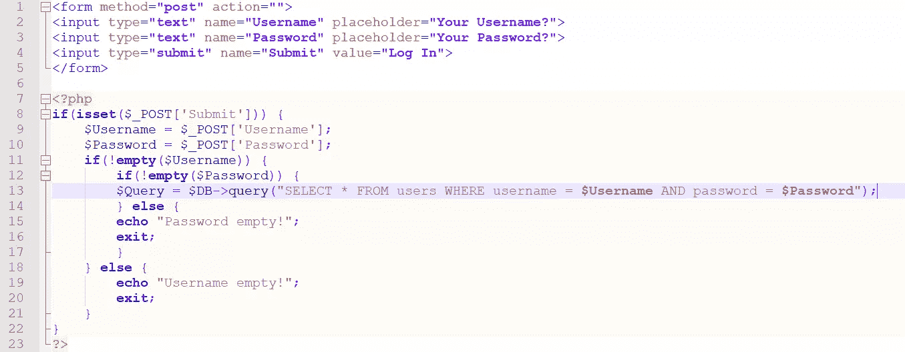
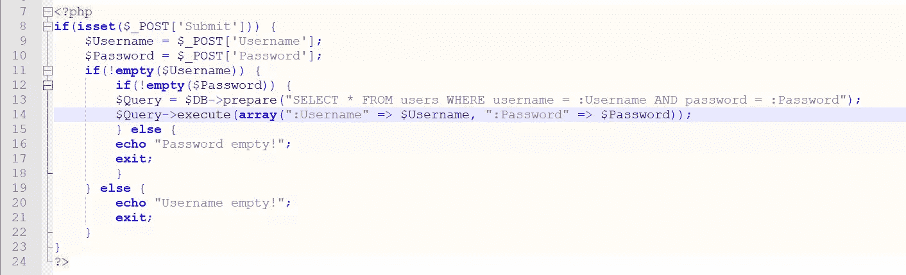
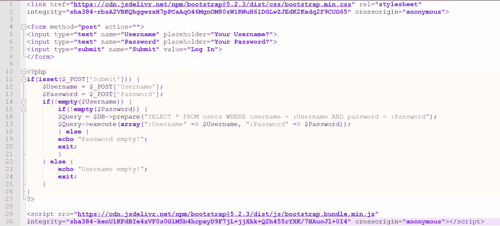
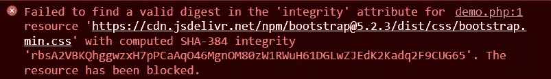
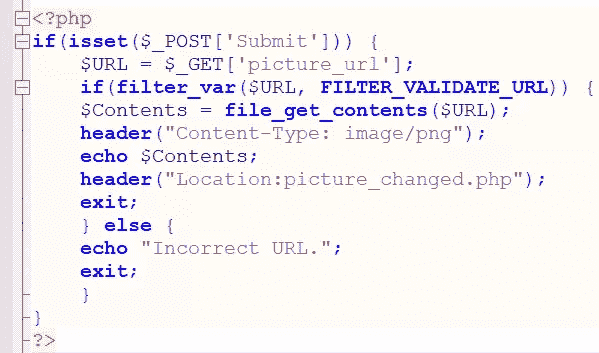
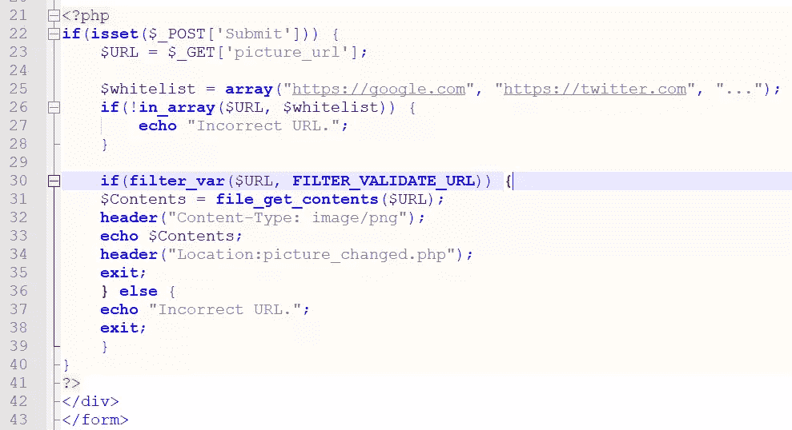

# Web 应用程序的 10 大安全漏洞

> 原文：<https://www.sitepoint.com/top-app-security-vulnerabilities/>

考虑你构建的应用程序的安全性是非常重要的。解决安全问题的方法有很多，但是一个强有力的开始方法是解决 OWASP(开放 Web 应用程序安全项目)确定的十大安全问题。在本文中，我们将介绍当前应用程序的十大安全漏洞。

OWASP 是一个致力于 web 应用程序安全的国际组织，该社区每四年发布一次 [OWASP 十大](https://owasp.org/www-project-top-ten/)报告，该报告概述了 web 应用程序最紧迫的安全问题。我们将从 PHP 开发人员的角度来看待这些漏洞，但它们与用任何编程语言构建应用程序都是相关的。

## OWASP 安全漏洞:概述和比较

2021 年 OWASP 十大漏洞列表列出了 web 应用程序最危险的十个安全漏洞。如果我们将当前的列表与 2017 年的列表进行比较，我们可以看到一些安全缺陷仍然在列表中，但在不同的地方，并且一些新的安全缺陷也在列表中。

下表对比了 2017 年和 2021 年的榜单。(2021 年名单中引入的安全缺陷以**粗体**列出，其余的只是重新排列。)

| 2017 年 OWASP 十大 | 2021 年 OWASP 十大 |
| --- | --- |
| # 1–注射 | # 1–破坏访问控制 |
| # 2–身份验证失败 | # 2–加密故障 |
| # 3–敏感数据暴露 | # 3–注射 |
| # 4–XML 外部实体(XXE) | **# 4–不安全的设计** |
| # 5–破坏访问控制 | # 5–安全错误配置 |
| # 6–安全错误配置 | # 6–易受攻击和过时的组件 |
| # 7–跨站点脚本(XSS) | # 7–识别和认证失败 |
| # 8–不安全的反序列化 | **# 8–软件和数据完整性故障** |
| # 9–使用具有已知漏洞的组件 | # 9–安全日志记录和监控故障 |
| # 10–记录和监控不足 | **# 10–服务器端请求伪造(SSRF)** |

该表表明，针对 web 应用程序的大多数安全缺陷并没有改变。改变的是开发人员试图修复这些缺陷时的方法。与流行的观点相反，避免这些安全缺陷很容易开始；我们只需要知道一些适用于特定安全问题的基本规则。

让我们深入研究一下这些安全问题。

## 中断的访问控制

根据 2021 年版的 OWASP，我们最应该关注的问题是访问控制被破坏。**破坏访问控制**就像它听起来的那样:当*我们控制应用程序访问的方式有缺陷的时候就会发生*。下图是一个破坏访问控制的例子。


```
<form method="post" action="">
<input type="text" name="Username" placeholder="Your Username?">
<input type="text" name="Password" placeholder="Your Password?">
<input type="submit" name="Submit" value="Log In">
</form>

<?php
if(isset($_POST['Submit'])) {
  $Username = $_POST['Username'];
  $Password = $_POST['Password'];
  if(!empty($Username)) {
    if(!empty($Password)) {
    header("loggedin_page.php");
    exit;
    }
  }
}
?> 
```

你看出问题了吗？该代码只是检查用户名和密码字段是否不为空。在数据库中运行几个查询来确保用户名和密码存在怎么样？去核实这个可疑的账户？这一部分已经被遗忘了。用户只需在用户名和密码字段中输入任何内容以确保它们不为空，点击**提交**，用户就会登录。

**为避免访问控制问题:**在将用户标记为已登录之前，始终根据数据库验证用户名(电子邮件)和密码字段。

## 加密失败

加密故障以前被称为“敏感数据泄露”。敏感数据暴露被重命名为“加密故障”，因为这解决了许多安全问题，而“敏感数据暴露”只解决了其中一个问题。

**密码故障**涵盖了加密数据的故障，经常导致敏感数据暴露。PHP 中的加密失败大多与密码有关:用除了设计得很慢的散列算法(想想 BCrypt 和 Blowfish)之外的任何算法对密码进行散列都是一种加密失败，因为其他类型的散列(MD5 和类似的)很容易被快速破解。

**为了避免加密失败:**确保存储在数据库中的所有密码都是用一种缓慢的算法散列的。我们建议您选择 Blowfish 或 BCrypt，因为这些算法长期使用是安全的，已经过安全专家的测试，并被证明可以抵御攻击。

如果有很多用户使用你的应用程序，你可能还想研究一下 [salting](https://en.wikipedia.org/wiki/Salt_(cryptography)) 。对于大量的哈希值，盐会减缓破解过程。

## 注入和不安全设计

注入是网络上最常讨论的安全问题。每个人都听说过:将用户输入传递给数据库，你就有了一个注入缺陷。注入攻击相对容易克服，但由于连接到数据库的应用程序数量庞大，它们仍然是一个问题。

下图描述了一个相关的代码示例。



```
<form method="post" action="">
<input type="text" name="Username" placeholder="Your Username?">
<input type="text" name="Password" placeholder="Your Password?">
<input type="submit" name="Submit" value="Log In">
</form>

<?php
if(isset($_POST['Submit'])) {
  $Username = $_POST['Username'];
  $Password = $_POST['Password'];
  if(!empty($Username)) {
    if(!empty($Password)) {
$Query = $DB->query("SELECT * FROM users WHERE username = $Username AND password = $Password");
    } else {
    echo "Password empty!";
    exit;
    }
  } else {
    echo "Username empty!";
    exit;
  }
}
?> 
```

上面显示的缺陷是显而易见的:当任何用户输入被传递到数据库时，任何人都可以做他们想到的任何事情。这个缺陷并不是 PHP 独有的。如果您使用任何其他编程语言将用户输入直接传递给数据库，您将会遇到完全相同的问题。

成功发动 SQL 注入攻击的后果可能非常广泛，但在大多数情况下，它们会跨越以下几个方面:

*   攻击者可以获取用户表的备份副本，对其他信息系统进行凭据填充攻击。
*   攻击者可以获得数据库内部的管理权限，然后修改或删除其中的表。

这两个行动，如果执行成功，将对任何业务有害。用户表的数据库转储将导致它在黑网上出售，一旦出售并且攻击者获利，其他攻击者将使用该数据发起凭据填充攻击。攻击者获得存储用户数据的数据库的管理权限也将导致混乱——不仅是对网站用户，而且对网站所有者，他们将受到负面公众监督的冲击。

为了避免 SQL 注入:对参数化查询使用 PDO。这种方法可以保护应用程序免受 SQL 注入攻击，因为数据是与查询本身分开发送的。

前面显示的这种查询方法如下图所示(注意第 13 行和第 14 行的变化)。



```
<?php
if(isset($_POST['Submit'])) {
  $Username = $_POST['Username'];
  $Password = $_POST['Password'];
  if(!empty($Username)) {
    if(!empty($Password)) {
    $Query = $DB->prepare("SELECT * FROM users WHERE username = :Username AND password = :Password");
    $Query->execute(array(":Username" => $Username, ":Password" => $Password));
    } else {
    echo "Password empty!";
    exit;
    }
  } else {
    echo "Username empty!";
    exit;
  }
}
?> 
```

另一方面，不安全的设计不同于注入，它有一个单独的类别。注入是不安全设计的一部分，但不安全的设计不是注入。**不安全设计**涵盖了代码是如何通过设计(也就是默认)编写的。这意味着，如果在默认情况下，您的代码将任何用户输入传递给数据库，或者如果它允许用户在不验证自己的情况下登录，或者如果它允许用户在不检查文件扩展名的情况下上传文件，或者如果它返回用户输入而不进行验证，那么您就有一个不安全的设计缺陷。

为了避免 SQL 注入、将用户输入传递给数据库以及不安全的设计缺陷，请确保您遵循 OWASP 或其他供应商概述的[安全编码指南。如果你遵循这些指导方针，你在这方面应该是安全的。](https://owasp.org/www-project-secure-coding-practices-quick-reference-guide/migrated_content)

## 安全错误配置和过时的组件

在第五和第六点，我们有安全错误配置和过时的组件。这两个缺陷与前面提到的不同，但它们也非常危险。

在探测应用程序中可能存在的安全错误配置漏洞时，攻击者会查看所有内容。他们会试图访问默认帐户，访问应该受到保护的页面，利用未打补丁的漏洞，等等。在这种情况下，我们唯一的希望是更新组件并修补各种漏洞。过时的组件通常带有严重的漏洞，如果被利用，可能会导致数据库泄漏和敏感数据暴露、服务器停机、名誉受损、罚款等等。

这就是为什么始终做到以下几点至关重要:

*   确保您的应用程序使用的组件总是最新的。
*   确保在一段时间不活动后强制注销用户。(即，确保会话在指定的时间段后过期。)
*   如果可能的话，可以考虑在提交表单或登录网站的某个部分失败一段时间后，使用验证码。
*   如果可能，使用 web 应用防火墙来保护您的 web 应用免受针对它的攻击，并考虑使用类似于 [Cloudflare](https://cloudflare.com/) 提供的服务来同时保护您的应用免受 DoS 和 DDoS 攻击。

为了避免错误的配置和过时的组件缺陷:确保你正在使用更新的组件，并且你的代码遵循[基本安全标准](https://owasp.org/www-project-secure-coding-practices-quick-reference-guide/migrated_content)，比如上面提到的那些。

为了使您的应用程序更加安全，请特别注意让用户验证自己身份的组件。

## 识别和认证失败

识别和身份验证失败以前被称为“身份验证失败”漏洞。当应用程序没有充分保护让用户验证自身身份的部分时，就会出现这种漏洞，这可能意味着以下一种或多种情况:

*   该应用程序不能通过使用验证码或其他措施来保护其表单免受暴力攻击。
*   应用程序的注册页面允许使用弱密码。(也就是说，应用程序没有定义最小密码长度。)
*   注册表缺少“重复密码”字段。(也就是说，用户注册时没有仔细检查他们的密码是否正确。)
*   密码更改表单无法抵御 [CSRF](https://owasp.org/www-community/attacks/csrf) (跨站点请求伪造)，让用户 B 代表用户 a 伪造请求。(也就是说，用户 B 可以发送一个特制的 URL，一旦打开，就会更改用户 a 的密码。)
*   可以枚举帐户:应用程序根据某个帐户是否存在于数据库中来提供不同种类的消息。
*   应用程序以纯文本形式存储密码。
*   在输入参数中指定用户名后，应用程序会返回用户名，而不会对其进行过滤。(这种方法导致了 **XSS 攻击**，攻击者能够将恶意脚本注入网站。)

**为避免识别和认证失败:**确保注册和登录表单构建安全。当然，说起来容易做起来难，但是按照下面列出的步骤去做，你就可以开始了:

*   确保所有注册用户使用安全密码。(强制执行八个字符或更多字符的策略。)
*   在一定次数(比如五次或更多)的不成功登录尝试后，向用户显示验证码。换句话说，强制速率限制。
*   确保用户提供的所有参数都是干净的。(也就是说，不要在没有验证的情况下将用户输入返回给用户。这样做将使 XSS 攻击成为可能。)
*   确保允许更改密码的表单能够抵御 CSRF。换句话说，生成一个在每次请求时都会改变的令牌，使攻击者无法伪造请求并冒充用户。
*   尽可能使用双因素身份验证，以避免针对您的登录表单的凭据填充攻击。

## 软件和完整性故障以及日志和监控问题

虽然与日志记录和监控机制相关的问题相对来说是不言自明的，但是软件和完整性故障可能不是。然而，这并没有什么神奇的:OWASP 社区只是告诉我们，我们应该验证我们正在使用的各种软件的完整性，不管它是否基于 PHP。想一想:你最后一次更新应用程序是什么时候？您是否验证了更新的完整性？加载到 web 应用程序中的资产呢？

看看下图中的代码示例。你注意到什么了吗？



```
<link href="https://cdn.jsdelivr.net/npm/bootstrap@5.2.3/dist/css/bootstrap.min.css" rel="stylesheet"
integrity="sha384-rbsA2VBKQhggwzxH7pPCaAg046MgnOM80zWlRWuH61DGLwZJEdK2Kadq2F9CUG65" crossorigin="anonymous">

<form method="post" action="">
<input type="text" name="Username" placeholder="Your Username?">
<input type="text" name="Password" placeholder="Your Password?">
<input type="submit" name="Submit" value="Log In">
</form>

<?php
if(isset($_POST['Submit'])) {
  $Username = $_POST['Username'];
  $Password = $_POST['Password'];
  if(!empty($Username)) {
    if(!empty($Password)) {
    $Query = $DB->prepare("SELECT * FROM users WHERE username = :Username AND password = :Password");
    $Query->execute(array(":Username" => $Username, ":Password" => $Password));
    } else {
    echo "Password empty!";
    exit;
    }
  } else {
    echo "Username empty!";
    exit;
  }
}
?>

<script src="https://cdn.jsdelivr.net/npm/bootstrap@5.2.3/dist/js/bootstrap.bundle.min.js"
integrity="sha384-kenUlKFdBIe4zVFOs0G1M5b4hcpxyD9F7jL+jjXkk+Q2h455rYXK/7HAuoJl+0I4" crossorigin="anonymous"></script> 
```

样式表和加载到其中的 JavaScript 文件都受到完整性属性的保护。完整性属性对于确保加载到 web 应用程序中的样式表和 JavaScript 文件不被篡改至关重要。如果文件的代码在 integrity 属性第一次生成时发生了任何变化，那么脚本就不会加载到 web 应用程序中，相反，我们会看到一个错误，如下图所示。



诚信无处不在。虽然在某些情况下，违反完整性会提供警告(如上图所示)，但在其他情况下，后果会更严重，可能会导致数据泄露。

为了确保您的代码没有被篡改，正确监控您的基础设施至关重要，但这种方法本身可能存在缺陷。当您的监控方法有缺陷时，您将无法捕捉错误。有些错误很小，如上图所示。有些错误更严重，例如当您的应用程序容易受到 SQL 注入、安全错误配置或上面列出的任何其他缺陷的攻击时。因此，请始终确保您的应用程序记录了与网站关键功能相关的任何异常情况。

这样做说起来容易做起来难，但是使用软件来监控你的网站的整个周边的未经授权的、与安全相关的事件是一个很好的开始。不幸的是，只有当您的应用程序相当小时，手动监控一切才是可行的，但从长远来看，这不会让您走得太远。

**为了减少软件和完整性故障，以及日志和监控问题:**研究 web 应用防火墙产品，例如由 [Cloudflare](https://cloudflare.com/) 、 [Sucuri](https://www.sucuri.net/) 或 [Imperva](https://imperva.com/) 提供的产品。请记住:向安全供应商付费总是比从数据泄露中恢复便宜。

## 服务器端请求伪造

2021 年 OWASP 十大问题列表中的最后一个重要问题是服务器端请求伪造(SSRF)。 **SSRF** 是一种攻击，它允许恶意方通过易受攻击的服务器向网站发送请求。SSRF 是 OWASP 列表中的一个新漏洞，它的行为与其 CSRF 表亲相似。CSRF 的目标是代表用户发出非预期的请求，而 SSRF 的目标是服务器。SSRF 强制应用程序向攻击者设置的位置发出请求。请看下图中的这段代码。(注意，对`header()`函数的调用应该在任何文本被写入页面之前*完成，否则调用可能会被忽略。)*



```
<?php
if(isset ($_POST['Submit'])) {
  $URL = $_GET('picture_url'];
  if(filter_var($URL, FILTER_VALIDATE_URL)) {
  $Contents = file_get_contents($URL);
  header("Content-Type: image/png");
  echo $Contents;
  header ("Location:picture_changed.php");
  exit;
  } else {
  echo "Incorrect URL.";
  exit;
  }
}
?> 
```

这段代码做了几件事。它首先检查在`picture_url` GET 参数中提供的 URL 是否是有效的 URL。然后，它将 URL 中的内容提供给用户，并将用户重定向到另一个 PHP 脚本。将 URL 中的内容提供给用户正是使这段 PHP 代码容易受到 SSRF 攻击的原因。显示用户提供的任何内容都是危险的，因为用户可以做以下任何事情:

*   提供服务器上内部文件的 URL 并读取敏感信息。例如，当提供类似于`file:///etc/passwd/`的 URL 时，易受 SSRF 攻击的应用程序会在屏幕上显示`/etc/passwd`文件。但是该文件包含拥有在服务器上运行的进程的用户的信息。
*   向应用程序提供文件在服务器上的 URL，然后读取文件。(想想在服务器上提供一个 web 服务的 URL，等等。)
*   向应用程序提供钓鱼页面的 URL，然后将其转发给用户。由于钓鱼页面会驻留在原始 URL(您的服务器的 URL)上，因此毫无防备的用户很有可能会上当受骗。

**避免 SSRF:** 可以说，避免这种攻击的最简单方法是采用一个可以使用的 URL 白名单。PHP web 应用程序中的白名单将类似于下图所示的代码。(特别注意第 25 到 28 行。)



```
<?php
if(isset ($_POST['Submit'])) {
  $URL = $_GET('picture_url'];

  $whitelist = array("https://google.com", "https://twitter.com", ""...");
  if(!in_array($URL, $whitelist)) {
    echo "Incorrect URL.";
  }

  if(filter_var($URL, FILTER_VALIDATE_URL)) {
  $Contents = file_get_contents($URL);
  header("Content-Type: image/png");
  echo $Contents;
  header ("Location:picture_changed.php");
  exit;
  } else {
  echo "Incorrect URL.";
  exit;
  }
}
?>
</div>
</form> 
```

现在，应用程序将 URL 的输出回显给用户不再是一个问题，因为 URL 列表是由您控制的。您的应用程序不再易受 SSRF 攻击！

## 摘要

在本文中，我们带您了解了可能危及 PHP web 应用程序的十大安全缺陷。其中一些缺陷于 2021 年首次进入 OWASP，另一些缺陷则是从较旧的 2017 版 OWASP 中重新洗牌而来。然而，有一个原则是不变的:它们都是相对危险的，应该适当地处理。

希望这篇文章对提高应用程序的安全性有所帮助。为了深入了解，我建议您[沉浸在 OWASP 的世界中，了解更多关于如何最好地保护您的 web 应用程序的信息](https://owasp.org/Top10/)。

## 分享这篇文章