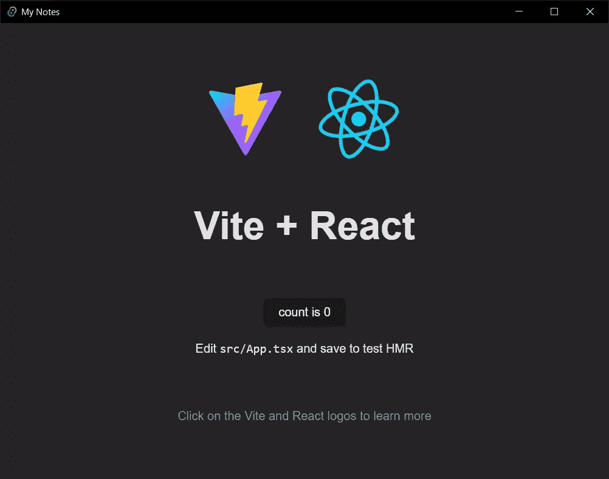
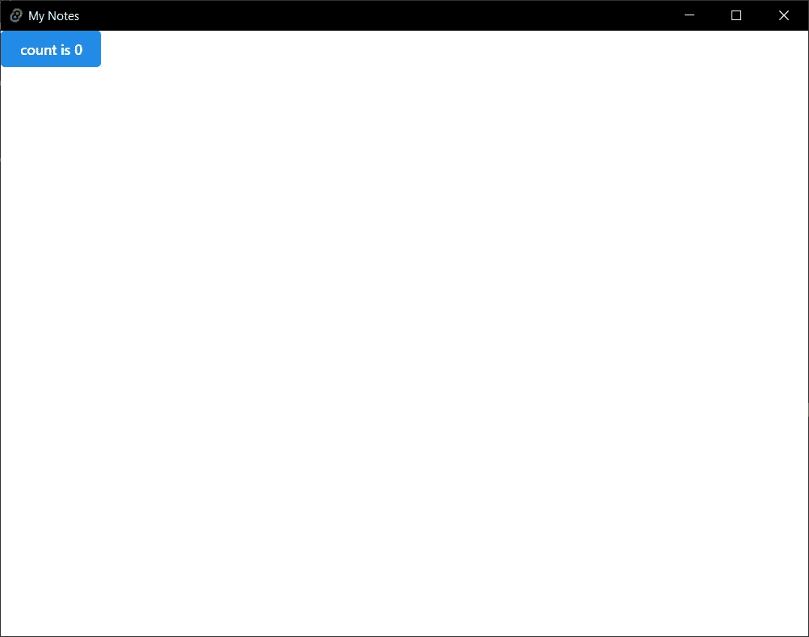
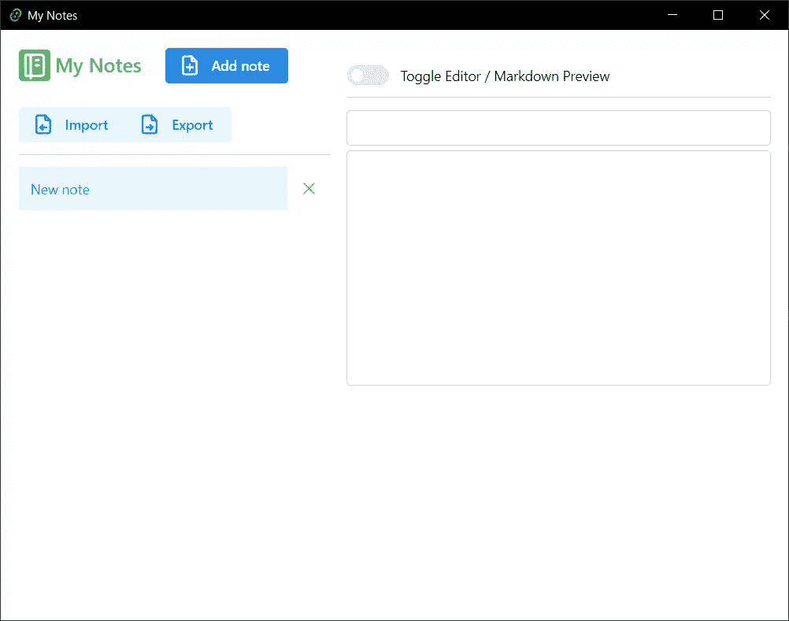
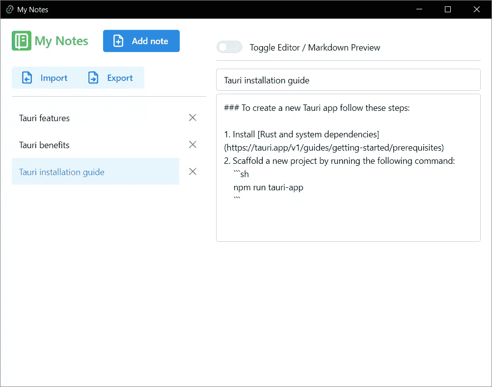
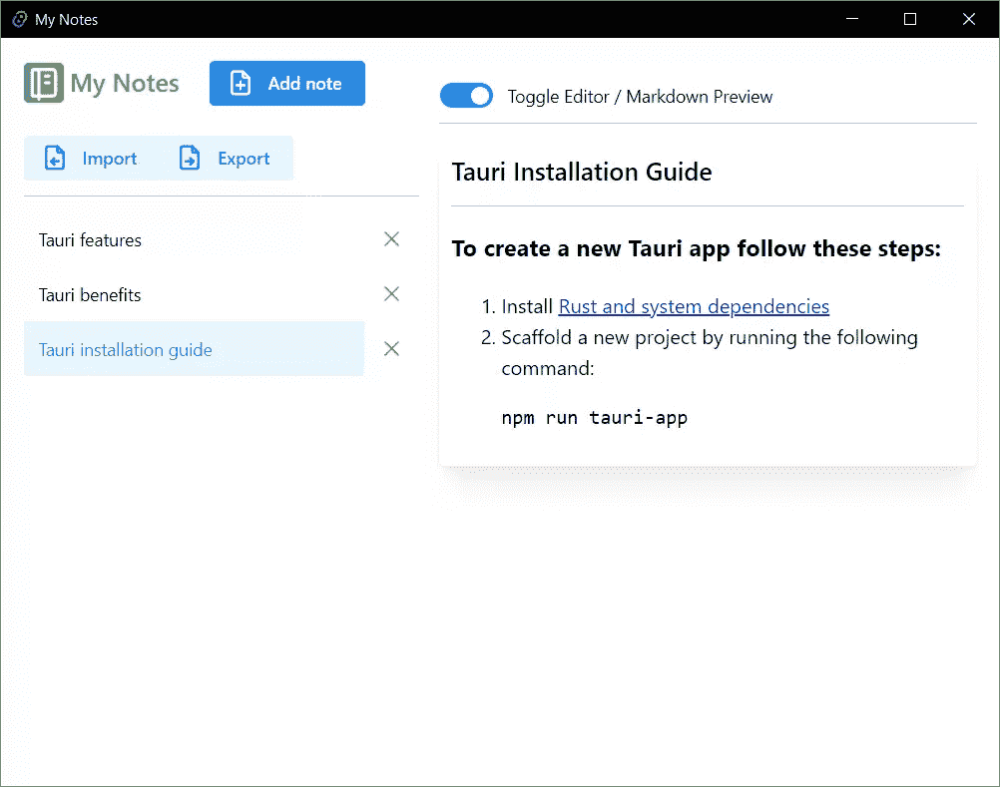
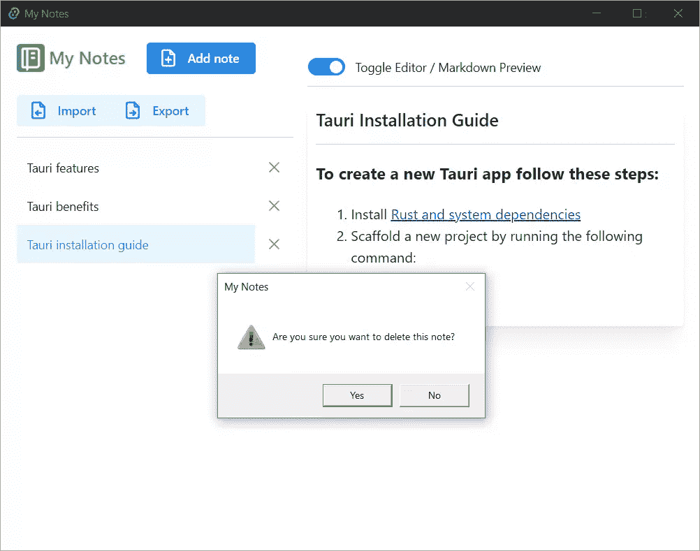
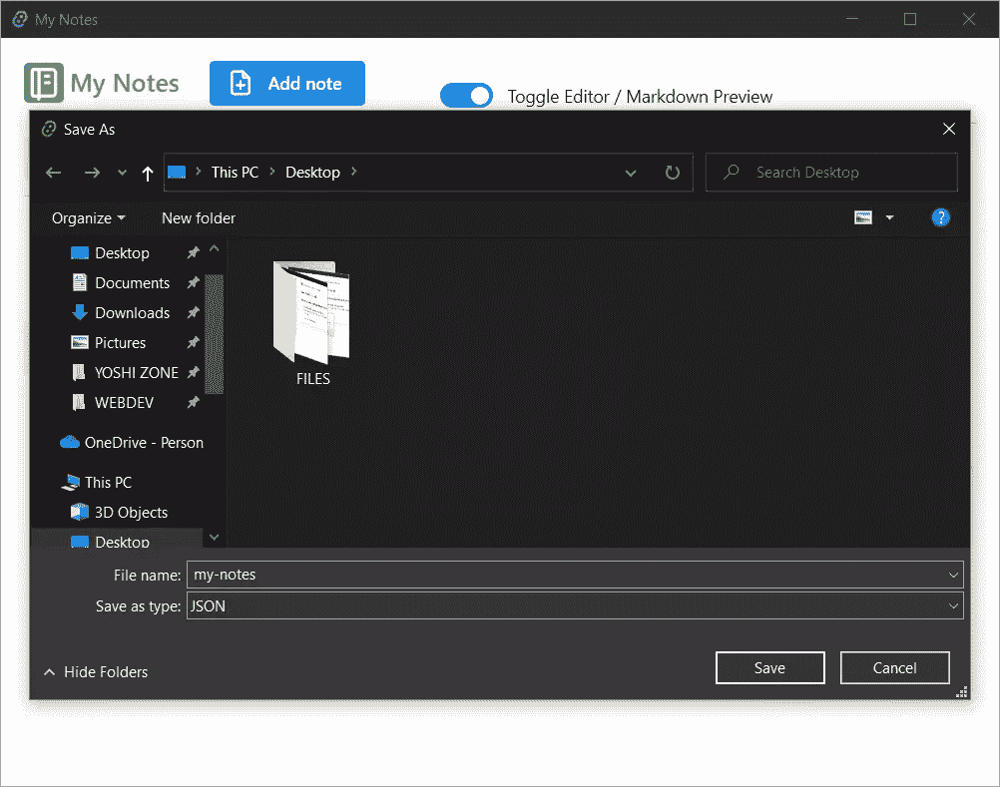
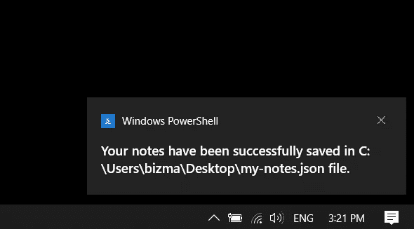

# Tauri:快速、跨平台的桌面应用

> 原文：<https://www.sitepoint.com/tauri-introduction/>

在本教程中，我们将探索 [Tauri](https://tauri.app) ，一个用于构建桌面应用的现代跨平台框架。

**内容:**

1.  [什么是 Tauri？](#toc_0)
2.  [金牛座 vs 电子:快速比较](#toc_1)
3.  [构建笔记应用](#toc_2)
    *   [入门](#toc_3)
    *   [创建基础应用功能](#toc_4)
    *   [导入必要的包](#toc_5)
    *   [设置应用存储和变量](#toc_6)
    *   [添加添加/删除注释功能](#toc_7)
    *   [创建 JSX 模板](#toc_8)
    *   [添加笔记标题和内容更新功能](#toc_9)
    *   [添加导入和导出音符的功能](#toc_10)
    *   [构建应用](#toc_11)
4.  [结论](#toc_12)

多年来， [Electron](https://www.sitepoint.com/tag/electron/) 是构建桌面应用程序的事实上的跨平台框架。Visual Studio Code、MongoDB Compass 和 Postman 都是用这个框架构建的应用程序的很好的例子。Electron 确实很棒，但是它有一些严重的缺点，这些缺点已经被其他一些现代框架克服了——Tauri 是其中最好的一个。

## Tauri 是什么？

Tauri 是一个现代化的框架，允许你在前端使用熟悉的 web 技术(如 HTML、CSS 和 JavaScript)设计、开发和构建跨平台应用，同时在后端利用强大的 [Rust 编程语言](https://www.rust-lang.org/)。

Tauri 是框架不可知的。这意味着你可以使用任何你选择的前端库——比如 Vue，React，Svelte，等等。此外，在基于 Tauri 的项目中使用 Rust 是完全可选的。您可以只使用 Tauri 提供的 JavaScript API 来构建整个应用程序。这不仅可以轻松构建一个新的应用程序，还可以利用您已经构建的 web 应用程序的代码库，将其转换为原生桌面应用程序，而几乎不需要修改原始代码。

让我们看看为什么我们应该使用 Tauri 而不是电子。

## Tauri vs 电子:快速比较

构建一个真正伟大的应用有三个重要因素。该应用程序必须小，快，安全。Tauri 在以下三个方面都优于 Electron:

*   Tauri 生成的二进制文件要小得多。从 Tauri 公布的[基准测试结果可以看出，即使是超级简单的 *Hello，World！*当用电子构建时，app 可以是巨大的(超过 120 MB)。相比之下，同一个 Tauri app 的二进制大小要小很多，不到 2 MB。这在我看来是相当可观的。](https://tauri.app/v1/references/benchmarks)
*   Tauri 应用程序的运行速度更快。从上面提到的同一个页面中，你还可以看到 Tauri 应用程序的内存使用量可能是同等电子应用程序的近一半。
*   Tauri 应用程序高度安全。在 Tauri 网站上，你可以了解到[Tauri 默认提供的所有内置安全特性](https://tauri.app/v1/references/architecture/security)。但是我想在这里提到的一个显著特性是，开发人员可以显式地启用或禁用某些 API。这不仅可以让你的应用更安全，还可以减少二进制文件的大小。

## 构建笔记应用程序

在本节中，我们将构建一个简单的笔记应用程序，它具有以下特性:

*   添加和删除注释
*   给笔记的标题重新命名
*   在 Markdown 中编辑笔记的内容
*   以 HTML 格式预览笔记内容
*   将笔记保存在本地存储中
*   将便笺导入和导出到系统硬盘

你可以在 GitHub 上找到所有的[项目文件。](https://github.com/sitepoint-editors/my-notes)

### 入门指南

要开始使用 Tauri，你首先需要[安装 Rust 及其系统依赖](https://tauri.app/v1/guides/getting-started/prerequisites)。它们因用户的操作系统而异，所以我不打算在这里探讨它们。请遵循文档中针对您的操作系统的说明。

准备就绪后，在您选择的目录中，运行以下命令:

```
npm create tauri-app
```

这将引导您完成安装过程，如下所示:

```
$ npm create tauri-app

We hope to help you create something special with Tauri!
You will have a choice of one of the UI frameworks supported by the greater web tech community.
This tool should get you quickly started. See our docs at https://tauri.app/

If you haven't already, please take a moment to setup your system.
You may find the requirements here: https://tauri.app/v1/guides/getting-started/prerequisites  

Press any key to continue...
? What is your app name? my-notes
? What should the window title be? My Notes
? What UI recipe would you like to add? create-vite (vanilla, vue, react, svelte, preact, lit) (https://vitejs.dev/guide/#scaffolding-your-first-vite-project)
? Add "@tauri-apps/api" npm package? Yes
? Which vite template would you like to use? react-ts
>> Running initial command(s)
Need to install the following packages:
  create-vite@3.2.1
Ok to proceed? (y) y

>> Installing any additional needed dependencies

added 87 packages, and audited 88 packages in 19s

9 packages are looking for funding
  run `npm fund` for details

found 0 vulnerabilities

added 2 packages, and audited 90 packages in 7s

10 packages are looking for funding
  run `npm fund` for details

found 0 vulnerabilities
>> Updating "package.json"
>> Running "tauri init"

> my-notes@0.0.0 tauri
> tauri init --app-name my-notes --window-title My Notes --dist-dir ../dist --dev-path http://localhost:5173

✔ What is your frontend dev command? · npm run dev
✔ What is your frontend build command? · npm run build
>> Updating "tauri.conf.json"
>> Running final command(s)

    Your installation completed.

    $ cd my-notes
    $ npm run tauri dev
```

请确保您的选择与我的选择相匹配，我的选择主要是搭建一个具有 Vite 和 TypeScript 支持的 React 应用程序，并安装 Tauri API 包。

先不要运行应用程序。首先，我们需要安装一些项目所需的附加包。在终端中运行以下命令:

```
npm install @mantine/core @mantine/hooks @tabler/icons @emotion/react marked-react
```

这将安装以下软件包:

*   Mantine :一个全功能的 React 组件库
*   [Tabler 图标](https://tabler-icons.io/):超过 3000 个像素完美的网页设计图标
*   [React 的情感](https://emotion.sh/docs/@emotion/react):React 中的简单造型
*   [标记-反应](https://github.com/sibiraj-s/marked-react):用于使用标记为的[将 Markdown 渲染为反应组件](https://marked.js.org/)

现在我们已经准备好测试应用程序，但在此之前，让我们看看项目是如何构建的:

```
my-notes/
├─ node_modules/
├─ public/
├─ src/
│   ├─ assets/
│   │   └─ react.svg
│   ├─ App.css
│   ├─ App.tsx
│   ├─ index.css
│   ├─ main.tsx
│   └─ vite-env.d.ts
├─ src-tauri/
│   ├─ icons/
│   ├─ src/
│   ├─ .gitignore
│   ├─ build.rs
│   ├─ Cargo.toml
│   └─ tauri.config.json
├─ .gitignore
├─ index.html
├─ package-lock.json
├─ package.json
├─ tsconfig.json
├─ tsconfig.node.json
└─ vite.config.ts
```

这里最重要的是，应用的 React 部分存储在`src`目录中，Rust 和其他特定于 Tauri 的文件存储在`src-tauri`中。在 Tauri 目录中我们唯一需要接触的文件是`tauri.conf.json`，我们可以在那里配置应用程序。打开这个文件，找到`allowlist`键。将其内容替换为以下内容:

```
"allowlist": {
  "dialog": {
    "save": true,
    "open": true,
    "ask": true
  },
  "fs": {
    "writeFile": true,
    "readFile": true,
    "scope": ["$DOCUMENT/*", "$DESKTOP/*"]
  },
  "path": {
    "all": true
  },
  "notification": {
    "all": true
  }
},
```

这里，出于安全原因，正如我上面提到的，我们只启用我们将在应用程序中使用的 API。我们还限制了对文件系统的访问，只有两个例外——`Documents`和`Desktop`目录。这将允许用户将他们的笔记导出到这些目录中。

在关闭文件之前，我们还需要更改一件事。找到`bundle`键。在那个键下面，你会找到`identifier`键。将其值更改为`com.mynotes.dev`。这是应用程序构建所必需的，因为标识符必须是唯一的。

最后我想说的是，在最后一个`windows`键中，您可以设置所有与窗口相关的设置:

```
"windows": [
  {
    "fullscreen": false,
    "height": 600,
    "resizable": true,
    "title": "My Notes",
    "width": 800
  }
]
```

如你所见，`title`键是根据你在安装时给它的值设置的。

好了，那么让我们终于开始应用程序。在`my-notes`目录中，运行以下命令:

```
npm run tauri dev 
```

您需要等待一段时间，直到 Tauri 安装完成，并且所有文件都第一次编译完毕。别担心。在后续的构建中，这个过程将会更快。当 Tauri 准备好时，它会自动打开应用程序窗口。下图显示了您应该看到的内容。



*注意:当应用程序在开发模式下运行或构建完成后，会在`src-tauri`中创建一个新的`target`目录，其中包含所有编译后的文件。在开发模式下，它们被放在`debug`子目录中，而在构建模式下，它们被放在`release`子目录中。*

好了，现在让我们根据我们的需要来调整文件。首先删除`index.css`和`App.css`文件。然后打开`main.tsx`文件，用以下内容替换它的内容:

```
import React from 'react'
import ReactDOM from 'react-dom/client'
import { MantineProvider } from '@mantine/core'
import App from './App'

ReactDOM.createRoot(document.getElementById('root') as HTMLElement).render(
  <React.StrictMode>
    <MantineProvider withGlobalStyles withNormalizeCSS>
      <App />
    </MantineProvider>
  </React.StrictMode>
)
```

这将设置 Mantine 的组件以供使用。

接下来，打开`App.tsx`文件并用以下内容替换其内容:

```
import { useState } from 'react'
import { Button } from '@mantine/core'

function App() {
  const [count, setCount] = useState(0)

  return (
    <div>
      <Button onClick={() => setCount((count) => count + 1)}>count is {count}</Button>
    </div>
  )
}

export default App
```

现在，如果您查看应用程序窗口，您应该会看到以下内容:



通过点按按钮来确保应用程序正常运行。如果有问题，您可能需要调试它。(参见以下注释。)

*注意:当应用程序在开发模式下运行时，您可以通过右击应用程序窗口并从菜单中选择**检查**来打开 DevTools。*

### 创建基础应用程序功能

现在让我们创建应用程序的框架。用以下内容替换`App.tsx`文件的内容:

```
import { useState } from 'react'
import Markdown from 'marked-react'

import { ThemeIcon, Button, CloseButton, Switch, NavLink, Flex, Grid, Divider, Paper, Text, TextInput, Textarea } from '@mantine/core'
import { useLocalStorage } from '@mantine/hooks'
import { IconNotebook, IconFilePlus, IconFileArrowLeft, IconFileArrowRight } from '@tabler/icons'

import { save, open, ask } from '@tauri-apps/api/dialog'
import { writeTextFile, readTextFile } from '@tauri-apps/api/fs'
import { sendNotification } from '@tauri-apps/api/notification'

function App() {
  const [notes, setNotes] = useLocalStorage({ key: "my-notes", defaultValue: [  {
    "title": "New note",
    "content": ""
  }] })

  const [active, setActive] = useState(0)
  const [title, setTitle] = useState("")
  const [content, setContent] = useState("")
  const [checked, setChecked] = useState(false)

  const handleSelection = (title: string, content: string, index: number) => {
    setTitle(title)
    setContent(content)
    setActive(index)
  }

  const addNote = () => {
    notes.splice(0, 0, {title: "New note", content: ""})
    handleSelection("New note", "", 0)
    setNotes([...notes])
  }

  const deleteNote = async (index: number) => {
    let deleteNote = await ask("Are you sure you want to delete this note?", {
      title: "My Notes",
      type: "warning",
    })
    if (deleteNote) {
      notes.splice(index,1)
      if (active >= index) {
        setActive(active >= 1 ? active - 1 : 0)
      }
      if (notes.length >= 1) {
        setContent(notes[index-1].content)
      } else {
        setTitle("")
        setContent("")
      } 
      setNotes([...notes]) 
    }
  }

  return (
    <div>
      <Grid grow m={10}>
        <Grid.Col span="auto">
          <Flex gap="xl" justify="flex-start" align="center" wrap="wrap">
            <Flex>
              <ThemeIcon size="lg" variant="gradient" gradient={{ from: "teal", to: "lime", deg: 90 }}>
                <IconNotebook size={32} />
              </ThemeIcon>
              <Text color="green" fz="xl" fw={500} ml={5}>My Notes</Text>
            </Flex>
            <Button onClick={addNote} leftIcon={<IconFilePlus />}>Add note</Button>
            <Button.Group>
              <Button variant="light" leftIcon={<IconFileArrowLeft />}>Import</Button>
              <Button variant="light" leftIcon={<IconFileArrowRight />}>Export</Button>
            </Button.Group>
          </Flex>

          <Divider my="sm" />

          {notes.map((note, index) => (
            <Flex key={index}>
              <NavLink onClick={() => handleSelection(note.title, note.content, index)} active={index === active} label={note.title} />
              <CloseButton onClick={() => deleteNote(index)} title="Delete note" size="xl" iconSize={20} />
            </Flex>
          ))} 
        </Grid.Col>
        <Grid.Col span={2}>
          <Switch label="Toggle Editor / Markdown Preview"  checked={checked} onChange={(event) => setChecked(event.currentTarget.checked)}/>

          <Divider my="sm" />

          {checked === false && (
            <div>
              <TextInput mb={5} />
              <Textarea minRows={10} />
            </div>
          )}
          {checked && (
            <Paper shadow="lg" p={10}>
              <Text fz="xl" fw={500} tt="capitalize">{title}</Text>

              <Divider my="sm" />

              <Markdown>{content}</Markdown>
            </Paper>
          )}
        </Grid.Col>
      </Grid>
    </div>
  )
}

export default App
```

这里有很多代码，让我们一点一点地探索。

### 导入必要的包

开始时，我们导入所有必需的包，如下所示:

*   降价分析器
*   马丁组件
*   马丁钩
*   核标准情报中心
*   Tauri APIs

```
import { useState } from 'react'
import Markdown from 'marked-react'

import { ThemeIcon, Button, CloseButton, Switch, NavLink, Flex, Grid, Divider, Paper, Text, TextInput, Textarea } from '@mantine/core'
import { useLocalStorage } from '@mantine/hooks'
import { IconNotebook, IconFilePlus, IconFileArrowLeft, IconFileArrowRight } from '@tabler/icons'

import { save, open, ask } from '@tauri-apps/api/dialog'
import { writeTextFile, readTextFile } from '@tauri-apps/api/fs'
import { sendNotification } from '@tauri-apps/api/notification'
```

### 设置应用存储和变量

在下一部分中，我们使用`useLocalStorage`钩子来设置笔记的存储。

我们还为当前笔记的标题和内容设置了两个变量，另外两个变量用于确定选择了哪个笔记(`active`)以及是否启用了 Markdown 预览(`checked`)。

最后，我们创建一个效用函数来处理音符的选择。当选择一个注释时，它将相应地更新当前注释的属性:

```
const [notes, setNotes] = useLocalStorage({ key: "my-notes", defaultValue: [  {
  "title": "New note",
  "content": ""
}] })

const [active, setActive] = useState(0)
const [title, setTitle] = useState("")
const [content, setContent] = useState("")
const [checked, setChecked] = useState(false)

const handleSelection = (title: string, content: string, index: number) => {
  setTitle(title)
  setContent(content)
  setActive(index)
}
```

### 添加添加/删除注释功能

接下来的两个函数用于添加/删除注释。

`addNote()`在`notes`数组中插入一个新的音符对象。它使用`handleSelection()`在添加新的音符后自动选择它。最后，它会更新注释。我们在这里使用 spread 操作符的原因是，否则状态不会被更新。这样，我们强制更新状态并重新呈现组件，因此注释将正确显示:

```
const addNote = () => {
  notes.splice(0, 0, {title: "New note", content: ""})
  handleSelection("New note", "", 0)
  setNotes([...notes])
}

const deleteNote = async (index: number) => {
  let deleteNote = await ask("Are you sure you want to delete this note?", {
    title: "My Notes",
    type: "warning",
  })
  if (deleteNote) {
    notes.splice(index,1)
    if (active >= index) {
      setActive(active >= 1 ? active - 1 : 0)
    }
    if (notes.length >= 1) {
      setContent(notes[index-1].content)
    } else {
      setTitle("")
      setContent("")
    } 
    setNotes([...notes]) 
  }
}
```

`deleteNote()`使用`ask`对话框来确认用户想要删除注释并且没有意外点击删除按钮。如果用户确认删除(`deleteNote = true`，则执行`if`语句:

*   音符从`notes`数组中移除
*   `active`变量被更新
*   当前便笺的标题和内容已更新
*   `notes`数组被更新

### 创建 JSX 模板

在模板部分，我们有两列。

在第一栏中，我们创建了应用程序的徽标和名称，以及用于添加、导入和导出注释的按钮。我们还循环遍历`notes`数组来呈现注释。这里，我们再次使用`handleSelection()`来在点击注释标题链接时正确更新当前注释的属性:

```
<Grid.Col span="auto">
  <Flex gap="xl" justify="flex-start" align="center" wrap="wrap">
    <Flex>
      <ThemeIcon size="lg" variant="gradient" gradient={{ from: "teal", to: "lime", deg: 90 }}>
        <IconNotebook size={32} />
      </ThemeIcon>
      <Text color="green" fz="xl" fw={500} ml={5}>My Notes</Text>
    </Flex>
    <Button onClick={addNote} leftIcon={<IconFilePlus />}>Add note</Button>
    <Button.Group>
      <Button variant="light" leftIcon={<IconFileArrowLeft />}>Import</Button>
      <Button variant="light" leftIcon={<IconFileArrowRight />}>Export</Button>
    </Button.Group>
  </Flex>

  <Divider my="sm" />

  {notes.map((note, index) => (
    <Flex key={index}>
      <NavLink onClick={() => handleSelection(note.title, note.content, index)} active={index === active} label={note.title} />
      <CloseButton onClick={() => deleteNote(index)} title="Delete note" size="xl" iconSize={20} />
    </Flex>
  ))} 
</Grid.Col>
```

在第二列中，我们添加了一个切换按钮，用于在笔记编辑和预览模式之间切换。在编辑模式下，有一个用于当前注释标题的文本输入和一个用于当前注释内容的文本区域。在预览模式下，标题由 Mantine 的`Text`组件呈现，内容由`marked-react`的`Markdown`组件呈现:

```
<Grid.Col span={2}>
  <Switch label="Toggle Editor / Markdown Preview"  checked={checked} onChange={(event) => setChecked(event.currentTarget.checked)}/>

  <Divider my="sm" />

  {checked === false && (
    <div>
      <TextInput mb={5} />
      <Textarea minRows={10} />
    </div>
  )}
  {checked && (
    <Paper shadow="lg" p={10}>
      <Text fz="xl" fw={500} tt="capitalize">{title}</Text>

      <Divider my="sm" />

      <Markdown>{content}</Markdown>
    </Paper>
  )}
</Grid.Col>
```

唷！代码太多了。下图显示了我们的应用程序在这一点上应该是什么样子。



太好了！我们现在可以添加和删除笔记，但无法编辑它们。我们将在下一节中添加这一功能。

### 添加笔记的标题和内容更新功能

在`deleteNote()`函数后添加以下代码:

```
const updateNoteTitle = ({ target: { value } }: { target: { value: string } }) => {
  notes.splice(active, 1, { title: value, content: content })
  setTitle(value)
  setNotes([...notes])
}

const updateNoteContent = ({target: { value } }: { target: { value: string } }) => {
  notes.splice(active, 1, { title: title, content: value })
  setContent(value)
  setNotes([...notes])
}
```

这两个函数分别替换当前便笺的标题和/或内容。为了使它们工作，我们需要将它们添加到模板中:

```
<TextInput value={title} onChange={updateNoteTitle} mb={5} />
<Textarea value={content} onChange={updateNoteContent} minRows={10} />
```

现在，当选择一个注释时，它的标题和内容将分别显示在输入文本和文本区中。当我们编辑笔记时，它的标题会相应地更新。

我添加了一些注释来演示应用程序的外观。下图是带有选定便笺及其内容的应用程序。



下图显示了我们的笔记的预览。



下一个图像显示了删除注释时显示的确认对话框。



太好了！我们需要让我们的应用程序变得真正酷的最后一件事是添加功能，将用户的笔记导出和导入到系统硬盘。

### 添加导入和导出注释的功能

在`updateNoteContent()`函数后添加以下代码:

```
const exportNotes = async () => {
  const exportedNotes = JSON.stringify(notes)
  const filePath = await save({
    filters: [{
      name: "JSON",
      extensions: ["json"]
    }]
  })
  await writeTextFile(`${filePath}`, exportedNotes)
  sendNotification(`Your notes have been successfully saved in ${filePath} file.`)
}

const importNotes = async () => {
  const selectedFile = await open({
    filters: [{
      name: "JSON",
      extensions: ["json"]
    }]
  })
  const fileContent = await readTextFile(`${selectedFile}`)
  const importedNotes = JSON.parse(fileContent)
  setNotes(importedNotes)
}
```

在第一个函数中，我们将 notes 转换成 JSON。然后我们使用`save`对话框保存注释。接下来，我们使用`writeTextFile()`函数将文件物理写入磁盘。最后，我们使用`sendNotification()`功能来通知用户笔记已经成功保存，以及保存的位置。

在第二个函数中，我们使用`open`对话框从磁盘中选择一个包含注释的 JSON 文件。然后用`readTextFile()`函数读取文件，将其 JSON 内容转换成对象，最后用新内容更新 notes 存储。

我们需要做的最后一件事是更改模板以利用上述函数:

```
<Button variant="light" onClick={importNotes} leftIcon={<IconFileArrowLeft />}>Import</Button>
<Button variant="light" onClick={exportNotes} leftIcon={<IconFileArrowRight />}>Export</Button>
```

下面是最后的[文件](https://github.com/sitepoint-editors/my-notes/blob/main/src/App.tsx)应该是什么样子。

在接下来的截图中，你可以看到**另存为**和**打开**对话框，以笔记形式出现的系统通知被保存。






恭喜你。您刚刚利用 Tauri 的强大功能构建了一个全功能的笔记桌面应用程序。

### 构建应用程序

现在，如果一切正常，并且您对最终结果满意，您就可以构建应用程序并获得您的操作系统的安装包。为此，请运行以下命令:

```
npm run tauri build
```

## 结论

在本教程中，我们探讨了 Tauri 是什么，为什么它比 electronic 更适合构建本机桌面应用程序，以及如何构建一个简单但功能齐全的 Tauri 应用程序。

我希望你和我一样喜欢这次短暂的旅行。要更深入地了解 Tauri world，请查看它的[文档](https://tauri.app/v1/guides/)并继续尝试它的强大功能。

**相关阅读:**

*   [用 Electron Forge 和 React 构建一个安全的桌面应用](https://www.sitepoint.com/electron-forge-react-build-secure-desktop-app/)
*   [用电子和角度构建桌面应用](https://www.sitepoint.com/build-a-desktop-application-with-electron-and-angular/)
*   [流星和电子有什么区别？](https://www.sitepoint.com/whats-the-difference-between-meteor-and-electron/)
*   [创建跨平台的电子桌面节点应用](https://www.sitepoint.com/desktop-node-apps-with-electron/)

## 分享这篇文章