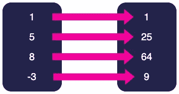

# 让你的 JavaScript 更实用的 5 种方法

> 原文：<https://www.sitepoint.com/make-javascript-functional/>

在本文中，我们将解释一下什么是函数式编程，然后通过五种方式让你的 JavaScript 在风格上更加函数化。

## 什么是函数式编程？

**[函数式编程](https://www.sitepoint.com/what-is-functional-programming/)** 是一种编程风格，它使用函数及其应用，而不是在*命令式*编程语言中使用的命令列表。

这是一种更抽象的编程风格，它植根于数学——特别是数学的一个分支，被称为**λ演算**，它是由数学家阿隆佐·邱奇在 1936 年作为可计算性的正式模型设计的。它由表达式和将一个表达式映射到另一个表达式的函数组成。从根本上说，这就是我们在函数式编程中所做的:我们使用函数将值转换成不同的值。

近年来，本文的作者爱上了函数式编程。我们开始使用鼓励更多功能风格的 JavaScript 库，然后通过学习如何在 [Haskell](https://www.haskell.org) 中编码直接进入了深层。

Haskell 是 20 世纪 90 年代开发的纯函数式编程语言，类似于 Scala 和 Clojure。使用这些语言，您被迫以函数式风格编码。学习 Haskel 让我们真正体会到了函数式编程提供的所有优势。

JavaScript 是一种**多范例**语言，因为它可以用于以命令式、面向对象或函数式风格编程。不过，它确实非常适合函数式风格，因为函数是**一级对象**，这意味着它们可以被赋给变量。这也意味着函数可以作为参数传递给其他函数(通常称为 **[回调](https://www.sitepoint.com/callbacks-javascript/)** )，也可以作为其他函数的返回值。返回其他函数或接受它们作为参数的函数被称为**高阶函数**，它们是函数式编程的基础部分。

近年来，用函数式风格编写 JavaScript 变得越来越流行，尤其是随着 React 的兴起。React 使用适合函数式方法的声明式 API，因此对函数式编程的原理有一个坚实的理解将会改进您的 React 代码。

## 函数式编程为什么这么好？

简而言之，函数式编程语言通常会产生简洁、清晰和优雅的代码。代码通常更容易测试，并且可以毫无问题地应用在多线程环境中。

如果你和许多不同的程序员交谈，你可能会从每个人那里得到完全不同的关于函数式编程的观点——从绝对讨厌它的人到绝对喜欢它的人。我们(这篇文章的作者)坐在“热爱它”的天平的一端，但是我们完全理解它不是每个人的那杯茶，特别是因为它是一种与通常的编程教学非常不同的方法。

然而，一旦你掌握了函数式编程的诀窍，一旦思维过程开始，它就会变成你的第二天性，改变你写代码的方式。

## 规则 1:净化你的功能

函数式编程的一个关键部分是确保你写的函数是“纯”的。如果您对这个术语不熟悉，那么一个**纯**函数基本上满足以下条件:

*   **具有参照透明性**。这意味着，给定相同的参数，函数将*总是*返回相同的值。任何函数调用都可以替换为返回值，程序仍将以同样的方式运行。
*   它没有副作用。这意味着该函数不会在函数范围之外进行任何更改。这可能包括更改全局值、登录到控制台或更新 DOM。

纯函数*必须*至少有一个参数，*必须*返回值。如果你想一想，如果他们不接受任何参数，他们就没有任何数据可以处理，如果他们不返回值，函数的意义何在？

纯函数可能一开始看起来并不完全必要，但是不纯的函数会导致程序的整体改变，导致一些严重的逻辑错误！

例如:

```
//impure
let minimum = 21
const checkAge = age => age >= minimum

//pure
const checkAge = age => {
    const minimum = 21
    return age >= minimum
} 
```

在不纯函数中，`checkAge`函数依赖可变变量`minimum`。例如，如果`minimum`变量在程序中稍后被更新，`checkAge`函数可能会返回一个带有相同输入的布尔值。

想象一下如果我们运行这个:

```
checkAge(20) >>  false 
```

现在，让我们想象一下，在代码的后面，一个`changeToUK()`函数将`minimum`的值更新为 18。

然后，想象我们运行这个:

```
checkAge(20) >> true 
```

现在函数`checkAge`计算出不同的值，尽管给定了相同的输入。

纯函数使您的代码更具可移植性，因为它们不依赖于作为参数提供的值之外的任何其他值。返回值永远不变的事实使得纯函数更容易测试。

一致地编写纯函数也消除了发生突变和副作用的可能性。

在函数式编程中，突变是一个很大的危险信号，如果你想了解更多原因，你可以在[JavaScript](https://www.sitepoint.com/variable-assignment-mutation-javascript/)中的变量赋值和突变指南中阅读。

为了使你的函数更加可移植，确保你的函数总是保持**纯净**。

## 规则 2:保持变量不变

声明变量是任何程序员首先要学习的事情之一。这变得很琐碎，但是在使用函数式编程风格时，这非常重要。

函数式编程的一个关键原则是，一旦变量被设置，它将在整个程序中保持该状态。

这是一个最简单的例子，说明代码中变量的重新分配/重新声明可能是一场灾难:

```
const n = 10
n = 11
TypeError: "Attempted to assign to readonly property." 
```

你想想，`n`的值不可能同时是`10`和`11`；这不合逻辑。

命令式编程中一个常见的编码实践是使用以下代码递增值:

```
let x = 5
x = x + 1 
```

在数学中，陈述`x = x + 1`是不合逻辑的，因为如果你从两边减去`x`，你将剩下`0 = 1`，这显然是不正确的。

因此，在 Haskell 中，你不能将一个变量赋给一个值，然后再将它赋给另一个值。为了在 JavaScript 中实现这一点，你应该遵循规则**总是使用`const`** 来声明你的变量。

## 规则 3:使用箭头函数

在数学中，函数的概念是将一组值映射到另一组值。下图显示了将左侧的一组值平方映射到右侧的一组值的函数:



这是它在数学中用箭头符号写成的样子:`f: x → x²`。这意味着函数`f`将值`x`映射到`x²`。

我们可以使用箭头函数来编写这个几乎相同的函数:

```
const f = x => x**2 
```

在 JavaScript 中使用函数风格的一个关键特性是[使用箭头函数](https://www.sitepoint.com/arrow-functions-javascript/)而不是常规函数。当然，这确实归结为风格，在常规函数上使用箭头函数实际上不会影响代码的“功能性”。

然而，在使用函数式编程风格时，最难适应的事情之一是每个函数都是输入到输出的映射。没有所谓的程序。我们发现使用箭头函数可以帮助我们更好地理解函数的过程。

箭头函数有一个隐式返回值，这确实有助于可视化这种映射。

箭头函数的结构——尤其是它们的隐式返回值——有助于鼓励编写纯函数，因为它们的字面结构是“输入映射到输出”:

```
args => returnValue 
```

我们喜欢强调的另一件事，尤其是在编写箭头函数时，是三元运算符的使用。如果你不熟悉**三元运算符**，它们是一个内嵌的`if...else`语句，形式为`condition ? value if true : value if false`。

你可以在[快速提示:如何在 JavaScript](https://www.sitepoint.com/javascript-ternary-operator/) 中使用三元运算符中读到更多关于它们的内容。

在函数式编程中使用三元运算符的一个主要原因是`else`语句的必要性。程序*必须*知道如果初始条件不满足该怎么做。例如，Haskell 强制执行一个`else`语句，如果没有给出，它将返回一个错误。

使用三元运算符的另一个原因是，它们是总是返回值的**表达式**，而不是可用于执行具有潜在副作用的动作的`if-else`语句。这对于箭头函数特别有用，因为这意味着您可以确保有一个返回值，并保持将输入映射到输出的形象。如果你不确定陈述和表达之间的细微差别，这本关于陈述和表达的指南非常值得一读。

为了说明这两个条件，下面是一个使用三元运算符的简单箭头函数的示例:

```
const action = state => state === "hungry" ? "eat cake" : "sleep" 
```

`action`函数将根据`state`参数的值返回“吃”或“睡”的值。

因此，总结一下:当使你的代码更具功能性时，你应该遵循这两条规则:

*   使用箭头符号编写函数
*   用三元运算符替换`if...else`语句

## 规则 4:删除 For 循环

鉴于在编程中使用 [`for`](https://www.sitepoint.com/javascript-for-loop/) 循环来编写迭代代码是如此普遍，说要避免它们似乎很奇怪。事实上，当我们第一次发现 Haskell 甚至没有任何类型的`for`循环操作时，我们甚至很难理解一些标准操作是如何实现的。然而，有一些非常好的理由说明为什么`for`循环没有出现在函数式编程中，我们很快发现，每种类型的迭代过程都可以在不使用`for`循环的情况下实现。

不使用`for`循环的最重要原因是它们依赖于可变状态。让我们看一个简单的`sum`函数:

```
function sum(n){
    let k = 0
    for(let i = 1; i < n+1; i++){
        k = k + i
    }
    return k
}
sum(5) = 15 // 1 + 2 + 3 + 4 + 5 
```

正如你所看到的，我们必须在`for`循环本身中使用一个`let`，并且在`for`循环中更新变量。

正如已经解释过的，这在函数式编程中是典型的坏习惯，因为函数式编程中的所有变量都应该是不可变的。

如果我们想编写所有变量都不可变的代码，我们可以使用递归:

```
const sum = n => n === 1 ? 1 : n + sum(n-1) 
```

如您所见，没有变量被更新。

我们当中的数学家显然知道所有这些代码都是不必要的，因为我们可以使用漂亮的求和公式`0.5*n*(n+1)`。但是这是一个很好的方式来说明`for`循环的可变性与递归之间的区别。

递归并不是可变性问题的唯一解决方案，尤其是当我们处理数组的时候。JavaScript 有许多内置的高阶数组方法，这些方法循环遍历数组中的值，而不会改变任何变量。

例如，假设我们想给数组中的每个值加 1。使用命令式方法和一个`for`循环，我们的函数可能看起来像这样:

```
function addOne(array){
    for (let i = 0; i < array.length; i++){
        array[i] = array[i] + 1
}
    return array
}

addOne([1,2,3]) === [2,3,4] 
```

然而，代替`for`循环，我们可以利用 JavaScript 的内置`map`方法，并编写一个如下所示的函数:

```
const addOne = array => array.map(x => x + 1) 
```

如果您以前从未遇到过`map`函数，那么绝对有必要了解一下它们——以及 JavaScript 内置的所有高阶数组方法，比如`filter`,尤其是如果您对 JavaScript 中的函数式编程非常感兴趣的话。你可以在[不可变数组方法:如何编写非常干净的 JavaScript 代码](https://www.sitepoint.com/immutable-array-methods-javascript/)中找到更多关于它们的信息。

Haskell 根本没有`for`循环。为了使您的 JavaScript 更具功能性，请尽量避免使用 for 循环，而是使用递归和内置的高阶数组方法。

## 规则 5:避免类型强制

当用 JavaScript 等不需要类型声明的语言编程时，很容易忘记数据类型的重要性。JavaScript 中使用的七种原始数据类型是:

*   数字
*   线
*   布尔代数学体系的
*   标志
*   比吉斯本
*   不明确的
*   空

Haskell 是一种需要类型声明的强类型语言。这意味着，在执行任何功能之前，您需要使用[亨德利-米尔纳系统](https://en.wikipedia.org/wiki/Hindley%E2%80%93Milner_type_system)指定传入数据的类型和传出数据的类型。

例如:

```
add :: Integer -> Integer -> Integer
add x y = x + y 
```

这是一个非常简单的函数，将两个数相加(`x`和`y`)。向程序解释每个函数的数据类型似乎有点可笑，包括像这样非常简单的函数，但最终它有助于展示函数是如何工作的，以及它预期返回什么。这使得代码*更容易调试，尤其是当它开始变得更加复杂的时候。*

类型声明遵循以下结构:

```
functionName :: inputType(s) -> outputType 
```

当使用 JavaScript 时，类型强制可能是一个大问题，因为 JavaScript 有各种各样的方法可以用来(甚至*滥用*)解决数据类型不一致的问题。以下是最常见的错误以及如何避免它们:

*   **串联**。`"Hello" + 5`评估为`"Hello5"`，这是不一致的。如果你想把一个字符串和一个数值连接起来，你应该写`"Hello" + String(5)`。
*   **布尔语句和 0** 。在 JavaScript 中，`if`语句中`0`的值相当于`false`。这可能导致懒惰的编程技术，忽略检查数字数据是否等于`0`。

例如:

```
const even = n => !(n%2) 
```

这是一个计算一个数是否是偶数的函数。它使用`!`符号将`n%2 ?`的结果强制转换为布尔值，但是`n%2`的结果不是布尔值，而是一个数字(不是`0`就是`1`)。

像这样的黑客，虽然看起来很聪明，减少了你写的代码量，但是破坏了函数式编程的类型一致性规则。因此，编写这个函数的最佳方式应该是这样的:

```
// even :: Number -> Number
const even = n => n%2 === 0 
```

另一个重要的概念是确保数组中的所有数据值都是同一类型。JavaScript 并不强制这样做，但是当您想要使用更高阶的数组方法时，没有相同的类型会导致问题。

例如，将数组中的所有数字相乘并返回结果的`product`函数可以用以下类型声明注释编写:

```
// product :: [ Number ] -> Number
const product = numbers => numbers.reduce((s,x) => x * s,1) 
```

在这里，类型声明表明函数的输入是一个包含类型为`Number`的元素的数组，但是它只返回一个数字。类型声明清楚地表明了这个函数的输入和输出是什么。显然，如果数组不仅仅由数字组成，这个函数就不起作用。

Haskell 是一种强类型语言，而 JavaScript 是弱类型语言，但是为了使 JavaScript 更具功能性，您应该在声明函数之前编写类型声明注释，并确保避免类型强制快捷方式。

我们在这里还应该提到，如果你想要一个强类型的 JavaScript 替代方案来为你实现类型一致性，你显然可以求助于 [TypeScript](https://www.typescriptlang.org) 。

## 结论

总而言之，这里有五条规则可以帮助你实现功能代码:

*   保持你的函数*纯净*。
*   总是使用*常量*声明变量和函数。
*   使用*箭头*符号表示函数。
*   避免使用`for` *循环*。
*   使用类型声明注释并避免类型强制快捷方式。

虽然这些规则不能保证你的代码完全是功能性的，但是它们会让你的代码功能性更强，更简洁，更清晰，更容易测试。

我们真的希望这些规则能像帮助我们一样帮助你！我们都是函数式编程的忠实粉丝，我们强烈鼓励任何程序员使用它。

如果你想深入研究函数式 JavaScript，我们强烈推荐阅读弗里斯比教授的《函数式编程指南》 ，这本书可以在网上免费获得。如果你想一直学习 Haskell，我们建议你使用[试用 Haskell](https://tryhaskell.org) 互动教程，阅读优秀的 *[学习 Haskell 以获得更好的](http://learnyouahaskell.com)* 书，这本书也可以免费在线阅读。

## 分享这篇文章