# Google Sheets API v4 集成指南

> 原文：<https://www.sitepoint.com/google-sheets-api-v4-integration-guide/>

Google web 服务已经成为许多项目基础设施的重要组成部分，是一个至关重要的集成元素。我们再也无法想象没有它们的在线服务。与此同时，谷歌开发人员正在努力扩展他们服务的功能，开发新的 API，并增加我们数据的安全性。通常，更新会顺利地发布给用户，不需要您做任何更改。但这次不是用新的 Google Sheets API。

## **前言:进步是一种痛苦**

2021 年，谷歌推出了其 [Sheets API](https://developers.google.com/sheets/api) 的第 4 版，与之前的版本不兼容。这影响了数据安全和隐私。Sheets API v3 支持[延长至 2021 年 8 月](https://cloud.google.com/blog/products/g-suite/migrate-your-apps-use-latest-sheets-api)，为开发者提供更多时间迁移到新的 API 版本。自从停止支持 v3 API 以来，许多 JavaScript 开发人员都面临着迁移问题。尽管谷歌向[提供了一份详细的迁移指南](https://developers.google.com/sheets/api/guides/migration)，但和往常一样，其中遗漏了几个关键细节。

作为 AnyChart 的支持工程师，我已经收到并继续处理来自我们的 [JS 图表库](https://www.sitepoint.com/best-javascript-charting-libraries/)用户的大量帮助请求，这些用户突然面临从他们的 Google 电子表格中输入可视化数据的问题。这表明这个问题一直是而且仍然是一个热门话题。所以我决定为其他人制作一个快速的 Google Sheets API v4 集成指南。

本文展示了在 Google Sheets 上访问电子表格文档并从中加载数据的基本方法，这显然是最常见的用例。

## **从 JavaScript 访问谷歌电子表格**

要从 JavaScript 代码访问 Google Sheets 电子表格，您需要[Google-API-JavaScript-client](https://github.com/google/google-api-javascript-client/blob/master/docs/start.md)和 [Sheets API](https://developers.google.com/sheets/api/quickstart/js) ，以及一个已配置的 Google 项目和一个文档本身。

让我一步一步地告诉你这一切。

## **谷歌端配置**

### **1)创建一个项目**

1.  进入[谷歌云平台](https://console.developers.google.com/):

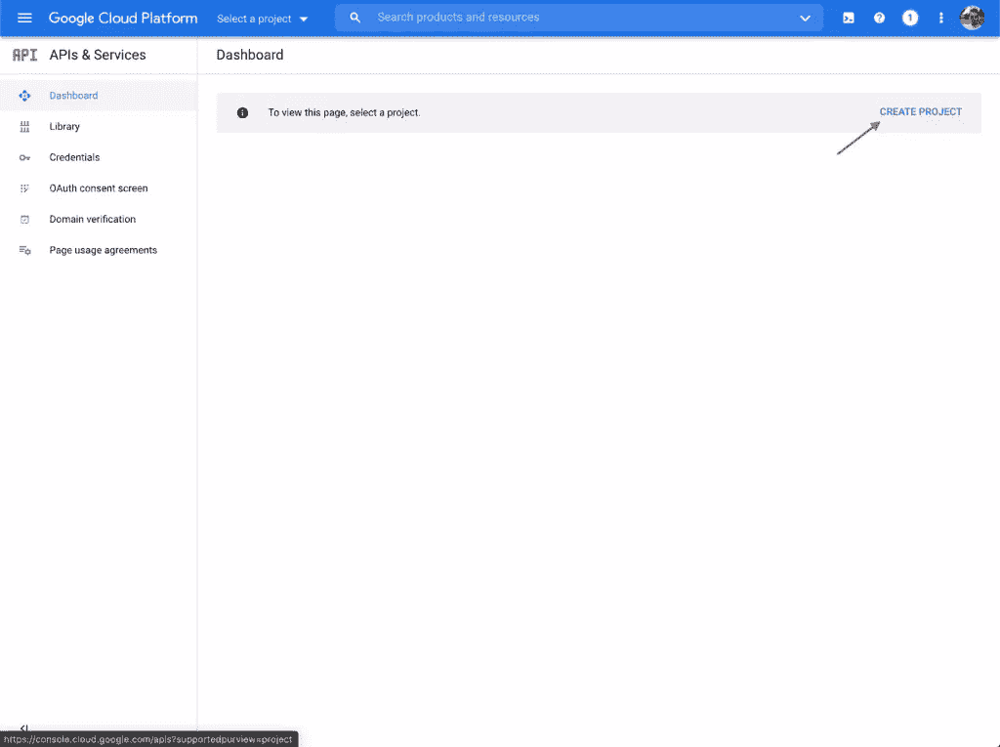

2.  创建新项目:

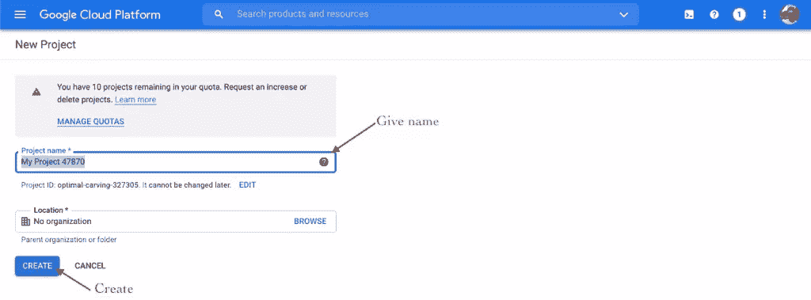

### **2)启用 API**

1.  转到“启用 API 和服务”:

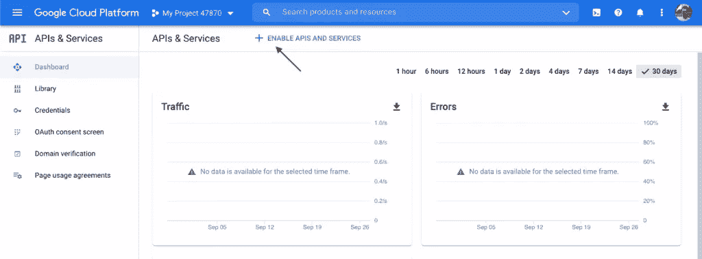

2.  在搜索栏中键入“google sheets”来查找 API:

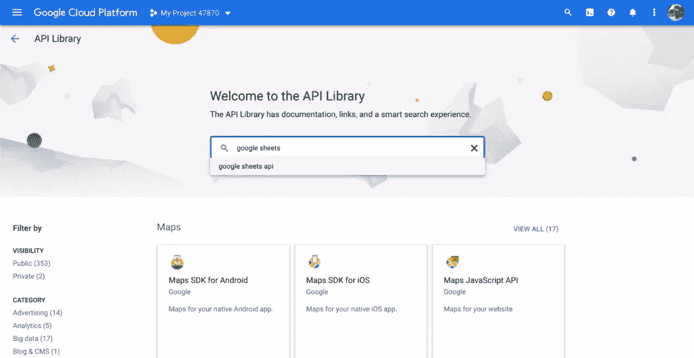

3.  选择“Google Sheets API”:

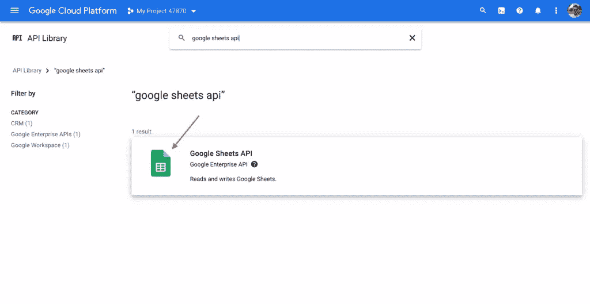

4.  启用 Google Sheets API:

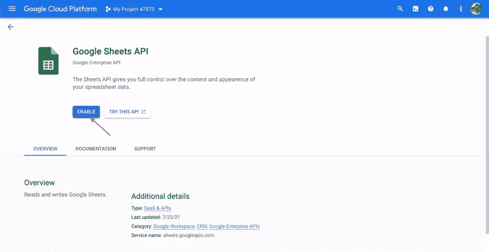

### **3)凭证**

1.  转到“凭据”选项卡:

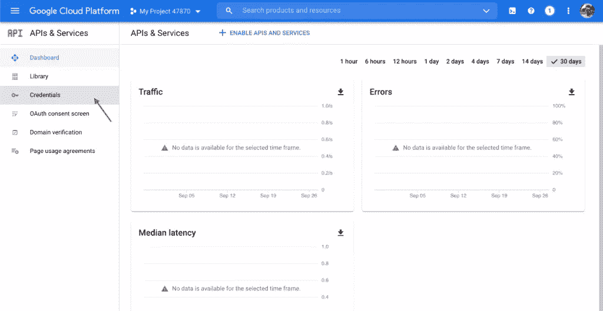

2.  点击“创建凭证”并选择“API 密钥”:

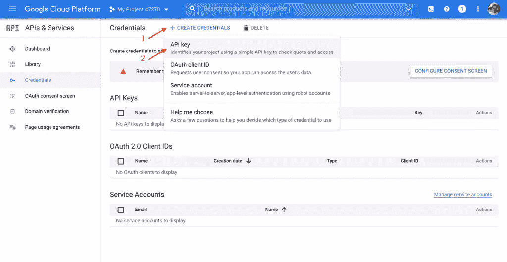

**注意:复制并存储 API 密钥。**稍后您会在 JavaScript 代码中用到它(JS 代码中的`{GOOGLE_API_KEY}`)。

c)点击“限制键”:

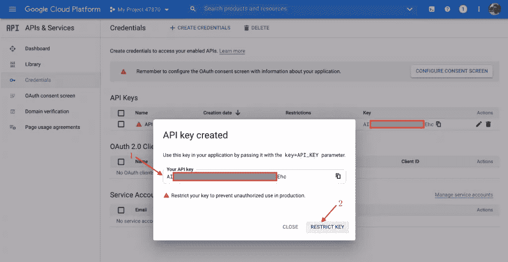

**注意:** **在存储和传输过程中保持 API 密钥的安全**。谷歌在[的这篇文章](https://cloud.google.com/docs/authentication/api-keys#securing_an_api_key)中很好地介绍了这方面的最佳实践。以下所有代码片段都是为了演示目的而简化的，并不描述安全方面。

d)在“Restrict key”下拉菜单中，找到“Google Sheets API”项目:

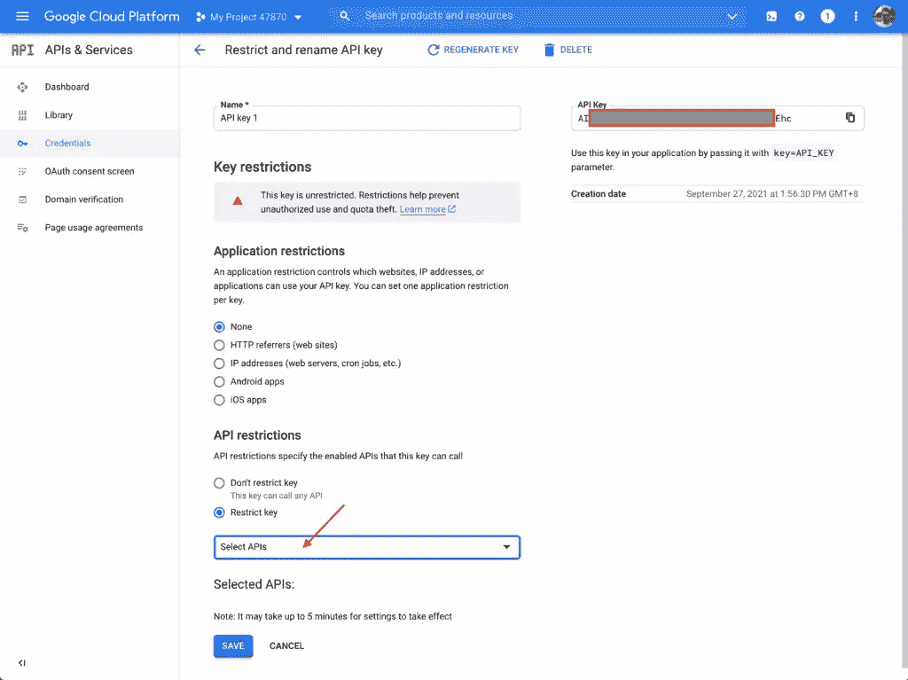

e)选择它，点击“确定”和“保存”:

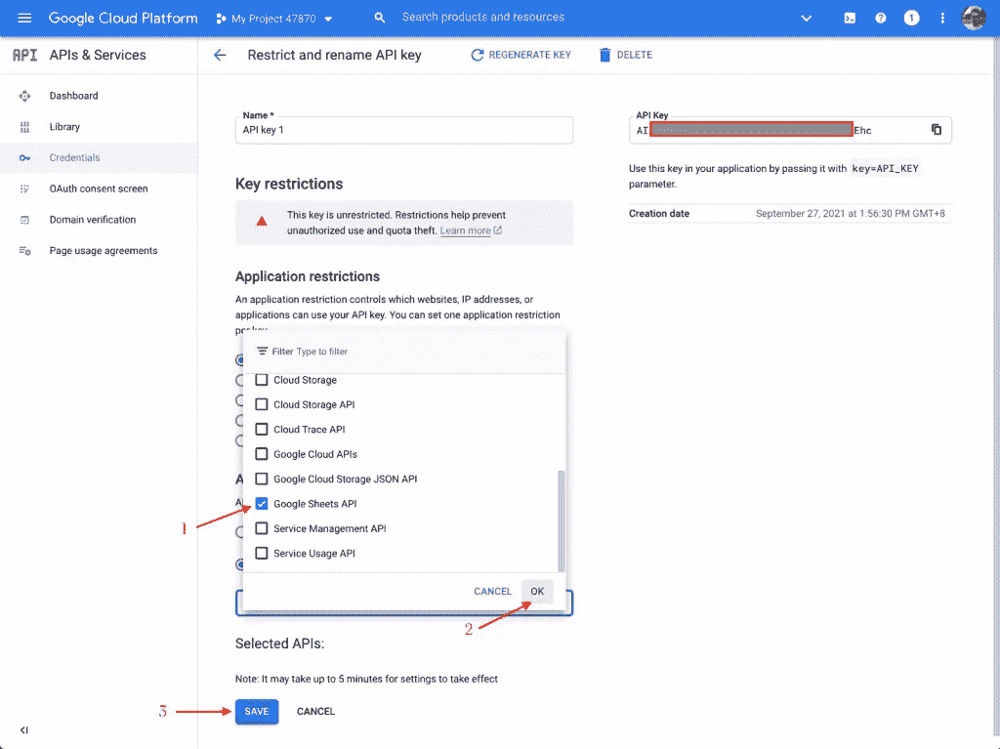

### **4)创建一个文档**

1.  像往常一样创建一个 Google Sheets 文档，并用一些数据填充它。用您的数据为工作表设置一个名称或复制默认名称—稍后在 JS 代码( *{SHEET_NAME}* )中会用到它。

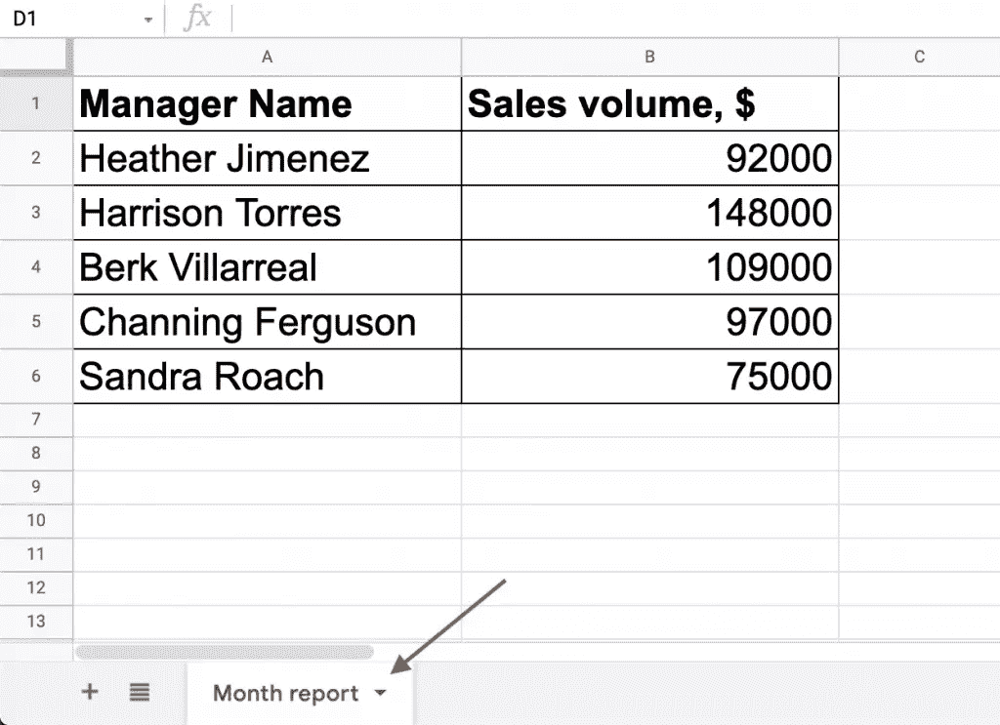

2.  允许通过链接访问文档。你可以点击“分享”按钮，选择“任何有链接的人”。(“查看者”权限就足够了。)

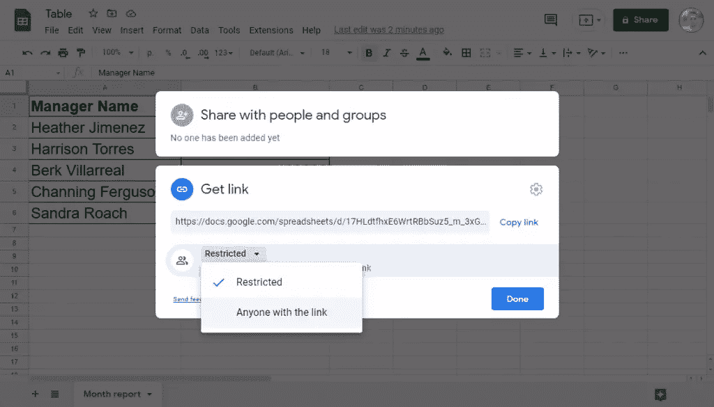

3.  复制文档的 ID。它可以在文档的 URL 中“/spreadsheets/d/”和“/edit”部分之间找到。在 JS 代码( *{SPREADSHEET_ID}* )的后面将需要这个 ID。


Google 端的所有必要设置都完成了。让我们来看一个应用程序。

## **从 JavaScript 应用程序访问谷歌电子表格数据**

现在，我将解释如何创建一个简单的 JavaScript 应用程序，从电子表格中获取数据并显示给用户。为了将该应用程序连接到 Sheets API，我将使用 Google API JavaScript 客户端库(又名 gapi)，在其 [GitHub 库](https://github.com/google/google-api-javascript-client)中对此进行了很好的描述。

### **1)创建一个基本的 JavaScript 应用**

首先，使用[直接链接](https://apis.google.com/js/api.js)将 gapi 库包含在您的页面中。

将`<table>`标签添加到 HTML 代码中，并为表格及其未来内容应用您喜欢的 CSS 代码。

在 JavaScript 代码中，创建一个将用于获取数据的函数。

```
const start = () => {};
```

在这个函数中，用前面创建的 Google API 键初始化 gapi 客户机。

```
 gapi.client.init({
    'apiKey': '{GOOGLE_API_KEY}',
    'discoveryDocs': ["https://sheets.googleapis.com/$discovery/rest?version=v4"],
  }) 
```

然后通过 gapi 客户机执行一个获取值的请求。在请求中，您应该提供电子表格 ID 和您想要访问的数据所在的单元格范围。

```
.then(() => {
    return gapi.client.sheets.spreadsheets.values.get({
      spreadsheetId: '{SPREADSHEET_ID}',
      range: '{SHEET_NAME}!{DATA_RANGE}', // for example: List 1!A1:B6
    })
  }) 
```

如果所有设置都正确，解析后的承诺将返回一个包含提取数据的响应。现在，您可以从响应中获取数据，并使用简单的 JS 脚本填充 HTML 表。

```
.then((response) => {
    // parse the response data
    const loadedData = response.result.values;

    // populate the HTML table with the data
    const table = document.getElementsByTagName('table')[0];

    // add column headers
    const columnHeaders = document.createElement('tr');
    columnHeaders.innerHTML = `<th>${loadedData[0][0]}</th>
<th>${loadedData[0][1]}</th>`;
    table.appendChild(columnHeaders);

    // add table data rows
    for (let i = 1; i < loadedData.length; i++) {
      const tableRow = document.createElement('tr');
      tableRow.innerHTML = `<td>${loadedData[i][0]}</td>
<td>${loadedData[i][1]}</td>`;
      table.appendChild(tableRow);
    }
  }).catch((err) => {
  	console.log(err.error.message);
  }); 
```

要执行代码，从 gapi 库中调用 *load()* 函数，并将上面创建的函数作为参数传递。

```
gapi.load('client', start);
```

最终的应用程序如下所示。欢迎您使用来自 Google Sheets 的数据在 [JSFiddle](https://jsfiddle.net/7ngrfpxk/) 上查看这个 HTML 表格的完整代码模板。要让您自己的东西像这样工作，只需用您自己的信息替换 *{GOOGLE_API_KEY}* 、 *{SPREADSHEET_ID}* 、 *{SHEET_NAME}* 和 *{DATA_RANGE}* (不要保留括号)。

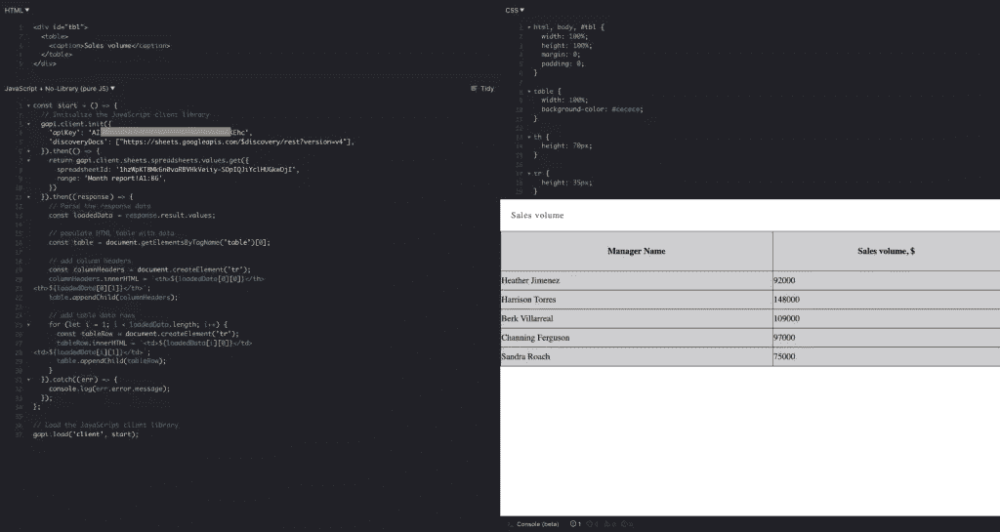

### **2)修补输出——以图表形式显示数据**

在现实应用中，简单的 HTML 表格通常是不够的；我们想要可视化和分析数据。让我向您展示如何创建一个仪表板来增加数据的可读性，并使我们更接近真实世界的用例。当我在值班时，请求帮助进行 Google Sheets API 集成，这实际上是我分享的第一个例子，基本上，几乎总是最后一个，因为它非常说明问题，不需要进一步的帮助。

所以，让我们使用 [AnyChart JS 库](https://anychart.com/)进行数据可视化。它包括[柱形图](https://docs.anychart.com/Basic_Charts/Column_Chart)和[饼图](https://docs.anychart.com/Basic_Charts/Pie_Chart)，对于这个简单的仪表盘来说已经足够了。

首先，将 AnyChart 的[基本 JS 模块](https://docs.anychart.com/Quick_Start/Modules#base)添加到 HTML:

```
<script src="https://cdn.anychart.com/releases/8.11.0/js/anychart-base.min.js"></script>
```

此外，为仪表板容器添加`<div>`标签，并为每个容器应用合适的 ID:

```
<div id="container1"></div>
<div id="container2"></div>
```

大多数 JavaScript 代码完全保持不变。我将重新编写处理表单 API 响应的代码。

因此，保持 JS 代码的第一部分不变:

```
const start = () => {
  // Initialize the JavaScript client library
  gapi.client.init({
    'apiKey': '{GOOGLE_API_KEY}',
    'discoveryDocs': ["https://sheets.googleapis.com/$discovery/rest?version=v4"],
  }).then(() => {
    return gapi.client.sheets.spreadsheets.values.get({
      spreadsheetId: '{SPREADSHEET_ID}',
      range: '{SHEET_NAME}!{DATA_RANGE}', // for example: List 1!A1:B6
    })
  }).then((response) => {

In the response handler, parse the data to compose a structure compatible with the AnyChart API:

    const loadedData = response.result.values;
    const parsedData = {
      'header': loadedData.shift(),
      'rows': loadedData,
    };

Now we’ve got everything we need to create and configure charts for the dashboard: 

    // create an instance of a column chart
    const columnChart = anychart.column();

    // set the data
    columnChart.data(parsedData);

    // configure chart appearance settings
    columnChart.title('Sales volume by manager');
    columnChart.xAxis().title('Manager');
    columnChart.yAxis().title('Sales volume, $');

    // set the container element and draw the chart
    columnChart.container('container1').draw();

    // create a pie chart likewise
    const pieChart = anychart.pie(parsedData);
    pieChart.title('Sales volume distribution in the department');
    pieChart.legend().itemsLayout('vertical').position('right');
    pieChart.container('container2').draw();

Then goes the same ending part as with the HTML table — let’s recall it just in case:

  }).catch((err) => {
  	console.log(err.error.message);
  });
};

// load the JavaScript client library
gapi.load('client', start); 
```

下面是生成的仪表板的外观。您可以在 [JSFiddle](https://jsfiddle.net/82hn9dmL/) 上使用 v4 API 查看这个仪表板的完整模板代码，可视化来自 Google Sheets 的数据。要像这样获得自己的项目，只需将自己的信息替换为 *{GOOGLE_API_KEY}* 、 *{SPREADSHEET_ID}* 、 *{SHEET_NAME}* 、 *{DATA_RANGE}* (并且不要保留大括号)。

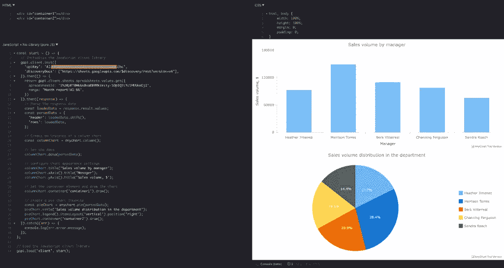

## **后记和链接**

我希望这篇文章对那些决定构建一个使用来自 Google Sheets 的数据并从 JavaScript 应用程序访问它的应用程序的人有所帮助。如果你有任何进一步的问题，请随时与我联系，我很乐意尽我所能帮助你。

为了方便起见，这里列出了本文中所有有用的链接，放在一个地方:

**先决条件**

*   谷歌工作表 API:[https://developers.google.com/sheets/api](https://developers.google.com/sheets/api)
*   Google Sheets API 迁移指南:[https://developers.google.com/sheets/api/guides/migration](https://developers.google.com/sheets/api/guides/migration)
*   Google API JavaScript 客户端:[https://github . com/Google/Google-API-JavaScript-client/blob/master/docs/start . MD](https://github.com/google/google-api-javascript-client/blob/master/docs/start.md)
*   保护密钥:[https://cloud . Google . com/docs/authentic ation/API-keys # securing _ an _ API _ key](https://cloud.google.com/docs/authentication/api-keys#securing_an_api_key)

**整合实例**

*   JSFiddle 上的 HTML 表格模板:[https://jsfiddle.net/7ngrfpxk/](https://jsfiddle.net/7ngrfpxk/)
*   JSFiddle 上的 JavaScript dashboard 模板:[https://jsfiddle.net/82hn9dmL/](https://jsfiddle.net/82hn9dmL/)

## 分享这篇文章