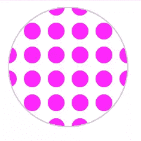

# 为您的下一个 UX 设计提供 6 个巧妙的 SVG 图案生成器

> 原文：<https://www.sitepoint.com/6-incredible-svg-pattern-generators/>

SVG 模式很容易被认为是 SVG 的一种不被重视的超能力。虽然 SVG 模式通常没有被广泛理解，但是一旦理解了它们的微妙之处，就可以提供许多有趣的设计选项。

在本文中，我们将从 SVG 模式如何工作的速成课程开始。然后，我们将介绍利用这些优势的 6 种工具。

理论上，将这些工具的输出与您对模式的了解结合起来，应该会带来一些令人兴奋的、新的设计可能性。

### SVG 模式是如何工作的？

从 Geocities 和 MySpace 统治史前互联网的早期开始，重复模式就是网页设计的支柱。即使你只懂一点 CSS，你大概也明白把任何图像设置成 CSS 平铺背景是多么容易。

```
div {
    background-image: url("sitepoint-tile.svg");
  }
```

当然，我们可以使用任何我们喜欢的网络图像格式作为背景(JPG，PNG 等)。但是由于 SVG 是如此高效、清晰和可伸缩，所以有充分的理由选择使用 SVG 作为 CSS 背景图片。

但是，你可能不太熟悉 SVG 的原生方法来制作重复的背景——[SVG 模式](https://developer.mozilla.org/en-US/docs/Web/SVG/Tutorial/Patterns)。它与我们相关，因为它提供了常规 CSS 平铺无法提供的特殊功能。但是首先，让我们先看看一个简单的 SVG 模式是如何工作的。

```
<svg>
  <defs>
  <pattern id="myPattern"
           x="10" y="10" width="20" height="20" patternUnits="userSpaceOnUse" >
<!-- start pattern-->
      <circle cx="10" cy="10" r="7" style="stroke: none; fill: magenta" />
<!-- end pattern -->
  </pattern>
</defs>
...
```

在大多数 SVG 文件的顶部，你会发现一个`<DEFS>`代码块。这个`<DEFS>`部分(或 **DEF** initions)是我们放置以后想要重用的元素的地方。实际上，这意味着 SVG **过滤器**、**符号**和**模式**。



简单 SVG 模式

### SVG 模式标记

在我们的`<DEFS>`块中，我们设置了一个 20 x 20px 像素的图案区域。然后，我们在该空间的正中央(CX = " 10 " cy = " 10 ")放置一个小洋红色圆圈(尽管这可能是我们想要平铺的任何项目)。

但这还没有在任何地方呈现出来——目前还没有。它只是一个模式定义，就像一个颜色样本或者一个 CSS 类。您需要在一个 SVG 填充中引用它来查看它的渲染。

```
...
<circle cx="50" cy="50" r="50" style="stroke: #ccc; fill: url(#myPattern);" />
</svg>
```

这里我们创建一个大圆(半径 50px ),并参照上面定义的图案填充它。它是这样渲染的。

参见 [CodePen](https://codepen.io) 上 Alex ( [@alexmwalker](https://codepen.io/alexmwalker) )
的笔 [简单 SVG 模式](https://codepen.io/alexmwalker/pen/pwZEvM)。