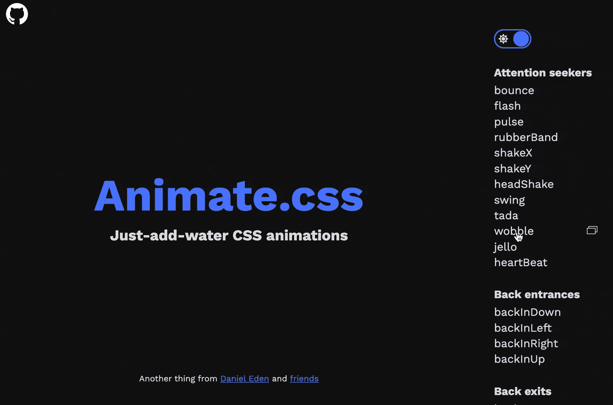
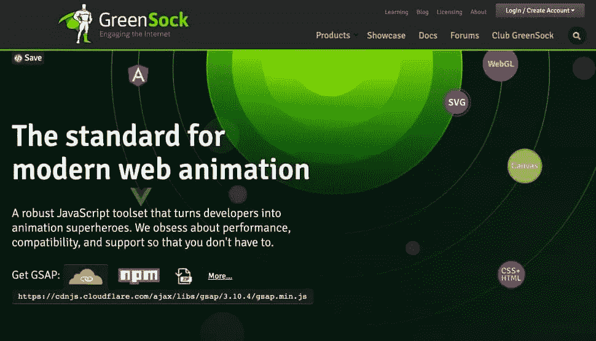
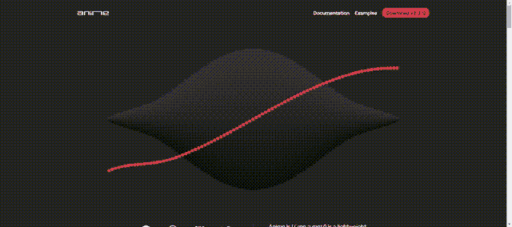
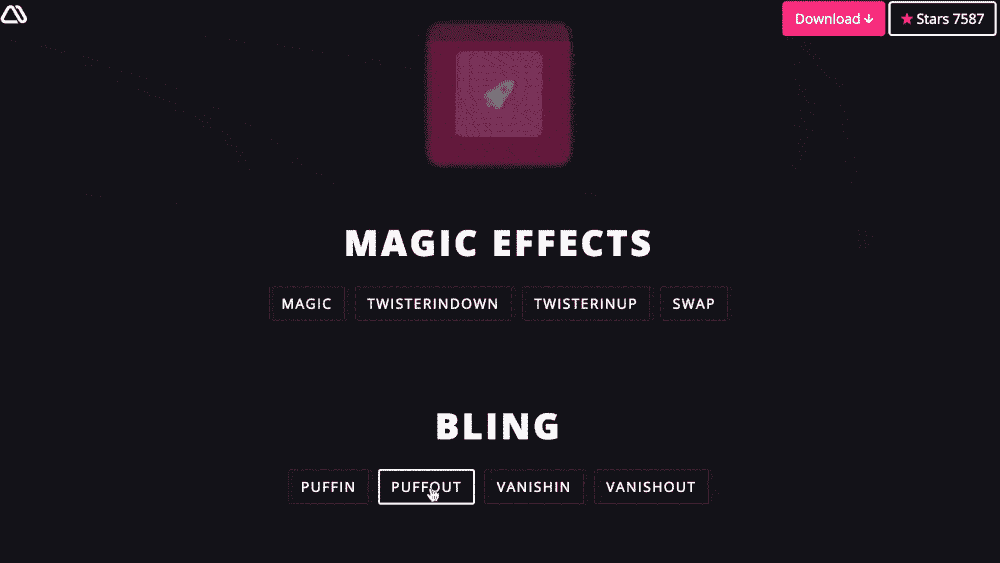
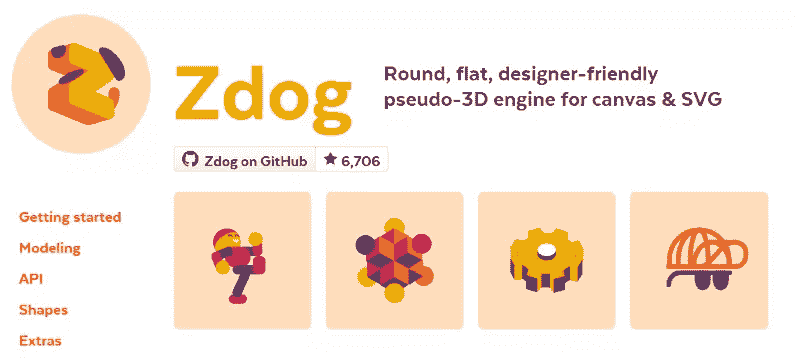
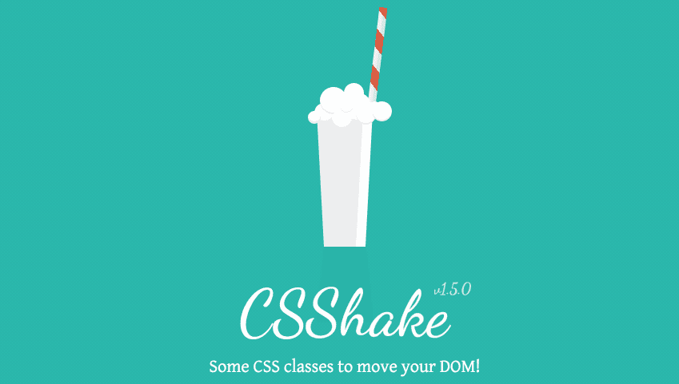
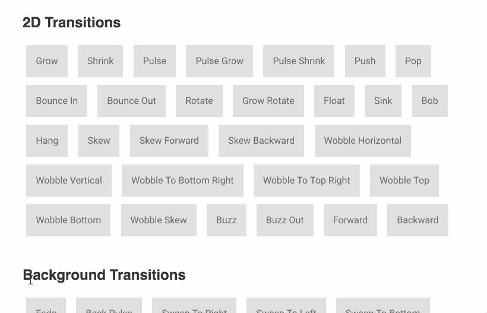
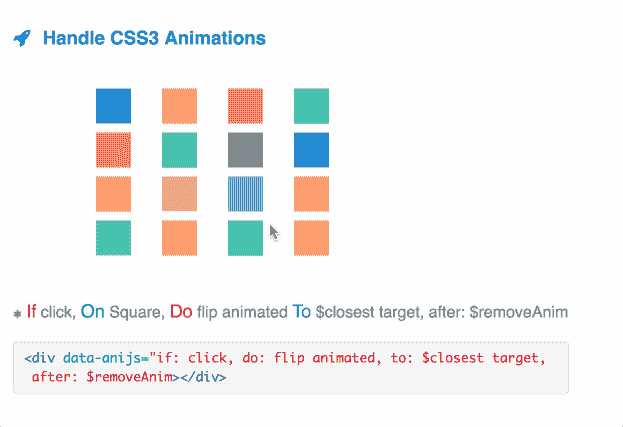

# 为用户界面设计者提供最好的 JavaScript 和 CSS 动画库

> 原文：<https://www.sitepoint.com/our-top-9-animation-libraries/>

今天我们将浏览 9 个免费的、编码良好的、最适合用户界面设计工作的动画库——包括它们的优点和缺点，以及何时选择它们。

在过去的十年里，前端网页设计经历了一场革命。在 2000 年代末，我们大多数人还在设计静态的杂志版面。如今，我们正在建造“数字机器”,它有成千上万个可调整大小、协调的移动部件。

很简单，*伟大的 UI 设计师也需要成为伟大的动画师*——对网络动画技巧和技术有扎实的工作理解。

请记住，我们是从精通代码的 UI 设计师的角度来看待每个库的，而不是作为“代码大师”开发人员。其中一些库是纯 CSS。其他的是 JavaScript，但是没有一个比基本的 HTML/CSS 和/或 JavaScript 理解更有用的了。

## 我们的 9 大动画库列表

1.  Lottie.js :非常适合任何比例的矢量动画
2.  [Animate.css](#animatecss) :最适合小型的、有针对性的 UI 操作
3.  格林索克(GSAP) :功能齐全但庞大的动画平台，可以做从游戏到应用开发的任何事情
4.  [动画](#animejs)
5.  [魔法动画](#magicanimations)
6.  [ZDog](#zdog)
7.  [CSShake](#csshake)
8.  [盘旋。CSS](#hovercss)
9.  [AniJS](#anijs)

## [Lottie.js](https://airbnb.io/lottie/#/)

")

让我们明确一下: [Lottiejs](https://airbnb.io/lottie/#/) 是一个与这个列表中的其他八个非常不同的动画库的*类型。尽管如此，我们认为 UI/UX 设计师不能忽视它。*

 *创建洛蒂动画更类似于创建一个视频产品。你需要一个第三方动画工具来导出一个“Lottie-ready”JSON 文件。事实上，Lottie 格式是专门为使 Adobe After Effects 在网络和移动设备上高效工作而设计的。这使得 Lottie 动画快速、高效、易于脚本编写，并且通常非常漂亮。

虽然 Lottie 被认为是 Adobe After Effects 的扩展，但有很多(可以说是更好的)“Lottie-native”替代方案来创建 Lottie 动画。其中包括:

*   [流量](https://createwithflow.com)
*   [骑兵](https://cavalry.scenegroup.co)
*   [Keyshape](https://www.keyshapeapp.com) (仅限 Mac，但不贵)
*   [Adobe Animator](https://lottiefiles.com/plugins/animate) (有限功能支持)
*   [草图(插件)](https://github.com/buba447/Lottie-Sketch-Export)
*   [俳句](https://www.haikuanimator.com)(最近开源——免费但未来不确定——买家当心)

洛蒂使用单独的“动画播放器”，分别针对网络、iOS 和 Android 进行了优化。Lottie 代码库由 AirBnb 开发和维护，背后有一个超级热情的社区。

*   **创作者** : [AirBnb](https://airbnb.io/lottie/#/)
*   **发布时间** : 2015 年
*   **人气** : 
*   **描述:**“Lottie 是一个 iOS、Android、React 原生库，实时渲染 After Effects 动画。”
*   **GitHub** : [洛蒂 Web](https://github.com/airbnb/lottie-web/)–[洛蒂 iOS](https://github.com/airbnb/lottie-ios/)–[洛蒂 Android](https://github.com/airbnb/lottie-android)
*   **执照** : 

## [Animate.css](https://animate.style)

[Animate.css](https://animate.style) 是最小最易用的 css 动画库之一。自 2013 年发布以来，它变得精致、高效、维护良好。

将动画库应用到您的项目就像链接 CSS 并将所需的 CSS 类添加到您的 HTML 元素一样简单。当然，如果您愿意，也可以使用 jQuery 或 vanilla JS 来触发特定事件的动画。



*   **创造者** : [丹尼尔·伊登](http://daneden.me)
*   **发布时间** : 2013 年
*   当前版本:4 . 1 . 1 版
*   **人气** : 
*   **描述:**“CSS 动画跨浏览器库。像一件容易的事情一样容易使用。”
*   **文库大小:** 70 kB(缩小)
*   **GitHub**:【https://github.com/daneden/animate.css 
*   **执照** : 

在撰写本文时，它仍然是最流行和最广泛使用的 CSS 动画库之一，它的缩小文件也足够小，可以包含在移动网站中。

Animate.css 仍在积极开发中。请注意版本 4，它将支持 CSS 自定义属性(又名 CSS 变量)。这是最简单和最强大的动画库之一，我们会毫不犹豫地在任何项目中使用它。

## [格林科克(GSAP)](https://greensock.com/)

GreenSock(或 GSAP-green sock 动画平台)是网络动画的瑞士军刀。对于流畅运行的圆滑和复杂的动画，GSAP 是理想的选择。你可以制作任何东西的动画，从 DOM 元素到 SVG，它的生态系统包括一些令人惊叹的插件，让你可以做各种有趣的事情，例如，变形 SVG，绘制 SVG 笔画，滚动功能，打乱文本，等等。它速度快，跨浏览器兼容，语法简单直观。



*   **当前版本** : 3.10.4
*   **人气** : 
*   **描述**:“面向现代网络的超高性能专业级动画。”
*   **库大小** : 313 kB(包含库的轻量级下载的缩小文件夹)
*   **GitHub**:【https://github.com/greensock/GreenSock-JS/ 
*   **许可**:标准的免费许可，混合特定功能和插件的付费模式。详见[许可页面](https://greensock.com/licensing/)。

GSAP 是模块化的，因此你可以挑选你的项目需要的库的哪些部分，这对于控制文件大小是非常好的。

如果你正在寻找一些强大而直观的东西，有很棒的文档和社区支持，我绝对推荐你在下一个项目中尝试一下这个动画库。你会很热情。

## [动画](http://anime-js.com/)

*[AnimeJS](https://animejs.com)* 是我们名单中的最新成员，但自创建以来已经赢得了大量的皈依者。它的功能强大得令人难以置信，用它来驱动 HTML 游戏动画不会不合适。唯一真正的问题是“*,对于简单的网络应用来说，这是不是大材小用了？*

也许吧。但由于它也很快，体积小，相对容易学习，所以很难挑它的毛病。

AnimeJS 被描述为一个“*轻量级 JavaScript 动画库，拥有简单而强大的 API。它与 CSS 属性、SVG、DOM 属性和 JavaScript 对象*一起工作。相当棒。

[](http://anime-js.com/)

这个项目可以在 [GitHub](https://github.com/juliangarnier/anime) 上获得。

*   创作者 : [朱利安·卡尼尔](https://github.com/juliangarnier)
*   **发布时间** : 2016 年
*   当前版本:3 . 2 . 1 版
*   **人气** : 
*   **描述**:“anime . js 是一个轻量级的 JavaScript 动画库，有一个简单而强大的 API。”
*   **库大小** : 16.8 kB(缩小)
*   **GitHub**:【https://github.com/juliangarnier/anime 
*   **执照** : 

最令人印象深刻的，是动漫。JS 拥有令人惊叹的“文档”,可以在一个漂亮的应用程序环境中演示 HTML、JavaScript 代码和工作示例。

简而言之，如果你喜欢 JavaScript 动画解决方案，就很难找到忽略动画的理由。

## [魔法动画](http://www.minimamente.com/example/magic_animations/)

魔术动画是最令人印象深刻的动画库之一。它有许多不同的动画，其中许多是这个库独有的。与 Animate.css 一样，您可以通过简单地导入 css 文件来实现魔术。您还可以使用 jQuery 实现动画。这个项目提供了一个特别酷的演示应用程序。

[](http://www.minimamente.com/example/magic_animations/)

*   **当前版本** : 1.4.1
*   **人气** : 
*   **描述**:“带特效的 CSS3 动画”
*   **库大小** : 54.9 kB(缩小)
*   **GitHub**:【https://github.com/miniMAC/magic 
*   **执照** : 

与 Animate.css 相比，Magic Animation 的文件大小适中，它以其标志性的动画而闻名，如魔术效果、愚蠢效果和炸弹效果。

如果你在寻找一些有点与众不同的东西，那就去吧。你不会失望的。

## [Zdog](https://zzz.dog/)

Zdog 是一个 JavaScript 库，由 David DeSandro 创建 3D 设计和动画。在它的帮助下，您可以使用`<canvas>`元素或 SVG 绘制您的设计，并通过流畅的 3D 效果将它们融入到流畅的动画中。



*   **当前版本** : 1.1.0
*   **人气** : 
*   **描述**:“圆形、扁平、设计师友好的
    画布伪 3D 引擎& SVG”
*   **库大小** : 28 kB(缩小)
*   **GitHub**:【https://github.com/metafizzy/zdog 
*   **执照** : 

如果你熟悉 JavaScript，你会很快学会 Zdog 的基础知识:它有简单明了的声明式 API、优秀的文档和大量的学习资源。在 SitePoint 上查看我对 Zdog 的[介绍。](https://www.sitepoint.com/learn-zdog/)

## [CSShake](http://elrumordelaluz.github.io/csshake/#1)

CSShake 提供了它在盒子上所说的东西——一个专门为摇动网页中的元素而设计的 CSS 库。如您所料，有许多不同的方法可以用来摇动您的 web 组件。

[](http://elrumordelaluz.github.io/csshake/#1)

*   **当前版本** : 1.5.0
*   **人气** : 
*   **库大小** : 21.9 kB(缩小版)
*   **GitHub**:【https://github.com/elrumordelaluz/csshake 
*   **执照** : 

苹果推广了当用户输入不正确的回答时大力摇动 UI 元素(对话框、模态或文本框)的 UI 比喻——模仿某人摇头。CSShake 提供了一系列有趣的“摇动”动画，并且在这个库中不乏变化。

## [Hover.css](http://ianlunn.github.io/Hover/)

是一个 css 动画库，设计用于网站中的按钮和其他 UI 元素。它有非常好的 2D 过渡，以及许多其他精心制作的动画。

[](http://ianlunn.github.io/Hover/)

*   **当前版本** : 2.3.2
*   **人气** : 
*   **描述**:“轻松应用到自己的元素中，修改或只是为了灵感而使用。”
*   **库大小** : 93.0 kB(缩小)
*   **GitHub**:【https://github.com/IanLunn/Hover 
*   **许可**:免费个人/开源许可和付费商业许可，视需求而定。有关详细信息，请阅读 GitHub 上的[许可部分。](https://github.com/IanLunn/Hover#licenses)

Hover.css 最适合制作离散页面元素的动画，如按钮、徽标、SVG 组件或特色图像，而不是更大、更复杂的页面动画。可以说，它最显著的动画效果是其独特的语音气泡和卷曲。

## [AniJS](http://anijs.github.io)

我们的最终文库因其独特的方法而有趣。AniJS 是一个动画库，允许你在一个简单的“类似句子”的结构中添加动画。采用以下格式:

**如果**点击，方块上的**，**做**摆动动画**到**。集装箱箱**

```
<div data-anijs="if: click, do: flipInY, to: .container-box"></div> 
```

如果您对 JavaScript 不太熟悉，这可能是进入 JS 编排的动作的一个很好的方式。



*   **创作者** : [达利尔·诺尔](https://twitter.com/dariel_noel)
*   **发布时间** : 2014 年
*   **当前版本** : 0.9.3
*   **人气** : 
*   **描述**:“一个不用编码就能提升你网页设计的库。”
*   **库大小** : 10.5 kB
*   **github**:[https://github . com/anijs/anijs](https://github.com/anijs/anijs)
*   **执照** : 

AniJS 是一个非常合理大小的库，考虑到它的功能性。它用于实现的格式非常新颖，与其他动画库(许多其他人可能会觉得非常规)相比有所不同。

然而，这个库值得一试，至少为你的项目试一次。

## 你应该选择哪个图书馆？

有许多动画库已经准备好，等待在您的项目中实现。上面列出的是几个具有复杂性和稳定性的最佳组合。

如果你正在寻找一个易于实现、经过充分测试的 CSS 解决方案，那么 **[Animate.css](https://github.com/daneden/animate.css)** 可能是最通用、最划算的选择。

如果你正在寻找一个更完整、更强大的 JavaScript 基础来支持在线游戏、模拟器、模型和其他复杂的应用程序，那么 **GreenSock** 和 **AnimeJS** 是很难分开的。

如果你的艺术风格是基于矢量的，并且你有一个 Lottie 功能的动画工具，Lottie 流畅的动作和效率是很难忽视的。

虽然在 web 应用程序中使用动画库确实可以提高交互性，但是过度使用会违背初衷，并且经常会让用户感到困惑。小心谨慎地使用动画。

你的项目使用动画库吗？你最喜欢的动漫库有哪些？

## 分享这篇文章*