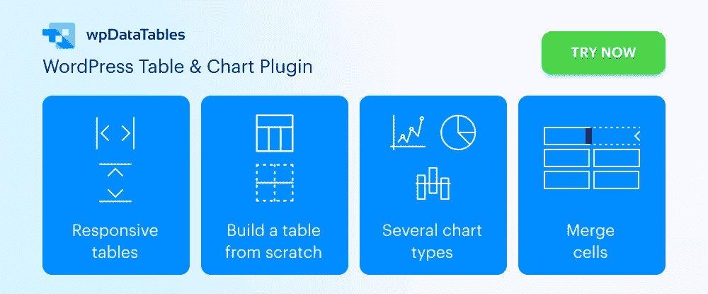
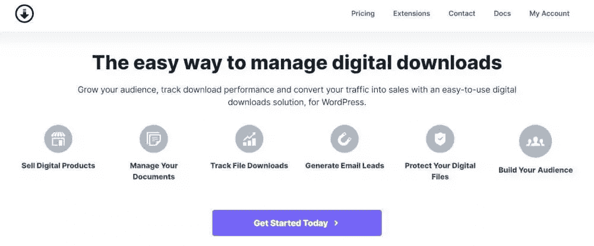
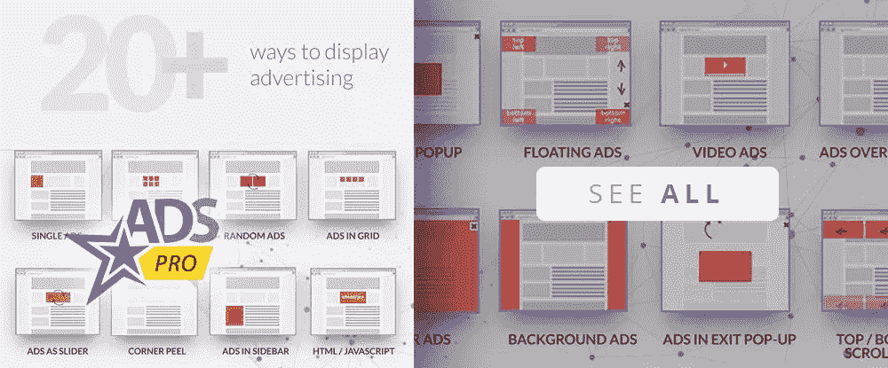

# 10 个很棒的 WordPress 插件(2022 更新)

> 原文：<https://www.sitepoint.com/10-awesome-wordpress-plugins-2022-updated/>

*这篇赞助文章由我们的内容合作伙伴 [BAW 媒体](https://baw.agency/)创作。感谢您对使 SitePoint 成为可能的合作伙伴的支持。*

一个或多个插件能为你的网站设计和你的业务做些什么，这是令人惊讶的。对于 WordPress 用户来说，有很多这样的网站。

一大堆很酷的 WordPress 插件听起来可能很多，事实也的确如此。除非你知道去哪里找，你应该找什么。找到一个或多个你会从中受益的可能是一个挑战。你最好读一下评论，或者干脆把一切交给专家。

这篇文章中提到的十大 WordPress 插件中的一个或多个可以让一个表现一般的网站成为真正的发电站。它可以让您的企业节省时间和金钱。所有这一切都是通过消除您目前已有的繁琐或容易出错的流程来实现的。

看看这些潜在的改变游戏规则的 WordPress 插件，从——

## **1。** [**阿米莉亚**](https://wpamelia.com/pricing/?utm_source=baw&utm_medium=posts&utm_campaign=bestplugins2022)

Amelia WordPress 插件是美容、健康和健身、培训以及类似业务的绝佳选择，这些业务可能不得不忍受人工或半自动预订系统固有的延迟和不一致性。

Amelia 可以通过以下方式为企业节省时间和金钱

*   使客户能够 24/7 在线预订和管理约会、付款以及通过短信或电子邮件接收重要通知。
*   使经理能够跟踪和管理员工的日常计划、假期和休假
*   向客户提供特殊活动、现场或在线研讨会以及折扣或优惠券的建议
*   管理多个地点无限数量约会的预订，包括团体预订和活动预订。
*   定制预订表格，以满足个别企业的特殊需求，并与其品牌相匹配。

Amelia 支持 PayPal、Stripe、Mollie 和 RazorPay 支付。点击横幅，了解更多关于这个省时省钱的插件可以为您的企业做些什么。

## **2。** [**wpDataTables**](https://wpdatatables.com/pricing/?utm_source=baw&utm_medium=atricelnewsletter&utm_campaign=apr2022)

wpDataTables 是一个功能丰富的 WordPress 表格和图表构建插件，它为用户提供了构建表格和图表所需的一切。

从各种来源的大量复杂数据中创建一个表可能需要一些工具，这些工具不一定容易获得或容易使用。wpDataTables 的 4 个图表构建引擎却不是这样:

*   谷歌图表
*   高图表
*   Charts.js
*   Apex 图表

对于表构建，wpDataTables 可以轻松地访问各种数据库源，包括:

*   关系型数据库
*   MS SQL
*   一种数据库系统

wpDataTables 可以同时处理以通用行业格式存在的数据，并具有大量排序和筛选选项，使您能够创建多种表类型。

wpDataTables 表和图表是前端可编辑的，响应性强，并且由于条件格式，可以突出显示和/或颜色代码关键信息。

## **3。** [**谷歌**站点工具包](https://sitekit.withgoogle.com/)

即使你的网站的表现符合你的期望，也总会有改进的时候，无论是与流量、潜在客户的产生、转化还是其他什么有关。

确定如何最好地进行所需的改进可能是一个挑战。Site Kit 为你提供了一个一站式的解决方案，让 WordPress 可以使用重要的 Google 工具，并部署它们来帮助你的网站取得成功

*   在你的 WordPress 仪表盘上显示这些谷歌工具的统计数据
*   快速设置这些工具，而无需编辑站点的源代码
*   展示整个网站和个人帖子的关键指标和见解
*   管理跨 WordPress 和不同 Google 产品的细粒度权限
*   显示网站访问者的数量、他们的导航习惯等等。

单击横幅，了解更多关于 Site Kit 可以为您做什么的信息。

## **4。** [**滑块公转**](https://www.sliderrevolution.com/examples/?utm_source=BAWpromotion&utm_medium=banner&utm_campaign=top10wpplugins2022)

如果你怀疑你的网站没有让你的客户对你的视觉效果着迷，Slider Revolution 可以通过弥合他们想要的和你能提供的之间的差距来改变这种情况

*   200 多个旨在给人留下深刻印象的网站模板和滑块模板，以及 20 多个强大的插件
*   参与 WebGL 幻灯片动画
*   能够从 WooCommerce 和社交媒体渠道导入动态内容。

## **5。**[**Table some–带有表单自动化的 WordPress 表格插件**](https://tablesomewp.com/?utm_source=Sitepoint&utm_medium=Listing&utm_campaign=BAW+Plugins+2022-2&utm_term=Form+Automation)

WordPress 因其表单插件而广受欢迎。Tablesome 是一个 WordPress 表单数据库插件，可以用来保存、编辑、删除和导出 WordPress 表单条目。

它可以用来保存元素或表单提交、WPForms 条目、Contact Form 7 DB、Forminator 数据库等等。

它是 GDPR 兼容的，也是一个表单自动化插件，你可以用它在前端页面显示 WordPress 表单条目，并将条目导出到 MailChimp、Google Sheets、Salesforce 等工具。,

## **6。**

**

找不到合适的 WordPress 主题？为什么不让 TheDock 帮你创造自己的呢？这并不难，而且肯定会给你一种满足感。

TheDock 具有多种有用的功能，包括

*   一个包罗万象、选项丰富的设计系统
*   响应式设计功能，确保您的网站在所有屏幕上都很好看
*   设计师、开发人员、编辑和团队协作支持。
*   干净、可读、可靠的代码。

## 7 .**。** [**终极会员职业**](https://ultimatemembershippro.com/?utm_source=baw&utm_medium=content&utm_campaign=topwpplugins22b)

如果你想从销售内容中获利，你需要一个能够将你的网站转化为强大的内容销售平台的工具。终极会员专业版 WordPress 插件可以帮你做到这一点，让你——

*   创建无限制的免费、试用和付费会员订阅级别
*   根据订阅级别管理和控制客户端对您内容的访问
*   发送电子邮件欢迎新成员和通知已建立的订户。

## **8。**

**

LayerSlider 不仅仅是另一个滑块插件。这是一个动画和网站建设工具，您可以使用它来改善任何网站的外观和感觉，它有一系列引人注目的动画、当代图形和交互式功能，这些功能是

*   嵌入在数百个网站、滑块和弹出模板中
*   使用 LayerSlider 现代化的直观编辑界面进行操作

专业的一对一客户支持也随时为您服务。

## **9。** [**下载监视器**](https://download-monitor.com/?utm_source=adplacement&utm_medium=listicle&utm_campaign=baw)

Download Monitor 插件将一个现成的解决方案放在您的指尖，帮助您跟踪文件下载，控制内容以产生线索，并向用户请求个人信息以建立受众，同时提供有价值的内容作为回报。

这个 WordPress 插件让你--

*   创建您的在线商店
*   链接一个页面到你所有的渠道，推广你的社交媒体网络
*   投放广告、教程等等。

## 10。[**Ads Pro–多功能 WordPress 广告管理器**](https://adspro.scripteo.info/?utm_source=baw&utm_medium=baw-articles&utm_campaign=adspro-baw)

Ads Pro 是目前 WordPress 最大和最新的广告管理器。它为您提供了管理和销售广告所需的一切。

它的管理面板使管理广告变得简单明了，同时它的–

*   25 个以上的广告模板和 20 个以上的广告显示选项。
*   内置 CPC、CPM 和 CPD 计费以及 PayPal、Strip 和银行转账支付功能
*   地理定位显示广告空间的基础上，原产地的位置。

WordPress 插件目录有将近 60，000 个插件。本指南将数量缩小到 10 个顶级 WordPress 插件。每一个都为你的网站或企业提供了改变游戏规则的可能性。

我们咨询了各自领域的专家，为 WordPress 汇编了这个基本插件列表。所有这些都旨在帮助你的内容策略，搜索引擎优化，网站安全，甚至社会媒体营销。

这些很酷的 WordPress 插件提供的功能可以为你使用 WordPress 增加巨大的价值。

## 分享这篇文章****