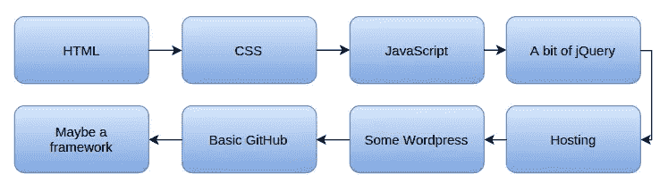

# 如何快速学习 JavaScript:六个简单的思维技巧

> 原文：<https://www.sitepoint.com/how-to-learn-javascript-fast/>

**当人们试图[学习 JavaScript](https://www.sitepoint.com/learn-to-code-with-javascript-the-most-popular-programming-language-on-earth/) ，或者任何真正的编码技能时，他们经常会遇到同样的挑战:**

*   有些概念可能会令人困惑，尤其是如果你来自另一种语言。
*   很难找到时间(有时还有动力)去学习。
*   一旦你理解了某事，就很容易再忘记它。
*   工具领域是如此的广阔和不断变化，以至于很难知道从哪里开始。

幸运的是，这些挑战可以被认识到并最终被征服。在这篇文章中，我将展示六个小窍门，帮助你更快地学习 JavaScript，成为一个更快乐、更高效的程序员。

## 1.不要让未来的决定阻止你现在的进步

对于许多希望快速学习 JavaScript 的人来说，他们问的第一个问题是使用哪个框架(公平地说，[有很多](http://www.cssauthor.com/javascript-frameworks/))。但是如果你对原始的 JavaScript 还不熟悉，这个问题就问错了。您将花费所有的时间研究不同的框架，而没有时间真正前进。

帮助你走出优柔寡断陷阱的一个方法是为你需要学习的东西制定一个路线图。例如，要成为一名前端开发人员，您的路线图可能如下所示:

进一步分解，你可以只用 HTML 和 CSS 制作一个功能性的网页。看到像这样列出的各个步骤，就更容易看到现在应该关注什么，这样你就不会浪费时间担心以后应该发生的事情。

## 2.不要让自信欺骗你忘记事情

快速理解一个概念可能是学习 JavaScript 过程中最具破坏性的事情之一。请允许我解释。

当你读到一些有意义的东西时，你会很容易马上进入下一个话题。也许你会明白接下来的事情，然后再继续前进。但是很快，你会意识到你已经忘记了以前学过的一些东西，所以你需要回去。你快速浏览了一下前面的概念，以刷新你的记忆，然后继续前进。但现在你忘了别的东西。你不断重复这种来回的舞蹈，直到你意识到你完全迷失了。你感到沮丧，休息一下，然后当你试图回来时，你已经忘记了一切。

幸运的是，这个问题有一个简单的两步疗法:

1.  限制你一次学习的东西的数量。
2.  真正的实践——实际编写代码。

当你学习一个新概念的时候，一定要尝试它，玩它，适应它，甚至把它和其他概念结合起来。在你所遵循的任何例子中，实际输入代码是非常重要的，因为这有助于你理解它。此外，限制你一次学习的数量将有助于你记住材料，原因很简单，记住更少的东西更容易。

这个过程看起来比通读和快速移动花费的时间要长，但实际上花费的时间要少得多，因为你不需要走回头路。我在好几次经历了惨痛的教训。

## 3.以正确的心态对待实践

许多人认为练习是无聊和重复的事情，所以他们经常会跳过它或者试图走捷径。如果你试图简化你的 JavaScript 实践，你实际上会花更长的时间去学习它。但是你如何让练习变得更令人兴奋，这样你就真的会去做了？

试试这种思维转变:

如果你学习了一个新的 JavaScript 概念，却不被允许尝试，那会怎样？你会有什么感觉？就我个人而言，我会有点恼火，尤其是在花时间去理解它之后。这就像一个孩子得到了一个新玩具，却不被允许玩它。

当你在 JavaScript 中学到一些新东西时，试着把它当成一个新玩具、一辆新车、一双新鞋，或者任何你喜欢尝试的东西。那就不要像工作一样练，像玩一样练。用你的新技能做一些酷的事情。给自己惊喜。给你的朋友看看。

有了一个更好玩的心态，你会学得更快，你会记得更久，你会有更多的乐趣。

## 4.找时间用脸书技巧编码

人们最常见的问题之一是找不到时间编码。通常，同样的人会在脸书、YouTube、维基百科或 Reddit 等网站上花费数小时。不管这是否描述了你，这里仍然有值得学习的课程。

我确实有过只想看脸书一会儿的时候，但我最终在那里呆了几个小时。这是怎么发生的？它的发生正是因为我不打算去那里太久。开始做一件事是最难的部分，所以我发现通过保持最初的承诺较小来投入会容易得多。如果有人问我是否准备在脸书呆上几个小时，我会说不，因为我没有那么多时间。然而，我更容易接受快速检查一件事情的想法，这就是我被吸引的原因。

好消息是，在学习编码时，你可以利用同样的心理优势。不要试图花几个小时去编码，因为那样你就永远找不到时间了。只要告诉自己，你将尝试三分钟的代码。你再也不会挣扎着找时间了。

## 5.慢一点思考，你会学得更快

这个听起来有些违反直觉，我就用一个故事来解释一下。

我的一个朋友曾经对 JavaScript 的某个特性感到困惑。我请他向我介绍他所知道的，然后解释哪一部分令人困惑。当他浏览这段代码时，我注意到他很匆忙。

“坚持住！”我说。"慢下来，带我走完每一步."

我的朋友接着向我概述了代码中发生的事情。

我又拦住了他。“你还赶时间。再试一次，但这一次，我要你逐字逐句地读一遍，告诉我每行到底发生了什么。”

这一次，我的朋友能够更好地解释代码中发生了什么。关键是他花了时间一步一步地阅读每一部分，而不是试图一下子理解全部。

在这种情况下，慢一点思考实际上会让你学得更快。

## 6.首先用简单的语言编写复杂的代码

如果一段代码很复杂或者不熟悉，首先用简单的语言写出来。这样，在实际编写代码之前，您就可以知道您希望代码做什么。这种方法有两个好处:

1.  你的代码将会写得更容易更快，因为你不必不停地停下来考虑你希望它如何运行。
2.  您将在 bug 发生之前捕捉到它们，因为您将对代码应该做什么有一个更清晰的想法。

## 更快地学习编程语言

我们已经讨论了很多更快学习 JavaScript 的方法，但是您可以将这些技巧应用到其他技能中。以下是我们所讲内容的回顾:

*   不要担心未来的决定，开始行动吧。
*   像对待玩具一样对待新技能，让练习变得有趣。
*   像在脸书、YouTube 或维基百科这样的网站上一样，通过做出微小的承诺来寻找时间编码。
*   慢下来，迈小步，你会学得更快。

那么如何接近[学习](https://www.sitepoint.com/how-to-learn-anything/)？你有什么我在这里没有提到的技巧或诀窍吗？或者你可能认为这都是胡扯，唯一的前进方式就是每天投入 12 个小时。不管怎样，我都希望在评论中听到你的意见。

## 分享这篇文章