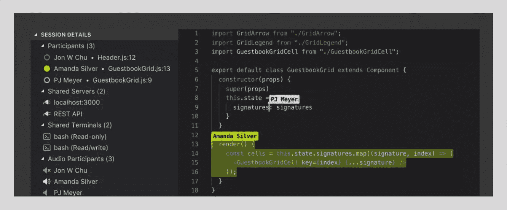
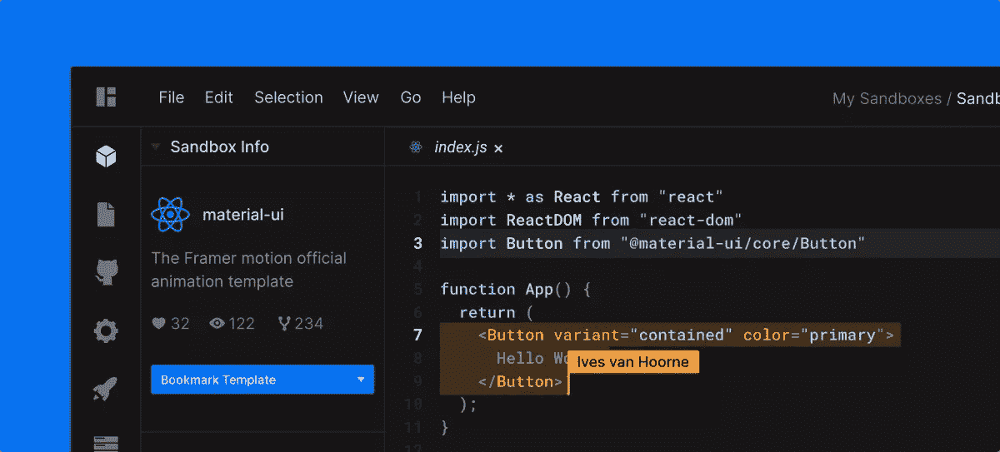
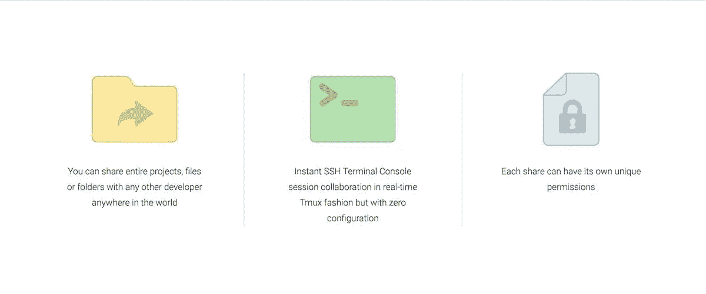
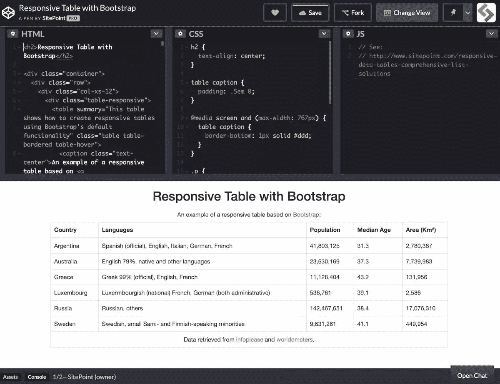
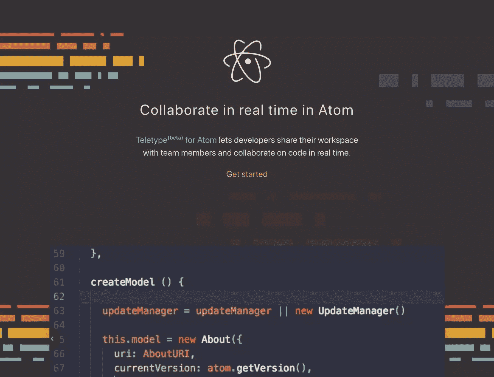
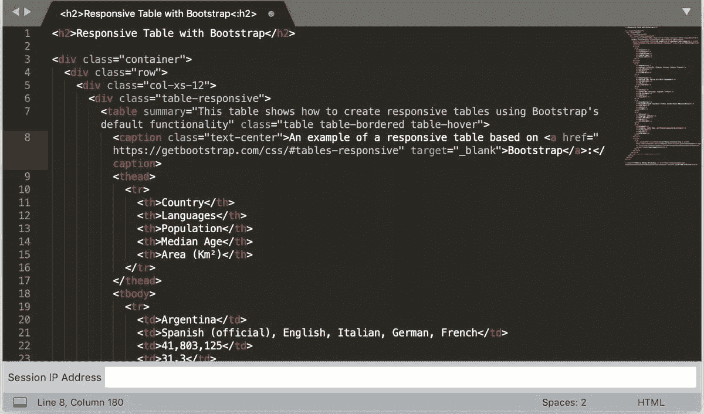

# 7 个用于远程结对编程的协作编码工具

> 原文：<https://www.sitepoint.com/collaborative-coding-tools-for-remote-pair-programming/>

**正在寻找一个能与您的远程团队合作的协作编码工具吗？**我们着眼于最佳的协作编码工具，这些工具将使远程结对编程对您和您的团队来说更加容易和高效。

如果你是一名程序员，你知道协作是成功的关键。没有比结对编程更好的协作方式了。这种类型的编程允许两个或更多的程序员在同一代码上一起工作，分享想法并解决出现的问题。

当疫情开始时，代码协作工具落后于我们对其他实时团队合作应用的期望。但事情在短时间内取得了很大进展，质量选项比以往任何时候都多。

这些工具将帮助你与你的团队有效地沟通和编码，无论他们在世界的哪个角落。另外，它们都是免费使用的！

## 什么是远程结对编程？

在我们深入研究最佳协作编码工具之前，让我们首先回答这个问题:什么是远程结对编程？

结对编程是指两个或更多的开发人员在同一个项目上一起工作。他们互相帮助，互相学习。这可以让团队更有凝聚力，也有助于创造更好的产品。

远程结对编程是指两个或两个以上的程序员一起远程编写代码。这可以使用各种不同的工具在线完成。

在我们的[结对编程指南](https://www.sitepoint.com/pair-programming-guide/)中了解更多关于如何开始结对编程的信息。

### 远程结对编程的好处

远程结对编程有许多好处，包括:

*   **提高生产力:**研究表明，结对编程可以将生产力提高多达 15%。
*   **更好的代码质量:**两个或两个以上的人在同一个代码上工作时，错误和差错更少。
*   **更容易解决的问题:**三个臭皮匠顶个诸葛亮！如果你被困在一个问题上，与其他人合作可以帮助你更快地找到解决方案。
*   **更好的沟通:**在代码方面与某人密切合作有助于提高沟通技巧，并使给予和接受反馈变得更容易。

## 什么是协作编码工具？

协作编码工具是允许程序员一起远程编写代码的应用或服务。这些工具提供了多种功能，例如实时多人编辑、音频和视频聊天以及小组调试。

几个产品类别可以被描述为协作编码工具。

*   这些是在线代码编辑器，允许你在你的网络浏览器中编写、编辑和调试代码。它们非常适合协作编码，因为它们允许多人同时处理相同的代码。
*   本地 ide:这些是你安装在电脑上的代码编辑器。它们通常比云 ide 提供更多的功能和定制，但是它们对于协作编码来说并不方便，因为你必须配置额外的工具或者共享你的计算机屏幕。
*   代码共享工具和平台:这些是允许你与他人分享代码片段的网站和应用。它们非常适合协作编码，因为它们简单易用。

还有类似于**代码评审**工具的支持代码协作工作流的相邻类别。它们很棒，因为它们有助于提高代码的质量。但是我们将把管理围绕编码的元工作的应用程序留给另一个部分。

在本文中，我们将特别关注使开发人员能够实时在线协作编写代码的工具。

### 基于云的开发环境的兴起

这些产品类别之间的界限越来越模糊。

例如，微软一直在对基于云的开发工具的开发人员体验进行重大投资——他们的投资正在取得回报。这意味着本地机器上的 Visual Studio 代码和它可以连接的 GitHub 代码空间之间的能力差距随着每个版本的发布而变小。

今天，Visual Studio 代码用户可以很容易地选择在本地工作[或者连接到基于云的开发环境](https://code.visualstudio.com/docs/remote/remote-overview)，比如 [GitHub Codespaces](https://github.com/features/codespaces) 。

由此产生的体验提供了本地开发设置的响应能力和可配置性，以及云计算的灵活性和强大的计算能力。

特别是微软，已经投资让基于云的开发环境成为一流的开发者体验，并配备了与之相适应的协作工具。

## 最好的协作编码工具

那么，什么是伟大的协作编码工具呢？在审查市场上的产品时，我们发现这些因素表明最佳体验(通常也是最具前瞻性的)。

*   多种通信选项(语音、视频、文本聊天)。
*   真正的多人游戏体验。对合作者的数量(即，不仅仅是对合作者)或他们与基于自以为是的成对编程工作流(驾驶员/乘客等)的代码进行交互的能力没有固有的、自以为是的限制。
*   完全访问自己通常的本地开发环境和工具。伟大的协作编码工具超越了传统的结对编程限制，让双方都享受他们已经熟悉的设置。
*   流畅且响应迅速的体验，不会加剧远程工作的挑战。

一个优秀的协作编码工具应该帮助我们远程配对程序，同时为不同的协作用例提供灵活性。它的目标应该是成为一个解决所有实时代码协作需求的强大工具，而不是一个只会一招的小马。

以下是我们挑选的最佳协作编码工具。

## 1. [Visual Studio 现场分享](https://visualstudio.microsoft.com/services/live-share/)

Live Share 是作为一个扩展安装的，无论你运行的是 VS Code for desktop 还是 [VS Code web client](https://code.visualstudio.com/blogs/2021/10/20/vscode-dev) ，它都能顺利工作。

实时共享允许团队在共享代码库上协作，同时保持每个协作者独立导航和工作的能力。虽然许多代码协作工具传统上被绑定到宿主的角度，但 Live Share 允许每个人导航文件并根据自己的条件对代码进行更改。

Live Share 可以共享您的工作区、终端和本地服务器，并且您可以在该工具中通过语音进行交流。这是一个很好的选择，还有其他有用的功能，比如组调试和聚焦跟踪功能，可以让你吸引合作者的注意力。有了免费的价格标签，这个选择是显而易见的——特别是如果你已经是一个 Visual Studio 代码用户。

当你在做的时候，看看我们的 [Visual Studio Code power 用户指南](https://www.sitepoint.com/visual-studio-code-power-user-guide/)和我们的 [VS 针对 JavaScript 开发者的代码扩展建议](https://www.sitepoint.com/vs-code-extensions-javascript-developers/)。

## 2. [CodeSandbox Live](https://codesandbox.io/docs/live)

[CodeSandbox](https://codesandbox.io/) 允许你在你的沙盒上与[协作，它的 Live 特性](https://codesandbox.io/docs/live)。

用户可以制作一个沙盒，并与合作者共享 URL。您可以决定任何人是否可以随意编辑，或者控制谁可以在给定时间编辑(课堂模式)。文件更改、从属关系更改和选择都会在会话间保持最新。

CodeSandbox 有一个强大的免费产品，9 美元/月的 Pro 计划提供了无限的私人沙箱和对私人 GitHub repos 的支持。

## 3. [Codeanywhere](https://codeanywhere.com)

[Codeanywhere](https://codeanywhere.com) 是一个基于浏览器的开发环境，旨在帮助您从任何设备上无摩擦地编写代码——编辑器、终端、修订跟踪和其他功能都包括在内。Codeanywhere 有一个协作焦点。举个例子:不用每次想分享项目的时候都要拉上拉链(不用把人加到你的私人回购里)，你可以即时生成一个分享链接。

这里感兴趣的特性是 Codeanywhere 的[活对编程](https://codeanywhere.com/features/collaboration#paircoding)。像 Live Share 或 Teletype 一样，它承诺了 Google Docs 风格的文档编辑，对合作者的数量没有限制。我们从 Docs 中了解到的另一个方便的功能是:点击您的合作者的图标，您将被带到他们正在处理的行。

Codeanywhere 的费用从每月 2.50 美元到每月 40 美元不等，具体取决于计划层级和计费频率。

## 4.[一起编码](https://www.codetogether.com/)

[https://www.youtube.com/embed/bw62sbMubJc](https://www.youtube.com/embed/bw62sbMubJc)

自从本文第一版发表以来，CodeTogether 是这个领域的一个新竞争者，它是专门为支持远程结对编程而构建的。

我们探索的大多数工具都是围绕单个编辑器构建的，这限制了它们的实用性，因为编辑器的选择在整个团队中通常不是标准化的。CodeTogether 特别吸引人，因为它可用于 Eclipse、VS Code 和基于 IntelliJ 的 ide。参与者可以直接进入基于浏览器的编辑器，而不考虑他们个人的编辑器偏好，因此 CodeTogether 为一个坚实的用户群体服务。

与 Live Share 一样，CodeTogether 的参与者可以在项目中自由移动。用户可以独立完成自己的任务，搜索所有共享项目，或者选择跟随另一个用户的观点。

在编辑器不可知论和协作灵活性之间，CodeTogether 现在看起来是许多现实团队的最佳选择。

CodeTogether 是免费的，有 60 分钟的会话限制。个人专业级解锁无限期会话，每月 4 美元起。

## 5.[密码笔](https://codepen.io/)

[CodePen](https://codepen.io/) Pro 用户可以访问 [Collab 模式](https://blog.codepen.io/documentation/pro-features/collab-mode/)，允许多个用户同时编辑一支笔。只有钢笔的所有者需要有一个专业订阅才能工作。

每个用户的更改、选择和设置更改都反映在协作模式中，并且有一个内置的实时聊天区。

笔的所有者可以决定是否保存更改，合作者可以将结果分支到他们自己的笔中。

虽然您可能不是在 CodePen 之外进行初步开发，但这是与朋友或同事进行故障诊断会话、进行访谈或在其他特殊情况下进行协作的一种很好的方式。

CodePen Pro 的费用从 8 美元/月到 39 美元/月不等，取决于计划层级和计费频率，并在三个层级的每个层级上设置合作者限制:分别为 2 人、6 人和 10 人。

## 6.原子电传打字机

Atom 的 Teletype 是实时代码协作工具中的早期参与者，它允许 [Atom 用户](https://www.sitepoint.com/12-favorite-atom-tips-and-shortcuts-to-improve-your-workflow/)与团队成员共享他们的工作空间。

虽然 Live Share 用户可以在项目中自由移动，但 Teletype 更以主机为中心。主持人打开一个“门户”后，他们的活动选项卡就变成了共享工作区，协作者在文件之间移动时会跟随主持人。Teletype 非常适合结对编程用例——其驱动程序和导航器模型——但不像 Live Share 的开放式协作开发环境那样适合所有用途。

## 7.【SublimeText 的远程协作

[远程协作](https://packagecontrol.io/packages/RemoteCollab)将虚拟结对编程带入 SublimeText。Remote Collab 是一个准系统插件，但是如果你投资了 SublimeText，它可能会帮你做到。

每个会话都绑定到一个特定的文档。一旦主持人开始一个会话，合作者只需要主持人的 IP 地址就可以加入，所做的任何改变都会在机器上反映出来。

## 包装它

现在是远程开发人员的大好时机——有很多可靠的工具可以在代码上进行协作。我们希望这能帮助你找到适合你的。如果你正在努力缩小范围，我们推荐 Visual Studio Live Share 给那些致力于 Visual Studio 和 Visual Studio 代码的人，CodeTogether 给混合编辑团队，CodePen 给特别协作。

现在你已经整理好了你的工具包，确保你能通过我们深入的[结对编程指南](https://www.sitepoint.com/pair-programming-guide/)充分利用结对编程，作者是 M. David Green，开发工作流专家和《T2 Scrum:新手到忍者的作者。

## 分享这篇文章