# 创建和管理设计系统的最佳 Figma 插件

> 原文：<https://www.sitepoint.com/figma-design-system-plugins/>

设计系统允许网页设计者在一个品牌的所有数字资产上创建一个连贯一致的设计。Figma 是创建设计系统的一个很好的工具，但是如果没有合适的插件就很难管理它们。

在这篇文章中，我们将看看用于创建和管理设计系统的最好的 Figma 插件！

## 设计系统组织者

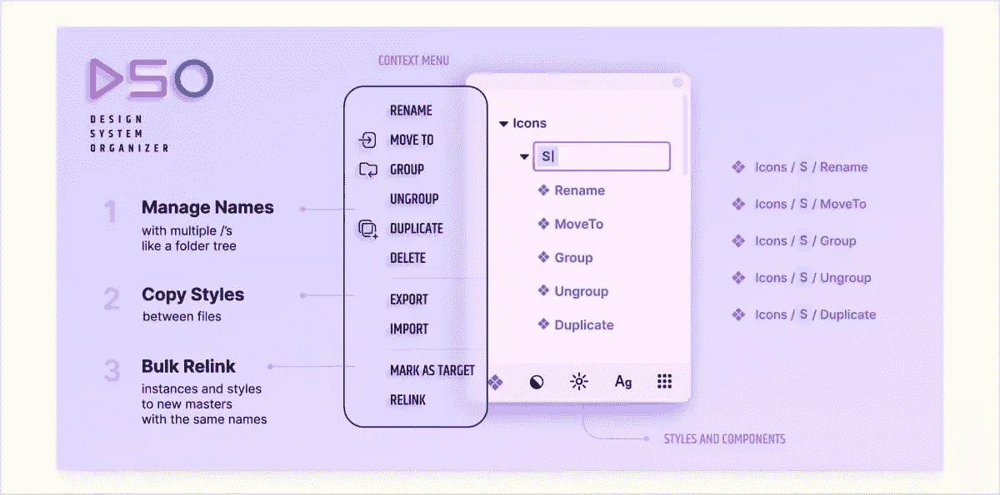

设计系统管理器是一个 Figma 设计系统插件，帮助你管理和组织你的组件和风格。它允许您快速重组和清理具有多个名称的巨大库，在文件之间复制样式，以及在库之间批量重新链接实例和样式。当只需要更改几个参数时，您还可以通过一次单击来克隆样式和组件。

设计系统管理器支持所有类型的样式、组件变体以及本地和外部库。它还有一个上下文菜单和快捷方式，用于快速选择、删除、重命名和分组项目。您甚至可以将重新链接应用到所选内容、页面或整个文档。

单用户终身许可的起价为 24 美元。可以免费试用。

## 修复大师

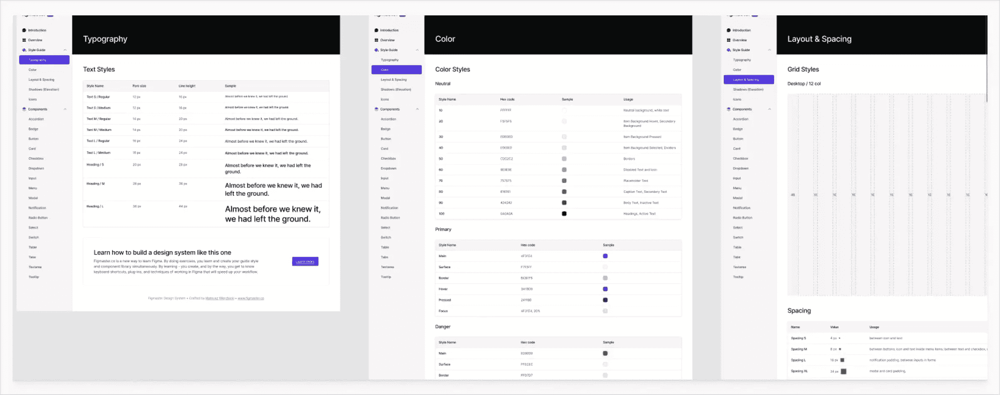

Figmaster 是 Figma 中学习如何从零开始创建设计系统的一个很好的方法。Figmaster 是 Figma 的一个工作簿插件，包含了大量关于如何从头开始构建现代设计系统的练习。通过在 Figma 中做练习，您可以同时学习和创建您的指南样式和组件库。

Figmaster 全靠实践，所以你可以马上开始运用学到的知识。您将从创建设计标志并将其转换成 Figma 样式开始。您还将为您的系统准备图标库。您将使用这些样式、图标和规则来创建组件，并了解自动布局和变体如何帮助您构建完美的组件。

之后，您将创建文档组件和框架，记录您的组件和样式，并在 Figma 中构建一个文档页面。最后，您将使用您的设计系统构建一个简单的 UI，并定制颜色、版式或组件属性，以满足您的产品或品牌需求。

Figmaster 是一个付费插件，单用户许可起价 99.99 美元。可以免费试用。

## Sprint UI

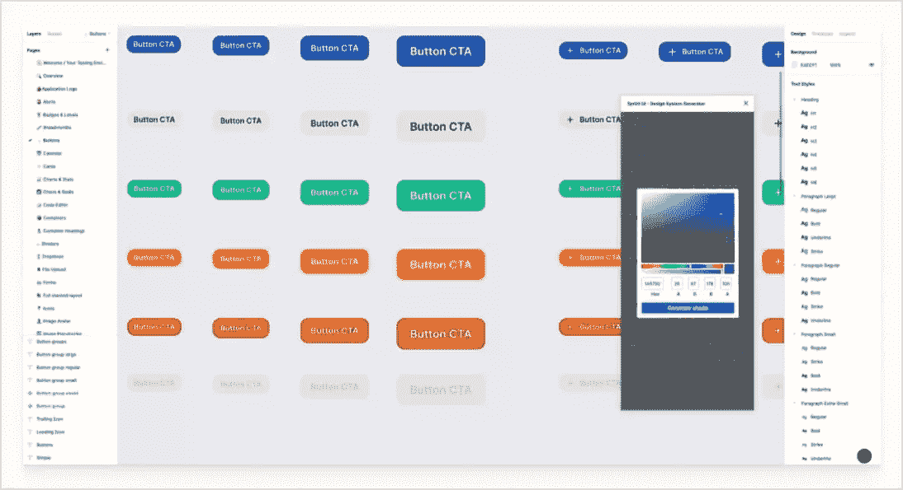

[Sprint UI](https://sprintui.com/) 是一个设计系统生成器，可以让你快速修改预先设计好的风格系统。它声称是同类产品中的第一个。你用插件做的每一个修改都会自动反映到你设计的方方面面。

Sprint UI 允许您快速方便地设置调色板、字体和其他设置。您可以在几分钟内生成一个完整的设计系统，随时可以定制并在您的下一个项目中使用。

该插件还包括一系列可以在您的项目中使用的自定义图标。

Sprint UI 插件与 Figma 的新变体功能配合使用，因此您可以使用它来创建不同版本的设计(例如，亮模式或暗模式)。

Sprint UI 附带了各种电池，例如超过 700 个可调整大小的组件。

Sprint UI 是一项订阅服务，起价为每月 8 美元。它提供免费试用。

## 工具栏设计系统管理器

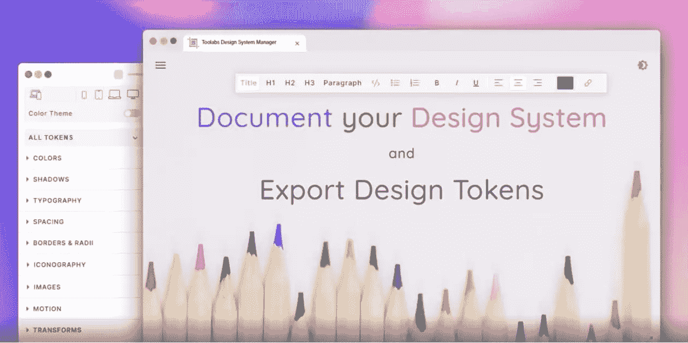

[Toolabs Design System Manager](https://www.toolabs.com/plugins/figma/)允许您在一个面板中定义或更新设计标记，并立即查看 Figma 设计中反映的变化。Toolabs DSM 允许您通过 Figma 样式管理您的主题。您可以创建样式并将其附加到标记，标记化样式等等。这使得管理您的设计系统并使其与最新的变化保持同步变得容易。

它提供了用外部来源的真实内容填充设计的功能，以及用直观的编辑器构建设计系统文档的功能。您还可以通过 GraphQL API 以编程方式访问设计令牌，或者以一系列格式导出设计令牌，包括 CSS、Less、Sass、JSON、YAML、JavaScript、Swift 或 Android。

Toolabs 设计系统管理器是一个免费插件。

## 叠加

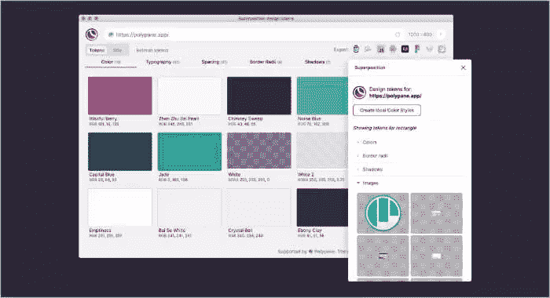

SitePoint 贡献者[的桌面应用和 Figma 插件](https://www.sitepoint.com/author/kvalkhof/)，对之前的参赛者采取了不同的方法:使用你已经拥有的设计系统。

叠加允许你从网站中提取设计符号，并在代码和设计工具中使用它们。它提取你的站点已经有的设计符号，并把它们导出到 CSS、SCSS、JavaScript、Figma 和 Adobe XD。您可以使用叠加来创建、记录和导出您的设计系统，以便与您的客户或团队共享。

叠加软件是免费下载的，适用于 macOS、Windows 和 Linux 上的 Figma 插件及其桌面应用程序。

## Figma 代币

设计符号是设计系统的基本元素。如果你正在寻找一种方法来简化你的设计过程，那么看看 [Figma Tokens](https://www.figma.com/community/plugin/843461159747178978/Figma-Tokens) 。这个插件让你能够为一系列设计选项生成、改变和使用设计符号，比如边框半径、间隔单元和语义颜色。

还可以相互引用标记来创建文字刻度、容器填充或语义颜色。

Figma Tokens 是一个免费插件。

## 超级整洁

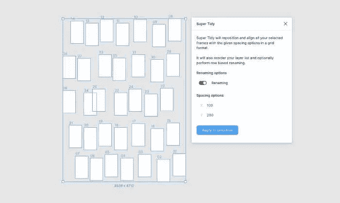

超级整洁是保持你的设计文件和画布整洁的最好的插件之一。它可以将您的帧与可自定义的间距网格对齐，给它们重新命名，并根据画布位置在层列表中对它们重新排序。

让你的设计系统文件看起来像真实的来源。

## 设计线头

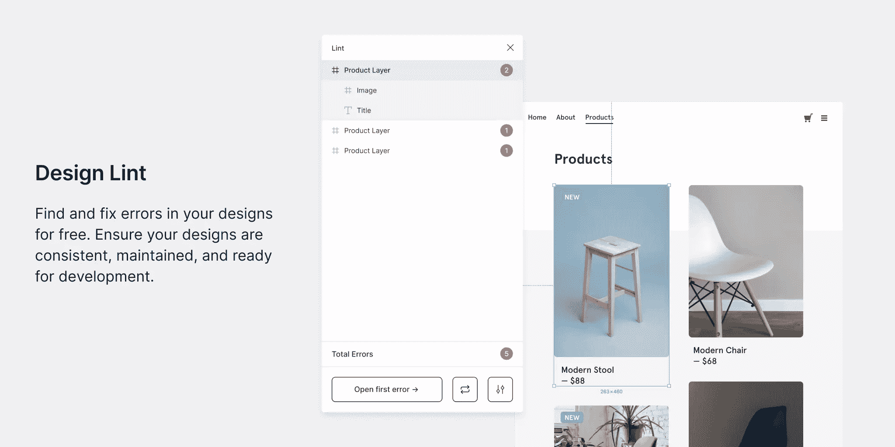

[Design Lint](https://lintyour.design/) 是一个 Figma 插件，可以帮助你发现设计中的错误。对于保持设计的一致性来说，这是一个非常有用的工具。

Design Lint 旨在帮助您快速解决问题。插件可以自动修复的任何东西都可以一键搞定。对于其余的，有一些很好的工作流程，使整理变得轻而易举。

错误列表会随着您的工作而更新，插件会单独扫描每一层。即使有多个页面或屏幕受到一个问题的影响(比如缺少样式)，你也可以确定它们会被找到。单击某个问题将选择设计中的该层，这样您就可以立即确定地应用修复。

Design Lint 是一个免费的开源插件。

## 样式组织者

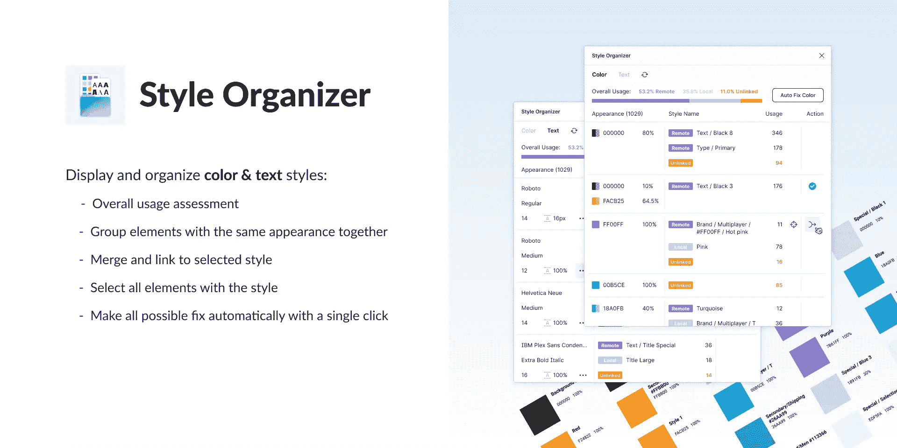

[样式管理器](https://www.figma.com/community/plugin/816627069580757929/Style-Organizer)插件旨在帮助您管理设计中的颜色和文本样式。

“样式管理器”还有许多很棒的特性，包括能够将具有相同外观的元素分组在一起，以及合并和链接选定的样式。它还具有自动修复功能，可以自动将所有具有相同外观的元素链接到页面上最常用的样式。

它可以帮助您组织颜色和文本样式，使您可以轻松地找到并为您的设计使用正确的样式。

风格组织者是一个免费插件。

## 排版样式指南

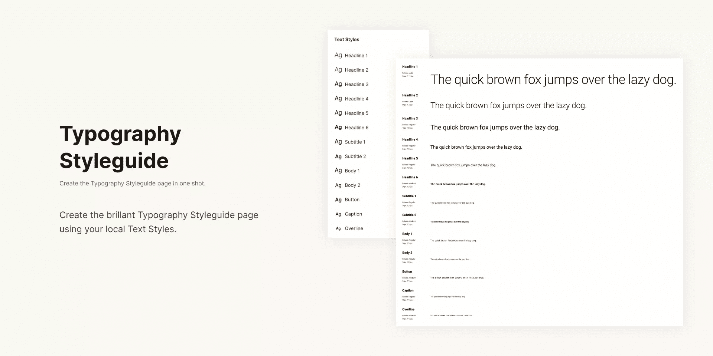

Hiroki Tani 的排版风格指南从您的设计中生成一个干净、有吸引力的排版风格指南页面。它使用您的文件的本地文本样式来实现这一点。

排版风格指南是一个免费插件。

## 颜色样式指南

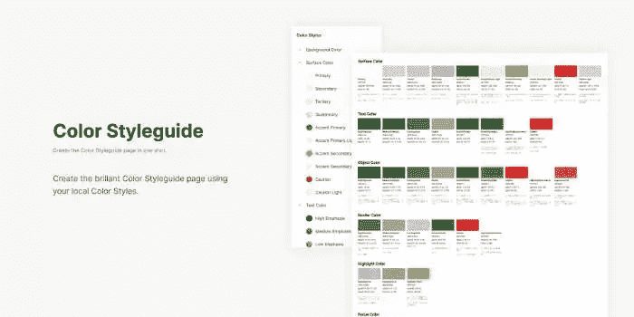

[颜色样式向导](https://www.figma.com/community/plugin/965313760136371738/Typography-Styleguide)由同一开发者使用本地颜色样式生成颜色样式向导。这些插件以一致的风格生成输出，因此在处理设计系统文档和设计文件时，它们可以很好地结合在一起。

颜色样式向导是一个免费的插件。

## 内容伙伴

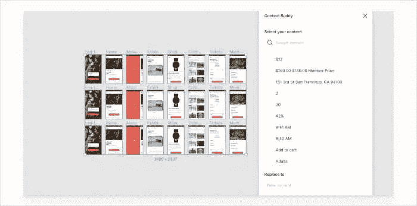

[Content Buddy](https://www.figma.com/community/plugin/731260490045684148) 允许您在 Figma 中编辑多个层、实例和组件中的文本内容。使用 Content Buddy，您可以搜索所选内容中的文本内容，并用新文本替换它。当你需要改变设计系统时，这个插件非常有用。

内容伙伴是一个免费插件。

## 内容卷轴

[内容卷轴](https://www.figma.com/community/plugin/731627216655469013/Content-Reel)帮助设计师快速用真实的内容填充他们的框架。只需拖放即可将占位符内容添加到您的设计中。

从一个调色板中提取文本字符串、图像和图标将有助于您更高效地进行设计，而无需停下来寻找或生成虚拟内容。Content Reel 还允许您创建和保存您自己的自定义内容，您可以与其他 Figma 用户共享这些内容。

内容卷轴是一个免费插件。

## 组件主管理器

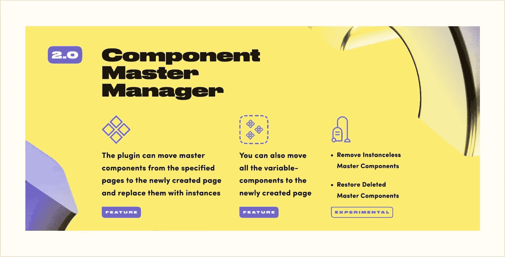

[组件主管理器](https://www.figma.com/community/plugin/754404293457940119/Component-Master-Manager)将主组件和变体组件从设计的不同页面移动到它们自己的页面。您可以删除未使用的组件，并恢复任何您确实需要的组件。

组件主管理器是一个免费插件。

## Figma 的主人

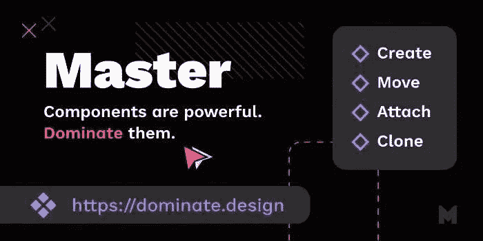

[Master](https://dominate.design/) 是一个管理 Figma 组件的插件。使用它，您可以从设计中的任何内容创建新组件，并附加现有组件。仅当您知道工作需要新组件时才创建新组件，并在此过程中保留覆盖。

和之前的插件一样，Master 也会将主要组件移动到自己的位置。然而，Master 的附加功能是有代价的，单用户终身许可证的费用是 37.5 美元。

## 现成组件

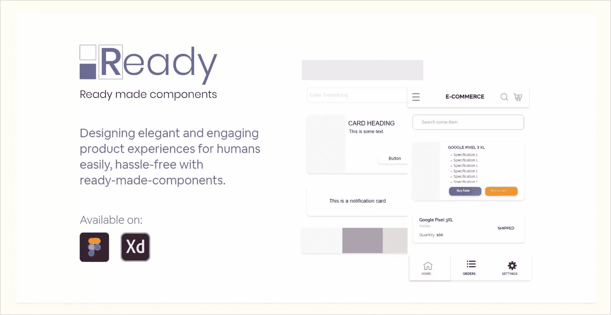

Ready Components 是一个从样板文件中创建可重用组件的优秀插件。它提供现成的组件，这些组件是通用的，可以在任何 UI 设计中使用。可以轻松定制组件颜色和各种属性。

Ready Components 是一个免费插件。

## 颜色编码

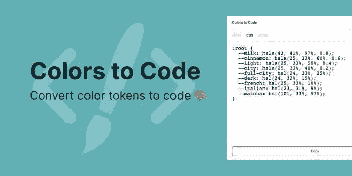

[Colors to Code](https://www.figma.com/community/plugin/857997781988109369/Colors-to-Code) 将颜色标记转换为代码，使将设计系统的调色板转换为有用的格式变得更加容易。它目前支持 JSON、CSS、SCSS 和 Android 格式。

Colors to Code 是一个免费插件。

## Figma 的零高度

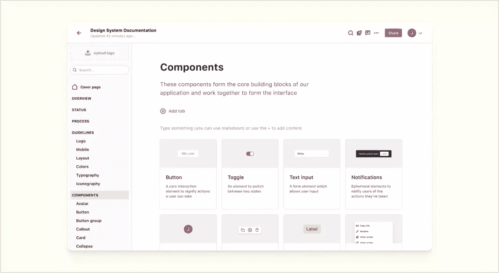

[ZeroHeight](https://zeroheight.com/figma-2) 是一款协作工具，让您轻松创建生活方式指南，并将您所有的设计系统文档保存在一个地方。

它可以快速设置，可以由非技术团队成员编辑，并跨包括 Figma 在内的多个平台进行同步，以确保您的设计系统在所有工作面上保持最新。

ZeroHeight 已经为团队支付了起价 49 美元/月的计划，但有一个免费的编辑和一个风格指南。

## 对比

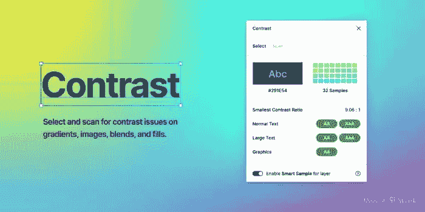

如果你是一名设计师，你知道易访问性是很重要的。确保你的网站符合 WCAG 准则对于确保每个人都能使用你的网站是至关重要的。可访问性的一个最重要的方面是对比度。

[Contrast](https://www.figma.com/community/plugin/748533339900865323/Contrast) 是一个 Figma 插件，它可以让您在工作时轻松检查颜色的对比度，因此您可以确保您的设计是可访问的。

当您在图层上运行对比度时，它会检查您的选择背后的颜色，并提供对比度以及 WCAG 参考通过和失败级别。

您还可以扫描整个 Figma 页面，生成一份关于所有基于文本的对比度问题的报告。

Contrast 是一个免费插件。

## Figma 到 HTML

[Figma 到 HTML](https://github.com/BuilderIO/figma-html) 将 Figma 图层转换为 HTML、CSS、React、Vue、Svelte、Solid 等等。输出是高质量、响应迅速的前端代码。

如果你需要将 Figma 层转换成前端代码，Figma to HTML 就是适合你的插件。快速轻松地将您的 Figma 设计导出为干净、响应迅速的前端代码。

您还可以使用该插件将 HTML 从任何网页导入 fig ma——非常适合快速创建基于实时网站的设计组件。有了 Figma to HTML，很容易把真正的站点组件变成设计组件。只需在运行插件后输入您想要导入的 URL，而无需选择图层。

Figma to HTML 是一个免费插件。

## 颜色搜索

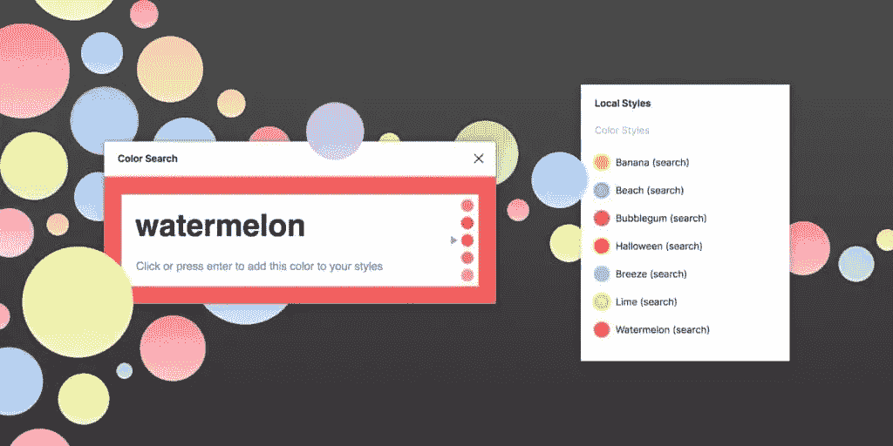

如果你是一名设计师，很可能你以前就已经开始寻找颜色了。也许你正在寻找那种完美的绿色来搭配你客户的标志，或者你正在为你最新的项目寻找一种配色方案。

不管怎样，[颜色搜索](https://www.figma.com/community/plugin/768550475442788437/Color-Search)是 Figma 的一个很棒的插件，可以帮你解决这个问题。输入任何术语，它将返回多达五种颜色选项。选择你最喜欢的，并从插件中将它们添加到你的本地风格中。颜色搜索是一个方便的工具，可以节省您的时间和麻烦。

颜色搜索是一个免费的插件。

## 模式英雄

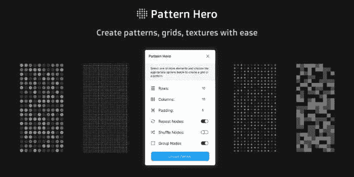

[Pattern Hero](https://www.figma.com/community/plugin/740556241021336678/Pattern-Hero) 是一个设计工具，可以让你轻松创建图案。

使用 Pattern Hero，您可以用可选的填充来重新组织网格中的所有元素。你还可以随意组合和重复元素，形成更有趣的图案，例如在创建无缝图案背景时。

从组件创建模式，模式英雄将创建选择的实例，而不是克隆组件。这使您可以轻松地调整主组件，以查看所创建的模式的相应变化。

模式英雄是一个免费插件。

## 主题

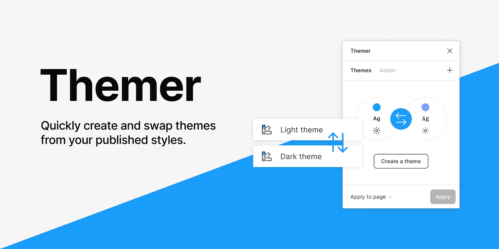

主题是一个 Figma 插件，它可以让你轻松地在你的团队库中创建和切换不同的主题。

使用主题，您可以将发布的样式与主题名称相关联，然后通过交换主题之间不匹配的样式，轻松地在主题之间切换。

这意味着您的团队库中可以有多个主题，并且可以在它们之间轻松切换，而不必手动更新每个主题中的共享样式。

Themer 是一个免费插件。

## 布局网格可视化工具

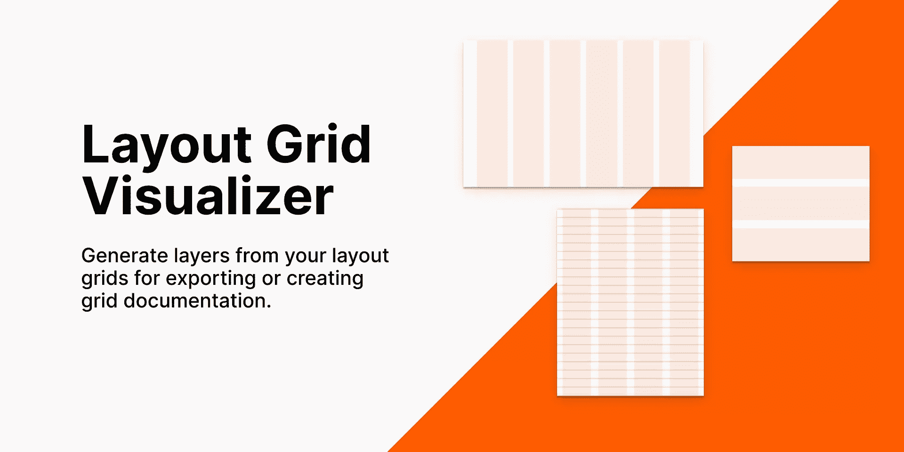

[布局网格可视化工具](https://www.figma.com/community/plugin/831003768229656707/Layout-Grid-Visualizer)从您的布局网格生成图层，以便您可以导出图像或准备图表来补充您的设计系统文档。

该插件将为所有网格生成图层(每个网格都在它们自己的嵌套框架中，因此它们可以被切换)。由于生成的所有层都是矩形，您可以随意设计它们的样式。

布局网格可视化是一个免费插件。

## 用户概要

[User Profile](https://www.figma.com/community/plugin/749945157855564842/User-Profile) 是一个 Figma 插件，使设计师能够在他们的设计原型(或设计系统组件文档)中显示高质量生成的头像。

选择任何形状并运行插件，它会填充一张随机的照片。就是这样！用户配置文件是为您的设计添加个性的一种快速简单的方法。由于头像是随机生成的，你永远不用担心使用同一个图像两次。

用户档案是一个免费插件。

## AutoLayout

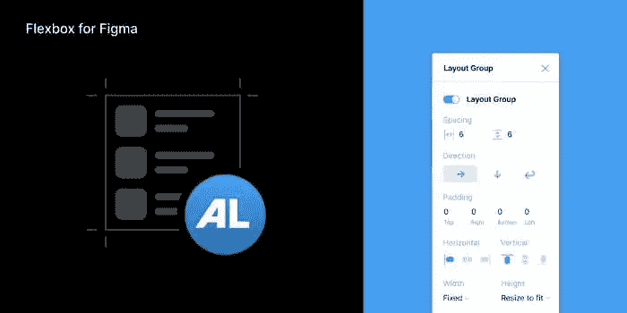

AutoLayout 是一个设计响应界面布局的强大工具。它允许设计者定义子层相对于其父框架应该如何定位和调整大小，并且当子层的尺寸改变时，它将自动更新布局。

这使得它非常适合设计需要适应不同屏幕大小或方向的布局——就像插件描述中提到的 Flexbox for Figma。

AutoLayout 是一个免费的插件。

## 措施

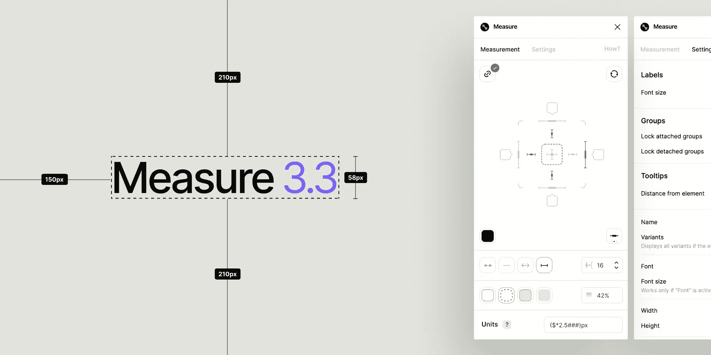

使用[测量](https://www.figma.com/community/plugin/739918456607459153/Measure)，您可以快速轻松地获得设计项目的精确测量值。

设计师知道测量是设计过程的一个重要部分。无论你是在设计网站还是海报，精确测量尺寸和距离都是必不可少的。

然而，测量设计元素既费时又烦人，尤其是在处理复杂的设计时。这就是衡量的意义所在。

Measure 是一个 Figma 插件，它可以方便地测量元素之间的距离，添加高度和宽度的红线，填充空间等等。

如果你正在寻找一种简单的方法来获得精确的测量，Measure 绝对值得一试。

Measure 是一个免费插件。

## 洛蒂菲莱斯

如果你正在寻找一种给你的设计增加一些动感的方法，那么你需要看看 [LottieFiles](https://www.figma.com/community/plugin/809860933081065308/LottieFiles) 。

使用 Figma 的 LottieFiles 插件，您可以轻松地拖放自己的 dotLottie(。洛蒂)和洛蒂 JSON(。json)文件，或者访问现有的免费 Lottie 动画库。

您还可以在 LottieFiles 上预览您的所有动画，将动画帧作为高质量的 SVG 或 GIF 动画插入。所以如果你想让你的设计更上一层楼，一定要试试 LottieFiles！

LottieFiles 是一个免费插件。

## Minimap(最小化)

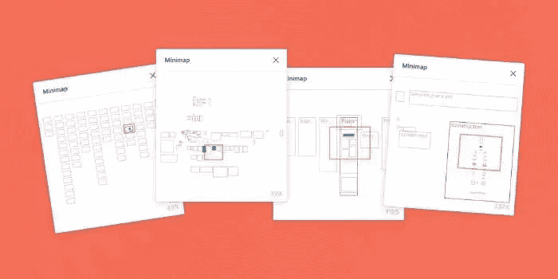

设计系统往往会涉及大型且不断增长的 Figma 文件。

小地图是浏览大型设计的绝佳方式。它消除了在大画布上导航的一些痛苦。第一种方法是通过提供文件的可管理的可视概览。消除四处搜寻并找出你需要的那组层在哪里的需要。

你可以通过一次点击从一个位置快速跳到另一个位置，或者在小地图上点击并拖动来快速浏览页面。双击小地图中的一个框或层，将直接导航到已经选择了正确层的框或层。

小地图是一个免费的插件。

## 字体超赞图标

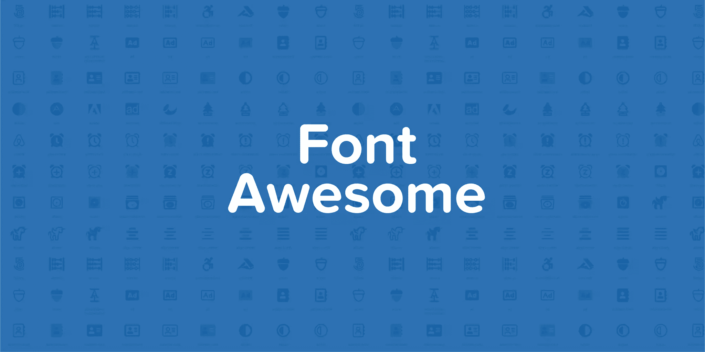

[字体牛逼图标](https://www.figma.com/community/plugin/774202616885508874/Font-Awesome-Icons)可以轻松使用字体牛逼的免费收藏中的任何图标。按名称搜索图标，并将它们拖放到您的画布上。

这些图标都是矢量格式的，所以不管怎样，它们看起来总是最好的。由于它们是矢量图标，您可以轻松地放大或缩小它们，而不会损失任何质量。

字体真棒图标是一个免费插件。

## 线路卡

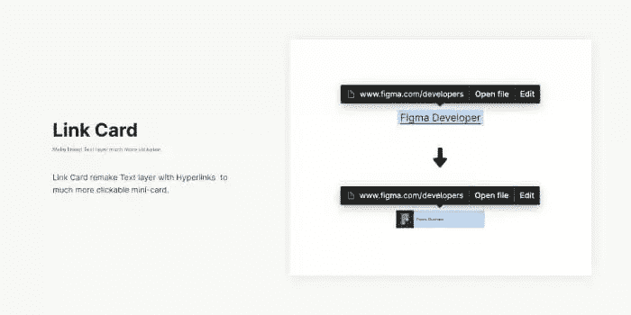

[链接卡](https://www.figma.com/community/plugin/901097294283021064/Link-Card)将 Figma 文档中的文本链接转换成链接卡。

考虑到团队使用的文档，设计系统文件比大多数文件包含更多的链接。

Figma 的文本链接有一个不方便的小点击区域，所以这个插件将帮助你把它们变成更大的迷你卡片。作为奖励，你的参考链接和你的设计作品一起看起来会更好。

Link Card 是一个免费插件。

## Figdoc

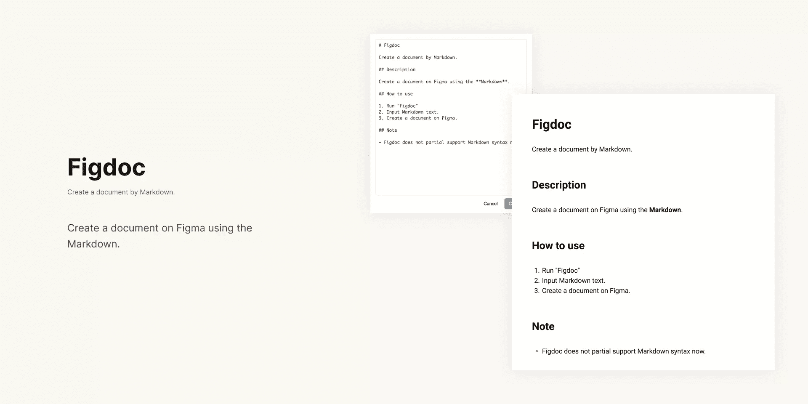

Markdown 是记录你的设计系统的一个很好的工具。首先，它允许您在所有平台上使用相同的格式。这也是一种灵活的格式，写起来感觉天衣无缝。

借助今天的工具，这是一个强大的工具，设计系统工具也不例外。

Figdoc 也为 Figma 带来了 Markdown 的子集。它支持像标题、段落、无序和有序列表这样的基本样式，以及强调和强调样式。

Figdoc 是一个免费插件。

## 列表创建者

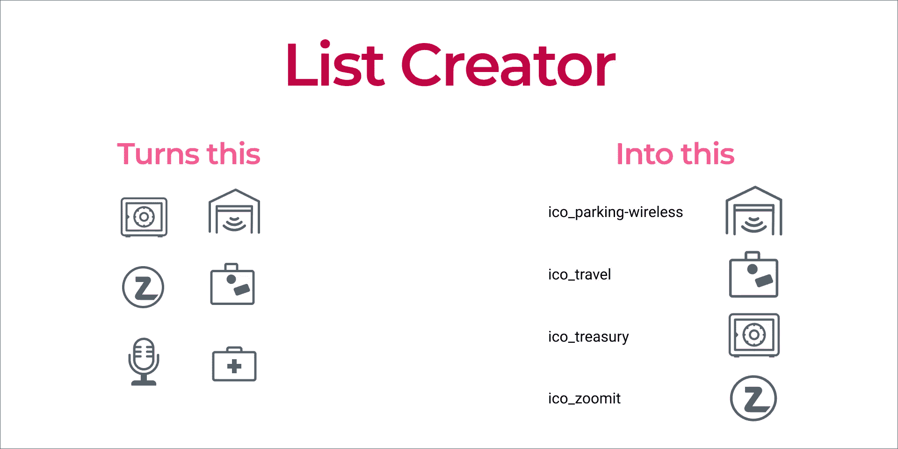

ListCreator 是 Figma 的一个插件，它会立即生成一个带有标签的组件自动布局列表。这是一个简单的工具，但在记录你创建的设计系统时，你会很高兴拥有它。

ListCreator 是一个免费插件。

## 目录生成器

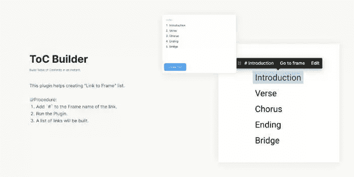

[ToC Builder](http://tfigma.com/community/plugin/971347067329627666/ToC-Builder) 通过创建带有链接的框架索引列表，帮助您组织和记录文件。

只要在你想要包含的框架名称上加一个#号，运行插件，你就会有一个你的文件的目录，包括链接到框架的链接。

ToC Builder 是一个免费插件。

## -好的

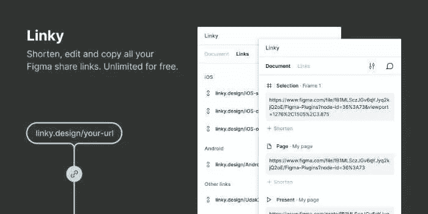

使用 Figma 的免费链接缩短程序 [Linky](https://www.figma.com/community/plugin/833020696010433995/Linky) 缩短并跟踪您的 Figma 共享链接。使用 Linky，您可以创建自定义或随机的字母数字短链接，并查看每个链接的点击量。

Linky 非常适合与客户或合作者共享您的设计，或者共享字体或照片等资源。此外，您可以随时编辑任何缩短的链接。

## 断点

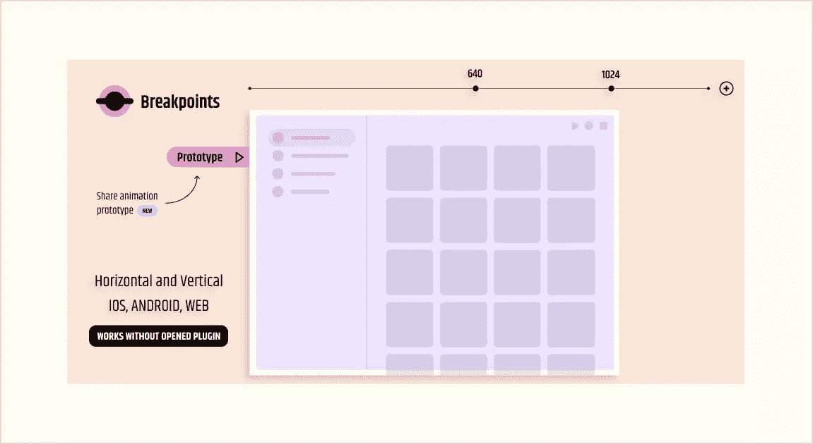

你已经知道设计不同尺寸的屏幕有多重要。使用[断点](https://www.figma.com/community/plugin/824289601590456356/Breakpoints)插件，您可以快速方便地预览 Figma 框架内的响应布局。

如果您需要向其他人展示您的原型，您可以通过共享动画原型来轻松完成。团队中的任何人都可以调整框架的大小，而不必安装插件。这是任何想要创造响应式设计的设计师的必备工具。

断点是一个免费插件。

## 用线串

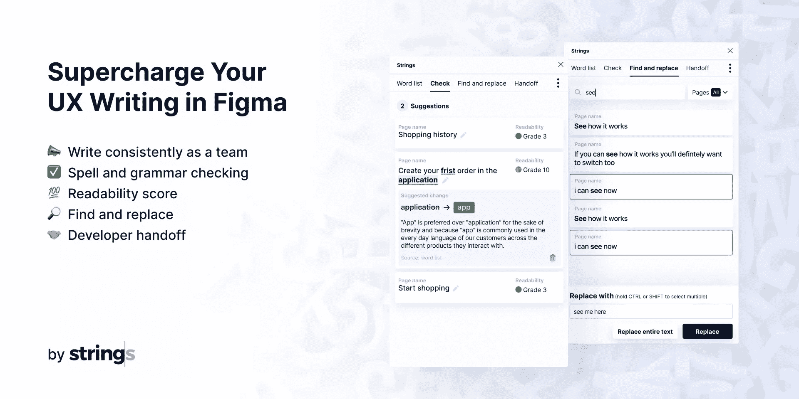

[Strings](https://www.figma.com/community/plugin/907012000809761240/Strings---the-UX-writing-tool) 是一个附带 Figma 插件的工具，可以帮助您改进 UX 复制工作流程并生产更好的产品。

对于设计系统工作，这是一个伟大的工具来管理整个网站，应用程序和组件的缩微副本。撰写符合品牌和产品要求的一致、无误的文案。

此外，它有一个可读性检查器，所以你可以确保你的副本很容易理解你的观众。它还能够批量复制替换，非常适合移交，因为您的开发人员将能够引用字符串，使本地化更容易，更新副本更不容易出现瓶颈。

Strings 是一个团队订阅工具，起价为 12 美元/用户/月，但为最多两个用户提供免费服务。

## 选择变体

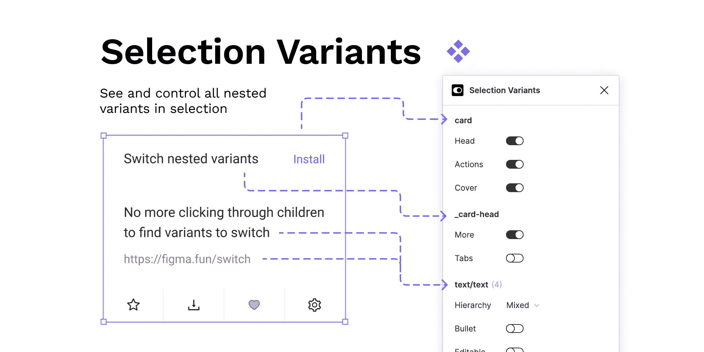

[选择变量](https://www.figma.com/community/plugin/1027413532986522043/Selection-Variants)允许您轻松浏览嵌套变量并在它们之间快速切换。您可以选择多个对象并批量更改变体，这在处理大型项目或复杂元素(如表格)时尤其有用。

通过使嵌套的变体更容易使用，这个插件可以降低你的设计系统的复杂性。有了这个工具的帮助，您可以有效地在变体之间切换，而不需要在嵌套层次中搜寻。

选择变体是一个免费插件。

## 表格创建者

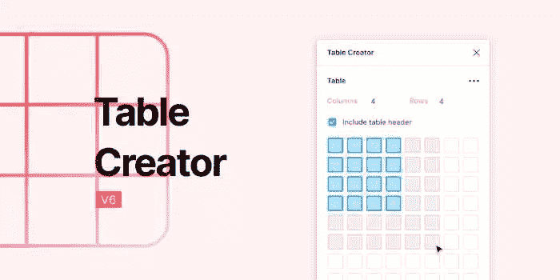

Table Creator 是一个 Figma 插件，你可以用它来简化定制表格的设计。您可以轻松地编辑表格并调整其大小，还可以通过修改标题栏或页脚区域等组件来控制其设计。

当您的设计发生变化时，您所有的复杂表都将保持最新，而无需您付出额外的努力。

表格创建器是一个免费插件。

## 彩色套件

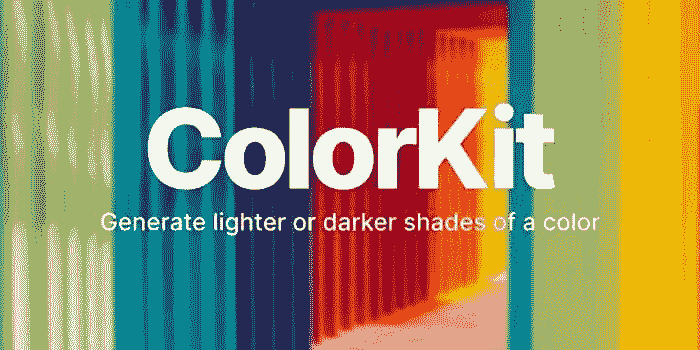

[颜色套件](https://www.figma.com/community/plugin/797696673804519719/Color-Kit)帮助您生成任何颜色的明暗色调。它非常适合创建喜怒无常的调色板或给你的设计一些额外的动态范围！

彩色工具包是一个免费的插件。

## 向导伙伴

如果你正在寻找一种方法来快速方便地将复杂的向导添加到你的设计中， [Guide Mate](https://www.figma.com/community/plugin/739342962452731553/Guide-Mate) 就是适合你的插件。

在插件界面表单中输入您的精确数字，以创建自定义指南。凭借其易于使用的界面，只需点击几下，您就可以添加左、右、上、下或中点参考线。

无论您是在基于网格的设计系统上工作还是做其他事情，Guide Mate 都是这项工作的完美工具。

Guide Mate 是一个免费插件。

## Figit

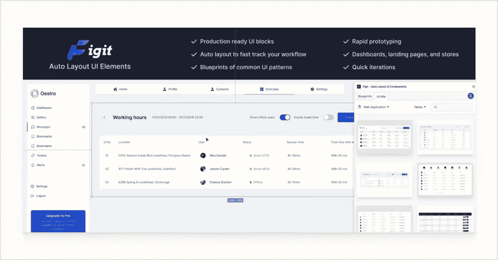

Figit 是一个工具，它可以在创纪录的时间内轻松创建生产就绪的设计，拥有 1000 多个专注于 web 应用程序、电子商务和网站的 UI 模式。

Figit 的模式都是由自动布局驱动的，以节省您的工作时间，让您专注于创造性思维。

这个插件提供了高保真的 UI 元素和低保真度的蓝图。将这些基本模式作为样板文件放入，让您的设计系统开发不再单调乏味。

## 用户界面调色板

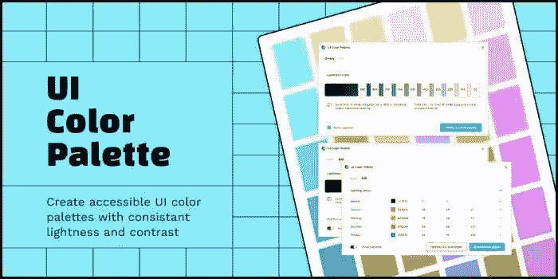

[UI 调色板](https://www.figma.com/community/plugin/1063959496693642315/UI-Color-Palette)是一个免费的基于网络的调色板生成器，它可以帮助您创建具有一致对比度的可访问和兼容的设计。

该插件使用 LCH 模型，根据你的品牌颜色的深浅来生成不同的颜色。然后，您可以将它们保存为本地样式，并发布库以与您的团队共享。

## 结论

有很多优秀的 Figma 插件可以帮助你简化设计系统的工作流程。这些只是我们最喜欢的几个！你用什么插件让你的设计系统开发过程更简单？在[论坛](https://www.sitepoint.com/community/)或[上让我们知道我们的不和谐服务器](https://discord.com/invite/PyAM7tv)。

## 分享这篇文章