# 如何创建令人印象深刻的 GitHub 简介自述文件

> 原文：<https://www.sitepoint.com/github-profile-readme/>

如果你访问我在 GitHub 上的[个人资料](https://github.com/itsZed0)，你会注意到它包含图片、社交网络链接、一些 GitHub 统计数据和我博客的链接，这使得 GitHub 的个人资料非常突出。这可以通过 GitHub profile README 特性来实现。在本文中，我们将学习如何创建 GitHub 概要自述文件。

我们将讨论以下内容:

*   什么是 GitHub 简介自述文件
*   如何创建 GitHub 配置文件自述文件
*   添加社会徽章、技能和自我描述
*   添加 GitHub 统计数据
*   创建 GitHub 工作流来获取最新发布的博客

要跟随教程，您需要对 HTML 和 Markdown 有一个基本的了解。如果你想了解 Markdown，看看这个 [Markdown 简介](https://www.sitepoint.com/learn-markdown/)。此外，您应该有一个 GitHub 帐户。如果你还没有，在 [GitHub](https://github.com/join) 注册。

本教程的代码可以在 GitHub 上找到。

## GitHub 简介自述文件实际上是什么

GitHub 个人资料 README 是 GitHub 的一项功能，允许用户使用名为 README 的 Markdown 文件来编写关于自己的详细信息，如技能、兴趣、GitHub 统计数据，并将其展示给 GitHub 社区。它显示在你的 GitHub 主页的顶部，在固定库的上方。这是一种在 GitHub 上展示个人技能和数据的奇特方式。

下图是我们将为本文创建的 GitHub 概要文件的最终外观。

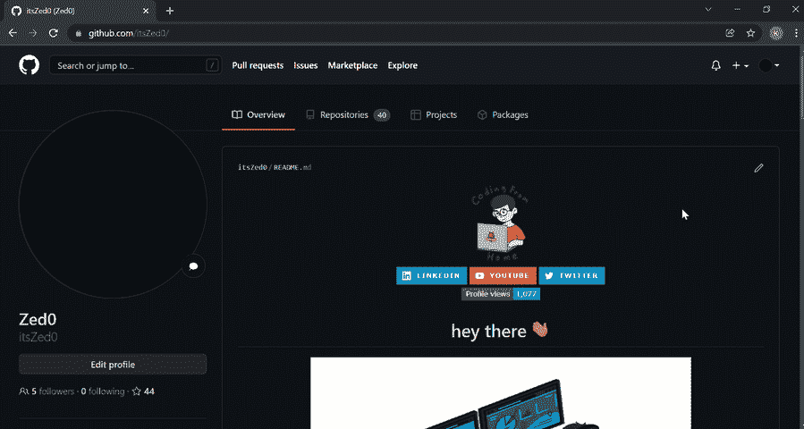

我们将把它分成多个部分，并为每个部分递增地添加内容。背景颜色会根据用户的 [GitHub 主题设置](https://docs.github.com/en/account-and-profile/setting-up-and-managing-your-github-user-account/managing-user-account-settings/managing-your-theme-settings)而改变。

在下一节中，我们将看看创建自述文件的步骤。

## 创建 GitHub 配置文件自述文件

自述文件位于 GitHub 存储库中，其名称与您的 GitHub 帐户的用户名相同。要创建存储库，请执行以下步骤:

1.  登录 [GitHub](https://github.com/) 。
2.  Click on **+** icon at top right of the page and select **New Repository**.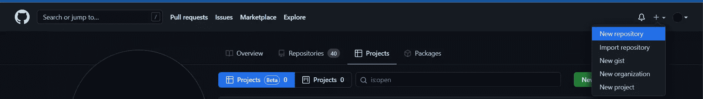
3.  A *Create a new repository* page opens. In the **Repository name** field, enter the username of your GitHub account. After entering the username, GitHub displays a message describing that you’re about to create a GitHub special repository.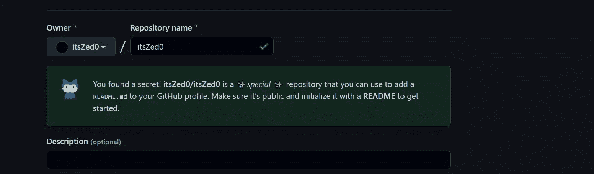
4.  选中存储库类型下的 **Public** 复选框，使访问 GitHub 个人资料页面的每个人都能看到 GitHub 个人资料自述文件。如果你不想让用户看到你还在开发中的 GitHub 简介自述文件，你可以选择**私人**。一旦你完成了自述文件的开发，确保将可见性改为**公共**。
5.  Check the **Add a README file** checkbox. This will add a `README.md` file where we’ll add the profile contents. The field values should look similar to thepicture below.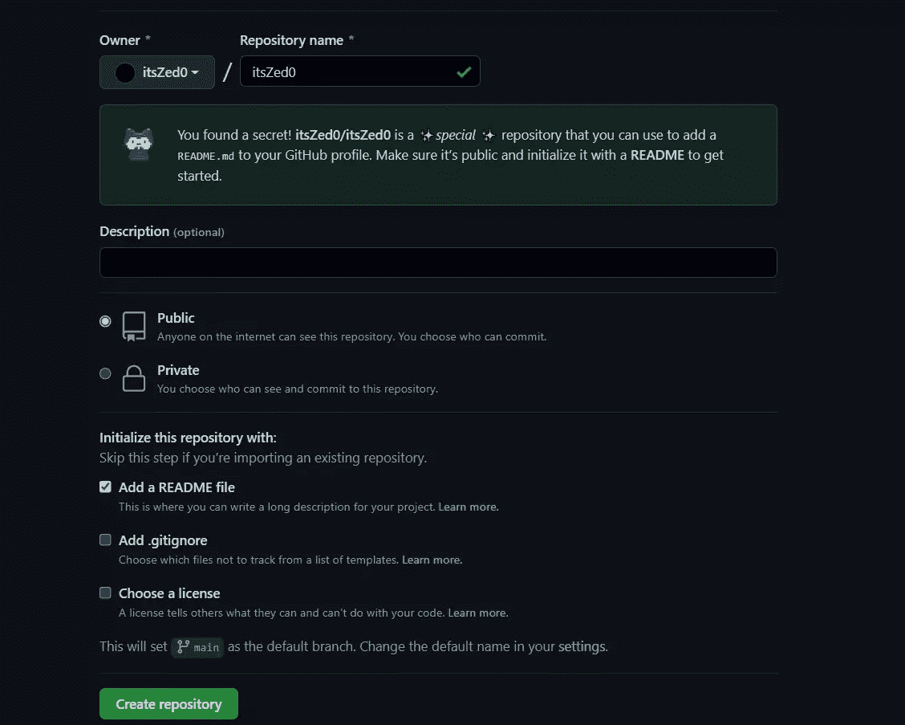
6.  Click on the **Create repository** button. A special repository is created successfully. Go to the repository you just created and you’ll see a `README.md` file added to the repository.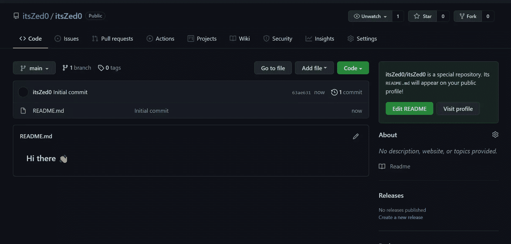

在接下来的几节中，我们将向我们的`README.md`文件添加内容。我们将使用 GitHub 的文件编辑器来编写和预览更改。您可以使用您喜欢的任何其他文本编辑器。

要使用 GitHub 文件编辑器，打开`README.md`并点击页面右上角的*编辑该文件图标*(一个铅笔图标)。你可以在[编辑文件](https://docs.github.com/en/repositories/working-with-files/managing-files/editing-files)上的 GitHub 官方文档中阅读更多关于编辑 GitHub 文件的内容。

## 将 gif 和徽章添加到 GitHub 个人资料自述文件中

这是将添加到此部分的内容的图像:


本节使用的 GIF 可以在[这里](https://giphy.com/stickers/hacktiv8-coding-codingfromhome-fromhome-M9gbBd9nbDrOTu1Mqx?utm_source=media-link&utm_medium=landing&utm_campaign=Media+Links&utm_term=)找到。我在 [Giphy](https://giphy.com/) 上找到了这张 GIF，里面全是免费的 GIF 供使用。

进入 [GIF 链接](https://giphy.com/stickers/hacktiv8-coding-codingfromhome-fromhome-M9gbBd9nbDrOTu1Mqx?utm_source=media-link&utm_medium=landing&utm_campaign=Media+Links&utm_term=)，点击**分享**按钮，然后**复制 GIF 链接**。我们将把这个复制的链接添加到一个 HTML `img`标签中，以便在 Markdown 文件中显示它。我们使用`img`标签，因为它将帮助我们指定图像的宽度。

在 GitHub 文件编辑器中，用以下代码替换`README.md`文件内容:

```
<div id="header" align="center">
  
</div> 
```

`src`属性指向我们在上一步中复制的 URL。由于本节中的所有内容都是居中对齐的，所以我们将图像包装在一个带有`align="center"`属性的 HTML `div`标签中。

*注意:GitHub 将 README Markdown 转换成 HTML，并在 GitHub 上呈现。转换后，HTML 被净化，出于安全原因，它忽略某些 HTML 标签和属性，如`<script>`、`<style>`、`style`等。出于这个原因，我们使用了一个`align`属性来代替 CSS。*

现在转到预览选项卡。下图是我们得到的输出。

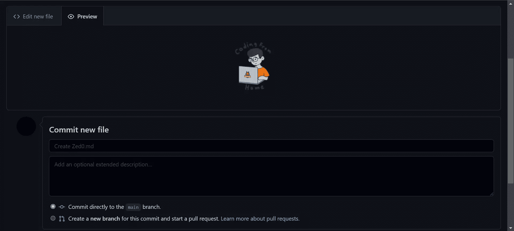

接下来，我们将添加社交网络徽章。点击徽章，它将重定向到各自的社交网站。你可以添加各种网站的社交徽章，如 Instagram、脸书、Twitter 等。对于本教程，我们将添加三个:Twitter，YouTube 和 LinkedIn。

为了获得每个社交网络各自的徽章，我们将使用 [Shields.io](https://img.shields.io/) ，它提供了各种端点，允许用户创建和定制社交徽章。我们将使用 https://img.shields.io/badge/的[URL，并向该 URL 传递额外的参数，以获得相应的社会徽章。](https://img.shields.io/badge/)

我们将传递的第一个参数的格式如下:

```
Label-Color 
```

`Label`是徽章上显示的社交网站名称。
`Color`是徽章的颜色。

对于三个社交网络，该参数的值将为:

*   领英:领英-蓝色
*   推特:推特-蓝色
*   YouTube:YouTube-红色

当与[https://img.shields.io/badge/](https://img.shields.io/badge/)结合时，为 LinkedIn 创建了以下 URL:

```
https://img.shields.io/badge/LinkedIn-blue 
```

在浏览器中输入上述 URL 后，我们得到以下输出:

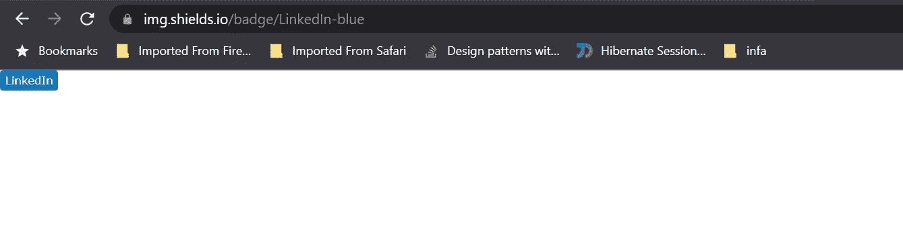

请注意，我们还没有添加徽章图标。为了添加它，我们将使用以下格式的两个查询参数:

```
logo={your social network icon name}
logoColor={color of the icon} 
```

我们将把这两个参数添加到 URL 中，如下所示:

```
https://img.shields.io/badge/LinkedIn-blue?logo=linkedin&logoColor=white 
```

我们还将在上面的 URL 中添加一个样式参数。有各种各样的风格可供选择，你可以在 [Shields.io](https://img.shields.io/) 找到细节。我们将使用`for-the-badge`样式。

LinkedIn 的最终网址是:

```
https://img.shields.io/badge/LinkedIn-blue?logo=linkedin&logoColor=white&style=for-the-badge 
```

现在，当我们在浏览器中点击这个 URL 时，我们得到如下图所示的输出。

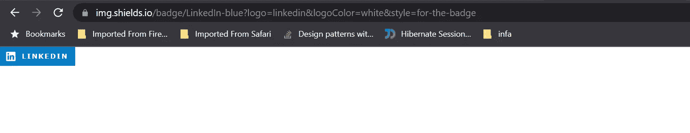

同样，我们为其他徽章创建 URL:

```
https://img.shields.io/badge/YouTube-red?style=for-the-badge&logo=youtube&logoColor=white
https://img.shields.io/badge/Twitter-blue?style=for-the-badge&logo=twitter&logoColor=white 
```

我们将每个 URL 包装在`img`标签中，如下所示:

```
<div id="badges">
  
  
  
</div> 
```

我们已经将图像包装在`<div>`标签中，以确保所有徽章都在一行中。上面的代码将只显示从 URL 生成的图像。为了给每个徽章添加超链接，我们将用一个`<a>`标签包装每个图像。

在带有`id="header"`的`<div>`标签内和 GIF ``标签后添加以下代码。确保将`href`属性更改为指向您的社交档案:

```
<div id="badges">
  <a href="your-linkedin-URL">
    
  </a>
  <a href="your-youtube-URL">
    
  </a>
  <a href="your-twitter-URL">
    
  </a>
</div> 
```

下图是我们得到的输出。


在这一部分的下一步，我们有一个 profile views 计数器。它会计算你的 GitHub 档案被访问的次数。我们将使用一个提供查看计数器徽章的开源项目，其文档可在 GitHub Profile[Views Counter](https://github.com/antonkomarev/github-profile-views-counter)获得。我们使用它的方式类似于使用社会徽章。下面是相同的端点。我们还将向该 URL 添加一些样式参数:

```
https://komarev.com/ghpvc/?username=your-github-username 
```

在带有`id="badges"`的`<div>`标签后添加以下代码。确保将`your-github-username`替换为您的用户名:

```
 
```

下图是我们得到的输出。

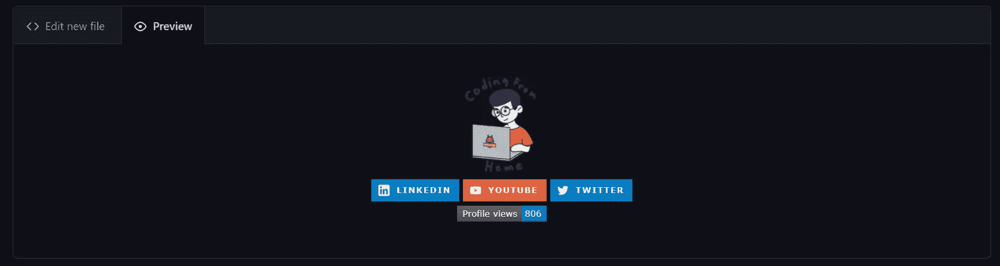

这部分的最后一部分是带有 wave ( `:wave:` ) GIF 的文本。GIF 取自 Giphy，可以在这里找到[。](https://giphy.com/stickers/transparent-hvRJCLFzcasrR4ia7z?utm_source=media-link&utm_medium=landing&utm_campaign=Media+Links&utm_term=)

在 profile view 计数器``标签后添加以下代码:

```
<h1>
  hey there
  
</h1> 
```

输出如下图所示。

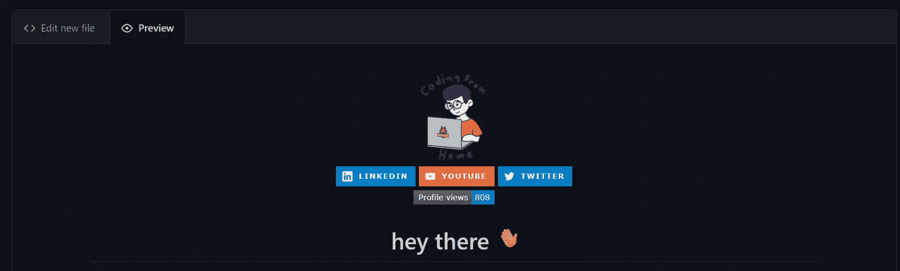

点击**提交更改**按钮保存更改。这就完成了 GitHub 概要自述文件的第一部分。让我们向我们的`README.md`文件添加更多的内容。

## 添加横幅 GIF 和“关于我”部分

以下是我们将在此部分添加到个人资料页面的内容:

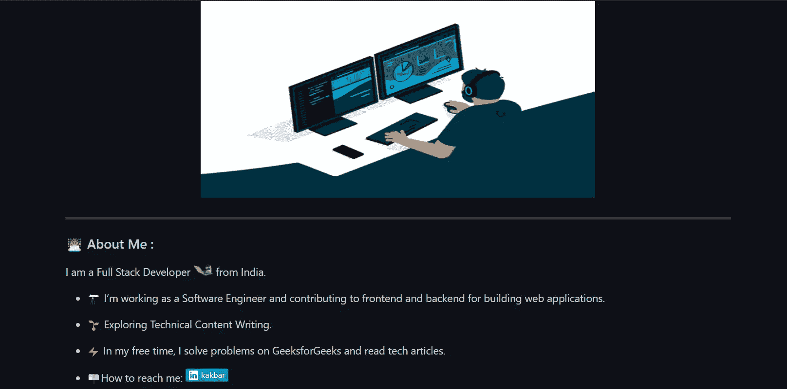

在这一部分，我们将添加 GIF 和一些描述我们自己细节的单词。你可以在这里找到 GIF [。](https://giphy.com/gifs/webdesign-webtasrimi-gitialmarketing-dWesBcTLavkZuG35MI?utm_source=media-link&utm_medium=landing&utm_campaign=Media%20Links&utm_term=)

为了添加 GIF，我们将使用一个``标签，指定一个高度和宽度，并将其包裹在一个`<div>`中，以使用`align="center"`将 GIF 居中。将以下代码添加到您的`README.md`文件中:

```
<div align="center">
  
</div> 
```

其输出如下所示。


接下来，我们将添加“关于我”部分的内容。对于描述文本，我们将使用 Markdown 语法，因为我们不需要任何形式的对齐。在`README.md`中追加以下代码:

```
---

### :woman_technologist: About Me : 
```

`---`是在新的一节前增加一条横线。Markdown 中的水平标尺应该由空白行包围。`:woman_technologist:`是所用表情符号的简称。对于男性版本，你可以使用`:man_technologist:`。对于其他人，可以用`:technologist:`。你可以在 [GitHub repo](https://github.com/ikatyang/emoji-cheat-sheet/blob/master/README.md) 中找到表情符号和相应短码的列表。

接下来，我们将添加一个个人的单行介绍，并使用 wave ( `:wave:` ) GIF。将以下代码附加到`README.md`:

```
I am a Full Stack Developer  from India. 
```

接下来是关于你自己的几点列表。为了显示一个列表，我们将使用`-` Markdown 语法。我们还会在每一行前面加上表情符号。将以下代码添加到`README.md`中，并根据您的个人资料进行更改。此外，将`your-linkedin-url`更改为您的个人资料网址:

```
- :telescope: I’m working as a Software Engineer and contributing to frontend and backend for building web applications.

- :seedling: Exploring Technical Content Writing.

- :zap: In my free time, I solve problems on GeeksforGeeks and read tech articles.

- :mailbox:How to reach me: [](your-linkedin-url) 
```

注意，在最后一行，内部的``语法是显示 LinkedIn 徽章图像。外部的`[]()`是 Markdown 超链接语法，使徽章指向 LinkedIn 个人资料 URL。我们在这里使用 Shields.io 来显示定制的 LinkedIn 徽章。您还可以添加其他链接，以便人们可以联系到您。

见下图输出。

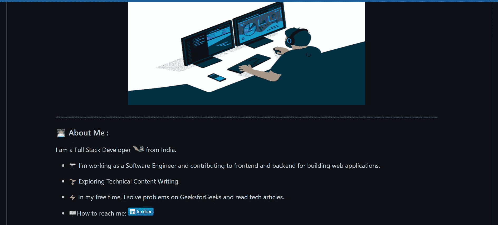

## 添加语言和工具

这是我们将在此部分添加的内容的图片。

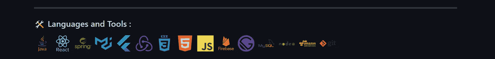

对于标题，将以下代码添加到`README.md`:

```
---

### :hammer_and_wrench: Languages and Tools : 
```

我们将添加代表技术和技能的图片。你可以在 [DevIcons GitHub 库](https://github.com/devicons/devicon/)中找到许多语言和工具的免费徽标。

进入[图标文件夹](https://github.com/devicons/devicon/tree/master/icons)，搜索并打开`react`文件夹。你会发现 SVG 和 EPS 格式的图像。单击任何图像，复制浏览器地址栏中显示的 URL。

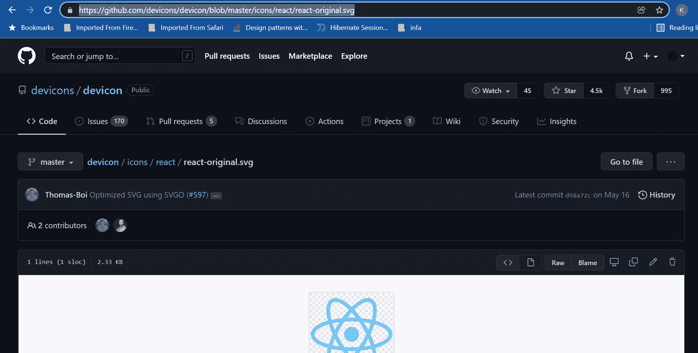

我们将在``标签中使用这个 URL，并相应地指定`height`和`width`属性。同样，你可以搜索其他技能，并把它们添加到单独的``标签中。

将下面的代码添加到`README.md`。在您的个人资料中添加/删除必要的技能:

```
<div>
  &nbsp;
  &nbsp;
  &nbsp;
  &nbsp;
  &nbsp;
  &nbsp;
  &nbsp;
  &nbsp;
  &nbsp;
  &nbsp;
  &nbsp;
  &nbsp;
  &nbsp;
  &nbsp;
  
</div> 
```

结果如下图所示。

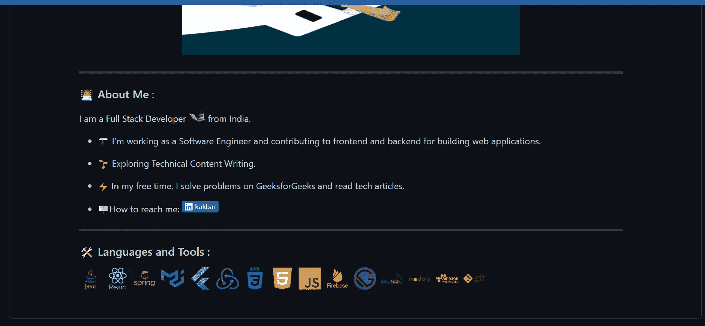

## 添加 GitHub 统计数据

这是我们将在这一部分添加的内容的图像。

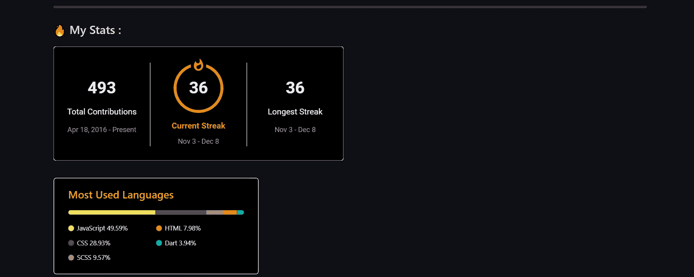

对于标题，将以下代码添加到`README.md`:

```
---

### :fire: My Stats : 
```

我们将添加一些关于用户 GitHub 活动的统计数据，比如提交次数、pr 数等。，到这一节。GitHub 上有许多开源项目为 GitHub 档案提供不同的统计数据。在本教程中，我们将看到如何使用两个这样的开源项目。

第一个提供 GitHub stats 的开源项目是 [GitHub Streak Stats](https://github.com/DenverCoder1/github-readme-streak-stats) 。该项目提供了以下三种统计信息:

*   用户贡献的总数
*   用户最长的投稿记录
*   用户的当前连胜状态

使用以下 URL 访问统计数据:

```
https://github-readme-streak-stats.herokuapp.com/?user=your-github-username 
```

我们可以通过向上面的 URL 添加查询参数来添加定制，如主题、背景颜色等。将以下代码添加到`README.md`。用您的 GitHub 用户名替换`github-username`:

```
[](https://git.io/streak-stats) 
```

这里有一个以`itsZed0`为用户名的预览。

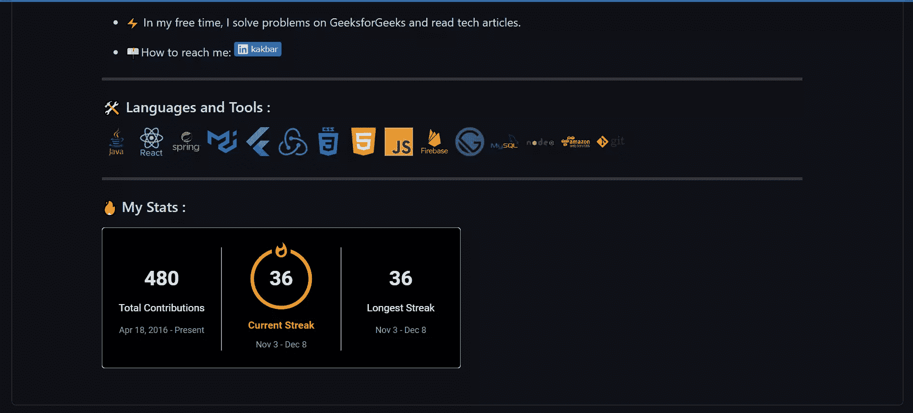

我们还可以使用 [Streak Stats 网站](http://github-readme-streak-stats.herokuapp.com/demo/)来生成 URL。为此，请按照下列步骤操作:

1.  进入[连胜统计网站](http://github-readme-streak-stats.herokuapp.com/demo/)。在**用户名**字段中，输入您的 GitHub 用户名。根据需要更改其他字段。
2.  一旦你定制了所有的字段，点击**提交**按钮。
3.  降价生成后，点击**复制到剪贴板**按钮，将复制的降价添加到`README.md`。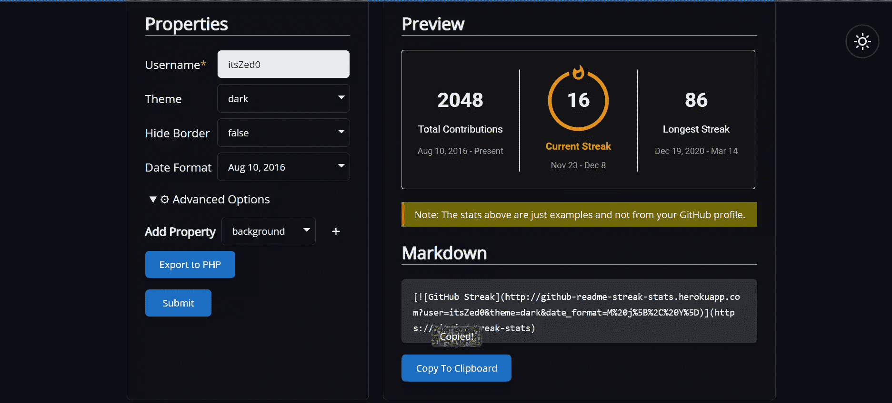

下一个提供更多 GitHub 用户统计数据的开源项目是 Anurag Hazra 的 [GitHub Readme Stats](https://github.com/anuraghazra/github-readme-stats) 。该项目提供了许多统计数据，但是对于本教程，我们将只使用显示 GitHub 用户使用的顶级语言的数据。如果您想从这个项目中探索和使用更多的统计数据，您可以浏览他们的存储库中提供的详细文档。

下面是显示用户首选语言的降价:

```
[](https://github.com/anuraghazra/github-readme-stats) 
```

我们可以对其进行定制，以提供不同的颜色，限制显示的语言的最大数量，等等。有关定制的详细信息，请参考 [GitHub Readme 统计库](https://github.com/anuraghazra/github-readme-stats)。

将以下代码添加到`README.md`。用您的用户名替换`your-github-username`:

```
[](https://github.com/anuraghazra/github-readme-stats) 
```

下图是我的`itsZed0`账户的预览。

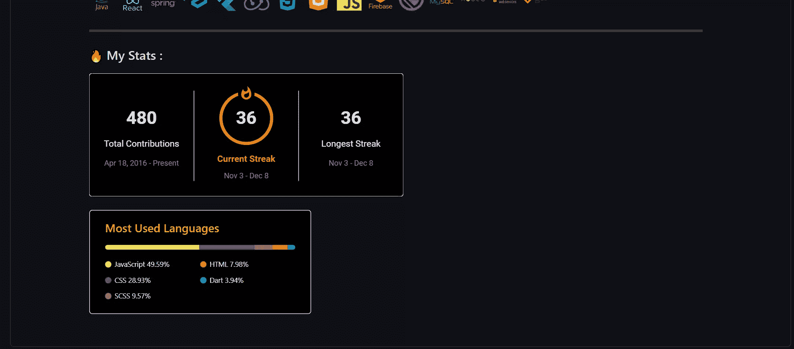

## 将最近的博客添加到您的 GitHub 个人资料自述文件

下图显示了我们在这一部分的目标。

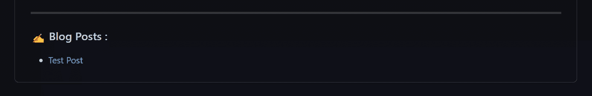

对于标题，将以下代码添加到您的 GitHub 概要文件`README.md`:

```
---

### :writing_hand: Blog Posts : 
```

这一部分将展示一个 GitHub 用户最近在不同博客平台上发表的博文。为了实现这一点，我们将创建一个 GitHub 工作流，这是一个执行作业的自动化流程。工作流中的每个作业都有一个或多个操作。GitHub 动作是一组组合成步骤的可执行命令。我们可以创建自己的 GitHub 动作，也可以使用其他用户创建的动作。

为了获取博客文章，我们将使用两个已经存在的操作:

*   [签出](https://github.com/actions/checkout):用于将当前存储库中的所有文件签出到 Git 工作区，我们的工作流可以在那里访问这些文件。
*   [博文工作流](https://github.com/gautamkrishnar/blog-post-workflow):用于获取用户最近在各个网站上发布的博文。

工作流可以按照特定的时间表或事件触发器运行。对于本教程，我们将每隔一小时执行一次工作流，以获取最近的博客文章。你可以从官方[文档](https://docs.github.com/en/actions/learn-github-actions/understanding-github-actions)中读到更多关于 GitHub 动作的内容。

要配置 GitHub 工作流，请遵循以下步骤:

1.  将以下代码添加到您的`README.md`中。工作流将用已发布的博客文章列表替换下面的评论:

    ```
    <!-- BLOG-POST-LIST:START -->
    <!-- BLOG-POST-LIST:END --> 
    ```

2.  点击**提交更改**按钮保存更改。
3.  The configuration of GitHub workflow is defined in a `.yml` file, which follows a [YAML](https://www.redhat.com/en/topics/automation/what-is-yaml) syntax. In your repository, in the **Add File** dropdown, select **Create New file**.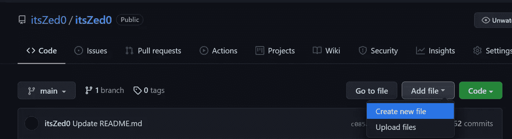
4.  In **Name your file..** field, enter `.github/workflows/blog-post-workflow.yml`. All GitHub workflow’s `.yml` configuration files reside under the `.github/workflows` directory.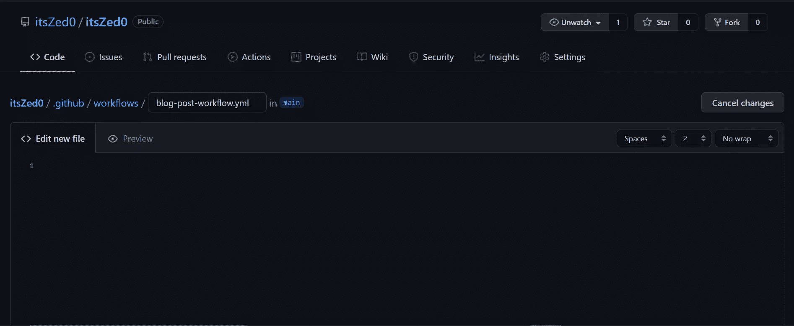
5.  在**编辑新文件**选项卡中添加以下代码:

    ```
    name: Latest blog post workflow
    on:
      schedule:
        # Runs every hour
        - cron: '0 * * * *'
      workflow_dispatch:

    jobs:
      update-readme-with-blog:
        name: Update this repos README with latest blog posts
        runs-on: ubuntu-latest
        steps:
          - uses: actions/checkout@v2
          - uses: gautamkrishnar/blog-post-workflow@master
            with:
              max_post_count: "4"
              feed_list: "https://dev.to/feed/itszed0" 
    ```

在上面的代码中，我们将带有`name`的工作流定义为“最新的博客文章工作流”，它运行`cron`字段中提到的`on` a `schedule`。`0 * * * *`是一个 [POSIX cron 语法](https://pubs.opengroup.org/onlinepubs/9699919799/utilities/crontab.html#tag_20_25_07)，意思是计划在每小时的第 0 分钟运行。

`workflow_dispatch:`允许用户手动触发工作流。`jobs`让我们定义一个或多个将在工作流执行时运行的作业。在我们的例子中，我们有一个任务——那就是`update-readme-with-blog`——GitHub 托管的 Ubuntu 环境机器。

`steps`定义一组要执行的动作或命令。我们在`steps`下定义了两个动作:`actions/checkout@v2`和`gautamkrishnar/blog-post-workflow@master`。后者接受在`with`字段下定义的两个输入参数。`max_post_count`定义了在自述文件中显示的文章的最大数量，`feed_list`是不同博客平台的 URL 的逗号分隔 RSS 提要。

在本教程中，我们已经从 [dev.to](https://dev.to/) 平台获取了博客。有关所有支持平台的列表，请查看[该文档](https://github.com/marketplace/actions/blog-post-workflow#popular-sources)。

要了解更多关于 GitHub 工作流语法的信息，请查看这个[工作流语法文档](https://docs.github.com/en/actions/learn-github-actions/workflow-syntax-for-github-actions)。

将`feed_list`替换为您的 RSS 提要 URL，并点击**提交新文件**按钮。这将成功创建工作流。它会每小时从 dev.to 获取新的博客文章并添加到你的`README.md`文件中。

要手动触发工作流，请执行以下步骤:

1.  在您的存储库中，转到**动作**选项卡。
2.  在**所有工作流程**下，点击**最新博文工作流程**。
3.  In the **Run workflow** dropdown, click on the **Run workflow** button. The workflow will start executing.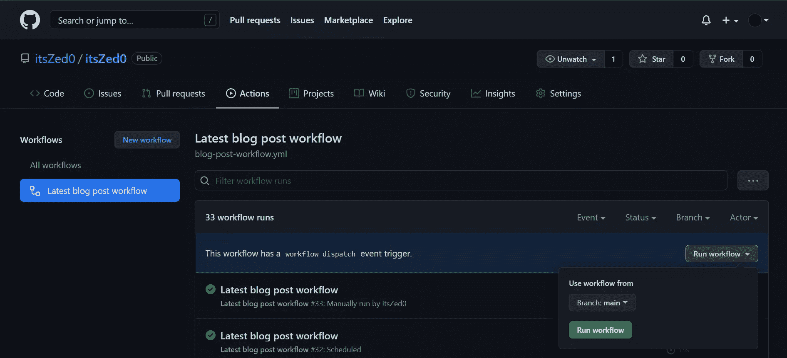
4.  Go to your GitHub profile page, and under the “Blog Posts” section you’ll see a list of all the blog posts from the blogging platforms defined in the `blog-post-workflow.yml` file. Below is the output for `"https://dev.to/feed/itszed0"` in the `feed_list`.

请注意，用户`itsZed0`在 dev.to 有一篇名为“测试帖”的文章，可以在[这里](https://dev.to/itszed0)找到。因此，工作流获取那篇文章，并将其显示在 GitHub profile README 中。

最终的 GitHub 简介如下图所示。


## 结论

在本教程中，我们学习了什么是 GitHub 概要文件自述文件，以及如何:

*   创建 GitHub 配置文件自述文件
*   添加 gif、描述、技能
*   添加 GitHub Streak Stats 和 GitHub Readme Stats
*   创建一个 GitHub 工作流来获取最新发布的博客文章

我希望这篇教程能启发你创建一个令人惊叹的 GitHub 简介自述文件。此外，您可以浏览这些开源项目，让您在 GitHub 档案自述文件中添加一些更酷的功能:

*   [显示每周开发指标](https://github.com/athul/waka-readme)
*   [显示 Spotify 最近播放的歌曲卡](https://github.com/kittinan/spotify-github-profile)
*   [每天展示一个新的编程笑话](https://github.com/ABSphreak/readme-jokes)

## 分享这篇文章