# 最好的 Figma 插件:50+工作流增压器

> 原文：<https://www.sitepoint.com/figma-plugins-optimize-workflow/>

Figma 是一款神奇的设计工具，可以帮助你创建你梦想中的用户界面。 Figma 插件是设计过程中的重要工具，帮助您创建更复杂的布局和设计。在本文中，我们将探索一些我们最喜欢的 go-to Figma 附加组件。

当使用 Figma 进行设计时，模板、图标和插件使您的工作更容易，并最大限度地发挥您的能量，同时为创造力留下更多空间。

有许多可用的 Figma 插件，每天都有更多的插件被开发出来。作为一个熟悉界面的设计师，找到绕过它们的方法并不需要专业知识，因为它们通常是直观的和有据可查的。

## 如何安装 Figma 插件

查找 Figma 插件只需通过关键字搜索并浏览应用内社区页面上的各种资源，然后点击**安装**将插件添加到您的帐户。

你需要刷新你的设计标签来显示新安装的插件。

## 最佳 Figma 插件分类

*   [响应式设计插件](#responsivedesignplugins)
*   [色彩管理插件](#pluginsforcolormanagement)
*   [图像资产插件](#imageassetplugins)
*   [字体插件](#fontplugins)
*   [插画插件](#illustrationplugins)
*   [动画插件](#animationplugins)
*   [线框插件](#wireframingplugins)
*   [生产力插件](#pluginsforproductivity)
*   [辅助布局设计的插件](#pluginstoaidlayoutdesign)
*   [辅助功能插件](#accessibilitiesplugins)
*   [电子邮件模板插件](#emailtemplateplugins)
*   [创建 SVG 的插件](#pluginsforcreatingsvgs)
*   [内容插件](#contentplugins)
*   [图标插件](#iconplugins)

## 响应式设计插件

首先，我们将探索一些更好的用于响应式设计的 Figma 插件。

### 阿尼玛

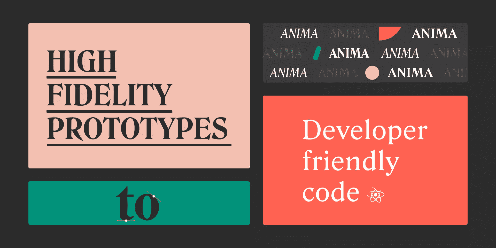

[Anima](https://www.figma.com/community/plugin/857346721138427857/Anima---Export-to-React%2C-HTML-%26-Vue-code) 可以将你的[高保真 Figma 原型](https://www.sitepoint.com/figma-prototyping/)转换成开发者友好的 HTML、CSS、React 和 Vue。您可以使用断点和引脚为所有屏幕尺寸创建一个原型。这个插件是由 Anima 创建的，它还可以让你访问实时的交互式原型，并让你嵌入视频、动画、真实输入字段、悬停效果和自定义代码，同时直接从 Figma 工作以节省时间。访问某些功能可能需要 Anima 会员资格。

### CSSGen

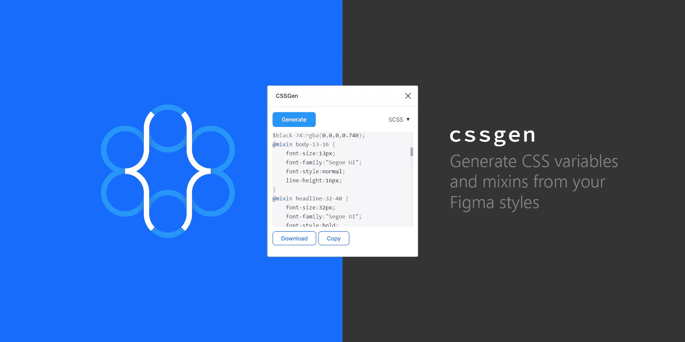

由微软和 Ori 齐夫创建的 CSSGen ，可以让你从本地 Figma 风格中生成 Sass 或更少的代码。这个插件读取 Figma 文档中所有使用过的样式，并允许你将它们导出到 Sass 或更小的版本中。

### 负责

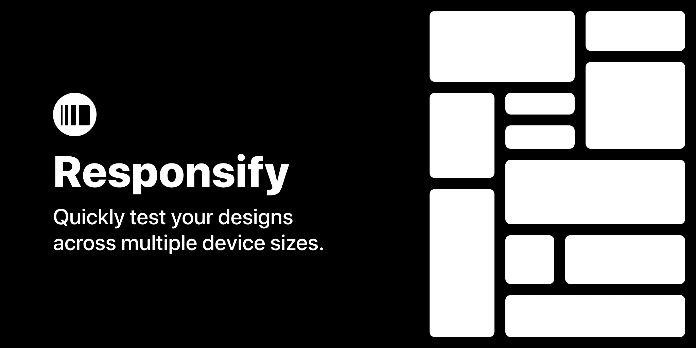

借助 [Responsify](https://www.figma.com/community/plugin/743654854885744527/Responsify-%E2%9A%A1%EF%B8%8F) ，您可以快速测试多种设备尺寸的设计。您必须选择任何框架、组件或实例，并运行 Responsify 插件来查看您的设计在几个屏幕上的外观。它是由布莱恩·洛温创造的。

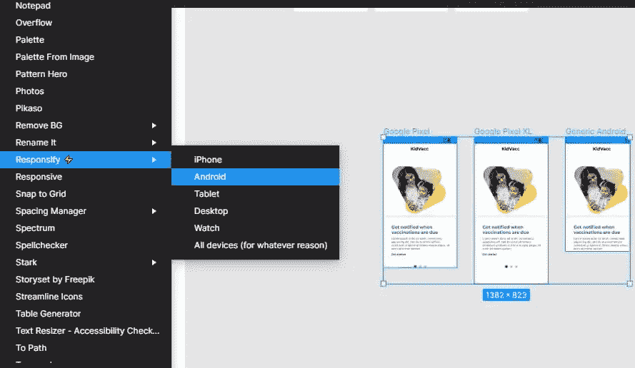

### 制造商

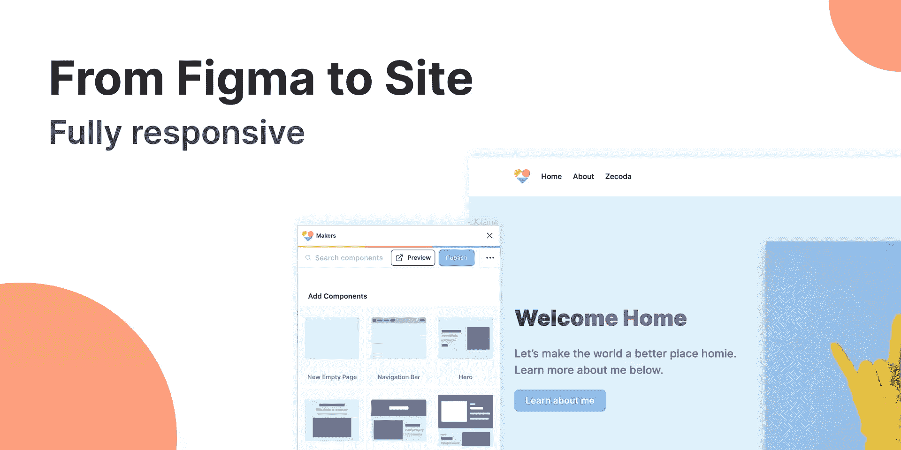

“从 Figma 到 site”:[Makers](https://www.figma.com/community/plugin/991438050654881175/Makers-%E2%80%A2-From-Figma-to-Site)将 Figma 设计自动发布到自定义域的能力将会使社区受益。尤其是对于简单的项目。有了这个插件，你可以建立登陆页面、文件夹和个人网站。为了成功使用这个 Figma 插件，你必须使用他们的内置组件进行设计，或者如果你已经有了设计，就复制你的工作。

### 助理

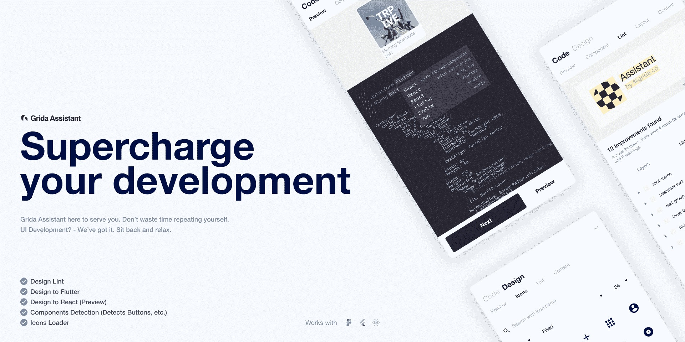

Grida 的助手将立即生成可用于生产的可读代码。它通过工作代码对您的设计提供即时反馈，以及可执行和响应的预览。Assistant 是一个开源项目。

### 断点

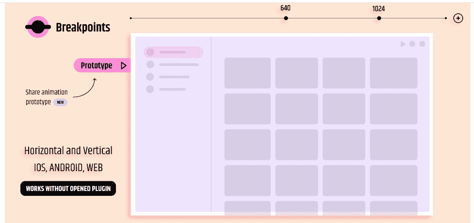

[断点](https://www.figma.com/community/plugin/824289601590456356/Breakpoints)是由 Floweare 创建的，它可以让你预览 Figma 框架内的响应布局。它甚至在没有打开插件窗口的情况下也能工作，你团队中的任何人都可以在没有安装插件的情况下调整框架的大小。这有助于您更快更好地做出设计决策。你也可以分享动画原型。

### 采用双字节对字符进行编码

[UIcode](https://www.figma.com/community/plugin/918076234140513123) 让您在 Figma 中立即获得干净的手机设计代码。它可以一次为所有屏幕或单独为每个屏幕生成和导出代码。这个插件是由 Techsteps 创建的，它减少了您的工作量，因为代码只需要开发人员做最少的收尾工作。

## 色彩管理插件

这些 Figma 插件通过代表您做出一些与颜色相关的决定来提高您作品的视觉吸引力。您可以创建不同的调色板、渐变和更直观的布局，所有这些都比平时更省时省力。

### 彩色套件

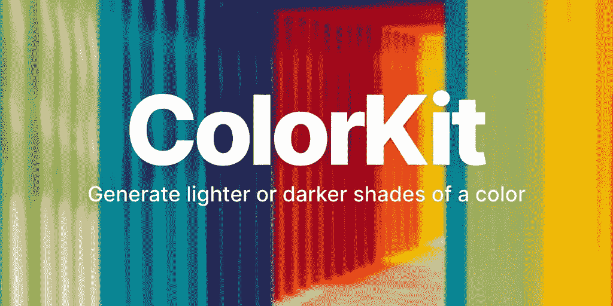

创建类似的调色板变得更加容易。有了[颜色工具包](https://www.figma.com/community/plugin/797696673804519719/Color-Kit)，你所要做的就是输入一个颜色代码，以及其他值，比如色调的数量，你将拥有一个包含各种色调的调色板。这个插件是由 Tushar 创建的，可以生成任何颜色的更亮或更暗的阴影。

### 范围

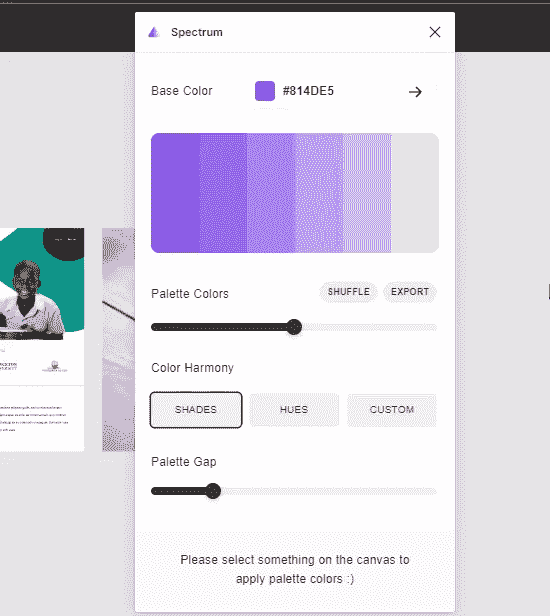

米兰·马赫什瓦里(Milan Maheshwari)创建的 Spectrum ，可以让你构建颜色系统，设计复杂的矢量艺术，并立即将其应用于插图、图像和界面。这一过程不会延迟，这对您的工作流程来说是个好消息。谈到颜色，你可以告别反复试验。

### 科斯胡夫勒

由 Andrew G 创建的 CoShuffler ，可以让你将各种颜色应用到大量的对象上。因此，如果您正在为一个项目的资源(如按钮)进行迭代，CoShuffler 会通过使用预先选择的调色板将颜色应用到对象来为您完成大量工作。

### Pikaso

有时项目中最困难的部分是决定从哪种颜色开始。我们都经历过。Daniel Danuega 和 Reynaldi Syarizal 创建了 [Pikaso](https://www.figma.com/community/plugin/1017464036112800781/Pikaso) 来帮助您更快更有效地做出决定，根据客户提供的单一资产为您提供选择。这可能是一个标志或图片。

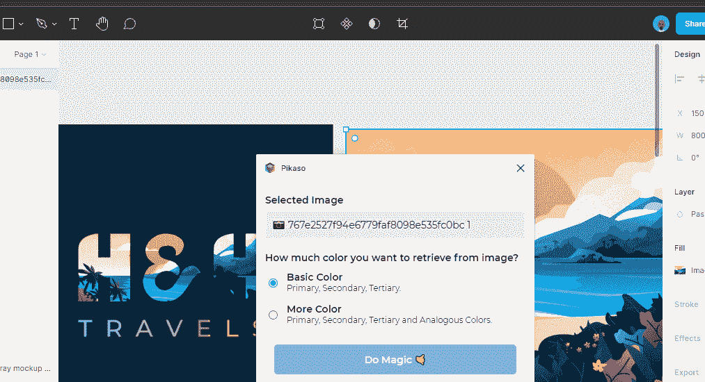

### 暗淡的颜色

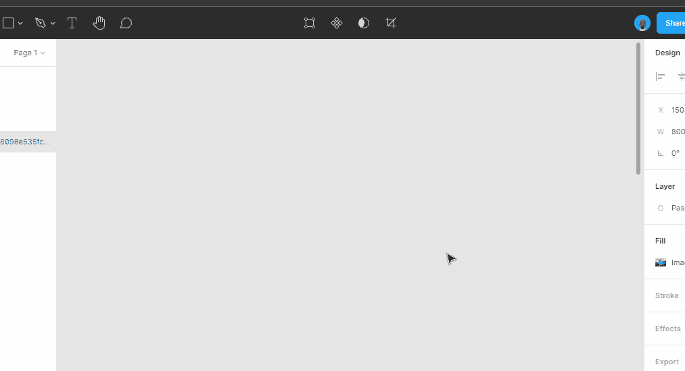

[Dopely Colors](https://www.figma.com/community/plugin/994656899889548666/Dopely-Colors) 有各种各样的调色板，所以当你遇到创意障碍或类似情况时会很有帮助。它是由 Dopely 创造的，帮助你更好更快地上色。

### 彩色图像

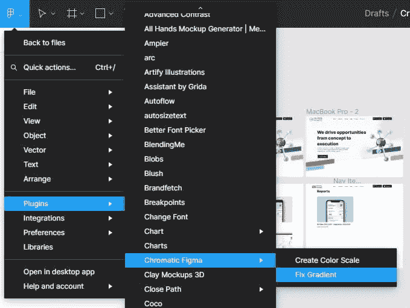

使用[彩色图](https://www.figma.com/community/plugin/759433498184507623/Chromatic-Figma)，您可以使用 RGB 之外的色彩空间来创建好看且感觉统一的渐变和色阶。结果通常比传统的 RGB 空间看起来更自然，也更具美感。这个插件是由 Petter Nilsson 创建的。

### 意外的大梯度

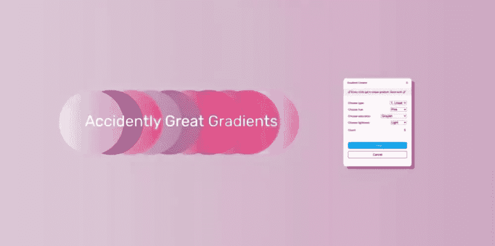

如果你感到忧郁，就用蓝色调。有了[意外的大渐变](https://www.figma.com/community/plugin/947245928539421914/Accidently-Great-Gradients)，你可以批量生成渐变并从中选择最好的。调整亮度和饱和度，或者完全随机，让插件为你的项目选择一个意外的大渐变。这个插件是由 Johan 创建的，它利用 HSL 刻度来创建大量的渐变。

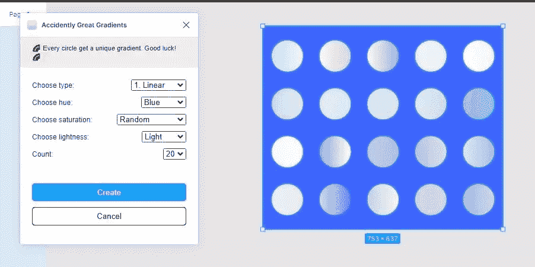

### 椰子树

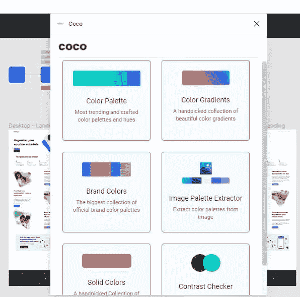

在工作中寻找灵感？一个让你探索官方品牌调色板、流行颜色选择和最新调色板趋势的插件怎么样？UXPlugins 的 Coco 让你做到这一切。您还可以检查对比度，确保通过简单的工作流程为您的设计选择了正确的颜色。

## 图像资产插件

接下来，我们将探索一些用于管理图像资产的优秀 Figma 插件。

### 照片

[Photos](https://www.figma.com/community/plugin/745428728979155171/Photos) 由 Emin Sinani 创建，允许您从 Unsplash、Google、Flickr、Pixabay、Pexels、Giphy 和 Tenor 搜索照片并将其插入到 Figma 文件中。照片插件还可以让你通过一个简单的过程为你的设计项目找到 gif。您也可以一次选择多张照片，并将它们放在页面上或插入到图层中。Figma 和 FigJam 都支持。

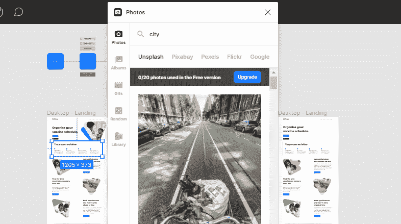

### 移除血糖

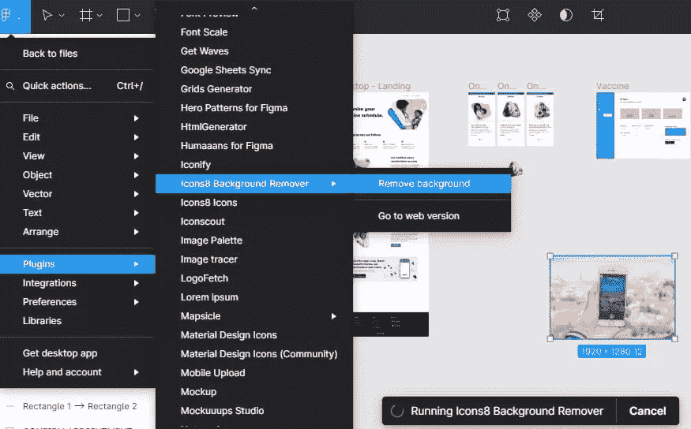

您可以使用[移除背景](https://www.figma.com/community/plugin/738992712906748191/Remove-BG)移除图片背景。它使用一个 API 来识别照片中的主体，并擦除周围的环境——就像一个对象选择工具。

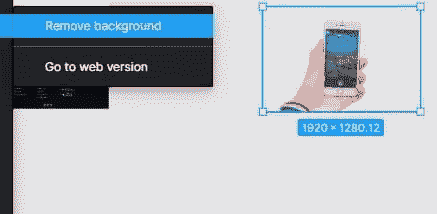

### 图像跟踪器

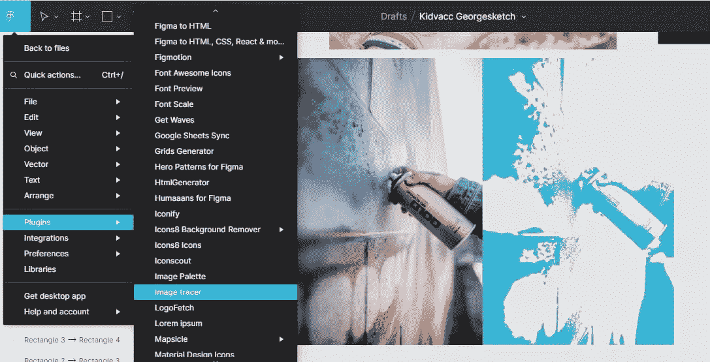

[Image tracer](https://www.figma.com/community/plugin/735707089415755407/Image-tracer) 将你选择的所有图层合并成一张图像(不管它们是否已经是矢量)。然后，它会将新图像转换为黑白图像，并尝试将其描摹到新的矢量图层中。它是由戴夫·威廉姆斯创建的，为手动绘制和编辑矢量提供了一种替代*的方式，从而节省了时间。*

### 来自图像的调色板

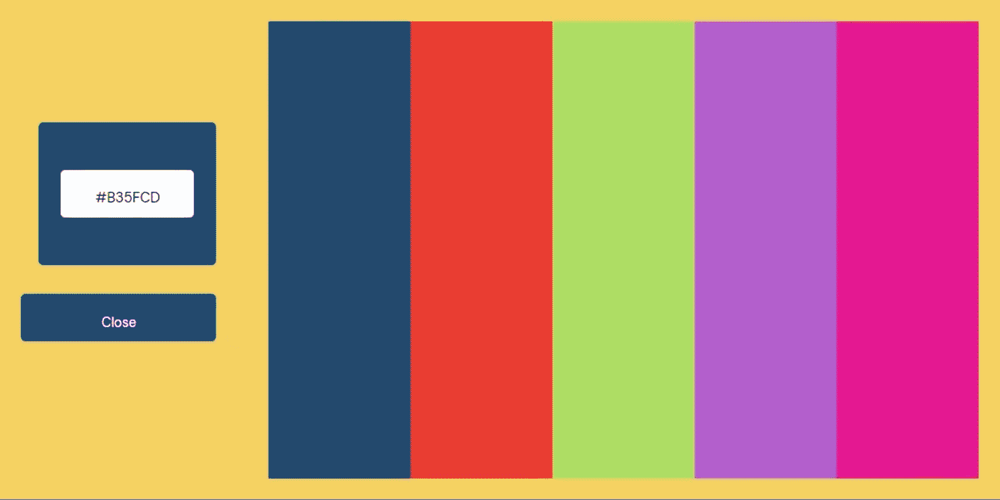

[图像调色板](https://www.figma.com/community/plugin/1008382434333520774)让您从计算机中选择一幅图像并生成一个调色板。这意味着图像不必在 Figma 文件中，颜色都是在应用程序中生成的。它可以让你访问调色板中每个颜色块的颜色代码(只需点击它)，你不需要在线生成调色板。

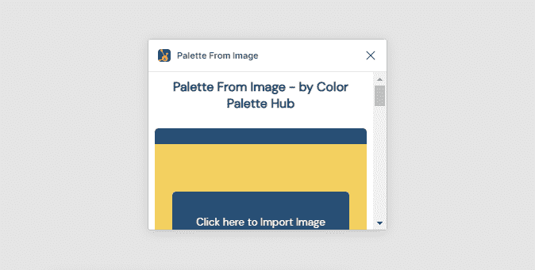

## 字体插件

让我们来看看 Figma 插件，它使字体的使用变得更加容易。

### 字体浏览器

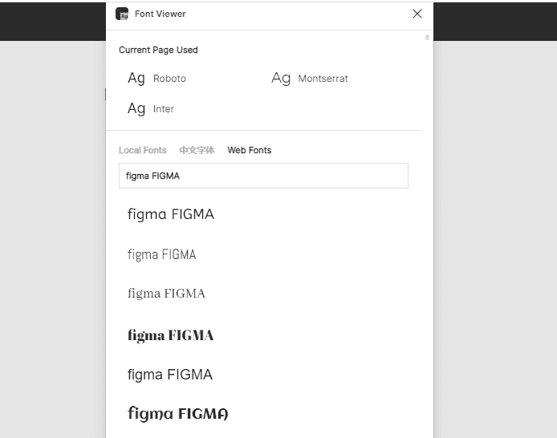

如果您正在尝试为项目选择字体，[字体查看器](https://www.figma.com/community/plugin/1027863721483813752)可以加快您的过程，并在不同的标签中显示本地字体和网络字体。字体浏览器是 KRAD 发明的。

### 摄影扫描仪

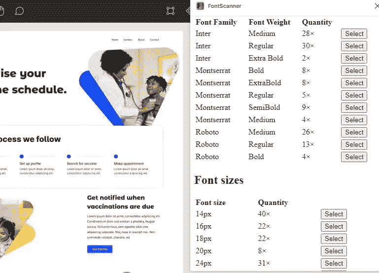

你有没有看过一个设计，想知道那些是什么字体？ [FontScanner](https://www.figma.com/community/plugin/1002875535237160651/FontScanner) 可以从当前页面中找出所有字体系列、粗细和大小。它还显示它们的数量，并允许您根据类型或字体大小进行选择。除了满足你的好奇心，它还可以作为开发者的分析工具。它是由汉兹克·克里斯平创造的。

### 类型标度

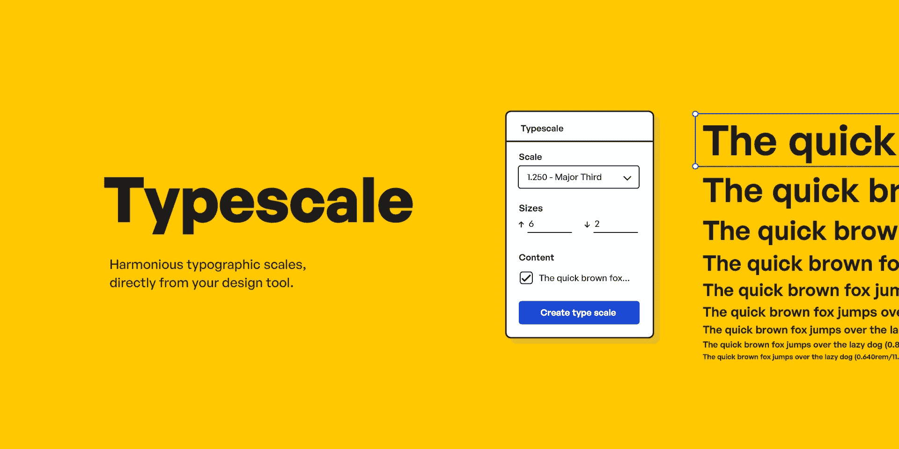

[类型标尺](https://www.figma.com/community/plugin/967802396210455992/Typescale)是萨姆·史密斯创造的，有助于类型分析。它会根据您选择的比例为您的排版生成一个模块比例。只需几次点击，您就可以在画板上将单行文本转换成和谐的排版比例。

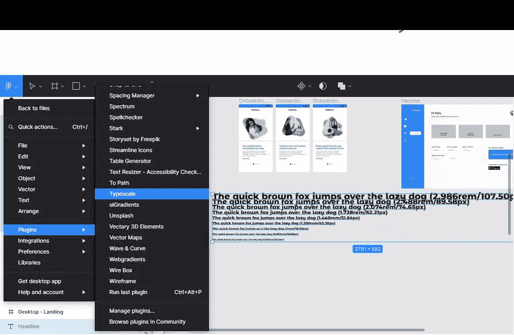

### 更改字体

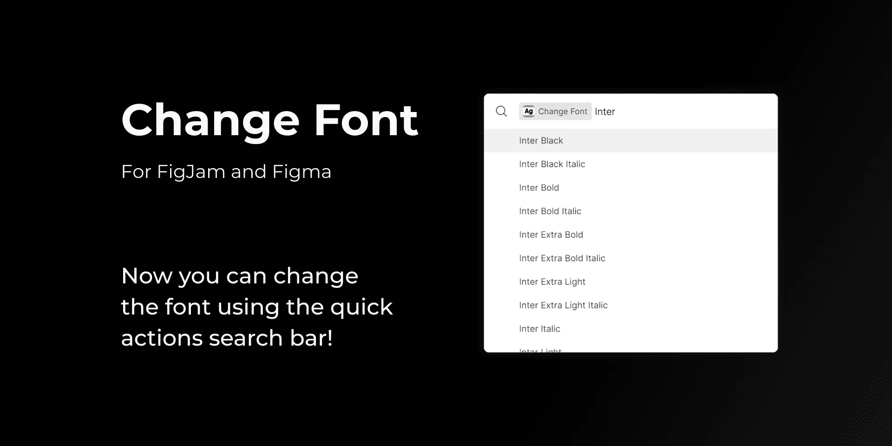

[更改字体](https://www.figma.com/community/plugin/1036021586377337050/Change-Font)是由 Yury Zeliankouski 创建的，它允许你使用快速操作搜索栏更改 FigJam 和 Figma 文件中的字体。

您可以选择文本层、连接符、带有文本的形状、便笺或代码块，或者选择一段特定的文本，启动快速操作(在 macOS 上按`command` + `/`或在 Windows 上按`Ctrl` + `/`)，编写“更改字体”并按`Tab`，通过键入字体名称来过滤列表，并通过按`enter/return`来选择所需的字体

## 插图插件

接下来让我们看看一些有用的 Figma 插件，帮助您创建插图。

### 插图

这个 Figma 插件让你可以为你的项目访问免费的流行插图库。[插图](https://www.figma.com/community/plugin/781441863578182316/Illustrations)允许您通过拖放将高质量的插图插入 Figma。下图由 hexorial.studio 创作。

### HANDZ 3D 插图

HANDZ 插件为 Figma 提供了一个 3D 插图库。您可以使用它来搜索手势插图，并选择各种颜色和类型的手。

### 人类

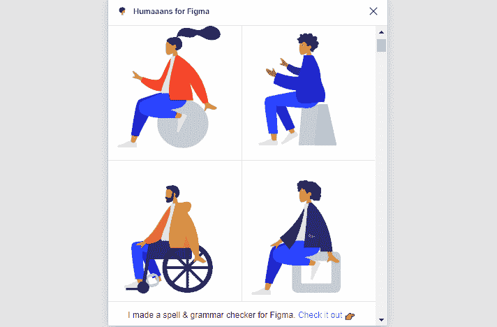

Tekeste Kidanu 的 Humaaans 插图库帮助您在 Figma 中创建丰富多彩的插图项目。您可以使用提供的插图或混合搭配插图来创建自己独特的作品。

### 艺术插图

有了这个插件，你将花更少的时间搜索和排序，更多的时间设计。Artify 提供了 5000 多幅 SVG 和 PNG 格式的插图，您可以从 Figma 获取。有几种插图风格可供选择。它是由人创造的。

## 动画插件

以下 Figma 插件提供了向 Figma 项目添加动画的方法。

### Figmotion

Figmotion 是 Figma 内置的动画工具。这意味着在处理过程中不需要切换到完全独立的运动工具，例如 After Effects。Figmotion 使开发人员的工作更易于管理，另外，它还考虑到了网络技术。

### 图玛到视频

有了 SUPA 的 [Figma to Video](https://www.figma.com/community/plugin/908257968215073824/SUPA---Figma-to-video) ，你可以把你的 Figma 设计变成动画视频。该插件由 SUPA 团队创建，由 SUPA 视频编辑器提供支持，帮助微调动画和元素出现的顺序。

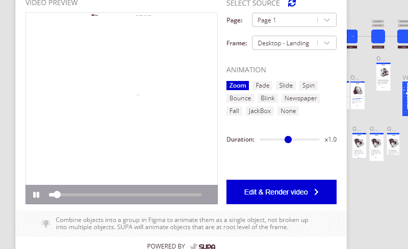

## 线框插件

接下来，我们将回顾一些 Figma 插件，它们允许你在 Figma 中快速[创建线框。](https://www.sitepoint.com/wireframing-figma/)

### 项目流

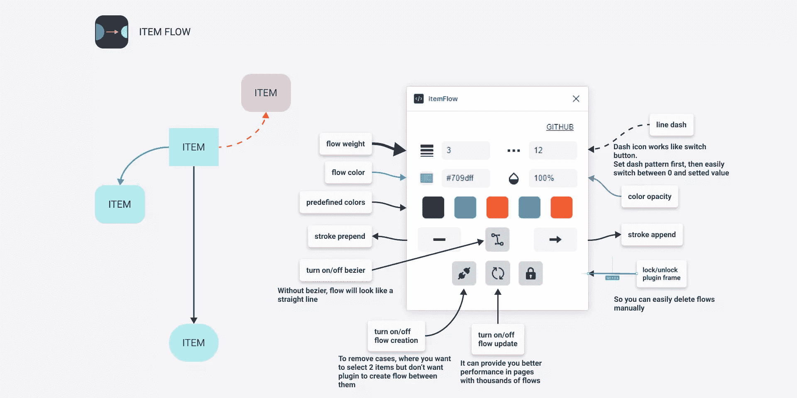

使用 [ItemFlow](https://www.figma.com/community/plugin/1030736498877484902) 可以改进线框、故事板和头脑风暴会议。它帮助您连接屏幕上的项目，同时优化您的工作流程速度和性能。这个插件是由 AgitoReiKen 创建的，有助于设计复杂的系统及其架构。

### 原始流

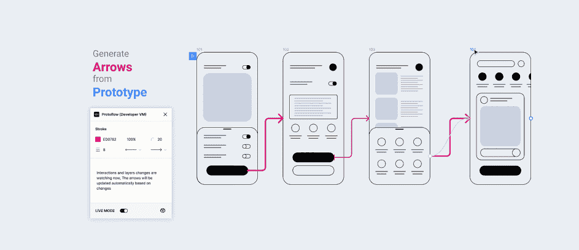

[ProToFlow](https://www.figma.com/community/plugin/989539821393693492/ProToFlow) 基于原型交互为您的项目生成流程箭头。您也可以通过将 FigJam 中的连接器复制到您的文件中来使用 FigJam 中的自定义连接器，插件将完成繁重的工作。这个插件是由 Wall 和 Saeed Alipoor 创建的。

### 铁丝盒

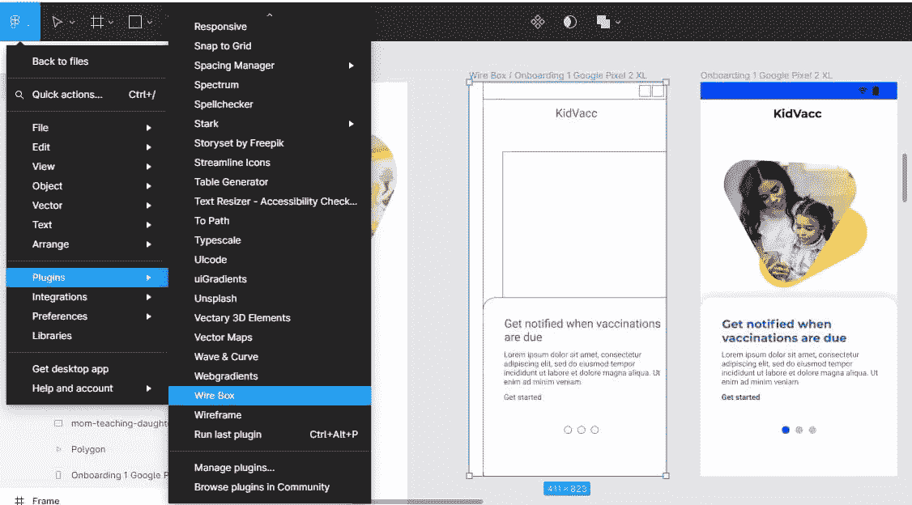

如果有什么东西需要调整，转换回 Lo-fi 不一定是乏味的[线盒](https://www.figma.com/community/plugin/764471577604277919/Wire-Box)插件，由塞恩·哈尔平创建。你可以专注于获得正确的 UX，而不是用户界面。

## 提高生产力的插件

下一个 Figma 插件提供了提高生产力的选项。

### Figma 的作家

Writer 为 Figma 插件创建了 [Writer，帮助您在设计中创建无错误的内容。它使用人工智能来检查拼写、语法、可读性和标点符号错误，以及阅读时间、字数和句子长度等统计数据。有了这个 Figma 插件，你可以确保你的内容清晰、一致、无误。请注意，您需要一个 Writer 订阅来登录插件。](https://www.figma.com/community/plugin/1010580776466011580/Writer-for-Figma)

### CopyDoc 文本工具包

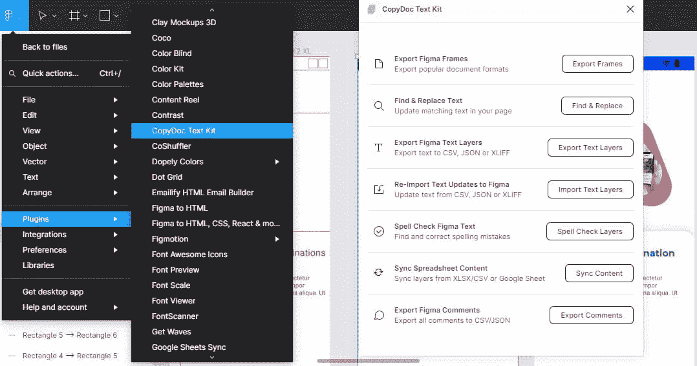

[CopyDoc 文本工具包](https://www.figma.com/community/plugin/900893606648879767/CopyDoc-Text-Kit)插件让你在一个地方管理你的 Figma 设计上的所有文本。这些文本组可以很容易地导出、导入、本地化、拼写检查和更新。这个插件是由 Figmatic 创建的，它的文档可以在[这里](https://docs.figmatic.com/copydoc)找到。

### 设计系统组织者

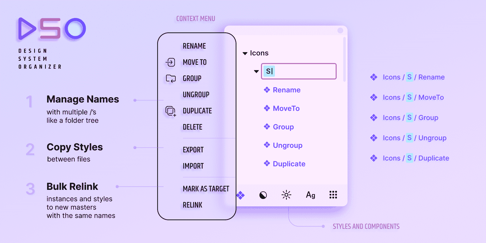

由 Floweare 创建的[设计系统管理器](https://www.figma.com/community/plugin/802579985985331070/Design-System-Organizer)插件，通过管理类似文件夹的名字来保持你的工作有条理。在文件之间复制样式。将实例和样式批量重新链接到具有相同名称的新母版。您还可以在文件之间组织样式和组件，并通过具有批量重命名功能的类似文件夹的界面管理“组件/输入/概述”等路径。

### 重命名它

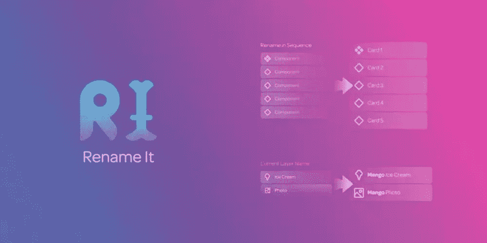

这个[重命名为](https://www.figma.com/community/plugin/731271836271143349/Rename-It)的插件是由罗德里戈·苏亚雷斯创建的。重命名它允许您批量重命名层和帧，从而有助于保持您的工作有条理。您也可以一次重命名多个层，使用层的宽度`%W`和高度`%H`重命名层，并替换所选层中的任何单词或字符。

## 帮助布局设计的插件

以下 Figma 插件支持项目中的布局设计。

### 网格生成器

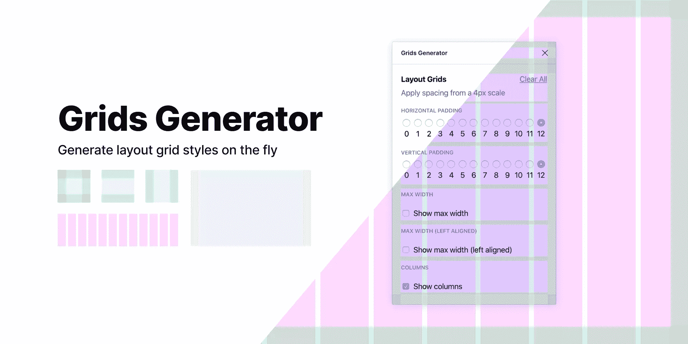

使用 Tal Snir 的[网格生成器](https://www.figma.com/community/plugin/841313026689642442/Grids-Generator)插件，可以更容易地为画板找到合适的网格大小。它可以帮助保存网格模板，将自动网格应用于框架，一次单击即可显示和隐藏选定框架中的所有网格，以及删除和更新模板。

### 布局移交

在这个插件的帮助下，设计者和开发者可以看到每个框架的布局以及用来构建它的组件的变体。[布局切换](https://www.figma.com/community/plugin/1025794954481152114)由 Tal Snir 创建，有助于处理变体。

**相关:**[2022 年 5 大最佳设计交接工具](https://www.sitepoint.com/best-design-handoff-tools/)

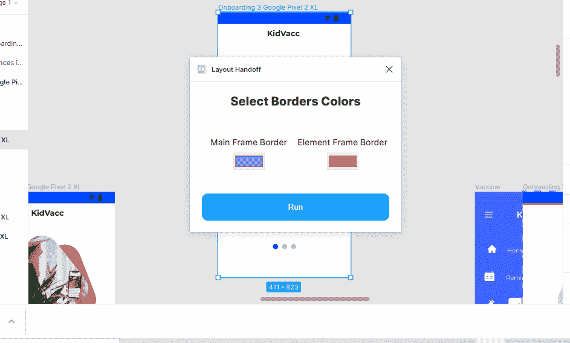

## 辅助功能插件

不要忘记可访问性！这些 Figma 插件有助于确保所有用户都能访问您的设计。

### 有能力的

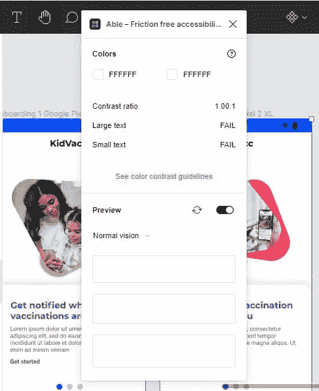

Sondre Kvam 的 [Able](https://www.figma.com/community/plugin/734693888346260052/Able-%E2%80%93-Friction-free-accessibility) 插件使您的设计易于访问，同时保持愉悦的外观和感觉。只需很少的努力，你就可以在你的设计中增加色彩对比，并迎合色盲之类的东西。Able 还会比较您选择的两个图层之间的对比度。这样，你可以保持 Able 打开，随意选择图层进行比较，而无需重新运行或更新插件。

### 自动调整文本大小

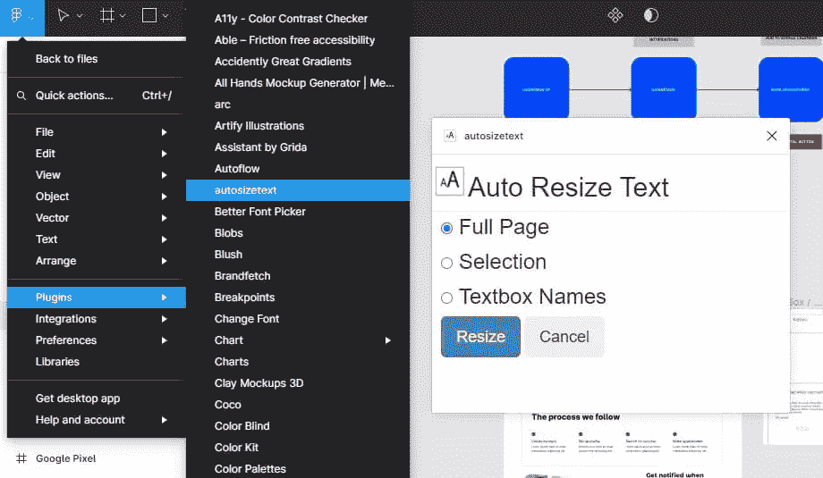

autosizetext 插件是由 Austen Novis 开发的，它可以自动调整文本大小以适应文本框。如果文本太小，它将增长以适应边界，如果文本太大，它将收缩以适应边界。这有助于自动缩放文本以提高可读性。

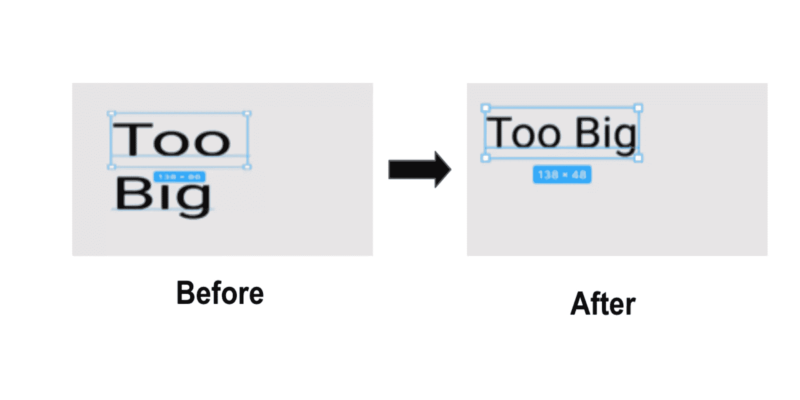

### 严肃的；R1SE 何洛洛

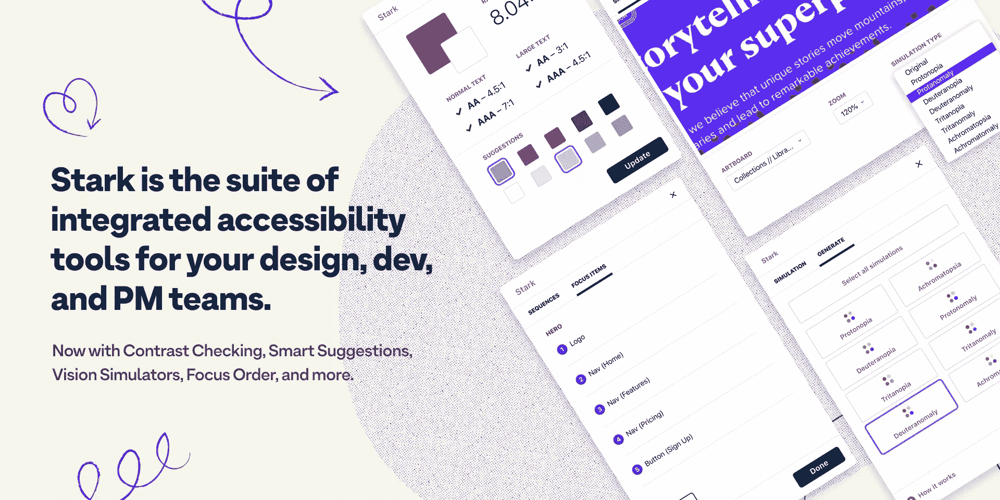

Stark 是一套用于产品设计的集成辅助工具。该套件包括视觉模拟、对比度检查和聚焦顺序。这个插件是由 Stark 创建的，你可能需要登录该服务才能访问。

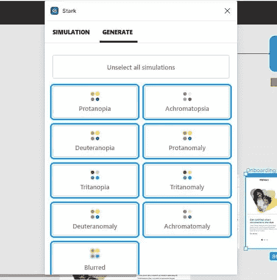

### 高级对比度

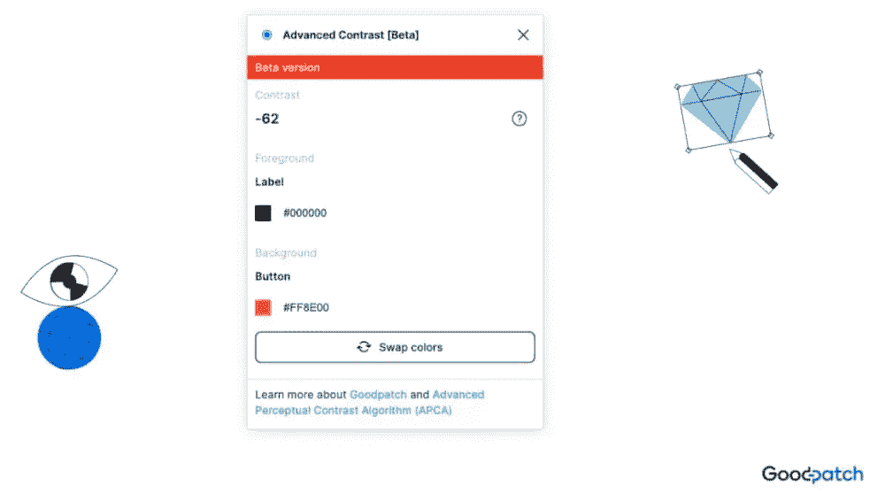

这个插件使用高级感知对比算法(APCA)来创建易于使用的好看的颜色组合。[高级对比度](https://www.figma.com/community/plugin/1016423882731978547/Advanced-Contrast)是由贾诺斯·保尔和马克斯·威尔创造的，它可以比较你设计上的颜色，以检查人类对对比度的真实看法。

### 盐酸颜色

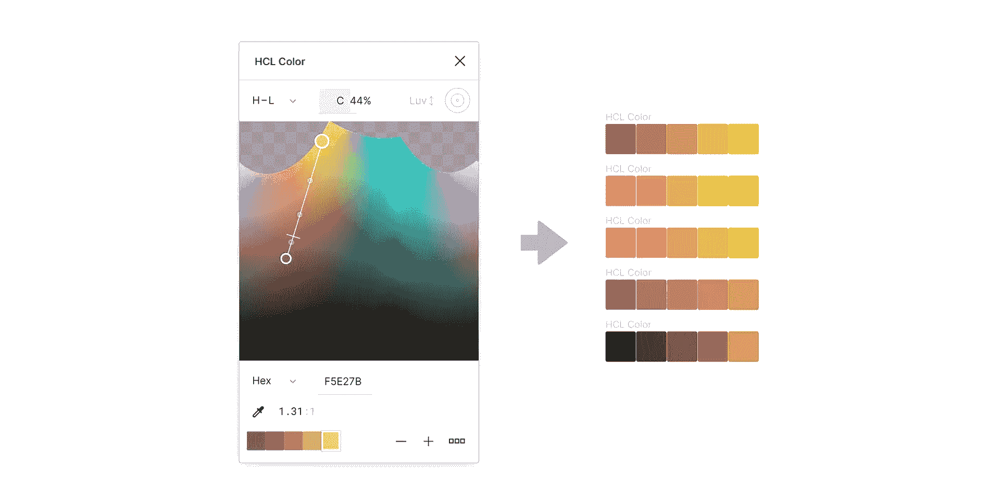

HCL 色彩空间均衡了色调的表观亮度，并允许对对比度进行更精确的控制。

[HCL Color](https://www.figma.com/community/plugin/889859275438287504/HCL-Color) 由 Alex Bourt 创建，有助于通过颜色传达意义的项目，在这些项目中，使用常规 HSV/L 可能会导致看到错误的图案，因为色调具有不同的亮度，而我们的大脑认为亮度比色调更重要。

## 电子邮件模板插件

用 Figma 创建电子邮件模板？这些 Figma 插件将有助于完成这项棘手的任务。

### 安比尔

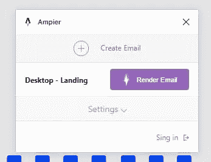

[Ampier](https://www.figma.com/community/plugin/1010864160468009465/Ampier) 插件在您的设计环境中为您的活动创建 AMP 和 HTML 电子邮件设计。代码可以导出为档案或直接连接到 Ampier。这个插件是由 Todd 创建的，目前处于测试阶段。你可以在这里阅读文档[。](https://docs.ampier.io/figma/)

### 电子邮件化

借助 [Emailify](https://www.figma.com/community/plugin/910671699871076601/Emailify-HTML-Email-Builder) ，您可以从 Figma 设计和导出响应迅速、生产就绪的 HTML 电子邮件，而无需任何第三方应用、网站或 API。凭借定制组件构建器、定制文本、图像和自动布局等功能， [Emailify](https://www.figma.com/community/plugin/910671699871076601/Emailify-HTML-Email-Builder) 改善了您的工作流程。它是由 Figmatic 创建的，文档可以在[这里](https://docs.figmatic.com/emailify)找到。

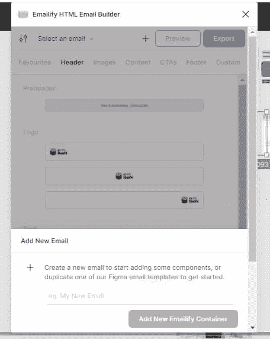

### Marka 电子邮件生成器

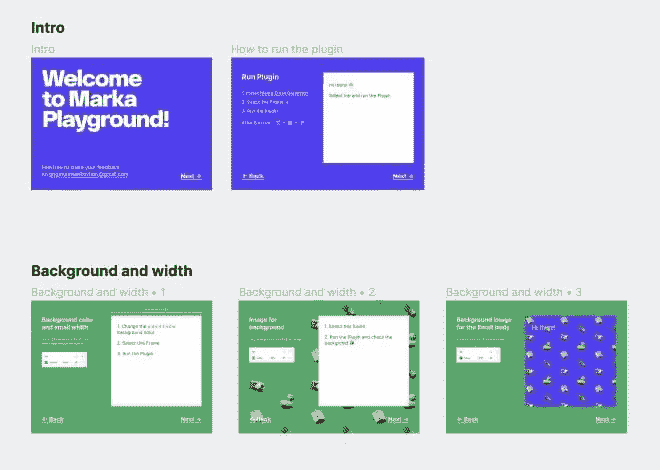

[Marka 电子邮件生成器](https://www.figma.com/community/plugin/751436700152214815/Marka-Email-Generator)从 Figma 导出 HTML 电子邮件模板。它适用于准备好的框架。Marka 支持文本对象、图像、按钮、矩形和带有元素的框架。

## 用于创建 SVG 的插件

给 Figma 加 SVG？这些插件会让你的生活变得轻松一些。

### 一滴

有时候最简单的东西是最好的。如果你的设计需要独特的形状来获得美感，那么[水滴](https://www.figma.com/community/plugin/739208439270091369/Blobs)将会派上用场。它可以让你通过点击一个按钮来创建有机的斑点形状。生成的每个形状都是独一无二的。您可以控制一个形状的独特程度及其点数。斑点是在 SVG 中创建的。

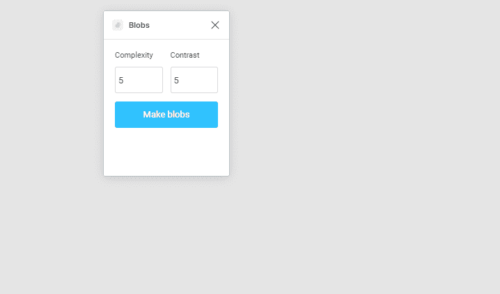

### 线路合成器

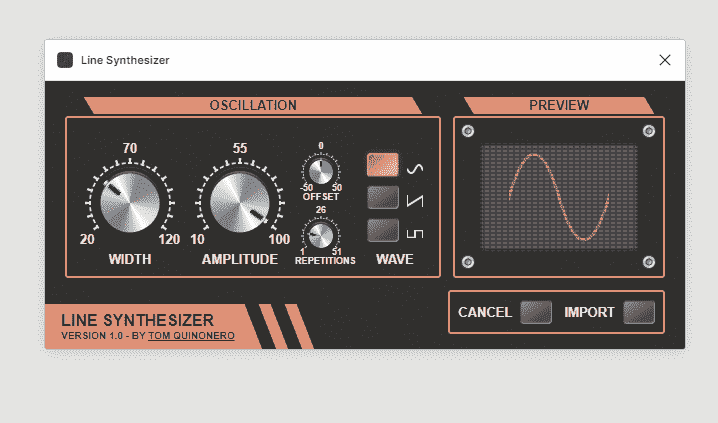

Tom Quinonero 的 Line Synthesizer 可让您使用音频风格旋钮创建波形模式和风格。旋钮也赋予它独特的复古感。

### BlendingMe

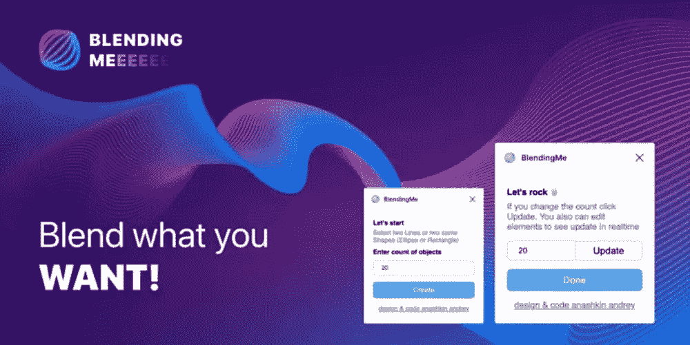

[BlendingMe](https://www.figma.com/community/plugin/887243243437608411/BlendingMe) 是创建两条线、椭圆或矩形混合的最佳方式。你所要做的就是选择两个你想要混合的物体，选择混合步骤的数量，插件就会完成繁重的工作。它还允许你在插件工作时改变混合路径、颜色、笔画粗细和不透明度。BlendingMe 是由 Anashkin Andrey 创作的。

### 关闭路径

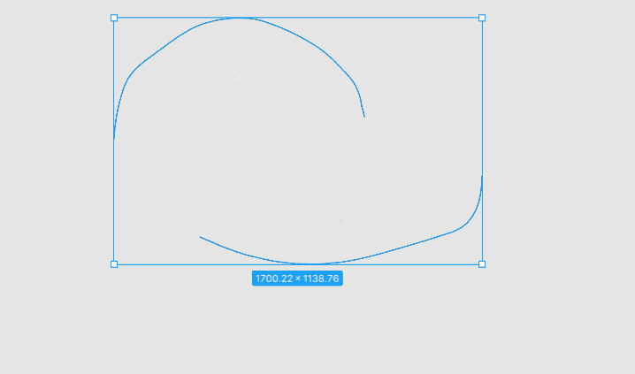

[关闭路径](https://www.figma.com/community/plugin/1000208017155888036/Close-Path)让您轻松关闭所选对象之间的任何开放路径。它适用于直线连接和曲线连接。

## 内容插件

内容为王，用这些插件给它皇家待遇。

### 内容卷轴

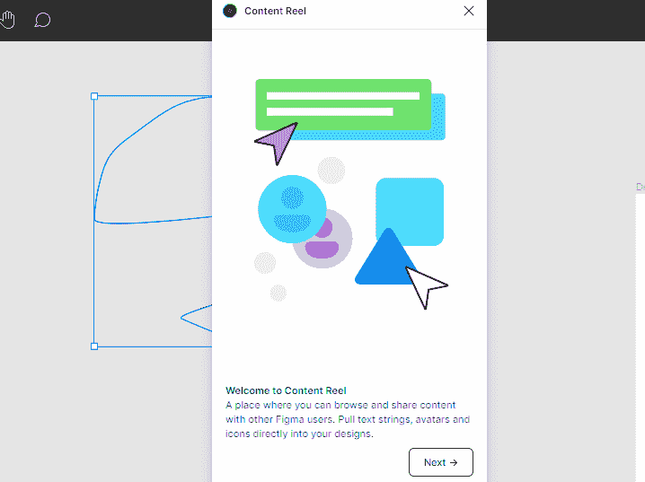

内容卷轴由微软和尤金·加夫里洛夫创建，有了它，你可以通过从一个调色板中提取文本字符串、图像和图标来更有效地设计布局。它让您可以创建自己的文本和图像内容，并可以选择浏览或搜索内容来查找已发布的文本字符串、图像和图标集合，从而使协作变得更加容易。

### 实体模型

您可以使用[模型](https://www.figma.com/community/file/775789888359782610)插件访问高质量模型库来帮助您的演示。并提供透视变换。它有几个特点，如明确命名和方便的结构层，使其易于集成到您的设计中。

### 木卫二工作室

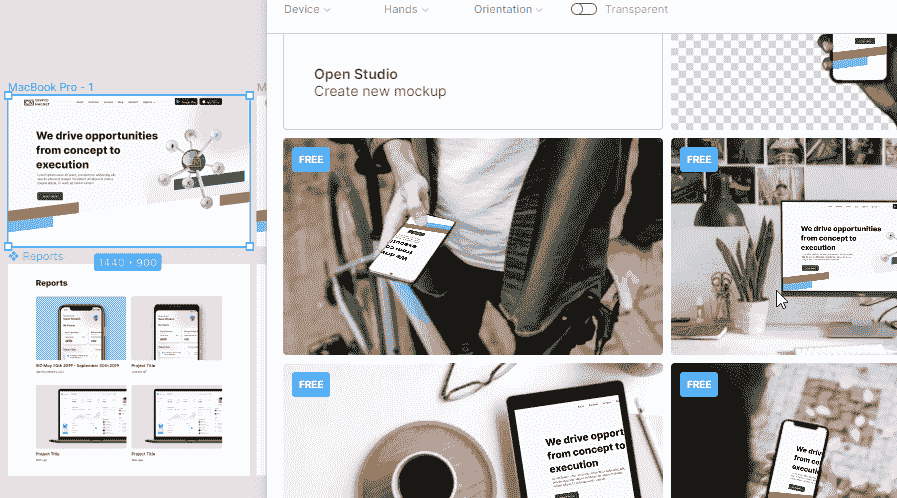

mockuups Studio 提供超过 1000 个不同的场景。它是由 Mockuuups 创建的，包含了您创建产品模型、营销材料和社交媒体或博客帖子的视觉内容所需的一切。

### Lorem Ipsum 加密

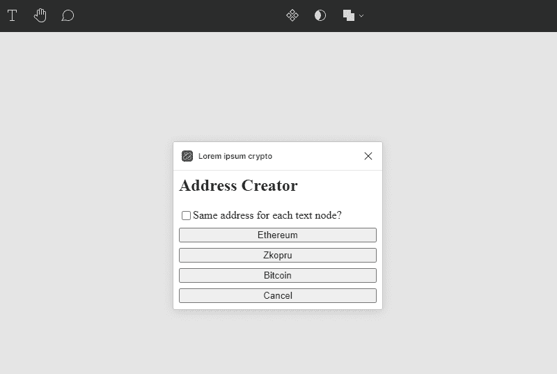

Lorem Ipsum Crypto 由 Chance Hudson 创建，允许您为以太坊、Zkopru 和比特币钱包生成示例加密货币地址。但是，生成的地址不能用于接收交易。相应的私钥不是立即创建就是立即销毁。

## 图标插件

如果你在 Figma 中使用图标，这些插件将有助于你的工作流程。

### 将…最小化

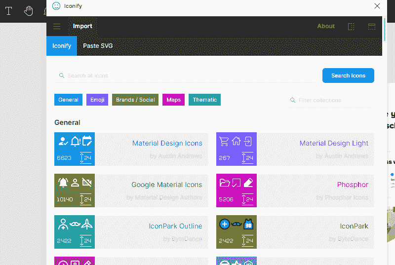

Iconify 由 Iconify 和 Vjacheslav Trushkin 创建，它提供了超过 100，000 个 PNG 和 SVG 格式的图标。它可以让你访问材料设计图标，字体真棒，果酱图标，表情符号，Twitter 表情符号，以及 100 种其他类型的图标风格。

### 引导图标

使用[引导图标](https://www.figma.com/community/plugin/868341386266170307/Bootstrap-Icons)，您可以将引导图标库中的图标直接添加为 Figma 项目中的 SVG。Bootstrap Icons 拥有超过 1400 个图标的列表，并且是开源的(麻省理工学院)。这意味着你可以免费下载、使用和扩展它。

### Lucide 图标

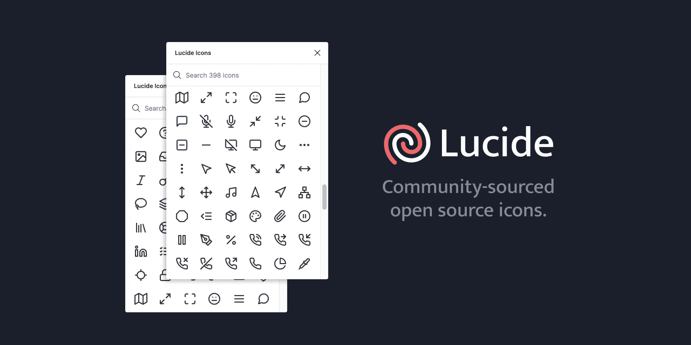

Lucide Icons 是一个开源的图标库，是一个不断增长的羽毛图标库的分支。这个插件是由 Eric Fennis 创建的，图标对于个人和商业用途是完全免费的。

### 材料设计图标

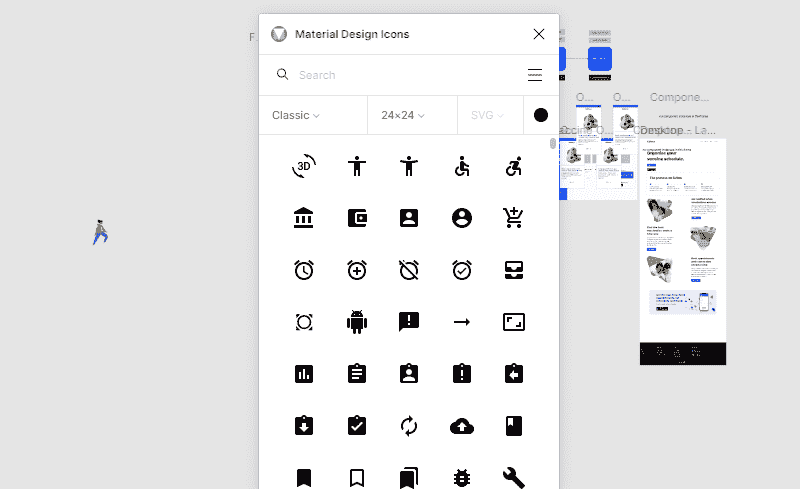

这个由 Icons8 创建的插件，可以让你访问[材质设计图标](https://www.figma.com/community/plugin/740272380439725040/Material-Design-Icons)库，有 27，000 个新图标，可用 PNG 和 SVG 格式。您可以按名称搜索图标或滚动浏览整个列表。按类别过滤，更改样式和大小，并在不同的样式之间进行选择:填充、轮廓、圆形等。

### 结论

Figma 上有几个插件和工具可以让你的工作变得更容易，虽然我们已经介绍了其中的几个，但是每天都有许多插件和工具被创建。探索 Figma 社区是了解他们的一种方式。

## 分享这篇文章