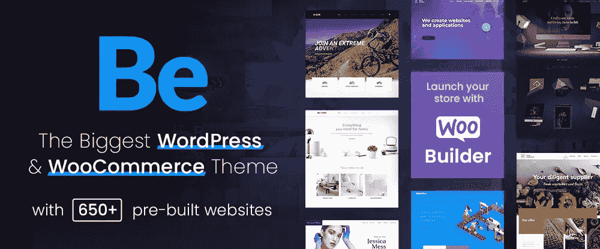
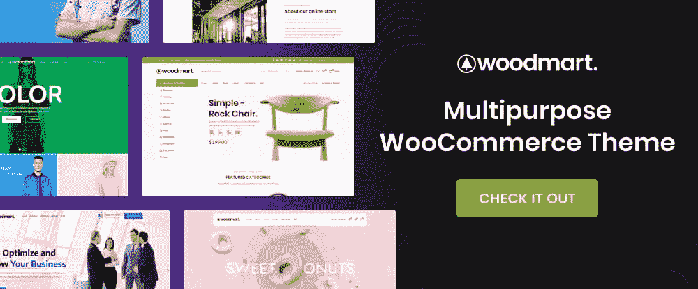
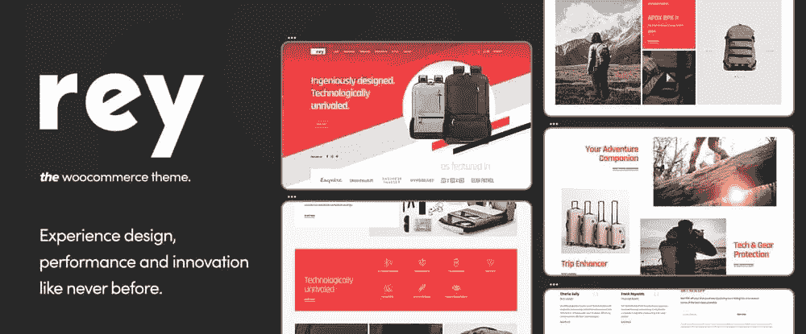
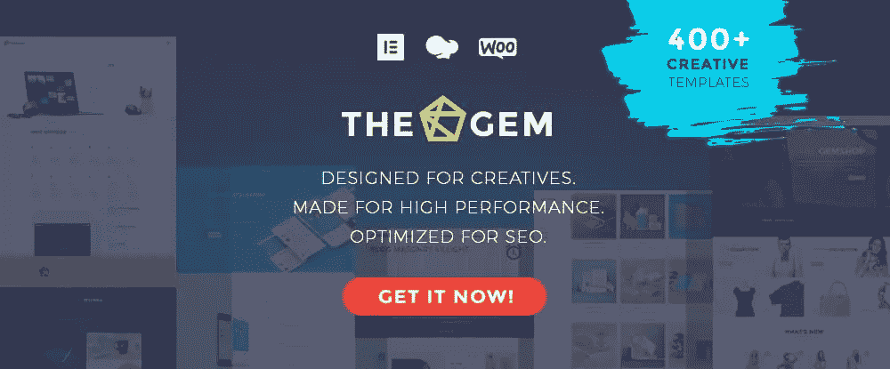
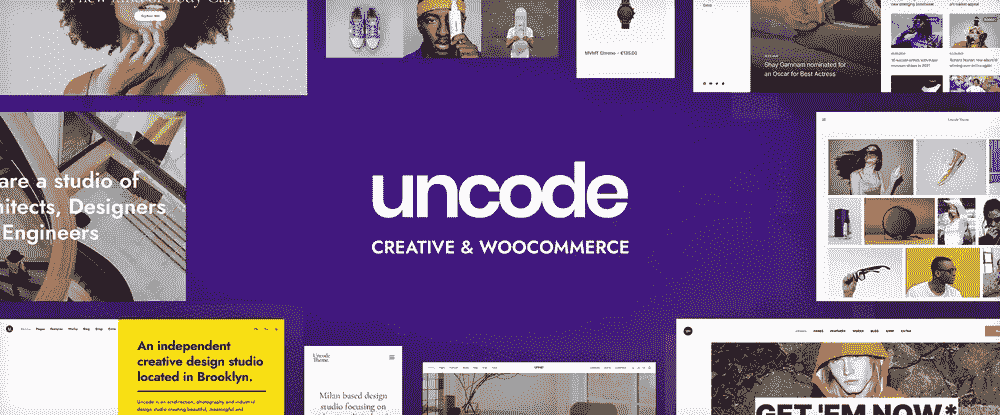
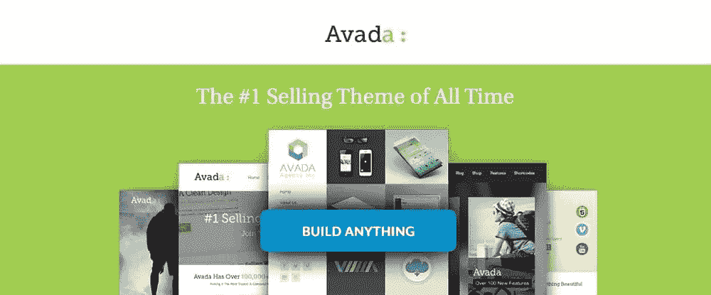
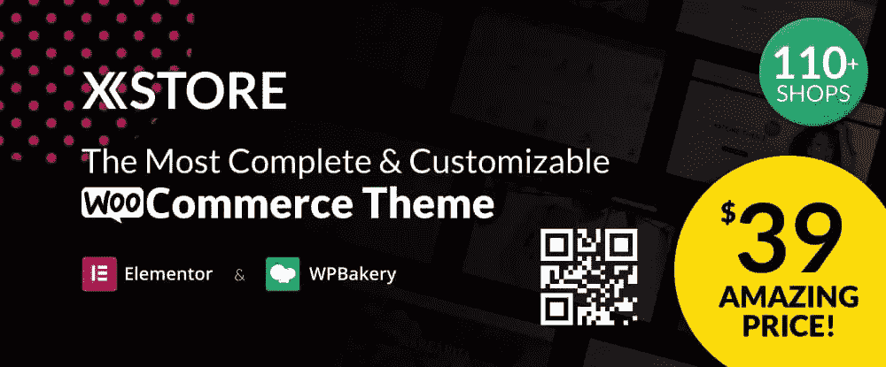
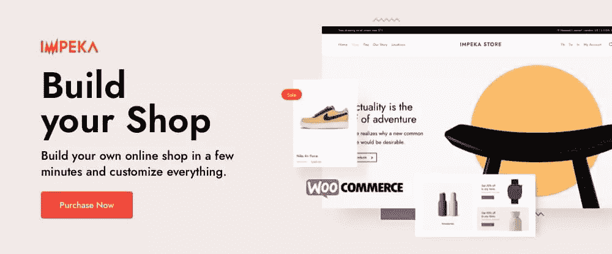
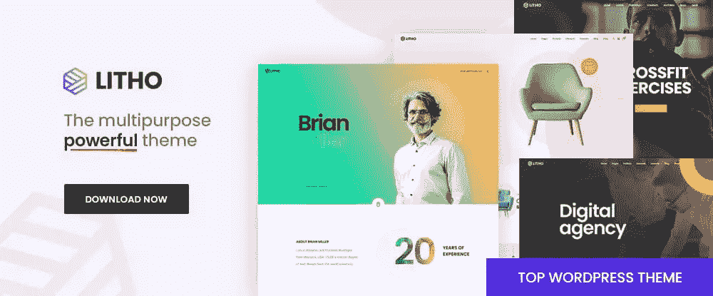

# 2022 年你应该使用的 10 个最好的 WordPress 主题

> 原文：<https://www.sitepoint.com/ten-best-wordpress-themes-2022/>

*这篇赞助文章由我们的内容合作伙伴 [BAW 媒体](https://baw.agency/)创作。感谢您对使 SitePoint 成为可能的合作伙伴的支持。*

安装一个 WordPress 主题几乎总能改善你的网站建设工作流程和最终结果。

但是让这两件事“更好”并不总是足够的。更快地建立一个网站并不一定会使它的性能更好。改善它的外观并不一定使它不可抗拒…或者甚至特别吸引游客。

你真的需要花时间去寻找一个 WordPress 主题，这个主题将会把你的设计提升到一个新的更高的水平。有很多很棒的 WordPress 主题可以做到这一点。但是在市场上成千上万的热门 WordPress 主题中找到它们可能是一项艰巨的任务——只要有可能，最好避免。

选择 2022 年 WordPress 十大主题中的任何一个，问题就解决了。找到一个最适合你的目标可能需要一点时间，但是它们中的任何一个都会很好地为你服务。

## 1.最大的多功能 WordPress 主题，有 650 多个预建网站

任何使用 BeTheme 创建的网站都将非常吸引人，响应完美，并且搜索引擎友好。最终的产品在某种程度上取决于网站设计者想要达到的目标，但是工具就在那里。

*   Be 的 650 多个预建网站响应迅速，可定制，可以配置为处理任何网站类型、风格或利基，并将使任何网站建设项目快速启动。
*   40 多个核心功能，包括下面提到的几个，为 Be 的用户提供了无所不包的设计助手、元素和选项选择。
*   Live Builder 速度快，易于使用，并具有强大的页面构建功能，包括实时内容编辑、自动保存、更新和备份选项。
*   WooCommerce Builder 提供了一系列有用的模板构建工具、单一产品布局和大量以客户为中心的功能和元素。
*   其他工具包括实时搜索功能和 Muffin 和 Header builders。
*   BeTheme 也是移动就绪和元素就绪的。

这个高级 WordPress 主题总是最新的，并为用户提供免费的终身更新。点击横幅，了解有关其强大核心功能的更多信息。

## [2。总主题](https://total.wpexplorer.com/?utm_source=baw&utm_medium=blog&utm_campaign=2top1522)

Total 是一个完整的 WordPress 主题，可以让你轻松地创建令人惊叹的、完全响应的 WordPress 驱动的网站，就像超过 48，000 名用户已经做的那样。

这些用户必须使用的工具包括:

*   包含 90 多个快速入门部分模板和 45 个快速导入演示的模板库
*   一个 WPBakery 页面生成器的扩展版本，包含 100 多个用于创建布局和模板的元素，这是一个可以让你重复使用页面布局和设计的功能
*   用于从多个来源添加字体的字体管理器

Total 还具有响应速度快、开发人员友好的特点，为用户提供了几乎无限的样式和设计选项，包括动画、自定义背景等。

点击横幅了解更多关于这个流行的 WordPress 主题的信息。

## [3。WoodMart](https://woodmart.xtemos.com/?utm_source=baw&utm_medium=content&utm_campaign=topwpthemes22b)

WoodMart 使创建一些非常令人眼花缭乱的在线商店变得很容易，而且工作起来也很有趣。快速浏览它的登陆页面可能会让你相信你意外地登陆了一个真实的商店，但是你看到的是你自己可以轻松完成的事情。

*   WoodMart WooCommerce 主题为用户提供了一体化的电子商务解决方案。Woodmart 是完全可定制的，它针对谷歌页面速度进行了优化。它还反应灵敏，视网膜就绪。
*   WoodMart 还充分利用强大的 AJAX 技术，让您和您的网站用户了解领先的在线电子商务体验。
*   有一个很好的演示布局供应，由 370 多个预先制作的部分补充，让你开始。

点击横幅，参观 WoodMart。有许多可看的。

## [4。WooCommerce 的 Rey 主题](https://reytheme.com/?utm_source=bm012022&utm_medium=content&utm_campaign=topwpthemes22b)

Rey 已经掌握了电子商务的支柱——过滤、搜索、展示和导航——并将结果传递给你。使用 Rey，您将体验到全新的设计、性能和创新，其特点如下:

*   Elementor 页面生成器和强大的扩展
*   SEO 友好插件
*   谷歌和 Adobe 字体集成

这一响应迅速、开发人员友好、面向性能的 WooCommerce 主题带来了以上所有内容以及更多内容。

## [5。TheGem:创意、多功能和 WooCommerce WordPress 主题](https://codex-themes.com/thegem/meta-splash/?utm_source=baw&utm_medium=listing&utm_campaign=top-themes-2022-2)

TheGem 作为 WordPress 的终极工具箱有着实至名归的声誉，它有一些很酷的网站建设功能，比如:

*   选择 400 多个多页和单页的现成网站
*   Elementor 和 WPBakery 页面生成器可以定制一切，包括 TheGem 的预设计页面部分的集合
*   令人印象深刻的 WooCommerce 设计和功能，用于创建高转化率的在线商店

TheGem 是一个五星级的流行主题，赢得了 60，000 多名客户的完全信任。

## [6。un code:creative and woo commerce WordPress 主题](https://undsgn.com/uncode/?utm_source=adv&utm_medium=baw&utm_campaign=topwpthemes22b)

Uncode 可以让你创建的网站展现出和主题本身一样的完美像素特性。

*   在构成 Uncode 工具包的众多组件中，关键组件是 Wireframes 插件，它有 450 多个部分模板，WooCommerce 定制构建器和一个增强的前端编辑器。
*   用户也喜欢 Uncode 的动态元素和选项，允许他们创建特殊的模板和设计，以及令人印象深刻的帖子模块及其 100 多个选项。

## [7。Avada 主题](https://avada-theme.com/?utm_source=baw&utm_medium=content&utm_campaign=topwpthemes22b)

Avada 拥有 450，000 名快乐的用户，是 WordPress 有史以来最畅销的主题。这可能是你加入这个行列所需要知道的全部，但是你可能想知道更多一点。

*   Avada 的核心功能、Fusion 主题选项、Fusion 页面选项和 Fusion Builder 为您提供了设计所需的所有灵活性。
*   Avada 的动态内容系统让您可以按照自己选择的方式创建网站。

## [8。XStore:电子商务的最佳主题](https://xstore.8theme.com/)

关于 XStore，你可能注意到的第一件事是它最受欢迎的功能，110 多个超级有吸引力的现成商店。第二件事可能是它惊人的 39 美元的价格。

*   当然，还有更多，包括 XStore 对 Elementor 和 WPBakery 的完全支持，header builder 和 single product page builder 以及 550 多个预构建块。
*   同样值得一提的是:价值 559 美元的高级插件和内置的 WooCommerce 电子邮件生成器。

## [9。Impeka:创造性的，多用途的主题](https://themeforest.net/item/impeka-creative-multipurpose-wordpress-theme/31105756?irgwc=1&clickid=UYlRwmyigxyIRydQaxV7v3HwUkG3uww55Qs3zI0&iradid=275988&irpid=1258491&iradtype=ONLINE_TRACKING_LINK&irmptype=mediapartner&mp_value1=&utm_campaign=af_impact_radius_1258491&utm_medium=affiliate&utm_source=impact_radius&utm_campaign=BAWMEDIA_Top_15_WP_themes_in_2022_Part_%232&utm_medium=articles%2Cemail&utm_source=google%2Cnewsletter)

你希望建立一个快速、反应灵敏、专业优化的网站，以确保搜索引擎喜欢你看到的内容。

您还需要一个具有以下功能的网站:

*   在竞争中保持自己的优势
*   被合适的人注意到
*   给你的访问者他们希望看到的东西

Impeka 通过其 Elementor、Gutenberg 和 WPBakery 页面生成器、WooCommerce 功能和其他很酷的功能完美地完成了这一切。

## 10。litho:WordPress 主题的多用途元素

Litho 是一个现代的，高度可定制的，多用途的元素或 WordPress 主题，可以用来为任何目的，任何类型，任何商业领域建立网站。

*   Elementor 中自定义部件的选择，加上 Litho 与 WordPress Customizer 的集成，为用户提供了几乎无限的设计选项。
*   用户还可以使用大量专业设计和制作的主页、模板和创意设计元素。

## 包裹

使用 WordPress 的一个主要好处是你可以使用很多流行的 WP 主题。无论你的定位、目标受众或技能是什么，总会有一个优质的 WordPress 主题。实际上，这个主题是为你量身定做的。

所以，如果你决定为 2022 年设计一个清新、美丽、改良的主题，这篇综述就是为你准备的！这些是市场上最流行和最好的 WordPress 主题。有可能，其中一个就是为你量身定做的！

## 分享这篇文章