# Webflow 的绝对初学者指南

> 原文：<https://www.sitepoint.com/webflow-absolute-beginners-guide/>

在本文中，我们将介绍 Webflow 的初学者指南，这是一款面向设计师的无代码网页设计工具，探索你如何从今天开始使用它。

无代码工具帮助你在不知道如何编码的情况下设计和构建网站。随着人们对这些工具的兴趣稳步增长，它们变得越来越受欢迎。

Webflow 是比较流行的在线无代码工具之一。它可以帮助你设计和构建网站，而不需要了解 CSS 之类的语言，也不需要编写定制的 JavaScript 代码，同时还能让你创建令人惊叹的网站。

## 非编码人员的网页设计

像 Webflow 这样的工具对于像普通公众这样的非编码人员和那些在创意领域希望更多地控制他们的网站而不需要先花大量时间学习编码语言的人(例如，想要进入网页设计的图形设计师)来说是非常棒的。

Webflow 似乎以一种迎合普通大众的方式来定位自己，一直到已经知道如何编码的经验丰富的 web 设计人员和开发人员，但正在寻找帮助他们更好、更高效的解决方案。

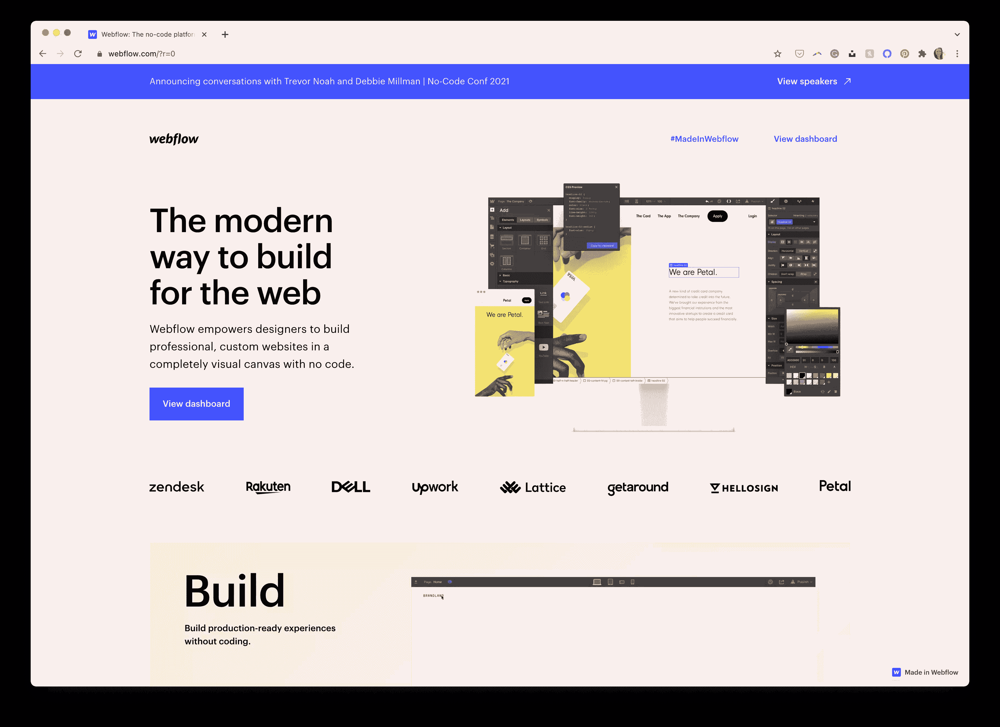

当涉及到开发您的网站时，Webflow 为您做了大部分(如果不是全部)繁重的工作。它设计了一个用户界面(UI)，称为设计器，感觉更像是一个设计所见即所得的应用程序，当你开始布局元素和定制风格时，它会在后台为你编写代码。Webflow 有免费的模板来帮助你入门(这对新手用户和那些不认为自己的设计技能比模板好的人来说是很好的)，但是如果你是一个更有经验的用户或了解前端编码语言，你也可以从头开始。

## 作为可视化网页设计工具的 Webflow

对于 Webflow，可能有两种不同类型的用户会定期使用 Webflow:那些不知道如何编写自己的网站代码并需要 Webflow 及其可视化编辑器提供的帮助的用户，以及那些可以设计和编写自己的网站并希望加快/简化过程的用户。

对于那些在开发自己的网站时需要帮助的人来说，Webflow 可以通过模板和教程来帮助你完成大部分的编码工作。然而，您可能会了解到，您将希望开始学习一些编码技能，以便真正地定制您喜欢的东西，并完全理解 Webflow 提供的广泛功能。

对于在开发自己的网站方面经验丰富的 web 设计人员/开发人员来说，Webflow 可以避开您，让您直接在他们的可视化设计器中工作。然而，由于它们的一些特性有限，您可能会很快遇到一些您希望能做却做不到的事情，并且可能会发现自己在某个时候一头扎进了代码中。

## 定价

Webflow 确实有每月[的价格](https://webflow.com/pricing)，这取决于你想如何使用这个平台。您可以按月支付每个网站，或按月支付多个项目的个人帐户。虽然从一开始就不清楚，但这两种定价方案迎合了上面讨论的两种不同类型的用户。

对于那些拥有自己的网站并且只想要一两个网站的人来说，网站平面图很可能就是你想要的地方。对于那些计划使用 Webflow 作为工具来开发网站并移交给客户的网站设计者/开发者来说，客户计划可能更适合(特别是如果你想从 Webflow 下载网站并在其他地方使用，例如在你自己的服务器上或使用 WordPress 等 CMS)。

无论哪种方式，你都可以得到一个永久免费的计划，允许你在决定升级之前，尝试和使用 Webflow 来让你的网站达到你想要的位置。(但是，永远免费的计划限制了你能做什么和不能做什么。例如，您不能将您的站点连接到自定义域。)

对于那些只需要一两个网站的人来说，Webflow 的定价非常好。然而，对于想同时拥有几个网站的人来说，这可能会非常昂贵。与价格有点关系的是另一个缺点(对于更有经验的用户来说可能更是一个缺点):能够设计然后导出你的网站，然后为另一个平台(如 WordPress)使用/修改并不是最理想的，并且需要你每月为这种能力付费，即使你选择不在 Webflow 上启动/托管你的网站。

总的来说，Webflow 的流行意味着人们正在从无代码工具中获益，它不仅继续吸引着公众的注意力，还吸引着那些 web 开发新手以及经验丰富的 web 设计人员和开发人员的注意力。

由于您可能也对 Webflow 以及它如何对您的情况有益感兴趣，所以您会看到这篇文章，因此让我们深入了解如何开始使用 Webflow，让您熟悉该平台，以及如何利用它来满足您的需求。最后，我们将介绍您继续 Webflow 之旅的最佳途径。

## 熟练程度

即使 Webflow 被宣传为“无代码”工具，但应该指出，这并不意味着“无技能”。即使对于经验丰富的 web 开发人员来说，Webflow 也有一点需要学习的地方。那些没有多少网页设计/开发背景的人可能会发现，在尝试一个号称“无代码”的工具时，这个学习曲线比他们希望的更陡峭。对网站有一些基本的了解(如布局和盒子模型)以及如何设计样式(如边距、填充、浮动、位置等)。)是有益的，可以减少学习曲线，但对于使用 Webflow 来说不是必需的。

虽然我会说 Webflow 很容易掌握和学习(这是一个有偏见的观点，因为我在职业生涯中已经编写了几十个网站的代码)，但还是要做好准备，花些时间学习诀窍，不仅要理解 Webflow 的工作原理，还要理解 web 设计和开发原则。那些有网站建设经验的人在最初的学习过程中可能会比那些用无代码工具建设网站的新手表现得更好。

然而，最棒的是 Webflow 了解这一点，并花了大量时间创建他们所谓的“Webflow 大学”，以帮助你学习他们的工具，并在他们的平台上开发你的 web 设计和开发技能。如果你想将你的 Webflow 实验/技能提升到一个新的水平，这也是一个很好的资源，超出了本入门指南所涵盖的范围。

## 注册和入职

在 Webflow 上注册一个帐户就像在你创建帐户的大多数其他网站上一样简单。单击主页顶部的“开始”将引导您完成注册和入职流程。入职流程将通过提问来帮助您更好地了解自己，从而帮助您正确设置帐户。

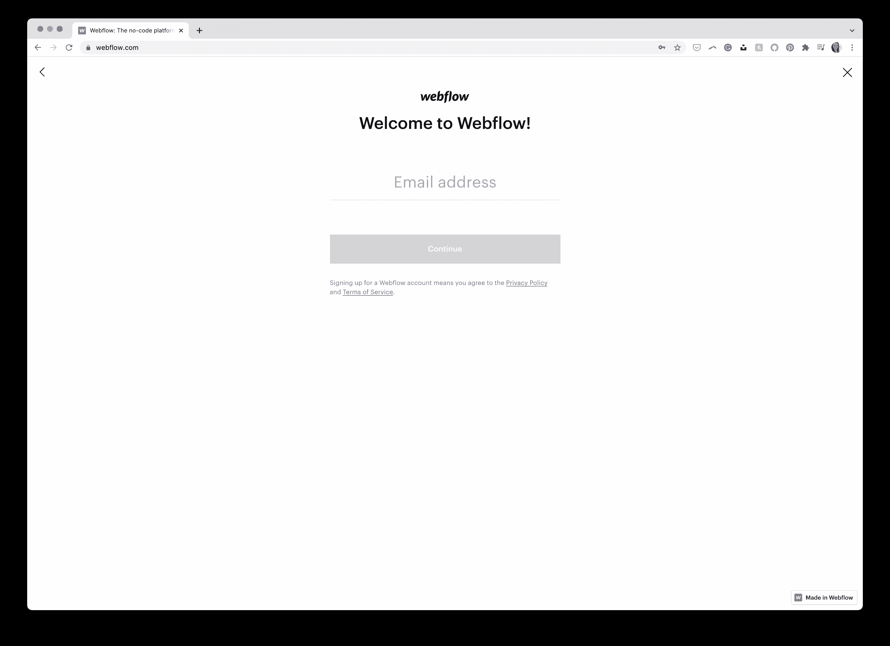

完成入职问卷后，您将进入 Webflow 可视化编辑器(称为设计器),开始学习教程。不管你在 web 开发方面有多有经验，我都强烈建议你花时间通读本教程，因为这将有助于你在着手第一个项目时缩短学习曲线。

Webflow 将带您了解本教程的一些最重要的部分，包括元素面板、类、如何使您的站点对断点做出响应，以及如何实时推送您的项目的信息。在教程中，你可能会很好地理解所需的技能，特别是当它向你解释不同的 web 原理时(比如级联样式表)。

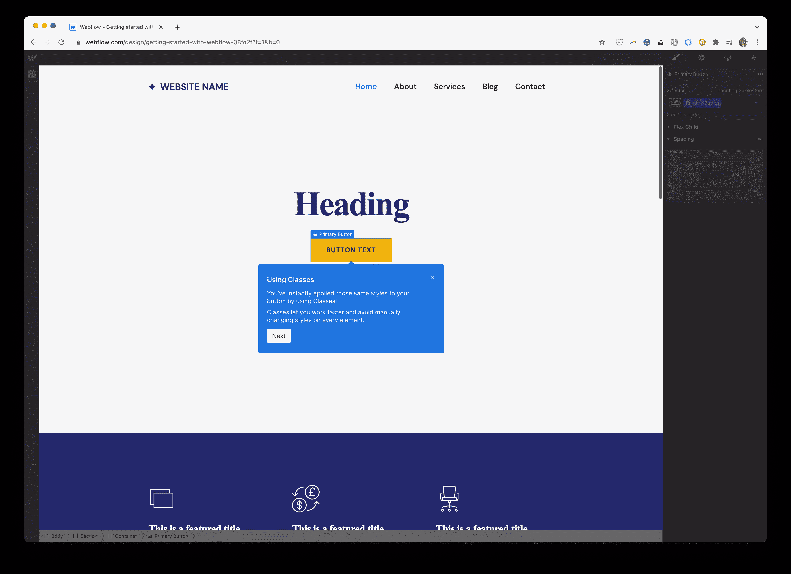

一旦您完成了快速欢迎教程，就该开始您的第一个项目了(当您完成了介绍性主题时会有提示)。点击**创建新项目**可以直接进入 Webflow 的可视化编辑器。

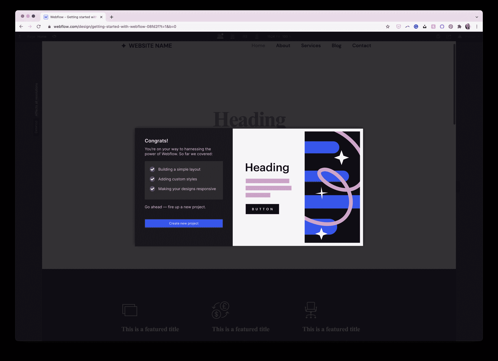

从这里开始，这是一个“选择你自己的冒险”类型的设置，关于你想要前进的道路。为了学习和理解 Webflow 如何工作，我强烈建议选择一个模板进行编辑，而不是直接跳到一个空白的站点项目中。

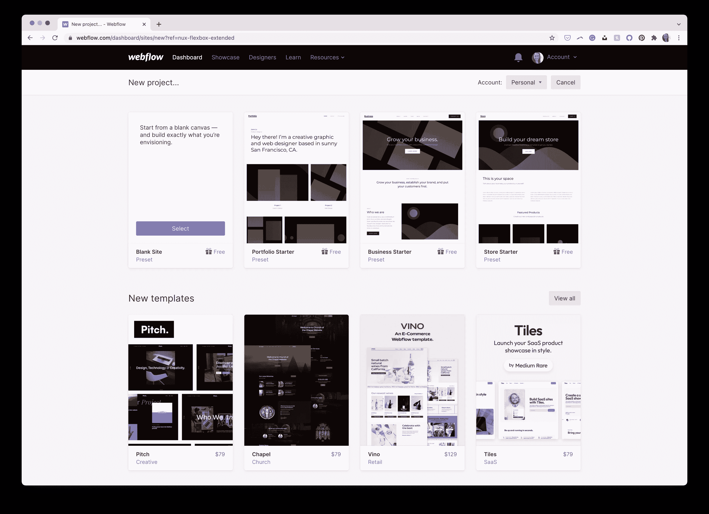

对于本操作指南，我们将编辑一个现有的 Webflow 模板，以了解设计器如何工作以及您将在 Webflow 中使用的主界面的主要功能。

### 设计师

Webflow 中的设计器是可视化编辑器，在 Webflow 中工作时，您的大部分时间可能都在这里。为了体验一下设计器，让我们编辑一个现有的模板。对于本文，我将从项目列表中选择“Business Starter”模板。将鼠标悬停在模板上，点击**选择**，给它命名，然后点击**创建站点**。

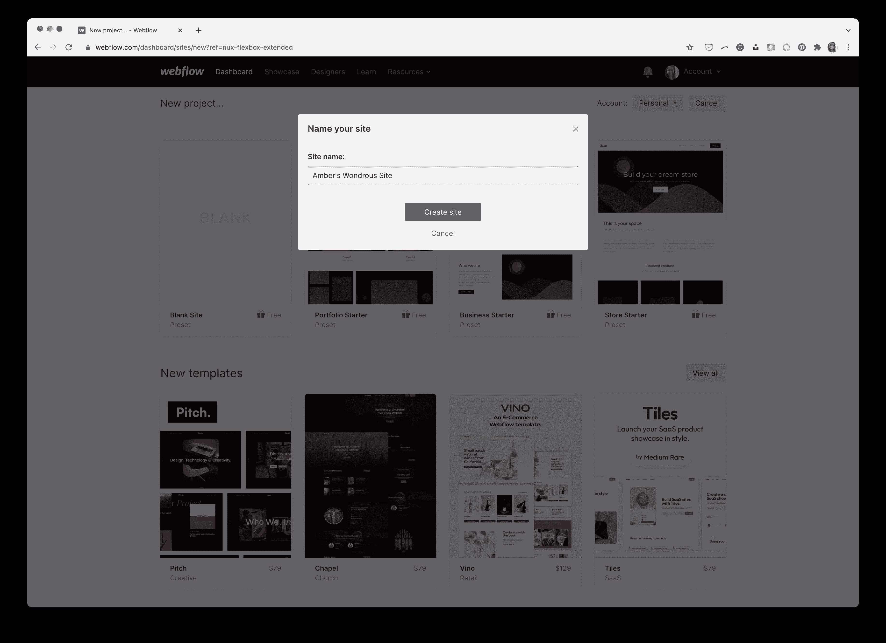

使用 Business Starter 模板新建的站点将在 Webflow 的设计器中打开。您会在左侧和顶部看到工具栏，在右侧会看到一个选项面板。虽然 Designer 可以帮助您编辑和使用模板，但我们将重点关注 Designer 中几个更重要、最常用的部分，这样您就可以学习如何根据自己的喜好编辑您的站点。

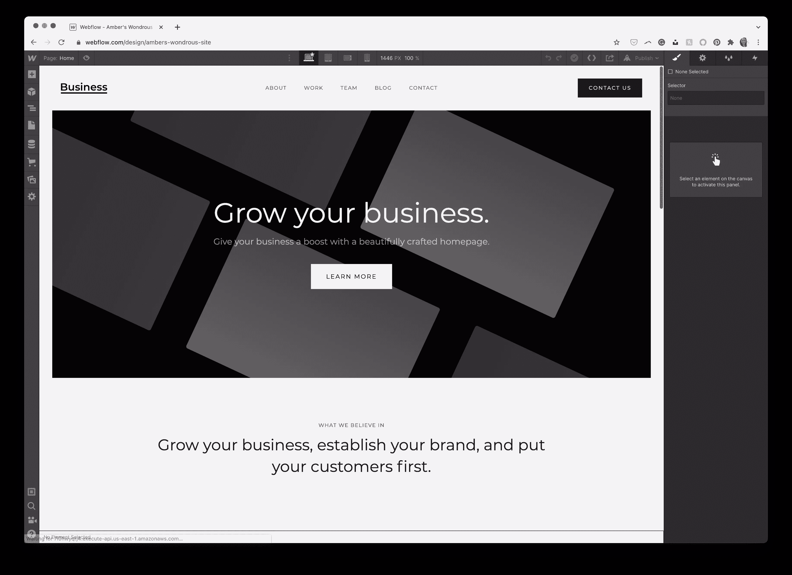

让我们来看一下 Webflow 设计器中最重要的部分，也是您可能使用最频繁的部分:元素面板、样式面板、导航器面板和页面面板。

### 元素面板

在 Webflow 中，网站的基本构建块(如标题、图像和按钮)被称为“元素”。在 Webflow 徽标下的左上角是一个加号图标，在这里您可以浏览所有不同的可能元素并选择您想要的元素。

例如，我想在这个网站的英雄部分添加一个额外的按钮，紧挨着当前的那个按钮。我可以单击按钮元素，并将其拖动到我想要的位置。在我添加的元素下面会弹出一个更小的窗口，为我提供更多的选项——在本例中，主要是为按钮添加一个链接。

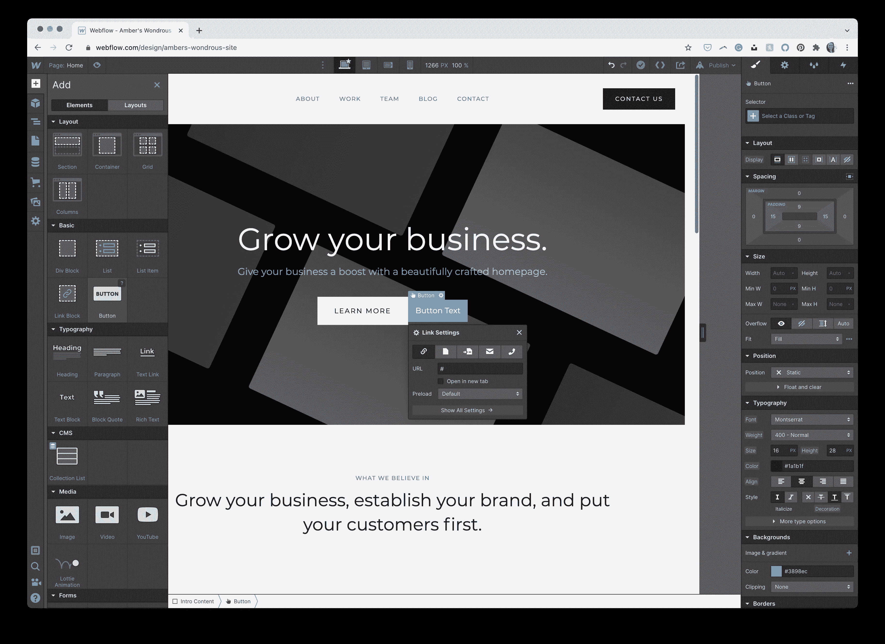

“元素”面板还有其他类型的元素，您可能不希望它们已经加载并准备好使用，如块引号、文件上传、选项卡、滑块和社交媒体元素。所有这些都是网站上的常见元素，但是 Webflow 已经完成了编码这些元素的大部分繁重工作，它提供了这些类型的 web 元素，可以随时根据需要添加到您的站点中。

除了元素之外，在同一个窗格中还有布局。单击顶部的“布局”将切换到您可以使用的可用布局，如图库或联系人表单。如果您需要某种布局，但不想单独拼凑每个元素来实现它，这是很方便的。Webflow 可以轻松地将这些布局插入到您的网站中，并根据您的需要进行定制。

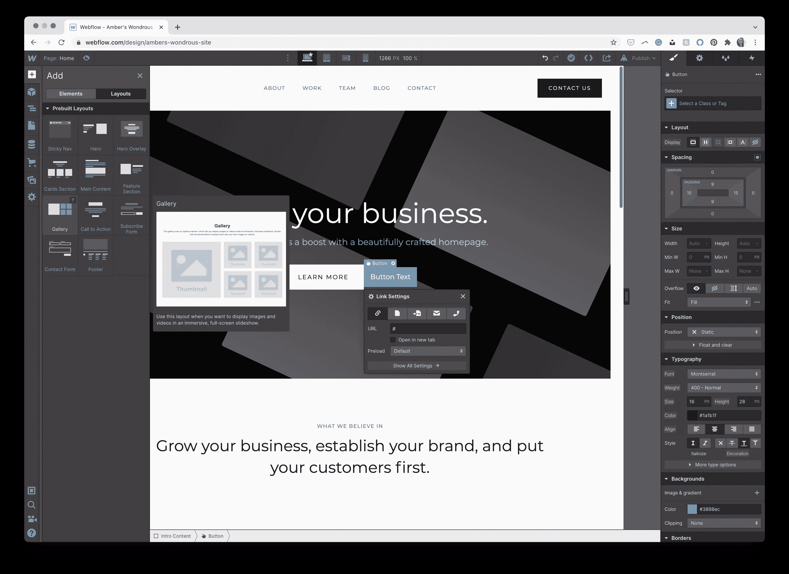

元素面板非常密集，有许多元素和布局可以在您的站点中使用。你可以在 Webflow University [这里](https://university.webflow.com/lesson/add-elements-panel)阅读更多关于元素面板和所有可用元素的信息。

### “样式”面板

你可能已经注意到，当我们在网站的英雄部分添加一个按钮时，右边的窗格发生了变化，为你的按钮提供了更多的选项。此窗格称为“样式”面板，是大多数设计调整和编辑发生的地方。

此面板根据您正在处理的元素，为您提供诸如字体类型和大小、对齐、颜色、边距和填充(在元素之间创建空间)等选项。换句话说，这个面板包含了对你的元素进行“样式化”所必需的所有设置(因此得名，也是对在现代 web 开发中使用 CSS 样式表来“样式化”或设计你的网站的认可)。在这种情况下，掌握一些 web 开发知识将会派上用场，从而缩短理解所有这些项目(如边距、填充、溢出和定位)的学习曲线。

但是，如果您没有这方面的经验，尝试这些不同的选项将有助于您了解每个选项的作用，以及更改它们会如何影响您正在处理的元素。有些程序更加易于自我解释，工作方式类似于其他类型的程序，如字体和颜色，而其他程序则需要一些反复试验或实验来完全理解它们能做什么，如定位和溢出。

如果你不确定所有设置的意思，或者想看看有哪些设置可用，Webflow University 为你一一解析[这里](https://university.webflow.com/lesson/style-panel-overview)。

### 导航器面板

在使用 Webflow 时，设计器的另一个重要部分是导航面板。此面板允许您将元素组合在一起，查看哪些元素组合在一起，并根据需要重新组织页面上元素的顺序。

在设计器的左侧，单击带有三个栏的图标(“导航器”)图标。这将显示一个窗格，其中包含您在当前页面上找到的所有元素。双击其中的任何元素都会在主窗口中高亮显示，供您查看。

单击此处的“页脚”会立即将您带到页脚，在这里您可以开始处理该特定元素。您可以在导航器窗格中单击并按住元素，以重新组织页面或将元素放在页面的不同位置。这有助于您了解所有元素在页面上的位置以及它们是如何相互连接的。

要了解更多关于导航面板的信息，[点击这里](https://university.webflow.com/lesson/navigator)。

### 页面面板

最后，您会发现自己经常使用的设计器的最后一个主要部分是页面面板。在设计器的左侧，单击页面图标(从顶部数第四个)以显示页面面板。

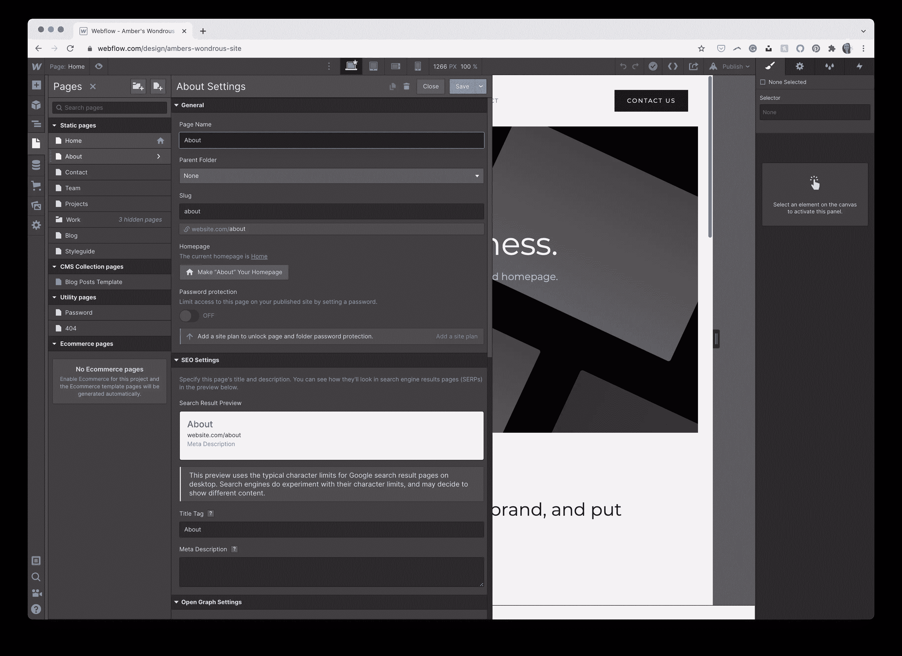

这是你所有静态页面的位置，还有你的站点可能有的其他类型的页面(比如你的 404 页面)。在这里，您可以组织您的页面和内容，以及更改您对任何给定页面的任何特定设置，如页面标题和 slug(或永久链接)。您也可以在此面板中添加和删除页面。

在一个面板中查看所有页面有助于您保持条理，并在构建网站时查看网站内容。要了解 Webflow 中页面面板的更多信息，[请点击此处](https://university.webflow.com/lesson/pages-panel)。

上面讨论的四个面板仅仅触及了 Webflow 在设计器中提供的所有功能的表面。要了解设计器中所有不同面板的更多信息，Webflow 大学有一篇精彩的文章，概述了您需要了解的一切[这里](https://university.webflow.com/lesson/intro-to-the-designer)。

## 你会走哪条路？

Webflow 有助于迎合两种不同类型的用户:经验有限的用户，他们有许多模板可以开始，以及经验丰富的用户，他们有能力从头开始一个项目。我在上面提到过，不管技能水平如何，最好的办法是从一个模板开始，然后对它进行定制，这样您就可以了解所有窗格的工作方式以及 Webflow 必须提供的全部功能。

根据您的技能组合，您可能喜欢使用现有的初学者模板，然后根据自己的喜好进行定制，或者您可能希望完全从头开始一个项目。一旦你满意了，你就可以在 Webflow 平台上发布你的网站，你就可以开始了。

想要设计自己的网站但没有太多设计/编码经验的用户，从预制模板开始是最好的途径。选择一个模板，并使用设计器及其元素面板根据您的需要对其进行定制。对于带着设计(以及 web 开发经验)来到 Webflow 并希望在 Webflow 中重新创建它的用户来说，从头开始可能是对项目拥有完全控制权的最佳选择。

如果您想要开始一个新项目(关闭模板或从空白页开始)，您可以通过单击左上角的 Webflow 徽标图标并单击**仪表板**返回 Webflow 仪表板。当你准备好开始你的项目时，点击右上角的**新项目**按钮。点击**新项目**按钮，你会看到他们所有模板的列表，以及从空白开始的选项。

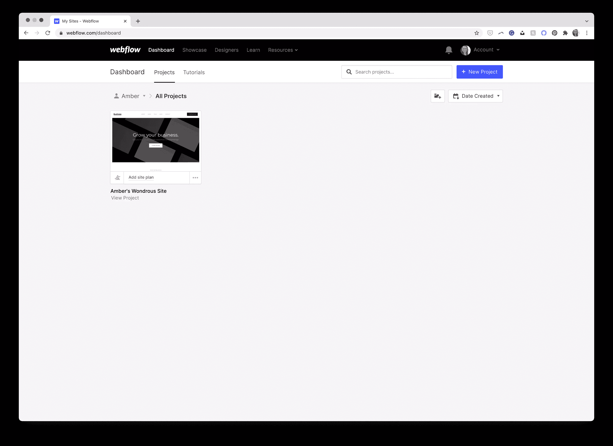

Webflow 将自己定位为一种迎合新手和有经验的设计师/开发人员的方式，并允许根据需要在两者之间自由灵活地移动。然而，您选择的道路将在很大程度上取决于您的用例、技能水平以及您想要实现的最终结果，因此在 Webflow 中开始新项目时，请务必将这些因素考虑在内。

## 结论

Webflow 有一个很棒的资源库，名为 Webflow University，可以帮助那些开始使用 Webflow 的人以及那些只需要了解他们可以使用哪些选项的人。浏览 Webflow University 中的一些教程，特别是他们的课程，如“入门”，可以帮助您更深入地了解 Webflow 和 web 开发本身的某些部分(这有助于减少学习曲线)，特别是如果您在使用无代码工具中找到了乐趣，并希望了解更多关于每个按钮和符号的含义和功能。

Webflow 的大学课程库位于 university.webflow.com/lesson。

总的来说，如果你正在寻找一个无代码(或低代码)的工具来帮助你第一次建立网站，或者作为一个有经验的网站设计者/开发者来使你的工作流程更容易，Webflow 已经使自己成为这个领域的一个重要竞争者。如果您选择从使用 Webflow 的模板开始，或者渴望从头开始，Webflow 的设计师将帮助您获得您想要的网站外观和功能，同时在后台为您编写代码。该设计器通过其易于使用的用户界面，可以很容易地对您的网站进行更改，如布局、间距、颜色、字体等。

Webflow 旨在使设计人员能够创建完全响应的网站，无论您的技能水平如何，它都是一个可行的选择，可以帮助您在不了解代码的情况下创建网站，或者帮助您在后台编写干净的代码时加快工作流程。一旦你的网站准备好了黄金时段，用 Webflow 建立一个付费计划，在 Webflow 平台上发布你的网站，或者下载代码，然后用 WordPress 等平台自己托管。

## 分享这篇文章