# 使用 Next.js 和 FaunaDB 构建一个代码片段 Web 应用程序

> 原文：<https://www.sitepoint.com/nextjs-faunadb-build-code-snippet-app/>

在编程时，开发人员会遇到需要代码重用的问题，导致重复编程，这可能会浪费时间并降低生产率。这就产生了对称为“代码片段”的可重用源代码的需求。这些代码片段可以防止编程过程中的重复代码，可以保存下来供将来使用，并且可以共享。

在本教程中，我们将构建一个网站，帮助用户使用 [Next.js](https://nextjs.org/) web 开发框架保存日常代码片段，并由[动物群](https://fauna.com/)数据库提供支持，以处理代码片段的存储、操作和显示。通过参与这个有趣的项目，我们还将学习如何使用 Next.js 和 FaunaDB 创建一个基本的 CRUD 应用程序，它也可以用于构建其他类似的项目。

这个项目的工作版本可以在 GitHub 上找到。为了跟进，您需要在您的机器上安装[节点，以及一个 FaunaDB 帐户和一个 Google 帐户(用于身份验证)。](https://www.sitepoint.com/quick-tip-multiple-versions-node-nvm/)

## 安装依赖项

在这一节中，我们将看看如何使用`npx create-next-app`命令安装 Next.js。这将初始化下一个 CLI 并构建一个新的 Next.js 应用程序。

我们还将通过命令行安装用于后端的依赖项——FaunaDB 和 SWR。SWR (state-while-revalidate)是一个用于获取数据的 Next.js 钩子。我们将在本教程的后面深入探讨这一点。

### Next.js 安装

要安装 Next.js，请在 CLI 中输入以下命令:

```
npx create-next-app snippetapp 
```

上面的命令使用 Next.js starter 模板创建了一个名为`snippetapp`的项目目录，其中包含使用 Next 进行编码所需的文件。当 Next 完成安装后，切换到新创建的目录:

```
cd snippetapp 
```

### 福纳德布和 SWR 装置

要安装 Fauna，我们将在 CLI 中使用以下命令:

```
npm install --save faunadb 
```

然后安装 SWR:

```
npm install swr@0.3.8 
```

至此，我们已经安装了将用于构建应用程序的所有依赖项，现在可以着手建立我们的动物群数据库了。

## FaunaDB 设置

FaunaDB 是一个无服务器的实时数据库。它将传统数据库转变为灵活的数据 API，仍然保留数据库的功能和性能，同时提供对应用数据的安全和可扩展的访问。

这里，我们将创建一个用户帐户，并设置数据库来存储我们将在片段应用程序中使用的数据。

### 创建用户帐户

要创建用户帐户，请导航至[动物注册页面](https://dashboard.fauna.com/accounts/register)并创建一个帐户。

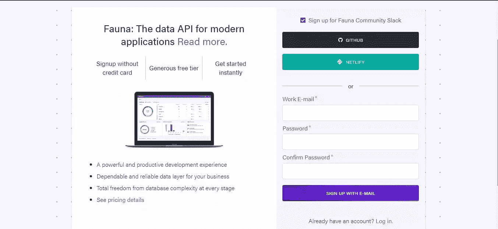

创建用户帐户后，您将被重定向到仪表板。

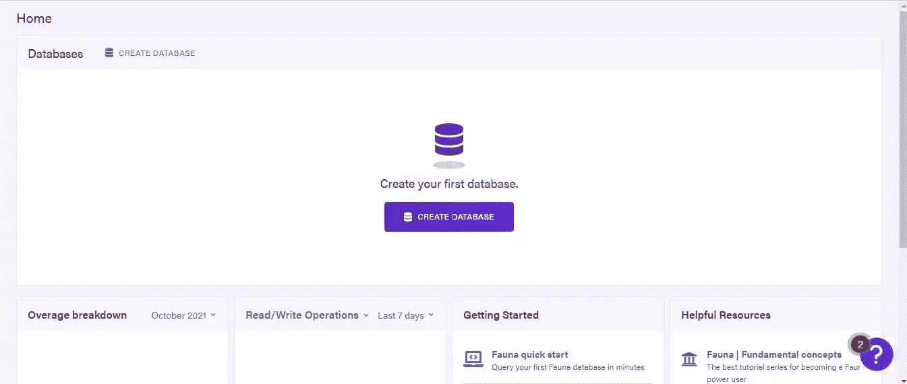

### 创建代码段数据库和集合

这里，我们将创建一个数据库，其中包含管理应用程序代码片段所需的集合。点击**创建数据库**。我们将创建一个名为`snippets`的数据库。

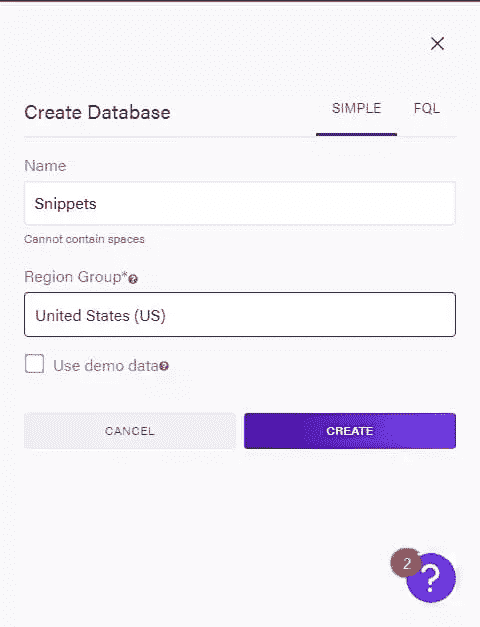

在打开的新页面上，点击**新收藏**并创建一个名为`codesnippet`的收藏。


创建一个集合后，我们得到一个页面，可以在其中创建一个文档。

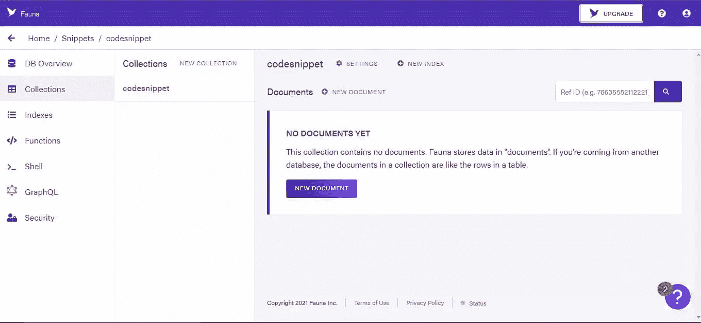

在这里，您将点击**新建文档**。将打开一个 JSON 文档，您可以在其中输入详细信息，如下图所示。

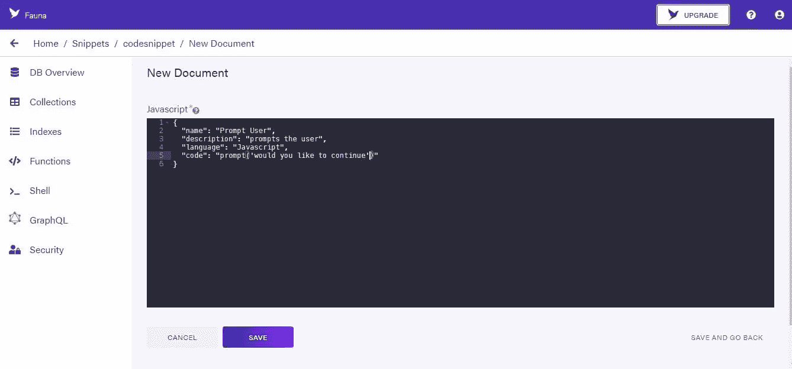

```
{
  name: "Prompt User",
  description: "prompts the user",
  language: "javascript",
  code: "prompt('would you like to continue')"
} 
```

这里，我们用属性定义一个片段:`name`、`description`、`language`和`code`。点击**保存**保存新收藏。我们已经成功地将一个片段添加到我们的数据库中。现在，我们可以继续获取在我们的应用程序上使用的访问凭据。

### 密钥创建

在仪表板上，点击**安全**。这将打开一个新页面来创建我们的安全密钥。

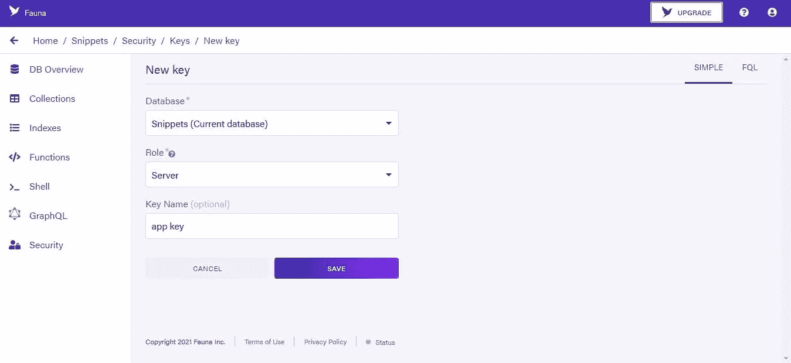

在这里，我们将角色设置为“server”而不是“admin ”,您可以给这个键一个名称。点击**保存**按钮生成您的密钥。

### 创建一个`.env`文件

我们现在将在项目目录中创建一个`.env`文件。这个文件将存储我们生成的密钥。在`.env`文件中，我们有这样的内容:

```
FAUNA_SECRET = paste your key here 
```

## 创建代码段页面

在本节中，我们将为代码片段构建显示和上传页面，并为其添加功能。

在代码编辑器中打开项目目录，并导航到 pages 文件夹中的`index.js`文件。在这里，我们将清除代码并开始构建我们的应用程序:

```
import Head from "next/head"
import Image from "next/image"
import styles from "../styles/Home.module.css"

export default function Home() {
  return (
    <div className={styles.container}>
      <Head>
        <title>View Snippet</title>
        <meta name="description" content="Generated by create next app" />
        <link rel="icon" href="/favicon.ico" />
      </Head>

      <main className={styles.main}>
        <h1 className={styles.title}>Re-usuable Code Snippets</h1>
        <p className={styles.info}>Add your code snippets here...</p>
        <button>Create new snippet</button>
      </main>
    </div>
  )
} 
```

### 创建我们的组件

现在我们将创建一个组件文件来呈现我们的代码片段。在您的工作目录中创建一个名为`component`的文件夹，并使用以下代码在其中创建一个名为`Snippets.js`的文件:

```
import React from "react"
import styles from "../styles/Home.module.css"

function Snippets() {
  return (
    <div className={styles.cont}>
      <p className={styles.lang}>language</p>
      <h3 className={styles.name}>name of snippet</h3>
      <p className={styles.descp}>description of snippet</p>
      {/* Code will be displayed here*/}
      <div className={styles.links}>
        <a>Edit</a>
        <a>Delete</a>
      </div>
    </div>
  )
}

export default Snippets 
```

### 将我们的组件导入应用程序

我们现在将在`index.js`中为该文件添加导入:

```
import Snippets from "../components/Snippets" 
```

并在我们的应用中使用它:

```
<button>Create new snippet</button>
<Snippets/> 
```

### 设计我们的应用

我们现在可以设计我们的页面了。导航到`styles`文件夹中的`Home.module.css`文件，并用以下内容替换其中的样式:

```
.container{
  display: flex;
  height: 100%;
  min-height: 100vh;
  background: rgb(48, 48, 255);
  flex-direction: column;
  align-items: center;
  color: #fff;
  font-family: Montserrat;
}
.cont{
  color: #333;
  margin-top: 5px;
  background: rgb(214, 214, 214);
  border-radius: 15px;
  padding: 10px 15px;
}
.main button{
  width: fit-content;
  flex-grow: unset;
  display: inline-block;
  padding: 5px 10px;
  outline: none;
  border: none;
  border-radius: 5%;
  font-weight: bold;
  color: rgb(48, 48, 255);
}
.main button:hover{
  cursor: pointer;
}
.links{
  margin-top: 10px;
}
.links a{
  margin-left: 5px;
}
.links a:hover{
  cursor: pointer;
} 
```

## 查看我们的应用

此时，您应该能够使用`npm run dev`启动 dev 服务器，访问 [http://localhost:3000](http://localhost:3000) ，并看到我们应用程序的框架。

## 设置代码片段显示区域

接下来，我们将为代码片段创建显示部分。在 components 文件夹中创建一个名为`Code.js`的新文件，并导入到`Snippets.js`中:

```
import React from 'react'
import styles from '../styles/Home.module.css'
import Code from "./Code";

function Snippets() {
  return (
    <div className={styles.cont}>
      <p className={styles.lang}>language</p>
      <h3 className={styles.name}>name of snippet</h3>
      <p className={styles.descp}>description of snippet</p>

      {/* Code will be displayed here*/}
      <Code />

      <div className={styles.links}>
        <a>Edit</a>
        <a>Delete</a>
      </div>
    </div>
  )
}

export default Snippets 
```

为了突出代码的语法，我们将使用两个包，即 [react-syntax-highlighter](https://www.npmjs.com/package/react-syntax-highlighter) 和 [react-copy-to-clipboard](https://www.npmjs.com/package/react-copy-to-clipboard) 。我们可以通过 CLI 下载:

```
npm install react-syntax-highlighter react-copy-to-clipboard --save 
```

然后在`Code.js`中:

```
import React from "react"
import { PrismLight as SyntaxHighlighter } from "react-syntax-highlighter"
import {atomDark} from "react-syntax-highlighter/dist/cjs/styles/prism"
import { CopyToClipboard } from "react-copy-to-clipboard"
import styles from "../styles/Home.module.css"
function Code() {
  const codeString = "npm install import react from 'react'"
  const [show, setshow] = React.useState(false)
  return (
    <div>
      <button onClick={() => setshow(!show)}>Show Code</button>
      {show ? (
        <div>
          <CopyToClipboard text={codeString}>
            <button className={styles.btn}>Copy</button>
          </CopyToClipboard>
          <SyntaxHighlighter language="javascript" style={atomDark}>
            {codeString}
          </SyntaxHighlighter>
        </div>
      ) : null}
    </div>
  )
}
export default Code 
```

这里，我们创建了一个组件来用语法高亮显示代码。我们还增加了复制和切换显示功能。现在在`styles`文件中:

```
.btn{
  left: 80%;
  position: relative;
} 
```

## 测试代码块

要查看这一更改，您可以在命令行中运行`npm run dev`并在浏览器中查看。我们将字符串“NPM install import react from ' react '”显示为一个代码块，语法高亮显示。还有一个隐藏和显示代码片段的按钮，以及一个允许我们从代码块中复制代码的按钮。

## FaunaDB 初始化

在这一节中，我们将从 FaunaDB 数据库获取数据到我们的应用程序中。在项目目录中创建一个名为`Fauna.js`的文件:

```
const faunadb = require("faunadb")
const faunaClient = new faunadb.Client({
  secret: process.env.FAUNA_SECRET
})
const q = faunadb.query
const getResponse = async () => {
  const { data } = await faunaClient.query(
    q.Map(
      q.Paginate(q.Documents(q.Collection("codesnippet"))),
      q.Lambda("doc", q.Get(q.Var("doc")))
    )
  )
  const snippets = data.map((snippet) => {
    snippet.id = snippet.ref.id
    delete snippet.ref
    return snippet
  })
  return snippets
}

module.exports = {
  getResponse,
} 
```

这里，我们已经用我们的密钥初始化了 FaunaDB。我们还建立了一个`async`请求来查询我们的集合并返回数据。我们将返回的数据存储在一个名为`snippets`的变量中，并删除了 ref 以更好地组织数据。创建、更新和删除代码片段的其他功能将在本教程的后面部分添加。

注意，如果您在控制台中得到一个未授权的错误，您可能需要指定目标端点的域名。默认为`db.fauna.com`，但是自从[区域组](https://docs.fauna.com/fauna/current/learn/understanding/region_groups)的引入，有三个云域可用。为数据库的区域组使用正确的域:

*   经典(美国和欧盟):`db.fauna.com`
*   美国(美国):`db.us.fauna.com`
*   欧洲(我):`db.eu.fauna.com`

示例代码:

```
const faunaClient = new faunadb.Client({
  secret: process.env.FAUNA_SECRET,
  domain: "db.eu.fauna.com"
}) 
```

### 处理我们的 API 请求

我们还将创建一个文件来处理数据库的 API 请求。在`pages`的`api`文件夹中，创建一个名为`snippets.js`的文件，代码如下:

```
import { getResponse } from "../../Fauna.js"
export default async function handler(req, res) {
  console.log(req)
  if (req.method !== "GET") {
    return res.status(405)
  }
  try {
    const snippets = await getResponse()
    return res.status(200).json(snippets)
  } catch (err) {
    console.log(err)
      res.status(500).json({ msg: "Something went wrong." })
  }
} 
```

上面，我们简单地建立了一个函数来处理来自数据库的请求。代码片段作为`Json`返回，如果出现错误，将记录错误。在 Next.js 中，存储在`api`文件夹中的任何文件都被视为 API 端点而不是页面，并呈现在服务器端。

## 什么是 SWR？

如前所述，SWR(state-while-revidate)是一个用于获取数据的 Next.js 钩子。这是获取频繁更新数据的完美解决方案，非常适合我们的应用程序。

### 建立 SWR

我们将使用它从 FaunaDB 获取数据。要使用它，我们需要将其导入到`index.js`:

```
import useSWR from "swr"

export default function Home() {
  const { data:snippets, mutate }=useSWR("api/snippets")
  ...
}) 
```

这里，我们已经导入了 SWR，并使用它来获取数据，如`snippets.js`中所设置的。然后，我们将这些片段存储在`snippets`变量中，并从那里输出它们。我们现在将把`snippets`传递给我们的`Snippets`组件来显示:

```
- <Snippets /> 
+ {snippets && + snippets.map((snippet) => ( + <Snippets + key={snippet.id} + snippet={snippet} + snippetDeleted={mutate} + /> + )) + } 
```

上面，我们已经将密钥和代码片段传递给了`Snippets`。我们还设置了一个`mutate`属性，用于在代码片段被删除时更新(重新获取)代码片段。为了使用传递的数据，我们用下面的代码修改了`Snippets`组件:

```
function Snippets({snippet}) {
  return (
    <div className={styles.cont}>  <p className={styles.lang}>{snippet.data.language}</p>  <h3 className={styles.name}>{snippet.data.name}</h3>  <p className={styles.descp}>{snippet.data.description}</p>  <Code snippet={snippet}/>  <div className={styles.links}>  <a>Edit</a>  <a>Delete</a>  </div>  </div>
  )
} 
```

上面，我们已经在代码中插入了从 FaunaDB 收到的代码片段语言、名称和描述。为了在我们的应用程序中获得来自动物群的代码，我们还必须将片段 prop 传递给`Code`组件。

然后在`Code`组件中:

```
function Code({snippet}){
  ...
  <div>  <CopyToClipboard text={snippet.data.code}>  <button className={styles.btn}>Copy</button>  </CopyToClipboard>  <SyntaxHighlighter language="javascript" style={atomDark}>  {snippet.data.code}  </SyntaxHighlighter>  </div>
  ...
} 
```

我们现在已经完成了`GetSnippet`功能。如果我们返回 FaunaDB 并创建一个新的片段，我们会看到下图所示的内容。

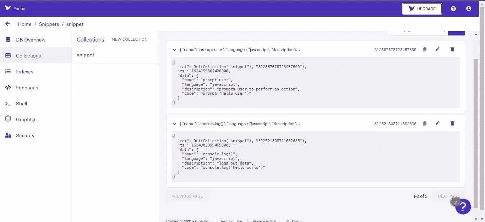

```
{
  "name": "console.log()",
  "language": "javascript",
  "description": "logs out data",
  "code": "console.log('Hello, world!')"'
} 
```

## 运行代码

要在 CLI 中运行:

```
npm run dev 
```

如果您在浏览器中打开该页面，您将得到类似下图的结果。

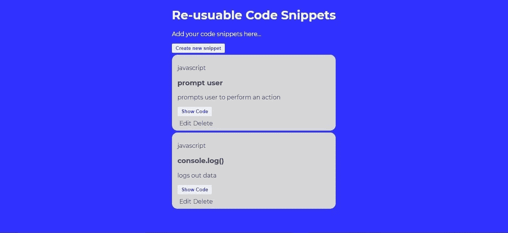

我们已经成功地创建了一个代码片段显示页面，它具有显示和隐藏代码以及复制代码片段的功能。

## 代码片段上传页面

我们需要从我们的主页组件创建一个到上传页面的链接。Next.js 提供了使路由更容易的条款，而不必像使用原生 React 代码那样安装`react-router`和其他依赖项。

在`index.js`中，我们将从`next`导入`Link`模块:

```
import Link from "next/link" 
```

然后将其添加到我们的**创建新片段**按钮:

```
- <button>Create new snippet</button> 
+ <Link href="/upload"> + <button>Create new snippet</button> + </Link> 
```

我们将在我们的`pages`文件夹中创建一个新页面，并将其命名为`upload.js`。

回到我们的`Fauna.js`文件，我们将创建并导出一个函数来在我们的应用程序中创建代码片段:

```
const createSnippet = async (code, language, description, name) => {
  return await faunaClient.query(q.Create(q.Collection("codesnippet"), {
    data:{code, language, description, name}
  }))
}

module.exports = {
  getResponse,
  createSnippet,
} 
```

这里，我们已经创建了函数`createSnippet`，它将接受一些参数，并将它们作为数据传递到将在数据库中创建的新文档中。

### 添加创建代码片段的函数

我们还将配置端点来创建代码片段。在`api`文件夹中创建一个名为`createSnippet.js`的新文件，并用以下代码填充它:

```
import { createSnippet } from "../../Fauna"

export default async function handler(req, res) {
  const { code, language, description, name } = req.body
  if (req.method !== "POST") {
    return res.status(405).json({msg:"unauthorized"})
  }
  try {
    const createdSnippet = await createSnippet(code, language, description, name)
    return res.status(200).json(createdSnippet)
  } catch (error) {
    console.log(error)
    res.status(500).json({msg:"unauthorized"})
  }
} 
```

### 创建我们的上传页面

我们现在将在我们的`upload.js`文件中创建上传页面。对于创建代码片段的表单，我们将使用 [react-hook-form](https://www.npmjs.com/package/react-hook-form) 。我们将通过 CLI 进行安装:

```
npm install react-hook-form 
```

然后，在我们的`upload.js`文件中:

```
import React from "react"
import { useForm } from "react-hook-form"
import { useRouter } from "next/router"
import style from "../styles/form.module.css"
import { Link } from "next/link"

function upload({ snippet }) {
  const { register, handleSubmit, errors, reset } = useForm()
  const router = useRouter()
  const createSnippet = async (data) => {
    const { code, language, description, name } = data
    console.log(data)
    try {
      // code here to push to Fauna
    } catch (error) {
      console.log(error)
    }
  }
  return (
    <div className={style.cont}>
      <form
        className={style.form}
        onSubmit={handleSubmit(snippet ? updateSnippet : createSnippet)}
      >
        <div>
          <label htmlFor="name">Name</label>
          <input
            className={style.input}
            type="text"
            id="name"
            {...register("name", { required: true })}
          />
        </div>
        <div>
          <label className={style.label} htmlFor="language">
            language
          </label>
          <select
            className={style.select}
            type="text"
            id="language"
            {...register("language", { required: true })}
          >
            <option>Javascript</option>
            <option>Html</option>
            <option>CSS</option>
          </select>
        </div>
        <div>
          <label className={style.label} htmlFor="description">
            description
          </label>
          <textarea
            className={style.input}
            rows={7}
            type="text"
            id="description"
            placeholder="snippet description"
            {...register("description", { required: true })}
          />
        </div>
        <div>
          <label className={style.label} htmlFor="code">
            Code
          </label>
          <textarea
            className={style.input}
            rows={8}
            columns={8}
            type="text"
            id="code"
            {...register("code", { required: true })}
            placeholder="background: none;"
          />
        </div>
        <div>
          <button className={style.button}>Submit</button>
          <button className={style.button}>Cancel</button>
        </div>
      </form>
    </div>
  )
}
export default upload 
```

## 设计我们的表单

上面，我们已经使用`react-hook-form`包创建了表单。我们在三元运算符中使用了`handleSubmit`函数`useForm()`。在提交表单时，它确定提交的内容是创建还是更新现有的代码片段。使用`register`，我们已经向表单中的每个字段添加了必需的属性。我们还为名为`form.module.css`的样式表添加了导入，其中我们的表单有以下样式:

```
.form {
  max-width: 800px;
  display: flex;
  justify-content: center;
  flex-direction: column;
  align-items: center;
}

.cont{
  background: rgb(48, 48, 255);
  height: 100%;
  min-height: 100vh;
  padding: 10px 0 0 0;
  display: flex;
  justify-content: center;
  align-items: center;
}

.select,
.input {
  display: block;
  box-sizing: border-box;
  width: 100%;
  border-radius: 4px;
  border: 1px solid black;
  padding: 10px 15px;
  margin-bottom: 15px;
  font-size: 14px;
}

.label{
  line-height: 2;
  text-align: left;
  display: block;
  margin: 5px;
  color: white;
  font-size: 14px;
  font-weight: 200;
}

.button {
  background : #fff;
  color: #444;
  border: none;
  border-radius: 5%;
  margin-right: 8px;
} 
```

### 创建 API 端点以创建代码片段

要将数据从我们的表单发送到 FaunaDB 数据库，请将以下代码添加到`upload.js`中的`createSnippet`函数的`try...catch`块中:

```
try {
  await fetch("/api/createSnippet", {
    method: "POST",
    body: JSON.stringify({ code, language, description, name }),
    headers: {
      "Content-type": "application/json"
    },
  })
  router.push("/")
} catch (error) {
  console.log(error)
} 
```

## 测试我们的表单

运行代码并导航到上传页面。现在，如果我们向表单添加一个新的片段，并单击**提交**，我们将看到下图所示的内容。


当我们导航到我们的 home 组件时，我们可以看到创建的代码片段。

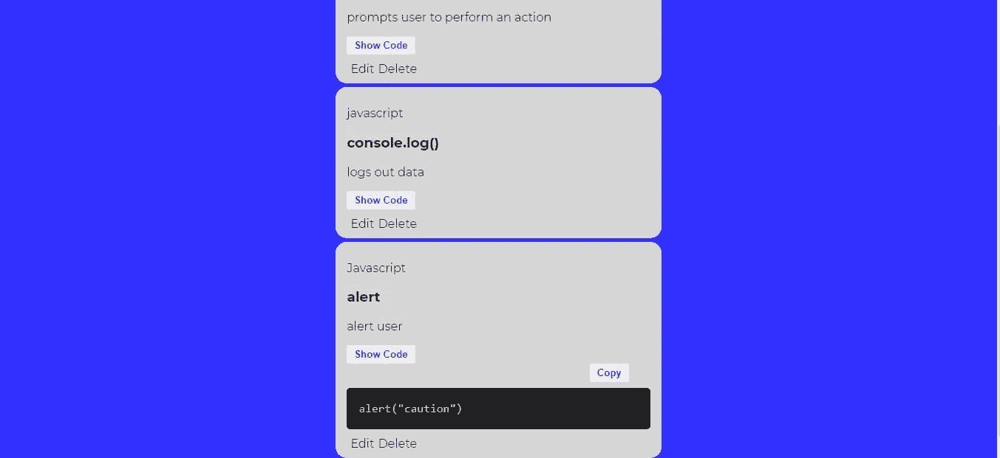

## 创建编辑代码片段的函数

为了创建我们的编辑片段功能，回到`Fauna.js`文件，我们将创建并导出一个函数来处理这个任务:

```
const updateSnippet = async (id, code, language, description, name) => {
  return await faunaClient.query(q.Update(q.Ref(q.Collection("codesnippet"), id), {
    data: {code, language, name, description},
  }))
}
module.exports = {
  ...
  updateSnippet,
} 
```

### 创建 API 端点以编辑代码片段

这个函数类似于`createSnippet`函数，但是它也接受一个参数`id`。它使用这个 ID 来标识要编辑的代码片段。如果`id`对应，我们用其他参数更新数据。我们还将在`api`目录中创建一个名为`updateSnippet.js`的端点文件来处理更新:

```
import { updateSnippet } from "../../Fauna"
export default async function handler(req, res) {
  const { id, code, language, description, name } = req.body
  if (req.method !== "PUT") {
    return res.status(405).json({ msg: "unauthorized" })
  }
  try {
    const updated = await updateSnippet(
      id,
      code,
      language,
      description,
      name
    )
    return res.status(200).json(updated)
  }
  catch (error) {
    console.log(error)
    res.status(500).json({ msg: "unauthorized" })
  }
} 
```

## 链接我们的编辑按钮

现在，移动到`Snippets`组件，修改这个组件来使用这个函数。首先，我们将导入`Link`模块:

```
...
import Link from "next/link" 
```

我们还修改了我们的`edit`按钮:

```
- <a>Edit</a> 
+ <Link href={`/edit/${snippet.id}`}> + <a>Edit</a> + </Link> 
```

### 处理编辑片段

当点击时，它向页面`edit`发送一个带有所选代码片段的`id`的请求。在`pages`文件夹中，创建一个名为`edit`的文件夹，其中包含一个文件`[id].js`:

```
import { getSnippetById } from "../../Fauna"
import Upload from "../upload"
export default function Home({ snippet }) {
  const email = ""
  const user = ""
  return (
    <div>
      <h3>Update a snippet</h3>
      <Upload snippet={snippet} email={email} user={user}/>
    </div>
  )
}

export async function getServerSideProps(context) {
  try {
    //get and update record
    const id = context.params.id
  }
  catch (error) {
    console.log(error)
    context.res.statusCode = 302
    context.res.setHeader("Location", "/")
    return {props: {}}
  }
} 
```

在`[id].js`中，我们将代码片段作为`props`传递给片段上传页面。然而，这次上传页面将包含存储在由`id`引用的代码片段中的数据。为了通过 ID 获取代码片段，我们需要在`Fauna.js`文件中创建`getSnippetById`函数:

```
const getSnippetById = async (id) => {
  const snippet = await faunaClient.query(q.Get(q.Ref(q.Collection("codesnippet"),id)))
  snippet.id = snippet.ref.id
  delete snippet.ref
  return snippet
}

module.exports = {
  getResponse,
  createSnippet,
  updateSnippet,
  getSnippetById,
} 
```

当我们导出这个函数时，回到`[id].js`文件中，我们可以用它来获取一个特定的代码片段及其 ID:

```
try {
  const id = context.params.id;
  const snippet = await getSnippetById(id);
  return {
    props: { snippet },
  };
} catch (error) {
  // as before
} 
```

## 修改存储的片段

现在，在`upload.js`文件中，如果要编辑一个片段，我们将修改它以便能够访问存储的数据:

```
- const { register, handleSubmit, errors, reset } = useForm() 
+ const { register, handleSubmit, errors, reset } = useForm({ + defaultValues: { + code: snippet ? snippet.data.code : "", + language: snippet ? snippet.data.language : "", + description: snippet ? snippet.data.description : "", + name: snippet ? snippet.data.name : "", + } + }) 
```

上面的代码检查代码片段中是否存储了数据。如果返回 true，则将数据返回给参数:`code`、`language`、`description`和`code`。如果它返回`false`，它将返回一个空字符串。

接下来，我们将创建一个函数来更新代码片段:

```
const createSnippet = async (data) => { ... }

const updateSnippet = async (data) => {
  const { code, language, description, name } = data
  const id = snippet.id
  try {
    await fetch("/api/updateSnippet", {
      method: "PUT",
      body: JSON.stringify({ code, language, description, name, id }),
      headers: {
        "Content-Type": "application/json",
      },
    })
    router.push("/")
  }
  catch (error) {
    console.log(error)
  }
}

return ( ,,, ) 
```

## 测试编辑代码片段功能

如果我们运行我们的代码，我们可以通过点击**编辑**按钮来编辑之前创建的代码片段，对表单中的数据进行修改，然后点击**提交**。

## 添加删除代码段功能

现在，如果我们返回到浏览器中的`Home`组件，我们能够编辑和更新代码片段。我们终于可以添加最后的功能来删除我们的代码片段。在`Fauna.js`文件中创建和导出一个新函数`deleteSnippet`:

```
const deleteSnippet = async (id) => {
  return await faunaClient.query(q.Delete(q.Ref(q.Collection("codesnippet"),id)))
}

module.exports = {
  ...
  deleteSnippet,
} 
```

### 为删除功能创建 API 端点

我们将在名为`deleteSnippet.js`的`api`文件夹中为该函数创建另一个端点，并用以下代码填充它:

```
import { deleteSnippet } from "../../Fauna"
export default async function handler(req, res) {
  if (req.method !== "DELETE") {
    return res.status(405).json({ msg: "unauthorized" })
  }
  const { id } = req.body
  try {
    const deleted = await deleteSnippet(id)
    return res.status(200).json(deleted)
  }
  catch (error) {
    console.log(error)
    res.status(500).join({ msg: "error occured" })
  }
} 
```

然后，我们修改`Snippets.js`文件来添加新功能:

```
function Snippets({ snippet, snippetDeleted }) {
  ...
} 
```

然后创建一个`deleteSnippet`函数从`api`中获取端点，并删除 ID 引用的代码片段:

```
function Snippets({snippet, snippetDeleted}) {
  const deleteSnippet = async () => {
    try {
      await fetch("/api/deleteSnippet", {
        method: "DELETE",
        body: JSON.stringify({ id: snippet.id }),
        headers: {
          "Content-Type": "application/json",
        },
      });
      snippetDeleted();
    } catch (e) {
      console.log(e);
    }
  };

  return (
    <div className={styles.cont}>
      <p className={styles.lang}>{snippet.data.language}</p>
      <h3 className={styles.name}>{snippet.data.name}</h3>
      <p className={styles.descp}>{snippet.data.description}</p>

      <Code snippet={snippet}/>

      <div className={styles.links}>
        <Link href={`/edit/${snippet.id}`}>
          <a>Edit</a>
        </Link>
        <a onClick={deleteSnippet}>Delete</a>
      </div>
    </div>
  )
} 
```

我们还更新了锚元素，当它被点击时调用`deleteSnippet`函数。

## 测试删除功能

我们添加了删除代码片段的功能。我们现在可以通过点击应用程序中的**删除**按钮来删除片段。

snippet 应用程序的功能到此结束。我们现在将继续向我们的应用程序添加身份验证措施，以便只有授权用户才能在我们的应用程序中创建和修改代码片段。

## 用户认证

为什么我们需要认证？目前，用户可以创建代码片段，但他们也可以删除和修改他们没有创建的代码片段。我们需要提供一种方法来授权用户访问我们的站点——因此需要用户认证。

我们将通过 CLI 安装 [next-auth](https://next-auth.js.org/) 进行身份验证:

```
npm i next-auth 
```

我们将使用一个 [JWT 令牌](https://jwt.io/introduction)进行身份验证。JWT 是用于为应用程序创建访问令牌的标准。

在您的`api`文件夹中创建一个名为`auth`的文件夹，并在其中创建一个包含以下代码的文件`[...nextauth].js`:

```
import NextAuth from "next-auth"
import GoogleProvider from "next-auth/providers/google"

export default NextAuth({
  providers: [
    GoogleProvider({
      clientId: process.env.GOOGLE_CLIENT_ID,
      clientSecret: process.env.GOOGLE_CLIENT_SECRET,
      authorizationUrl: "https://accounts.google.com/o/oauth2/v2/auth?prompt=consent&access_type=offline&response_type=code",
    })
  ],
  jwt: {
    encryption: true
  },
  secret: process.env.secret,
  callbacks: {
    async jwt(token, account) {
      if (account ?.accessToken) {
        token.accessToken = account.accessToken
      }
      return token
    },
    redirect: async (url, _baseUrl)=>{
      if (url === "/profile") {
        return Promise.resolve("/")
      }
      return  Promise.resolve("/")
    }
  }
}) 
```

在这之后，我们将把组件包装在`_app.js`文件中:

```
import '../styles/globals.css'
import {Provider} from "next-auth/client"

function MyApp({ Component, pageProps }) {
  return (
    <Provider session={pageProps.session}>
      <Component {...pageProps} />
    </Provider>
  )
}
export default MyApp 
```

## 处理认证

我们将修改`index.js`中的`Home`组件，以便在用户通过身份验证时返回组件，否则它将返回一个指向身份验证页面的按钮:

```
import {signIn, signOut, useSession} from "next-auth/client"
... 
```

然后在`Home`内:

```
export default function Home() {
  const { data:snippets, mutate }=useSWR("api/snippets")

  const [session, loadingSession] = useSession()
  if (loadingSession) {
    <>
      <p>...authenticating</p>
    </>
  }
  ...
} 
```

上面的代码检查 app 是否是`loadingSession`。如果为真，它返回`p`标记块，否则如果有`session`，它返回我们应用程序的其余部分。接下来，如果没有会话，我们将呈现“登录”:

```
return (
  <div className={styles.container}>
    <Head> ... </Head>

    {!session && (
      <>
        <h1>Sign in to access snippet app</h1>
        <button onClick={() => signIn()}>Sign In</button>
      </>
    )}

    {session && (
      <>
        <main className={styles.main}>
          <h3>welcome {session.user.email}</h3>
          <button onClick={() => signOut()}>Sign Out</button>
          ...
        </main>
      </>
    )}
  </div>
) 
```

为了使用“谷歌登录服务”，我们需要从谷歌云控制台访问凭证。为此，请登录您的谷歌账户并导航至[谷歌云控制台](https://console.developers.google.com/apis/credentials)。点击页面上的**创建项目**，输入你的项目名称，点击**创建**。

在打开的新页面上，点击顶部菜单栏中的 **+创建凭证**，最后在下拉菜单中选择 **OAuth 客户端 ID** 。

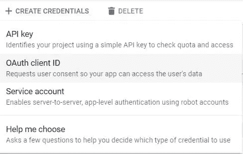

在打开的页面上，您会收到一个通知，其中有一个按钮要求您“配置同意屏幕”。点击此按钮。

在下一页，选择用户类型下的**外部**，点击**创建**。输入您的“应用程序名称”和“电子邮件”的必填字段，然后点击**保存并继续**。

在**范围**和**测试用户**部分，向下滚动并点击**保存并继续**。

最后，点击**返回仪表板**并点击**发布**按钮。

现在，我们可以通过点击侧面菜单中的**凭证**来创建我们的密钥，然后点击顶部菜单栏中的**创建凭证**。在下拉列表中选择 **Oauth 客户端 ID** ，您将看到一个请求应用程序类型的页面。

选择 **Web 应用**，然后在“授权 JavaScript 源”下，点击**添加 URI** ，进入`http://localhost`。最后，在“授权重定向 URIs”下，点击**添加 URI** 并在字段中输入`http://localhost/api/auth/callback/google`，然后点击**创建**。

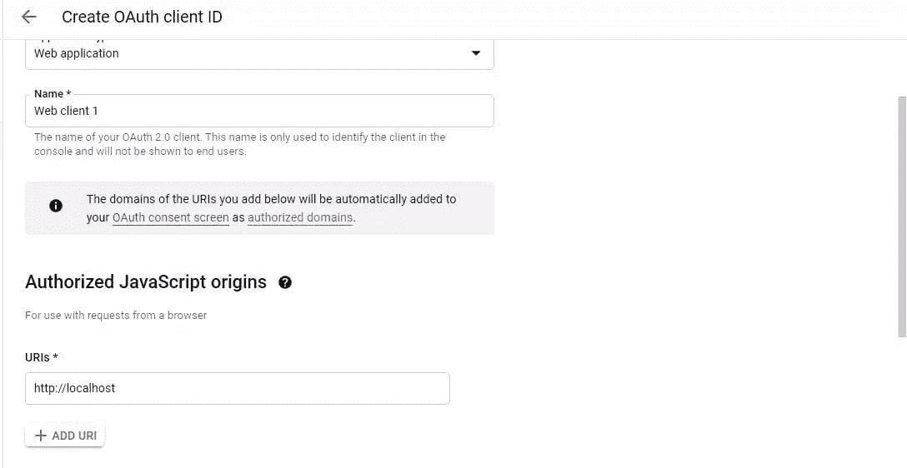

从打开的弹出窗口中复制客户端 ID 和客户端密码，并将其添加到`.env`文件中:

```
GOOGLE_CLIENT_ID=id
GOOGLE_CLIENT_SECRET=secret 
```

我们现在可以使用谷歌认证登录我们的应用程序。此外，我们将把我们的`upload.js`文件设置为受保护的路径，这样未经授权的用户就不能创建新的片段:

```
import { getSession } from "next-auth/client"

function Upload({ snippet, user }) { ... }

export async function getServerSideProps(context) {
  const session = await getSession(context)
  if (!session) {
    context.res.writeHead(302, { Location: "/" })
    context.res.end()
    return {}
  }
  return {
    props: {
      user: session.user,
    }
  }
}

export default Upload; 
```

## 测试用户身份验证

如果我们用`npm run dev`命令运行我们的应用程序，首先我们会得到一个页面要求我们“登录”。我们无法通过 URL 中的`/upload`路径导航到上传页面。只有使用 Google 登录功能登录我们的应用程序，我们才能访问我们的应用程序。

## 授权用户创建代码片段

最后，我们将修改`createSnippet`功能，将用户电子邮件添加到数据库中，然后，如果电子邮件对应，我们将只显示**编辑**和**删除**按钮。

在`Fauna.js`中，像这样修改`createSnippet`功能:

```
const createSnippet = async (code, language, description, name, mail) => {
  return await faunaClient.query(q.Create(q.Collection("codesnippet"), {
    data:{code, language, description, name, mail}
  }))
} 
```

在`createSnippet.js`文件中，进行以下更改:

```
- const { code, language, description, name } = req.body; + const { code, language, description, name, mail } = req.body; 
- const createdSnippet = await createSnippet(code, language, description, name); + const createdSnippet = await createSnippet(code, language, description, name, mail); 
```

在`upload.js`中:

```
function upload({ snippet, user }) {
+ const email = user.email;  ... } 
```

并更改`createSnippet`功能和`updateSnippet`功能，如下所示:

```
const createSnippet = async (data) => {
  const { code, language, description, name, mail } = data;
  console.log(data)
  try {
    await fetch("/api/createSnippet", {
      method: "POST",
      body: JSON.stringify({ code, language, description, name, mail:email }),
      headers: {
        "Content-type": "application/json"
      },
    })
    router.push("/")
  } catch (error) {
    console.log(error)
  }
}

const updateSnippet = async (data) => {
  const { code, language, description, name } = data
  const id = snippet.id
  try {
    await fetch("/api/updateSnippet", {
      method: "PUT",
      body: JSON.stringify({ code, language, description, name, mail:email }),
      headers: {
        "Content-Type": "application/json",
      },
    })
    router.push("/")
  }
  catch (error) {
    console.log(error)
  }
} 
```

我们现在可以继续让**编辑**和**删除**按钮仅在电子邮件对应时显示。

首先，我们将`user.mail`作为道具传递给`index.js`中的`Snippet`组件:

```
<Snippets  key={snippet.id}
  snippet={snippet}
 snippetDeleted={mutate} + email={session.user.email} /> 
```

然后在`Snippet.js`中:

```
function Snippets({ snippet, snippetDeleted, email }) {
...
  {email == snippet.data.mail && (
    <>
      <div className={styles.links}>
        <Link href={`/edit/${snippet.id}`}>
          <a>Edit</a>
        </Link>
        <a onClick={deleteSnippet}>Delete</a>
      </div>
    </>
  )}
  ...
} 
```

## 测试我们的应用

在 CLI 中运行`npm run dev`，在浏览器中打开应用程序。现在，如果您创建一个新的代码片段，用户电子邮件将被添加到数据库中。如果电子邮件不对应，则**编辑**和**删除**按钮不会显示在片段显示页面上。您可以通过使用不同于创建代码片段的电子邮件地址登录来测试这一点。

## 结论

我们终于来到了本教程的结尾。我们已经学习了如何用 Next.js 和 FaunaDB 构建 CRUD 应用，以及如何基于用户认证执行 CRUD 操作。

要查看完整代码，请访问 GitHub 库。

## 分享这篇文章