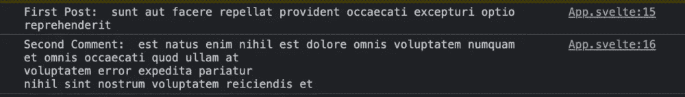

# 如何以苗条的姿态获取数据

> 原文：<https://www.sitepoint.com/svelte-fetch-data/>

**本教程探讨了如何在你的瘦应用程序中使用和呈现来自 API 的数据。您可以使用 Axios、Apisauce、JavaScript 的本地 Fetch API 或您选择的任何 HTTP 客户端，在`onMount()`生命周期钩子中与 Svelte 中的 API 进行交互。**

我们将构建一个样例应用程序，它交互并显示 REST API 服务器提供的数据。这个应用程序将允许用户从 REST API 获取博客文章列表，并在页面上显示它们。

### 先决条件

为了阅读本教程，你需要先了解一些 JavaScript 和 CSS 知识，并对 [Svelte](https://www.sitepoint.com/svelte-javascript-framework-introduction/) 有所了解。

您还需要在您的机器上安装[节点和 npm](https://www.sitepoint.com/quick-tip-multiple-versions-node-nvm/) ，以及 [Git](https://git-scm.com/downloads) 。

## 什么是 REST API？

缩写 API 代表“应用程序编程接口”，简单来说，它是两个应用程序相互通信或共享数据的一种方式。

REST API 是一种实现表述性状态转移(REST)协议的 API。REST 是一种架构风格，用于构建通过 HTTP 协议交互的 web 服务。REST 的请求结构包括四个基本部分，即 HTTP 方法、端点、头和请求体。

*注:你可以在“[什么是 REST API”中深入挖掘这个话题。](https://www.sitepoint.com/rest-api/)”。*

### HTTP 方法

API 请求中的 HTTP 方法告诉服务器客户机期望它执行哪种操作。今天最广泛使用的 HTTP 方法包括 GET、POST、PATCH、DELETE，下面将简要说明。

*   `GET`:用于从服务器获取或读取信息
*   `POST`:用于在服务器中创建或存储记录
*   `PUT` / `PATCH`:用于更新或修补服务器中的记录
*   `DELETE`:用于删除资源点的一条或多条记录

### HTTP 端点

用基本术语来说，HTTP 端点是一个地址或 URL，它指定 API 可以访问一个或多个资源的位置。

### HTTP 标题

HTTP 头是键值对，让客户端在请求中向服务器传递信息，反之亦然。

### 请求正文

API 调用的主体是从客户端发送到服务器的有效负载(或数据)。

## 设置我们的苗条应用程序

我们将构建一个示例应用程序，它与一个外部 REST API 交互，从服务器获取一系列博客文章。然后我们将在瘦客户机上显示这个列表。

在本教程中，我们不会过多地讨论捆绑和苗条应用的基础设施，所以我们将按照官方苗条网站上的说明来启动和运行应用。

在您的首选目录中，运行:

```
npx degit sveltejs/template svelte-demo-app 
```

然后，进入文件夹，使用 npm 安装所需的依赖项，并启动开发服务器:

```
cd svelte-demo-app
npm install
npm run dev --open 
```

你现在应该看到一个“你好，世界！”在 [http://localhost:5000/](http://localhost:5000/) 浏览器中显示的消息。

## 使用 Fetch API 来使用 REST API

在本文中，我们将研究从 API 获取数据的两种方法。首先，我们将看看如何使用 Fetch API，这是 JavaScript 的固有特性。然后，在下一节中，我们将看看如何使用 Axios 客户端，然后简单比较这两种方法。

### 什么是 Fetch API？

Fetch API 是一种基于承诺的机制，允许您在 JavaScript 中向端点发出异步 API 请求。如果你熟悉`XMLHttpRequest()`方法，你可能会同意 Fetch API 是一个改进——在某种意义上，它提供了额外的特性，比如数据缓存、读取流响应的能力，以及[更多的](https://www.sitepoint.com/introduction-to-the-fetch-api/)。

使用 Fetch API 就像调用`fetch()`方法一样简单，将获取的资源路径作为必需的参数。例如:

```
const response = fetch('your-api-url.com/endpoint'); 
```

### 在请求中传递更多参数

`fetch()`方法还允许您通过传递一个`init`对象作为可选的第二个参数，使您的请求更加具体。

`init`对象允许您在请求时传递额外的细节。其中最常见的列举如下:

*   `method`:指定向服务器发送什么 HTTP 方法的字符串，可以是 GET、POST、PUT、PATCH 或 DELETE 中的一个。
*   `cache`:指定请求是否应该缓存的字符串。允许的选项有`default`、`no-cache`、`reload`、`force-cache`、`only-if-cached`。
*   `headers`:一个对象，用来设置与请求实例一起传递的头。
*   `body`:在`POST`、`PUT`或`PATCH`请求中最常用的宾语。它允许您将有效负载传递给服务器。

### 构建`App`组件

一旦你的苗条脚手架已经完成，打开`src`文件夹，找到`App.svelte`组件。这是您访问项目主页时呈现的内容。

如您所见，该组件包含一个用于 JavaScript 的`<script>`块，一个用于样式的`<style>`块，以及一个用于标记的`<main>`标签。这是苗条组件的基本构造。

让我们从 Svelte 导入`onMount`钩子开始，就像这样:

```
import { onMount } from "svelte"; 
```

Svelte 中的`onMount`钩子是一种生命周期方法，用于定义一旦组件首次在 DOM 树中呈现时应该执行的指令。

如果你来自 React 背景，你应该注意到 Svelte 中的`onMount`钩子的工作方式类似于基于类的 React 组件中的`componentDidMount()`方法或者 React 功能组件中的`useEffect()`钩子。

接下来，我们将定义一个变量来保存我们打算使用的端点的 URL:

```
const endpoint = "https://jsonplaceholder.typicode.com/posts"; 
```

*注意: [JSONPlaceholder](https://jsonplaceholder.typicode.com/) 是一个方便的、免费的在线 REST API，当你需要一些假数据时，你可以使用它。*

接下来，创建一个`posts`变量，并为其分配一个空数组:

```
let posts = []; 
```

一旦我们进行调用，这个空的`posts`数组将被我们从 API 接收到的数据填充。

最后，我们现在可以使用 JavaScript 的 Fetch API 利用`onMount()`方法向端点发出`GET`请求，如下所示:

```
onMount(async function () {
  const response = await fetch(endpoint);
  const data = await response.json();
  console.log(data);
}); 
```

当拼凑在一起时，您的`App`组件应该包含以下内容:

```
<script>
  import { onMount } from "svelte";
  const endpoint = "https://jsonplaceholder.typicode.com/posts";
  let posts = [];

  onMount(async function () {
    const response = await fetch(endpoint);
    const data = await response.json();
    console.log(data);
  });

  export let name;
</script>

<main>
  <h1>Hello {name}!</h1>
  <p>Visit the <a href="https://svelte.dev/tutorial">Svelte tutorial</a> to learn how to build Svelte apps.</p>
</main>

<style>
  /* ommitted for brevity */
</style> 
```

要检查这是否工作，保存文件，然后访问 [http://localhost:3000/](http://localhost:3000/) 并检查浏览器的开发工具。您应该会看到记录到控制台的一组对象。

*注意:如果你对这句话感到疑惑，这就是我们如何定义苗条中的道具。这里的关键字`export`声明这个值是一个将由组件的父组件提供的属性。*

### 显示来自端点的数据

既然我们已经能够成功地从端点获取数据，那么是时候在页面上呈现内容了。我们可以使用每个块中的[来实现这一点:](https://svelte.dev/tutorial/each-blocks)

```
{#each posts as article}
  <div>
    <p>{article.title}</p>
  </div>
{/each} 
```

将`App.svelte`中的标记更改如下:

```
<main>
  <h1>Hello {name}!</h1>
  <p>Visit the <a href="https://svelte.dev/tutorial">Svelte tutorial</a> to learn how to build Svelte apps.</p>

  {#each posts as article}
    <div>
      <p>{article.title}</p>
    </div>
  {/each}
</main> 
```

然后将下面一行添加到脚本块中:

```
posts = data; 
```

现在，您应该可以看到呈现在页面上的文章标题列表。


## 使用 Axios 客户端来使用 REST API

Axios 是一个开源的、基于 promise 的 JavaScript 库，用于进行 API 调用，与 Fetch API 非常相似。Axios 提供了一些特定的方法来执行各种 API 请求。例如:

*   `axios.get()`用于向一个端点发出 GET http 请求
*   `axios.post()`用于在创建记录时提出过帐请求
*   当您需要发出 HTTP 请求来更新 API 中的记录时，可以使用`axios.patch()`和`axios.put()`中的任何一个
*   `axios.delete()`用于向端点发送 HTTP 删除请求

### 安装 Axios 并更新`App`组件

要在我们的项目中使用 Axios，我们首先需要安装它。在项目根目录中，运行:

```
npm i axios@0.21.1 
```

*注意:我在这里安装一个稍微旧一点的版本，因为最近版本的库引入了一个 bug，导致在一个苗条的组件中使用 Axios 时出现`TypeError: Cannot convert undefined or null to object`错误。看到[这里](https://stackoverflow.com/a/69450068)和[这里](https://github.com/axios/axios/issues/4153)。希望该库的未来版本可以解决这个问题。*

然后，在`App`组件中，包含库:

```
import axios from "axios"; 
```

同样修改`onMount`钩子中的代码，如下所示:

```
onMount(async function () {
  const response = await axios.get(endpoint);
  console.log(response.data);
  posts = response.data;
}); 
```

您应该会在浏览器中看到与之前相同的结果。

### 错误处理

由于 Ajax 请求是在一个异步函数中发出的，我们需要使用一个`try … catch`块来报告任何出错的情况:

```
onMount(async function () {
  try {
    const response = await axios.get(endpoint);
    console.log(response.data);
    posts = response.data;
  } catch (error) {
    console.error(error);
  }
}); 
```

这并不是 Axios 独有的。当使用 Fetch API 时，您可以应用相同的方法。

### Axios 中的分组请求

Axios 的一个很好的特性是，您可以使用`axios.all()`方法同时向多个端点发出 HTTP 请求。该方法将一组请求作为一个数组，并返回一个 promise 对象，该对象仅在传入的数组请求被单独解析时才解析。

执行此操作的语法如下面的代码片段所示:

```
axios.all([
  axios.get("https://jsonplaceholder.typicode.com/posts"),
  axios.get("https://jsonplaceholder.typicode.com/comments"),
])
.then((responseArr) => {
  //this will be executed only when all requests are complete
  console.log("First Post: ", responseArr[0].data[0].title);
  console.log("Second Comment: ", responseArr[1].data[1].body);
})
.catch((error) => {
  console.log(error);
}); 
```

这里(为了区别起见)我用`then()`链接方法，用`catch()`处理错误。



## Axios 与获取

与`fetch()`相比，Axios 增加了一些额外功能，例如:

*   请求和响应拦截
*   更精简的错误处理流程
*   XSRF 保护
*   上传进度支持
*   响应超时
*   取消请求的能力
*   对旧浏览器的支持
*   自动 JSON 数据转换

此外，Axios 既可以在浏览器中使用，也可以与 Node.js 一起使用。这有助于在浏览器和后端之间共享 JavaScript 代码，或者在服务器端呈现前端应用程序。

你可以在这里阅读更多的差异[。](https://www.sitepoint.com/axios-beginner-guide/#axiosvsfetch)

## 结论

我们在本演练中已经介绍了很多内容。我们首先看一下什么是 REST API，以及为什么您可能希望在应用程序中使用外部服务。然后我们建立了一个 Svelte 项目，并使用 Fetch API 从一个使用 Svelte `onMount`方法的虚拟 API 中提取文章列表。最后，我们看了一下 Axios HTTP 库，然后重写了我们的脚本，使用 Axios 而不是 Fetch API 来使用我们的模拟 API。

我希望您喜欢阅读本指南，并且希望它向您介绍了一些在苗条的应用程序中使用 REST API 的技术。我们采用了一种实用的方法，通过 Fetch API 和 Axios 客户端使用`onMount`生命周期方法来探索如何使用 REST APIs。

本文将在您需要在一个苗条的应用程序中使用 REST API 时作为参考指南。

## 分享这篇文章