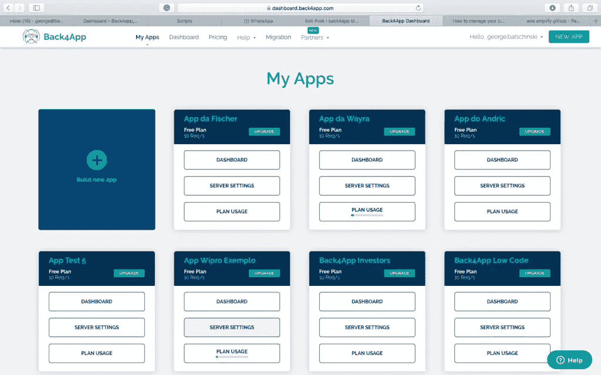
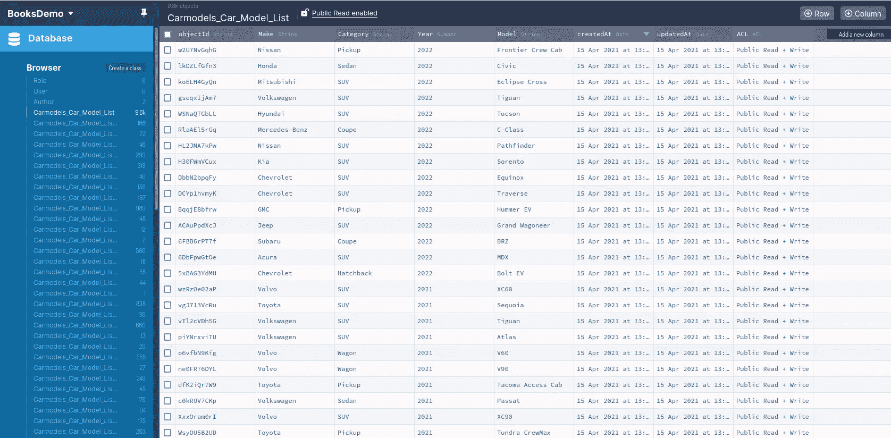
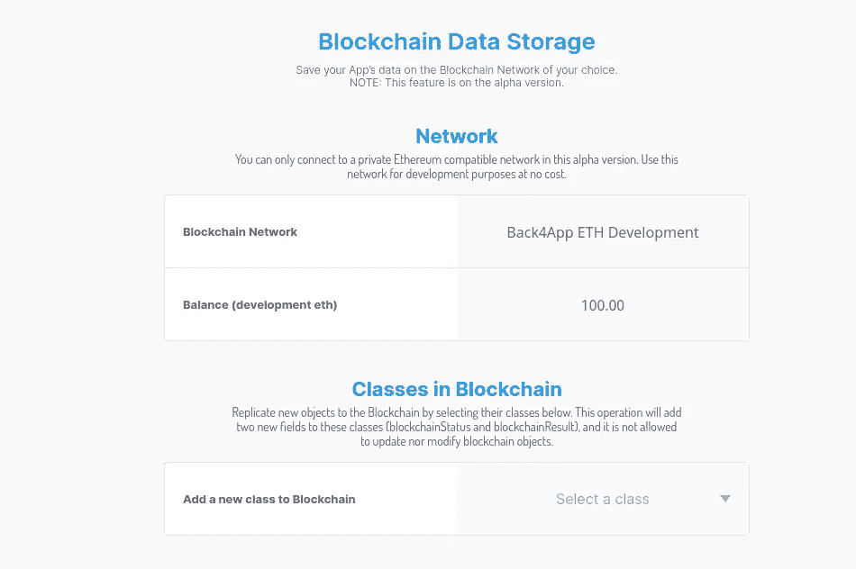
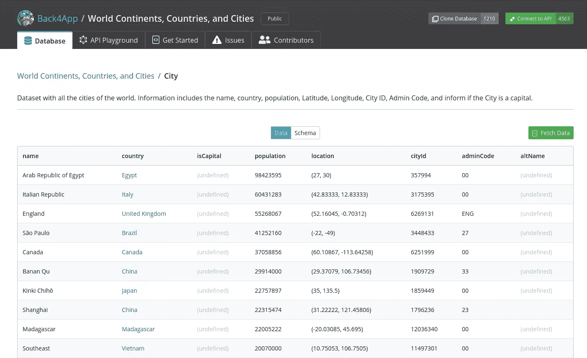
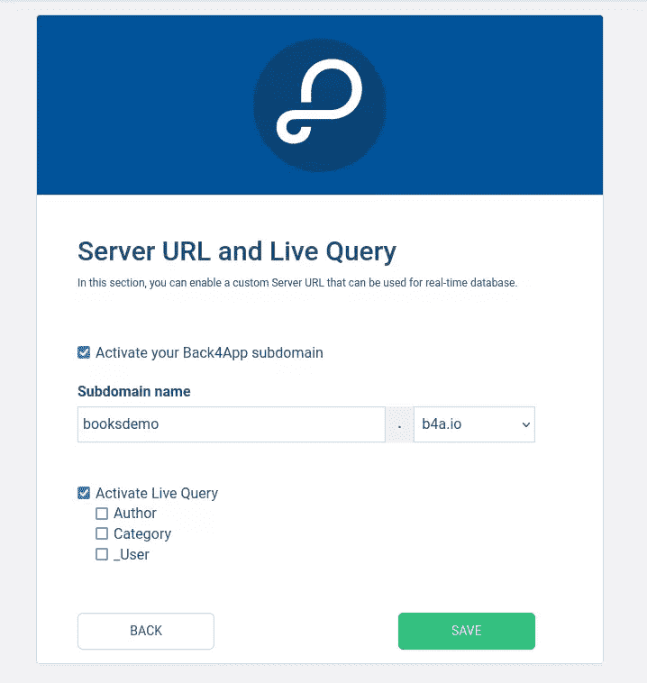
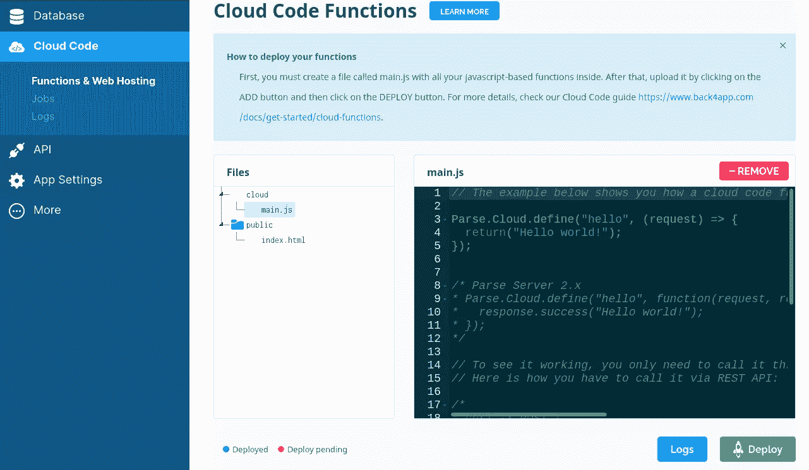
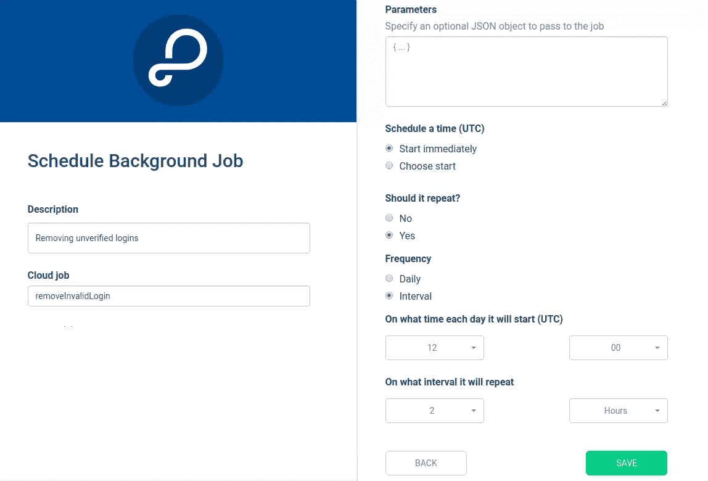
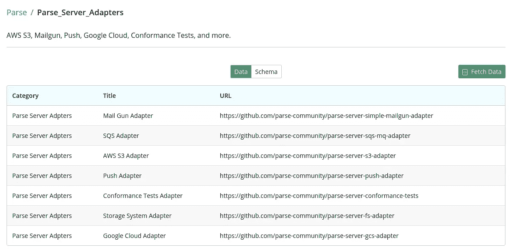
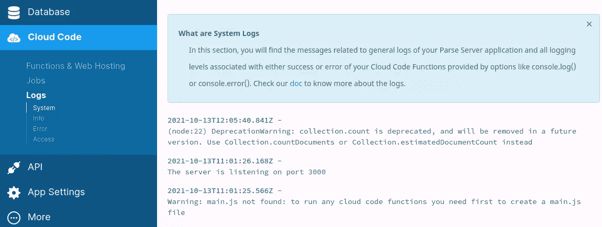

# Back4App 上解析平台的初学者指南

> 原文：<https://www.sitepoint.com/parse-platform-back4app-beginner-guide/>

最近，随着无代码平台的兴起，软件开发者的未来似乎很黯淡。幸运的是，现在有一种方法可以让我们更有效率，那就是利用我们现有的技能，使用低代码平台来构建新的应用程序。与无代码平台不同，低代码平台更加灵活，并提供更多可定制的功能。您可以编写自定义代码片段并安装 Node.js 包，为您的应用程序提供更多高级功能。

在本文中，我将对 [Back4App](https://www.back4app.com/) 进行高度概述，这是一个为开发人员托管解析应用程序的**后端即服务(BaaS)** 平台。BaaS 平台允许开发人员以最小的努力快速开发和启动新的后端应用程序。它们还消除了设置托管和配置自动缩放的需要，这对于开发人员来说是一项耗时的任务。

## 什么是解析平台

[Parse platform](https://parseplatform.org/) 是一个流行的开源框架，用于构建应用程序后端。它运行在 Node.js 上，并被编写为与 Express.js 一起工作。简单地说，它就像一个开源版本的 Firebase，可以在您的机器上运行，并在您自己的服务器上运行。

该项目的起源可以追溯到 2011 年，当时 **Parse Inc** 成立，为移动开发者提供后端工具。这家初创公司筹集了 550 万美元的风险投资资金，这使它在一年内将其用户群增长到了 2 万名开发者。

该公司非常成功，两年后被脸书以 8500 万美元收购。到 2014 年，该平台托管了大约 50 万个移动应用。不幸的是，脸书[未能投资](https://venturebeat.com/2016/02/03/facebook-never-wanted-to-host-your-app-the-real-reasons-it-shut-down-parse/)开发该平台，并决定在 2017 年 1 月关闭该服务。为了帮助其客户，脸书开源了 Parse 平台，以便允许开发人员将其应用程序迁移到他们自己的自托管 Parse 服务器上。

从那时起，开源社区就一直致力于这个项目，并建立了一个网站、在线文档和社区论坛。今天，Parse 提供了许多后端特性，包括:

*   数据库管理
*   文件对象存储
*   REST 和 GraphQL APIs
*   证明
*   用户权限
*   实时查询(实时数据)
*   推送通知
*   云函数
*   云作业

解析平台主要由以下部分组成:

*   [解析服务器](https://github.com/parse-community/parse-server):构建后端 app 的无头服务器。
*   [解析 Dashboard](https://github.com/parse-community/parse-dashboard) :用 React 搭建的前端用户界面。
*   [解析服务器模块](https://github.com/parse-server-modules):扩展解析服务器特性的模块和适配器的集合。例如，您可以安装一个适配器来利用 Firebase 的认证服务。
*   [客户端 SDK](https://parseplatform.org/#sdks):连接前端 app 到解析服务器的语言库。这些库包括 JavaScript、Android、Objective C、Flutter、Unity 等等。

注意，有几个解析项目我在这里没有提到。比如有 Android 和 IOS 的 app 提供 Parse server 的前端接口。

## Mongo vs PostgreSQL

Parse server 目前支持 Mongo 和 PostgreSQL 数据库，它们分别是 NoSQL 和 SQL 领域的领先数据库。两个数据库能力都相当，很难选择用哪个。

本[详细指南](https://www.mongodb.com/compare/mongodb-postgresql)可能有所帮助。在我看来，如果你是初学者，MongoDB 是更好的选择，因为它更灵活，学习曲线也更浅。如果您是一名经验丰富的 SQL 开发人员，使用 PostgreSQL 会更有成效。下面是每个数据库的快速比较。

### 蒙戈

**优点**:

*   灵活的模式:最适合需求不完全清楚的新项目
*   横向可扩展:可以轻松服务数百万用户
*   支持实时数据更新和读取；非常适合分析应用
*   分片:可以轻松处理海量数据集

**缺点**:

*   缺少[参照完整性](https://database.guide/what-is-referential-integrity/)

以前的问题如 ACID 遵从性和连接现在在 MongoDB 的最新版本中得到官方支持。

### 一种数据库系统

**优点**:

*   刚性模式:最适合具有已知需求和严格数据完整性的项目
*   参照完整性/外键约束支持:定义表关系的要求
*   对 ACID 事务的现成支持
*   使用 SQL，这是访问和操作数据的最佳查询语言

**缺点**:

*   更长的学习曲线
*   只能垂直缩放；水平缩放是可能的，但并不容易

如果您仍然不知道使用哪一个，幸运的是 Back4App 为您提供了答案。

## Back4App

Back4App 是一家 cackend-as-a-service 公司，以合理的价格为开发者托管解析服务器应用。它极大地简化了 Parse 应用程序的开发。你所需要做的就是[注册](https://www.back4app.com/)一个免费层账户(无需信用卡),开始使用 250MB 的数据存储和 25k 的请求。

付费计划提供更大的资源配额和更多功能，如备份、数据恢复、CDN、自动扩展和高请求性能。仅免费计划仅推荐用于学习，而付费计划每秒能够处理数千个请求。请参见[完整定价页面](https://www.back4app.com/compare-all-plans)了解更多详情。

### 多租户仪表板

Back4App 允许你在同一个仪表盘上创建和管理多个 Parse 应用。与自己手动安装、配置和托管每个解析服务器相比，这可以节省大量时间。区别在于分钟和小时。



### 数据库浏览器

Back4App 使用 Mongo 作为数据库。但是，它的行为就像在运行 PostgreSQL 一样。这很好，因为您在使用非 SQL 数据库的同时获得了 SQL 数据库的优势——比如参照完整性、外键约束和模式验证。这个实现是在代码中完成的，并且在数据库和仪表板之间运行。

数据库浏览器将表(集合)组织为类，数据以电子表格的格式显示。您可以添加/编辑/删除/重新排序列，指定数据类型，以及导入/导出 CSV 或 JSON 格式的数据。



电子表格界面允许您轻松地创建和编辑数据行。您还可以将图像或 pdf 等二进制文件上传到具有文件数据类型的列中。这是另一个巨大的时间节省，因为您不需要配置文件存储服务来处理二进制数据。使用 Parse，它已经是内置的，并且可以配置为支持外部文件存储服务。

### 证明

Parse 提供了内置的电子邮件/密码认证服务。用户和角色存储在数据库中，可以通过数据库浏览器查看和创建。也可以通过 SDK、REST 或 GraphQL API 端点以编程方式创建用户。

下面是一个使用 Parse JavaScript SDK 在前端实现的注册功能的示例:

```
function signUp() {
  let user = new Parse.User();
  user.set("username", "alex");
  user.set("password", "abc123");
  user.set("email", "a@abcd.com");
  try {
    user.signUp(); // Everything worked and the user signed in
  } catch (error) {
    alert("Error: " + error.code + " " + error.message); // Oops.. something wrong happened
  }
} 
```

Back4App 允许开发者为他们的解析应用启用[电子邮件验证](https://www.back4app.com/docs/platform/parse-email-verification)和[密码恢复](https://www.back4app.com/docs/react/working-with-users/react-password-reset)功能。这些是用户在使用任何安全应用程序时所期望的基本帐户管理功能。

除了默认的身份验证方法，您还可以使用以下任何登录方法来启用您的 Parse 应用程序进行身份验证:

*   苹果
*   脸谱网
*   开源代码库
*   谷歌
*   推特
*   商务化人际关系网
*   还有更多

### 批准

授权决定了通过身份验证的用户是否有权访问存储在数据库中的信息。使用**角色**和**访问控制**来定义权限。有两种级别的访问控制:

*   **类级权限(CLP)** :这种类型的权限保护一个类(表)中的所有数据。您可以使用 CLP 为每个角色定义不同的读写策略。
*   **对象级访问控制**:这种类型的权限保护单个行。这允许一个用户的数据与同一个类(表)中的另一个用户保持分离。Parse 还支持使用会话为匿名用户分离数据。

Parse 使用**访问控制列表(ACL)** 来保护私有数据不被公开访问。但是，如果用户有一些数据需要公开共享，则需要创建第二个 ACL 来授予公共访问权限。请注意，类级别的权限将总是覆盖 ACL 权限。

### 区块链数据库

这是一项新功能，允许在私人以太坊区块链网络中存储数据。区块链与传统数据库的不同之处在于，一旦记录被插入和验证，它们就不能被更新或删除。这有许多实际的实现，其中各方之间的信任在商业交易中是至关重要的。



在撰写本文时，这个[特性](https://www.back4app.com/docs/get-started/blockchain-data-storage)仍处于 alpha 阶段。

### 公共数据集

通常，在构建用户界面时，您需要用国家、城市、邮政编码、车辆型号、颜色等数据填充某些输入元素。Back4App 通过提供[数据库中枢](https://www.back4app.com/database)解决了这个问题，这是一个公共数据库列表，你可以自由访问并为你的应用使用。

下图是世界上所有城市的数据集示例:



访问公共数据库有三种方式:

*   你可以**连接**一个公共数据库到你的应用程序。一旦连接成功，您就可以通过 REST 或 GraphQL 通过您的应用程序查询数据库。此方法允许您的应用程序接收对模式和数据的任何新更新。
*   你可以在一个新的应用程序中把公共数据库克隆到你的仪表盘上。
*   你可以**导出**一个公共数据库成 CSV 或者 JSON 格式，然后导入你的 app。

最后两种方法允许您随意修改公共数据集。

### 实时查询

当构建实时应用程序时，您可能被迫每隔一秒钟左右获取新数据，以便检查是否有任何新的更新。这种技术被称为**轮询**，它是有问题的，因为它会导致高网络和服务器使用率。想象一下，如果你的应用被成千上万的用户使用。

Parse 有一个名为 [**LiveQuery**](https://github.com/parse-community/parse-server/wiki/Parse-LiveQuery-Protocol-Specification) 的内置协议，允许客户端订阅/取消订阅 LiveQuery 服务器。当相关数据更新后，LiveQuery 服务器会将新数据推送到所有订阅了该数据的客户端。

使用 Back4App，[激活【Live Query 服务器就像进入你的 App 的**服务器设置** > **服务器 URL 和 Live Query** 并激活它一样简单。](https://www.back4app.com/docs/platform/parse-server-live-query-example)



### 云代码功能

对于前端密集型应用程序，大量数据操作都是在客户端设备上完成的。这通常需要发送大量数据，以便前端代码可以处理并使用这些数据来显示信息摘要。终端用户在使用你的应用时可能会感觉迟钝。

Parse 提供了一个名为[云代码函数](https://docs.parseplatform.org/cloudcode/guide/#cloud-functions)的内置特性，允许所有繁重的数据提升在服务器本身上执行。例如，如果您想要特定产品在去年的平均销售额，您只需在服务器环境中检索所有必要的数据，执行计算，然后将值发送到前端客户端。

在服务器上执行这样的操作更快、更有效，并将为最终用户带来更流畅的体验。Parse 的云功能的另一个好处是，它运行在一个完整的 Node.js 环境中，不像 AWS Lambda 和 Cloudflare Workers。这意味着您可以安装任何想要的 Node.js 包，而不必求助于变通办法。



以下是在 Parse Server 应用上运行的[云代码函数](https://www.back4app.com/docs/get-started/cloud-functions)的示例:

```
// This is a hello function and will log a message on the console
Parse.Cloud.define("hello", async (request) => {
  console.log("Hello from Cloud Code!");
  return "Hello from Cloud Code!";
});

// This sumNumbers function accepts JSON parameters via the request object.
Parse.Cloud.define("sumNumbers", async (request) => {
  return request.params.num1 + request.params.num2;
}); 
```

以下是如何从前端应用程序调用云函数:

```
const helloResult = await Parse.Cloud.run("hello");

const params = { num1: 3, num2: 4 };
const sumResult = await Parse.Cloud.run("sumNumbers", params); 
```

您还可以使用云代码功能实现高级功能，例如使用 [Twilio](https://www.twilio.com/) API 向任何手机发送短信:

```
Parse.Cloud.define("SendSMS", async (request) => {
  // Requiring the values to send
  let getMessage = request.params.message,
    getPhoneTo = "+Target test Phone number",
    getPhoneFrom = "+Your first Phone number",
    accountSid = "AccountSID",
    authToken = "AuthToken";

  // require the Twilio module and create a REST client
  let client = require("twilio")(accountSid, authToken);

  return await client.messages.create({
    body: getMessage, // Any number Twilio can deliver to
    from: getPhoneFrom, // A number you bought from Twilio and can use for outbound communication
    to: getPhoneTo, // body of the SMS message
  });
}); 
```

您可以在 Parse Server 应用程序中实现的云功能的其他高级示例包括通过 [Stripe](https://stripe.com/) API 接受信用卡支付，以及通过 [SendGrid](https://sendgrid.com/) API 发送电子邮件。

### 扳机

[触发器](https://docs.parseplatform.org/cloudcode/guide/#save-triggers)是云函数，允许你实现定制逻辑，比如事件前后的格式化或验证。看看下面的验证代码示例:

```
Parse.Cloud.beforeSave("Review", (request) => {
// do any additional beforeSave logic here
},{
  fields: {
    stars : {
      required:true,
      options: stars => {
        return stars >= 1 && stars =< 5;
      },
      error: 'Your review must be between one and five stars'
    }
  }
}); 
```

在上面的例子中，验证码确保用户在评论中不能给出少于一星或多于五星的评分。否则，客户端将收到一个错误。Parse 目前支持以下类型的触发器:

*   **保存触发器**:用于强制执行特定的数据格式
*   **删除触发器**:用于执行删除策略
*   **查找触发器**:用于转换数据
*   **会话触发器**:用于阻止被禁止的用户或跟踪登录事件
*   **LiveQuery 触发器**:用于实施限制

使用云代码，您可以确保您支持的所有客户端应用程序(如 web、Android、iOS 等)具有相同的行为。

### 云作业和调度

[云工作](https://docs.parseplatform.org/cloudcode/guide/#cloud-jobs)是简单的长时间运行的功能，你不期望得到响应。示例包括批量处理大量图像，或网络抓取。您还可以使用云作业来执行任务，例如删除尚未验证其电子邮件的非活动用户。

请注意，解析服务器不提供计划。幸运的是，Back4App 做到了——通过一个被称为 [Cron 作业](https://www.back4app.com/docs/platform/parse-cron-job)的特性。您只需按照以下格式编写一个云函数:

```
Parse.Cloud.job("jobName", async (request) => {
  // write your code here
  return "job results";
}); 
```

接下来，将 cron 作业代码上传到您的应用程序，然后使用**后台作业**特性来调度您的代码应该何时运行。



### 模块和适配器

通过安装 [Node.js 包](https://help.back4app.com/hc/en-us/articles/360002038772-How-to-install-an-NPM-module-at-Back4App)和[解析适配器](https://www.back4app.com/database/back4app/parse/parse-server-adapters)，可以进一步扩展解析服务器应用的功能。下图显示了由核心解析社区维护的一些适配器。



适配器只是 Node.js 包，可以通过上传一个`package.json`文件到您的云功能仪表板来安装。一个适配器的例子是 [`parse-server-sqs-mq-adapter`](https://github.com/parse-community/parse-server-sqs-mq-adapter) ，它支持解析服务器应用与亚马逊简单队列服务的集成。

不幸的是，许多社区贡献的适配器和模块已经被否决或没有得到积极维护。因此，您可能需要使用官方支持的 npm 包并编写自定义代码，以便通过使用最新的依赖项来确保您的代码是安全的。

### 服务器日志

如果您在云代码中使用任何`console.log`或`console.error`函数，它们将显示在**云代码** > **日志**仪表盘中，如下图所示。



可以按以下类别查看日志:

*   系统
*   信息
*   错误
*   接近

事件记录是运行生产应用程序的一个重要方面，因为它可以帮助您理解请求并发现代码中的错误。

### 分析学

Back4App 提供了[分析](https://www.back4app.com/docs/parse-dashboard/analytics/mobile-app-analytics)报告工具——这是一个额外的特性，因为开源解析服务器只支持数据捕获，而不支持报告。Back4App 的分析报告工具有助于提供关于您的应用的实时信息，如增长、转化、性能和[使用行为](https://www.back4app.com/docs/parse-dashboard/analytics/mobile-app-event-tracking)。

该工具附带一组预定义的跟踪报告，包括:

*   观众报告
*   事件报告
*   绩效报告
*   慢速请求报告

下图显示了性能报告的示例。


您还可以定义自己的**自定义事件报告**，这将允许您通过 Parse SDK 跟踪任何事件。参见以下通过 Parse SDK 在客户端实现的示例代码:

```
let dimensions = {
  // Define ranges to bucket data points into meaningful segments
  service: "haircut",
  professional: "John",
};
// Send the dimensions to Parse along with the event
Parse.Analytics.track("myEventName", dimensions); 
```

上面的代码捕获数据并将其发送到解析服务器。以后可以查询这些数据并使用它们来构建自定义事件报告。

### 前端 SDK 库

Parse 通过其 [SDK 库](https://parseplatform.org/#sdks)支持每一个主要的前端框架和语言，包括:

*   Java Script 语言
*   安卓，扑
*   监督办:目标 C，Swift
*   。网
*   服务器端编程语言（Professional Hypertext Preprocessor 的缩写）
*   一致

不支持的编程语言可以使用 [REST](https://docs.parseplatform.org/rest/guide/) 和[graph QL](https://docs.parseplatform.org/graphql/guide/)API 与解析服务器上的数据进行交互。要在浏览器环境中使用[解析 JavaScript SDK](https://docs.parseplatform.org/js/guide/) ，您需要安装下面的 [npm 库](https://www.npmjs.com/package/parse):

```
npm install parse 
```

然后像这样导入它:

```
const Parse = require("parse");
// ES6 Minimized
import Parse from "parse/dist/parse.min.js"; 
```

该库通过向开发人员提供一组他们可以执行的函数，直接与解析服务器进行交互。这些功能可以处理如下操作:

*   用户注册、登录和会话处理
*   CRUD 操作和高级查询
*   使用实时查询订阅实时数据
*   文件管理:上传、下载、删除等。
*   计算地理点
*   接收推送通知
*   跟踪自定义分析

下面是在 JavaScript 中使用 Parse SDK 的 CRUD 操作示例:

```
//Initialize Parse
Parse.initialize("YOUR_APP_ID_HERE", "YOUR_JAVASCRIPT_KEY_HERE");
Parse.serverURL = "https://parseapi.back4app.com/";

// Saving new data object
async function saveNewPerson() {
  const person = new Parse.Object("Person");

  person.set("name", "John Snow");
  person.set("age", 27);
  try {
    console.log("New Person created with id:" + result.id);
  } catch (error) {
    console.log(error.message);
  }
}

// Querying a single data object
async function retrievePerson() {
  const query = new Parse.Query("Person");

  try {
    const person = await query.get("mhPFDl");
    const name = person.get("name");
    const age = person.get("age");

    console.log(`Name: ${name} age: ${age}`);
  } catch (error) {
    console.log(error.message);
  }
} 
```

## 摘要

大多数低代码和无代码平台允许您在没有编码经验的情况下非常快速地构建特定的解决方案。不幸的是，这些平台经常把你锁在里面，而且功能有限。幸运的是，Parse 和 Back4App 为有经验的开发人员提供了他们需要的所有定制，以及与任何云提供商托管的自由。

Back4App 提供的一些尚未提及的附加功能包括:

*   [GDPR 顺从计划](https://www.back4app.com/product/parse-gdpr)
*   自动备份
*   全天候客户支持
*   内容交付网络
*   可扩展的基础设施

最后，我把这个问题留给你。您希望如何构建下一个后端应用程序？

*   **选项 A:** 使用 Express 这样的 Node.js 框架
*   **选项 B:** 使用像 Back4App 这样的 BaaS 平台

## 分享这篇文章