# 使用 Netlify 表单向 React 应用程序添加联系人表单

> 原文：<https://www.sitepoint.com/react-app-contact-form-netlify-forms/>

在本教程中，您将学习如何使用 Netlify 表单向 React 应用程序添加联系人表单。

向 React 应用程序添加联系人表单可能需要编写服务器端代码来处理表单提交，但是使用 Netlify 表单，您可以脱离逻辑，因为当您的站点部署在 [Netlify](https://www.netlify.com/products/forms/) 上时，它会为您完成所有的幕后工作。

## 先决条件

要跟随本教程，您应该熟悉 React、Git 和 GitHub。您还应该有一个 Netlify 帐户，并在计算机上安装了 Node。如果你在设置上需要任何帮助，你可以参考我们关于如何使用 nvm 安装节点的指南。

## 你会学到什么

本教程结束时，您将知道如何执行以下操作:

*   将 React 应用程序部署到 Netlify
*   将网络表单与无状态表单组件(不使用状态的表单组件)集成
*   将网络表单与有状态表单组件(使用状态处理其数据的表单组件)集成

本教程的完整指南可在 [GitHub](https://github.com/sitepoint-editors/NetlifyForms) 上获得。

## 网络表单简介

Netlify Forms 是 Netlify 的一个特性，用于管理和处理表单提交，而无需编写任何服务器端代码。通过在 HTML 表单标签中添加一个简单的属性，您就可以使用 Netlify 表单了。表单也可以用 JavaScript 异步提交，这使它成为 Vue、React 和其他现代框架支持的站点的好伙伴。

## 网络表单定价

Netlify Forms 是免费的，但每个网站每月提交的免费表格数量限制为 100 个，而且在使用免费层时，一些功能(如后台功能和基于角色的访问控制)也被排除在外。

要超过表单提交限制或使排除的功能可用，您必须升级到不同的计划。您可以在[网上定价页面](https://www.netlify.com/pricing/)上完成。

## 为网络表单创建表单

网络表单可以与无状态表单(不使用状态处理数据的表单)和有状态表单(使用状态处理数据的表单)集成。在本教程中，我们将首先创建一个无状态表单来演示如何将 Netlify 表单与它集成。但是稍后，我们将把无状态表单重构为有状态表单，其中我们还将集成有状态表单。

让我们从创建和设置一个新的 React 应用程序开始。

### 创建并设置 React

在终端中键入以下命令，创建一个新的 React 应用程序:

```
$ npx create-react-app netlify_forms_app 
```

在这里，我们的应用程序的名称是`netlify_forms_app`，但你可以给它任何你想要的名称，只要它不是一个受限制的 npm 名称。安装完成后，进入新创建的目录，然后在终端中用`npm start`命令启动应用程序。

让我们稍微清理一下(可选)我们的应用程序。在 app 的`src`目录中，删除以下文件:

*   `App.test.js`
*   `logo.svg`
*   `setupTests.js`

我们删除了这些文件，因为它们与我们的构建无关。我们也可以删除`reportWebVitals`文件。这样做需要我们从`index.js`文件中删除导入语句和函数调用`reportWebVitals`，这样 React 应用程序才能成功编译。同样，这都是可选的，所以如果您愿意，可以跳过这一步。

现在，清理`App.js`文件，使其看起来像这样:

```
// src/App.js
import './App.css';

function App() {
  return (

  );
}

export default App; 
```

### 创建联系人表单组件

在 React 应用程序的`src`目录中，创建一个`Form.js`文件，并向其中添加以下代码行:

```
// src/Form.js
import './form.css'

export default function Form() {
  return (
    <form 
      method='POST' 
      name='contactform' 
      className='contactForm'>

      <input 
        type='text' 
        name='name' 
        placeholder='Enter your name' />

      <input 
        type='email' 
        name='email' 
        placeholder='Enter your email' />

      <textarea 
        name='message' 
        placeholder='Messaage'></textarea>

      <button type='submit'>Submit</button>

    </form>
  )
} 
```

这里，我们有一个无状态的 React 表单。现在，转到`src`目录中的`App.js`文件并呈现表单。`App.js`文件应该是这样的:

```
import './App.css';
import Form from './Form'

function App() {
  return (
    <Form />
  );
}
export default App; 
```

### 用普通 CSS 设计表单组件的样式

在`src`目录中，创建一个`form.css`文件，并添加以下样式:

```
// src/form.css
.contactForm{
  padding: 10px;
  width: 90%;
  max-width: 400px;
  margin: 30px auto;
  border-radius: 10px;
  display: flex;
  flex-direction: column;
  gap: 20px;
}
.contactForm input, button, textarea{
  height: 50px;
  padding-left: 5px;
  font-size: 18px;
}
.contactForm textarea{
  height: 100px;
} 
```

没有必要编写任何花哨的 CSS，但如果您愿意，可以添加一些调整。有了我们添加的样式，我们的 HTML 表单现在看起来像下图。

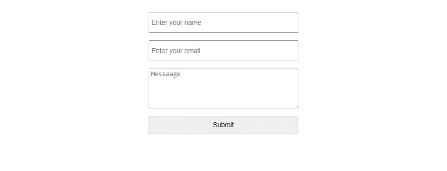

要查看结果，您需要切换到`netlify_forms_app`文件夹并启动服务器:

```
cd netlify_forms_app
npm start 
```

浏览器将会打开，您可以在 [http://localhost:3000](http://localhost:3000) 查看结果。

## 无状态 React 联系人表单的表单处理

无状态 React 表单的一个完美例子是我们前面创建的那个。在这种形式下，我们的输入值不受国家控制。在本节中，我们将学习如何使用 Netlify 表单向无状态 React 应用程序添加联系人表单。

### 添加表单的静态 HTML 版本

使我们的表单能够与 Netlify 表单一起工作的第一步是将表单的静态 HTML 版本添加到 React 应用程序的`public`目录中的`index.html`文件中。为什么我们需要添加这个表单？添加这个 HTML 表单将帮助 Netlify 检测我们的 JSX 表单，因为后处理机器人只能解析 HTML。

对于这个例子，我们将在打开我们的`index.html`文件中的`<body>`标签之后添加这个 HTML 表单:

```
<!-- public/index.html -->
<form name='contactForm' netlify hidden>
  <input type='text' name='name' />
  <input type='email' name='email' />
  <textarea name='message'></textarea>
</form> 
```

这个表单中有两个属性需要注意:`name`和`netlify`。`name`属性将使 Netlify 能够连接我们的 JSX 表单，而`netlify`属性将使 Nelify 的 bot 能够解析我们的表单。我们还使用了`hidden`属性对用户隐藏表单。没有必要给这个表单添加标签或提交按钮，因为它对我们的站点是隐藏的。

### 向 JSX 窗体添加一个隐藏的输入元素

在`src`目录下的`Form.js`文件中，添加一个隐藏的 input 元素，它的`name`属性被设置为`form-name`，而`value`属性等于我们表单的 HTML 版本的名称。这些属性是使我们的表单与网络表单一起工作所必需的:

```
// src/Form.js
<input 
  type='hidden' 
  name='form-name'
  value='contactForm' /> 
```

我们表单的最终版本现在看起来像这样:

```
// src/Form.js
<form 
  method='POST' 
  name='contactform' 
  className='contactForm'>

  <input 
    type='hidden'
    name='form-name'
    value='contactForm' />

  <input 
    type='text' 
    name='name' 
    placeholder='Enter your name' />

  <input 
    type='email' 
    name='email' 
    placeholder='Enter your email' />

  <textarea 
    name='message' 
    placeholder='Messaage'></textarea>

  <button type='submit'>Submit</button>
</form> 
```

要使这个表单开始工作，还需要一个步骤:将我们的 React 应用程序部署到 Netlify。我们将在下一节讨论这个问题。

## 部署到网络

我们可以使用像 [GitHub](http://github.com/) 这样的版本控制系统将我们的站点部署到 Netlify，或者我们可以使用拖放方法，这需要我们将通过运行`npm run build`命令创建的`build`文件传输到 Netlify [拖放页面](https://app.netlify.com/drop)。这两种部署方法都将在下面的章节中讨论，但是对于本教程，我们将使用 GitHub 进行部署。

### 使用 GitHub 部署

从 GitHub 部署我们的 React 应用程序将为我们设置持续部署，这意味着对我们的存储库所做的更改将自动触发我们站点的重新部署，这是使用拖放方法的一个优势。

为了能够从 GitHub 部署，我们必须首先让 React 应用程序在其上可用。转到 GitHub 并[创建一个新的存储库](https://github.com/new)。

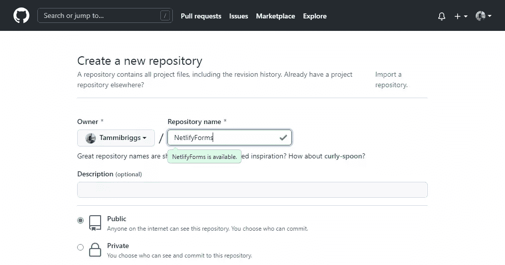

对于本教程，我们将存储库命名为“NelifyForms”。现在，在页面底部，单击**创建存储库**按钮，我们将被重定向到新创建的存储库页面。

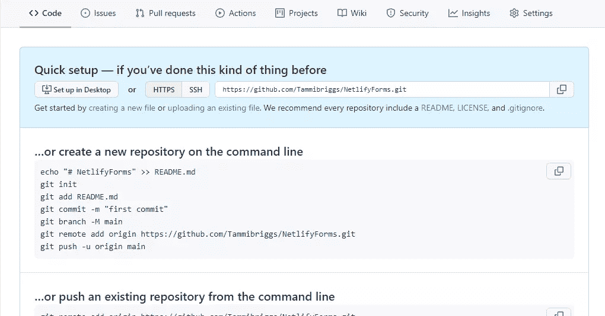

现在，这个库是空的。那是因为我们还没有把我们的 React 应用推向它。为此，请在终端中输入以下命令:

```
$ git add *
$ git commit -m 'netlify forms with stateless form'
$ git remote add origin <Your_repoistory's_url>
$ git push -u origin master 
```

这些命令将创建一个新的提交，将我们连接到我们的 GitHub 存储库，并最终将我们的 React 应用程序推送到它上面。

确保将替换为新创建的 GitHub 资源库的 URL。下图显示了在哪里可以找到新创建的存储库的 URL。

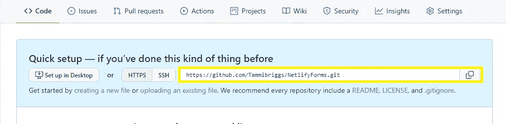

运行以上`git`命令后，刷新浏览器。你会发现我们的 React app 已经推送到 GitHub 了。

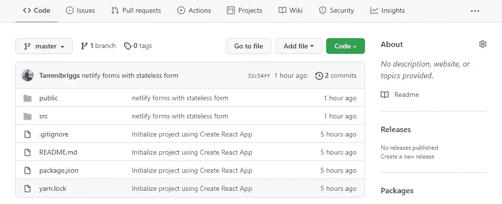

现在我们的 React 应用程序已经可以在 GitHub 上使用了，是时候把它部署到 Netlify 上了。[登录](https://app.netlify.com/)你的 Netlify 账户，转到仪表板，点击**Git**按钮的新网站。我们将被带到[创建新站点](https://app.netlify.com/start)页面。

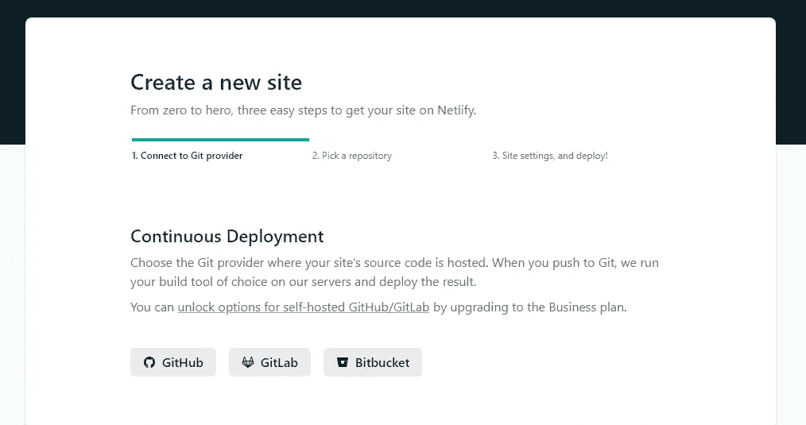

点击**连续部署**部分下的 **GitHub** 按钮。然后我们被重定向到一个授权页面，在那里 Netlify 将请求访问 GitHub。授予 Netlify 访问权限后，我们将看到如下所示的页面。


现在，我们之前创建的 **NetlifyForms** 存储库没有显示在存储库列表中，因为我们还没有配置 Netlify 来访问它。

为此，点击页面底部的**在 GitHub 上配置 Netlify 应用程序**链接。我们将看到如下所示的页面。

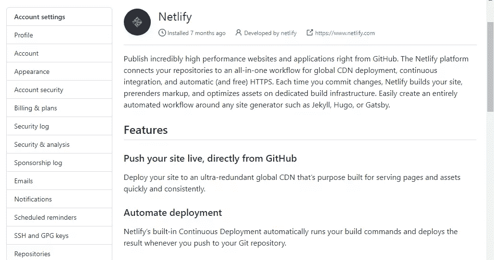

滚动到页面底部的**存储库访问**部分，点击**选择存储库**按钮。我们将看到我们的 GitHub 库列表。

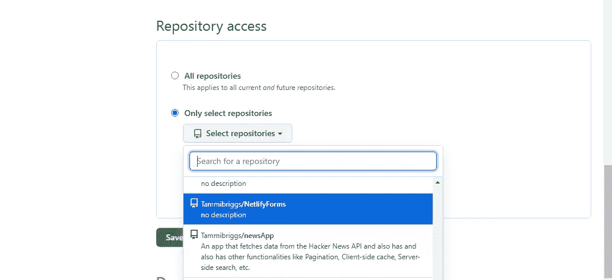

选择**netlifyforms**存储库，然后点击 **save** 以允许 Netlify 访问该存储库。保存后，我们将被重定向到 Netlify 上的创建新站点页面。

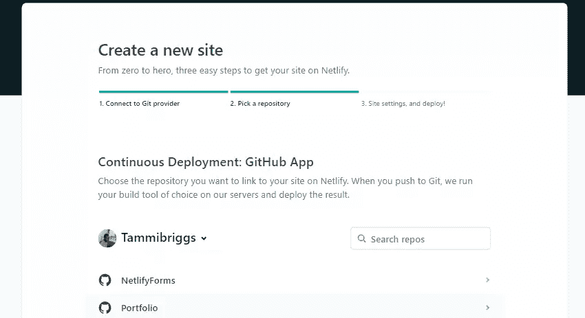

我们的 **NetlifyForms** 存储库现在显示在列表中。点击它，我们会看到这样一个页面。

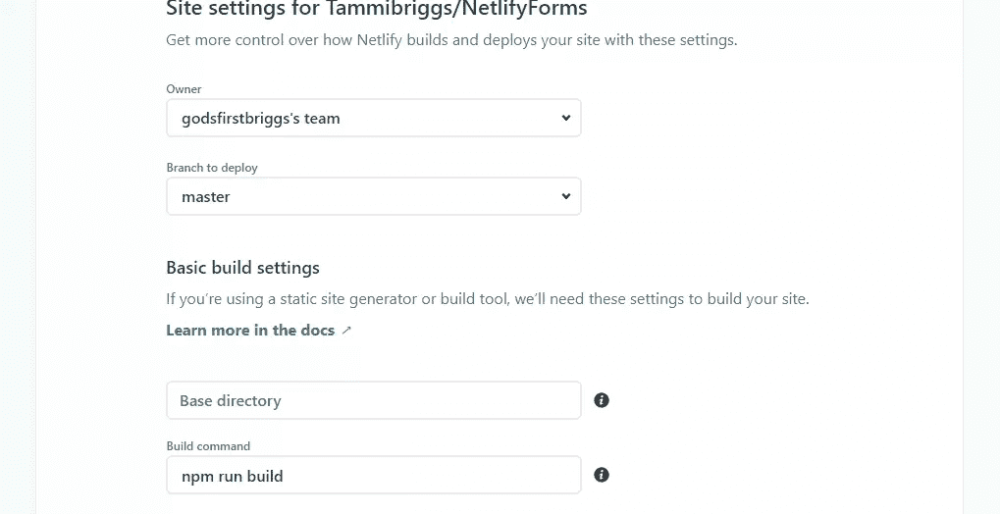

在这个页面上，我们可以为我们的站点设置构建和部署选项，比如更改从哪个 Git 分支进行部署，或者更改用于部署我们的站点的命令。但是没有必要这样做，因为默认情况下一切看起来都很好。

最后，要将我们的站点部署到 Netlify，请滚动到页面底部并单击**部署站点**按钮。部署可能需要一段时间，但一旦完成，我们将在站点仪表板页面的右上角看到一个指向我们站点的链接。

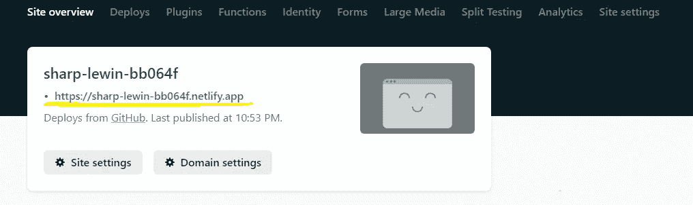

有了这个，我们的 React 应用已经成功地从 GitHub 部署到 Netlify。当我们单击链接时，我们将看到我们构建的 React 表单。


### 使用拖放进行部署

用这种方法部署更简单，但是缺点是我们的站点不会被设置为持续部署。如果我们的 React 应用程序在 GitHub、GitLab 或 Bitbucket 上可用，我们可以在部署后手动设置。

要使用拖放方法，我们必须首先构建我们的 React 应用程序。打开终端，导航到 React 应用程序所在的目录，然后键入以下命令:

```
$ npm run build 
```

一旦构建完成，React 应用程序的根目录中应该会出现一个名为`build`的新文件夹。我们的目录结构现在将如下所示:

```
> build
> node_modules
> public
> src 
```

现在剩下的就是把这个文件夹拖拽到 [Netlify 的拖拽页面](https://app.netlify.com/drop)。

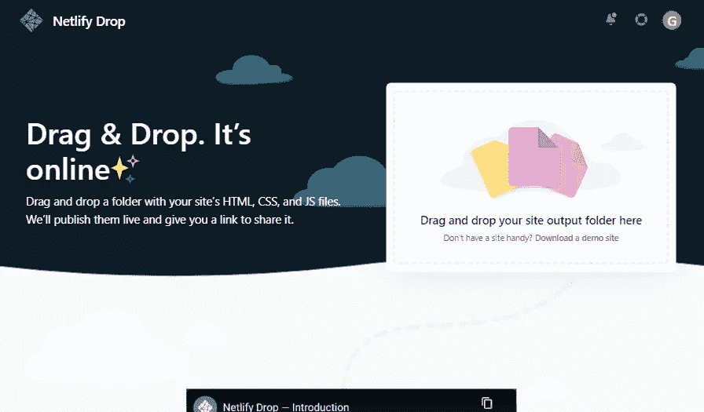

我们可以在系统文件浏览器中导航到 React 应用的位置，然后将`build`文件夹拖放到 [Netlify 的拖放页面](https://app.netlify.com/drop)中。

这里有一张 GIF 图可以说明这一点。

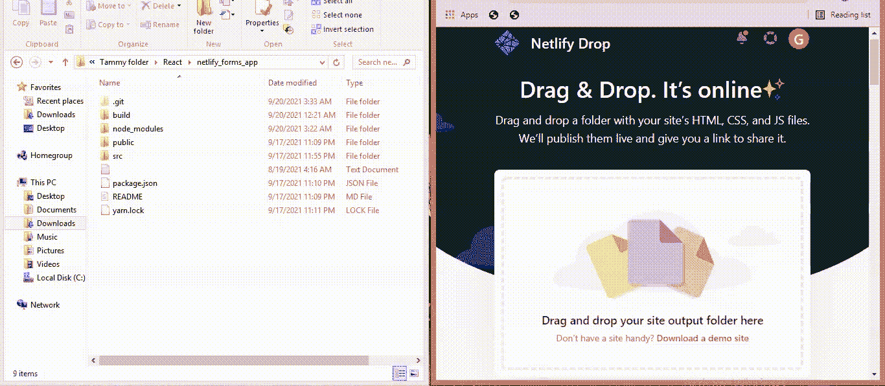

一旦我们将`build`文件夹拖放到 Netlify，它将被上传和部署。然后，我们将被重定向到我们网站的仪表板页面。已部署站点的 URL 位于页面的右上角。

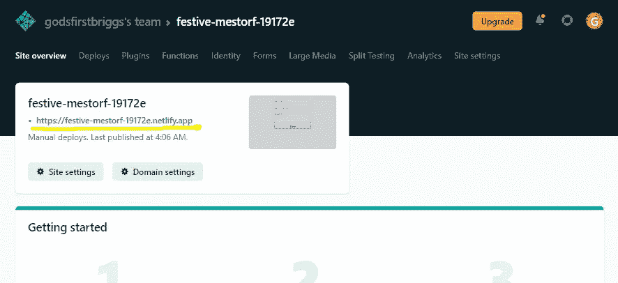

单击该 URL，您将看到我们创建的联系表单。填写表格并点击**提交**按钮。您将被重定向到感谢确认页面。


酷！我们已经成功地让我们的无状态 React 表单与 Netlify 表单一起工作。现在，通过我们的应用程序提交的每个表单都由 Netlify Forms 处理。

目前，当提交新表单时，我们不会收到任何电子邮件通知，因为我们尚未设置提交表单将被发送到的电子邮件地址。我们很快会谈到这一点。

### 管理联系人表单提交

Netlify 不仅使添加联系表单变得简单，而且它还包括通过我们的联系表单提交的内容可以被删除、标记为垃圾邮件或下载的功能。还有将我们的表单与 Netlify 的无服务器功能集成的空间。你可以在这里阅读[。](https://docs.netlify.com/forms/submissions/#form-triggered-functions)

要访问提交管理页面，请转到 Netlify 上先前部署的站点仪表板页面，并单击导航栏中的**表单**链接。

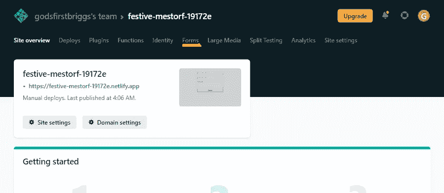

点击**表单**链接后，您将被重定向到表单仪表板页面。

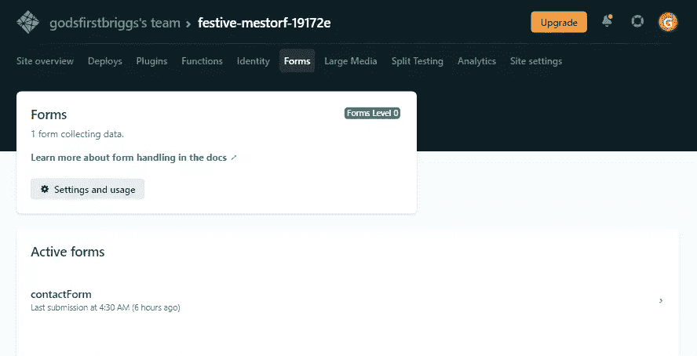

点击**活动表单**部分下的**联系表单**，查看通过我们的联系表单提交的管理页面。

## 添加通知和自定义确认页面

在这一节中，我们将介绍如何添加通知功能，使我们能够接收新表单提交的电子邮件通知。我们还将介绍如何定制在表单成功提交后显示的感谢确认页面。

### 通过电子邮件接收通知

在我们站点的仪表板中，导航到站点**设置** > **表单** > **表单通知**。然后点击**添加通知**按钮。会弹出一个菜单。

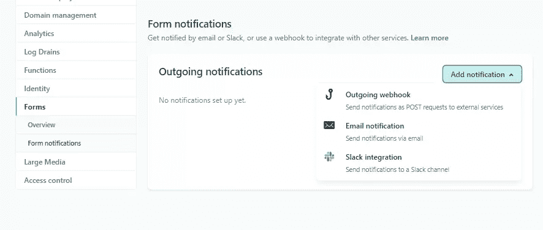

Netlify 为我们提供了三种接收通知的方式。在本教程中，我们将使用电子邮件通知。

点击**电子邮件通知**并填写出现的表格。

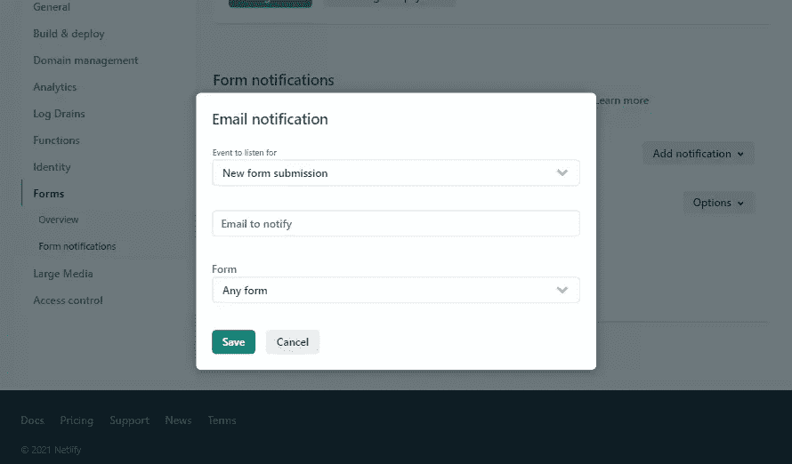

我们更关心的字段是**电子邮件通知**字段。请确保输入您希望接收电子邮件通知的电子邮件地址。

现在，当我们打开已部署的站点 URL 并提交新的表单时，我们应该会收到一封电子邮件通知。

### 自定义确认页面

要定制确认页面，第一步是向`public`目录中的`index.html`文件的`form`元素添加一个`action`属性:

```
// public/index.htmm
<form name="contactForm" netlify action="/confirmation-page" hidden>
... 
```

我们已经将`action`属性设置为等于`/confirmation-page`。这将告诉 Netlify 在提交表单后重定向到此页面。虽然会重定向到确认页面，但 URL 路径不会改变。为了更改 URL 路径，我们还需要将`action`属性添加到`Form.js`文件中的 JSX 表单:

```
// src/Form.js
...
<form 
  method='POST' 
  name='contactform' 
  className='contactForm'
  action='/confirmation-page'>
... 
```

一旦我们完成了这些，下一件事就是创建一个确认页面。

在 React 应用程序的`public`目录中，创建一个`confirmation-page.html`文件并添加以下代码行:

```
<!-- public/confirmation-page.html -->
<!DOCTYPE html>
<html lang="en" >
  <head>
    <meta charset="utf-8">
    <title>confirmation0 page</title>
  </head>
  <body>
    <div style='text-align: center; font-size:1.5rem;'>
      <h2>Thank you</h2>
      <small>You will be replied to shortly</small>
    </div>
  </body>
</html> 
```

为了测试确认页面是否有效，我们必须重新部署我们的站点。我们从 GitHub 部署我们的站点是一件好事。我们现在要做的就是写几个 Git 命令来重新部署它，瞧！我们的站点将自动在 Netlify 上重新部署。

以下是命令:

```
$ git add *
$ git commit -m 'added confirmation page'
$ git push 
```

这些命令创建一个新的提交并修改我们的 GitHub 存储库。由于我们已经将 Netlify 连接到 GitHub 上的`NetlifyForms`存储库，所以当对它进行修改时，Netlify 会立即注意到这个修改并重新部署我们的站点。

一旦我们的网站被重新部署，我们已经提交了新的表单，我们将看到确认页面。


## 有状态 React 表单中的表单处理

在这一节中，我们将学习如何使用基于类的组件和 React 挂钩向具有 Netlify 表单的有状态 React 应用程序添加联系人表单。

我们将使用我们在“用无状态 React 联系人表单处理表单”一节中创建的表单。

*注意:在这一部分，我们不会讨论部署或如何接收电子邮件通知。我们已经在前面的章节中讨论过了。*

### 基于类的组件的表单处理

要使用我们在上一节中创建的表单(为了演示如何将 Netlify 表单与有状态 React 表单一起使用)，我们首先必须将表单从无状态表单更改为有状态表单。

`Form.js`文件应该是这样的:

```
// src/Form.js
import './form.css'
import {Component} from 'react'

export default class Form extends Component{
  constructor(props){
    super(props)
    this.state = { name: '', email: '', message: '' }
  }

  handleChange = e =>
    this.setState({ [e.target.name]: e.target.value })

  render() {
    const { name, email, message } = this.state
    return (
      <form className='contactForm' >

        <input 
          type='text' 
          name='name' 
          value={name}
          placeholder='Enter your name'
          onChange={this.handleChange} />

        <input 
          type='email' 
          name='email' 
          value={email}
          placeholder='Enter your email'
          onChange={this.handleChange} />

        <textarea 
          name='message' 
          placeholder='Messaage'
          value={message}
          onChange={this.handleChange}></textarea>

        <button type='submit'>Submit</button>
      </form>
    )
  }
} 
```

下一步是创建一个负责提交表单的方法。为此，我们必须首先向表单添加一个`onSubmit`事件监听器:

```
// src/Form.js
...
<form 
  className='contactForm' 
  onSubmit={this.handleSubmit}>
... 
```

现在，让我们创建`handleSubmit`方法，它将向 Netlify 表单提交新的表单。

在`Form`组件中的`handleChange`方法后添加以下代码:

```
// src/Form.js
...
handleSubmit = e => {
  fetch('/', {
    method: 'POST',
    headers: { 'Content-Type': 'application/x-www-form-urlencoded' },
    body: encode({ 'form-name': 'contactForm', ...this.state })
  })
    .then(() => alert('Success!'))
    .catch(error => alert(error))
  e.preventDefault()
}
... 
```

注意，在请求体中，我们使用了一个`encode`函数。我们将很快创建它。该功能在过账前对表单中的特殊字符(`?`、`=`、`/`、`&`)进行编码。

最后，在`Form`组件之前添加以下代码行:

```
...
const encode = (data) => {
  return Object.keys(data)
    .map(key => encodeURIComponent(key) + '=' + encodeURIComponent(data[key])).join('&');
}
... 
```

我们的`Form.js`文件现在应该是这样的:

```
// src/Form.js
import './form.css'
import {Component} from 'react'

const encode = (data) => {
  return Object.keys(data)
    .map(key => encodeURIComponent(key) + '=' + encodeURIComponent(data[key])).join('&');
}

export default class Form extends Component{
  constructor(props){
    super(props)
    this.state = { name: '', email: '', message: '' }
  }

  handleChange = e =>
    this.setState({ [e.target.name]: e.target.value })

  handleSubmit = e => {
    fetch('/', {
      method: 'POST',
      headers: { 'Content-Type': 'application/x-www-form-urlencoded' },
      body: encode({ 'form-name': 'contactForm', ...this.state })
    })
      .then(() => alert('Success!'))
      .catch(error => alert(error))
    e.preventDefault()
  }

  render() {
    const { name, email, message } = this.state
    return (
      <form 
        className='contactForm' 
        onSubmit={this.handleSubmit}>
        <input 
          type='text' 
          name='name' 
          value={name}
          placeholder='Enter your name'
          onChange={this.handleChange} />

        <input 
          type='email' 
          name='email' 
          value={email}
          placeholder='Enter your email'
          onChange={this.handleChange} />

        <textarea 
          name='message' 
          placeholder='Messaage'
          value={message}
          onChange={this.handleChange}></textarea>

        <button type='submit'>Submit</button>
      </form>
    )
  }
} 
```

只有在我们为其部署并设置了电子邮件通知后，此表单才能正常工作。这在前面的章节中已经讨论过了。

### 用 React 钩子处理表单

我们将在本节中使用的 React 钩子是`useState`钩子。`useState`钩子将让我们给一个功能组件添加状态。

为了在我们之前创建的`Form`组件中使用`useState`钩子，我们首先需要导入`useState`钩子，然后将基于类的`Form`组件转换成功能组件。

`Form.js`文件应该是这样的:

```
// src/Form.js
import './form.css'
import {useState} from 'react'

const encode = (data) => {
  return Object.keys(data)
    .map(key => encodeURIComponent(key) + '=' + encodeURIComponent(data[key])).join('&');
}

export default function Form (){
  const [state, setState] = useState({name: '', email: '', message: '' })

  const handleChange = e =>
    setState({...state, [e.target.name]: e.target.value })

  const handleSubmit = e => {
    fetch('/', {
      method: 'POST',
      headers: { 'Content-Type': 'application/x-www-form-urlencoded' },
      body: encode({ 'form-name': 'contactForm', ...state })
    })
      .then(() => alert('Success!'))
      .catch(error => alert(error))
    e.preventDefault()
  }

  return (
    <form 
      className='contactForm' 
      onSubmit={handleSubmit}>

      <input 
        type='text' 
        name='name' 
        value={state.name}
        placeholder='Enter your name'
        onChange={handleChange} />

      <input 
        type='email' 
        name='email' 
        value={state.email}
        placeholder='Enter your email'
        onChange={handleChange} />

      <textarea 
        name='message' 
        placeholder='Messaage'
        value={state.message}
        onChange={handleChange}></textarea>
      <button type='submit'>Submit</button>
    </form>
  )
} 
```

现在，为联系人表单部署和设置电子邮件通知，以便开始工作。

## 结论

我希望这个简单的联系方式教程对你有用。我希望你会同意，Netlify 为你的 React 应用程序添加联系人表单提供了一个可行的选择——节省你的时间，让你不必处理服务器端编码。如果您有任何问题，请随时通过 Twitter 联系我们。

### 故障排除提示

如果你在使用 Netlify 中的表单时遇到任何问题，请访问 Netlify 的便捷的[故障排除技巧](https://www.netlify.com/blog/2017/07/20/how-to-integrate-netlifys-form-handling-in-a-react-app/#troubleshooting-tips)。

## 参考

*   "[如何在 React 应用中集成 Netlify 的表单处理功能](https://www.netlify.com/blog/2017/07/20/how-to-integrate-netlifys-form-handling-in-a-react-app/)"
*   [网络生活文档:设置表单](https://docs.netlify.com/forms/setup/)

## 分享这篇文章