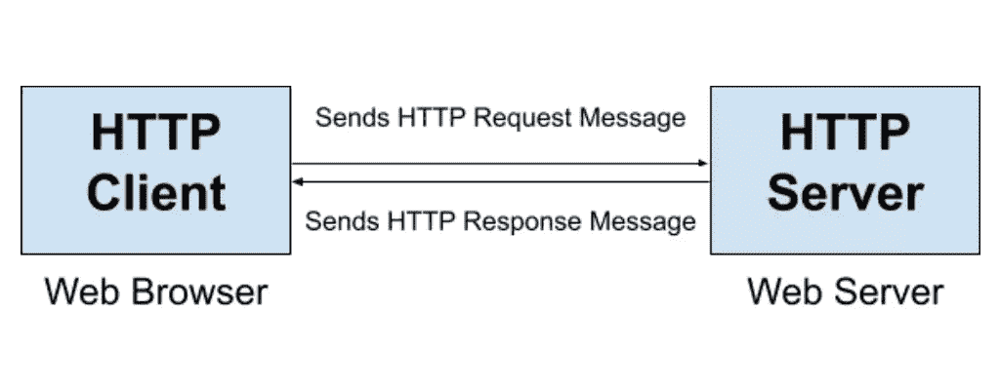
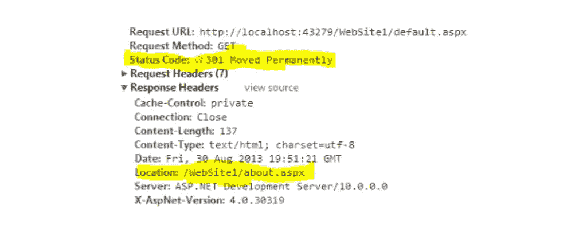
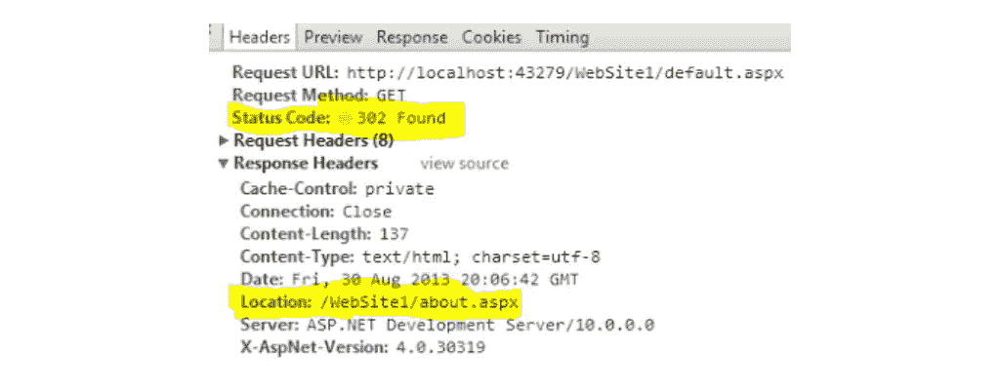
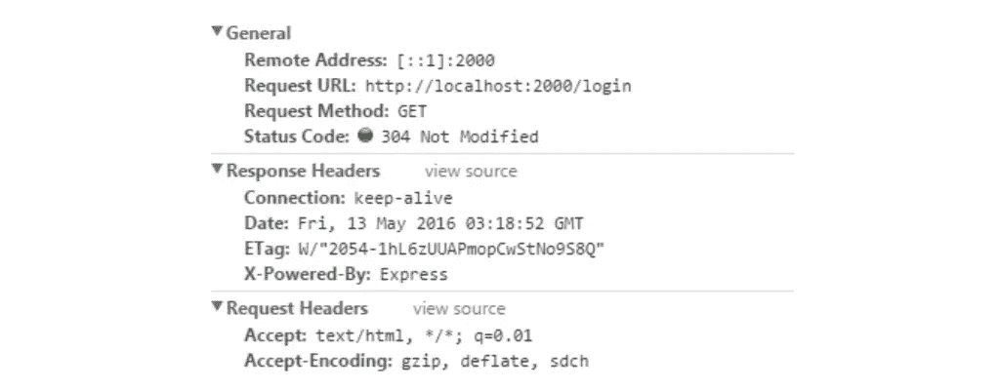
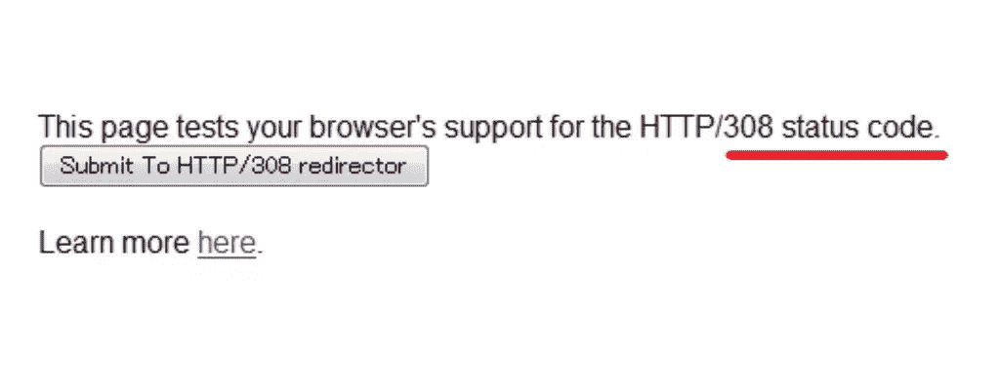
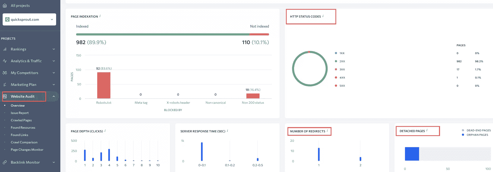
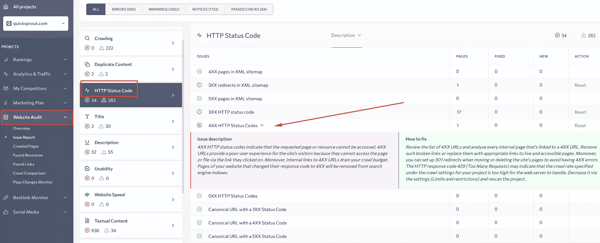

# 3xx HTTP 状态代码的最终指南

> 原文：<https://www.sitepoint.com/3xx-http-status-codes-ultimate-guide/>

如果你管理网站，了解 HTTP 重定向对可靠的网站性能至关重要。在本文中，我们将全面了解 3xx HTTP 状态代码，以便您能够理解它们是如何工作的，如何最好地管理它们，以及它们对 SEO 的影响。

## HTTP 重定向的目的

URL 重定向包括将一个网页地址映射到另一个网页地址。你的网站需要重定向的原因有很多。

例如，移动到一个新的域是使用 URL 重定向的主要原因之一。有时你以前的域名太长太复杂，记不住，或者某种侵权活动迫使你从一个域名转移到另一个域名。

让我们仔细看看重定向您的页面的其他原因:

*   **转发多个域名**:需要永久的 HTTP 重定向，将互联网用户和搜索引擎引导到同一个位置，同时同时拥有多个域名。
*   **识别断开的链接**:使用谷歌搜索控制台可以识别 404 未找到的页面。覆盖报告将为您提供有关所有现场入站链接的详细信息，以便在重定向的帮助下进行修复。
*   **修复断开的网址**:识别断开的链接后，可以将流量重定向到首页。然而，更好的选择是将每个损坏的 URL 重定向到具有相同(相似)内容的新页面。
*   **页面的新位置**:如果你以前的网站有很多在 SERPs 中排名靠前的页面，重定向将帮助你把这个 URL 映射到新位置。对于这种情况，您必须确保用于重定向的旧页面没有消失。
*   **删除页面的需求**:为所有需要删除的页面创建 HTTP 重定向，确保不要因为 404 not found 错误而让访问者感到恐惧和紧张。重定向将向 Google 或其他搜索引擎发出信号，旧链接的链接值应该分配给重定向的 URL。

除了上面列出的主要原因，还有一些其他情况需要考虑。如果你需要简化和跟踪显示广告或应对紧急情况，重定向会很方便。重定向有助于营销人员监控广告反应。同时，网站管理员可以在重定向的帮助下修复任何失败的链接活动(错误驱动的通知、邮件链)。

总而言之，Google 定义了重定向来控制爬行和索引(高级 SEO 文档的类别)。 [Google Search Central](https://developers.google.com/search/docs/advanced/crawling/301-redirects) 将 HTTP 重定向解释为执行无缝转换的实践，通过几个 URL 访问一个页面，纠正过时的 URL，并将用户从已删除的页面发送到新页面，从而排除 404 not found 错误。

## 网络协议基础

互联网上用于在托管服务器中传输数据和信息控制的基本协议称为 HTTP。超文本传输协议允许维护网站并在互联网用户和万维网上的服务器之间提供通信。

HTTP 是用于具有不同类型数据的信息系统的协议:分布式、超媒体和协作式。超文本传输协议的主要目标是提供无缝的基于互联网的交互。HTTP 定义了修改，数据传输提供了 web 服务器和浏览器动作。

这种请求-响应协议通过用于服务器通信的 TCP 连接工作。传输控制协议允许因特网搜索者与万维网上表示的任何可用的标识资源进行交互。用户通过 HTTP 与 web、视频和消息服务器进行通信。这样，客户端可以访问网页。

值得注意的是，超文本传输协议使用代理。它们是用于内容识别和分析的专用过滤器。HTTP 代理防止用户发送和显示低质量的文件:

*   间谍软件文本和图像
*   畸形的多媒体文件
*   网络攻击驱动的声音和视频文件

HTTP 代理操作有几种模式。HTTP-Client 用于保护用户的浏览器。它向服务器发送请求消息。HTTP 服务器负责 HTTP 响应连接。HTTP 代理操作的原理可以用下面的方式来描述:



HTTP 协议的主要优点是:

根据高科技专家的说法，超文本传输协议还有其他优点需要考虑:

*   **安全性**:拦截被最小化，因此数据传输以对用户无风险的方式进行。
*   **页面缓存**:如果用户之前访问过一次互联网资源，页面上的可用内容将被更快地加载。
*   **减少延迟** : HTTP 在建立连接后立即启动握手过程。此选项减少了连接驱动的延迟。

HTTP 还因其特定于 web 协议的方法而出名。它们因任务不同而不同。有九种请求方法来执行不同的 web 操作。

| 特定协议请求 | 描述 |
| --- | --- |
| 放 | 负责现有网络资源的修改。这个请求还允许创建新的 URL。 |
| 头 | 创建对特殊用途资源的请求，而不需要任何正文内容。 |
| 邮政 | 负责现有资源的内容修改，添加到新的网页。 |
| 删除 | 删除网络管理员指定的资源。 |
| 得到 | 请求资源的完整性。 |
| 找到；查出 | 显示用户访问的网络资源的任何更新和更改。 |
| 选择 | 演示用户感兴趣的 URL 可访问的 HTTP 方法列表。 |
| 连接 | 负责将基于请求的连接转换为 TCP/IP 隧道。 |
| 修补 | 使得对 web 资源进行部分修改成为可能。 |

## 什么是 HTTP 响应状态代码？

HTTP 状态代码是决定服务器响应的特殊元素，以 3-刚性一致的符号表示。每个超文本传输协议代码都用于 REST API 错误。有必要理解每个 HTTP 状态代码，以识别问题并解决它们。

有五类状态代码需要考虑。有信息响应、成功、重定向、客户端错误和服务错误类别。第一个刚性表示 HTTP 状态代码的类别。让我们仔细看看每一类回答:

*   **1xx 信息响应**:此类状态码通知请求接收。这意味着这个过程还在继续。例如， *100 =继续*。
*   **2xx 成功**:这组状态码是关于请求的理解和接受。例如， *200 = OK* 。
*   **3xx 重定向**:这类 HTTP 状态代码表示需要一些特殊目的的动作来完成请求。例如， *301 =重定向*。
*   **4xx 客户端错误**:此类响应状态代码表示请求无法执行。此外，这可能意味着请求中有错误的语法。 *400 =错误的请求。*
*   **5xx 服务器错误**:此类 HTTP 状态码是关于服务器处理失败导致的服务器响应不成功。例如， *500 =内部错误*。

值得注意的是，一些状态代码和错误对 SEO 有直接影响。虽然 1xx 和 2xx 级别不会对搜索引擎优化产生太大影响(虽然拥有 200 个响应是最佳实践)，但是 300、400 和 500 级别的级别会对网页的抓取和索引产生负面影响。你应该始终注意解决 4xx 和 5xx 状态代码和错误，因为这可能对你的网站的整体排名非常有害。

HTTP 300 代码可能对 SEO 起着核心作用。这类状态代码负责将所有 SEO 值从旧 URL 传递到新 URL。因此，有必要挖掘每个 300 级代码的含义(临时或永久重定向、代理、多种选择等等)。

## 3xx HTTP 状态代码的完整列表

HTTP 状态代码用于 URL 重定向。300 级代码表示不同类型的 HTTP 重定向。营销人员通常使用 3xx 状态代码来监控和分析用户体验、网站用户的行为以及网站的 SEO 性能。 [DataTracker](https://datatracker.ietf.org/doc/html/rfc7231#section-6) 资源识别由 300 级 HTTP 状态代码分发的四种类型的重定向:

*   类似于 **301、302、307** 的重定向指示目标资源已经被分配了新的 URL。
*   300 重定向提供多种选择(根据请求选择匹配的 web 资源)。
*   303 如果位置字段标识了它，重定向提供了对完成的请求的间接响应。
*   304 重定向为预先缓存的结果提供 HTTP 重定向。

当需要指示来自服务器的重定向响应时，会出现 300 级状态代码。3xx HTTP 状态代码类的另一个例子是当被删除的页面保持它的排名。此外，当需要修复损坏的 URL 时，重定向会派上用场。

例如，通过 PHP 使用 301 重定向将所有流量转移到一个新页面，`https://eurovps.com`:

```
<?php // Permanent 301 Redirect via PHP

header("HTTP1.1 301 Moved Permanently");

header("Location: https://eurovps.com/"); 
```

这样，它保留了前一个网址的排名。在永久重定向的帮助下，相同的算法可以用于修复损坏的 URL。

重定向不期望看到与其他响应代码相关的错误何时发生。例如，重定向不能解决信息响应或服务器/客户端错误(*未实现*= 501；*坏网关*= 502；*不可处理实体* = 420)。

让我们仔细看看每一个 300 级代码，了解它们对 SEO 和网站排名的影响。有九个 3xx 状态代码需要复习，以及它们的特性、功能、优点和区别。

### 300 多项选择

这些状态代码通常在 REST APIs 中使用。为浏览器提供了多种选择，浏览器应该选择支持满足请求的资源。例如，如果您有多个视频格式选项或不同的文件扩展名要指定，300 级代码将会派上用场。

使用 300 重定向的另一个原因是为了满足[代理驱动的协商](https://en.wikipedia.org/wiki/Content_negotiation#Agent-driven)的要求。服务器通知用户代理可供选择的表示类型。让我们仔细看看这个例子，看看 300-redirect 是如何工作的:

```
HTTP/1.1 300 Multiple Choices
Server: curveball/0.3.1
Access-Control-Allow-Headers: Content-Type,User-Agent
Access-Control-Allow-Origin: *
Link: </foo> rel="alternate"
Link: </bar> rel="alternate"
Content-Type: text/html
Location: /foo 
```

编码中可以看到`/foo`和`/bar`。当两个选项都可以选择时，位置被指定。

### 301 永久移动

REST APIs 中还有一个常用的状态代码。主要思想是重定向是永久性的。如果需要短时间使用重定向，301 重定向不适合这个用途。在 301 HTTP 状态码的帮助下，互联网用户和搜索引擎都被带到一个新的 URL。这种类型的最佳重定向场景是不打算恢复以前的页面。

让我们借助一个真实的案例来解释永久 HTTP 重定向的概念:

*   子域名(`https://faq.website.com`)上有一个 FAQ 页面。
*   您决定将 FAQ 页面移动到子文件夹(`https://www.website.com/faq/`)。
*   如果子域被删除，一个 404 页出现，将损害你的搜索引擎优化。
*   用户体验也受到这种做法的影响，因此重定向是必须的。
*   放置一个 301 重定向，防止用户访问您的旧网址。
*   搜索引擎也将被重定向到新的 FAQ 页面。

让我们再看一个永久重定向(301 重定向)的例子。在这里，我们可以看到一个 301 HTTP 状态代码，用于将用户和搜索引擎重定向到新位置。突出显示的更改用粗体黄色表示。



程序员经常使用一个`.htaccess`文件来实现不同类型的重定向，包括 301 重定向。301 重定向有两种方法要考虑:

*   整个域可以被重定向到一个新的网站。在`Redirect 301`后添加您感兴趣的域名:

    ```
    Redirect 301 /[http://www.website.com/](http://www.website.com/) 
    ```

*   如果您只想重定向一个页面，那么有必要在`Redirect 301` :

    ```
    Redirect 301 /oldurl/ [http://www.website.com/newurl/](http://www.website.com/newurl/) 
    ```

    之后指定旧的 URL

这里有必要提一下，不同的编码方法需要不同的重定向实现。例如，使用 [PHP](https://www.sitepoint.com/php/) 实现 301 重定向将如下所示:

```
<?php
header("Location: https://www.website.com/", true, 301);
exit();
?> 
```

请注意， [JavaScript](https://www.sitepoint.com/javascript/) 对于 SEO 实践来说远非最佳。谷歌有时会错误地解释 JavaScript [中的 301 重定向](https://www.merkleinc.com/blog/how-well-does-google-crawl-javascript-pretty-darn-well)。如果你对 SEO 友好的永久重定向感兴趣，最好选择上面列出的方法之一。

### 找到 302 个

REST APIs 中还有一个更常用的状态代码。与永久 301 重定向相比，当需要一些*临时*重定向时，使用 302 级重定向。例如，您知道这个 URL 的变化，您将很快重定向，或者以前的页面将在某个时间点恢复。还有一种情况是，你应该删除旧页面，但你需要重定向所有的流量，并在临时 URL 上保存排名分数。使用 302 状态代码的其他原因包括:

*   迁移到新的临时域
*   改变站点结构(但只是暂时的)。

值得注意的是，302 重定向的实现可以采用与 301 级别相同的方式。出于 SEO 友好的目的避免 JavaScript 编码的建议在这里也适用。



例如，在上图中，我们可以看到 302 级状态代码是如何用于网站的临时迁移的。请注意，您也可以将这种重定向用于您的网站/页面重新设计、一些测试、推广运行以及其他短期活动和安排。

### 303 见其他

这个 HTTP 状态代码允许 REST API 以引用的形式向客户机发送建议。303 重定向的一个显著特征是它们的无缓存性能。但值得一提的是，重定向的第二个会话会被缓存。

303 状态码对 SEO 来说无关紧要。尽管如此，当可以推荐另一个 URL 而不是已经访问过的 URL 时，它可以帮助提高用户友好性并实现营销目的。

### 304 未修改

这段代码通常在 REST APIs 中与上面列出的其他 3xx 代码一样使用。当不需要重新传输时，可以使用未修改的状态码。如果页面还没有被修改，可以使重定向缓存空闲。

让我们用一个 304 重定向的例子来仔细看看代码。状态代码在请求的方法和 URL 下指定。



### 305 使用代理

此 HTTP 状态代码现在已被否决。一些浏览器不允许使用这种类型的重定向。例如，Mozilla Firefox 和 Internet Explorer 出于安全原因阻止用户进行 305 重定向。这种情况的主要原因是用于处理请求和提供对 web 资源的访问的单一代理。对于某些浏览器来说，这种方法是有风险的。

### 306 交换机代理(未使用)

程序员现在不用这个状态码了。它的主要思想是当一些特殊目的的请求发生时切换代理的机会。如果编码中存在这种类型的重定向，用户将默认返回到指定的代理。

### 307 临时重定向

这个 HTTP 状态代码非常类似于 302 状态代码。这就是为什么重定向所需的实现方法与 301 和 302 相同。让我们深入研究一下 207 和 302 的区别，因为它们都是关于临时 HTTP 重定向的。专家们仍在争论这个话题。出于我们的目的，有两种关于 307 重定向的观点需要考虑:

*   307 和 302 重定向提供了相同的内容临时移动。当发生一些快速变化时，建议使用这些状态代码之一。
*   302 和 307 临时重定向是有区别的。302 级状态代码因改变 HTTP 方法而引人注目。同时，在不改变 HTTP 方法的情况下使用 307 重定向。

这意味着 302 重定向中 GET 请求方法的任何改变都会导致 Web 上不可预测的结果。307 重定向不会发生这种情况。下图是一个使用 307 级临时重定向的例子。


### 308 永久重定向

这个状态代码被认为是实验性的，但是具有与 301 永久重定向相同的语义。308 和 301 重定向之间的唯一区别是 HTTP 方法更改的可用性。虽然 301 重定向允许用户代理修改使用的 HTTP 方法，但 308 状态代码意味着重定向的 HTTP 请求方法不可更改。



308 HTTP 状态代码相当新，因为它是在 2015 年才引入的。一些浏览器仍然不能识别 308 重定向，并向用户显示空页面而不是重定向的页面(例如，Internet Explorer 11)。这就是为什么 301 永久重定向会更好，因为更好的支持和搜索引擎友好。308 级 HTTP 状态码支持的还是很差，搜索爬虫也不一定能识别。

## SEO 的 3xx HTTP 状态代码值

300 级重定向对于保存 SEO 价值很重要。如果您需要从一个旧页面转移到另一个旧页面，并且不想浪费它的排名，建议使用临时或永久重定向。当涉及到重新设计或其他更改时，为了保存您的链接汁并且不损害您的网站的 SEO，您可以使用几个 HTTP 300 代码:

*   用于永久重定向的 **301** 或 **308**
*   用于临时重定向的 **302** 、 **303** 、 **307**

重定向不会损害搜索引擎优化，但有助于避免权威损失。有必要以正确的方式重定向页面，以保存谷歌排名和链接果汁。

### 何时使用 301 或 302 重定向搜索引擎优化

当涉及到临时和永久重定向时，301 和 302 HTTP 状态代码总是优先。但是这些 HTTP 300 代码是有区别的。这是第一种情况。你已经决定*永远删除你的旧网站*。但是这个网址经常被搜索引擎访问并且排名很高。有一个建议是使用 301 永久重定向来保持你的链接和谷歌排名。

第二种情况是当你*重组你的网站*并为某个短期时期保存你的 SERPs。网站会失去 SEO 价值。搜索引擎会保留你的旧网址，但会在重定向后开始索引你的新网页。如果你确定所有的更新和重新设计都会结束，你会回到旧的网址，最好使用 302 重定向(临时)。

如果你误用了 HTTP 300 代码，你的搜索引擎优化可能会受到这些错误的影响。以下是由于不正确的重定向导致 SEO 策略失败的案例:

*   **您使用 301 重定向进行临时网站更改**。因此，谷歌可以从搜索引擎索引中排除对搜索引擎优化至关重要的旧网址。你会失去链接果汁和排名。
*   **你对一个将被永远删除的页面使用了 302 次重定向**。搜索引擎继续关注你的旧页面，因为他们明白你所有的改变都是暂时的。这样你就失去了新网址的搜索引擎优化价值。

请注意，301 状态代码将适用于主题群。如果你真的需要永久重定向，不要用 302。防范排名和流量流失的风险。302 重定向迫使搜索引擎继续索引你的旧页面，并阻止他们将链接汁转移到你的新页面。通过使用专用软件，如 [WTOOLS](https://wtools.io/check-http-status-code) 和 [Redirect Checker](https://www.redirect-checker.org/index.php) ，确保您总是检查网站上 HTTP 状态代码的准确性。

#### 301 对 302

| 要比较的参数 | Three hundred and one | Three hundred and two |
| --- | --- | --- |
| 重定向类型 | 永久的 | 暂时的 |
| 什么时候用？ | 用于重定向将要删除的旧页面。 | 用于重定向将被还原的旧页面。 |
| SEO 价值 | 保存旧页面的排名及其链接，并将它们传输到目标 URL。 | 允许用户保存旧页面的排名以及它们的链接，并暂时将它们全部转移到目标 URL。 |
| 经典化信号 | 向谷歌发出更强烈的推崇信号 | 媒体对搜索引擎的规范信号 |
| 重定向的语法 | 已更改 | 已更改 |

#### 永久重定向

| 要比较的参数 | Three hundred and one | Three hundred and eight |
| --- | --- | --- |
| 重定向类型 | 永久的 | 永久的 |
| 什么时候用？ | 用于重定向将要删除的旧页面。 | 用于重定向将被删除的旧页面。 |
| 特价 | SEO 优先；深受爬虫认可；永久重定向；重定向页面的完全链接。 | 实验性的；支持有限；用于避免对 GET 方法进行不正确的更改。 |
| SEO 价值 | 保存旧页面的排名及其链接，并将它们传输到目标 URL。 | 保存旧页面的排名及其链接，并将它们传输到目标 URL。 |
| 经典化信号 | 向谷歌发出更强烈的推崇信号 | 降低搜索引擎的规范化信号 |
| 重定向的语法 | 已更改 | 没有改变 |

301 对谷歌有更强的推崇。同时，Google 团队的代表 John Mueller，[声明](https://twitter.com/JohnMu/status/994633389356429312?ref_src=twsrc%5Etfw)308 和 301 HTTP 状态码提供了相同的重定向和 SEO 驱动属性。

#### 临时重定向

| 要比较的参数 | Three hundred and two | Three hundred and seven |
| --- | --- | --- |
| 重定向类型 | 暂时的 | 暂时的 |
| 什么时候用？ | 用于将要恢复的旧页面的重定向。 | 用于重定向将被还原的旧页面。 |
| 特价 | 对于临时重定向；深受搜索爬虫的认可。 | SEO 优先；用于避免对 GET 方法进行不正确的更改；将客户端的请求转移到另一台主机。 |
| SEO 价值 | 允许用户保存旧页面的排名和链接，并将它们暂时转移到目标 URL。 | 允许用户保存旧页面的排名和链接，并将它们暂时转移到目标 URL。 |
| 经典化信号 | 对谷歌的强烈推崇信号 | 搜索引擎强烈的经典化信号 |
| 重定向的语法 | 已更改 | 没有改变 |

SEO 专家更喜欢 307 状态代码。因为改变重定向的 302 语法，它可以[导致任何意外的行为](https://www.searchenginejournal.com/technical-seo/redirects/#close)。此外，[这个](https://restfulapi.net/http-status-codes/) [Rest API 教程](https://restfulapi.net/http-status-codes/)指出，当将客户端请求转移到另一个主机时，307 重定向会派上用场。

MOZ [建议](https://moz.com/learn/seo/redirection) 302 重定向，如果基本上不可能确定搜索引擎是否已经识别出一个兼容的页面。这样，任何临时移动到另一个页面的内容都应该在使用 302 HTTP 状态代码的帮助下被重定向。爬虫会提到变化，并且 URL 会被正确地索引。

## 在 SE 排名中检查 HTTP 状态代码

为了监控谷歌如何感知你网站上的 HTTP 状态码，你需要进行网站审计。有一系列特殊用途的工具用于进行现场分析研究。让我们以 SEO 网站审计软件为例，仔细看看分析研究过程的特点。

SE Ranking 提供了一份[网站审计报告](https://seranking.com/website-audit.html)，其中包含问题描述和如何修复指南，用于对所有关键网站技术指标进行深入分析，包括爬行、安全性、可用性、速度错误等。该软件详细分析每个网站页面，包括重定向和超文本传输协议错误。以下是了解网站 HTTP 状态代码的算法:

1.  打开**网站审核**栏目。
2.  指定启动检查的网站。
3.  其中一个报告将是 **HTTP 状态代码**。



信息图表将包含主要的 HTTP 状态代码类(1xx、2xx、3xx、4xx、5xx)。此外，报告中还会指定重定向和*分离页面*的*数量(在主信息图表下)。*

在完整的网站审核过程中，SE Ranking 会检测与 HTTP 状态代码相关的弱点和错误，提供问题描述，并建议如何修复它们以提高您网站的在线性能。



## 你真的需要知道哪些 3xx 代码

所有的 HTTP 300 代码都值得对良好的在线可见性感兴趣的现代商业代表的注意。例如，300(多项选择)将有助于一些营销策略的执行，在这些策略中，用户应该一次在几个实体之间进行选择。当应该使用另一个 URL 重定向到感兴趣的资源时，303(参见 Other)状态代码将会派上用场。

但是基本的 HTTP 300 代码是 301、302 和 307，因为它们用于临时和永久的重定向。建议使用这些状态代码来确保 SEO 友好的网站迁移、URL 更改、站点重组和更新、域名更改或网站页面的短期重新发布活动。

值得注意的是，重定向过程有一些要求，以满足谷歌的排名标准，并不失去链接果汁。有五个要点需要记住:

*   **301 重定向后才迁移到新的域名。**谷歌不喜欢重复的内容，可以因为这个错误惩罚你。
*   **在你的域的`http://`和`http://www`版本之间设置 301、302 和 307 重定向**。这对你的搜索引擎优化至关重要。
*   考虑一下谷歌对重定向链的偏好。不要连续超过两次重定向。如果过度使用重定向，爬虫会停止访问你的网站。
*   **使用有用的工具**如谷歌搜索控制台、HTTP Status、 [WTOOLS](https://wtools.io/) HTTP Checker、Redirect Checker 或 se 排名网站审计工具来简化 HTTP 状态代码监控和及时更改的实施。
*   如果你打算从一个网站迁移到另一个网站，重新规划你的搜索引擎优化策略。考虑关键词搜索，新的内容营销策略，和其他基本准备。

## 分享这篇文章