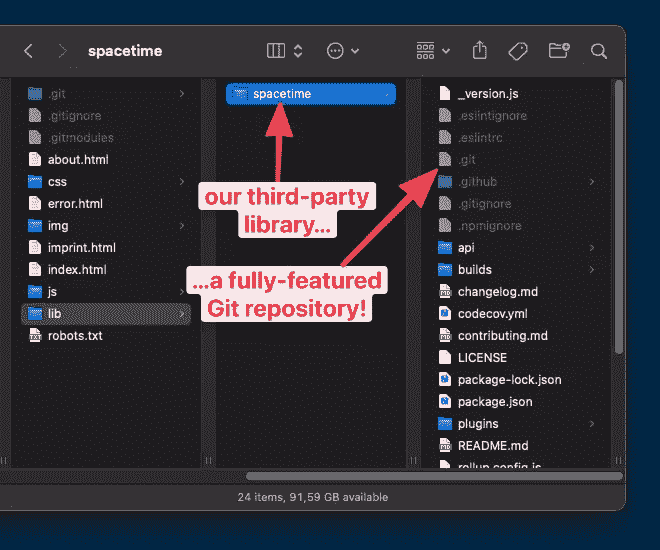
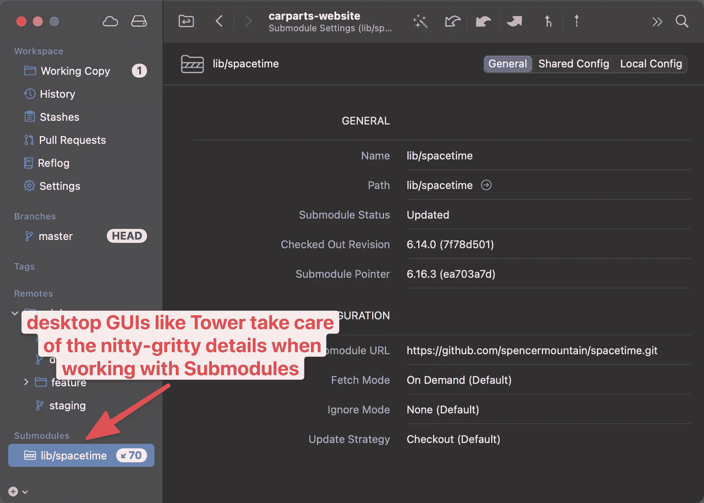

# 理解和使用 Git 中的子模块

> 原文：<https://www.sitepoint.com/git-submodules-introduction/>

大多数现代软件项目都依赖于他人的工作。当别人已经写了一个很好的解决方案时，在你自己的代码中重新发明轮子是浪费时间。这就是为什么这么多项目以库或模块的形式使用第三方代码。

Git 是世界上最流行的版本控制系统，它提供了一种优雅、健壮的方式来管理这些依赖关系。它的“子模块”概念允许我们包含和管理第三方库，同时保持它们与我们自己的代码完全分离。

在本文中，您将了解为什么 Git 中子模块如此有用，它们实际上是什么，以及它们是如何工作的。

## 保持代码分离

为了弄清楚为什么 Git 的子模块确实是一个无价的结构，让我们看一个没有子模块的案例*。当您需要包含第三方代码(比如开源库)时，您当然可以采用简单的方法:只需从 GitHub 下载代码，然后将其转储到您的项目中。虽然肯定*快速*，但这种方法肯定*肮脏*，原因如下:*

*   通过强行将第三方代码复制到您的项目中，您可以有效地将多个项目混合成一个项目。您自己的项目和其他人(库)的项目之间的界限开始变得模糊。
*   每当你需要更新库代码的时候(因为它的维护者提供了一个很棒的新特性或者修复了一个讨厌的 bug ),你必须再次下载、复制和粘贴。这很快变成一个乏味的过程。

软件开发中的一般规则是“将不同的东西分开”,这是有原因的。对于在您自己的项目中管理第三方代码来说也是如此。幸运的是，Git 的子模块概念正是为这些情况而设计的。

但是当然，子模块并不是解决这类问题的唯一方法。您还可以使用许多现代语言和框架提供的各种“包管理器”系统中的一种。这没什么不对的！

然而，您可能会认为 Git 的子模块架构有几个优点:

*   子模块提供了一致的、可靠的接口——无论您使用什么语言或框架。特别是如果你使用多种技术，每一种技术都有自己的包管理器，有自己的规则和命令。另一方面，子模块总是工作相同。
*   并非每段代码都可以通过包管理器获得。也许您只想在两个项目之间共享您自己的代码——在这种情况下，子模块可能会提供最简单的工作流。

## Git 子模块到底是什么

Git 中的子模块实际上只是标准的 Git 存储库。没有花哨的创新，只是我们现在都非常熟悉的相同的 Git 库。这也是子模块的力量的一部分:它们如此健壮和简单，因为它们如此“乏味”(从技术的角度来看)并且经过了现场测试。

使 Git 仓库成为子模块的唯一一件事是，它将*放在*另一个*父* Git 仓库中。

除此之外，Git 子模块仍然是一个功能完整的存储库:您可以执行所有您在“正常”Git 工作中已经知道的操作——从修改文件，一直到提交、拉和推。子模块中一切皆有可能。

## 添加子模块

让我们举一个经典的例子，我们想在我们的项目中添加一个第三方库。在我们获取任何代码之前，创建一个单独的文件夹是有意义的，这样的东西可以有一个家:

```
$ mkdir lib
$ cd lib 
```

现在，我们准备将一些第三方代码注入到我们的项目中——但要以有序的方式，使用子模块。假设我们需要一个小小的“时区转换器”JavaScript 库:

```
$ git submodule add https://github.com/spencermountain/spacetime.git 
```

当我们运行这个命令时，Git 开始将存储库克隆到我们的项目中，作为一个子模块:

```
Cloning into 'carparts-website/lib/spacetime'...
remote: Enumerating objects: 7768, done.
remote: Counting objects: 100% (1066/1066), done.
remote: Compressing objects: 100% (445/445), done.
remote: Total 7768 (delta 615), reused 975 (delta 588), pack-reused 6702
Receiving objects: 100% (7768/7768), 4.02 MiB | 7.78 MiB/s, done.
Resolving deltas: 100% (5159/5159), done. 
```

如果我们看一下我们的工作副本文件夹，我们可以看到库文件实际上已经到达了我们的项目。



“那有什么区别？”你可能会问。毕竟，第三方库的文件在这里，就像我们复制粘贴它们一样。关键的区别在于它们包含在自己的 Git 库中！如果我们只是下载一些文件，把它们扔进我们的项目，然后提交它们——就像我们项目中的其他文件一样——它们就会成为同一个 Git 存储库的一部分。然而，子模块确保库文件不会“泄露”到我们主项目的存储库中。

让我们看看还发生了什么:在主项目的根文件夹中创建了一个新的`.gitmodules`文件。以下是它包含的内容:

```
[submodule "lib/spacetime"]
  path = lib/spacetime
  url = https://github.com/spencermountain/spacetime.git 
```

这个`.gitmodules`文件是 Git 跟踪我们项目中子模块的多个地方之一。还有一个是`.git/config`，现在是这样结尾的:

```
[submodule "lib/spacetime"]
  url = https://github.com/spencermountain/spacetime.git
  active = true 
```

最后，Git 还在内部的`.git/modules`文件夹中保存了每个子模块的`.git`库的副本。

所有这些都是你不必记住的技术细节。然而，它可能有助于您理解 Git 子模块的内部维护相当复杂。这就是为什么要带走一件事很重要:**不要手动搞乱 Git submodule 配置！**如果您想移动、删除或以其他方式操作子模块，请帮自己一个忙，请*而不是*手动尝试。要么使用合适的 Git 命令，要么使用 Git 的[桌面 GUI，如“Tower”](https://www.git-tower.com/?utm_source=sitepoint&utm_medium=guestpost&utm_campaign=git-submodules)，它会为您处理这些细节。



现在我们已经添加了子模块，让我们来看看主项目的状态:

```
$ git status
On branch master
Changes to be committed:
  (use "git restore --staged <file>..." to unstage)
  new file:   .gitmodules
  new file:   lib/spacetime 
```

正如您所看到的，Git 将添加子模块视为一种改变，就像其他任何改变一样。因此，我们必须像其他任何变更一样提交此变更:

```
$ git commit -m "Add timezone converter library as a submodule" 
```

## 用 Git 子模块克隆项目

在上面的例子中，我们向现有的 Git 存储库添加了一个新的子模块。但是当您克隆一个*已经包含了*子模块的存储库时,“反过来”呢？

如果我们在命令行上执行一个普通的`git clone <remote-URL>`,我们会下载主项目——但是我们会发现任何子模块文件夹都是空的！这再次生动地证明了子模块文件是独立的，并且*不*包含在它们的父库中。

在这种情况下，要在克隆了子模块的父存储库之后填充子模块，可以简单地在之后执行`git submodule update --init --recursive`。更好的方法是在第一次调用`git clone`时简单地添加`--recurse-submodules`选项。

## 签出修订

在“普通的”Git 存储库中，我们通常会检出分支。通过使用`git checkout <branchname>`或更新的`git switch <branchname>`，我们告诉 Git 我们当前活动的分支应该是什么。当在这个分支上进行新的提交时，头指针*自动移动*到最近的提交。理解这一点很重要——因为 Git 子模块的工作方式不同！

在子模块中，我们总是检出一个特定的修订——而不是一个分支！即使当你在子模块中执行类似于`git checkout main`的命令时，在后台，当前最新的*提交*在那个分支上被记录——而不是分支本身。

这种行为，当然不是错误。考虑一下:当您包含第三方库时，您希望完全控制主项目中使用的确切代码。当这个库的维护者发布了一个新版本，那当然很好…但是你不一定希望这个新版本自动地在你的项目中使用。仅仅因为你不知道那些新的变化是否会破坏*你的*项目！

如果您想知道您的子模块使用的是什么版本，您可以在您的主项目中请求此信息:

```
$ git submodule status
   ea703a7d557efd90ccae894db96368d750be93b6 lib/spacetime (6.16.3) 
```

这将返回我们的`lib/spacetime`子模块的当前检出版本。而且也让我们知道这个修订版是一个标签，名为“6.16.3”。在 Git 中使用子模块时，大量使用标签是很常见的。

假设您希望您的子模块使用一个旧的版本，它被标记为“6.14.0”。首先，我们必须更改目录，以便我们的 Git 命令将在子模块的上下文中执行，而不是在我们的主项目中执行。然后，我们可以简单地用标签名运行`git checkout`:

```
$ cd lib/spacetime/
$ git checkout 6.14.0
Previous HEAD position was ea703a7 Merge pull request #301 from spencermountain/dev
HEAD is now at 7f78d50 Merge pull request #268 from spencermountain/dev 
```

如果我们现在回到我们的主项目并再次执行`git submodule status`，我们将看到我们的检出被反映出来:

```
$ cd ../..
$ git submodule status
+7f78d50156ae1205aa50675ddede81a61a45fade lib/spacetime (6.14.0) 
```

不过，仔细看看输出:SHA-1 哈希前面的小`+`符号告诉我们，子模块的版本不同于当前存储在父存储库中的版本。由于我们刚刚更改了签出的修订，这看起来是正确的。

在我们的主项目中调用`git status`现在也告诉我们这个事实:

```
$ git status
On branch master
Changes not staged for commit:
  (use "git add <file>..." to update what will be committed)
  (use "git restore <file>..." to discard changes in working directory)
  modified:   lib/spacetime (new commits) 
```

您可以看到 Git 将移动子模块的指针视为一种变更，就像任何其他变更一样:如果我们想要存储它，我们必须将它提交到存储库:

```
$ git commit -m "Changed checked out revision in submodule"
$ git push 
```

## 更新 Git 子模块

在上面的步骤中，是 *us* 移动了子模块指针:是我们选择检出一个不同的修订，提交它，并将其推送到我们团队的远程存储库。但是，如果我们的一个同事改变了子模块的版本会怎么样呢——可能是因为发布了一个有趣的子模块新版本，我们的同事决定在我们的项目中使用它(当然是在彻底测试之后…)。

让我们在我们的主项目中做一个简单的`git pull`——因为我们可能会经常这样做——从共享的远程存储库中获取新的变更:

```
$ git pull
From https://github.com/gntr/git-crash-course
   d86f6e0..055333e  main       -> origin/main
Updating d86f6e0..055333e
Fast-forward
   lib/spacetime | 2 +-
   1 file changed, 1 insertion(+), 1 deletion(-) 
```

倒数第二行表示我们的子模块中的某些内容已经被更改。但是让我们仔细看看:

```
$ git submodule status
+7f78d50156ae1205aa50675ddede81a61a45fade lib/spacetime (6.14.0) 
```

我相信你还记得那个小符号:它意味着子模块指针被移动了！为了将我们本地签出的版本更新为我们队友选择的“正式”版本，我们可以运行`update`命令:

```
$ git submodule update lib/spacetime 
Submodule path 'lib/spacetime': checked out '5e3d70a88180879ae0222b6929551c41c3e5309e' 
```

好吧！我们的子模块现在在我们的主项目存储库中记录的修订中被检出！

## 在 Git 中使用子模块

我们已经介绍了使用 Git 子模块的基本构件。其他工作流程真的挺标准的！

**例如，检查子模块中的新变更**的工作方式类似于任何其他 Git 存储库中的工作方式:在子模块存储库中运行一个`git fetch`命令，如果您真的想利用更新，后面可能会跟有类似`git pull origin main`的命令。

在子模块中进行更改也可能是您的一个用例，尤其是如果您自己管理库代码(因为它是内部库，而不是来自第三方)。您可以像处理任何其他 Git 存储库一样处理子模块:您可以进行更改、提交、推送等等。

## 使用 Git 的全部功能

Git 拥有强大的功能。但是它的许多高级工具——比如 Git 子模块——并不广为人知。真的很遗憾这么多开发者错过了很多强大的东西！

如果你想更深入地了解一些其他的**高级 Git 技术**，我强烈推荐“[高级 Git 工具包](https://www.git-tower.com/learn/git/advanced-git-kit?utm_source=sitepoint&utm_medium=guestpost&utm_campaign=git-submodules)”:它是免费的！)向您介绍 Reflog、交互式 Rebase、Cherry-Picking 甚至分支策略等主题的短片集。

祝您成为更好的开发人员愉快！

## 分享这篇文章