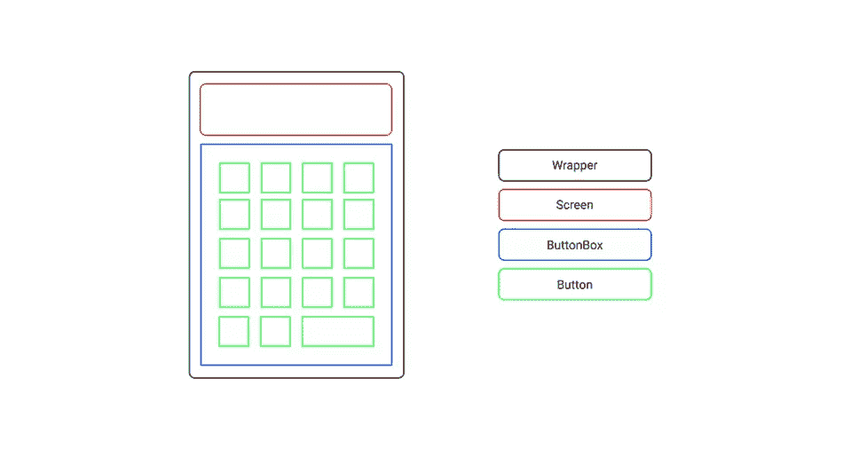
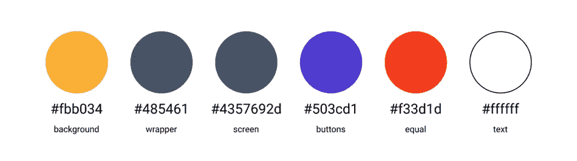
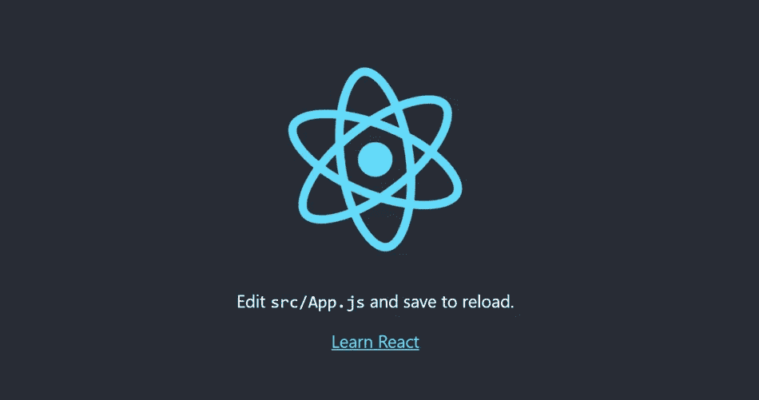
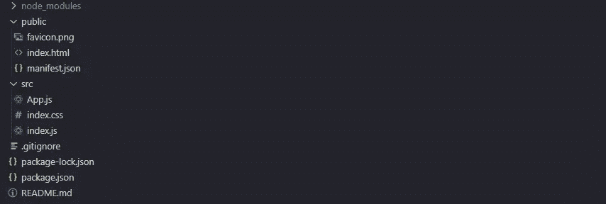
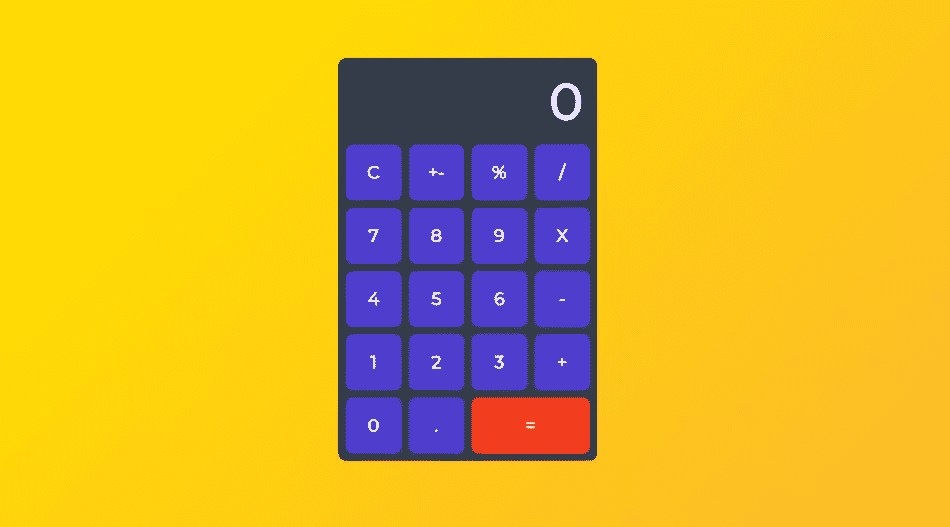
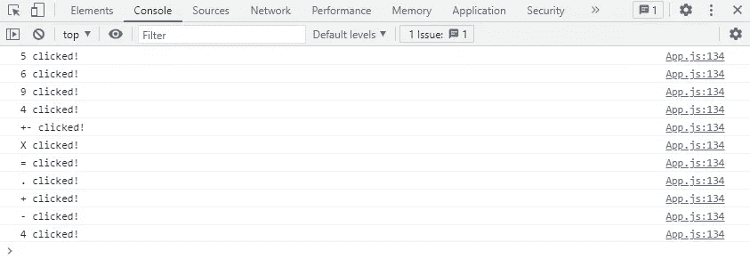
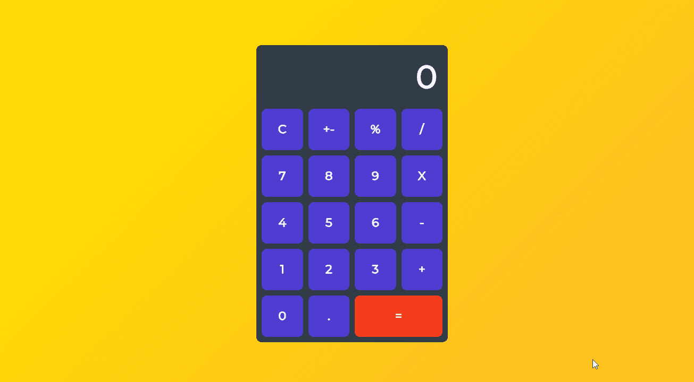

# React 教程:从头开始构建一个计算器应用程序

> 原文：<https://www.sitepoint.com/react-tutorial-build-calculator-app/>

在本教程中，我们将构建一个 React 计算器应用程序。您将学习如何制作线框、设计布局、创建组件、更新状态以及格式化输出。

为了激发你的灵感，这里有一个到我们将要构建的已部署项目的链接。

还有，这里有[的源代码](https://github.com/madzadev/calculator)，如果你在项目的任何阶段需要帮助，仅供参考。

## 规划

因为我们将构建一个计算器应用程序，所以让我们选择一个对学习来说不太复杂，但对涵盖创建应用程序的不同方面来说也不太基本的范围。

我们将实施的功能包括:

*   加、减、乘、除
*   支持小数值
*   计算百分比
*   插入值
*   重置功能
*   格式化较大的数字
*   基于长度调整输出大小

首先，我们将画一个基本的线框来展示我们的想法。为此，你可以使用免费的工具，如 [Figma](https://figma.com) 或【Diagrams.net】T2。



注意，在这个阶段，考虑颜色和样式并不重要。最重要的是，您可以构建布局并识别所涉及的组件。

## 设计颜色

一旦我们处理了布局和组件，剩下要做的就是选择一个好的配色方案来完成设计。

以下是让应用程序看起来更棒的一些指导原则:

*   包装应该与背景形成对比
*   屏幕和按钮值应该易于阅读
*   等号按钮应该用不同的颜色来强调

基于以上标准，我们将使用如下所示的配色方案。



## 设置项目

首先，打开项目文件夹中的终端，使用 [create-react-app](https://create-react-app.dev/) 创建一个样板模板。为此，请运行以下命令:

```
npx create-react-app calculator 
```

这是在零配置的情况下设置一个完全可用的 React 应用程序的最快和最简单的方法。之后你需要做的就是运行`cd calculator`切换到新创建的项目文件夹，然后运行`npm start`在浏览器中启动你的应用。



如您所见，它带有一些默认的样板文件，所以接下来我们将在项目文件夹树中进行一些清理。

找到`src`文件夹，在那里你的应用程序的逻辑将存在，并删除除了`App.js`创建你的应用程序，`index.css`设计你的应用程序，和`index.js`在 DOM 中渲染你的应用程序。



## 创建组件

因为我们已经做了一些线框图，我们已经知道了应用程序的主要构建模块。那些是`Wrapper`、`Screen`、`ButtonBox`和`Button`。

首先在`src`文件夹中创建一个`components`文件夹。然后我们将为每个组件创建一个单独的`.js`文件和`.css`文件。

如果您不想手动创建这些文件夹和文件，可以使用下面的一行程序来快速设置:

```
cd src && mkdir components && cd components && touch Wrapper.js Wrapper.css Screen.js Screen.css ButtonBox.js ButtonBox.css Button.js Button.css 
```

### 包装材料

`Wrapper`组件将是框架，将所有子组件保持在适当的位置。这也将允许我们之后将整个应用程序居中。

#### Wrapper.js

```
import "./Wrapper.css";

const Wrapper = ({ children }) => {
  return <div className="wrapper">{children}</div>;
};

export default Wrapper; 
```

#### Wrapper.css

```
.wrapper {
  width: 340px;
  height: 540px;
  padding: 10px;
  border-radius: 10px;
  background-color: #485461;
  background-image: linear-gradient(315deg, #485461 0%, #28313b 74%);
} 
```

### 屏幕

`Screen`组件将是`Wrapper`组件的顶部子组件，其目的是显示计算出的值。

在特性列表中，我们包括了显示输出根据长度调整大小，这意味着较长的值必须缩小。为此，我们将使用一个名为 [react-textfit](https://www.npmjs.com/package/react-textfit) 的小型(3.4kb gzip)库。

要安装它，运行`npm i react-textfit`，然后导入并使用它，如下所示。

#### Screen.js

```
import { Textfit } from "react-textfit";
import "./Screen.css";

const Screen = ({ value }) => {
  return (
    <Textfit className="screen" mode="single" max={70}>
      {value}
    </Textfit>
  );
};

export default Screen; 
```

#### Screen.css

```
.screen {
  height: 100px;
  width: 100%;
  margin-bottom: 10px;
  padding: 0 10px;
  background-color: #4357692d;
  border-radius: 10px;
  display: flex;
  align-items: center;
  justify-content: flex-end;
  color: white;
  font-weight: bold;
  box-sizing: border-box;
} 
```

### 按钮盒

类似于`Wrapper`组件，`ButtonBox`组件将成为子组件的框架——只是这次是针对`Button`组件。

#### ButtonBox.js 文件

```
import "./ButtonBox.css";

const ButtonBox = ({ children }) => {
  return <div className="buttonBox">{children}</div>;
};

export default ButtonBox; 
```

#### ButtonBox.css

```
.buttonBox {
  width: 100%;
  height: calc(100% - 110px);
  display: grid;
  grid-template-columns: repeat(4, 1fr);
  grid-template-rows: repeat(5, 1fr);
  grid-gap: 10px;
} 
```

### 纽扣

组件将为应用程序提供交互性。每个组件都有`value`和`onClick`道具。

在样式表中，我们还将包括`equal`按钮的样式。稍后我们将使用`Button`道具来访问这个类。

#### Button.js

```
import "./Button.css";

const Button = ({ className, value, onClick }) => {
  return (
    <button className={className} onClick={onClick}>
      {value}
    </button>
  );
};

export default Button; 
```

#### 按钮. css

```
button {
  border: none;
  background-color: rgb(80, 60, 209);
  font-size: 24px;
  color: rgb(255, 255, 255);
  font-weight: bold;
  cursor: pointer;
  border-radius: 10px;
  outline: none;
}

button:hover {
  background-color: rgb(61, 43, 184);
}

.equals {
  grid-column: 3 / 5;
  background-color: rgb(243, 61, 29);
}

.equals:hover {
  background-color: rgb(228, 39, 15);
} 
```

## 渲染元素

React 应用程序中用于渲染的基本文件是`index.js`。在我们继续之前，确保您的`index.js`如下所示:

```
import React from "react";
import ReactDOM from "react-dom";

import App from "./App";
import "./index.css";

ReactDOM.render(
  <React.StrictMode>
    <App />
  </React.StrictMode>,
  document.getElementById("root")
); 
```

此外，让我们检查`index.css`并确保我们重置了`padding`和`margin`的默认值，选择一些很棒的字体(如本例中的 [Montserrat](https://fonts.google.com/specimen/Montserrat) )并设置适当的规则以将应用程序置于视窗中心:

```
@import url("https://fonts.googleapis.com/css2?family=Montserrat&display=swap");

* {
  margin: 0;
  padding: 0;
  font-family: "Montserrat", sans-serif;
}

body {
  height: 100vh;
  display: flex;
  align-items: center;
  justify-content: center;
  background-color: #fbb034;
  background-image: linear-gradient(315deg, #fbb034 0%, #ffdd00 74%);
} 
```

最后，让我们打开主文件`App.js`，并导入我们之前创建的所有组件:

```
import Wrapper from "./components/Wrapper";
import Screen from "./components/Screen";
import ButtonBox from "./components/ButtonBox";
import Button from "./components/Button";

const App = () => {
  return (
    <Wrapper>
      <Screen value="0" />
      <ButtonBox>
        <Button
          className=""
          value="0"
          onClick={() => {
            console.log("Button clicked!");
          }}
        />
      </ButtonBox>
    </Wrapper>
  );
};

export default App; 
```

在上面的例子中，我们只渲染了一个组件。

让我们在线框中创建数据的数组表示，这样我们就可以映射并呈现`ButtonBox`中的所有按钮:

```
import Wrapper from "./components/Wrapper";
import Screen from "./components/Screen";
import ButtonBox from "./components/ButtonBox";
import Button from "./components/Button";

const btnValues = [
  ["C", "+-", "%", "/"],
  [7, 8, 9, "X"],
  [4, 5, 6, "-"],
  [1, 2, 3, "+"],
  [0, ".", "="],
];

const App = () => {
  return (
    <Wrapper>
      <Screen value=0 />
      <ButtonBox>
        {
          btnValues.flat().map((btn, i) => {
            return (
              <Button
                key={i}
                className={btn === "=" ? "equals" : ""}
                value={btn}
                onClick={() => {
                  console.log(`${btn} clicked!`);
                }}
              />
            );
          })
        }
      </ButtonBox>
    </Wrapper>
  );
}; 
```

检查您的终端，确保您的 React 应用程序仍在运行。如果没有，运行`npm start`再次启动。

打开你的浏览器。如果您一直这样做，您当前的结果应该是这样的:



如果你愿意，你也可以打开浏览器的 devtools，测试每个按钮被按下时的日志值。



## 定义状态

接下来，我们将使用 React `useState` hook 声明状态变量。

具体有三种状态:`num`，输入的值；`sign`，选择的符号:`res`，计算值。

为了使用`useState`钩子，我们必须首先在`App.js`中导入它:

```
import React, { useState } from "react"; 
```

在`App`函数中，我们将使用一个对象一次设置所有状态:

```
import React, { useState } from "react";

// ...

const App = () => {
  let [calc, setCalc] = useState({
    sign: "",
    num: 0,
    res: 0,
  });

  return (
    // ...
  );
}; 
```

## 功能

我们的应用程序看起来不错，但没有功能。目前，它只能将按钮值输出到浏览器控制台。让我们解决这个问题！

我们将从`Screen`组件开始。将以下条件逻辑设置为`value` prop，以便显示输入的数字(如果数字是键入的)或计算的结果(如果按下了等于按钮)。

为此，我们将使用内置的 JS [三元运算符](https://developer.mozilla.org/en-US/docs/Web/JavaScript/Reference/Operators/Conditional_Operator)，它基本上是`if`语句的快捷方式，接受一个表达式，如果表达式为真，则在`?`之后返回值，如果表达式为假，则在`:`之后返回值:

```
<Screen value={calc.num ? calc.num : calc.res} /> 
```

现在让我们编辑`Button`组件，以便它可以检测不同的按钮类型，并在特定按钮被按下时执行指定的功能。使用下面的代码:

```
import React, { useState } from "react";

// ...

const App = () => {
  // ...

  return (
    <Wrapper>
      <Screen value={calc.num ? calc.num : calc.res} />
      <ButtonBox>
        {btnValues.flat().map((btn, i) => {
          return (
            <Button
              key={i}
              className={btn === "=" ? "equals" : ""}
              value={btn}
              onClick={
                btn === "C"
                  ? resetClickHandler
                  : btn === "+-"
                  ? invertClickHandler
                  : btn === "%"
                  ? percentClickHandler
                  : btn === "="
                  ? equalsClickHandler
                  : btn === "/" || btn === "X" || btn === "-" || btn === "+"
                  ? signClickHandler
                  : btn === "."
                  ? commaClickHandler
                  : numClickHandler
              }
            />
          );
        })}
      </ButtonBox>
    </Wrapper>
  );
}; 
```

现在我们准备创建所有必要的函数。

### numClickHandler

只有按下任何一个数字按钮(0-9)时，才会触发`numClickHandler`功能。然后，它获取`Button`的值，并将其添加到当前的`num`值中。

它还将确保:

*   没有以零开头的整数
*   逗号前没有多个零
*   格式将是“0”如果“.”首先按下
*   输入的数字最长为 16 个整数

```
import React, { useState } from "react";

// ...

const App = () => {
  // ...

  const numClickHandler = (e) => {
    e.preventDefault();
    const value = e.target.innerHTML;

    if (calc.num.length < 16) {
      setCalc({
        ...calc,
        num:
          calc.num === 0 && value === "0"
            ? "0"
            : calc.num % 1 === 0
            ? Number(calc.num + value)
            : calc.num + value,
        res: !calc.sign ? 0 : calc.res,
      });
    }
  };

  return (
    // ...
  );
}; 
```

### commaClickHandler

只有当小数点(`.`)被按下时，`commaClickHandler`功能才会被触发。它将小数点加到当前的`num`值上，使其成为十进制数。

它还将确保不会出现多个小数点。

*注意:我将处理函数称为“commaClickHandler ”,因为在世界上的许多地方，整数和小数是用逗号而不是小数点分开的。*

```
// numClickHandler function

const commaClickHandler = (e) => {
  e.preventDefault();
  const value = e.target.innerHTML;

  setCalc({
    ...calc,
    num: !calc.num.toString().includes(".") ? calc.num + value : calc.num,
  });
}; 
```

### signClickHandler

当用户按下 **+** 、**–**、 ***** 或 **/** 时，`signClickHandler`功能被触发。该特定值随后被设置为`calc`对象中的当前`sign`值。

它还将确保重复呼叫不会受到影响:

```
// commaClickHandler function

const signClickHandler = (e) => {
  e.preventDefault();
  const value = e.target.innerHTML;

  setCalc({
    ...calc,
    sign: value,
    res: !calc.res && calc.num ? calc.num : calc.res,
    num: 0,
  });
}; 
```

### equalsClickHandler

当按下等号按钮( **=** )时，`equalsClickHandler`功能计算结果。计算基于当前的`num`和`res`值，以及选择的`sign`(参见`math`功能)。

然后返回值被设置为新的`res`用于进一步计算。

它还将确保:

*   对重复呼叫没有影响
*   用户不能用 0 除

```
// signClickHandler function

const equalsClickHandler = () => {
  if (calc.sign && calc.num) {
    const math = (a, b, sign) =>
      sign === "+"
        ? a + b
        : sign === "-"
        ? a - b
        : sign === "X"
        ? a * b
        : a / b;

    setCalc({
      ...calc,
      res:
        calc.num === "0" && calc.sign === "/"
          ? "Can't divide with 0"
          : math(Number(calc.res), Number(calc.num), calc.sign),
      sign: "",
      num: 0,
    });
  }
}; 
```

### invertClickHandler

`invertClickHandler`函数首先检查是否有任何输入值(`num`)或计算值(`res`)，然后通过乘以-1 来反转它们:

```
// equalsClickHandler function

const invertClickHandler = () => {
  setCalc({
    ...calc,
    num: calc.num ? calc.num * -1 : 0,
    res: calc.res ? calc.res * -1 : 0,
    sign: "",
  });
}; 
```

### percentClickHandler

`percentClickHandler`函数检查是否有任何输入值(`num`)或计算值(`res`)，然后使用内置的`Math.pow`函数计算百分比，该函数将基数返回到指数幂:

```
// invertClickHandler function

const percentClickHandler = () => {
  let num = calc.num ? parseFloat(calc.num) : 0;
  let res = calc.res ? parseFloat(calc.res) : 0;

  setCalc({
    ...calc,
    num: (num /= Math.pow(100, 1)),
    res: (res /= Math.pow(100, 1)),
    sign: "",
  });
}; 
```

### resetClickHandler

`resetClickHandler`函数默认`calc`的所有初始值，返回第一次呈现计算器应用程序时的`calc`状态:

```
// percentClickHandler function

const resetClickHandler = () => {
  setCalc({
    ...calc,
    sign: "",
    num: 0,
    res: 0,
  });
}; 
```

## 输入格式

完成简介中的特性列表的最后一件事是实现值格式化。为此，我们可以使用由[使者](https://stackoverflow.com/users/1238344/emissary)发布的修改后的正则表达式字符串:

```
const toLocaleString = (num) =>
  String(num).replace(/(?<!\..*)(\d)(?=(?:\d{3})+(?:\.|$))/g, "$1 "); 
```

本质上，它所做的是获取一个数字，将其格式化为字符串格式，并为千位标记创建空格分隔符。

如果我们颠倒这个过程，想要处理数字串，首先我们需要删除空格，这样我们可以在以后把它转换成数字。为此，您可以使用此函数:

```
const removeSpaces = (num) => num.toString().replace(/\s/g, ""); 
```

下面是应该包含这两个函数的代码:

```
import React, { useState } from "react";

// ...

const toLocaleString = (num) =>
  String(num).replace(/(?<!\..*)(\d)(?=(?:\d{3})+(?:\.|$))/g, "$1 ");

const removeSpaces = (num) => num.toString().replace(/\s/g, "");

const App = () => {
  // ...

  return (
    // ...
  );
}; 
```

查看下一节的完整代码，了解如何将`toLocaleString`和`removeSpaces`添加到`Button`组件的处理函数中。

## 把所有的放在一起

如果您已经完成了，整个`App.js`代码应该是这样的:

```
import React, { useState } from "react";

import Wrapper from "./components/Wrapper";
import Screen from "./components/Screen";
import ButtonBox from "./components/ButtonBox";
import Button from "./components/Button";

const btnValues = [
  ["C", "+-", "%", "/"],
  [7, 8, 9, "X"],
  [4, 5, 6, "-"],
  [1, 2, 3, "+"],
  [0, ".", "="],
];

const toLocaleString = (num) =>
  String(num).replace(/(?<!\..*)(\d)(?=(?:\d{3})+(?:\.|$))/g, "$1 ");

const removeSpaces = (num) => num.toString().replace(/\s/g, "");

const App = () => {
  let [calc, setCalc] = useState({
    sign: "",
    num: 0,
    res: 0,
  });

  const numClickHandler = (e) => {
    e.preventDefault();
    const value = e.target.innerHTML;

    if (removeSpaces(calc.num).length < 16) {
      setCalc({
        ...calc,
        num:
          calc.num === 0 && value === "0"
            ? "0"
            : removeSpaces(calc.num) % 1 === 0
            ? toLocaleString(Number(removeSpaces(calc.num + value)))
            : toLocaleString(calc.num + value),
        res: !calc.sign ? 0 : calc.res,
      });
    }
  };

  const commaClickHandler = (e) => {
    e.preventDefault();
    const value = e.target.innerHTML;

    setCalc({
      ...calc,
      num: !calc.num.toString().includes(".") ? calc.num + value : calc.num,
    });
  };

  const signClickHandler = (e) => {
    e.preventDefault();
    const value = e.target.innerHTML;

    setCalc({
      ...calc,
      sign: value,
      res: !calc.res && calc.num ? calc.num : calc.res,
      num: 0,
    });
  };

  const equalsClickHandler = () => {
    if (calc.sign && calc.num) {
      const math = (a, b, sign) =>
        sign === "+"
          ? a + b
          : sign === "-"
          ? a - b
          : sign === "X"
          ? a * b
          : a / b;

      setCalc({
        ...calc,
        res:
          calc.num === "0" && calc.sign === "/"
            ? "Can't divide with 0"
            : toLocaleString(
                math(
                  Number(removeSpaces(calc.res)),
                  Number(removeSpaces(calc.num)),
                  calc.sign
                )
              ),
        sign: "",
        num: 0,
      });
    }
  };

  const invertClickHandler = () => {
    setCalc({
      ...calc,
      num: calc.num ? toLocaleString(removeSpaces(calc.num) * -1) : 0,
      res: calc.res ? toLocaleString(removeSpaces(calc.res) * -1) : 0,
      sign: "",
    });
  };

  const percentClickHandler = () => {
    let num = calc.num ? parseFloat(removeSpaces(calc.num)) : 0;
    let res = calc.res ? parseFloat(removeSpaces(calc.res)) : 0;

    setCalc({
      ...calc,
      num: (num /= Math.pow(100, 1)),
      res: (res /= Math.pow(100, 1)),
      sign: "",
    });
  };

  const resetClickHandler = () => {
    setCalc({
      ...calc,
      sign: "",
      num: 0,
      res: 0,
    });
  };

  return (
    <Wrapper>
      <Screen value={calc.num ? calc.num : calc.res} />
      <ButtonBox>
        {btnValues.flat().map((btn, i) => {
          return (
            <Button
              key={i}
              className={btn === "=" ? "equals" : ""}
              value={btn}
              onClick={
                btn === "C"
                  ? resetClickHandler
                  : btn === "+-"
                  ? invertClickHandler
                  : btn === "%"
                  ? percentClickHandler
                  : btn === "="
                  ? equalsClickHandler
                  : btn === "/" || btn === "X" || btn === "-" || btn === "+"
                  ? signClickHandler
                  : btn === "."
                  ? commaClickHandler
                  : numClickHandler
              }
            />
          );
        })}
      </ButtonBox>
    </Wrapper>
  );
};

export default App; 
```

## 最终注释

恭喜你！您已经创建了一个功能齐全、风格独特的应用程序。希望你在这个过程中学到了一些东西！



您可以进一步探索的一些想法是添加一些科学特性，或者用以前的计算列表来实现记忆。

如果您有任何问题报告或功能请求，请随意将它们留在 [GitHub repo](https://github.com/madzadev/calculator) 中。如果你喜欢这个项目，请随意启动它。

## 分享这篇文章