# 探索 Vite 的源代码

> 原文：<https://www.sitepoint.com/exploring-vite-source-code/>

你可能已经听说了，前端生态系统有了一个新的酷小子:一个叫做 Vite 的构建工具。虽然它是由尤雨溪(他也创建了 Vue.js)创建的，但它不是特定于框架的，所以你可以将 Vite 与 Vue.js、React.js、Svelte.js 甚至是普通的 JavaScript 一起使用。

在本文中，我们将扩展已经在这里发布的[概述](https://www.sitepoint.com/vitejs-front-end-build-tool-introduction/),并检查 Vite 的源代码以提取关于其内部架构的一些见解。特别是，我们将探索 Vite 的模板和插件系统。最后，你会更好地理解模板和插件之间的区别，以及 Vite 的核心系统是如何连接到插件的。

现在事不宜迟，让我们用 Vite 创建一个应用程序。

## 使用 Vite 创建应用程序

出于本演示的目的，我们将使用以下命令创建一个 Vue 项目:

```
npm init vite@latest 
```

(拥有`@latest`将确保你在这个新创建的项目中做`npm install`时总是得到最新的版本。)

顺便提一句，您可能已经看到过不推荐使用的`init`命令版本。

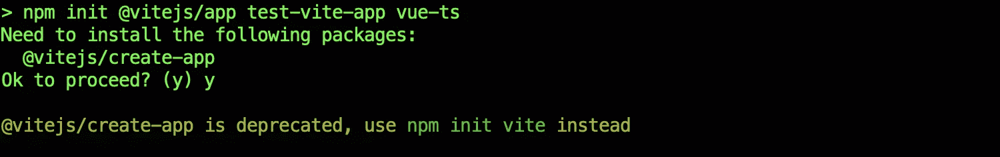

如您所见，弃用警告告诉我们使用`npm init vite`来代替。

这个新命令基本上是以下内容的简写:

```
npx create-vite 
```

这将安装并运行一个名为`create-vite`的工具，它会提示您正在创建什么类型的项目。您将选择一个名称和一个模板。

为您的项目选择一个您喜欢的名称。

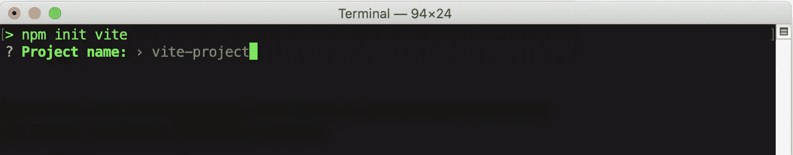

并选择要使用的模板。

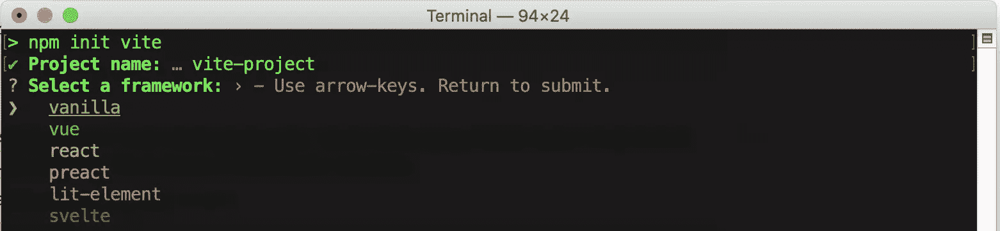

出于探索的目的，你可以选择`vanilla`或者`vue`。

接下来，我们将通过 GitHub 上的源代码来探索这个`create-vite`工具。

## 探索 Vite 源代码

首先，在[github.com/vitejs/vite](https://github.com/vitejs/vite)访问 Vite 的 GitHub 页面。

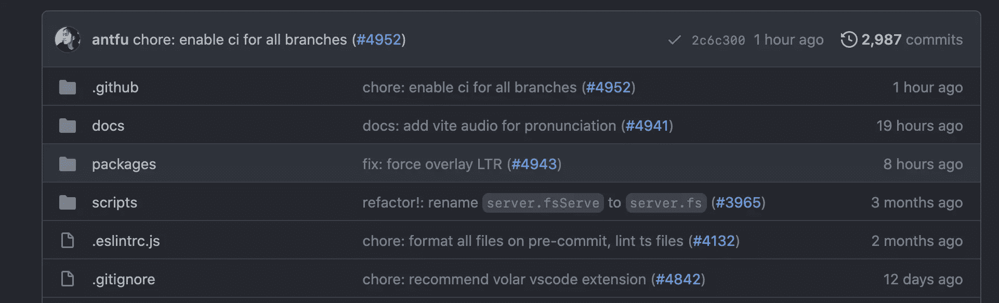

然后进入`packages`文件夹。

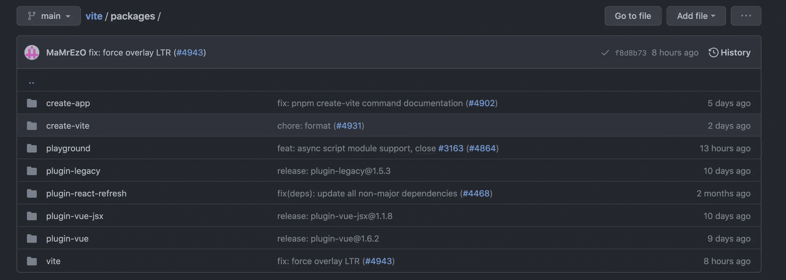

这里可以看到`create-app`和`create-vite`。

负责显示“已弃用”的原始命令。这里我们感兴趣的是`create-vite`文件夹。它托管所有用于项目创建的内置模板。

在`packages`文件夹里面，我们还可以看到一些内置插件的插件文件夹。

现在是探索*模板*和*插件*之间的区别，以及它们如何在构建工具工作流程中协同工作的好时机。

## 模板

模板应该是一个容易理解的概念:它是一个新项目的启动代码。

在`packages/create-vite`文件夹中，你会看到十几个`template-*`文件夹。

📁**/包/创建邀请**

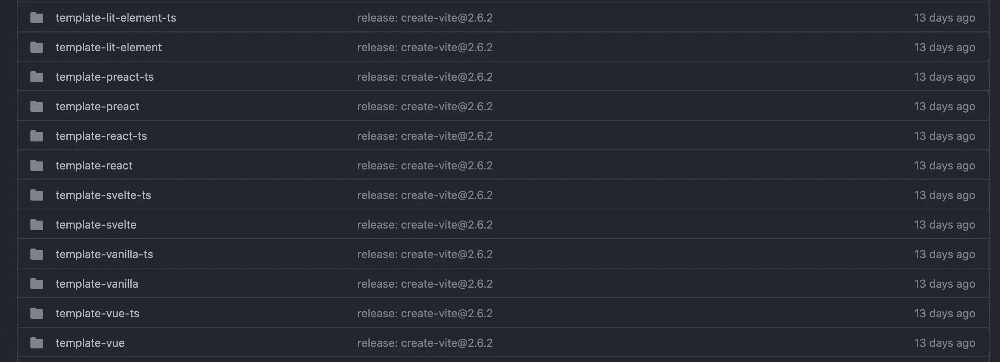

如您所见，Vite 支持各种不同框架的模板(以及它们的 TypeScript 对应物)。

您可以从`create-vite`提示符中选择`vanilla`。

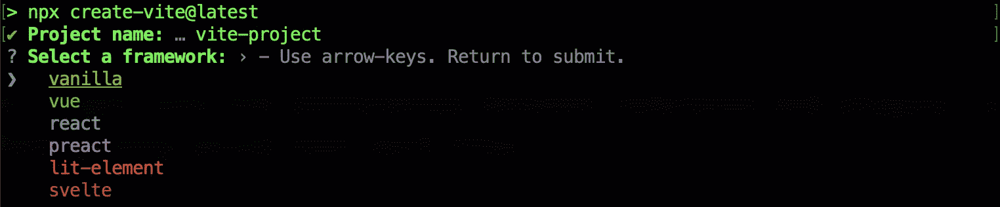

如果您选择 vanilla，它基本上会获取`packages/template-vanilla`文件夹中的文件，并将它们克隆为您的新项目。

📁**/包/模板-香草**

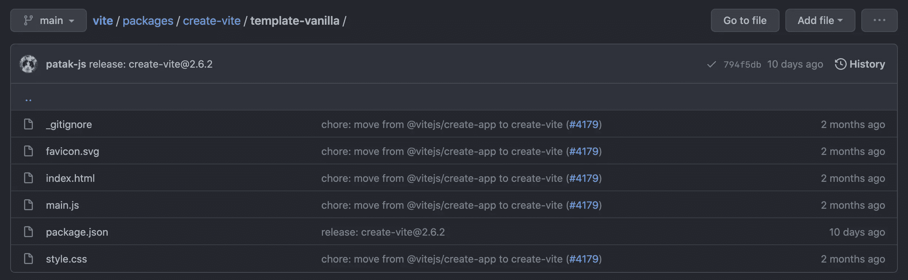

您也可以从提示中选择`vue`:

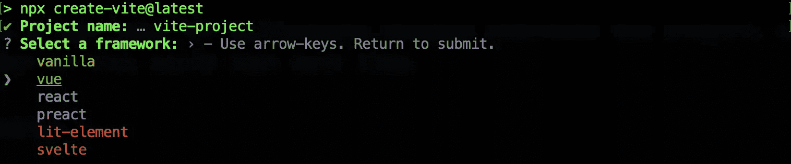

如果您选择`vue`，它将克隆`packages/template-vue`文件夹中的文件作为您的新项目。

📁**/包/模板-vue**

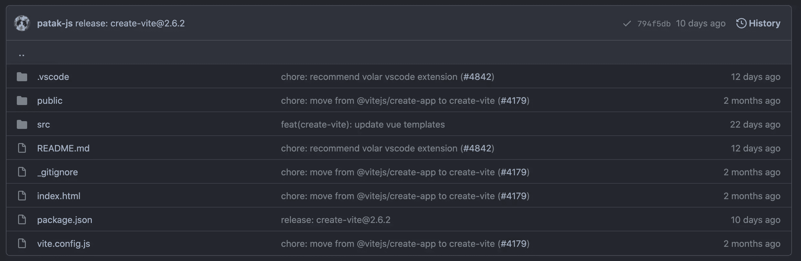

从 vue 模板中生成的项目将具有您期望从 Vue 项目中得到的标准文件夹结构。

所以那就是*模板*。现在我们来谈谈*插件*。

## 插件

正如我提到的，Vite 不是特定于框架的。由于它的插件系统，它能够为各种框架创建项目。

开箱即用，Vite 为 Vue 提供插件，Vue 与 JSX 和反应。

您可以在`packages`文件夹中检查每个内置插件的代码:

📁**/套餐**

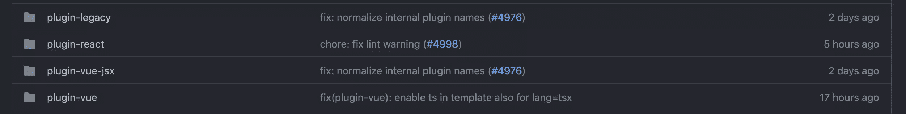

*注意:`plugin-legacy`适用于不支持原生 ESM 的传统浏览器。*

这些插件最常见的使用方式是通过它们相应的模板。例如，Vue 模板需要使用 Vue 插件，React 模板需要使用 React 插件。

作为基本选项，用 vanilla 模板创建的项目不知道如何服务 Vue 的单文件组件(SFC)文件。但是用 Vite 创建的 Vue 项目将能够处理 SFC 文件类型。它还知道如何捆绑整个 Vue 项目进行生产。

如果我们比较 Vue 模板和 vanilla 模板各自的`package.json`文件，我们可以很容易地看出为什么会这样。

📁**/包/模板-香草/包. json**

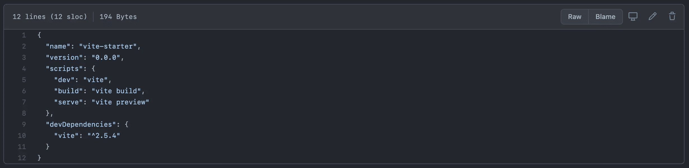

📁**/packages/template-vue/package . JSON**

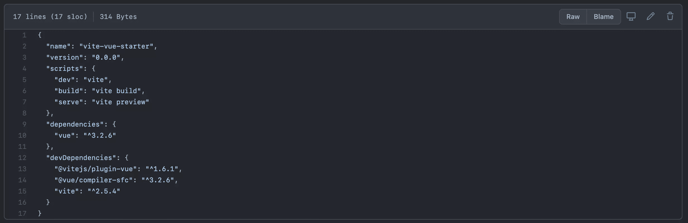

`template-vue`包含了`template-vanilla`拥有的一切，外加三个额外的包。

📁**/packages/template-vue/package . JSON**

```
"dependencies": {
    "vue": "^3.2.6" // 1
  },
  "devDependencies": {
    "@vitejs/plugin-vue": "^1.6.1", // 2
    "@vue/compiler-sfc": "^3.2.6", // 3
    "vite": "^2.5.4"
  } 
```

*   `vue`是运行时运行的主库
*   是负责服务和捆绑 Vue 项目的插件
*   编译 SFC 文件时需要使用`@vue/compiler-sfc`

所以可以肯定地说，这三个包赋予了 Vite 项目理解 Vue 代码的能力。`@vitejs/plugin-vue`包是连接 Vite 核心系统和 Vue.js 框架的“桥梁”。

## 用尤雨溪自己的话说…

在本文的其余部分，我们将继续探索 Vue 模板。但是如果你想用香草模板看到更多酷的东西，你可以看看尤雨溪的*用 Vite* 课程的这个教程。

[https://www.youtube.com/embed/DkGV5F4XnfQ](https://www.youtube.com/embed/DkGV5F4XnfQ)

<br>

## 插件视图

正如我们在 Vue 插件的`package.json`中看到的，`@vitejs/plugin-vue`包负责捆绑一个 Vue 项目。

Vite 将捆绑工作委托给 Rollup，这是另一个非常流行的构建工具。插件关系依赖于`vite`核心在某些特定的时间点调用`plugin`包代码。这些特定的穴位被称为“[钩](https://rollupjs.org/guide/en/#build-hooks)”。插件开发者必须决定在每个钩子中执行什么代码。

例如，在 Vue 插件源代码中，你可以看到其中一些钩子的实现。

📁**/包/插件-vue/src/index.ts**

```
async resolveId(id) {
  // component export helper
  if (id === EXPORT_HELPER_ID) {
    return id
  }
  // serve sub-part requests (*?vue) as virtual modules
  if (parseVueRequest(id).query.vue) {
    return id
  }
},

load(id, ssr = !!options.ssr) {
  if (id === EXPORT_HELPER_ID) {
    return helperCode
  }

  const { filename, query } = parseVueRequest(id)
  // select corresponding block for sub-part virtual modules
  if (query.vue) {
    if (query.src) {
      return fs.readFileSync(filename, 'utf-8')
    }
    const descriptor = getDescriptor(filename, options)!
    let block: SFCBlock | null | undefined
    if (query.type === 'script') {
      // handle <scrip> + <script setup> merge via compileScript()
      block = getResolvedScript(descriptor, ssr)
    } else if (query.type === 'template') {
      block = descriptor.template!
    } else if (query.type === 'style') {
      block = descriptor.styles[query.index!]
    } else if (query.index != null) {
      block = descriptor.customBlocks[query.index]
    }
    if (block) {
      return {
        code: block.content,
        map: block.map as any
      }
    }
  }
},

transform(code, id, ssr = !!options.ssr) {
  const { filename, query } = parseVueRequest(id)
  if (query.raw) {
    return
  }
  if (!filter(filename) && !query.vue) {
    if (!query.vue && refTransformFilter(filename)) {
      if (!canUseRefTransform) {
        this.warn('refTransform requires @vue/compiler-sfc@^3.2.5.')
      } else if (shouldTransformRef(code)) {
        return transformRef(code, {
          filename,
          sourceMap: true
        })
      }
    }
    return
  }
    if (!query.vue) {
    // main request
    return transformMain(
      code,
      filename,
      options,
      this,
      ssr,
      customElementFilter(filename)
    )
  } else {
    // sub block request
    const descriptor = getDescriptor(filename, options)!
    if (query.type === 'template') {
      return transformTemplateAsModule(code, descriptor, options, this, ssr)
    } else if (query.type === 'style') {
      return transformStyle(
        code,
        descriptor,
        Number(query.index),
        options,
        this
      )
    }
  }
} 
```

并且在主`vite`包中，会用 Rollup 来调用上面的插件钩子。

📁**/包/vite/src/node/build.ts**

```
// first, gathers all the plugins used
const plugins = (
  ssr ? config.plugins.map((p) => injectSsrFlagToHooks(p)) : config.plugins
) as Plugin[]

...

// then, put the plugins and everything else in an options object
const rollupOptions: RollupOptions = {
  input,
  preserveEntrySignatures: ssr
    ? 'allow-extension'
    : libOptions
    ? 'strict'
    : false,
  ...options.rollupOptions,
  plugins,
  external,
  onwarn(warning, warn) {
    onRollupWarning(warning, warn, config)
  }
}

...

// lastly, delegate to rollup
const bundle = await rollup.rollup(rollupOptions) 
```

Rollup 插件与 Vite 插件非常相似。但是因为 Rollup 并不打算作为一个现成的开发构建工具，所以 Vite 插件将会有额外的选项和钩子，这是经典 Rollup 插件所没有的。

换句话说，Vite 插件是 Rollup 插件的扩展。

## Vite 命令

回到 Vue 模板，让我们关注一下`scripts`选项。

📁**/packages/create-vite/template-vue/package . JSON**

```
"scripts": {
  "dev": "vite",
  "build": "vite build",
  "serve": "vite preview"
}, 
```

这些配置使我们能够在 Vite 项目中执行以下命令:

*   `npm run dev`用于启动开发服务器
*   `npm run build`用于创建生产版本
*   `npm run serve`用于在本地预览所述生产构建

上述命令映射到以下命令:

*   `vite`
*   `vite build`
*   `vite preview`

如您所见，`vite`包是一切开始的地方。

您可以通过查看`vite`包的`package.json`文件来了解其他第三方工具。

📁**/packages/vite/package . JSON**

```
"dependencies": {
  "esbuild": "^0.12.17",
  "postcss": "^8.3.6",
  "resolve": "^1.20.0",
  "rollup": "^2.38.5"
}, 
```

如你所见，`vite`实际上在幕后使用了两个不同的捆绑器:Rollup 和 esbuild。

## 汇总与 esbuild

Vite 将这两种捆扎机用于不同类型的活动。

Vite 使用汇总来满足主要的捆绑需求。esbuild 用于模块兼容性和优化。这些步骤被称为“依赖性预捆绑”过程。这个过程被认为是“繁重”的，因为它需要在每个模块的基础上完成，而且通常在一个项目中会用到很多模块。

*模块兼容性*是指将不同格式(UMD 或 CommonJS 模块)转换成标准 ESM 格式。

*优化*是将所有不同的文件从一个独立的包中捆绑到一个“东西”中，然后只需要取一次。

与 esbuild 相比，Rollup 处理这些繁重的事情太慢了。Esbuild 实际上是最快的构建工具。之所以快，是因为它是用 Go(编程语言)开发的。

这里有一个在[官方文档网站](https://esbuild.github.io/)上展示的对比。

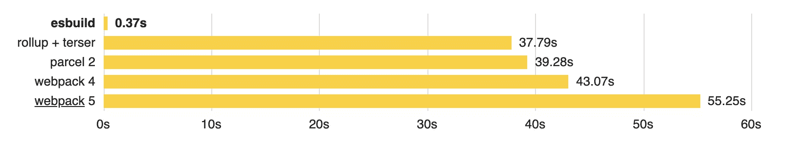

如您所见，esbuild 不仅仅是快；这完全是另一个层面。这就是为什么 Vite 快如闪电。⚡

## 摘要

在本文中，我们浏览了源代码并了解到:

*   `npm init vite`命令正在使用`create-vite`工具
*   `create-vite`包包含了所有的内置模板
*   特定于框架的模板依赖于其对应的特定于框架的插件
*   插件是在基于钩子的架构中实现的
*   Vite 在幕后同时使用了 Rollup 和 esbuild

现在，您应该对 Vite 系统有了很好的了解。但是，在实践中，您需要其他一些我们在这里没有涉及到的通用特性。最常见的是 TypeScript 和 CSS 预处理程序支持。

要了解这些话题和更多，你可以在 VueMastery.com 上查看尤雨溪的[闪电般快速构建与 Vite](https://www.vuemastery.com/courses/lightning-fast-builds-with-vite/intro-to-vite) 课程。

## 分享这篇文章