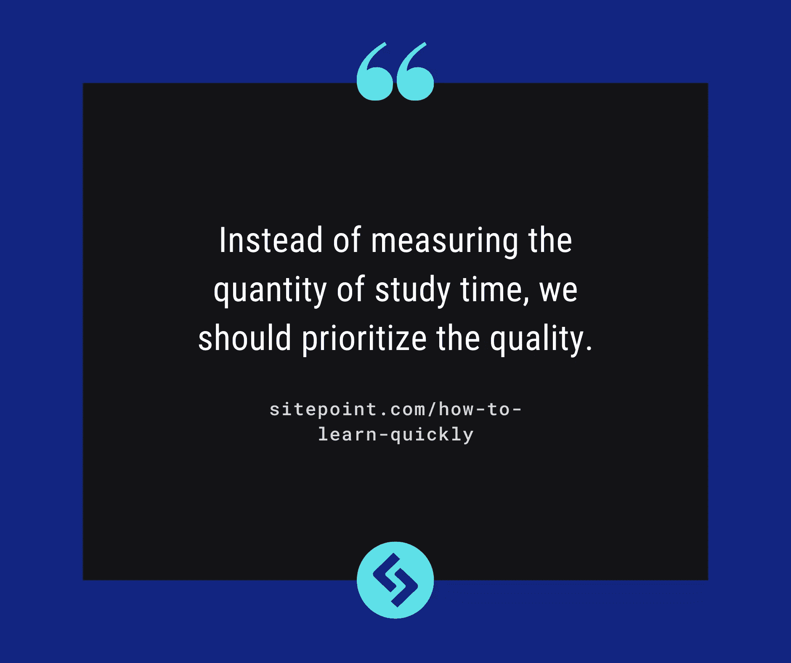
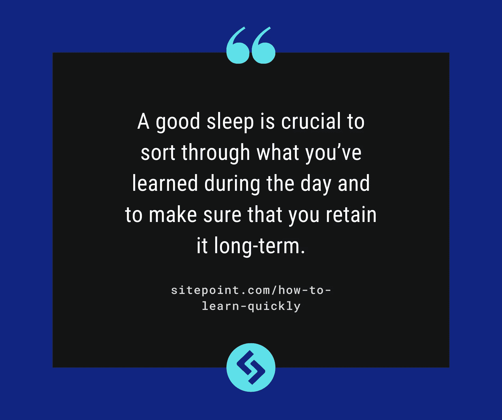
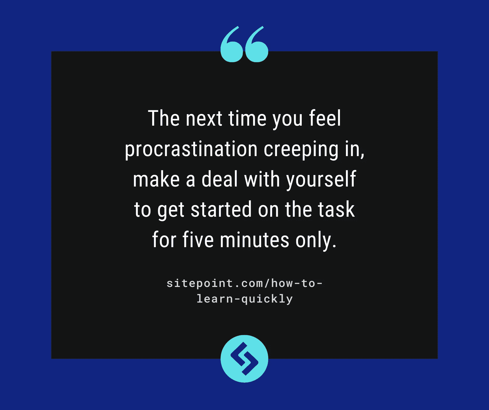
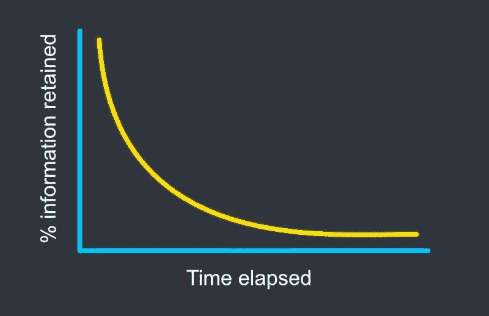
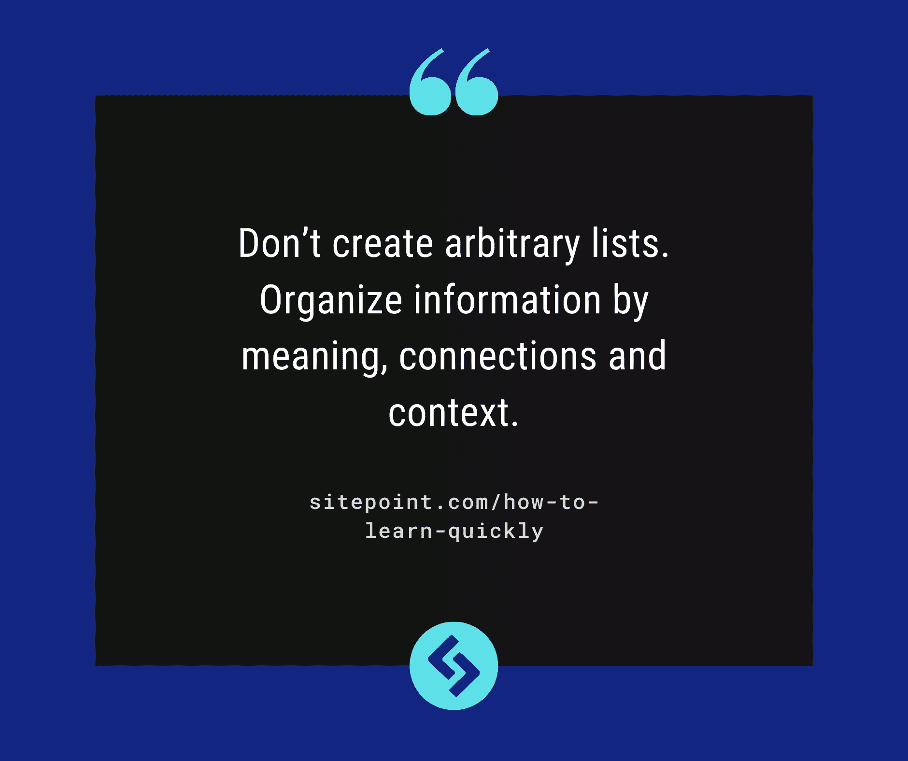
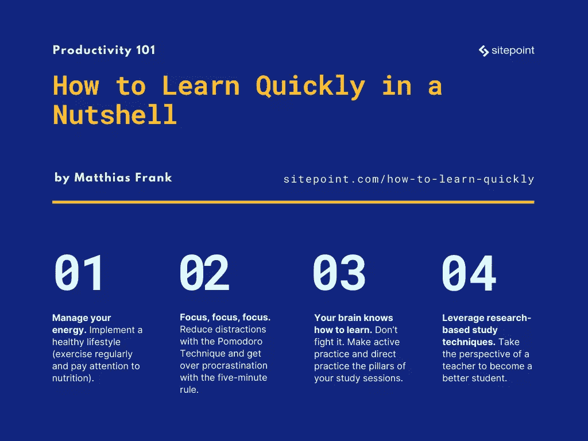

# 如何快速学习:掌握任何技能的 10 种行之有效的方法

> 原文：<https://www.sitepoint.com/how-to-learn-quickly/>

在这篇文章中，我们将介绍十种行之有效的掌握任何技能的方法。你将学会如何快速学习，加速你的个人成长，从人群中脱颖而出，而不必花每一分钟在课本上。

## 快速学习的一个关键技能

如果我告诉你有一种技能可以让任何人、任何地点、任何时间受益，你会怎么说？不管你选择什么样的职业道路，它都能加速你的进步，不在乎技术的破坏？

这听起来好得难以置信吗？好吧，这里有一句话:在一个变化比以往任何时候都快的世界里，你需要快速而持续地适应。这需要改变的意愿和学习的能力。快速学习——并成为终身学习者——应该成为你新的超能力。你无法阻止世界的变化，但是有了这种适应能力，你将会是第一个拥抱变化并利用变化为自己谋利的人——你也会让潜在的雇主感到惊讶。

## 快速学习意味着什么

当我们想到快速学习者时，我们可能会想起那些在我们的学校和大学时代的少数人，他们似乎可以轻松地通过课堂。或者我们会记得那个记忆力冠军，他有独特的能力，不仅能记住圆周率的前六位数字(3.14159 btw) [，还能记住 65，536 个数字](https://www.nytimes.com/2019/01/09/smarter-living/train-your-brain-like-a-memory-champion.html)。六万五千！多么令人印象深刻的壮举。这些人的确很特别。或者他们必须每天练习一整天。

不过，问题是:你也可以学习这项技能。没有超能力，只为少数有天赋的人保留，或者只有通过药物和补充剂才能实现的东西。好消息，是吧？

成为一个快速学习者简单来说就是知道你的大脑(和身体)是如何学习的。)工作，以及如何据此量身定制自己的学习活动。每个人都能做到。这是一种技能。以下是方法。

## 管理精力，而不是时间

不要在时间管理上费心。管理你的能量。重要的事情先来:你花多少时间学习并不重要。

好了，我说了。考试前开夜车，参加 12 小时的 YouTube“和我一起学习”课程，或者在午夜过后很久还在看书，这些都不是不必要的。他们积极破坏你的进步。

当然，你需要投入时间来学习一项新技能。但更重要的是，你需要投入精力。

把精力看作是你学习努力中最相关的资源。你的大脑掌握新概念或提出新想法的能力并不取决于你做笔记的时间，而是取决于你做笔记时的精神状态和可用能量。

能源是有限的资源。把你的能量水平想象成类似于你的银行账户会有所帮助。你已经有了一定的存款(希望如此),也许还会有超出这个数额的提款补贴。但在某些时候，你必须重新充电，否则你会筋疲力尽。

让我们仔细看看。

### 1.停止破坏你自己的成功

如果你是那 20%在学期中经常熬夜的美国学生之一，你应该知道,[科学界很少考虑这种提高产量的策略。相反，睡眠不足会导致替补席上表现不佳，并可能阻碍你的长期记忆形成。](https://www.med.upenn.edu/csi/the-impact-of-sleep-on-learning-and-memory.html)

因此，尽管通宵熬夜可以创造好故事，但在有效学习(和可持续学习)方面，它们不会对你有太大帮助。

更重要的是，因为我们太习惯于用时间来衡量我们的学习努力，我们开始用这些疯狂的长时间作为我们再次实现的基准，每当我们没有达到目标时，我们就会感到失望和沮丧。

我们不应该衡量学习时间的数量，而应该优先考虑质量。每天投入几个小时的高能量工作，你会大大超越你以前的夜班僵尸。

### 2.如何在睡梦中学习

我有一些坏消息要告诉你:如果你希望在睡梦中通过播放背景音乐被动地学习一些东西，那是行不通的。这个帮助你学习的方法[没有通过科学测试](https://www.bbc.com/future/article/20140721-how-to-learn-while-you-sleep)。

然而，好消息是你真的可以在睡梦中学习。只是工作方式略有不同。所谓的慢波或[非快速眼动睡眠周期帮助你的大脑将短期输入转化为长期记忆](https://www.bbc.com/future/article/20180815-why-sleep-should-be-every-students-priority)。更重要的是，这个过程有助于你的大脑找到现有想法的模式和联系，从而增加你创造性解决问题的潜力。

但不止于此。睡眠还能帮助你重置大脑接收新信息的能力。所以下一次当你感觉你的脑袋被塞得满满的，你不能再练习了，考虑休息一下小睡一下或者睡个好觉。

因此，虽然你不能利用睡眠时间向大脑中输入更多的信息，但一夜的良好睡眠对于整理白天学到的知识并确保长期记忆是至关重要的。

如果你对此感到困扰，这里有一些让你获得更多睡眠的方法:

*   **下午两点后没有咖啡因**。虽然咖啡因的效果几乎在饮用后立即产生，但它会在你的系统中停留几个小时。饮用六小时后，一半的咖啡因仍会残留，影响你的睡眠。
*   **建立一个早晚的作息规律**。夜间的例行公事会向你的身体发出信号，是时候休息了。正确的晨间例行公事会让你走向成功，并确保你不会在醒来后的第一个小时里浏览末日信息(不，按特定顺序查看社交媒体不算早间例行公事)。
*   **睡前避免高度刺激的活动**。帮助你的身体(和大脑)进入夜间模式，不要在接近睡觉时间的时候增加能量。要避免的事情包括高强度的锻炼、充满活力的音乐、油腻的食物、令人兴奋的读物或过于紧张的电视节目。
*   **改善你的睡眠环境**。虽然有很多因素有助于一夜好眠，而且不是每个人都可以挥霍在最新的床垫潮流上，但有很多事情你可以很容易地实现，以获得良好的睡眠。最重要的是，有一个黑暗的房间，没有或最少的光源。如果需要，买一些遮光窗帘(有很多非常实惠的选择)。理想情况下，把你的手机放在卧室外面。

## 提高你的注意力

一旦你的能量水平上升并稳定下来，并且睡了一个好觉，是时候把你的注意力转移到…你的焦点上了。

这里的“专注”指的是你真正坐下来研究一个话题的能力。这是一种技能，它阻止你本周第三次打扫房间，而不是处理书中的新章节。

不管你有多少精力，如果你不能把它用在你的学习项目上，那就没什么用了。

### 3.你需要一个西红柿

一个西红柿实际上会有助于你的学习技能。所谓的 [Pomodoro 技术](https://en.wikipedia.org/wiki/Pomodoro_Technique) (pomodoro 在意大利语中是番茄的意思)是以其发明者使用的番茄形状的厨房定时器命名的。

使用计时器碰巧也是一种非常有效的提高学习效率的方法。

它是这样工作的:

*   将你的计时器设置为 25 分钟。(不一定要做成西红柿的形状，但是会有点酷。)
*   学习。不要因为任何事情打断你的学习。只有 25 分钟。几乎任何事情都可以等到你做完。
*   一旦计时器响起，立即停止。这训练你的大脑在学习时间和休息时间之间有一个清晰的界限，并使它更有可能在 25 分钟内真正集中注意力。
*   快速休息五分钟。避免过度刺激的活动(所以理想情况下，不要开始滚动社交媒体)。相反，伸展一下，观察你的呼吸或者整理一下你桌子上不知何故堆积起来的 16 个咖啡杯。
*   再重复两到三次，然后休息一段时间。

为什么有效？

多任务处理是一个神话。你的大脑不是同时做两件事的。相反，它会在任务之间快速切换。每一个开关都要耗费精神带宽。上下文切换的代价比我们想象的要大得多。在学习过程中快速回答一条短信不仅仅花费两分钟。研究表明，回到专注状态需要 25 分钟。

但是，当我们决定在接下来的两个小时里学习时，很难不断地击退分心的事物。取而代之的是，很容易拿起电话“快速查看我的信息”或回复收件箱里的一封半紧急邮件。

因此，不要指望你会不顾无数可能的干扰，设法保持两个小时的专注，而是创建更小、更密集的学习会议，并学会明确区分学习和休息时间。

### 4.用五分钟规则战胜拖延症

拖延的潜在原因有很多。一项任务可能会被认为太难或太松散。或者只是让你感到无聊。但不管是什么，在我们开始一项任务之前，我们的内在阻力通常是最强的。

这就是五分钟规则的由来。这是说服你自己的一个简单的技巧，它会起作用的，即使你知道你将要欺骗自己。

下一次当你感觉拖延症悄悄来临的时候，和自己做个交易，只花五分钟开始这项任务。几分钟后，你可以停下来做些别的事情。不过，你可能会继续手头的任务，因为你已经跨过了第一个障碍，获得了一些动力。

它还与番茄工作法完美结合。番茄工作法是为了减少你工作时的分心，而五分钟法则是每次单独工作的开始。

### 5.注意你的环境

读过詹姆斯·克利尔的《原子习惯*】的人都意识到，你所处的环境对你的潜意识行为有多么大的影响。这对你的学习过程和习惯培养都是如此。你会想要设计你的环境来支持你的学习努力，而不是反对它们。这里有一些指导思想:*

*   把你的手机放在不同的房间，让它很难访问 YouTube 或社交媒体。最近的研究表明，一项任务所需的[感知努力可能与估计的机会成本](https://www.scotthyoung.com/blog/2021/05/03/effort-opportunity-cost/)有关。不幸的是，社交媒体、视频游戏或简单的 YouTube 视频都被设计成对我们的大脑非常非常有吸引力——所以感知机会成本很高。帮助你的大脑排除这些选择，以降低另一次学习的努力。
*   在每次学习开始的时候建立一个简单的程序。它可以像倒一杯茶和放一些学习音乐一样简单。比套路更重要的是，你给大脑发信号:现在该学习了。或许甚至可以计划好你整个学习周。
*   同样的建议是把你的学习空间和放松空间分开。专用房间是最好的，但是如果这种奢侈不是一个选项，那么只为学习保留一个位置。如果你房间里的每样东西都有多种用途，那么在你结束一天的工作后，最好把所有的学习材料都拿走，只在下一次番茄大战结束时再放回去。
*   最后，整理房间和清理你的桌子是减少与无序空间相关的信息过载的好方法。你的数字空间也是如此。不，把所有文件都放在你的桌面上，依靠苹果的 Finder 来发现文件，这不是一个好的个人知识管理方法。

## 了解你的大脑是如何工作的

随着我们新获得的激光焦点和能量水平仍然足够高，让我们仔细看看科学对获得新技能有什么说法。

### 6.大多数人对学习的误解

当我们在学校时，我们学会了一种简单的学习方法。我们听老师讲课，记笔记，也许读一本书…然后写更多的笔记。一旦考试时间到了，我们就开始重读笔记，直到我们对这个话题有足够的信心。

这种方法有很大的缺陷，并不真正适合我们大脑处理信息和学习新技能的方式。

首先，我们没有练习我们真正想要掌握的新技能。很有可能，你不会被测试“写笔记，以后再读”。你必须通过选择题测试或者在学校写一篇论文。后来，你可能想创建一个网站，学习一门新的语言或掌握一首新的吉他歌曲。在每种情况下，最有效的学习方法是实践你想要掌握的新技能。

这种所谓的[主动练习](https://matthiasfrank.de/the-three-principles-of-effective-learning/)很重要，因为我们的大脑很难[将知识和技能从一个区域转移到另一个区域](https://www.scotthyoung.com/blog/2020/05/04/do-the-real-thing/)。所以，如果你想让事情对你的大脑来说更容易，就做真正的事情，围绕你想要的结果来设计你的实践——而不是你在学校里学到的默认路径。

其次，可能更重要的是，重读笔记是一个坏主意，还有另一个原因。当我们试图将一个想法灌输到我们的大脑中时，我们的大脑实际上并没有获得知识。我们通过尝试从那里得到一些东西来学习。

研究表明，重读笔记是一种价值很低的学习活动。[在研究](https://science.sciencemag.org/content/331/6018/772.full)中，学生被分成四组，按照以下规则完成完全相同的事情:

*   第一个人被允许阅读一次材料
*   第二个被允许阅读材料四次
*   第三个被要求在阅读一次后创建一个思维导图
*   第四组在阅读一遍材料后，试图回忆材料的内容

第四组远远超过所有组。努力记住你读过的内容比再读三遍更有效。

所以，要想学得更快，提高你的长期记忆能力，关键在于不断测试自己对新知识的掌握程度。重读对你的脑细胞的帮助远不如积极回答这个话题的问题。这种自我测试策略被称为**(或 [**主动练习**](https://matthiasfrank.de/the-three-principles-of-effective-learning/) )，它将成为你学习时新的最好的朋友。**

 **### 7.间隔重复会让你成为记忆大师

如果你曾经试图回忆起你在学校或大学生涯中很长时间没有重温的一些更高级的课程，你可能经历过[艾宾浩斯遗忘曲线](https://www.mindtools.com/pages/article/forgetting-curve.htm)。

简单地说，随着时间的推移，你将不可避免地忘记事情。从好的方面来看，通过一点战略性的重复，你可以大大提高长期记忆力。

关键是要分开单独的学习时间，而不是总是聚在一起练习。每周学习三次，每次一小时，连续四周比一天学习相同时间更有效。这被称为**分布式练习**，也被称为**间隔重复**。

如果你想在学习过程中实现间隔重复，你有很多选择，取决于你想要的复杂程度和可定制性:

*   Anki 是最受欢迎的开源工具，用于创建内置间隔重复的抽认卡。对于初学者来说，这是一个很好的工具。
*   RemNote 是一种更高级的笔记工具和间隔重复工具的混合体。它有更高的学习曲线，但提供了巨大的潜力。
*   [概念](https://www.notion.so/)是一个一体化的工作空间应用程序，提供了最大的灵活性，尽管用这个工具从头构建一个系统可能会令人生畏。[使用预建模板](https://matthiasfrank.de/your-study-planner-in-notion/)可能是一个不错的选择。

### 8.乐高能教会你什么关于学习

当你买乐高玩具时，你可以得到一个有具体说明和大块特殊部件的积木套件，或者你可以简单地得到一大桶小块彩色积木。后一种选择意味着你将花费更多的时间从这些千篇一律的块中构建出一些东西。

你的大脑以类似的方式工作。一次处理几件事也不算太神奇。如果我让你记住字母 A A B D G N P S U 直到这篇文章结束，你可能很难把注意力集中在这篇文章上。虽然只有几个字母，但它将在你的大脑中形成一个信息超载。

如果我告诉你记住缩写词 NBA、USA 和 GDP(恰好有完全相同的字母)，同样的事情看起来会有很大的不同。

这是因为你的大脑可以使用一种叫做**分块**的东西来将无序的比特组合成更大的单元，从而帮助你更容易地记住信息。这就是为什么在你上学的第一年学习基本的数学运算会令人生畏，但一旦你转向更复杂的话题，它们或多或少会自动发生。你的大脑已经围绕这些操作创造了知识块，并有更多的资源可用于处理高级问题。

利用这一点，通过寻找将新的信息组合在一起的方法来获得自己的优势。当你面对一个新概念时，这一点尤其重要，因为你不太可能已经有现成的知识结构。

所以，下次你在学习一个新领域的关键点，或者刚开始学习一些新的材料时，不要只是随意地列出清单。相反，你应该通过意义、联系和任何非正式的标准来组织信息。

## 使用正确的学习技巧

为了使事情更完整，我们来仔细看看两个非常有用和有效的学习策略。

### 9.就像我五岁时那样解释:费曼技巧

没有什么比养成向他人解释你新获得的知识的习惯更能提高你的学习了。

费曼技术是以著名物理学家[理查德·费曼](https://en.wikipedia.org/wiki/Richard_Feynman)、[的名字命名的，它是将一个想法或概念分解成各个组成部分，并尽可能简单地解释它(用你自己的话来说)。](https://medium.com/taking-note/learning-from-the-feynman-technique-5373014ad230#:~:text=The%20Feynman%20technique%20for%20teaching,was%20a%20student%20at%20Princeton.)

为了进入正确的心态，想象你正在向一个孩子解释新概念是有帮助的。

首先，拿一张空白纸，写下你所知道的关于这个概念的一切。以一种对你来说有意义的方式列出要点。不要使用任何第一手资料。仅依靠你目前的理解水平。

只有当你卡在某个地方的时候，再回到最初的源头去填空。这样，你就能确保自己确实知道自己不知道的东西——这一步通常比寻找正确答案更难。

一旦完成，再次浏览解释并检查摩擦。有连贯的结构吗？你在哪里依靠一个你不完全理解的假设？你藏在复杂性背后的什么地方，而没有真正抓住它的要点？

最后，尽可能简化你的解释。你在哪里使用了会阻止外人(或孩子)理解的技术术语？有没有一个比喻或例子可以让事情变得更简单？

如你所见，这不是任何新信息的策略。这是一个漫长的过程，应该留给新话题的关键点。但是把它应用到复杂的问题中，看看新概念如何迅速变得更加直观。

### 10.如何通过练习更快地学习复杂的话题

创建一个伟大的网站所需的具体技能是丰富的。你需要了解布局和设计；了解用户需求以及他们将如何浏览你的网站；当然，您可能需要知道如何编写一些代码。你需要能够结合很多不同的技能，以达到预期的效果。

这种复杂主题的问题是在执行任务时缺乏明确的反馈。

反馈对任何学习努力都是至关重要的。理论上很简单:你把自己的实际结果和想要的结果进行比较。但是好的反馈很难得到。通常，是你的最终结果被评分或评估。网站实际表现如何？它实现了你客户的目标吗？

但这意味着你总是判断各种因素的总和，无法真正轻松地找出你最大的弱点在哪里，从而找出你最大的增长潜力在哪里。更高层次的反馈必然会忽略一些细节。之所以嘈杂，是因为它把几个技能子集混在了一起。

这个问题可以通过**演习**来解决。

训练就是把一个大任务分解成更小的、独立的部分，然后孤立地练习它们。创建许多不同的网站设计，并简单地根据它们的审美来评判它们。专注于用户旅程，忽略所有其他因素。尝试为一个随机的、给定的设计编写尽可能流畅和优雅的代码。

这不仅增加了反馈的相关性，还能帮助你训练技能，而不需要投入大量时间来完成任务。你也将更快地提高你的技能，因为你可以发现你最大的弱点，从而增加你的学习课程的边际效用。

## 如何成为快速学习者(简单来说)

最后，让我们重温一下我们在本文中分享的经验:

1.  管理你的能量。实行健康的生活方式(定期锻炼，注意营养)。永远不要用一夜好眠来换取更多的临时抱佛脚。
2.  **对焦，对焦，对焦**。用番茄工作法减少分心，用五分钟法则克服拖延症。通过设计帮助你而不是阻碍你的环境来为你的成功做准备。
3.  你的大脑知道如何学习。不要反抗。让积极练习和直接练习成为你学习的支柱。使用空间重复和组块使长期记忆变得容易，就像玩乐高积木一样。
4.  **利用基于研究的学习技巧**。站在老师的角度，成为更好的学生。并通过在练习中深入操练来消除自己的薄弱环节。

如果你有兴趣了解更多，可以看看这个关于有效学习的文章集。如果您准备开始自己的学习之旅，成为一名开发人员，请不要错过我们专为这些原则设计的 Ultralearning 系统。

## 分享这篇文章**