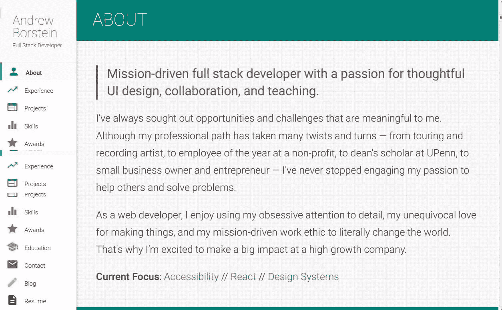
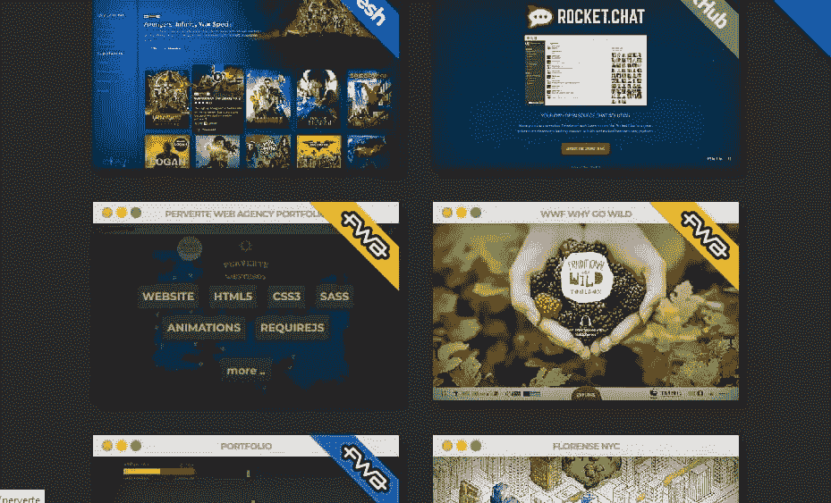
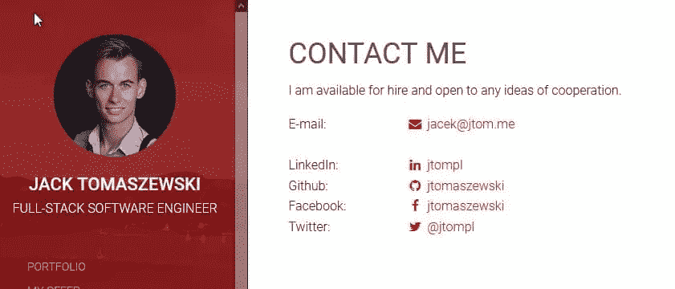
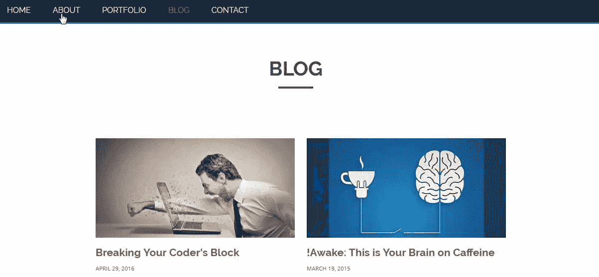
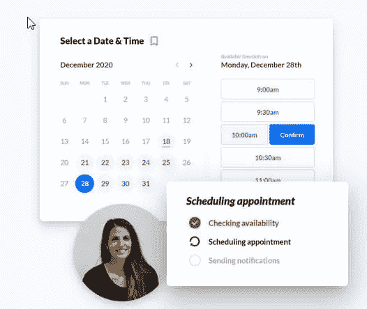

# 创建一个作品集来展示你的工程能力

> 原文：<https://www.sitepoint.com/portfolio-showcase-engineering-abilities/>

作品集已经被用来提升平面设计师、摄影师、平面插画师和艺术家，但它们对软件工程师和开发人员同样有用。软件工程师不仅仅是一直写代码的人。通常情况下，软件开发人员来自不同的专业背景和职业轨迹，并且对很多事情都充满热情。作品集展示了软件工程师的创造性，他们不仅愿意花时间向公众解释他们的工作，还愿意向招聘人员、招聘经理和其他工程师解释他们的工作。

## 什么是投资组合，为什么你需要投资组合

作品集不仅仅是一份简历。这是一个进入你的创造力和工程技术世界的入口。就像一家公司通过其服务和产品的组合来宣传其品牌一样，作为一名软件工程师，你也可以这样做。

文件夹记录了简历中通常没有的内容。作为一名软件工程师，你就是你所做的。照片对于摄影师就像项目对于工程师一样。

你的简历可能会提到你目前拥有的技能，但如果没有项目来应用它们，它们就只是一堆标签。投资组合根据项目和适销技能组织通常在简历中发现的信息。

为了跟上快速的技术变化，你应该掌握最新的技能。技能通常与你在工作中或业余时间完成的项目有关。如果只是简单的文本，简历可能会很无聊。项目组合可以记录您的项目，突出与这些项目相关的技能，并链接到现场演示、视频演练和源代码库。

像简历一样，作品集也可以打印，但最好是交互式网站的格式，这样就可以在网上搜索到，并且总是与你的最新项目保持同步。

如果你在一个项目中遇到了挑战并成功地解决了它们，把这个项目记录在文件夹中。这样做不仅能证明你的技术成就，还能凸显你解决问题的技巧和毅力。

在求职面试中，一份作品集可以成为与招聘人员、招聘经理和其他工程师的谈资。谈论你的投资组合可能会给你未来的老板留下不可磨灭的印象。

## 规划投资组合

像任何其他 web 开发项目一样，您的 portfolio 网站可以用许多不同的方式实现。在计划你的作品集项目时，考虑问这些问题。

*   **静态还是动态？你的网站将是一个静态生成的页面集还是一个带有数据库的动态页面集？**

*   单页还是多页？您的作品集网站会以单页应用程序或 [SPA](https://en.wikipedia.org/wiki/Single-page_application) 的形式出现，还是以多页网站的形式出现？

*   **有求必应？**您的作品集网站可以跨多种浏览器、平台和设备移植吗？

*   你的预算是多少？您是否希望花费大量时间和金钱来制作您的投资组合网站？

回答这些问题将有助于你决定在哪里建立和托管你的投资组合。

## 投资组合里有什么

创建作品集网站就像写一篇文章。首先，你需要创建一个你想要在你的作品集网站中包含的内容的大纲。以下是一些建议。

### 关于部分

因为作品集网站是关于你和你的成就的，记得用友好但专业的方式介绍你自己。除了你的名字和角色之外，试着添加一个原创的标语或引语来表达你的个性。如果你有一个符合你的潜在客户或招聘人员要求的目标，为你的下一个项目或角色添加一个简短的目标列表。虽然不是必须的，但是也可以描述一下个人兴趣。

下图显示的是安德鲁·博斯坦的页面。

### 项目

你的作品集网站的关键是你的项目。退后一步，看看你过去的成就，选择几个你自豪地展示的项目。对于每个项目，您可以执行以下操作:

*   根据文字、图片、视频和源代码(如果有的话)，组织描述项目所需的所有信息。
*   以网格或列表方式排列项目。
*   标记创建项目所涉及的技能，包括编程语言、环境、框架和部署。

这是拉斐尔·卡法拉提的作品中的一个例子。

### 联系页面

提供足够的联系信息，以便通过电子邮件、电话或网络表单联系到您。列出招聘人员可以更多了解你的其他链接，如 LinkedIn、GitHub 和/或 Twitter 个人资料的链接。

这里有一个杰克·托马舍夫斯基投资组合网站的例子。

### 博客

链接到你维护的记录你的思维过程和写作技巧的博客。招聘人员同样对你的沟通风格和合理的推理感兴趣。

下图显示了来自[马修·威廉姆斯](http://findmatthew.com/)的一个例子。

### 约会页面

如果你是一名自由职业者，接受潜在客户的预约，嵌入一个日历应用程序或提供一个链接。简化人才招聘人员与你谈论他们正在招聘的职位或项目的流程。

## 托管您的投资组合的方式

在你有了一个在你的作品集网站上展示什么的粗略想法之后，是时候看看你可以在哪里建立和托管它了。幸运的是，有很多选择。其中一些是免费的、付费的、独立的或基于社区的。你可能也有兴趣从头开始建立自己的作品集网站，并把它放在网上。虽然不全面，但这里有一个可供考虑的选择列表。

### 带有代码库的项目组合

如果你用 [Git](https://git-scm.com/) 来管理你的项目，这是一个免费的、开源的、分布式版本控制系统，你可以在 [GitHub](http://github.com) 、 [GitLab](http://gitlab.com) 、 [BitBucket](https://bitbucket.org/) 等地方在线托管你的代码库。

您可以使用 [GitHub Pages](https://pages.github.com/) 为您托管在 GitHub 上的项目生成一个静态网站。你可以选择几个现成的主题来为你的投资组合网站增添趣味。类似地，GitLab 提供 [GitLab 页面](https://docs.gitlab.com/ee/user/project/pages/index.html)，BitBucket 提供 [BitBucket Cloud](https://support.atlassian.com/bitbucket-cloud/docs/publishing-a-website-on-bitbucket-cloud/) 来托管一个静态投资组合网站，分别来自 GitLab 和 BitBucket 创建的项目。

作为替代， [Git Showcase](https://www.gitshowcase.com) 是一个方便、易用且独立的作品集生成网站，允许您导入 GitHub 资源库的链接，并选择您希望展示的内容。您可以通过为每个选定的项目添加自定义图像来美化您的作品集。这里有一个样本[演示](https://www.gitshowcase.com/showcasecat)。

如果您没有太多时间，但仍然想要一个现成的主题来展示您的开源项目，以上选择非常方便。这可能适合后端软件工程师，他们更看重功能而不是创造力。

### 社区投资组合

如果你喜欢在一个支持设计师和开发人员社区的平台上创建作品集，并且你想从其他已发布的作品集中获得灵感，看看下面的资源。

*   [**Carbonmade**](https://carbonmade.com) 是一个流行的投资组合生成网站，支持许多布局和设计、无限的图像和视频、分析等等。它有一个免费试用选项，让你设计自己满意的作品集，只有当你准备出版时才订阅付费计划。要想知道别人在你之前创造了什么，请访问[人才库](https://carbonmade.com/portfolios)。尽管 Carbonmade 是为平面设计师和插画师设计的，但它也适用于有优雅品味的软件工程师。

*   Coroflot 是一个免费的平台，让设计和创意专业人士建立和托管他们的投资组合，宣传他们的服务，并与招聘人员联系。如果你是一名软件工程师，从事产品设计和开发、网页设计、UX/用户界面和可用性工程，你可以在 Coroflot 建立自己的形象，向他人学习，并获得下一个职业机会。

*   [**SquareSpace**](https://www.squarespace.com) 是一个完全集成的丰富平台，专门从事电子商务、会员、博客、启动页面，甚至[投资组合](https://www.squarespace.com/templates/browse/topic/popular-designs/type/portfolio)。一旦你成为会员，你就可以在 SquareSpace 的市场上为你的服务或产品做广告。在这个平台上，您还可以加入 SquareSpace 的论坛，与其他 SquareSpace 用户和专业人士一起学习和讨论最佳实践。SquareSpace 还提供网络研讨会，帮助您磨练成为 SquareSpace 专家的技能。如果你决定使用 SquareSpace，你可以从它的[预约安排](https://www.squarespace.com/scheduling)扩展中受益，该扩展可以完美地集成到你的投资组合网站中。你可以从 SquareSpace 开始，成为一名试用会员，在订阅付费计划之前体验许多功能。

*   [**Dunked**](https://dunked.com/) 是摄影师、设计师、艺术家、插画师经常光顾的商业平台。作为一名软件工程师加入社区将是一个很好的补充，因为你可以探索各种布局和模板来创建一个令人敬畏的组合，这将增加一点档次。Dunked 提供了一个简洁易用的界面，用于设计和构建能够在各种设备上响应的投资组合。在 10 天的免费试用期内查看它的产品。

如果你渴望一个社区，渴望从其他人那里获得灵感，可能想在社区中宣传你的服务或联系会员招聘人员，那么建立一个有支持性社区的作品集网站是值得考虑的事情。和其他有创意的设计师在一起可能会给前端 UI/UX 开发人员带来灵感。

### 具有组合主题的独立网站

如果你更多的是一个独唱者，不需要社区的支持，你仍然可以建立一个以作品集为主题的网站来展示你的作品。考虑一下这些精心挑选的选择。

*   [**Google Sites**](https://sites.google.com) 是免费为拥有 Google 账户的用户搭建的静态网站。在它支持的许多主题中，一个您可以定制的项目组合主题将是您所需要的。

*   **，顾名思义，可以让你建立非常漂亮的、手机友好的单页或多页网站。提供免费和付费计划，惊人地是一个整洁的选择，以建立和主持您的下一个投资组合网站。查看其[作品集模板](https://www.strikingly.com/make-a-portfolio-website)，从实时客户网站中获取灵感，并亲自探索。**

***   [**Blogger**](http://blogger.com) 是另一个谷歌产品，它让谷歌用户使用许多现成的模板创建免费博客。你可以通过安装第三方作品集主题把博客变成作品集网站。在这里探索和下载制作精美的免费主题。

    *   WordPress 是一个对公众免费开放的开源内容管理系统。WordPress.com 提供免费的[作品集主题](https://wordpress.com/themes/portfolio/free)，你可以申请将一个普通的博客转换成作品集网站。WordPress 网站的自托管版本给你更多的控制和定制，在许多云服务上可用，如 [AWS](https://aws.amazon.com) 和共享网络托管服务，如 [Hostgator](http://hostgator.com) 。在部署了一个自托管的 WordPress 网站后，你可以浏览其连接的市场，寻找免费和付费的组合主题。** 

 **### 从头开始构建

最后，如果你有冒险精神、创造力和耐心，你可以利用你的 HTML、CSS 和 JavaScript 知识，从头开始创建一个定制的、静态的作品集网站，并把它放在网上。

如果你精通 [Django](https://djangoproject.com) ，你可以构建自己的 portfolio app 并将其托管在云端，比如[亚马逊网络服务](https://aws.amazon.com/)、 [Azure](https://azure.microsoft.com) (微软 Azure 云计算服务)或[谷歌云](https://cloud.google.com/)。这里有几个开源 Django 组合项目，可能会启发你构建自己的应用程序或克隆现有的应用程序。

*   Django Portfolio by Avinash 是一个很棒的投资组合网站，展示一个人的工程技能和才能。查看 Avinash 的 [GitHub 库](https://github.com/avinashz14/portfolio)。

*   法里斯的 Django Portfolio 是另一个令人惊叹的投资组合网站，你可以从中获得灵感。探索法瑞斯令人敬畏的 [GitHub 库](https://github.com/ashraffaris42/faris-Personal-Portfolio)。

*   Ray McBride 开发的 Django Portfolio App 是一款包装精美的 Portfolio App，您可以开箱安装和构建。

如果你是一名 Node.js 的开发者，看看这些精彩的开源项目，从中获得一些灵感。

*   [布雷南·布朗](http://duck-project.herokuapp.com/project)的作品集项目利用了 Node.js、 [Express](https://expressjs.com/) 、 [Bootstrap](https://getbootstrap.com/) 和 [jQuery](https://jquery.com/) 。查看布伦南的 [GitHub 回购](https://github.com/brennanbrown/duck-project)。

*   Lucy Kang 的 Portfolio project 是一个托管在 Azure 上的整洁的开源项目。看一眼露西的 [GitHub 库](https://github.com/lucykang/Node.js-Portfolio-Website)。

*   Anand Kumar Jha 的 Portfolio Project 是一个用 Node.js、 [React](https://reactjs.org/) 和 [React-Bootstrap](https://react-bootstrap.github.io/) 构建的很酷的项目。这里是 Anand 的 [GitHub 库](https://github.com/akjha96/ReactifolioBs4_Akj)。

## 结论

获得一份工作并不容易。简历往往是第一步。然而，如果你用一个实时互动的作品集网站来补充你的简历，这样做可以充分展示你的技术经验和专业知识。投资一个令人印象深刻的投资组合会提升你的市场竞争力，帮助你找到理想的工作。** 

## **分享这篇文章**