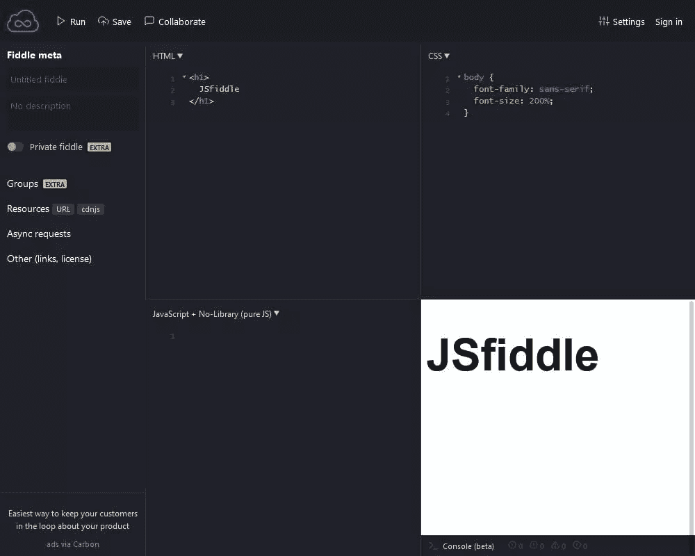
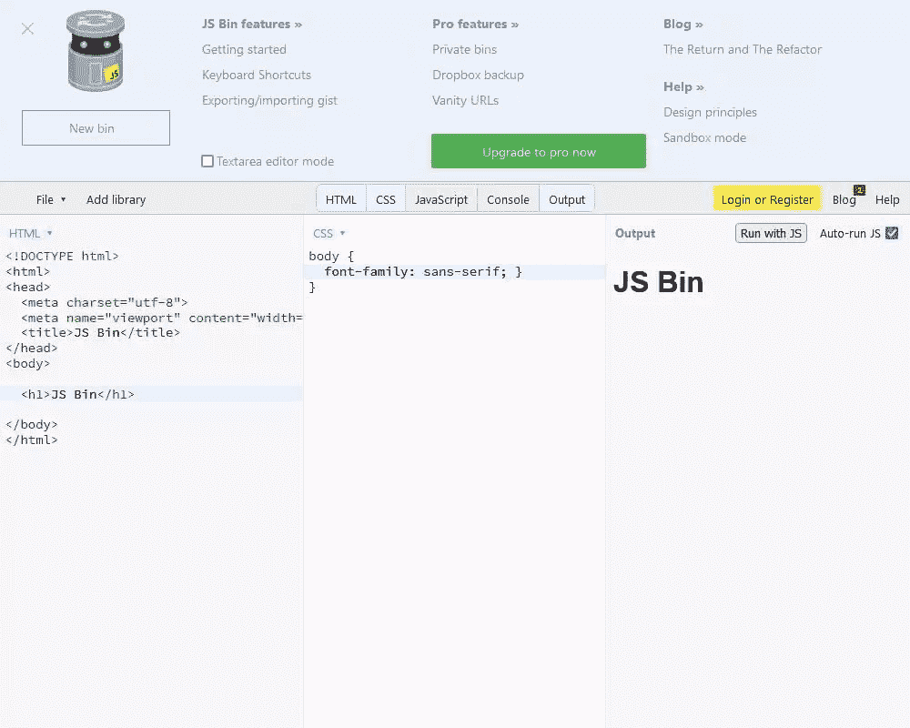
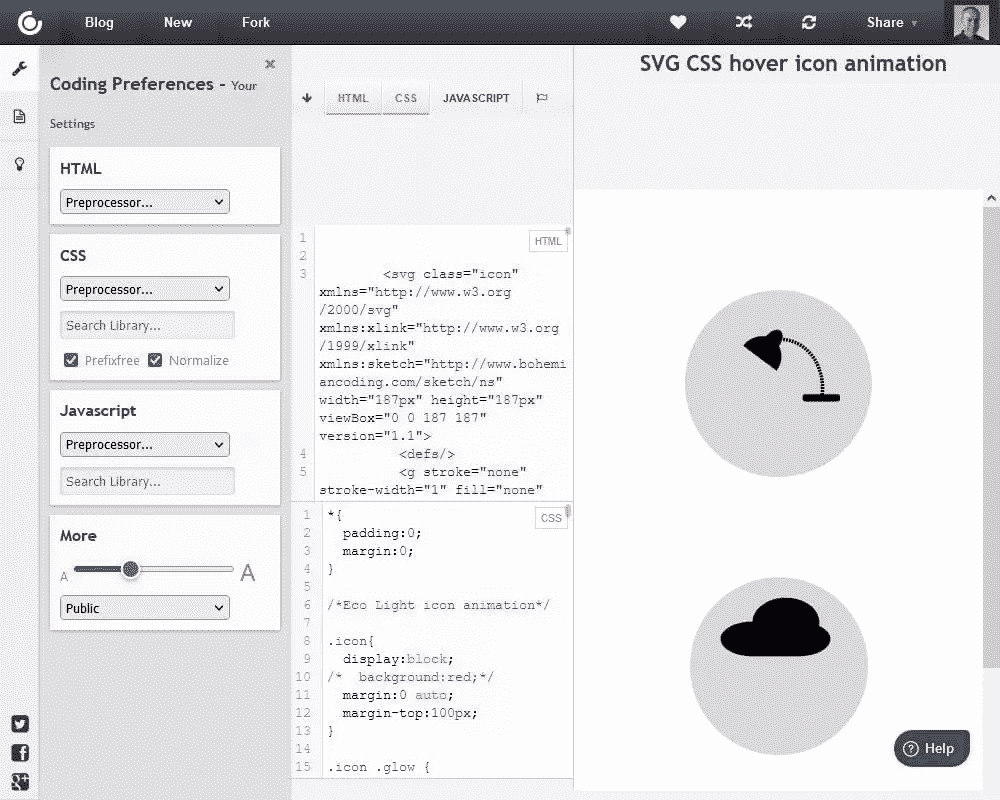
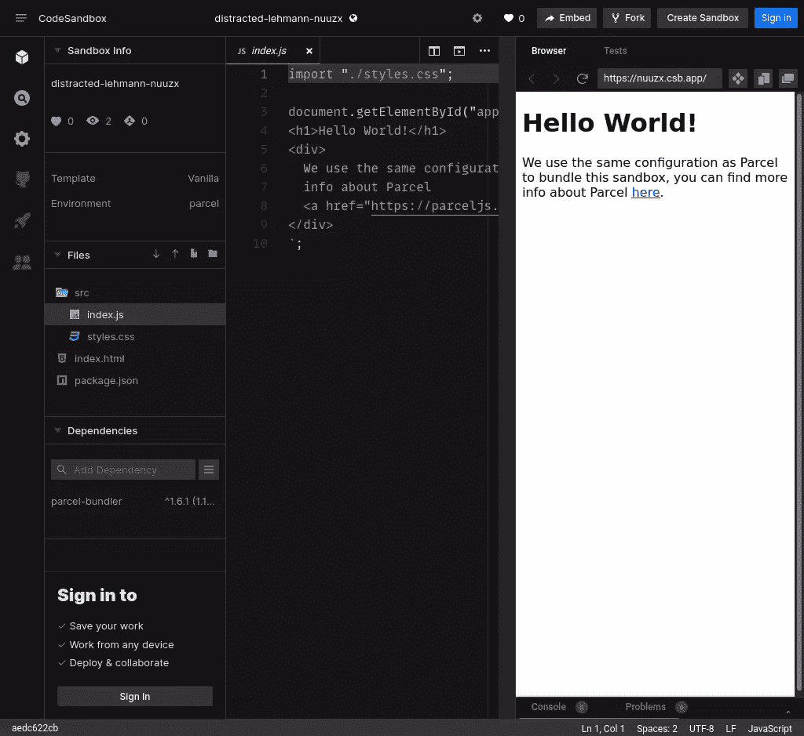
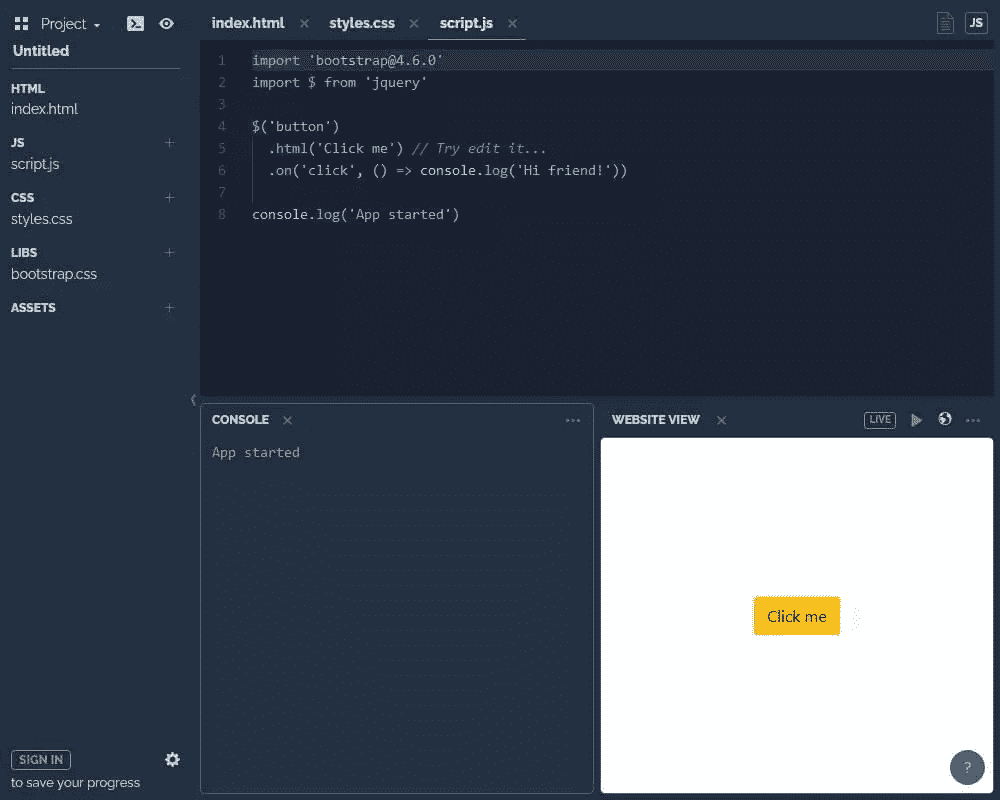
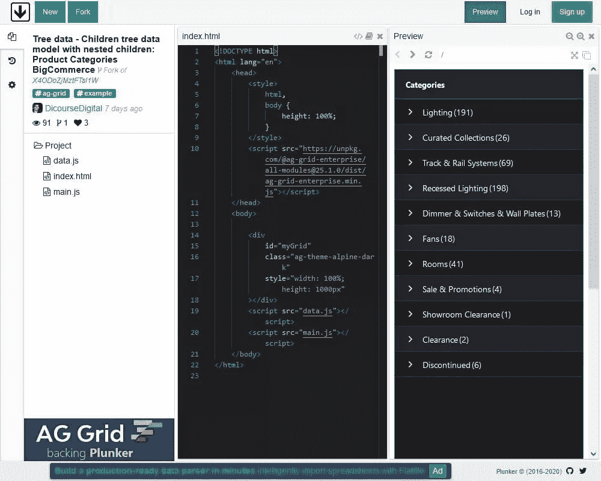

# 7 个最好的 Code Playgrounds & CodePen 替代品

> 原文：<https://www.sitepoint.com/code-playgrounds/>

**这些年出现了各种各样的前端代码运动场。大多数都提供了一种快速而肮脏的方法来试验客户端(有时是服务器端)代码，然后与他人分享。最流行的是 CodePen，你很可能见过它，甚至用过它。这是一个很好的工具，但不能提供你的笔可能需要的一切。以下是我们对七个最佳方案的观察，比较了 CodePen 和一些 CodePen 替代品。**

在线编码领域通常包括:

*   颜色编码的 HTML、CSS 和 JavaScript 编辑器
*   代码命令自动完成
*   (通常)无需手动刷新即可实时重新加载的预览窗口
*   HTML 预处理程序，如 HAML
*   Less、Sass、Stylus 和类似的 CSS 预处理程序
*   包含流行的 JavaScript 库，如 React、Preact、Angular 和 Vue.js(一些较新的 playgrounds 也允许后端代码开发)
*   开发人员控制台和代码验证工具
*   编码协作设施
*   通过短网址分享
*   在其他页面中嵌入演示
*   代码克隆和分叉
*   复制到代码库，如 GitHub
*   基本服务零成本
*   每月收取少量费用的进一步优质服务
*   向世界展示您的编码技能的一种方式！

它们允许您测试和保存实验性的代码片段，而无需创建文件、启动编辑器或运行本地服务器的繁琐工作。

让我们看看一些更好的选择。

## 1.[密码笔](http://codepen.io/)

CodePen 不是第一个，但它是最受欢迎和最好看的代码平台之一。由 CSS-Tricks 的 Chris Coyier 共同创建，该服务突出了流行的笔(客户端演示)和项目(可以用来构建 web 项目的在线集成开发环境)。它提供了一个简洁实用的用户编辑界面，具有高级功能，如共享、嵌入、错误控制台、外部 JavaScript 库、流行的 CSS 预处理程序等等。

CodePen PRO 提供私人笔、资产托管、协作模式和嵌入式 iframes 的主题，起价为每月 8 美元。

## 2.[小提琴](https://jsfiddle.net/)

JSFiddle 是最早的代码游乐场之一，并影响了后来的代码。它可以用于 HTML、CSS 和 JavaScript 测试的任何组合，并提供了一系列的库和框架。不同寻常的是，它还可以模拟异步 Ajax 请求。

JSFiddle 专注于代码，所以你不会发现一系列的社交功能，比如突出显示的演示和共享设施。该界面比其他界面简单，不同寻常的是，您必须点击 **Run** 来重新加载结果窗格。然而，它总是让人感觉很快，而且它的简单性可能比某些人更好。

## 3. [JS Bin](http://jsbin.com/)

[JS Bin](http://jsbin.com/) 由 JavaScript 大师 [Remy Sharp](http://remysharp.com/) 创建，目前仍由他管理。它专注于编码基础，并且处理得很好。与其他一些游戏不同，你可以编辑整个 HTML 文件，包括`<head>`。

除了常见的选项、库和预处理程序，JS Bin 是首批提供日志控制台的工具之一，这对于 JavaScript 开发是必不可少的。commercial Pro 帐户提供高级功能，如资产上传、私人垃圾箱、虚拟网址和 Dropbox 同步。如果你担心隐私或者不想让别人看到你的代码状态，你甚至可以[在本地下载并安装 JS Bin](https://jsbin.com/help/running-a-local-copy-of-jsbin/)！

## 4. [CSS 甲板](http://cssdeck.com/)

尽管名字如此， [CSS Deck](http://cssdeck.com/) 是一个成熟的 HTML、CSS 和 JavaScript 平台，具有社交和协作功能。它已经存在了很长时间，并且对其他游乐场产生了重大影响。CSS Deck 没有 CodePen 那么多功能，但是感觉速度稍微快一点，有更可配置的编码布局屏幕。有一个活跃的社区定期提交示例代码演示。

## 5. [CodeSandbox](https://codesandbox.io/)

大多数 code playgrounds 提供一个 HTML 文件、一个 CSS 文件和一个 JavaScript 文件(尽管进一步的`imports`可能是可能的)。T2 与其说是一个游乐场，不如说是一个在线开发环境。

像标准的 web 项目一样，您可以添加任意数量的文件，并使用多选项卡而不是类似代码的集成开发环境(也称为 IDE)来编辑它们。使用 GitHub 或 Google 帐户注册是免费的，但您可以与他人实时协作，将项目导出到 Git 存储库，并部署到 Netlify 和 Vercel 等静态站点主机。

如果您正在远程工作或使用 Chromebook 等非典型开发设备，CodeSandbox 可能是一个实用的选择。

## 6.[播放代码](https://playcode.io/)

PLAYCODE 是另一个在线开发环境，它允许你添加多个 HTML、CSS、JavaScript 和资源文件。该界面比 CodeSandbox 简单，但它速度快，看起来很棒，易于使用，对初学者来说可能不那么令人生畏。

PLAYCODE 有一个日志控制台，不同寻常的是，它允许你控制预览窗口的大小和更新频率。编辑器是免费的，但你必须登录谷歌，微软，GitHub，或一个电子邮件帐户来保存项目。

## 7.扑通一声

Plunker 是另一个基于项目的编辑器，允许你添加多个 HTML、CSS 和 JavaScript 文件。您可以包含社区生成的模板来启动您的项目。像其他人一样，Plunker 允许您创建工作演示，与其他开发人员合作，以及共享您的工作。它可能没有一些吸引人，但用户界面保持快速和功能。

有一个活跃的贡献者社区。大多数似乎提交角度演示，但它也支持普通的 JS、React 和 Preact starter 模板。

## 其他选项

当然，还有许多其他代码平台，包括 [Glitch](https://glitch.com/) 、 [ESNextBin](https://esnextb.in/) 、 [JSitor](https://jsitor.com/) 、 [Liveweave](http://liveweave.com/) 、 [Dabblet](http://dabblet.com/) 等等。 [StackBlitz](https://stackblitz.com/) 是一个较新的平台，它支持前端开发，但也允许您使用 Node.js、Next.js 和 GraphQL 试验后端代码。

提示:要尝试 StackBlitz，只需在浏览器的地址栏中输入“node.new”(不带引号)。

我们错过你最喜欢的了吗？[跟我们说说吧！](https://twitter.com/sitepointdotcom)

想要了解更多共享后端代码的选项，可以去詹姆斯·希巴德的[在线后端代码平台](https://www.sitepoint.com/round-up-online-code-playgrounds/)看看。

如果你更愿意托管自己的在线开发环境，请查看 [ICEcoder](https://icecoder.net/) 并参考 SitePoint 的“[用 ICEcoder](https://www.sitepoint.com/edit-code-in-the-browser-with-icecoder/) 在浏览器中编辑代码”教程。

如果你想要类似的东西，但你不想在处理代码时在线，请查看 [Web Maker](https://webmakerapp.com/) 并参考 SitePoint 的“ [Web Maker，一个离线的、基于浏览器的 CodePen 替代方案](https://www.sitepoint.com/web-maker-an-offline-browser-based-codepen-alternative/)教程。

编码快乐！

## 分享这篇文章