# 观念指南:一体化工作空间和笔记应用程序

> 原文：<https://www.sitepoint.com/notion-beginners-guide/>

因此，你准备深入研究概念，但不知道从哪里开始？你听说过它是多么的可定制和直观，但是盯着一个空白页面会让你感到不知所措？不要担心，因为这本概念入门指南会让你快速上手，并准备好深入挖掘。不过，要做好准备:一旦你上钩，你会发现很多兔子洞可以钻进去！

## 为您的设备获取 Mac、Windows 和移动应用程序

如果你的桌面上还没有概念，你会想要下载它(用于 Mac 或 PC)。浏览器版本工作得很好，如果你想一次打开多个页面，它会很方便，但将应用程序放在桌面上有助于它在你的数字生态系统中赢得应有的位置。

你还会想在你的 [iPhone 或安卓设备](https://www.notion.so/mobile)上下载该应用。如果你用的话，还有 iPad。这款应用程序更适合桌面使用，但如果你想充分发挥它的潜力，你会希望这个工具在你的所有设备上都方便。iOS 和 Android 应用程序在移动中绝对方便。iPad 应用程序确实能让你访问你的页面，但仍有一些不足之处。概念团队已经承认了这一点，并承诺移动设备的改进正在路线图上。

当你创建了一个账户(谷歌 SSI 的一个小玩意)后，你会想要下载网页剪辑器，以便将网页直接拉进概念。option 自己的 [Web Clipper](https://www.notion.so/web-clipper) 很方便，但是一个更好的选择是[保存到 opinion](https://chrome.google.com/webstore/detail/save-to-notion/ldmmifpegigmeammaeckplhnjbbpccmm)扩展，它允许您在捕获时向条目添加元数据！稍后会详细介绍。

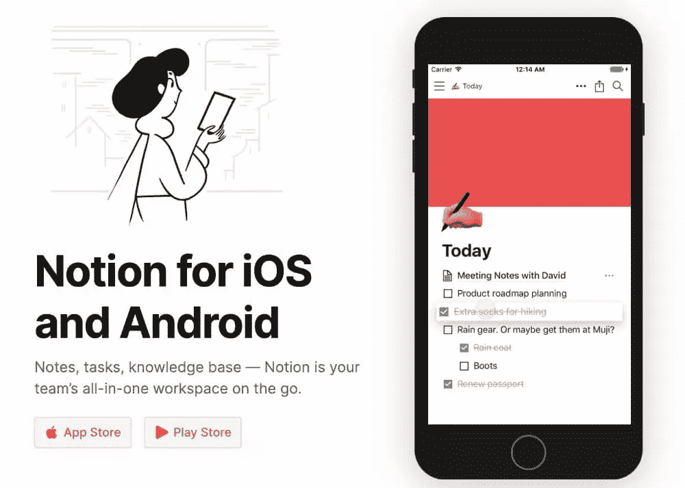

## 学习概念行话

要开始构建，您需要了解自己掌握的基本元素。

### 基础:积木

概念的原子单位是[块](https://www.youtube.com/watch?time_continue=2&v=BZnR2Ml17sc&feature=emb_logo)。就像乐高一样，你把积木拼在一起，创造出你能想象的任何东西。

每种块类型都可以移动、复制和格式化。更令人兴奋的是，每个单独的块都有一个唯一的链接，这使得跨系统交叉引用块变得很容易。

基本块包括字处理器的标准元素，如文本、标题、项目符号和编号列表。还有“待办事项列表”(复选框)、引用和标注来引起对重要文本、分隔线、嵌套页面和现有页面链接的注意。

在本文中，我们将坚持基本的块类型(毕竟这是一个 101 指南)，但其他块类别包括内联提及、媒体和嵌入、数据库和面包屑等高级块。

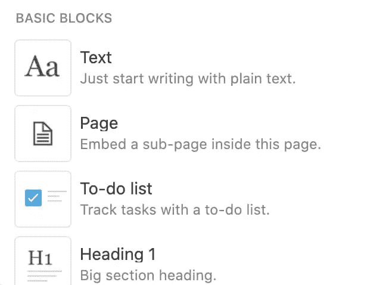

### 把它和书页放在一起

把页面想象成谷歌文档——除了你可以用各种各样的模块构建它们，轻松定制布局、格式和内容。

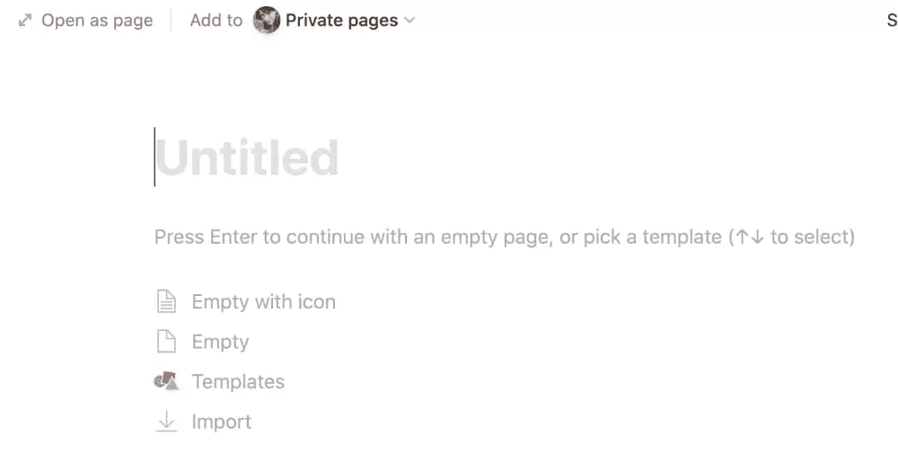

### 用表格组织它

表格是 Excel 或 Google 工作表的替代品——除非你使用数据透视表或执行复杂的数据分析。[添加元数据](https://www.notion.so/guides/table-view-databases)和通常的属性，包括文本、数字和公式。增加其他有用的属性，如复选框、多选和单选，以及“person”(针对工作区中的其他用户)。

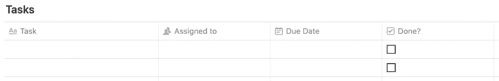

## 如何在应用程序中四处走动

好了，你有了这个应用程序，你明白了你手头要构建的乐高积木。现在，你如何四处走动并保持消息灵通？这里是开始使用 concept UI 所需要知道的一切。

### 搜索

你会想要组织你的概念页面，这样你就知道在哪里可以找到东西，但是当你需要快速获取一些东西时，使用侧边栏中的 **[快速查找](https://www.notion.so/guides/searching-with-quick-find)** 链接。更快的是键盘快捷键`Control` / `CMD` + `P`

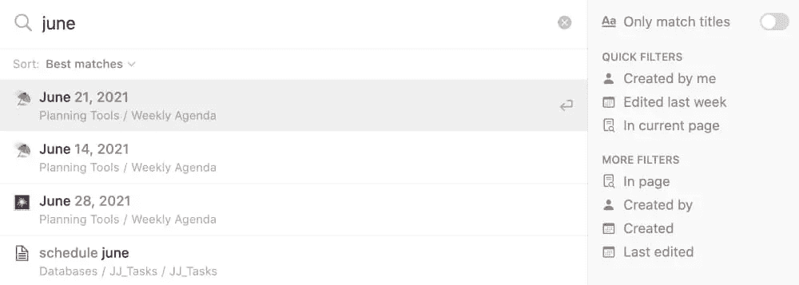

### 更新

您可以在边栏中看到您的页面更新。有**收件箱**用于新的提及和评论，**跟随**用于对你选择跟随的页面进行更改，**所有**用于每次*你的概念账户的*更改和**存档**。点击右上角的齿轮来更改您的通知设置。

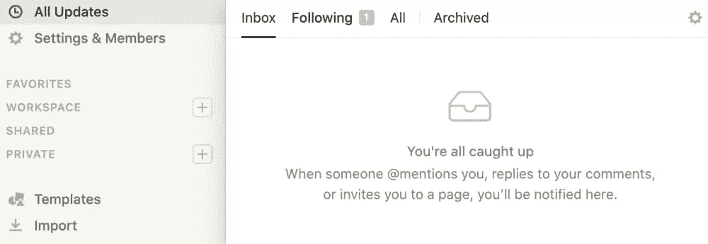

### 设置和成员

您可以在这里修改您的计划、账单信息、通知等。如果你有一个团队计划，这是你可以[管理你的团队](https://www.notion.so/guides/adding-members-admins-and-guests)的地方——添加或删除成员，改变权限，等等。

## 侧栏部分

你的边栏是你的概念世界的地图。

让我们从头开始。

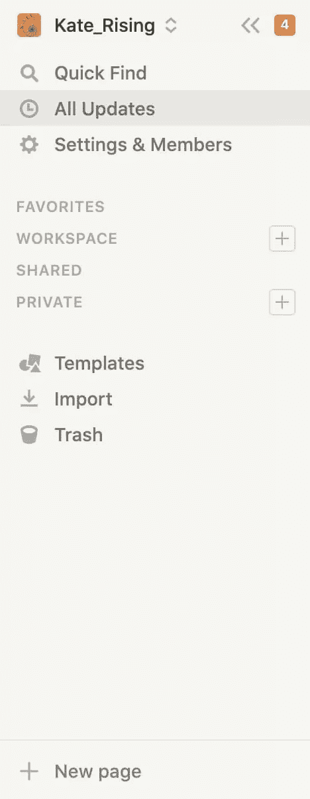

### 收藏夹

您的收藏夹是手动选择的。在任何页面上，你都会在右上角看到**收藏夹**。点击，页面被添加到侧边栏的这个部分。您可以再次单击以删除。在收藏夹部分，你也可以点击三个点来显示从收藏夹中删除**的选项。**

### 工作空间

只有当您有团队计划时，工作区部分才会出现。您团队中的每个人都可以访问此处显示的页面，但是您可以根据您希望人们能够对每个页面执行的操作来修改权限。请参阅下面的“共享”了解更多信息。

### 共享的

页面在与个人、群组或集成共享后，会移动到此部分。

### 私人的

顾名思义，这些页面是您的私有页面。当您点击 **+新页面**时，您的页面将在此处创建，并且将是私有的，直到您手动将其与其他人共享。

## 享受功能带来的乐趣

现在事情变得有趣了！

### 混合搭配

如上所述，概念的原子单位是“块”。是的，有标准的文本和项目符号列表，但你也可以在切换中组织事情，创建一个带有复选框的快速待办事项列表，甚至嵌入视频、图像和网络书签。

积木的真正魅力在于你可以随心所欲地组合它们！这意味着你可以轻松创建仪表盘和个人维基。因为概念是为建筑而建的，嵌入很容易创建和移动(没有你在谷歌或 Word 文档中发现的滞后)。拖放任何块、将块从一种类型更改为另一种类型或复制它也非常容易。

不要就此打住。创建列以组织块(拖动直到看到蓝线移动到现有块旁边)。使用颜色、表情符号和图像来定制您的页面。使用引用和标注来吸引对特定文本的注意(非常适合分享如何导航页面的说明！).一旦你掌握了窍门，你就可以创建仪表盘来规划你的工作和生活！

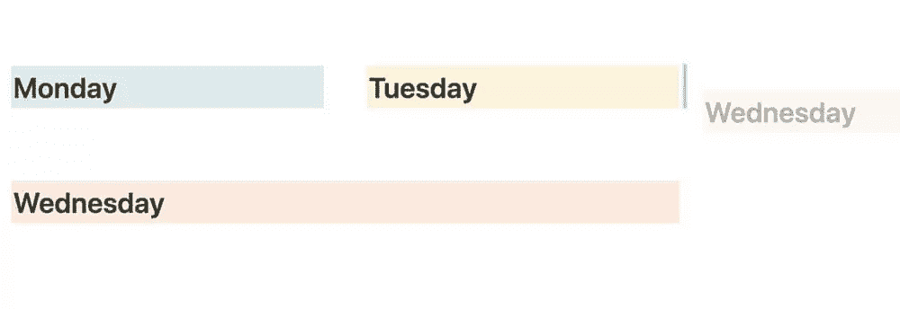

### 电子表格中的文档？

想象一下，如果你能把一个谷歌文档放在一个谷歌表单的单元格内。嗯，有了观念，你就可以！概念表中的每条记录实际上都是一页。还记得我们讨论分类的时候吗？每一页都是它自己的文档，可以包含你想要的任何块的组合。

这非常强大，原因有二:

*   您在表格中创建的每个页面都可以有自己的元数据。分配日期、标签、人员等。
*   您将通过更深入地挖掘记录页面来为表格创建深度。[为每个项目创建一个迷你仪表板](https://www.sitepoint.com/high-output-project-management-in-notion/)，为你阅读清单上的每本书添加注释，或者为菜单规划捕捉食谱。

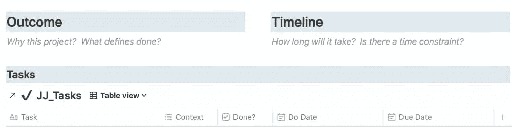

### 使用表格视图切片和切块

现在，您的页面以表格的形式组织起来，并且有了有用的元数据，您可以决定如何查看您的信息！

默认情况下，表格开始时是一个简单的两列表格。一旦创建了表和属性，就可以单击表名旁边的 **+ Add a view** 并创建以下任何视图:

*   **表格**:一个基本的电子表格。
*   **板**:看板风格。每个页面都是一行中的一张“卡片”，按照您选择的属性(如任务的状态)排序。
*   时间表:一个甘特图，对项目计划和日程安排非常有用。
*   **日历**:月视图，用于计划事件、内容日历和任务。
*   **列表**:精简的表格，视觉上吸引人，易于导航。
*   **画廊**:所有选项中“最漂亮”的。每一页都成为网格中的一张卡片。伟大的食谱，书单，旅游推荐和更多。

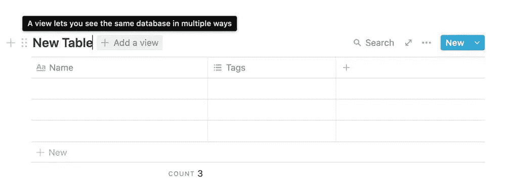

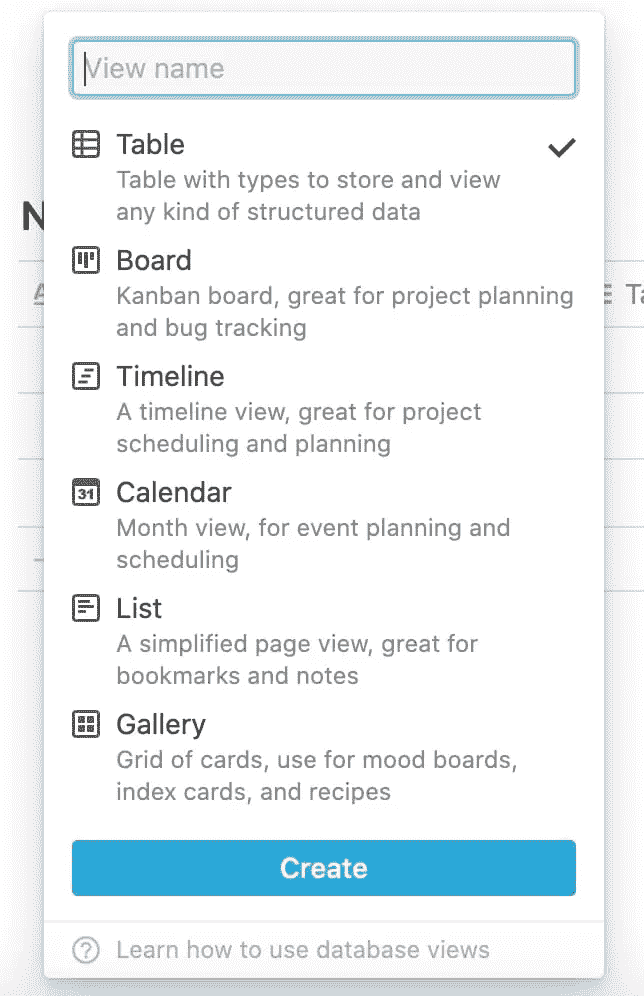

任何视图都可以被过滤和排序！按任何属性过滤或创建过滤器组。使用一种或多种排序将您需要的信息呈现出来。完善了一个观点？复制它，并稍微调整过滤器，给你你需要的确切的上下文。进一步了解[过滤视图如何帮助您管理任务和项目](https://www.sitepoint.com/high-output-project-management-in-notion/)。

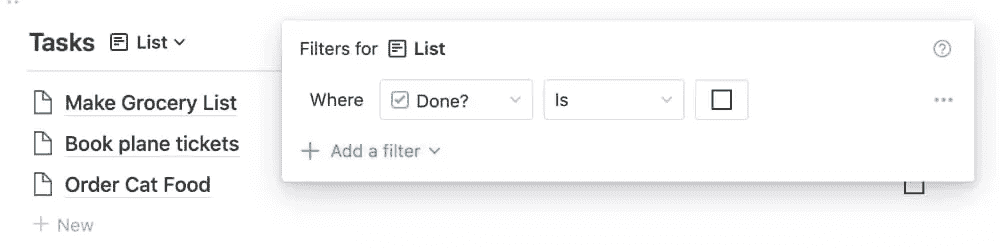

### 用网剪夹住它

将网页拉进 idea 是一个很好的方法来编辑食谱，积累一个以后阅读的列表，或者将图片收集到情绪板上。当谈到“裁剪器”浏览器扩展时，你有几个选择。对于任何一个 clipper，您都需要安装并固定扩展，然后登录到您的概念帐户。实际剪裁体验各不相同。

使用[opinion 自己的裁剪器](https://www.notion.so/web-clipper)，您只需编辑页面名称并选择工作区和目标数据库。裁剪器将抓取 URL，并且在大多数情况下*抓取页面内容。有时，页面内容不会完全出现在概念中。*

 *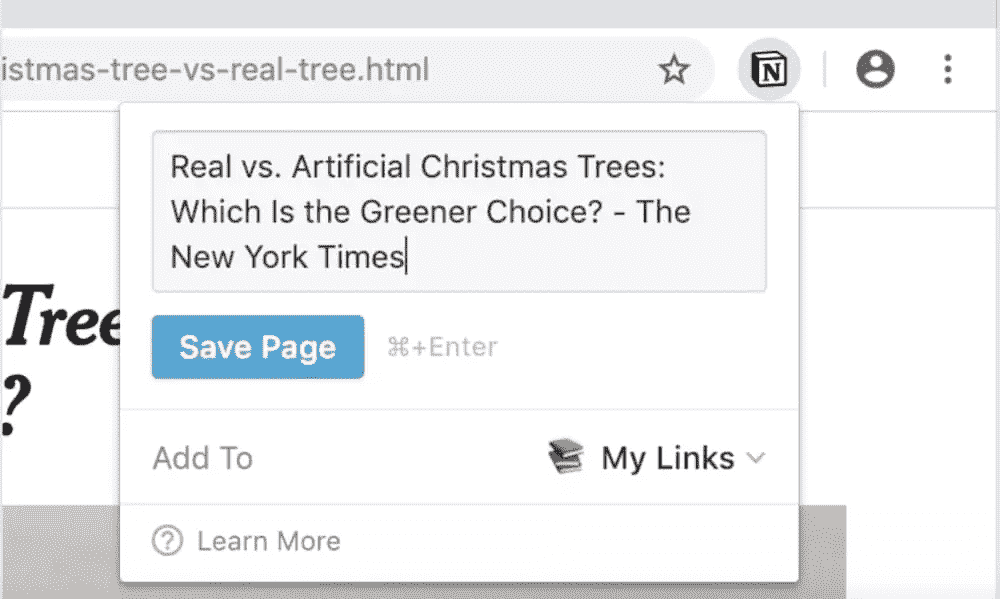

使用[Save to concept](https://chrome.google.com/webstore/detail/save-to-notion/ldmmifpegigmeammaeckplhnjbbpccmm)扩展，您可以创建表单以裁剪到不同的数据库。选择工作空间和目标数据库，然后自定义裁剪时要填写的字段。

当您准备好裁剪页面时，您将选择一个表单，并填写您喜欢的任意多个字段。页面被剪辑到数据库中，其中已经填充了元数据！这样，您就不需要单独的步骤来处理您的剪报。

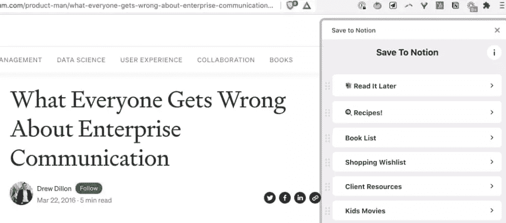

### 共享和权限

点击右上角的**分享**分享任意页面。您可以立即发布到 Web 上(可以选择是否允许搜索引擎索引)。对于更具体的共享，请使用联系人的电子邮件地址添加联系人(如果您已经与他们共享，则只需添加他们的姓名)。[权限选项](https://www.notion.vip/notion-sharing-hierarchy/)相当简单:

*   **完全访问权限**:能够编辑和共享
*   **可以编辑**:可以编辑但不能分享
*   **可以评论**:可以评论页面级别，评论任意区块
*   **可以查看**:只能查看
*   **无访问权限**:用于撤销之前授予的访问权限

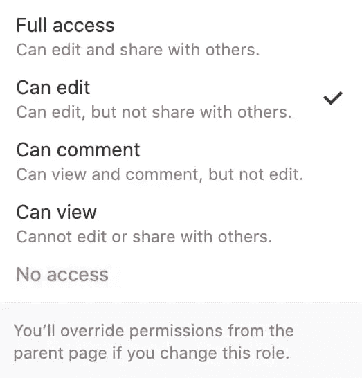

分享有两个重要的细微差别:

*   嵌套页面，或者数据库中的页面，*自动继承父页面的权限。但是，您可以手动进入某个页面并重置该特定页面的共享权限。您将收到一个警告，要求您确认是否要覆盖继承的权限。*
*   如果您共享的页面包含一个“链接数据库”(一个高级模块，在“[高产出项目管理”的“概念](https://www.sitepoint.com/high-output-project-management-in-notion/)”中有深入讨论)，那么原始数据库也必须与协作者共享。否则，链接的数据库块将不会出现在页面视图中。他们会在该放积木的地方留一块空白。

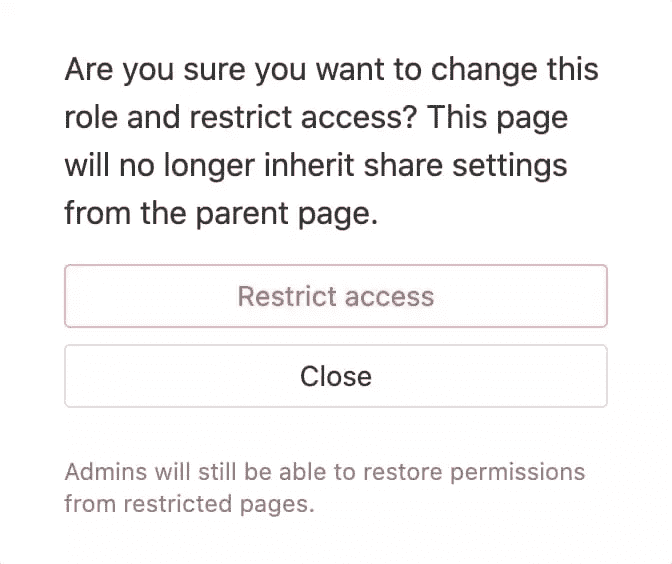

## 初学者的使用案例

一旦您掌握了我们刚刚探索的特性，您就可以创建仪表板来规划您的工作。

有几个简单的方法可以让你开始使用概念并立即获得很多价值:

*   个人客户关系管理(Personal CRM):个人客户关系管理(person CRM)是一个很好的起步选择，尽管对于销售和电子邮件营销，idea 不会取代目的驱动的客户关系管理。相反，想想生日、爱好和你与最重要的联系人进行的有意义的谈话。
*   **笔记**:一个可搜索和索引的储存库，用于你的头脑风暴、购物清单和[阅读笔记](https://radreads.co/notion-reading-notes/)。
*   **【图书馆】网页内容**:用观念中的数据库代替 Instapaper 或 Pocket。为什么？可定制的元数据以及在概念中突出显示和注释全文的能力。组织你的阅读，这样你就能跟上网络开发的发展。
*   **任务管理**:捕捉你所有的待办事项，并创建自定义视图，在你需要了解的时候向你展示你需要了解的内容。
*   **更多的个人用途**:通过食谱数据库、膳食计划、习惯跟踪和锻炼日志保持健康和有条理。通过整理你所有的信息和笔记来计划旅行。在你所有的流媒体服务上创建一个电影和节目的主“观看列表”,或者一个数字书架来排队你的下一次阅读。

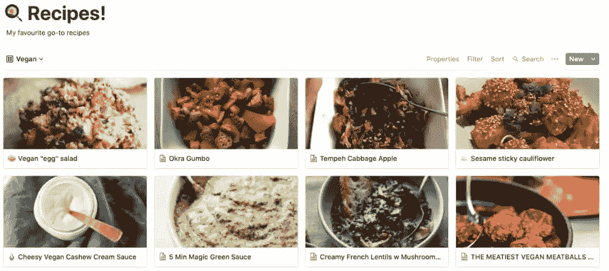

一旦您熟悉了概念，您就可以利用该工具进行更复杂的使用。利用您在这里学到的知识，深入研究[项目管理](https://www.sitepoint.com/high-output-project-management-in-notion/)、[课程创建](https://www.float.so/)，或者快速简单的[公共网页](https://www.notion.so/blog/personalize-public-pages)(非常适合销售和登录页面等临时页面)。

## 利用最佳实践充分利用概念

观念的福与祸在于你可以制造任何你想要的东西！有时，这意味着你会发现页面像兔子一样繁殖，页面嵌套在页面中。这一切导致了一个两难的境地:*那东西在哪里？*

你可以通过一些方便的提示来避免这个陷阱:

*   保持侧边栏的流线型:只收藏你最常用的五到七页。在工作区中创建几个母版页，按类别存放其他网页。示例:您的所有仪表板都位于仪表板页面上，并且您喜欢您的日常操作仪表板。
*   格式:当你制作一个大页面时，使用标题和目录。这使得跳转到您需要的部分变得容易得多。
*   清理:计划时间定期检查你的设置，收回你不需要的页面，修改你的收藏夹，调入任何半成品。
*   **到表格或不到表格**:如果你要制作三个或更多的相同类型的页面，，你会想要把这些页面放在一个表格中，而不是仅仅嵌套它们。

就是这样。你已经上路了！你已经有了一个坚实的开端所需要的一切。不过，这里有一个秘密:开始使用 concept 时，最有效的方法是在构建太多概念之前，先规划好自己的概念设置。弄清楚你想创造什么以及为什么，然后专注于学习如何创造。在那之后，你会想要真正地挖掘概念数据库的奇迹。您还可以通过下面的资源了解更多信息。快乐的想法！

## 使用额外资源更深入

*   [观念的常见问题](https://www.notion.so/More-FAQs-63b8a4df66c6462a996e04206f8ea315)
*   "[概念 API 及其 JavaScript SDK 入门](https://www.sitepoint.com/notion-api-javascript-sdk/)"
*   "[理念中的高产出项目管理](https://www.sitepoint.com/high-output-project-management-in-notion/)"
*   观念中的 GTD:如何让*更*的事情在观念中完成

    [https://www.youtube.com/embed/4YspgkLRsrs?rel=0](https://www.youtube.com/embed/4YspgkLRsrs?rel=0)

     
*   [使用模板取得优势](https://radreads.co/notion-templates/)
*   深入了解我共同教授的课程:[提高你的生产力](https://radreads.co/courses/)

## 分享这篇文章*