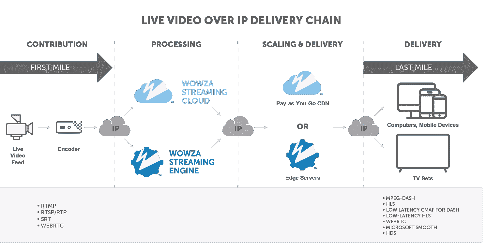
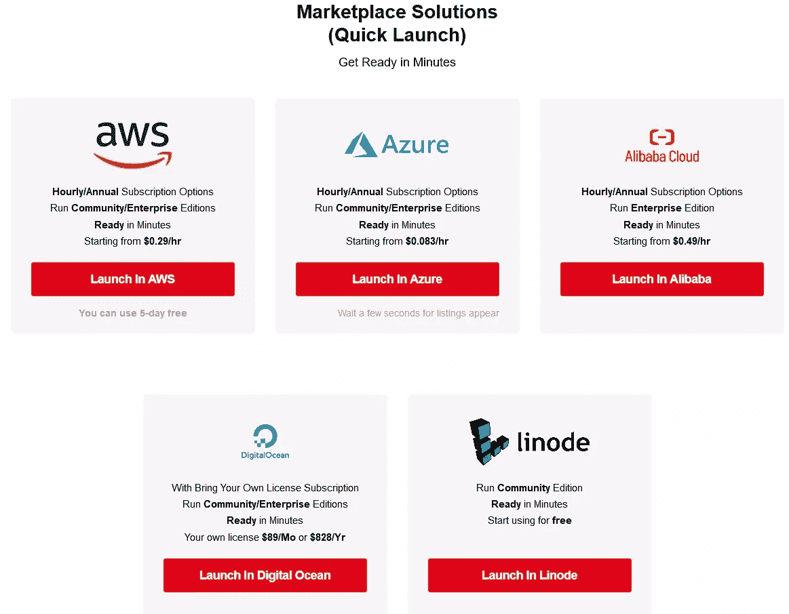
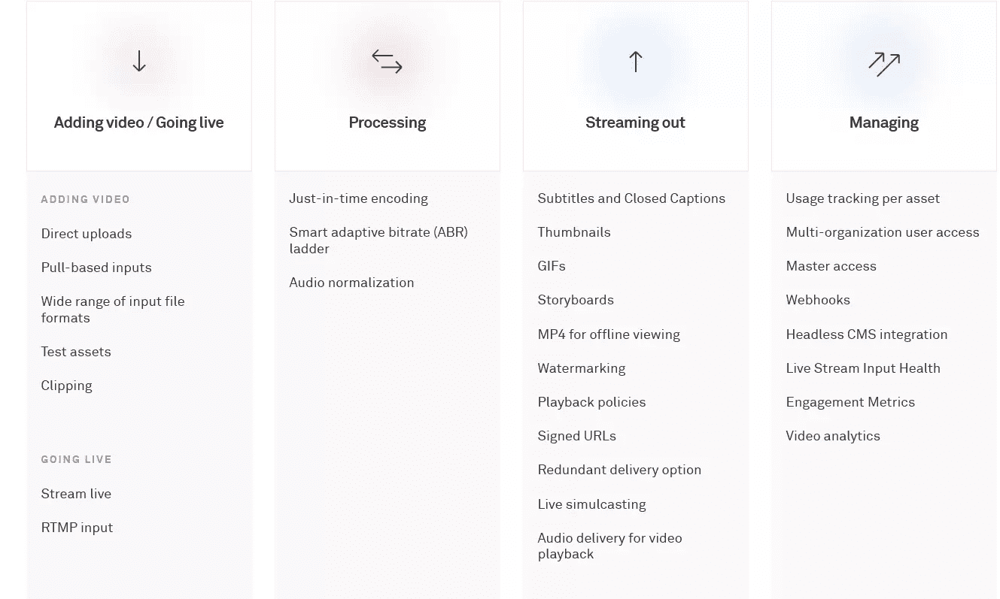

# 5 个流媒体平台，让您控制自己的内容

> 原文：<https://www.sitepoint.com/streaming-platforms-control-content/>

向数百万用户直播最简单的方法是使用社交媒体平台，如脸书、Instagram、YouTube 或 Twitch。这些平台有助于品牌认知，但在内容所有权、受众接触和盈利方面，给你的选择有限。

直播最好的方式就是搭建自己的平台，可以邀请观众观看。这一策略将保护你免受审查，让你获得更好的分析，以及更多如何将你的信息流货币化的选择。你只需要准备好投入时间和金钱来获得完全控制内容的好处。

在这篇文章中，我们将看看直播平台，它们的术语和协议。然后，我们将考察五个直播提供商，它们使内容创作者能够保持对其内容和观众的所有权。

## 不同种类的直播平台

要开始，至少你需要一个直播媒体服务器和你自己的网站。您可以考虑使用三种类型的直播平台:

*   **自主持**
*   **云**
*   **API 驱动**

使用**自托管**选项，您会发现许多开源和企业直播流媒体服务器，您可以下载并自行安装。您可以将软件托管在本地服务器上，或者 AWS、Azure、Digital Ocean、Linode 等计算平台上。您还需要为您的直播录像和点播视频内容设置存储空间。对于企业服务器，您需要购买许可证。

**云**选项是指平台提供商已经在其多租户基础设施上安装了软件。你所要做的只是创建一个帐户，然后你就可以开始了。缩放和技术问题由提供商处理。您将每月支付软件使用许可的固定费用，外加运行直播会话时产生的基础设施成本。

**API 驱动的**选项类似于**云**选项，除了您只需为使用付费。这是一个更具成本效益的定价策略，因为你只需在直播正在进行或你已经在他们的平台上存储了视频内容时付费。这些平台也有适合开发人员的更好的文档。

虽然看起来最经济实惠的解决方案就是这种方式，但是您可能需要选择其他选项，因为您需要满足以下要求:

*   超低延迟
*   24×7 流式传输
*   仅本地网络流
*   获取技术专业知识，即网络开发人员
*   有限的上市时间

平台提供的功能各不相同，您可能会发现商业提供商已经实现了您的应用程序所需的大部分后端逻辑。你还应该注意到，在定价方面，长期合同的每月定价通常低于短期合同。

## 术语

接下来，让我们熟悉一下主要术语:

*   直播流是一种将视频流或文件分割成小块的技术，允许观众在不下载整个文件的情况下观看。术语*现场视频*是指实时发生的记录。

*   视频点播(Video-on-demand)或 T2 视频点播(VOD)是一项简单的服务，用于播放预先录制的节目、电影或活动。设置直播会话时，您需要启用录制功能，以便稍后观看直播的观众仍然可以从头开始观看整个节目。

*   **编码器**是一种硬件设备或某种软件，它从摄像机获取高质量、未压缩的视频源，并将视频流编码为压缩格式，该格式为在有限的互联网带宽上传输而优化。硬件编码器更贵，但更可靠。软件编码器更便宜，但它们不在专用环境中运行，这使得它们容易被其他应用程序中断。

*   一个**直播流媒体服务器**是一个软件，它接受来自编码器的传输数据，然后以不同的质量重新传输到多个流中，以传送给观众。

*   **转码**是将压缩视频流转换为更好的压缩格式的过程，这种压缩格式可以用最少的缓冲以最高的质量进行传输。这是由直播媒体服务器完成的。

*   一个**边缘服务器**只是一个来自直播媒体服务器的流的中继。边缘服务器通常位于流媒体服务器的位置附近，用于减轻直播服务器的负担。它们还有助于减少延迟。

*   一个**直播视频播放器**是一个 JavaScript 应用程序，使浏览器和移动应用程序能够解码来自直播媒体服务器的视频流。它们通常具有回放控制，并且可以附带广告集成等附加功能。

*   **延迟**是指从摄像机捕捉一帧到流媒体播放者在设备上看到该帧之间的延迟。对于标准协议，延迟可能在 10 到 40 秒之间。低延迟协议可以实现不到三秒的延迟。

## 直播协议

将活动从您所在的位置流式传输到您的受众基本上是一个分步流程:

1.  在您的服务器上创建一个流。这将为您提供一个 RTMP URL，您将使用它来上传您的流。
2.  配置您的编码器，并点击流按钮。这将把您的视频源上传到您的服务器。
3.  您的服务器将接收您的流，并将其转码为不同质量的多个流。
4.  一名观众将通过您的网站连接到您的 livestream 服务器。根据您的观众的网络速度，将提供适当的流。

*信用:[Wowza](https://www.wowza.com/)*

虽然已经为流式内容开发了许多协议，但您应该关注的只有三种。

### RTMP 工艺技术

**实时消息协议(RTMP)** 是一种流协议，用于将优化的流从编码器传输到直播服务器。如果你担心安全性，你可以使用使用 SSL 的 **RTSP** 。还有 **RTMPE** ，它使用 Adobe 的安全标准加密数据流。

### 苹果 HLS

**HTTP 直播流**是每个平台都支持的最广泛使用的传输流协议。它使用一种被称为 **ABR** (自适应比特率)的技术将视频分解成更小的块(十秒或更少)。然后，它将这些块编码成不同的质量级别，这允许观众在视频中间切换到不同的质量流。

HLS 有 10 到 40 秒不等的延迟。有一个更新的版本叫做[低延迟 HLS](https://developer.apple.com/documentation/http_live_streaming/enabling_low-latency_hls) ，于 2020 年末发布。它允许减少三秒或更少的延迟。

### WebRTC

**Web 实时通信**是一个开放的项目，最初是为点对点通信开发的。然而，提供商已经找到了如何利用这项技术来提供闻所未闻的**500 毫秒**甚至更短的延迟，以便向远距离的观众提供直播。

他们还想出了一种方法来扩大 WebRTC 的规模，为成千上万的观众提供服务，因为标准的 WebRTC 在一次会议中仅限于 60 名参与者。

## 直播界面开发

一旦你设置好了你的直播媒体服务器，你就需要建立一个界面，让观众观看你的直播。界面可以是网站，也可以是手机 app。您需要安装一个视频播放器来连接和解码来自服务器的视频流。随着您将更多流量聚集到您的界面，您的 livestream 基础架构将会扩展以满足需求，并确保每个人都能获得流畅的流媒体体验。

您的平台提供商通常会为您提供定制的视频播放器。或者，他们可以推荐几个选项，包括:

*   [Video.js](https://videojs.com/) ，开源，默认支持 HLS 和 DASH。有许多社区皮肤和插件可以安装来扩展它的功能。

*   [jwp player](https://www.jwplayer.com/html5-video-player/)，这是一款支持 HLS 开箱即用的商业播放器。它支持视频画廊，360 视频和广告集成。每月 10 美元起。

*   [the player](https://www.theoplayer.com/)，这是一个基于印象定价的商业玩家。它带有丰富的 SDK，并支持广告集成、分析和数字版权管理。

要构建一个移动应用，你需要使用一个移动 SDK——Android 或 iOS。建立网站有多种方式:

*   作为单页 HTML
*   使用内容管理系统
*   基于服务器的开发——如 Django 或 Laravel
*   作为一个具有 Node.js 或无服务器后端的 <abbr title="single-page application">SPA</abbr> / <abbr title="server-side rendering">SSR</abbr> 网站

提供商可能会为您提供多种将网站连接到 livestream 服务器的方式。这些选项包括使用:

*   嵌入脚本
*   Node、Python、PHP 等服务器编程语言的 SDK
*   REST API

构建您自己的品牌网站或移动应用程序允许您实现额外的自定义功能，例如:

*   用户认证
*   聊天流媒体
*   广告展示
*   电子邮件订阅
*   收款
*   测量工具

接下来，我们将了解不同的直播服务器提供商。

## 1.自有资本

[Owncast](https://owncast.online/) 是一个完整的开源直播解决方案，您可以轻松部署到云计算平台。它已经包括一个前端网站，这意味着你不需要做任何额外的工作。在服务器上安装 Owncast 可以通过以下方式之一完成:

*   用[脚本安装](https://owncast.online/quickstart/)
*   由来源生成
*   通过使用包含的 [Docker 文件](https://github.com/owncast/owncast/blob/develop/Dockerfile)启动服务器
*   通过安装[site . js](https://owncast.online/quickstart/sitejs/)——一个脚本实用程序，用于将 Owncast 安装为`systemd`服务

由于该软件是开源的，你开始使用的唯一成本就是基础设施。扩大规模可以通过以下方式实现:

*   **垂直扩展**:将服务器升级到更高的 CPU 数量
*   [**使用外部存储**](https://owncast.online/docs/scaling/) :在服务器上生成视频流，然后从您的存储服务器上传送

Owncast 非常适合个人使用和开始运行自己的直播。然而，您需要一些技术专业知识来平衡性能和延迟。否则，如果您的设置配置不正确，您的观众将会经历中断和持续缓冲。

## 2.Wowza

[Wowza](https://www.wowza.com/) 是一个流行的视频直播平台，提供自托管和云解决方案，即:

*   [Wowza 流媒体引擎](https://www.wowza.com/products/streaming-engine)
*   [Wowza 流媒体云](https://www.wowza.com/products/streaming-cloud)

该平台支持以下交付协议:

*   WebRTC
*   苹果的低延迟 HLS
*   SRT(安全可靠的运输)
*   MPEG-DASH

[SRT](https://www.wowza.com/low-latency/SRT-secure-reliable-transport) 是另一种低延迟流媒体协议，旨在通过不可预测的网络提供原始的视频质量。

[MPEG-DASH](https://www.wowza.com/blog/mpeg-dash-dynamic-adaptive-streaming-over-http) 是由运动图像专家组开发的基于 HTTP 的自适应流媒体协议。它是 HLS 的替代方案，因此被命名为【HTTP 上的动态自适应流。

开发网站和移动应用程序可以使用他们的:

*   [REST API](https://www.wowza.com/docs/wowza-streaming-cloud-rest-api)
*   [SDK](https://www.wowza.com/docs/discover-sdks-and-webhooks)—Ruby，Java
*   [Webhooks](https://www.wowza.com/docs/receive-wowza-streaming-cloud-event-notifications-with-webhooks)

Wowza 流媒体引擎的定价是基于许可的，每个实例每月 125 美元起。更高层提供更专注的客户服务响应。

Wowza 云服务器的起价为每月 85 美元。这是一个包，包括一套固定的直播和观看时间。如果您超出了计划的限制，您将按固定费率支付额外的观看时间。包含一个[定价计算器](https://www.wowza.com/pricing/streaming-cloud-plans)来帮助您确定实际成本。

如果您想要构建直播应用程序并管理您的基础架构，建议使用 Wowza 云服务器选项。如果您想要构建自定义解决方案并管理自己的基础架构，建议使用 Wowza 流引擎。

## 3.Red5 Pro

[Red5 Pro](https://www.red5pro.com/) 是一款流行的直播解决方案，专注于使用 WebRTC 的低延迟流媒体。使用标准协议，用户可能会经历大约 20 到 40 秒的延迟。通过将 WebRTC 实现为交付协议，可以实现 500 毫秒或更低的延迟。这是一个巨大的成就，以前没有任何其他直播平台能够完成。

Red5 Pro 提供了一个使用 Java 构建的 livestream 媒体服务器。它有一个 REST API 接口和许多为 JavaScript (WebRTC)、Android、iOS 和 Linux 编写的 SDK。Red5 livestream 服务器有两种主要版本:

*   **社区版**:无伸缩或 webRTC
*   **Red 5 Pro** :支持伸缩和低延迟 webRTC 的商业版本

没有云服务，所以你需要在你的托管账户或云服务器上设置的专业知识。Red5 Pro 的定价基于每个实例的*许可，起价 30 美元。更高层具有:*

*   增加支持
*   通过自动扩展实现无限连接
*   额外实例的折扣
*   自适应比特率

该提供商拥有令人印象深刻的客户名单，包括谷歌、英特尔、纽约时报、索尼和诺基亚。虽然某些领域的文档需要改进，但如果您想向观众提供超低延迟的流媒体，Red5 Pro 是一个很好的直播解决方案。

## 4.Ant 媒体服务器

蚂蚁媒体服务器基本上是 Red5 社区版的一个分支。他们有自己的企业版，也支持超低延迟流和自动缩放。他们有 iOS、Android、Unity 和 JavaScript 的 SDK，都是免费提供的。

企业服务器的起价为每个实例每月 89 美元。请注意，开始时至少需要两个实例——一个用于处理发布者，另一个用于处理查看者流量。不幸的是，没有类似 Wowza 云流媒体的云产品。然而，他们已经提供了预置，可以帮助您快速启动一个 Ant 媒体服务器到一个流行的计算平台。

这个选项很棒，因为许可证是按小时计费的。这意味着，如果您需要在流量较高时扩大规模，您只需为这些额外实例运行的时间付费。有一个[定价计算器](https://antmedia.io/cost-calculator/)可以让你提前确定你的成本。不幸的是，对于小时费率，你需要考虑这样一个事实，即只要服务器在运行，无论你是否在流式传输，许可费都适用。

除了您的许可费，您还会从您的云服务器提供商那里产生费用。你还需要有处理服务器管理、配置和调整的技术专长。Ant 媒体服务器的文档非常好。

总的来说，Ant Media Server 在定价选项和文档方面感觉比 Red5 Pro 更上一层楼。缺少的只是一个云托管服务来帮助开发人员快速入门。

## 5.复用器

[Mux](https://mux.com/) 是一个*的直播即服务* (LaaS)平台，让开发者可以使用文档完善的 API 轻松构建定制的直播应用。所有复杂的基础设施都由您处理，因此您可以专注于为观众提供独特的直播体验。

计费基于使用情况，与其他定价模式相比，易于理解且更具成本效益。使用他们的[定价计算器](https://mux.com/pricing)来查看自己的成本。首先，你需要做的只是注册一个账户，然后你会得到一个仪表盘，在那里你可以创建视频流并监控观众参与度。

该平台提供了大量的功能，这里无法一一介绍。这是他们网站上的预览快照。

使用以下方式将 livestream 平台连接到您的应用程序:

*   一个 [REST API](https://docs.mux.com/guides/video/make-api-requests#using-mux-with-serverless-functions)
*   [SDK](https://docs.mux.com/guides/video/make-api-requests#mux-api-sdks)—Ruby、Go、Python、PHP、Elixir 和 Node
*   [CMS 插件](https://docs.mux.com/guides/video/integrate-with-your-cms)

当构建前端应用程序时，您需要将其与一个[无服务器后端](https://docs.mux.com/guides/video/make-api-requests#using-mux-with-serverless-functions)配对，后者将通过 Mux 端点处理 API 请求。否则，您会遇到与 CORS 相关的错误。

支持的交付协议包括 [Apple HLS](https://mux.com/blog/reduced-latency-for-mux-live-streaming-now-available/) (延迟约 12 秒)。

不幸的是，在撰写本文时，平台似乎还不支持低延迟协议。尽管如此，Mux 仍然是一个非常棒的、具有成本效益的平台，可以帮助您开始构建自己的直播应用程序。

如果你正在寻找一个类似的平台进行比较，请查看 [api.video](https://api.video) ，它也提供了出色的开发者体验和可比的价格。

## 结论

至少还有 20 多个直播平台我没有包括在本文中。这足以让您产生决策疲劳，尤其是因为您需要与销售代表沟通来计算您的用例的实际成本。

然而，考虑成本不应该是你的主要因素，因为你的目标是在你能承受的预算内为你的观众提供最好的直播服务。对于体育相关活动或安全监控，低延迟应该是您的首要考虑。对于视频点播流或新闻报道，标准的 HLS 协议将很好地服务于您的观众。

总的来说，选择平台需要了解您的用例并进行数学计算。如果不确定，从 LaaS 开始，然后决定如何随着您的直播应用程序的增长而扩展。

## 分享这篇文章