# 用 Git 撤销错误的 5 种方法

> 原文：<https://www.sitepoint.com/5-ways-to-undo-mistakes-with-git/>

不管你多么有经验，软件开发的手艺不可能不犯错误。但是普通程序员和伟大程序员的区别在于他们知道如何*撤销*他们的错误！

如果你使用 Git 作为你的版本控制系统，你已经有了一大堆“撤销工具”。这篇文章将向你展示用 Git 撤销错误的五种有效方法！

## 放弃一些本地更改

编码通常是一个混乱的过程。有时候，你会觉得自己在前进两步，后退一步。换句话说:你编写的一些代码很棒……但也有一些不怎么样。这就是 Git 可以帮助你的地方:它允许你保留好的东西，丢弃你不想要的变化。

让我们看一个带有一些“本地”变更(也就是我们还没有提交的变更)的示例场景。

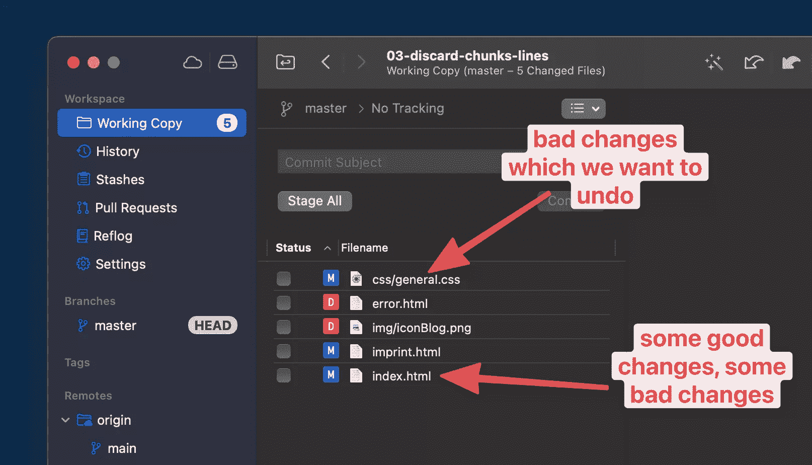

*注意:为了更好的概述和更清晰的可视化，我在我的一些截图中使用了 [Tower Git 桌面客户端](https://www.git-tower.com/?utm_source=sitepoint&utm_medium=guestpost&utm_campaign=undoing-mistakes-in-git)。你不需要塔跟随这个教程。*

让我们先解决`general.css`中的问题。我们所做的改变方向完全错误。让我们撤消所有这些操作，并重新创建该文件的上次提交状态:

```
$ git restore css/general.css 
```

注意，或者，我可以使用`git checkout`命令来获得相同的结果。但是因为`git checkout`有这么多不同的工作和意义，我强烈倾向于稍微新一点的`git restore`命令(它只专注于这些类型的任务)。

我们在`index.html`中的第二个问题有点棘手。我们在这个文件中所做的一些更改实际上是很棒的，而只有一些需要撤销。

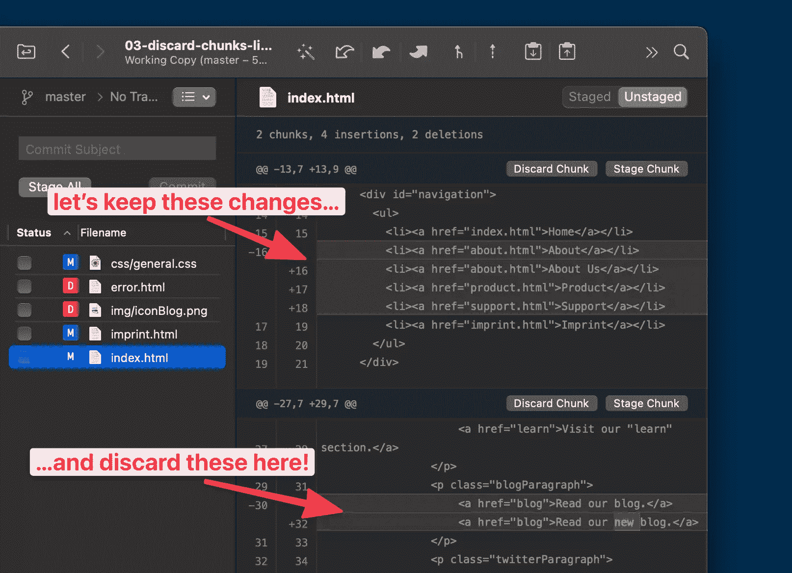

再次，`git restore`来帮忙了——但是这次用了`-p`标志，因为我们想下到“补丁”级别:

```
$ git restore -p index.html 
```

然后 Git 会拉着你的手，问你— *该文件中的每一个变更块*—你是否想要丢弃它。

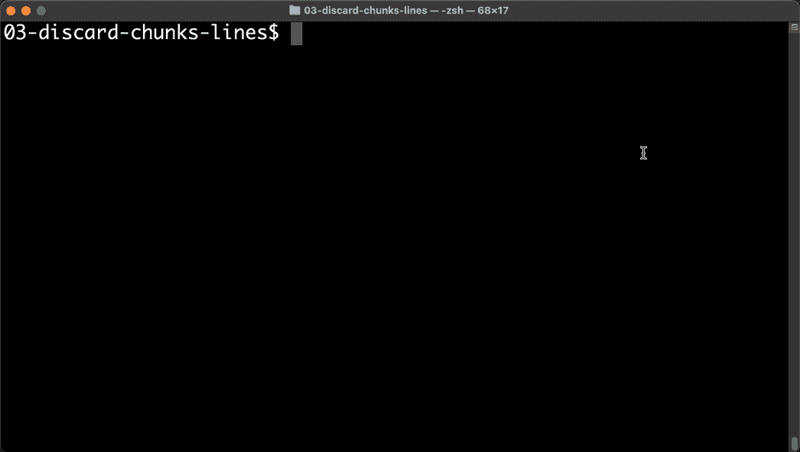

您会注意到，我为第一个块键入了“n”(为了保留它)，为第二个块键入了“y”(为了丢弃它)。在过程完成后，您可以看到只有第一个有价值的变更保留了下来——正如我们所希望的那样！

## 将特定文件重置为以前的状态

有时你会想要将一个特定于*的*文件恢复到特定于*的*版本。例如，您知道`index.html`在某个更早的时间点运行良好，但现在不行了。这时你想让时间倒流，但只针对这个特定的文件，而不是整个项目！

我们首先要弄清楚的是我们想要恢复哪个确切的版本。有了正确的参数集，您可以使用`git log`命令显示我们单个文件的历史:

```
$ git log -- index.html 
```

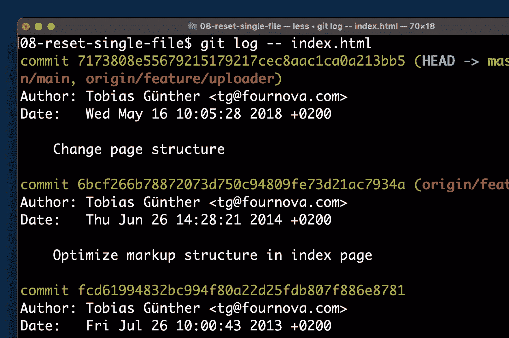

这仅向我们显示了`index.html`已经被改变的提交，这对于找到破坏事情的“坏苹果”修订版非常有帮助。

如果您需要更多的信息，并且想要查看那些提交的*内容*，您可以让 Git 向您显示这些带有`-p`标志的提交中的实际变化:

```
$ git log -p -- index.html 
```

一旦我们找到了破坏我们可爱的小文件的错误提交，我们就可以继续修复错误。我们将通过在错误的版本之前的版本*恢复文件来实现！这一点很重要:我们不想在引入错误的提交时恢复文件，而是在上一次良好状态时恢复文件——在那之前的一次提交！*

```
$ git checkout <bad-commit-hash>~1 -- index.html 
```

将`~1`添加到错误提交的散列将指示 Git 这样做:在引用的之前进行一次修订*。*

执行该命令后，您会发现在您的本地工作副本中需要修改`index.html`: Git 为我们恢复了文件的最后一个好的修订版！

## 用参考日志恢复丢失的修订

Git 的急救包中另一个很棒的撤销工具是“Reflog”。您可以把它想象成一个日志，Git 在其中记录了本地存储库中发生的所有头指针移动——比如提交、签出、合并和重定基础、精选和重置。所有更有趣的行为都被很好地记录在这里！

当然，这样的日志非常适合那些事情变糟的时候。因此，让我们从造成一点灾难开始——然后我们可以用 Reflog 修复它。

假设您确信您最近的几次提交是不好的:您想要摆脱它们，因此使用`git reset`返回到先前的修订。结果，“坏的”提交从您的提交历史中消失了——正如您所希望的那样。

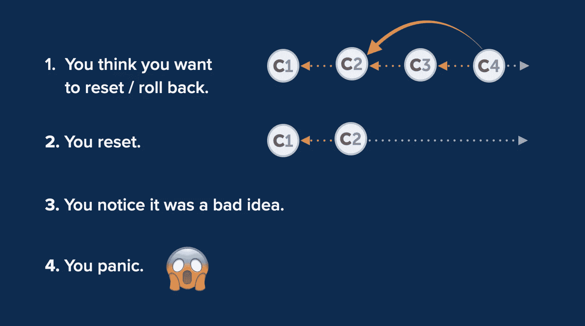

但是生活有时会这样，你会注意到这是一个坏主意:最终，提交并没有那么糟糕！但是坏消息是，您已经将它们从存储库的提交历史中删除了！😱

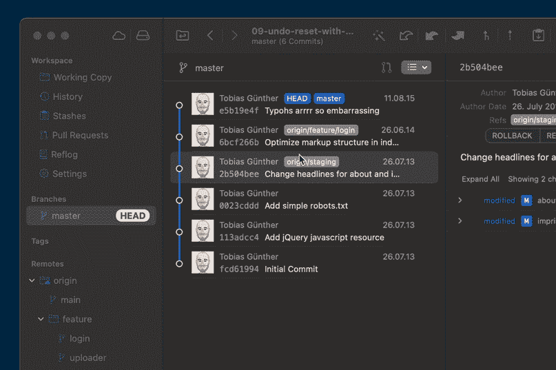

这是 Git 的 Reflog 工具的经典案例！让我们看看它是如何保护你的脖子的:

```
$ git reflog 
```

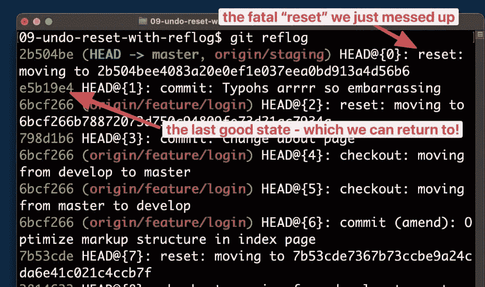

让我们一点一点地分解这个:

*   首先，Reflog 非常容易打开:一个简单的`git reflog`就足够了。
*   其次，您会注意到记录的状态是按时间顺序排序的，最新的状态在最上面。
*   如果你仔细观察，你会发现最上面的(也就是最新的)项目是一个“重置”动作。这就是我们 20 秒前刚刚做的。显然，日记起作用了😉
*   如果我们现在想要撤销我们不自觉的“重置”,我们可以简单地返回到之前的状态——这里也有清晰的记录！我们可以简单地将之前状态的提交散列复制到剪贴板，并从那里获取它。

为了恢复之前的状态，我们可以再次使用`git reset`或者简单地创建一个新的分支:

```
$ git branch happy-ending e5b19e4 
```


正如我们可以愉快地验证的那样，我们的新分支包含了我们认为由于意外的`git reset`打嗝而丢失的提交！

## 恢复已删除的分支

Reflog 在其他情况下也可以派上用场。例如，当您无意中删除了一个分支。)不该。让我们看一下我们的示例场景:

```
$ git branch
  * feature/analytics
    master 
```

让我们假设我们的客户/团队领导/项目经理告诉我们，我们一直致力于开发的美丽的`analytics`功能不再需要了。虽然我们很整洁，但是我们删除了相应的`feature/analytics`分支，当然！

上面，您可以看到，在我们的示例场景中，我们拥有当前检出的分支:`feature/analytics`是我们当前的头分支。为了能够删除它，我们必须首先切换到另一个分支:

```
$ git checkout master
$ git branch -d feature/analytics
error: The branch 'feature/analytics' is not fully merged.
If you are sure you want to delete it, run 'git branch -D feature/analytics'. 
```

Git 告诉我们，我们将要做一些真正严肃的事情:因为`feature/analytics`包含了其他地方没有的独特提交，删除它将会破坏一些(潜在有价值的)数据。嗯……既然不再需要这个特性，我们可以继续:

```
$ git branch -D feature/analytics
Deleted branch feature/analytics (was b1c249b). 
```

你可能已经预料到了接下来会发生什么:我们的客户/团队领导/项目经理高兴地告诉我们，这个特性又回来了！🥳他们终究要追求它！🎉

同样，我们面临着可能丢失宝贵数据的糟糕局面！所以让我们看看 Reflog 能否再一次挽救我们的生命:

```
$ git reflog 
```

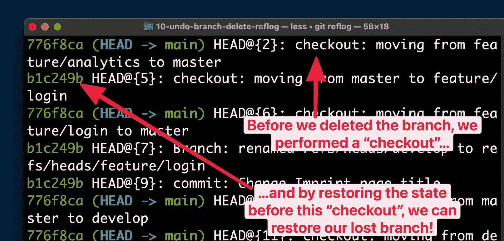

如果你仔细观察，这个好消息就显而易见了。在我们能够(灾难性地)删除我们的分支之前，我们必须执行一个`git checkout`来切换离开它(因为 Git 不允许您删除当前分支)。当然，这个`checkout`也被记录在 Reflog 中。为了恢复我们删除的分支，我们现在可以简单地将之前的状态*作为新分支的起点:*

```
$ git branch feature/analytics b1c249b 
```

瞧，我们的分公司起死回生了！🌸💀🌺

如果你碰巧使用像[塔](https://www.git-tower.com/?utm_source=sitepoint&utm_medium=guestpost&utm_campaign=undoing-mistakes-in-git)这样的桌面 GUI，撤销这样的错误通常就像按`CMD` + `Z`一样简单。

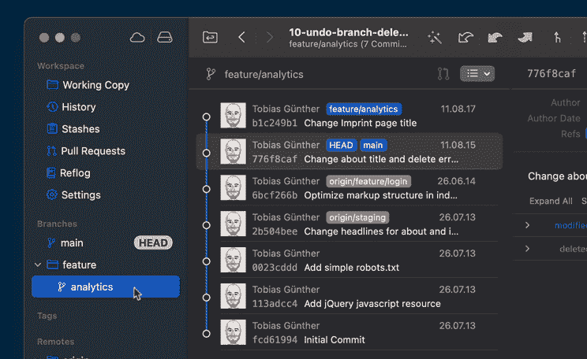

## 将提交移动到不同的分支

让我们以“哦，不！”中的另一个真正的经典来结束部门:提交到错误的分支。

今天，许多团队都有一个适当的规则，禁止直接提交到长期运行的分支，如“main”、“master”或“develop”。通常情况下，新的提交应该只通过合并/重组到达那些分支。然而，我们有时会忘记并直接承诺…

让我们以下面的场景为例。

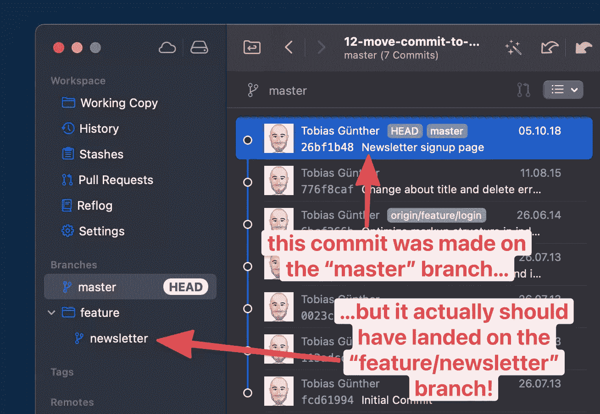

我们应该在`feature/newsletter`提交，但是无意中扣动了`master`分支的扳机。让我们一步一步来看解决方案。

首先，我们必须确保这次我们在正确的分支上，所以我们要检查`feature/newsletter`:

```
$ git checkout feature/newsletter 
```

现在我们可以使用`cherry-pick`命令安全地转移提交:

```
$ git cherry-pick 26bf1b48 
```

我们可以看一下`feature/newsletter`,将会看到，现在，这里也存在提交。

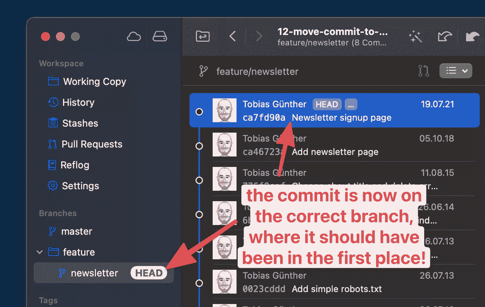

到目前为止，一切顺利。但是`cherry-pick`并没有*从`master`分支中移除*该提交——它不应该*在那里*。所以我们也要收拾我们的烂摊子:

```
$ git checkout master
$ git reset --hard HEAD~1 
```

我们切换回`master`，然后使用`git reset`从历史中删除(这里)不需要的提交。

最后，一切又都好了——所以你现在可以开始你的快乐舞蹈了！💃🕺🏻

## 消除错误是一种超能力

我以前说过，不幸的是我们都知道这是真的:我们无法避免错误！无论我们是多么伟大的程序员，我们都会时不时地出错。因此，问题不是*如果*我们犯了错误，而是*我们能多好地处理和解决问题？*

如果你想进一步了解 Git 的撤销工具，我强烈推荐“[Git](https://www.git-tower.com/learn/git/first-aid-kit?utm_source=sitepoint&utm_medium=guestpost&utm_campaign=undoing-mistakes-in-git)急救包”。这是一个(免费的)短片集，展示了如何在 Git 中清理和撤销错误。

享受快速移动的乐趣，打破东西——当然，还有修理它们！

## 分享这篇文章