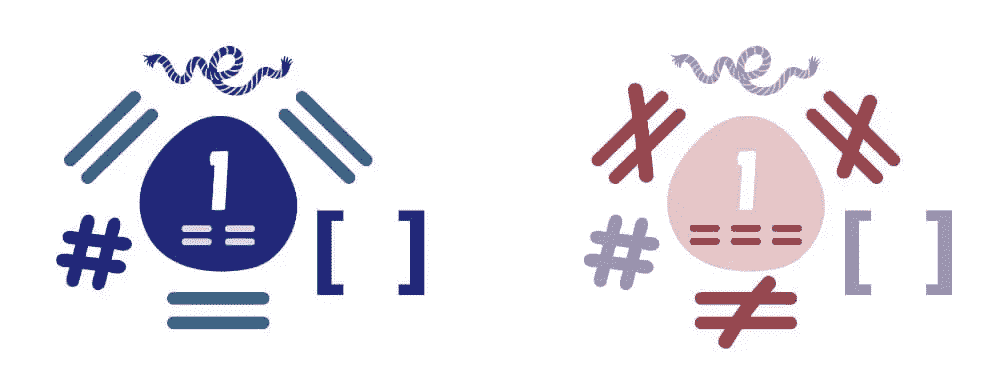

# 真值和假值:当 JavaScript 中所有的值都不相等时

> 原文：<https://www.sitepoint.com/javascript-truthy-falsy/>

比较两个事物是否相等经常会让粗心的 JavaScript 开发人员出错，因为这种语言有几个我们需要注意的古怪之处。

在本文中，我们将研究为什么会这样，探索 double 和 triple equals 运算符，以及 JavaScript 中 true 和 falsy 值的概念。当你读完这篇文章时，你会明白 JavaScript 是如何进行比较的，以及 truthy 和 falsy 值如何帮助你写出更简洁的代码。


## 在 JavaScript 中键入

JavaScript 变量是松散/动态类型的，该语言不关心值是如何声明或更改的:

```
let x;
x = 1;   // x is a number
x = '1'; // x is a string
x = [1]; // x is an array 
```

当与`==`比较时，看似不同的值等于`true`(松散或抽象相等)，因为 JavaScript 在比较之前(有效地)将每个值转换为字符串表示:

```
// all true
1 == '1';
1 == [1];
'1' == [1]; 
```



当与`===`(严格相等)比较时，会出现更明显的`false`结果，因为考虑了类型:

```
// all false
1 === '1';
1 === [1];
'1' === [1]; 
```

在内部，JavaScript 将值设置为七种原始数据类型之一:

*   未定义(没有定义值的变量)
*   Null(单个空值)
*   布尔值(一个`true`或`false`值)
*   数字(这包括`Infinity`和`NaN`——不是数字！)
*   BigInt(大于 2^53–1 的整数值)
*   字符串(文本数据)
*   符号(ES6/2015 中新增的唯一且不可变的原语)

其他一切都是对象——包括数组。


## JavaScript 中的真值与假值

和类型一样，每个值也有一个固有的[布尔值](https://www.sitepoint.com/boolean-data-type/)，通常被称为*真值*或*假值*。决定非布尔值如何转换为真值或假值的一些规则有点奇怪。理解这些概念及其对比较的影响有助于调试 JavaScript 应用程序。

以下值为 **always falsy** :

*   `false`
*   `0`(零)
*   `-0`(负零)
*   `0n` ( `BigInt`零)
*   `''`、`""`、````(空字符串)
*   `null`
*   `undefined`
*   `NaN`

其他一切都是真实的。这包括:

*   `'0'`(包含单个零的字符串)
*   `'false'`(包含文本“false”的字符串)
*   `[]`(一个空数组)
*   `{}`(一个空物体)
*   `function(){}`(“清空”功能)

因此，在条件中可以使用单个值。例如:

```
if (value) {
  // value is truthy
}
else {
  // value is falsy
  // it could be false, 0, '', null, undefined or NaN
} 
```

#### `document.all`

您可能还会看到`document.all`被列为一个错误值。这将返回一个包含所有文档元素列表的`HTMLAllCollection`。虽然这在布尔上下文中被认为是`false`，但它是一个不推荐使用的特性，MDN 建议不要使用它。


## 与`==`的宽松等式比较

使用`==`宽松等式比较*真值*和*假值*时，可能会出现意外情况:

| **T2`==`** | **T2`true`** | **T2`false`** | **T2`0`** | **T2`''`** | **T2`null`** | **T2`undefined`** | **T2`NaN`** | **T2`Infinity`** | **T2`[]`** | **T2`{}`** |
| --- | --- | --- | --- | --- | --- | --- | --- | --- | --- | --- |
| **T2`true`** | 真实的 | 错误的 | 错误的 | 错误的 | 错误的 | 错误的 | 错误的 | 错误的 | 错误的 | 错误的 |
| **T2`false`** | 错误的 | 真实的 | 真实的 | 真实的 | 错误的 | 错误的 | 错误的 | 错误的 | 真实的 | 错误的 |
| **T2`0`** | 错误的 | 真实的 | 真实的 | 真实的 | 错误的 | 错误的 | 错误的 | 错误的 | 真实的 | 错误的 |
| **T2`''`** | 错误的 | 真实的 | 真实的 | 真实的 | 错误的 | 错误的 | 错误的 | 错误的 | 真实的 | 错误的 |
| **T2`null`** | 错误的 | 错误的 | 错误的 | 错误的 | 真实的 | 真实的 | 错误的 | 错误的 | 错误的 | 错误的 |
| **T2`undefined`** | 错误的 | 错误的 | 错误的 | 错误的 | 真实的 | 真实的 | 错误的 | 错误的 | 错误的 | 错误的 |
| **T2`NaN`** | 错误的 | 错误的 | 错误的 | 错误的 | 错误的 | 错误的 | 错误的 | 错误的 | 错误的 | 错误的 |
| **T2`Infinity`** | 错误的 | 错误的 | 错误的 | 错误的 | 错误的 | 错误的 | 错误的 | 真实的 | 错误的 | 错误的 |
| **T2`[]`** | 错误的 | 真实的 | 真实的 | 真实的 | 错误的 | 错误的 | 错误的 | 错误的 | 错误的 | 错误的 |
| **T2`{}`** | 错误的 | 错误的 | 错误的 | 错误的 | 错误的 | 错误的 | 错误的 | 错误的 | 错误的 | 错误的 |

规则是:

*   `false`，零和空字符串都是等价的。
*   `null`和`undefined`只等同于它们自己和彼此，而不是别的。
*   `NaN`不等同于任何东西——*包括另一个`NaN`！*。
*   `Infinity`是真实的— *但不能与`true`或`false`相比！*。
*   空数组是真的——*然而与`true`比较是`false`，与`false`比较是`true`？！*。

请注意不同类型的空值在计算方式上的差异。空字符串或`undefined`值是假的，但空数组或对象是真的。

示例:

```
// all true
false == 0;
0 == '';
null == undefined;
[] == false;
!![0] == true;

// all false
false == null;
NaN == NaN;
Infinity == true;
[] == true;
[0] == true; 
```

## 与`===`的严格相等比较

使用严格相等比较时，情况会更清楚，因为值类型必须匹配:

| `===` | **T2`true`** | **T2`false`** | **T2`0`** | **T2`''`** | **T2`null`** | **T2`undefined`** | **T2`NaN`** | **T2`Infinity`** | **T2`[]`** | **T2`{}`** |
| --- | --- | --- | --- | --- | --- | --- | --- | --- | --- | --- |
| **T2`true`** | 真实的 | 错误的 | 错误的 | 错误的 | 错误的 | 错误的 | 错误的 | 错误的 | 错误的 | 错误的 |
| **T2`false`** | 错误的 | 真实的 | 错误的 | 错误的 | 错误的 | 错误的 | 错误的 | 错误的 | 错误的 | 错误的 |
| **T2`0`** | 错误的 | 错误的 | 真实的 | 错误的 | 错误的 | 错误的 | 错误的 | 错误的 | 错误的 | 错误的 |
| **T2`''`** | 错误的 | 错误的 | 错误的 | 真实的 | 错误的 | 错误的 | 错误的 | 错误的 | 错误的 | 错误的 |
| **T2`null`** | 错误的 | 错误的 | 错误的 | 错误的 | 真实的 | 错误的 | 错误的 | 错误的 | 错误的 | 错误的 |
| **T2`undefined`** | 错误的 | 错误的 | 错误的 | 错误的 | 错误的 | 真实的 | 错误的 | 错误的 | 错误的 | 错误的 |
| **T2`NaN`** | 错误的 | 错误的 | 错误的 | 错误的 | 错误的 | 错误的 | 错误的 | 错误的 | 错误的 | 错误的 |
| **T2`Infinity`** | 错误的 | 错误的 | 错误的 | 错误的 | 错误的 | 错误的 | 错误的 | 真实的 | 错误的 | 错误的 |
| **T2`[]`** | 错误的 | 错误的 | 错误的 | 错误的 | 错误的 | 错误的 | 错误的 | 错误的 | 错误的 | 错误的 |
| **T2`{}`** | 错误的 | 错误的 | 错误的 | 错误的 | 错误的 | 错误的 | 错误的 | 错误的 | 错误的 | 错误的 |

唯一的例外是`NaN`，它仍然顽固地不等同于一切。

## 使用真值或假值的建议

真实和虚假的价值可以抓住最有经验的开发人员。那些编程新手或从其他语言迁移过来的人没有机会！幸运的是，在处理真值和假值变量时，有三个简单的步骤来捕捉最难发现的错误。让我们依次看一下每一个。

### 1.避免直接比较

当一个值总是等于真或假时，很少需要比较两个真值和假值:

```
// instead of
if (x == false) // ...
// runs if x is false, 0, '', or []

// use
if (!x) // ...
// runs if x is false, 0, '', NaN, null or undefined 
```

### 2.使用`===`严格等式

使用`===`严格相等(或`!==`严格不相等)比较来比较值并避免类型转换问题:

```
// instead of
if (x == y) // ...
// runs if x and y are both truthy or both falsy
// e.g. x = null and y = undefined

// use
if (x === y) // ...
// runs if x and y are identical...
// except when both are NaN 
```

### 3.必要时转换为实布尔值

在 JavaScript 中，您可以使用[布尔构造函数](https://developer.mozilla.org/en-US/docs/Web/JavaScript/Reference/Global_Objects/Boolean/Boolean)或双负函数`!!`将任何值转换为实布尔值。这将让你绝对肯定一个错误仅仅是由`false`、`0`、`""`、`null`、`undefined`和`NaN`产生的:

```
// instead of
if (x === y) // ...
// runs if x and y are identical...
// except when both are NaN

// use
if (Boolean(x) === Boolean(y)) // ...
// or
if (!!x === !!y) // ...
// runs if x and y are identical...
// including when either or both are NaN 
```

当传递真值时,`Boolean`构造函数返回`true`,当传递假值时返回`false`。当与迭代方法结合时，这可能是有用的。例如:

```
const truthy_values = [
  false,
  0,
  ``,
  '',
  "",
  null,
  undefined,
  NaN,
  '0',
  'false',
  [],
  {},
  function() {}
].filter(Boolean);

// Filter out falsy values and log remaining truthy values
console.log(truthy_values); 
```

## 结论

Truthy 和 falsy 值允许您编写简洁的 JavaScript 条件和三元运算符。但是，请始终考虑边缘情况。一个流氓空数组或 NaN 变量可能导致许多小时的调试痛苦！

您需要我们在这里介绍的任何帮助吗？为什么不去我们的 [JavaScript 论坛](https://www.sitepoint.com/community/c/javascript/33)问个问题呢。我们有一个友好的专家团队随时准备提供帮助。

## 分享这篇文章