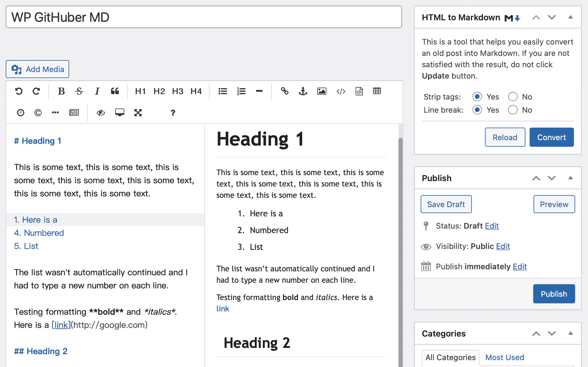
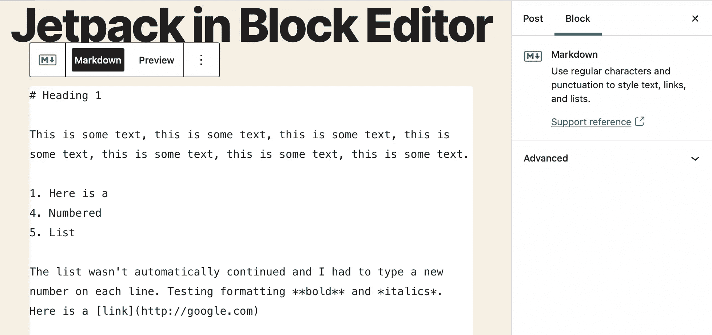
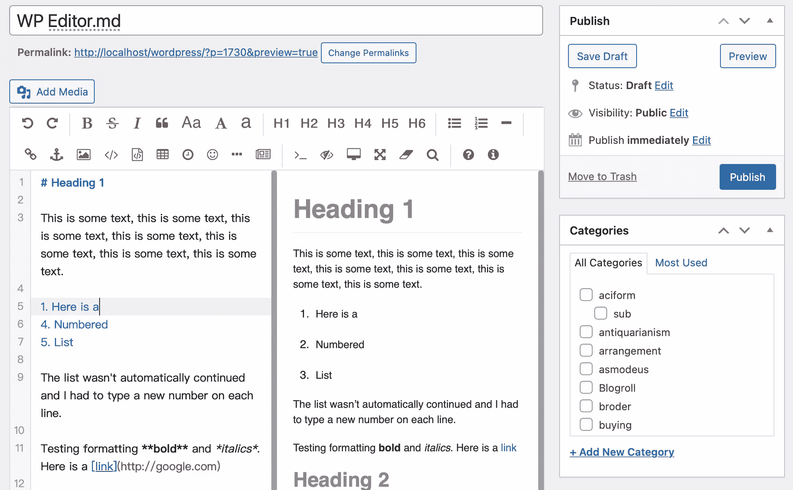
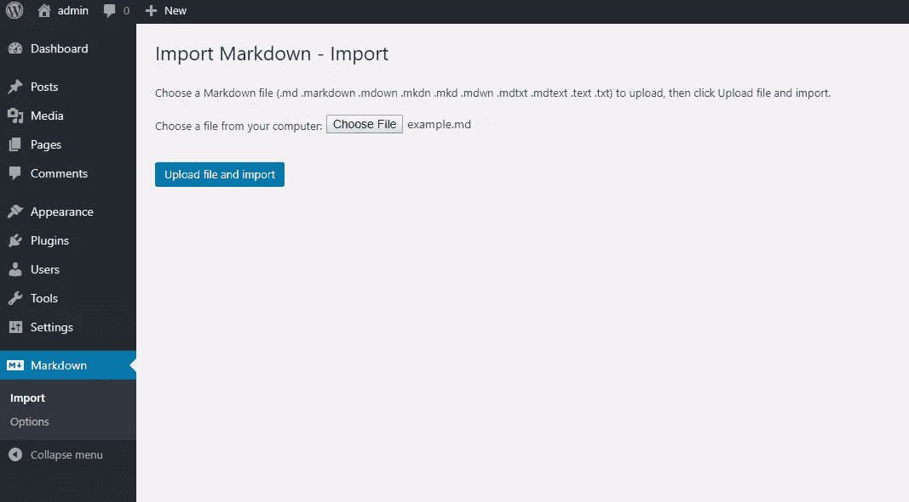
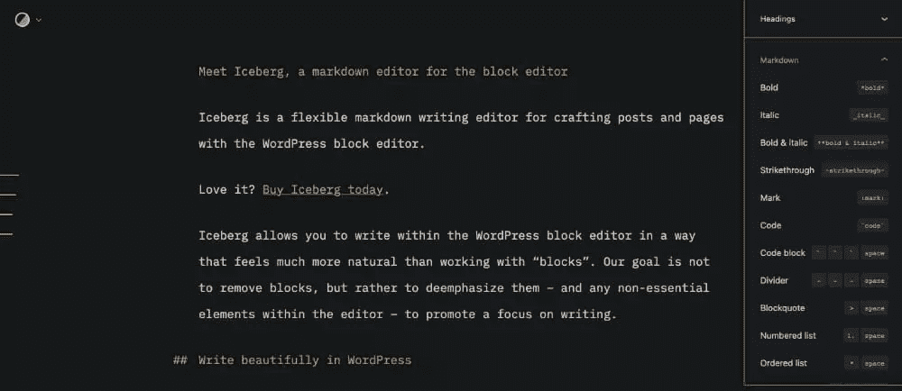
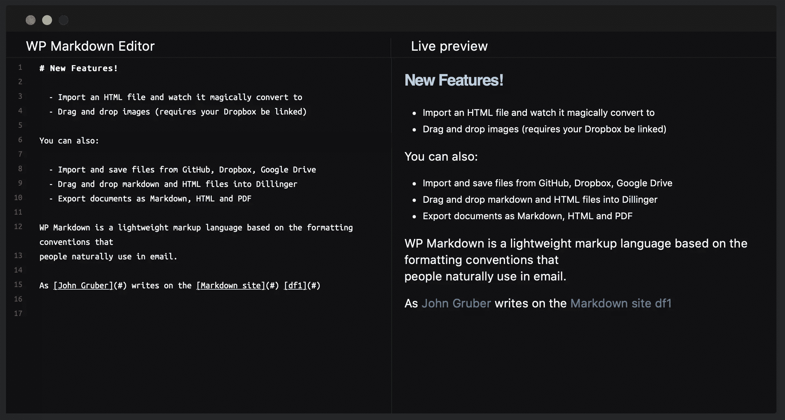

# WordPress 最好的降价插件

> 原文：<https://www.sitepoint.com/the-best-markdown-plugins-for-wordpress/>

Markdown 是一种为网络编写内容的快速有效的方法。它易于编写、易于阅读，并且易于转换为 HTML。它使作家和博客作者能够在不使用过于复杂和视觉疲劳的代码的情况下写作。

这个语法是由约翰·格鲁伯在 2004 年创造的，并在博客和论坛上流行开来。它用在 Reddit、Trello、GitHub、Stack Overflow、SourceForge 和 Stack Exchange 上。很有可能，你已经很熟悉它了。

Markdown 为作家和博客作者提供了许多好处，但是默认情况下，WordPress 不支持它。你需要在粘贴到 WordPress 之前将你的 Markdown 转换成 HTML，或者使用一个插件。

在这篇文章中，我们将介绍 WordPress 的五个最好的 Markdown 插件。从一开始就要明确:最好避免同时有多个活动的，并且通过使用文本编辑器而不是可视化编辑器来避免格式化带来的意外。

现在，让我们开始吧。

## WordPress 的降价插件

这里有五个 WordPress Markdown 插件，正在积极开发中，可以与 WordPress 的最新版本一起使用。

### 1.WP Githuber MD

[WP Githuber MD](https://wordpress.org/plugins/wp-githuber-md/) 是一个一体化的 Markdown 插件，使用 GitHub 风味的 Markdown。它正在积极开发中，提供语法高亮显示、实时预览窗格、拼写检查、图像粘贴，并且可以将 HTML 转换为 Markdown。可以为每个帖子单独启用或禁用降价。

启用后，您的帖子会保存在 Markdown 中，以便于编辑。该插件将 Markdown 解析为 HTML，并将结果保存到`wp-posts.post_content`中。这确保了即使插件关闭，你的文章也能正确显示。

编辑器的顶部提供了一个工具栏。它包括格式、标题、列表、链接、图像等图标。当我测试这个插件时，我发现按下`enter`时列表不会自动继续。每行都需要输入新的数字、连字符或星号。

该插件评级很高，并定期更新。这是我所知道的最好的 WordPress Markdown 编辑器。

### 2.喷气背包

Jetpack 是 Automattic 的一个知名插件，它给自托管 WordPress 安装提供了和你在 WordPress 上发现的一样的功能集。这包括降价。该插件目前遵循 [CommonMark](https://commonmark.org/help/) 语法，支持表格、脚注等等。

Markdown 编辑需要从 Jetpack 的设置中手动激活，LaTeX 可以单独启用，用于编写数学方程和公式。然后你可以使用[块编辑器](https://jetpack.com/support/markdown/)或[经典编辑器](https://jetpack.com/support/markdown-classic-editor/)在 Markdown 中创建和编辑文章。不幸的是，既不提供语法高亮显示，也不提供降价预览窗格。

如果使用块编辑器，新的标记块将变为可用。如果您使用经典编辑器，您将在文本编辑器中获得最佳结果。可视化编辑器可能会产生意外的结果。

你的文章的降价版本会被保留下来，以备将来编辑，发布的文章会自动保存在 HTML 中，这样即使插件被停用，你的网站仍然会很好看。也支持降价注释。

### 3.WP Editor.md

WP Editor.md 是一个 WordPress Markdown 编辑器，带有语法高亮和预览面板。不幸的是，很少有关于它的文档。它类似于 WP Githuber MD 的界面，使用 Jetpack 的 Markdown 模块来解析和保存内容。当我测试该插件时，预览窗格中的列表显示为双倍行距，但发布时看起来很好。

然而，当它把你的文章转换成 HTML 格式时，它似乎是以那种格式保存的。这让一位之前一直使用 Jetpack 的用户感到沮丧。他惊讶地得知，他所有的降价帖子都不再降价了。

### 4.进口降价

我用这个插件作弊了一点。 [Import Markdown](https://wordpress.org/plugins/import-markdown/) 不是 Markdown 编辑器，而是将你在别处创建的 Markdown 文件导入 WordPress。

降价被解析并保存为 HTML。支持各种风格的降价。只需从包含的五个解析器中选择一个。

### 5.冰山

Iceberg 是一个独特、灵活的写作编辑器，可以用 WordPress block editor 在 Markdown 中编辑文章。Iceberg 允许你在 WordPress 块编辑器中以一种比使用“块”更自然的方式进行写作。正如冰山所说:

> 我们的目标不是删除程序块，而是弱化它们——以及编辑器中的任何非必要元素——以促进对写作的关注。

冰山售价 49 美元。

## 要避免的降价插件

可悲的是，可用的 WordPress Markdown 插件列表出奇的短。这很大程度上是因为我们以前的许多建议没有被保留，不再适用于 WordPress 的最新版本。

你可能会在查阅旧的综述和评论时遇到它们，所以我将它们列在这里，这样你就不会浪费时间。

*   [PrettyPress](https://wordpress.org/plugins/prettypress/) 于 2018 年关闭，不再提供下载。
*   [Typewriter](https://wordpress.org/plugins/typewriter/) 已经八年没有更新了，可能与 WordPress 的最新版本有兼容性问题。
*   [Markdown QuickTags](https://wordpress.org/plugins/markdown-quicktags/) 于 2018 年关闭，不再提供下载。
*   [Easy Markdown](https://github.com/DavidWells/easy-markdown) 已经五年没有更新了，开发者网站上也不再提供。

还有一个积极开发的插件，我不推荐。WP-Markdown 是一个看起来很有前途的商业插件，但它在去年收到的大多数评论都是一星。

它看起来很有吸引力，似乎功能丰富，但我不能评论它的有效性，因为免费版本是残废的。它只在 WordPress 中启用黑暗模式，不提供任何降价功能。

它还积极推销付费版本。你必须支付 52.15 美元/年或 89.95 美元终身解锁降价编辑器。

## 那么，最适合你的 WordPress Markdown 插件是什么？

过去推荐的许多 Markdown 插件已经被放弃了。它们已经很多年没有更新了。新功能永远不会被添加，错误永远不会被修复，并且它们不能与 WordPress 的最新版本一起使用。

我上面推荐的五个插件都不是那样的。哪个最适合你？

如果你正在寻找一个只做降价的插件，我推荐 WP Githuber MD。它是我们综述中功能最丰富的插件，评价很高，正在积极开发中。它以 Markdown 格式保存你的文章以便于编辑，并以 HTML 格式保存发布的版本，这样即使插件被禁用，你的网站也能正确显示。

Jetpack 是另一个很好的选择，但是如果你只需要一个降价插件的话，可能会有些过头。它还提供安全，备份，反恶意软件，等等。如果这些是您正在寻找的功能，请考虑一下。它也允许你输入 Markdown，但是要注意它不提供语法高亮或者预览面板。

Iceberg 是一个非常好看的插件，非常适合现有的 WordPress 块编辑器。它有一种自然的感觉，非常好相处。这是目前 SitePoint 编辑器首选的 WordPress Markdown 插件。如果你愿意掏出信用卡，绝对值得一试。

## 分享这篇文章