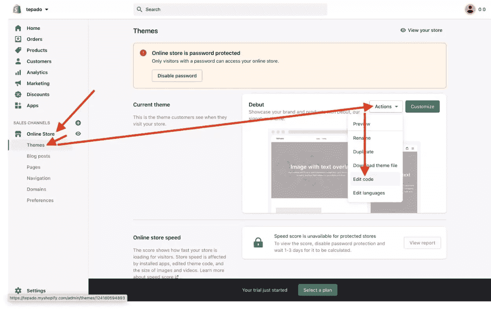
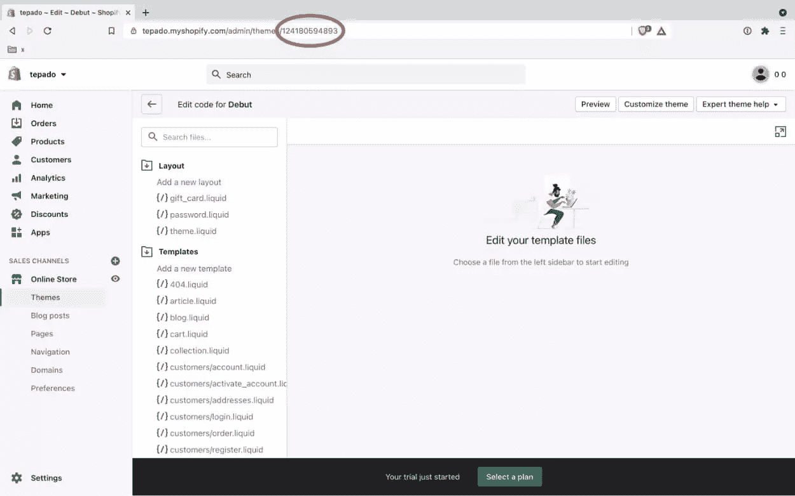
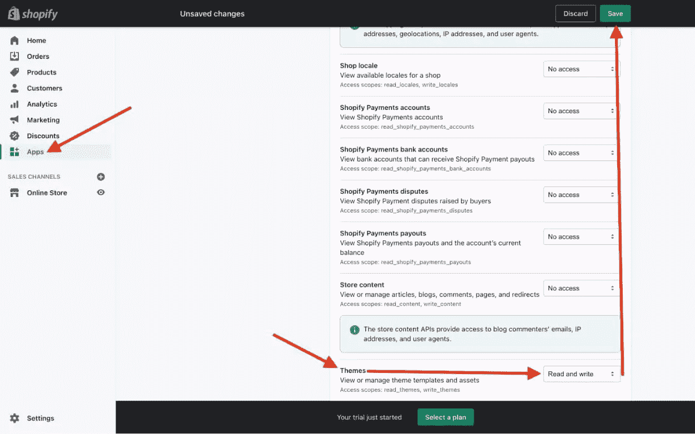
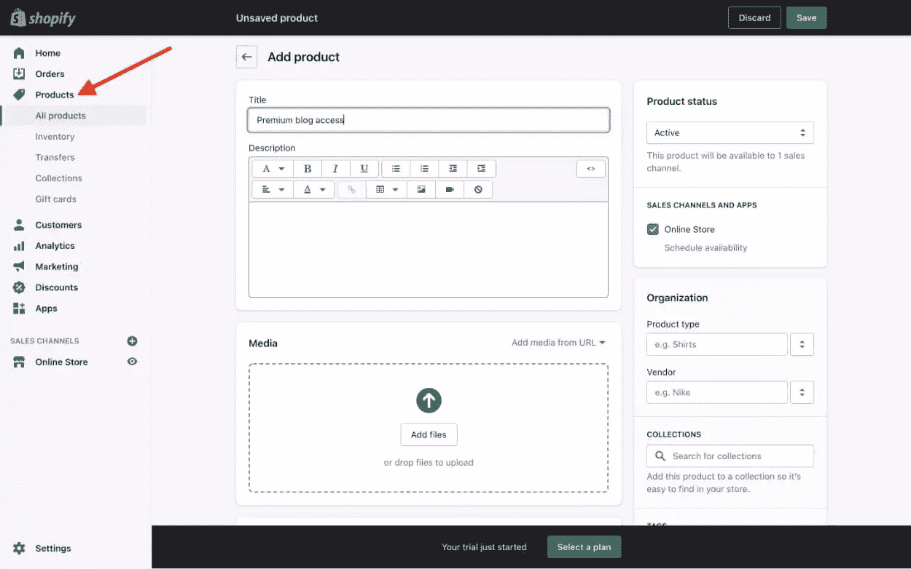

# 使用 Shopify 创建您自己的订阅博客

> 原文：<https://www.sitepoint.com/build-shopify-subscription-blog/>

在本文中，我将展示如何使用 HTML、CSS 和 Liquid (Shopify 的模板语言)用 Shopify 构建一个付费博客。尽管 Shopify 的博客功能有些基础，而且还有其他在线服务专门帮助博客作者建立读者可以付费订阅的博客(如 Ghost)，但我会解释为什么你可能宁愿使用 Shopify。

## 啊？内容 Shopify？为什么？

Shopify 可以说是电子商务领域的领导者。与竞争对手相比，它拥有最多的客户和最多的现成功能(执行良好)。

由于其销售点系统，Shopify 可以促进几乎任何东西的销售，包括基于订阅的服务、数字下载、免费赠品，甚至店内商品。

我会说，大多数人认为 Shopify 是电子商务领域的老大，尽管有出售内容访问权限的专业服务，但我仍然认为 Shopify 是更好的选择。

例如，让我们比较一下 Shopify 和 Ghost，因为 Ghost 是当今发展最快的博客内容管理系统。

Shopify Basic 和 Ghost Pro Basic 都是 29 美元/月。然而，Shopify 可以出售任何东西，而 Ghost 只能出售基于*订阅*的内容。Ghost 不能以一次性收费的方式出售内容访问权，也不能以此作为副业。谈到商业模式的灵活性，Shopify 轻而易举地胜出。

老实说，唯一的警告是博客功能被认为是 Shopify 的薄弱环节，但如果你喜欢从头开始构建主题(坦白地说，这带来了许多好处)，那么你会惊讶于 Shopify 的流动模板语言是多么强大和灵活。我不会考虑 Shopify 一个电子商务*平台*，而是一个植根于电子商务的 CMS。

因此，如果你想让一家新企业向其他/替代商业模式敞开大门，或者你已经有了一家 Shopify 商店，并有一个你想赚钱的博客，让我们开始吧。

## 先决条件

你需要在 web 开发方面相当熟练，至少理解 HTML 和 CSS。了解一些 Shopify 使用的 Liquid 模板语言当然是有益的，但不是必需的，因为 Liquid 在学习过程中有些容易。(无论如何，我都建议查看一下[液体文档](https://shopify.dev/api/liquid/)。)

你还需要[创建一个 Shopify 账户](https://shopify.com/)，该账户 14 天免费(不需要信用卡)。但是，请注意，除非你选择付款计划，否则你将无法取消商店的密码保护。

## 步骤 1:定义主题结构

首先，让我们混合使用必需文件和公共文件来定义主题的文件结构。在本教程中，我们不会全部使用它们，但您可以在将来使用该结构来 kickstart 任何准系统 Shopify 商店。这些文件暂时可以是空白的:

```
.
├── assets
├── config
│   ├── settings_data.json
│   └── settings_schema.json
├── layout
│   └── theme.liquid
├── sections
├── snippets
└── templates
    ├── 404.liquid
    ├── article.liquid
    ├── blog.liquid
    ├── cart.liquid
    ├── collection.liquid
    ├── customers
    │   ├── account.liquid
    │   ├── activate_account.liquid
    │   ├── addresses.liquid
    │   ├── login.liquid
    │   ├── order.liquid
    │   ├── register.liquid
    │   └── reset_password.liquid
    ├── gift_card.liquid
    ├── index.liquid
    ├── list-collections.liquid
    ├── page.liquid
    ├── password.liquid
    ├── product.liquid
    └── search.liquid 
```

如果您继续使用 macOS 或 Linux，可以使用以下命令来生成结构:

```
mkdir -p assets snippets sections config layout templates/customers
touch config/settings_data.json config/settings_schema.json
touch layout/theme.liquid
cd templates/customers
touch account.liquid activate_account.liquid addresses.liquid login.liquid order.liquid register.liquid reset_password.liquid
cd ..
touch 404.liquid article.liquid blog.liquid cart.liquid collection.liquid gift_card.liquid index.liquid list-collections.liquid page.liquid password.liquid product.liquid  search.liquid

# back into the project root
cd .. 
```

延伸阅读:

*   [主题文件结构](https://shopify.dev/docs/themes/theme-file-structure/)

## 步骤 2:获取主题 ID

接下来，我们需要获得已经安装的默认主题的主题 ID。在 Shopify admin 中，导航到**在线商店** > **主题** > **动作** > **编辑代码**，然后记下 URL 中的数字主题 ID。如果你已经设置了一个主题，使用*主题 ID 来代替。*





*注意:虽然默认主题——“首次亮相”——是一个全功能的编码主题，但我们将用我们的代码覆盖它。*

## 步骤 3:设置主题工具包

主题工具包是一个命令行工具，用于构建和管理 Shopify 主题。在本教程中，我们将使用主题工具包来观察主题目录中的代码变化，并将这些变化部署到我们的主题中。

Theme Kit 可以在 Windows、macOS 和 Linux 上工作，并可以与 Git 和 Node.js 等工作流工具一起工作。为了保持简单，我们将省略工作流工具，只使用 Theme Kit。

### 安装主题工具包

首先，使用命令行安装主题工具包。

#### 窗户和巧克力

```
choco install themekit 
```

#### 苹果电脑和家酿啤酒

```
brew tap shopify/shopify
brew install themekit 
```

#### Linux 操作系统

```
curl -s https://shopify.dev/themekit.py | sudo python 
```

### 创建一个 Shopify“应用”

接下来，创建一个 Shopify“app”来获取 Theme Kit 认证主题更改所需的必要凭证。

在 Shopify admin 中，导航至**应用** > **管理私人应用**，然后勾选三个复选框接受条款和条件。接下来选择**启用私人应用开发** > **创建私人应用**并完成表格。

在这一步中，您需要为您的私人应用程序命名，并输入紧急开发者电子邮件。在点击**保存**按钮之前，您还需要启用“主题”的“读写”权限。这最后一点隐藏在一个**显示非活动管理 API 权限**下拉列表后面。



最后，点击**创建应用**并记下下一屏幕上的“密码”。

### 注意代码变化

安装了主题工具包，主题 ID 和密码都准备好了，我们需要从命令行运行`watch`命令。

首先， [cd](https://www.git-tower.com/learn/git/ebook/en/command-line/appendix/command-line-101/#finding-your-way-around) 进入你的主题目录。

接下来，运行以下命令，在浏览器中打开主题，并观察代码的变化。记得用你的`myshopify`网址(减去`https://`)替换`xxx`，用你的密码替换`<password>`，用你的 Shopify 主题 ID 替换`<theme-id>`:

```
theme open -s xxx.myshopify.com -p <password> -t <theme-id> --hidepb
theme watch -s xxx.myshopify.com -p <password> -t <theme-id> --allow-live 
```

请注意附加标志:

*   `--hidepb`:隐藏烦人的[预览栏](https://community.shopify.com/c/Technical-Q-A/how-to-remove-preview-bar/td-p/670493/)
*   一些可以理解的摩擦让你知道你正在编辑现场主题(以防你不知道！)

为了方便起见，我建议将上面的命令序列作为一个 [Alfred](https://alfredapp.com/) 工作流(或类似的工作流)来运行。虽然你*可以*将主题凭证存储在 [config.yml](https://shopify.dev/tools/theme-kit/configuration-reference#config-file) 文件中，但我不会冒险无意中暴露它们——例如，通过 GitHub(这将是一个安全漏洞)。

做完这些，让我们深入到代码方面。

## 步骤 4:创建主题包装器(`theme.liquid`)

我们将从`theme.liquid`文件开始，因为它不仅有一些特定的要求，而且是 Shopify 主题中最重要的文件之一。简而言之，这个文件是主题的包装器:在`theme.liquid`中标记的任何东西都会出现在*的每一页*中。您可能希望以这样的方式开始标记:

```
<!doctype html>
<html>
  <head>
    <!-- head markup -->
    {{ content_for_header }}
  </head>
  <body>
    <!-- header markup -->
    {{ content_for_layout }}
    <!-- footer markup -->
  </body>
</html> 
```

你可能已经从上面的代码中注意到，要输出带有液体的东西，你需要使用双花括号(`{{ }}`)。关于这一点，有两件事已经输出。这些都是必需的，如果您的`theme.liquid`中缺少其中任何一个，主题工具包都会抛出一个错误:

*   使 Shopify Analytics 之类的功能发挥作用所需的一切代码注入
*   `{{ content_for_layout }}`:注入相关的模板(如`blog.liquid`)，这些模板都存储在`/templates`中

记住，主题包在看。每当你保存你的文件，主题工具包将知道并部署到你的远程主题的变化(虽然你必须刷新你的浏览器才能看到它们)。

## 第五步:循环阅读文章

在下一步中，我们将深入到`blog.liquid`中，并遍历我们所有的文章。如果您还没有创建任何博客，请前往**在线商店** > **博客帖子**，创建一个博客以及一些文章，记住将它们的可见性设置为`visible`(默认为`hidden`)。

你可以在`https://<store-name>.myshopify.com/blogs/blog-handle/`找到这个博客。默认的 Shopify 博客位于`/blogs/news/`。

将下面的代码粘贴到`blog.liquid`中将列出当前博客中的所有文章，显示每个文章的标题，这些标题包含在链接到相关文章的`<a href>`元素中:

```

  <a href="{{ article.url }}">{{ article.title }}</a>
 
```

延伸阅读:

*   [博客对象液体参考](https://shopify.dev/docs/themes/liquid/reference/objects/blog/)
*   [物品液体参考](https://shopify.dev/docs/themes/liquid/reference/objects/article/)

## 第六步:输出文章

在这一步中，我们将为`article.liquid`编写代码。这将输出文章，但是如果用户不是一个*登录的付费客户*，它将变得模糊，一个**获取访问**按钮将把用户带到`/cart/`(然后是结账)。

### 创造一个“产品”

首先，我们需要创建一个“产品”，提供对博客的访问，只需一次性付费(Shopify 可以本地完成这项工作)或基于订阅(需要 [Shopify 订阅应用](https://apps.shopify.com/collections/checkout-subscription/))。

导航到**产品** > **添加产品**，并将其命名为“高级博客访问”。当然，确保您取消选中**跟踪数量**和**这是一个实物产品**复选框。



点击**保存**，然后记下 URL 中的产品 ID。

### 预写一些逻辑

使用下面的代码检查“项目”是否已经在购物车中，用您的产品 ID 替换“ID”。我们稍后将检查`accessInCart`变量的存在，以确保用户不会意外地将商品添加到购物车两次:

```

  
    
  
 
```

类似地，使用下面的代码检查客户(假设他们已经登录)是否已经拥有访问权限。我们稍后将检查`hasAccess`变量的存在，以确保登录的客户不会看到**获取访问**按钮或被限制查看内容。

同样，请记住用您的产品 ID 替换“ID ”:

```

  
      
      
        
      
    
  
 
```

为了使代码更加简洁(*不要重复*)，如果您想在`article.liquid`之外的任何地方包含 **Get access** 按钮，请在`theme.liquid`中包含这两个代码片段。将代码片段放在`theme.liquid`中确保了`accessInCart`和`hasAccess`变量可以存在于*所有*和`/templates`中。

*注意:您还需要包括以下内容:“客户是否登录？”`theme.liquid`中的逻辑，以便客户可以从任何页面或模板登录或注销:*

```

  <a href="/account/logout/">Logout</a>

  <a href="/account/login/">Login</a>
 
```

### 输出文章

接下来，下面的代码将输出文章，但是如果客户没有访问博客的权限(或者没有登录，因此无法验证访问权限)，则添加一个`.blurred`类:

```
<article class="blurred">
  {{ article.content }}
</article> 
```

在您的 CSS 中包含以下代码以启用模糊:

```
.blurred {
  opacity: 0.5;
  filter: blur(0.5rem);
  user-select: none; // Prevents text selection
  pointer-events: none; // Prevents click events
} 
```

*作为奖励，您可能希望使用 JavaScript cookies 或`localStorage`来允许阅读【x】篇文章，然后仅在这些文章被阅读之后才应用上面的`.blurred`类。这通过允许文章被索引来提高 SEO，并通过提供有限的访问来提高转化率。*

### 创建一个“获取访问”按钮

最后，这里是 **Get access** 按钮的逻辑和标记:

```

  <a href="/cart/add/?id=ID&return_to=/cart/">Get access</a>
 
```

再次提醒，记住用您的产品 ID 替换“ID”。

延伸阅读:

*   [推车对象液体参考](https://shopify.dev/docs/themes/liquid/reference/objects/cart/)
*   [订购目标液体参考](https://shopify.dev/docs/themes/liquid/reference/objects/order/)
*   [物品液体参考](https://shopify.dev/docs/themes/liquid/reference/objects/article/)

## 第七步:建立你的主题的其余部分

唉，最后一步是你必须独自完成的:构建你的主题的其余部分。在步骤 1 中，我们在`/templates`中创建了一些`.liquid`文件。其中一些(例如`login.liquid`和`cart.liquid`)对于维护“高级博客访问”功能至关重要。

参考官方的 [Shopify 主题文档](https://shopify.dev/docs/themes)，它不仅会带你了解创建 Shopify 主题的基本知识，还会带你了解每个单独的`.liquid`模板(例如，[这里有一些 login.liquid](https://shopify.dev/docs/themes/theme-templates/customers-login-liquid/) 的样本代码)。

享受开发您的 Shopify 主题的其余部分！

## 分享这篇文章