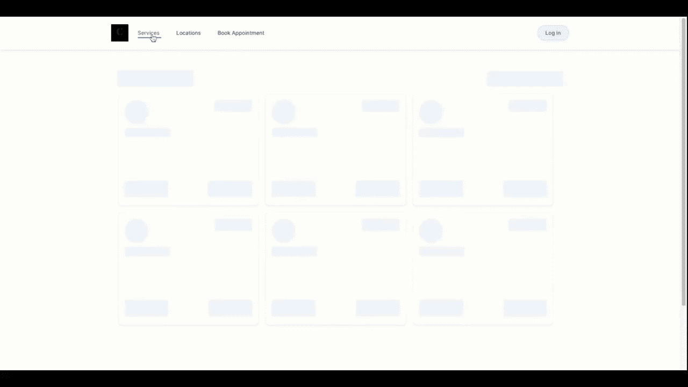
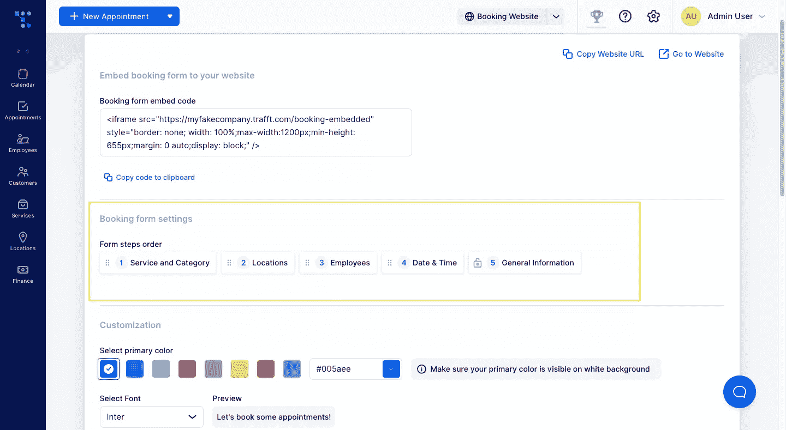
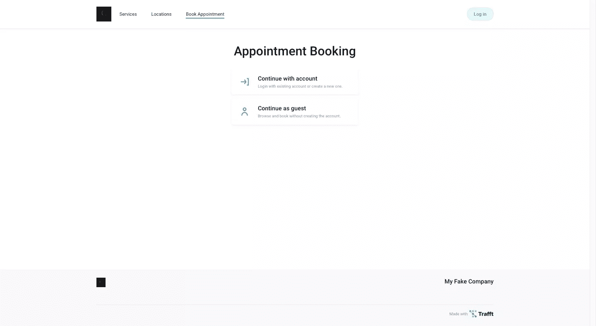
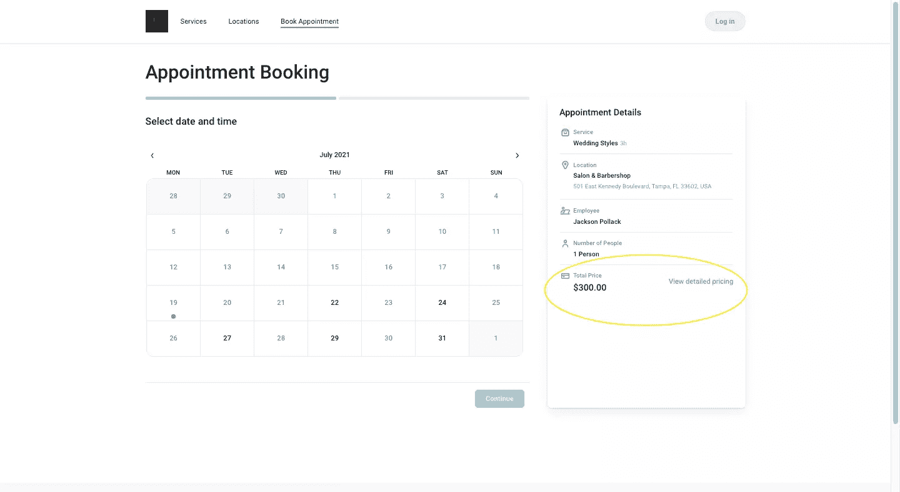
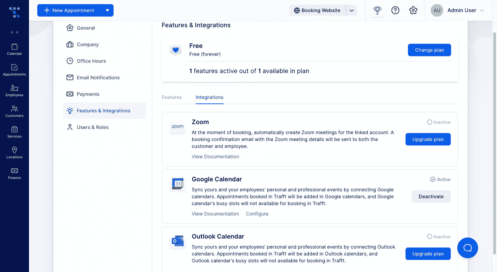
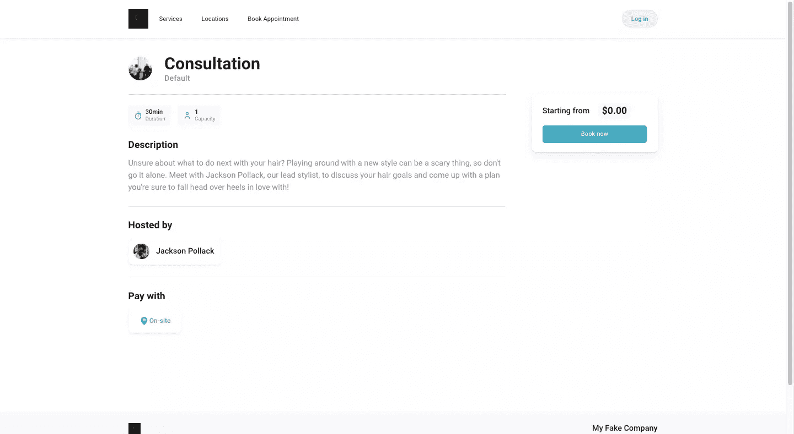
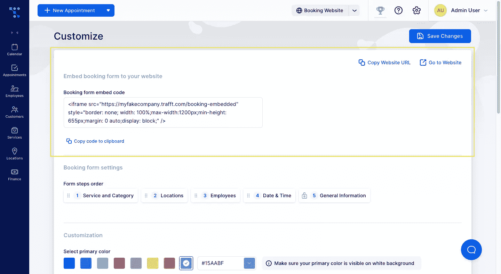
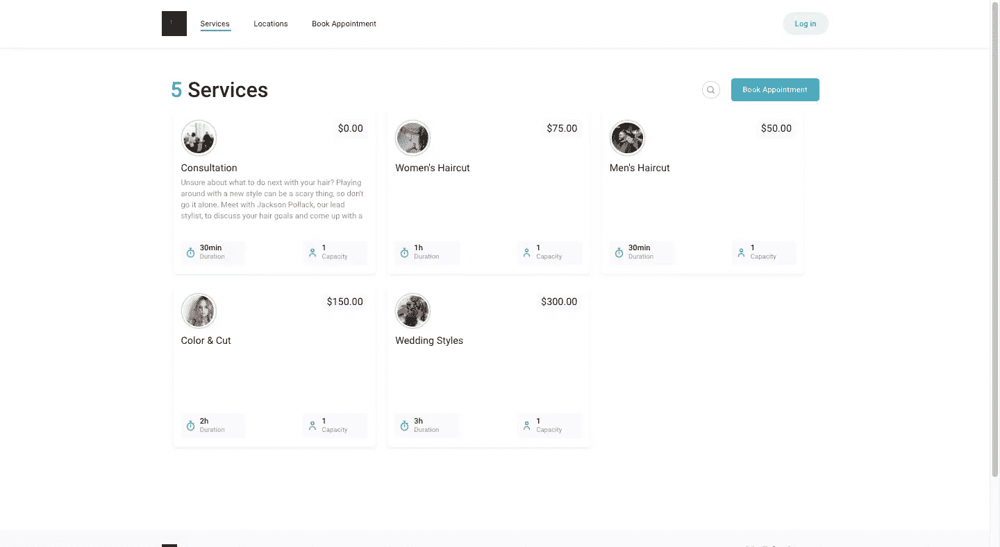

# 2021 年在线预订系统现代化的 4 个趋势

> 原文：<https://www.sitepoint.com/online-booking-system-trends/>

这篇赞助文章是由我们的内容合作伙伴 BAW 媒体创建的。感谢您对使 SitePoint 成为可能的合作伙伴的支持。

消费者期望为日常问题和情况提供现代、直观、便捷的解决方案。比如预约、预订和报名参加活动。

随着电话预订系统和基本联系方式等过时的解决方案越来越不受欢迎，2021 年消费者到底想要什么？换句话说，你为客户公司建立的在线预订系统应该是什么样的？

今天，我们将探讨四种现代预订趋势，以及如何利用 [Trafft](https://trafft.com/?utm_source=sitepoint.com&utm_medium=article&utm_campaign=july21) 构建转化率更高的在线预订系统，超越消费者和客户的期望。

## 4 在线预订系统的现代趋势

在写这篇文章的时候，千禧一代是消费能力最强的一代。Z 世代也不会落后太多。

为什么这很重要？嗯，如果一个品牌在技术偏好和需求方面跟不上，他们肯定会失去这些强大消费者的青睐。考虑到大多数千禧一代和新生代一天中大部分时间都呆在屏幕前，在线预订系统需要以对他们最有意义的方式交付。

为了跟上现代需求，有四种趋势可以让你建立更好的在线预订系统。

### 趋势 1:智能、高效的预订流程

在过去的十年里，订票系统经历了一些急需的变化。这是因为旧的预订系统管理和支持成本高昂。另外，用户体验中有太多的摩擦。

顾客被卡住了。或者不得不等待有人帮助他们协调预订。或者他们的约会因为笔误被放错了地方。这对客户来说是令人沮丧的，对企业来说是耗时的。

预订系统消除了预订过程中的这些复杂性。

首先，客户想知道他们有哪些选择:

*   位置
*   提供者
*   服务或事件
*   日期和时间
*   费用
*   付款类型
*   更多

所有这些都可以通过 [Trafft](https://trafft.com/?utm_source=sitepoint.com&utm_medium=article&utm_campaign=july21) 编程到你的在线预订系统中，这样顾客就可以在几分钟内自己解决预订的物流问题。

此外，您还可以在幕后设定与以下事项相关的规则:

*   工作日、工作时间、节假日等等
*   约会缓冲区
*   事件标准和限制
*   时区
*   员工可用性
*   预付款

这有助于你的客户避免那些尴尬的电话，他们不得不要求客户重新安排时间，因为他们所做的预订实际上并不可用。

更重要的是，一旦在线预订，您定义的预约指南会处理其余的事情。预订记录在客户和员工的日历上。提醒邮件和短信出去了。位置空间是预定的。诸如此类。

与过去的系统相比，它的效率非常高，不容易出错和受挫。

### 趋势 2:为注意力持续时间较短而设计的预订表格

[丹麦科技大学 2019 年的一项研究](https://www.sciencedaily.com/releases/2019/04/190415081959.htm)发现，我们的集体注意力持续时间正在逐年缩短。这是因为网上有丰富的信息。

因此，虽然在线预订表单给用户提供选择很重要，但它需要以一种简化的方式呈现。如果它看起来复杂或耗时，你肯定会看到更多的下降比预订。

请记住，极小和稀疏不是一回事。

精通技术的消费者可能会对快速预订流程感到舒适和自信，但其他人可能不会。如果你的表格过于简短，损害了他们对这个过程的信任或公司的信誉，那也是有问题的。所以，注意不要偷工减料。

这就是为什么构建一个要求最少但仍能从用户那里获取所有信息的表单很重要。同时，你应该教育他们或者在有意义的时候提供额外的背景。

有了[traffit](https://trafft.com/?utm_source=sitepoint.com&utm_medium=article&utm_campaign=july21)，你的预订过程将被分解成小而容易理解的步骤。

这将使用户更容易完成表单，因为他们被要求一次只完成一个小任务。

您可以根据对客户最有意义的方式来更改步骤的顺序。如果你不确定，A/B 测试将帮助你找到最合理和最理想的步骤顺序。

向表单中输入信息也得到简化。无论表单是要求客户点击并选择日历日期和时间，还是添加他们的联系信息，完成一个动作所需的步骤都是快速且易于执行的。

### 趋势 3:透明的数据隐私实践

《2020 年 NortonLifeLock 网络安全洞察报告》发现，74%的美国成年人非常关心他们的网络隐私。

头号忧虑？他们的个人信息会被窃取并暴露在数据泄露中。紧随其后的是担心他们的数据会在未经他们同意的情况下被卖给第三方。

即使您的在线预订表单只要求提供基本数据，如客户的姓名和电子邮件地址，如果没有采取正确的预防措施来确保他们的安全，您也会犹豫不决。

下面是一些你可以做的事情来让他们放心。

**1。允许他们作为客人预订**

有些用户不喜欢通过谷歌或脸书等第三方应用程序登录，或者不想创建另一个在线帐户和密码。

如果您想向客人开放预订，您可以在 [Trafft](https://trafft.com/?utm_source=sitepoint.com&utm_medium=article&utm_campaign=july21) 中轻松配置该设置。

**2。不要隐瞒你的价格**

如果你的任何约会或活动有相关费用，不要隐瞒信息。它应该在整个预订过程中存在，这样当客户在最后一步发现它时就不会感到惊讶，或者更糟，直到他们出现在约会中。

有了 Trafft，你还可以选择将税金加到总成本中，这样他们就能确切地知道投资是多少。

**3。与值得信赖的应用集成**

即使你为之建立预订系统的企业不是一个家喻户晓的名字，客户仍然可以放心，他们的信息会得到妥善保管。

做到这一点的一个好方法是与值得信赖的提供商整合，如 Google、Zoom、Stripe 和 PayPal。他们的名字和标识对建立新客户的信任大有帮助。

**4。提供关于公司的实质性信息**

即使你的客户对他们要去的地方有一个基本的概念，提供详细的服务和位置页面也可以在预订时建立他们的信心。

因此，与其试图快速引导他们预订一个普通的“咨询”服务，不如花时间在页面上添加细节。想要了解更多信息的客户将查看自定义照片、预约详细信息和限制、服务描述、提供商、位置等。

### 趋势 4:社交友好的预订网站

根据 Statista 的[数据，2020 年全球互联网用户平均每天在社交媒体上花费 145 分钟。](http://statista.com/statistics/433871/daily-social-media-usage-worldwide/)

是什么驱使他们使用社交媒体并保持如此之久？嗯，他们可以在一个地方做很多事情。看好玩的视频。与他们的数字社区互动。查找他们感兴趣的品牌。

如果你考虑典型的客户旅程，如果他们在社交媒体上对一家公司进行研究，他们很可能会考虑采取下一步行动。与其让他们多走一步去访问公司的网站，不如给他们一个直接的链接，让他们当场就可以预订。

无论您的客户是否有功能齐全的网站，您都希望为他们建立一个在线预订平台，无论他们和他们的客户在哪里，他们都可以随身携带:

*   脸谱网
*   照片墙
*   谷歌我的生意
*   Whatsapp
*   电报
*   推特
*   抖音国际版

无论他们的业务在哪里开展，他们的在线预订平台就应该在哪里。有了[traff](https://trafft.com/?utm_source=sitepoint.com&utm_medium=article&utm_campaign=july21)，你的客户真的可以和他们的客户在一起。

你可以把它嵌入他们的网站。这样，网站访问者就不必为了预约而被重定向到社交媒体或外部平台。

如果他们不想或不需要一个完整的网站，把他们独立的 Trafft 平台变成一个自给自足的微型网站。

然后，他们可以选择与他们的社交媒体客户分享他们网站的预订页面或预订微型网站的链接。

这不仅使他们能够在客户在线的任何地方提供预订，而且确保每次对每个客户都是一致的高质量体验。

## 利用高质量的在线预订系统实现客户业务的现代化

基于服务的企业再也不能使用低效过时的在线预订系统了。门槛定得太高了，消费者——尤其是精通技术的一代——不愿意接受更低的标准。

好消息是，在过去的十年里，我们在设计在线预订系统方面取得了巨大的进步。

如果您的客户当前的系统跟不上现代在线预订的趋势，那么是时候用[traff](https://trafft.com/)灵活、强大、自动化的平台让他们走上正确的道路了。

## 分享这篇文章