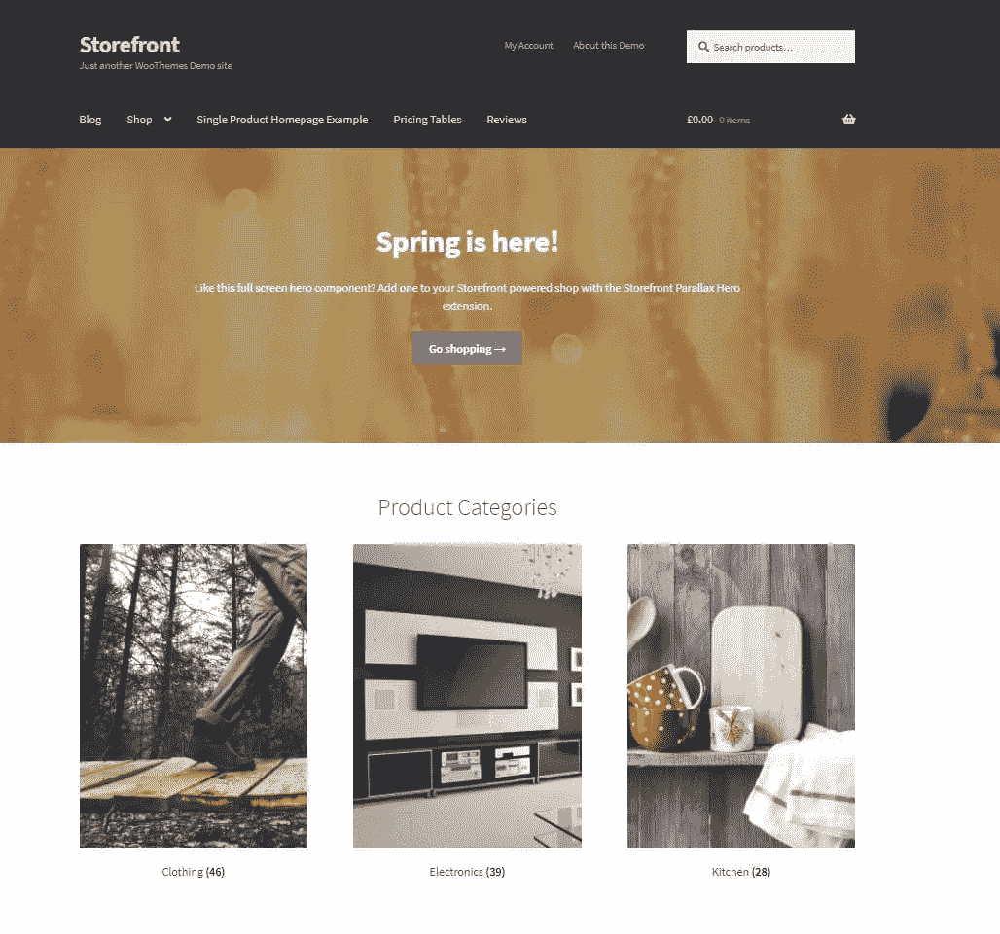
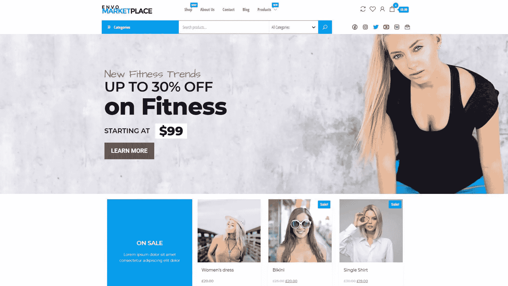
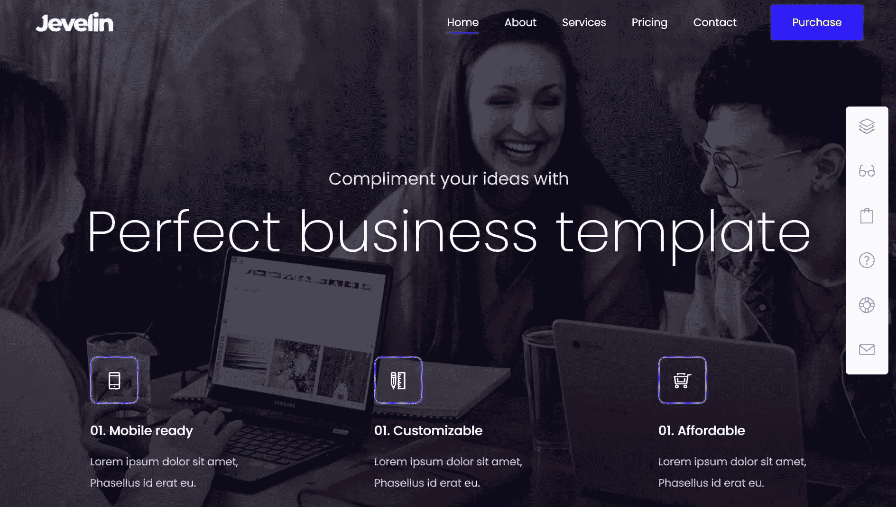
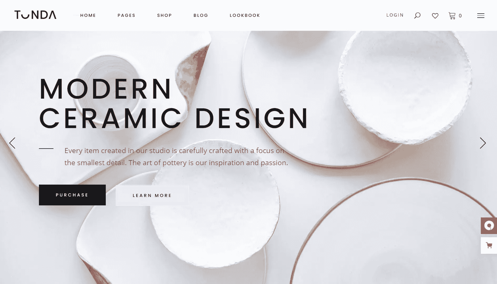
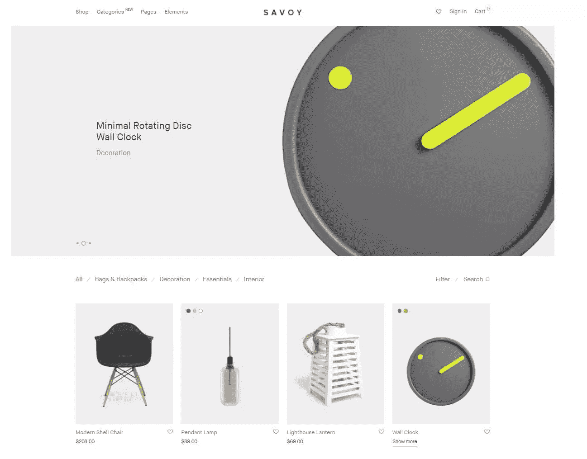

# 2021 年 10 大最佳 WordPress 电子商务主题

> 原文：<https://www.sitepoint.com/top-wordpress-ecommerce-themes/>

随着越来越多的人转向网上购物，小企业和零售商被迫建立自己的电子商务商店以跟上潮流。

好消息是用 WordPress 创建一个电子商务商店既快又简单。安装了 WooCommerce 插件和 WordPress 主题后，你可以很容易地创建一个功能性的电子商务商店。

也就是说，WordPress 仅从主题森林就有 [11，000 个主题](https://www.codeinwp.com/blog/wordpress-statistics/)。那么，如何选择哪一个最适合自己的企业呢？

在这篇文章中，我们编辑了一个电子商务 WordPress 主题列表，让你的搜索更容易。

## 如何选择理想的 WordPress 主题

首先，你需要知道选择 WordPress 主题时要考虑的因素。下面是一些需要记住的。

### 与 WooCommerce 的兼容性

第一步，检查主题是否兼容 WooCommerce。虽然大多数 WordPress 主题可以满足要求，但是一个专门为电子商务商店设计的主题可以让你在瞬间创建无缝的主页或产品页面。

### 响应性

从数百个主题中进行选择时，手机友好性是一个至关重要的因素。它确保访问者无论是通过智能手机、平板电脑还是个人电脑等多种设备浏览，都能获得流畅的用户体验。

### 美学的

考虑一个与你的品牌外观和感觉相匹配的主题。有些主题显得优雅，而另一些则具有现代风格。也有主要为杂货店、时装零售商或工匠打造的主题，所以选择最适合你的业务的选项。

### SEO 优化

如果你没有被谷歌看好，人们不会涌向你的网站。

幸运的是，许多主题提供了内置的 SEO 特性，比如快速加载时间、简单导航、标题和副标题以及元描述。记住影响网站搜索引擎友好度的因素。否则，你很难吸引更多的顾客来你的商店。

### 浏览行为

想想你的顾客的浏览和购买行为。

展示高质量的产品照片会有好处吗？选择一个主题，可以显示大型产品照片或集成缩放和旋转等功能，以便于检查。要不要专注于获得更多的转化？选择一个主题，有一个不受干扰的结帐选项和战略性的行动号召按钮。

设身处地为客户着想，了解决定他们网上购物体验成败的关键特征。

## 免费 WordPress 电子商务主题

挑哪个主题？以下是我们为小企业、装饰店、网上实体店和零售商提供的最受欢迎的电子商务主题列表。我们相信您会找到适合您企业需求的主题。

预算紧张的小企业可能想从免费的 WordPress 主题开始。

为了帮助你开始，我们已经编译了最好的免费直观 WordPress 主题，并与 WooCommerce 紧密集成。

### 1.WooCommerce ( [演示](https://themes.woocommerce.com/storefront/))店面

我们将从 WooCommerce 用户的主要 WordPress 主题开始。店面由 WooCommerce 开发商制作和管理。这意味着它可以与 WooCommerce 扩展集成，显示以电子商务为中心的主页，并适应 WooCommerce 的重大更新。

以下是它的一些显著特征:

*   WooCommerce storefront 可以在你的主页上显示产品类别(如畅销书、最新、特色和特价)。
*   它是为 WooCommerce 设计的，所以它总是与 Woocommerce 的主要更新兼容。
*   它有一个干净的设计和增强的搜索引擎优化性能响应布局。
*   用户可以获得[店面扩展](https://woocommerce.com/product-category/storefront-extensions/)来为你的商店添加评论、大型菜单、定价表、产品共享、parallax hero 和博客定制。
*   25 个以上的预建模板，适用于所有类型的电子商务企业

### 2.[阿什](https://wp-royal.com/themes/item-ashe-free/) ( [演示](https://wp-royal.com/themes/ashe-free/demo/))

Ashe 依靠高度视觉化的元素来激励访问者继续浏览你的网站。用户可以自定义推广框，横幅广告，特色滑块和标题背景。这使得它成为想要突出其产品的食品、旅游和时尚企业的完美选择。

以下是它的一些显著特征:

*   它有一个 29 美元的专业版，提供终身主题更新、安全更新、新功能和高级支持。
*   它有一个优雅的和充分响应的布局与 WooCommerce 商店(店面)的支持。
*   它利用 WordPress Live 主题定制器实时修改颜色、页面布局、字体和背景。
*   它显示带有醒目图像和自定义链接的推广框，并在标题处显示横幅广告。

### 3.[Envo market](https://wordpress.org/themes/envo-marketplace/)([Demo](https://envothemes.com/envo-marketplace/))

Envo Marketplace 是一个快速而现代的 WordPress WooCommerce 主题。稍加定制，用户可以建立各种适合时尚、科技、体育、家居装饰、珠宝或家具行业的电子商务商店。

以下是它的一些显著特征:

*   它有一键演示导入。
*   它有一个超快的 537 毫秒加载时间，以提高搜索引擎优化结果。
*   它支持流行的页面生成器，如 Elementor、KingComposer、Beaver Builder 和 SiteOrigin。
*   它与 YITH WooCommerce Wishlist 和 YITH WooCommerce Compare 兼容。
*   这是一个搜索引擎友好和翻译就绪的主题与响应设计。

### 4.[大店](https://themehunk.com/product/big-store/) ( [试玩](https://themehunk.com/wp-themes/big-store-electro/))

大商店是一个电子商务网站主题，推荐给销售服装、电子产品、小工具、装饰礼品和家具的商店。它有一个易于使用的定制面板，可以完全响应各种移动设备。在此基础上，您可以添加多个部分，以及页眉和页脚布局组合。

以下是它的一些显著特征:

*   它拥有一分钟的设置。
*   它有一个实时定制程序。
*   它与 WooCommerce 深度融合。
*   它有搜索引擎友好的代码和翻译准备。
*   它支持多站点，这使得你可以在一个网站上使用多个 WordPress 主题。
*   它有一个商业的高级版本，可以访问终身更新、无限域许可证、终身一对一高级支持和高级入门演示。
*   它带有为健身房、杂货店、鞋店、在线市场、药店、面包店等预先制作的模板。

### 5.[雅特](https://wpastra.com/) ( [试玩](https://websitedemos.net/home-decor-04/))

Astra 是 WordPress 商店的一个流行的电子商务主题。

除了 150 多个模板外，用户还可以利用其拖放构建器和高级样式选项来创建自己理想的电子商务网站。

为了保证无与伦比的性能，它使用普通的 Javascript，不到 50KB 的资源，快速加载时间仅为 0.5 秒。

以下是它的一些显著特征:

*   它和古腾堡兼容。
*   它有一个直观的拖放式页眉和页脚生成器。
*   它带有一个 SEO 友好的主题，包括 Schema.org 代码集成。
*   它的商业功能包括 Astra Pro 的所有功能(如更多的定制功能和更好的 UX)、一对一支持、广泛的培训和无限制的网站使用。
*   它提供了最广泛的预建网站库，有超过 150 个现成的导入模板。
*   它有一个用于修改布局设置的可视化主题定制器。

### 6.[名称](https://themeisle.com/themes/neve/)[演示](https://themeisle.com/demo/?theme=Craft%20Beer)

Neve 是一个免费的 WordPress 主题，快速且轻量级。

您可以通过其与 Gutenberg 和流行的页面生成器(如 Elementor、Brizy、Beaver Builder 和 Visual Composer)的无缝集成来创建专业外观的网站。这不仅是一个完全响应的主题，而且它也是兼容的，所以你一定会得到谷歌的好评。

以下是它的一些显著特征:

*   它带有 80 多个现成的入门网站。每个月都会有新的设计加入这个系列。
*   使用默认 WordPress 数据，加载时间不会少于 1 秒。它在 Google PageSpeed Insights 上也有 100 的速度等级评级。
*   它允许您自定义页眉和页脚，并控制网站布局选项
*   您可以从多个网站布局选项中进行选择，并自定义或重新设计页眉和页脚。
*   它将网站呈现为本地 AMP 页面，以满足搜索引擎的需求。

## 商业 WordPress 电子商务主题

优质的 WordPress 电子商务主题通常有更多的定制选项来改善用户体验。最重要的是，你可以提高网站的安全性，并与著名的开发商联系以获得客户支持。

以下是一些可以为你的电子商务商店带来这些好处的优质主题。

### 7.[杰韦林](https://1.envato.market/LPxera) ( [演示](https://jevelin.shufflehound.com/shop1/))

Jevelin 是一个多功能主题，最适合婚礼、摄影、健身和电子商务相关的业务。你可以用大菜单、幻灯片演示、联系表格和自定义部件来增强你的网站。

以下是它的一些显著特征:

*   售价 59 美元。
*   它有一个一键式网站安装过程。
*   它有一个完全响应的主题，内置 WooCommerce 插件和电子商务功能。
*   它的商业特性包括终身更新和六个月的 Shufflehound 支持。
*   它包含独特的页面布局和模板，包括十多个投资组合选项。
*   它带有内置的滑块旋转功能，因此您可以轻松创建幻灯片演示、基于视频的滑块或适合移动设备的动画文本。
*   它提供了 40+定制的短码，是搜索引擎友好和 RTL 优化。

### 8.[佟达](https://1.envato.market/9WMvQe) ( [演示](https://preview.themeforest.net/item/tonda-a-modern-elegant-woocommerce-theme/full_screen_preview/21784423))

Tonda 是一个华丽的主题，可以用时尚的方式展示你的产品。

它带有六个主页和九个内页，您可以对其进行定制，为您的客户创造身临其境的体验。它最适合陶瓷商店，网上商店，美容店和工匠。

以下是它的一些显著特征:

*   它有一个商业版本，售价 75 美元。
*   它的商业特性包括未来的更新和对特定主题的六个月支持。
*   它具有电子商务功能，如下拉购物车部件、快速查看功能、商店定位器、弹出简讯、订单跟踪和用户登录部件。
*   它与 Elementor、Slider Revolution、WooCommerce、Contact Form 7、WPBakery Page Builder 和 WPML.org 兼容。
*   它有一个多商店列表布局，具有过滤商店列表的功能。
*   它包括视频背景和视差部分。
*   它还带有一个用于 Twitter feeds、Instagram feeds、社交图标、博客列表和图片库的小部件。
*   它的翻译就绪，搜索引擎优化优化，并具有 WPML 插件兼容性。

### 9.[扁平的](https://1.envato.market/jWnK2n) ( [演示](https://preview.themeforest.net/item/flatsome-multipurpose-responsive-woocommerce-theme/full_screen_preview/5484319))

Flatsome 的设计考虑到了令人惊叹的用户体验，它拥有漂亮的布局，并针对速度进行了优化。

一个大型元素库和易于使用的动态页面生成器让你可以创建任何类型的电子商务网站。此外，Flatsome Studio 包括一个大型的预定义布局或部分、预制元素和预制实体模型库，您可以通过一次单击将其添加到您的商店。

以下是它的一些显著特征:

*   其商业版售价为 59 美元。
*   它提供了对 Flatsome Studio 的访问，该工作室有 300 多个预定义的布局和部分。
*   它包括无限的产品页面布局，一个实时定制的产品页面生成器，一个内置的标题生成器和多种产品网格样式。
*   它提供了一个产品页面生成器，具有非画布或购物车下拉选项、内置的愿望列表、内置的快速查看和目录模式。
*   它通过智能图像延迟加载和自适应图像功能立即加载图像。
*   它允许你创建内置滑块和横幅系统的滑块。
*   它提供了与 MailChimp 和 Contact Form 7 的集成。
*   它有充分的 RTL 支持，移动优化设计和搜索引擎优化。
*   它总是与最新的 WordPress 和 WooCommerce 版本保持同步。

### 10.[萨沃伊](https://1.envato.market/kjaLbM) ( [演示](https://preview.themeforest.net/item/savoy-minimalist-ajax-woocommerce-theme/full_screen_preview/12537825))

Savoy 采用现代简约设计，能让您的产品呈现最佳效果。

内置的 AJAX 功能让客户可以无缝浏览他们使用的是桌面还是移动设备。Savoy 提供了与 WooCommerce 的深度集成，是那些希望建立专门的电子商务网站的人的最佳主题之一。

以下是它的一些显著特征:

*   售价 59 美元。
*   它易于安装，一键导入。
*   它提供可触摸的图库和滑块。
*   它带有一个完全支持 AJAX 的商店(不需要插件)。
*   它包括获得专门的支持团队和免费更新。
*   它有先进的页眉、页脚和博客选项。
*   它可以很容易地添加电子商务元素，如产品快速查看可变网格布局，多个单一产品布局，特色产品视频，扩展产品描述，等等。
*   它拥有 40 多种页面生成器元素、900 多种谷歌网络字体和 Adobe 字体集成。
*   它配有一个响应灵敏、可移动的布局。

## 额外的主题

既然你已经读到这里，你得到一个额外的主题！

### 11.([试玩](https://preview.themeforest.net/item/ciyashop-responsive-multipurpose-woocommerce-wordpress-theme/full_screen_preview/22055376))

CiyaShop 是一个多用途的 WooCommerce WordPress 主题，让用户创建任何类型的电子商务网站。对于最小定制，从 90 多个完整的电子商务网站演示和 260 多个现成的预定义部分中进行选择。

由于其功能丰富的能力，用户可以立即设计任何他们想要的东西，即使他们是第一次建立一个电子商务商店。

以下是它的一些显著特征:

*   其商业版售价为 59 美元。
*   它附带了 CiyaShop Studio，这是一个预定义的现成布局集合，以及一个用于构建响应页面的实时定制器。
*   其商业功能包括终身更新和六个月的 UX 主题支持。
*   它提供产品申请表和产品快速查看功能，以吸引客户。
*   它包括一个定制尺寸指南，因此顾客可以选择他们想要购买的产品的正确尺寸。
*   它提供了一个快速的产品过滤器，让用户通过属性、类别、价格和评级来过滤产品。

## 结论

这就是你要的:最佳商务 WordPress 主题列表。

无论你是否有网页设计经验，这些主题中的预制模板、部分和元素都会让你建立你理想的电子商务网站。我们列表中的主题也与 WooCommerce 兼容，因此您可以在瞬间为您的网站添加电子商务功能。

希望这些主题能让你建立最适合你生意的完美的电子商务网站。

## 分享这篇文章