# 用 React 和 Tailwind CSS 构建一个网站

> 原文：<https://www.sitepoint.com/react-tailwind-css-build-site/>

本教程展示了如何使用 React 和 Tailwind CSS 创建一个产品网站。我们将介绍如何使用[Create React App Configuration Override(CRACO)](https://github.com/gsoft-inc/craco)设置 React with Tailwind CSSTailwind 的 CSS 实用程序类和变体以及如何使用它们；如何轻松让网站黑暗模式兼容；什么群体；以及如何启用变体。

你可以在这里观看我们正在创建的网站[的演示，你可以在](https://shop-react-tailwind.netlify.app)[这个 GitHub 库](https://github.com/sitepoint-editors/react-shop)上找到这个库的代码。

## 先决条件

在我们开始之前，您需要安装 [Node.js](https://nodejs.org/en/) 和 [npm](https://www.npmjs.com) 。如果您安装了 Node.js，那么您将安装 npm。

要检查节点是否已安装，请在命令行中运行以下命令:

```
node -v 
```

您应该能够看到版本。对 npm 执行相同的操作:

```
npm -v 
```

需要注意的是，顺风 CSS [需要](https://tailwindcss.com/docs/upgrading-to-v2#upgrade-to-node-js-12-13-or-higher) Node.js 版本 12.13.0 或更高版本。

如果您得到一个错误，那么您必须安装节点。你可以遵循 Node [网站](https://nodejs.org/en/)上的安装说明，或者跟随我们的文章“[使用 nvm](https://www.sitepoint.com/quick-tip-multiple-versions-node-nvm/) 安装 Node.js 的多个版本”。

## 设置 React 和 Tailwind CSS

*注意:如果你不熟悉 Create React App，先看看“ [Create React App:快速准备好 React 项目](https://www.sitepoint.com/create-react-app/)”。*

首先，用`create-react-app`创建一个 React 项目:

```
npx create-react-app react-shop 
```

然后，将目录切换到创建的项目:

```
cd react-shop 
```

接下来，我们将安装顺风 CSS 所需的依赖项:

```
npm install -D tailwindcss@npm:@tailwindcss/postcss7-compat postcss@^7 autoprefixer@^9 
```

我们正在用 PostCSS 7 兼容性版本安装 Tailwind CSS，因为在撰写本文时，Create React App(或 CRA) [不支持 PostCSS 8](https://tailwindcss.com/docs/guides/create-react-app#install-tailwind-via-npm) 。我们也在安装`autoprefixer`，因为 2.0 版之后的顺风 CSS [需要它。](https://tailwindcss.com/docs/upgrading-to-v2#install-tailwind-css-v2-0-and-post-css-8)

## 设置 graco

通常，要配置 CRA，你需要用 CRA 的默认脚本运行`react-scripts eject`或`npm run eject`。然而，这是非常不方便的，因为它会将所有隐藏在 CRA 中的配置(如 webpack 配置、Babel 配置、PostCSS 配置等等)弹出到您的项目中，编辑它会变得很麻烦，或者产生 CRA 不再能够支持的问题。

这就是[创建 React 应用程序配置覆盖(或 CRACO)](https://github.com/gsoft-inc/craco) 的用武之地。CRACO 是一个库，它为 CRA 添加了一个简单的配置层。不是将 CRA 内部的所有配置都弹出到您的项目中——例如，只是向 Webpack 添加一些配置——所有新的配置或对原始配置的更改都将放入一个新文件`craco.config.js`。CRACO 允许您配置 CRA 以获得最佳效果，而没有任何麻烦。

我们需要 CRACO 来覆盖 PostCSS 配置并添加`tailwindcss`插件。所以，我们先安装一下:

```
npm install @craco/craco 
```

使用 CRA 时，`package.json`中的脚本如下所示:

```
"scripts": {
  "start": "react-scripts start",
  "build": "react-scripts build",
  "test": "react-scripts test",
  "eject": "react-scripts eject"
} 
```

由于我们使用 CRACO 来做我们在默认情况下不能用 CRA 做的事情，我们需要更改脚本来使用 CRACO 来构建项目或在开发中运行它:

```
"scripts": {
  "start": "craco start",
  "build": "craco build",
  "test": "craco test",
  "eject": "react-scripts eject"
}, 
```

在`start`、`build`和`test`的剧本中，我们用`craco`代替了`react-scripts`。我们没有对`eject`脚本做任何改动。

接下来，在项目的根目录下创建 CRACO 配置文件`craco.config.js`:

```
module.exports = {
  style: {
    postcss: {
      plugins: [
        require('tailwindcss'),
        require('autoprefixer'),
      ],
    },
  },
} 
```

这个配置文件将`tailwindcss`和`autoprefixer`插件添加到`postcss`中。

现在我们将为顺风 CSS 生成配置文件:

```
npx tailwindcss init 
```

*注意:如果你正在使用 Node.js v14，有一个关于运行这个命令时抛出的错误的报告问题，说“找不到模块‘autoprefixer’”。升级到 Node.js v15 应该可以，但如果你不能做到这一点，请遵循一个变通办法[这里](https://github.com/tailwindlabs/tailwindcss/issues/2831)。*

这将在项目的根目录下创建文件`tailwind.config.js`。它将包含以下内容:

```
module.exports = {
  purge: [],
  darkMode: false, // or 'media' or 'class'
  theme: {
    extend: {},
  },
  variants: {
    extend: {},
  },
  plugins: [],
} 
```

以下是每个配置键的含义:

1.  `purge`:用于指定 Tailwind CSS 应该扫描的文件，并查看哪些 Tailwind CSS 类正在使用，以便它可以删除生产中所有未使用的样式和类。
2.  `darkMode`:这指定了项目中黑暗模式的行为。该值可以是`media`，这意味着将基于黑暗模式[媒体查询](https://developer.mozilla.org/en-US/docs/Web/CSS/@media/prefers-color-scheme)应用黑暗模式样式，这取决于用户操作系统的默认模式。它也可以是`class`，这意味着当 HTML 文档中的父元素具有`dark`类时，将应用黑暗模式样式。
3.  `theme`:这可以用来修改主题的调色板、字体、断点等等。我们将在教程的后面看到如何对主题进行修改。
4.  这允许你将额外的变体应用到 Tailwind CSS 的核心插件中。我们将在教程的后面看到它是如何工作的。
5.  添加插件的部分，可以添加额外的工具类，自定义变量，基本样式或更多。

现在，我们只做两个改变。首先，我们将更改`purge`键:

```
purge: ["./src/**/*.{js,jsx,ts,tsx}", "./public/index.html"], 
```

这告诉 Tailwind CSS 查看`src`目录中的所有`js`、`jsx`、`ts`和`tsx`文件，以及`public/index.html`文件，以确定 Tailwind CSS 中的哪些类将被使用，并删除任何未使用的类。

第二个变化是黑暗模式:

```
darkMode: "media", // or false or 'class' 
```

为了简单起见，在本教程中，我们将保持黑暗模式只是基于用户的操作系统偏好。

用顺风 CSS 设置 React 项目的最后一步是在`src/index.css`中包含一些顺风 CSS 样式。用以下内容替换该文件的内容:

```
@tailwind base;
@tailwind components;
@tailwind utilities; 
```

`@tailwind`指令基本上将样式导入到`index.css`中。并且默认情况下，CRA 在`src/index.js`中导入`src/index.css`:

```
import './index.css'; 
```

这意味着 Tailwind CSS 样式将被应用到我们的 React 项目中，我们已经准备好开始构建一个漂亮的网站了！

## 了解顺风 CSS 实用程序和变体

在进入编码之前，让我们了解一下什么是 Tailwind CSS 实用程序类和变体。Tailwind CSS 旨在简化组件样式，并帮助您专注于制作可重用的组件。实用程序类是一个广泛的类，允许你以任何你能想到的方式设计你的组件，而不需要写任何 CSS。

例如，要用边框设计一个`<div>`元素的样式，改变字体大小，改变背景和文本颜色，你需要用 CSS 编写如下代码:

```
div {
  border: 1px solid #f00;
  font-size: 15px;
  background-color: #ff007f;
  color: #fff;
} 
```

使用 Tailwind CSS，只需使用实用程序类就可以做到:

```
<div class="border border-red-100 text-lg bg-red-400 text-white">
</div> 
```

下面是本例中每个类的含义:

1.  `border`:设置边框宽度为 1px
2.  `border-red-100`:将边框颜色设置为红色(基于主题)
3.  `text-lg`:给出字体大小`1.125rem`和行高`1.75rem`
4.  `bg-red-400`:设置背景颜色为红色(基于主题)
5.  `text-white`:将文本颜色设置为白色

还有许多其他类可以使用，也有许多不同的颜色，这使得主题化更容易。使用实用程序类，您几乎不需要实际编写任何 CSS。

好吧，但是媒体的询问呢？伪课呢？黑暗模式呢？这些可以不用自己写什么 CSS 就能做到吗？

这时变种就出现了。**变体**允许你根据设备断点、元素状态或者是否启用黑暗模式来添加样式到元素中。

因此，以前您可能会根据设备的大小来更改元素的宽度:

```
div {
  width: 50%;
}

@media screen and (max-width: 1024px) and (min-width: 768px) {
  div {
    width: 80%;
  }
}

@media screen and (max-width: 767px){
  div {
    width: 100%
  }
} 
```

使用 Tailwind CSS，可以简单地这样做:

```
<div class="w-full md:w-3/4 lg:w-1/2">
</div> 
```

当`min-width: 1025px`应用于当前屏幕宽度时，应用`w-1/2`类(即`width: 50%`);当`min-width: 768px`应用于当前屏幕宽度时，应用`w-3/4`类(即`width: 80%`);当其他变量不再适用时，应用`w-full`类(即`width: 100%;`)。

这无疑使你在每个项目中必须做的繁琐工作变得更加容易和快捷。起初，它可能看起来令人困惑，但是当你开始涉足更多的时候，你会意识到使用实用程序类和变体是如何成为第二天性的。

你可以在[项目的官方文档](https://tailwindcss.com/docs)中阅读更多关于配置 Tailwind 的内容。

## 实现我们的组件

回到我们的网站。我们正在创建一个简单的网站，以简洁的设计展示产品。为了简单起见，我们将使用来自[假商店 API](https://fakestoreapi.com) 的假数据。我们不实际执行对 API 的请求，而是获取一个样本 JSON 响应，并将其放在项目的 JSON 文件中。同样，这只是为了教程的简单性。

转到[产品端点](https://fakestoreapi.com/products)并复制响应。然后，创建文件`src/data/products.json`并将响应粘贴到其中。它应该是如下所示的对象数组:

```
{
  "id": 1,
  "title": "Fjallraven - Foldsack No. 1 Backpack, Fits 15 Laptops",
  "price": 109.95,
  "description": "Your perfect pack for everyday use and walks in the forest. Stash your laptop (up to 15 inches) in the padded sleeve, your everyday",
  "category": "men's clothing",
  "image": "https://fakestoreapi.com/img/81fPKd-2AYL._AC_SL1500_.jpg"
} 
```

让我们从实现`Product`组件开始。该组件将是显示产品信息的卡片组件。用以下内容创建`src/components/Product.js`:

```
function Product ({product: {title, price, description, category, image}}) {
  return (
    <div>
      <div style={{backgroundImage: `url(${image})`}}></div>
      <div>
        <h1>{title.substr(0, 50)}</h1>
        <h3>{category}</h3>
        <p>{price}$</p>
        <div>{description.substr(0, 100)}</div>
      </div>
    </div>
  );
}

export default Product; 
```

如您所见，`Product`组件只是显示产品细节。目前我们还没有添加任何造型类。

接下来，转到`src/App.js`，将内容更改如下:

```
import "./App.css";
import Product from "./components/Product";
import products from "./data/products.json";

function App() {
  return (
    <div>
      <div>
        {products.map((product) => (
          <Product product={product} key={product.id} />
        ))}
      </div>
    </div>
  );
}

export default App; 
```

这里，我们将`products.json`文件作为`products`导入。然后，我们遍历`products`，并使用我们之前创建的`Product`组件显示每个产品。同样，注意我们没有添加任何样式类。

现在让我们启动服务器。运行以下命令:

```
npm start 
```

您会看到只有一堆文本，但没有任何样式。

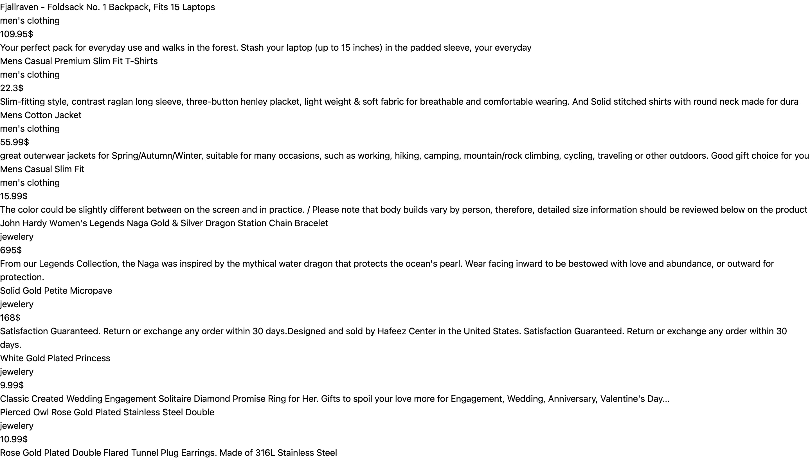

### 添加一些背景颜色

让我们开始添加一些造型。首先，我们将改变页面的背景颜色。为此，我们将利用 Tailwind 的[背景颜色](https://tailwindcss.com/docs/background-color)类。背景颜色类的格式为`bg-{color}-{numericScale}`，其中`numericScale`是可选的。

颜色默认为`white`、`black`、`gray`、`red`、`blue`、`green`、`yellow`、`orange`、`indigo`、`purple`、`pink`。数字刻度定义颜色的深浅，其中`50`是最浅的，而`900`是最深的。比如想让背景颜色是浅红色，可以用`bg-red-200`。

在我们的网站中，我们将背景颜色设置为浅灰色，所以我们将把类`bg-gray-200`添加到`src/App.js`中最外面的`<div>`元素中:

```
return (
  <div className="bg-gray-200">
    <div>
      {products.map((product) => (
        <Product product={product} key={product.id} />
      ))}
    </div>
  </div>
); 
```

如果您现在检查网站(如果您没有让服务器继续运行，请确保再次运行它)，您会看到背景已变为浅灰色。

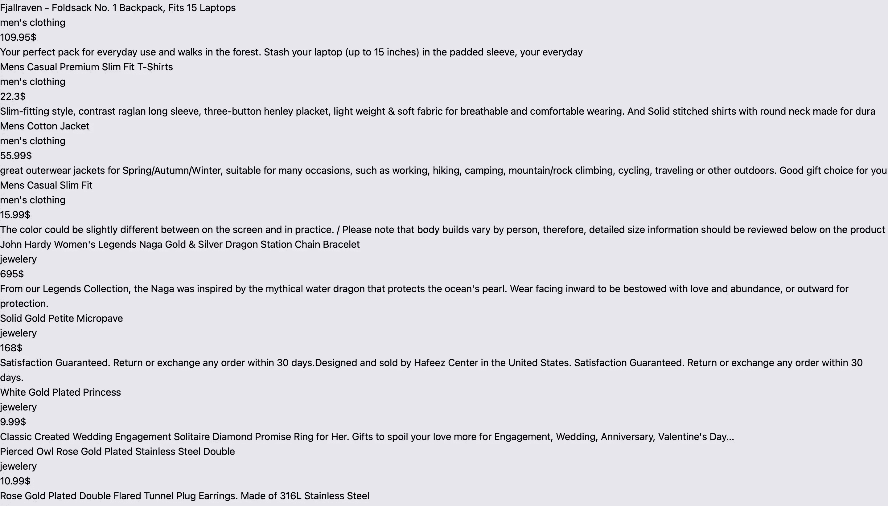

### 更改内容宽度

接下来我们要做的是，当屏幕的宽度至少为`768px`时，将内容的宽度更改为屏幕实际宽度的 50%，但在小型设备上保持全宽。我们将利用 Tailwind 的 [width](https://tailwindcss.com/docs/width) 类，我们之前已经讨论过了。宽度类的格式为`w-{size}`，其中`size`可以是 0 到 96 的范围，引用`rem`中的一个值；像`1/2`或`3/5`这样的比率，或其他表示百分比的比率；或者使用关键字`auto`表示自动宽度，或者`full`表示 100%宽度。

为了根据屏幕尺寸指定宽度，我们使用了类似于`sm`、`md`、`lg`等变量。这些变量指定了应用规则所需的最小屏幕尺寸。

在我们的例子中，因为我们希望宽度至少为`768px`的屏幕的宽度是父屏幕的 50%,我们将使用`md`和`w-1/2`的变体:

```
return (
  <div className="bg-gray-200">
    <div className="md:w-1/2">
      {products.map((product) => (
        <Product product={product} key={product.id} />
      ))}
    </div>
  </div>
); 
```

宽度现在将改为屏幕宽度的一半。不过水平居中会好很多。为此，我们将使用 Tailwind 的 [margin](https://tailwindcss.com/docs/margin) 实用程序类。边距类的格式是`m{side}-{value}`，其中`side`是可选的，可以特定于元素的每一侧，如`t`用于顶部、`b`用于底部、`l`用于左侧和`r`用于右侧，或者使用`y`水平指定，或者使用`x`垂直指定。`value`可以在从 0 到 96 的范围内，可以是`px`为刚`1px`，或者`auto`。不仅如此，你还可以通过在类的开头添加`-`来添加负边距。比如`-m-2`。

由于我们将元素水平居中，我们将使用`mx-auto`:

```
return (
  <div className="bg-gray-200">
    <div className="md:w-1/2 mx-auto">
      {products.map((product) => (
        <Product product={product} key={product.id} />
      ))}
    </div>
  </div>
); 
```

你可以看到它是居中的。

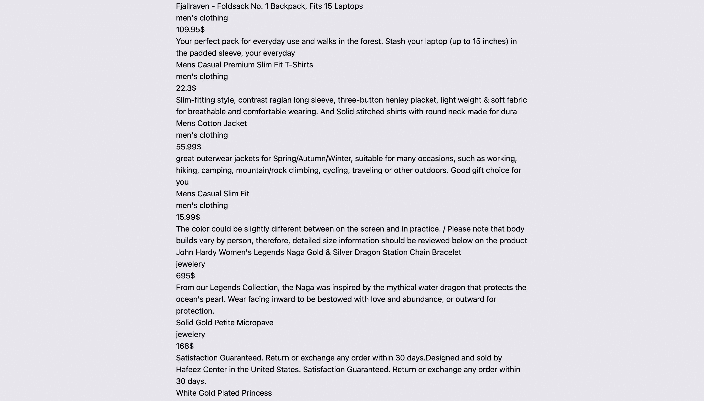

### 设计产品组件的样式

现在让我们继续讨论`Product`组件。我们还将为产品卡添加背景色。我们将它设置为白色，因此我们将使用`bg-white`。我们也将使它全幅，所以我们将使用`w-full`。为了将产品卡片彼此分开，我们将使用`mb-5`为这些元素添加一个底部边距:

```
return (
  <div className="bg-white w-full mb-5">
    <div style={{backgroundImage: `url(${image})`}}></div>
    <div>
      <h1>{title.substr(0, 50)}</h1>
      <h3>{category}</h3>
      <p>{price}$</p>
      <div>{description.substr(0, 100)}</div>
    </div>
  </div>
); 
```

你可以在网站上看到变化:

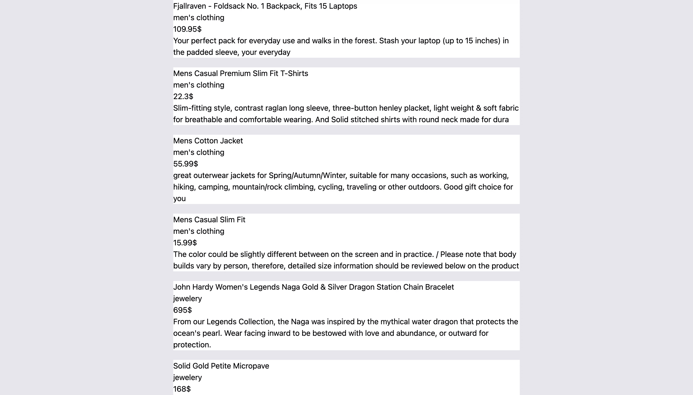

正如您在我们的`Product`组件中看到的，在最外面的元素中，我们有两个元素，一个有产品的背景图片，另一个有信息。我们希望将它们并排展示。我们需要做的第一件事是将最外面的`<div>`的显示改为 flex。为此，我们将使用 Tailwind 的[显示](https://tailwindcss.com/docs/display)类。与我们前面提到的类不同，显示类没有格式。它们只是我们想要的显示名称。因此，要将元素的显示属性更改为`flex`，只需添加`flex`类:

```
return (
  <div className="flex bg-white w-full mb-5">
    <div style={{backgroundImage: `url(${image})`}}></div>
    <div>
      <h1>{title.substr(0, 50)}</h1>
      <h3>{category}</h3>
      <p>{price}$</p>
      <div>{description.substr(0, 100)}</div>
    </div>
  </div>
); 
```

接下来，我们将像前面一样使用宽度类来改变`<div>`元素的宽度:

```
return (
  <div className="flex bg-white w-full mb-5">
    <div style={{backgroundImage: `url(${image})`}} className="w-5/12"></div>
    <div className="w-7/12">
      <h1>{title.substr(0, 50)}</h1>
      <h3>{category}</h3>
      <p>{price}$</p>
      <div>{description.substr(0, 100)}</div>
    </div>
  </div>
); 
```

如果你现在查看这个网站，你会看到图片和文字现在是相邻的。

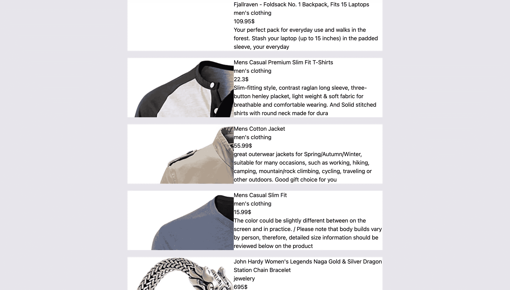

### 增加一些间距

还有很多要修正。首先，让我们为产品信息容器添加一些填充。为此，我们将使用 Tailwind 的[填充](https://tailwindcss.com/docs/padding)类。填充类与我们之前检查的边距类完全相似，只是我们使用了`p`而不是`m`。

因此，我们将把`p-5`添加到产品信息容器中。我们还将使用`mt-4`向描述容器添加一些空白:

```
return (
  <div className="flex bg-white w-full mb-5">
    <div style={{backgroundImage: `url(${image})`}} className="w-5/12"></div>
    <div className="w-7/12 p-5">
      <h1>{title.substr(0, 50)}</h1>
      <h3>{category}</h3>
      <p>{price}$</p>
      <div className="mt-4">{description.substr(0, 100)}</div>
    </div>
  </div>
); 
```

我们还将在`src/App.js`中为整个容器添加顶部和底部边距，这样第一个和最后一个产品就不会出现在页面两边的边缘。为此，我们将添加类`py-4`:

```
return (
  <div className="bg-gray-200 py-4">
    <div className="md:w-1/2 mx-auto">
      {products.map((product) => (
        <Product product={product} key={product.id} />
      ))}
    </div>
  </div>
); 
```

我们会看到网站现在开始变得更好看了。


### 改进组件的版式

现在让我们在排版上做一点工作。你可以看到产品信息看起来都一样。我们无法从描述中区分标题和类别等等。首先，让我们改变一些文字的颜色。为此，我们将使用 Tailwind 的[文本颜色](https://tailwindcss.com/docs/text-color)类。这些类的格式类似于背景颜色类，但是将`b`替换为`text`。例如，为了使你的文本颜色为绿色，你添加了类`text-green-100`。

因此，让我们将类别的文本颜色更改为`text-gray-400`以使其与其他文本相比有点褪色，让我们将价格文本颜色更改为`text-red-500`以使其突出。我们还将在价格上增加最高利润，以确保它最引人注目:

```
return (
  <div className="flex bg-white w-full mb-5">
    <div style={{backgroundImage: `url(${image})`}} className="w-5/12"></div>
    <div className="w-7/12 p-5">
      <h1>{title.substr(0, 50)}</h1>
      <h3 className="text-gray-400">{category}</h3>
      <p className="text-red-400 mt-4">{price}$</p>
      <div className="mt-4">{description.substr(0, 100)}</div>
    </div>
  </div>
); 
```

如果你现在去网站，你会看到文字在区分不同部分方面看起来更清晰一些:

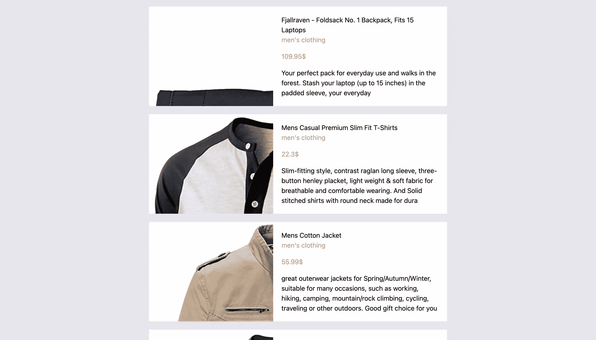

接下来，让我们改变字体大小。为此，我们将使用 Tailwind 的[字体大小](https://tailwindcss.com/docs/font-size)类。这些类的格式是`text-{size}`，其中`size`的范围是从`sm`到`9xl`。

我们将通过使用`md`变体为宽度至少为`768px`的屏幕添加类别`text-4xl`，为较小的屏幕添加类别`text-xl`，使价格的字体变大；我们还将通过为宽度至少为`768px`的屏幕添加类别`text-2xl`，使标题变大:

```
return (
  <div className="flex bg-white w-full mb-5">
    <div style={{backgroundImage: `url(${image})`}} className="w-5/12"></div>
    <div className="w-7/12 p-5">
      <h1 className="md:text-2xl">{title.substr(0, 50)}</h1>
      <h3 className="text-gray-400">{category}</h3>
      <p className="text-red-400 mt-4 text-xl md:text-4xl">{price}$</p>
      <div className="mt-4">{description.substr(0, 100)}</div>
    </div>
  </div>
); 
```

文本现在看起来好多了。

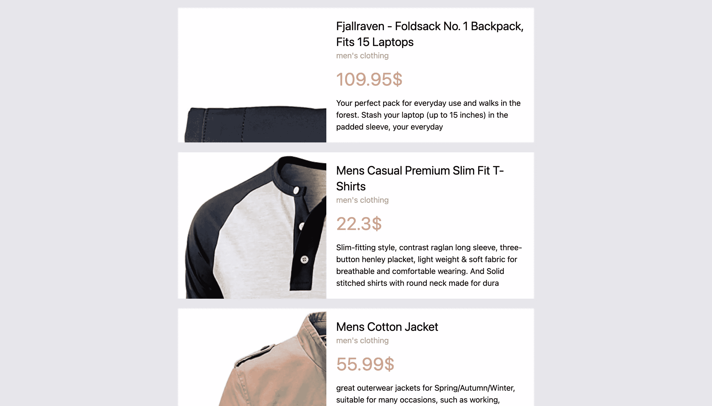

### 定位产品形象

接下来，让我们修复图像，使其完全出现，并正确定位背景图像。

首先，我们将改变背景图像的大小。为此，我们将使用 Tailwind 的[背景大小](https://tailwindcss.com/docs/background-size)类。这些类的格式为`bg-{size}`，其中`size`可以是`auto`、`contain`或`cover`。在我们的例子中，将需要`bg-contain`来确保看到整个图像。

其次，我们将改变背景重复的属性，以确保图像不会重复多次。为此，我们将使用 Tailwind 的[后台重复](https://tailwindcss.com/docs/background-repeat)类。这些类的格式是`bg-{repeatValue}`，其中`repeatValue`是给`background-repeat`属性的值，或者`bg-repeat-round`是取整值，`bg-repeat-space`是空间值。在我们的例子中，我们将使用`bg-no-repeat`。

第三，我们将改变背景位置属性，使图像始终居中。为此，我们将使用 Tailwind 的[背景位置](https://tailwindcss.com/docs/background-position)类。这些类的格式是`bg-{position}`，其中`position`是你给`background-position`属性的值。我们将添加类别`bg-center`:

```
return (
  <div className="flex bg-white w-full mb-5">
    <div style={{backgroundImage: `url(${image})`}} className="w-5/12 bg-contain bg-no-repeat bg-center"></div>
    <div className="w-7/12 p-5">
      <h1 className="md:text-2xl">{title.substr(0, 50)}</h1>
      <h3 className="text-gray-400">{category}</h3>
      <p className="text-red-400 mt-4 text-xl md:text-4xl">{price}$</p>
      <div className="mt-4">{description.substr(0, 100)}</div>
    </div>
  </div>
); 
```

现在，我们可以完整地看到图像。

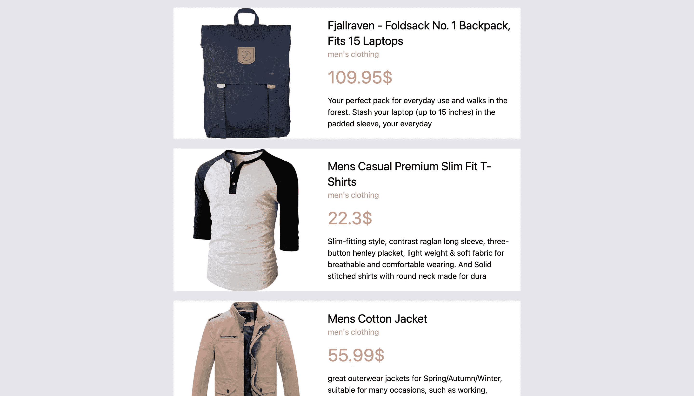

你会注意到一些图像接触到了容器的边缘。为了解决这个问题，我们将向背景图像元素添加一个包装器`<div>`元素，并向其添加一些填充:

```
return (
  <div className="flex bg-white w-full mb-5">
    <div className="w-5/12 p-2">
      <div style={{backgroundImage: `url(${image})`}} className="bg-contain bg-no-repeat bg-center w-full h-full"></div>
    </div>
    <div className="w-7/12 p-5">
      <h1 className="md:text-2xl">{title.substr(0, 50)}</h1>
      <h3 className="text-gray-400">{category}</h3>
      <p className="text-red-400 mt-4 text-xl md:text-4xl">{price}$</p>
      <div className="mt-4">{description.substr(0, 100)}</div>
    </div>
  </div>
); 
```

请注意，我们已经将之前赋予背景图像的宽度移动到了包装元素中，并且我们已经将`w-full`和`h-full`添加到了背景图像元素中，以确保它采用了其父元素的`100%`的宽度和高度。

### 添加方框阴影和圆角

我们的产品现在看起来好多了。我们将为当前的风格添加两个最后的润色。首先，我们将为每个产品添加一些阴影。我们将使用 Tailwind 的[盒子阴影](https://tailwindcss.com/docs/box-shadow)类。这些类的格式是`shadow-{size}`，其中`size`是可选的，范围可以从`sm`到`2xl`。也可以使用`none`来移除任何方框阴影，或者使用`inner`来增加内部阴影。其次，我们将使产品卡的边框变得有点圆。我们将使用 Tailwind 的[边界半径](https://tailwindcss.com/docs/border-radius#rounded-corners)类。这些类的格式是`rounded-{position}-{size}`，其中`size`是可选的，范围可以从`sm`到`3xl`，或者可以是`none`表示 0 边界半径或`full`使其完全变圆。`position`也是可选的，可以是顶部的`t`或左侧的`l`等特定位置，也可以是顶部左侧的`tl`等特定边缘。

我们将添加`shadow-sm`到产品卡上，给它添加一个小阴影，并添加`rounded-lg`使边框变圆:

```
return (
  <div className="flex bg-white w-full mb-5 shadow-sm rounded-lg">
    <div className="w-5/12 p-2">
      <div style={{backgroundImage: `url(${image})`}} className="bg-contain bg-no-repeat bg-center w-full h-full"></div>
    </div>
    <div className="w-7/12 p-5">
      <h1 className="md:text-2xl">{title.substr(0, 50)}</h1>
      <h3 className="text-gray-400">{category}</h3>
      <p className="text-red-400 mt-4 text-xl md:text-4xl">{price}$</p>
      <div className="mt-4">{description.substr(0, 100)}</div>
    </div>
  </div>
); 
```

最后，我们的产品列表页面看起来像下面的截图。

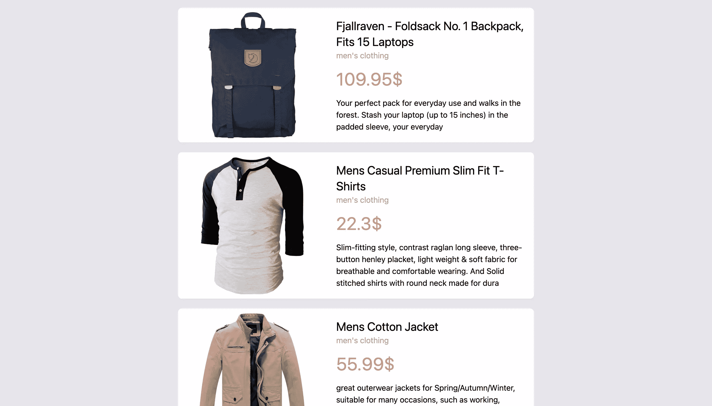

## 自定义主题

到目前为止，我们所做的所有样式都是基于 Tailwind 的默认样式。然而，顺风也允许我们定制我们的主题。我们可以改变颜色、字体系列等等。所有这些变化都是在`tailwind.config.js`中完成的。

让我们试着改变一点颜色。有不同的方法来改变主题的颜色。

一种方法是定义你自己的颜色。例如，要给我们的主题添加一种新的颜色，我们可以在`tailwind.config.js`中做如下操作:

```
module.exports = {
  purge: ["./src/**/*.{js,jsx,ts,tsx}", "./public/index.html"],
  darkMode: "media", // or 'media' or 'class'
  theme: {
    extend: {
      colors: {
        turquoise: "#40e0d0"
      }
    },
  },
  variants: {
    extend: {},
  },
  plugins: [],
}; 
```

注意，在`theme.extend`里面，我们添加了一个`colors`对象，然后在里面我们添加了带有蓝绿色十六进制代码的键`turquoise`。现在我们可以像使用默认颜色一样使用该颜色。比如将背景色设置为青绿色，可以使用`bg-turquoise`。

另一种自定义主题颜色的方法是更改默认颜色。如前所述，顺风中的默认颜色有`white`、`black`、`gray`、`red`、`blue`、`green`、`yellow`、`orange`、`indigo`、`purple`和`pink`。您可以更改这些颜色的实际值。

例如，要将`yellow`更改为更深的芥末黄色，请执行以下操作:

```
module.exports = {
  purge: ["./src/**/*.{js,jsx,ts,tsx}", "./public/index.html"],
  darkMode: "media", // or 'media' or 'class'
  theme: {
    extend: {
      colors: {
        yellow: "#e1ad01"
      }
    },
  },
  variants: {
    extend: {},
  },
  plugins: [],
}; 
```

现在，当您使用黄色的默认类时，您将得到您在这里定义的黄色。您还可以使用数字刻度指定不同颜色的值:

```
module.exports = {
  purge: ["./src/**/*.{js,jsx,ts,tsx}", "./public/index.html"],
  darkMode: "media", // or 'media' or 'class'
  theme: {
    extend: {
      colors: {
        yellow: {
          200: "#feca1d",
          400: "#e1ad01",
          700: "#b48a01"
        }
      }
    },
  },
  variants: {
    extend: {},
  },
  plugins: [],
}; 
```

也可以使用`lightest`、`light`、`DEFAULT`、`dark`、`darkest`等按键:

```
module.exports = {
  purge: ["./src/**/*.{js,jsx,ts,tsx}", "./public/index.html"],
  darkMode: "media", // or 'media' or 'class'
  theme: {
    extend: {
      colors: {
        yellow: {
          light: "#feca1d",
          DEFAULT: "#e1ad01",
          dark: "#b48a01"
        }
      }
    },
  },
  variants: {
    extend: {},
  },
  plugins: [],
}; 
```

### 添加调色板

第三种改变颜色的方法是使用 Tailwind CSS 中的其他[调色板](https://tailwindcss.com/docs/customizing-colors#color-palette-reference)，这就是我们将要做的。

首先，要求`tailwind.config.js`开头的`tailwindcss/colors`为`colors`:

```
const colors = require("tailwindcss/colors") 
```

接下来，我们将红色改为玫瑰色，灰色改为蓝灰色:

```
const colors = require("tailwindcss/colors")

module.exports = {
  purge: ["./src/**/*.{js,jsx,ts,tsx}", "./public/index.html"],
  darkMode: "media", // or 'media' or 'class'
  theme: {
    extend: {
      colors: {
        gray: colors.blueGray,
        red: colors.rose
      }
    },
  },
  variants: {
    extend: {},
  },
  plugins: [],
}; 
```

如果你现在查看网站，你会发现我们使用的颜色有一点小小的变化。

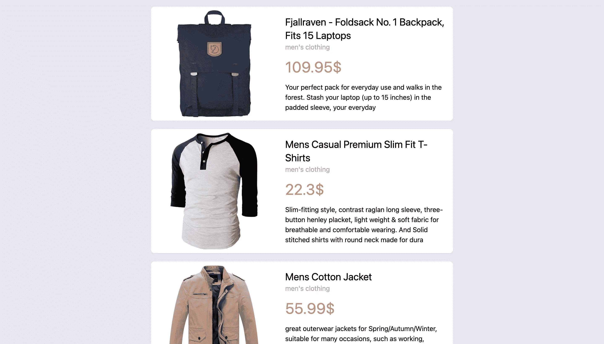

如果你想更好地看到颜色的差异，你可以试着把灰色变成琥珀色:

```
const colors = require("tailwindcss/colors")

module.exports = {
  purge: ["./src/**/*.{js,jsx,ts,tsx}", "./public/index.html"],
  darkMode: "media", // or 'media' or 'class'
  theme: {
    extend: {
      colors: {
        gray: colors.amber,
        red: colors.rose
      }
    },
  },
  variants: {
    extend: {},
  },
  plugins: [],
}; 
```

你会看到背景现在是黄色的。

你也可以从`tailwind.config.js`开始改变[字体系列](https://tailwindcss.com/docs/font-family)等等，同时仍然使用 Tailwind CSS 提供的相同类。通过这种方式，您可以轻松地自定义主题以适合您的设计。

## 添加黑暗模式

`dark`变体允许我们轻松地为暗模式设计元素，同时为亮模式设计元素。

一开始，当我们建立我们的网站时，我们把`tailwind.config.js`中的`dark`键改成了`media`。这意味着当浏览器或操作系统设置为黑暗模式时，将应用黑暗模式。

如果你想测试网站在黑暗模式下会是什么样子，但是你没有把它设置为黑暗模式，你可以在 Chrome DevTools 中模拟这个。按`F12`打开 DevTools，然后按`CTRL` + `SHIFT` + `P`(或者 macOS 上的`CMD` + `SHIFT` + `P`)，在出现的下拉菜单中输入“显示渲染”，选择显示的选项。最后，向下滚动到“模拟 CSS 媒体功能偏好-配色方案”并选择`prefers-color-scheme: dark`。通过选择`prefers-color-scheme: light`可以做同样的事情来测试灯光模式。

让我们通过在`src/App.js`中添加类`dark:bg-gray-800`来改变网站在黑暗模式下的背景颜色:

```
return (
  <div className="bg-gray-200 py-4 dark:bg-gray-800">
    <div className="md:w-1/2 mx-auto">
      {products.map((product) => (
        <Product product={product} key={product.id} />
      ))}
    </div>
  </div>
); 
```

如果你现在检查并且你的浏览器/操作系统被设置为黑暗模式(或者模拟)，你会看到背景颜色已经变成了一个更深的灰色阴影。


现在让我们对产品卡进行更改。我们将把类`dark:bg-gray-300`添加到最外层的元素:

```
return (
  <div className="flex bg-white w-full mb-5 shadow-sm rounded-lg dark:bg-gray-300">
    <div className="w-5/12 p-2">
      <div style={{backgroundImage: `url(${image})`}} className="bg-contain bg-no-repeat bg-center w-full h-full"></div>
    </div>
    <div className="w-7/12 p-5">
      <h1 className="md:text-2xl">{title.substr(0, 50)}</h1>
      <h3 className="text-gray-400">{category}</h3>
      <p className="text-red-400 mt-4 text-xl md:text-4xl">{price}$</p>
      <div className="mt-4">{description.substr(0, 100)}</div>
    </div>
  </div>
); 
```

如果您现在检查，您会注意到产品卡的背景颜色已经改变，但您也会注意到图像现在看起来不好看，因为它有一个白色的背景。

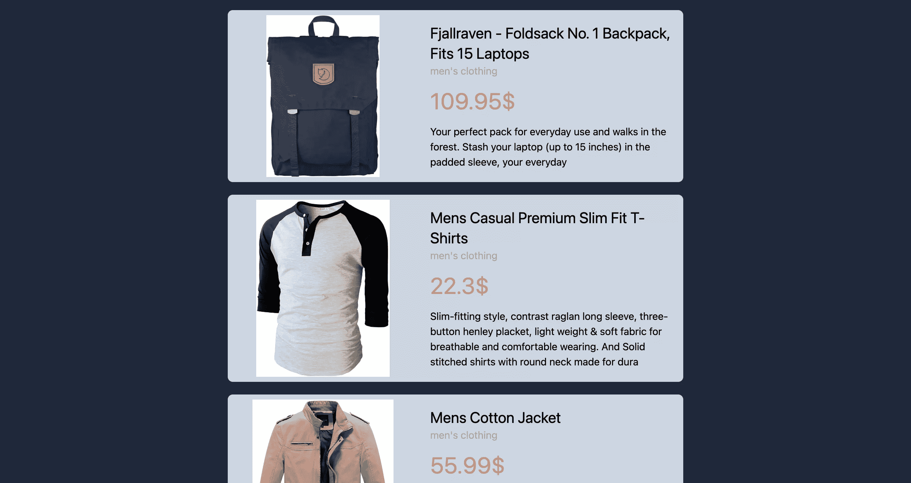

让我们做得更好，当它处于黑暗模式时，给背景包装添加一个白色背景。这可以通过添加类`dark:bg-white`来完成。此外，类别文本的颜色现在几乎看不见了，所以我们将通过添加类`dark:text-gray-700`将其改为更暗的颜色:

```
return (
  <div className="flex bg-white w-full mb-5 shadow-sm rounded-lg dark:bg-gray-300">
    <div className="w-5/12 p-2 dark:bg-white rounded-tl-lg rounded-bl-lg">
      <div style={{backgroundImage: `url(${image})`}} className="bg-contain bg-no-repeat bg-center w-full h-full"></div>
    </div>
    <div className="w-7/12 p-5">
      <h1 className="md:text-2xl">{title.substr(0, 50)}</h1>
      <h3 className="text-gray-400 dark:text-gray-700">{category}</h3>
      <p className="text-red-400 mt-4 text-xl md:text-4xl">{price}$</p>
      <div className="mt-4">{description.substr(0, 100)}</div>
    </div>
  </div>
); 
```

我们网站的最终外观如下所示。

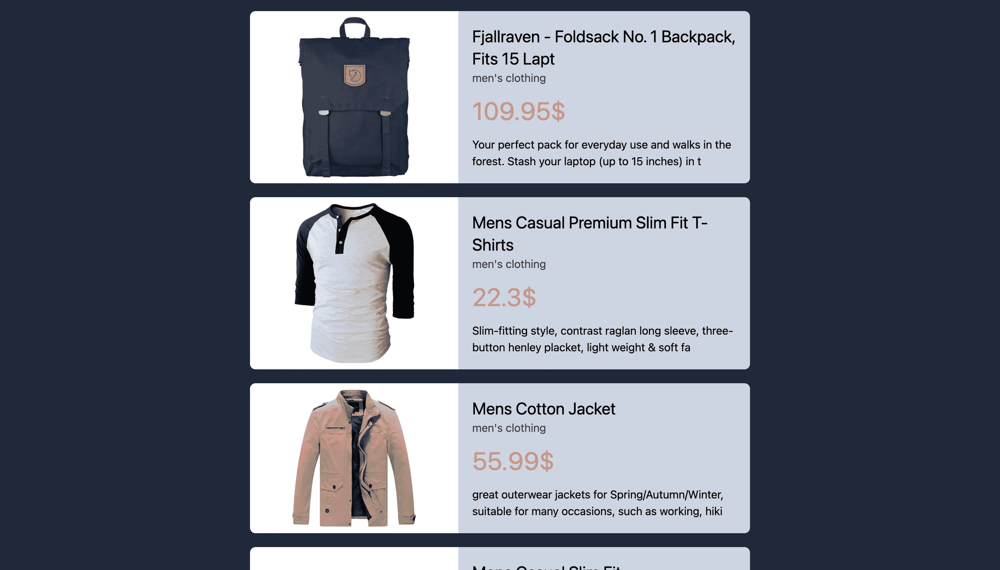

## 分组并启用插件的变体

默认情况下，有些变种并不支持所有插件，因为这会导致[大文件](https://tailwindcss.com/docs/hover-focus-and-other-states#default-variants-reference)。因此，如果我们需要使用这些变体，我们必须在`tailwind.config.js`中为我们想要的插件手动启用它们。这里的插件是我们一直使用的类。比如背景色属于`backgroundColor`插件。

其中一个没有启用的变体是[群组悬停](https://tailwindcss.com/docs/hover-focus-and-other-states#group-hover)。组是由许多元素组成的组，因此任何状态(例如，悬停)都可以影响整个组。通过向容器添加`group`类来声明一个组。然后，您可以在容器的子元素上使用带有一个实用程序类的`group-hover`变量。除非组中的任何元素(即容器元素中的任何元素)被悬停，否则您在上面使用的`group-hover`实用程序类不会被应用。

我们将使每个产品卡片成为一个`group`，然后在悬停时我们将放大图像。因此，我们将把`group`类添加到`Product`组件的最外层元素中，然后我们将把以下类添加到具有背景图像的元素中:

1.  `transition-transform`:顺风的[过渡](https://tailwindcss.com/docs/transition-property)级之一。它仅将`transition`属性应用于`transform`变更。
2.  `duration-300`:顺风的[过渡时长](https://tailwindcss.com/docs/transition-duration)类之一。它应用一个值为`300ms`的`transition-duration`。
3.  `group-hover:transform`:如上所述，`group-hover` variant 确保了`transform`类只在组中的一个元素被悬停时才被应用。`transform`是顺风的[变身](https://tailwindcss.com/docs/transform)职业之一。它允许添加其他与转换相关的类。
4.  `group-hover:scale-125`:`scale-125`级是顺风的[级](https://tailwindcss.com/docs/scale)级之一。它将 X 和 Y 的`scale`设置为`1.25`，但是您需要首先添加`transform`类。

使用上面的类，一旦产品中的任何元素被悬停，图像将放大。我们还将把类`overflow-hidden`添加到`Product`组件的最外层元素中，以确保如果图像超出其容器，它不会溢出。我们还将使用`hover:shadow-2xl`通过`transition-shadow duration-300`使产品卡的阴影变大，以确保过渡是无缝的:

```
return (
  <div className="flex bg-white w-full mb-5 shadow-sm rounded-lg dark:bg-gray-300 group overflow-hidden hover:shadow-2xl transition-shadow duration-300">
    <div className="w-5/12 p-2 dark:bg-white rounded-tl-lg rounded-bl-lg">
      <div style={{backgroundImage: `url(${image})`}} className="bg-contain bg-no-repeat bg-center w-full h-full transition-transform duration-300 group-hover:transform group-hover:scale-125"></div>
    </div>
    <div className="w-7/12 p-5">
      <h1 className="md:text-2xl">{title.substr(0, 50)}</h1>
      <h3 className="text-gray-400 dark:text-gray-700">{category}</h3>
      <p className="text-red-400 mt-4 text-xl md:text-4xl">{price}$</p>
      <div className="mt-4">{description.substr(0, 100)}</div>
    </div>
  </div>
); 
```

注意:如果你正在模拟黑暗模式(或者使用黑暗模式)，你可能会在光亮模式下看到更好的效果，所以一定要切换到光亮模式。

如果您现在尝试将鼠标悬停在产品上，您会看到阴影扩大，图像放大。

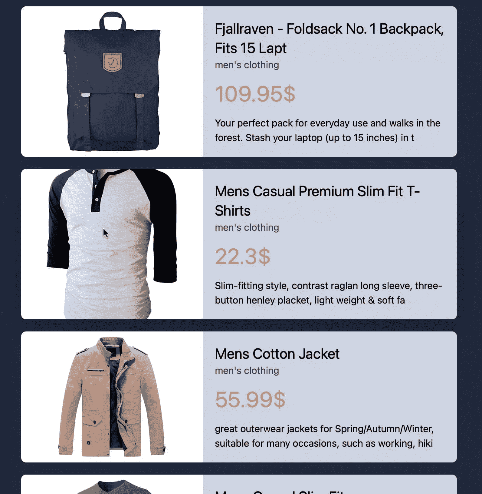

## 结论

我们已经用 React 创建了一个整洁、响应迅速的网站，而无需编写任何 CSS！这就是顺风 CSS 的神奇之处。Tailwind CSS 去除了繁琐、重复的工作或编写 CSS。它还有助于创建主题，并允许您专注于创建具有圆滑设计的可重用组件，这对于 React 来说是完美的。我们在这篇文章中所涉及的仅仅是你可以用 Tailwind CSS 轻松创建的美丽事物的皮毛。

## 分享这篇文章