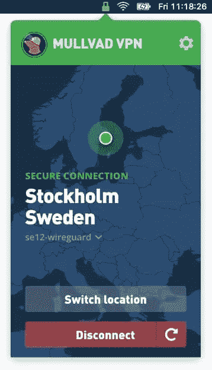

# VPN:它们是什么，为什么你需要一个

> 原文：<https://www.sitepoint.com/vpns-what-they-are-why-you-need-one/>

您担心自己的在线隐私和安全吗？你应该做的第一件事是使用一个 [VPN 服务](https://www.sitepoint.com/best-vpns-for-developers/)。它们有效、经济、易用。有很多有效的选择，每月花费 3 到 10 美元。

如果你一直在考虑使用一个，现在是时候了。隐私是一个重要的问题，随着它的消失，我们变得更加清楚。你一天比一天失去更多，今天你可以做些什么来挽回。

在这篇文章中，我想让你知道你的在线隐私已经变得多么不稳定，概述 VPN 可以如何帮助，并检查流行的 VPN 服务如何解决这个问题。

让我们从了解 VPN 的基本概念开始。

## 什么是 VPN？

当你使用互联网时，你是通过你的 IP 地址来识别的。它是由您的互联网服务提供商(ISP)分配给您的，他们使用它来发回您请求的信息，如网页。他们也可以用它来记录你访问的每个网站。

当你在网上冲浪时，你发送的每个数据包都包含你的 IP 地址。当你意识到你能从那条简单的信息中学到多少东西时，这是很可怕的！

IP 地址可能会泄露您的位置和 ISP。您访问的大多数网站都会记录这些信息，随着时间的推移，他们会将其与您提供的其他个人信息关联起来，如您的姓名、电话号码和地址。

当您键入网站的地址时，会查询 DNS 服务器，以便您可以被定向到该网站的 IP 地址。默认情况下，该 DNS 服务器属于您的 ISP。他们为你所有的 DNS 查询创建一个日志，以创建你的网络活动的完整历史。

如你所见，互联网不是一个非常隐私的地方。

虚拟专用网络(VPN)通过第三方服务器路由流量来保护您的隐私。当然，所有的东西都要通过你的 ISP，但它是加密的。

这意味着他们可以看到你连接到 VPN，但仅此而已。甚至你的 DNS 查询都要通过 VPN 服务器，所以他们不知道你访问了哪些网站。

在连接的另一端，所有流量都与 VPN 服务器的 IP 地址相关联，而不是您自己的地址，并且该地址可能会定期更改。你的网络活动是可见的，但你的身份是不可见的。没办法追踪到你的活动。

## 隐私是使用 VPN 的主要原因

也许你觉得你没有什么可隐瞒的，但这并不意味着其他人应该能够创建一个完整的日志来记录你所做的一切。如果我跟着你，录下你说的每一句话，拍下你做的每一件事，你会不舒服的。你会觉得毛骨悚然。

我们的在线活动也是如此。我们不应该觉得乔治·奥威尔的《一九八四》中的老大哥在监视我们。

> 如果翻译成可理解的现实世界的类似物，今天大多数互联网的工作方式将被认为是不可容忍的，但它仍然存在，因为它是无形的。—[Signal.org](https://signal.org/blog/the-instagram-ads-you-will-never-see/)

但是这种追踪已经变得无处不在。事实上，在世界的某些地方，这是法律要求。一些政府要求 ISP 记录您的整个网络历史，并向政府机构和其他权威机构提供受控的访问权限。

你住的地方是什么情况？让我们看看世界上四个地区的强制性数据保留法律。

### 英国

英国政府于 2016 年通过了[调查权力法案](https://www.legislation.gov.uk/ukpga/2016/25/contents/enacted),要求网络和电话公司将所有客户的浏览记录保存 12 个月。法律要求他们与警方、安全部门和政府机构共享这些记录。

托尼·布莱尔研究所技术和公共政策项目的负责人 Chris Yiu 编制了一份完整的名单，列出了哪些人可以看到英国网民去过哪些地方。我数了 48 个不同的机构。由于这些信息存储在网上，克里斯也想知道有多少恶意演员也得到这些信息。

事情还能变得更糟吗？不幸的是，是的。

[登记簿](https://www.theregister.com/2020/04/23/uk_snoopers_charter_sequel/)报告称，该名单将大幅增加。他们引用了一份 2020 年的政府备忘录( [PDF 此处](https://www.legislation.gov.uk/ukdsi/2020/9780111195499/pdfs/ukdsiod_9780111195499_en.pdf))，建议增加更多的机构。

他们觉得环境署、卫生部、养老金监管机构和其他机构有权查看英国人在访问哪些网站。滑稽可笑的是，英国国家反窃听管理局也被列入名单。

### 欧洲联盟

在欧盟，浏览器历史记录跟踪不是一个大问题。2006 年的数据保留指令，允许警察和安全机构访问用户的 IP 地址，电子邮件元数据，电话和短信，已经被废除。

在 2014 年的一个里程碑式的法庭案件后，它被发现违反了人权。“全面保留可疑人员的数据通常违反了欧盟基本权利宪章”(维基百科引用的法律意见)。Europa.eu 上的[数据保护和在线隐私](https://europa.eu/youreurope/citizens/consumers/internet-telecoms/data-protection-online-privacy/index_en.htm)页面概述了保护你的个人数据的新规则，你可以从自由言论的[蓝图](https://www.blueprintforfreespeech.net/en/news/eu-court-rules-users-data-cant-be-collected-by-isps-for-surveillance)“欧盟法院规则用户的数据不能被 ISP 收集用于监视”中了解更多信息。

虽然这令人鼓舞，但也不全是好消息。在另一方面也有很大的担忧:审查制度。

欧盟计划在 2022 年推出一个内容过滤器，目的是保护新闻出版物。我们还不知道它将如何实现，但它有可能打破互联网。在最近的新闻中，一个上传过滤器进入了德国法律([细节在这里用德语](https://www.spiegel.de/netzwelt/netzpolitik/urheberrecht-bundestag-beschliesst-upload-filter-a-e6d70227-741d-4a14-b7fa-3cb5bf4fee72))。幸运的是，VPN 也是一种绕过审查的有效方法。

### 澳大利亚

澳大利亚[内政部](https://www.homeaffairs.gov.au/about-us/our-portfolios/national-security/lawful-access-telecommunications/data-retention-obligations)总结了澳大利亚互联网服务提供商的数据保留义务，[澳大利亚宽带](https://www.aussiebroadband.com.au/blog/the-state-of-internet-privacy-in-australia-what-your-isp-can-actually-see/)和 [Comparitech](https://www.comparitech.com/blog/vpn-privacy/australias-data-retention-law-what-is-it-and-how-to-avoid-it/) 更清楚地说明了这一点。以下是他们需要保留两年的内容:

*   你给谁打电话，发短信，发邮件
*   当你打电话，发短信，发邮件的时候
*   你的位置
*   数据交换量
*   关于您使用的设备的信息
*   您的电子邮件地址
*   您的 IP 地址

有一点很清楚:互联网服务提供商不需要记录我们的浏览历史。该政府网页称，“互联网服务提供商不需要保留一个人的网络浏览历史或任何相当于网络浏览历史的数据。”

但是在你松一口气之前，《卫报》援引英联邦监察专员迈克尔·曼索普的话报道说，他们无论如何都会这么做。他警告说，一些电信公司正在记录我们的网络浏览历史，并在他们的客户受到调查时将其交给执法部门。 [ITNews](https://www.itnews.com.au/news/data-retention-ambiguity-sees-cops-given-web-browsing-histories-537650) 证实了这一点。

### 美国

美国没有强制性的数据保留法律，但他们可能是自愿这么做的。 [Ars Technica](https://arstechnica.com/tech-policy/2017/03/senate-votes-to-let-isps-sell-your-web-browsing-history-to-advertisers/) 和 [Proton Mail](https://protonmail.com/blog/private-browsing-history/) 报道称，国会在 2017 年通过的一项法律(S.J.Res.34)允许互联网服务提供商在广告商不知情或未经其同意的情况下，向其出售并分享用户的浏览历史。

尽管这很可怕，但在美国，互联网服务提供商并不是隐私的最大威胁。有更大的玩家在跟踪你。

第一个是国家安全局(NSA ),他们将全世界的互联网元数据存储在他们庞大的数据库中。美国的科技、通信和金融公司在收到国家安全信函时，在法律上有义务与他们共享客户数据(NSL)。ExpressVPN 的一篇有用的文章“NSA 现在监视你的 10 种方式”清楚地列举了相关细节。

还有像亚马逊、谷歌和脸书这样的大型科技公司。他们知道你买了什么，你在哪里浏览，你喜欢什么。VPN 不会阻止你自愿与他们分享你的个人信息，但它会让他们更难通过跟踪你访问的每个网站来联系这些点。

## 哪些 VPN 服务最致力于保护您的隐私？

使用 VPN 将你的隐私委托给一个实体:你的 VPN 提供商。只有他们知道你访问了哪些网站。选择一个你可以信任的人是至关重要的。

*   他们的商业模式是什么？如果他们没有从收取的订阅费中赚钱，他们可能会将你的网络历史货币化。
*   它们位于哪里？他们将经常(但不总是)承担与该国 ISP 相同的数据保留义务。
*   他们收集你的哪些个人信息？他们允许你用现金、礼品卡或加密货币匿名支付服务费用吗？
*   他们的隐私政策声明他们不会记录你的活动吗？你怎么知道他们没有？它们由第三方审计吗？如果他们被送上法庭，他们有什么日志可以分享吗？

让我们看看一些领先的 VPN 提供商如何保护您的隐私。

### 1.ExpressVPN

说到隐私， [ExpressVPN](https://www.xvinlink.com/?a_fid=sitepoint-group) 是最受尊敬的 VPN 之一。他们最负担得起的计划是 99.95 美元/年(相当于 8.32 美元/月)，并且可以通过比特币匿名支付。

他们不像一些竞争对手那样快，也不像他们那样成功地传输受地理保护的内容。但是他们的服务器使用的是只有 RAM 的服务器，所以一旦断电，数据就无法保留。

他们位于英属维尔京群岛，在那里你的数据可以合法地保持隐私，他们的无日志政策已经在法庭上测试过。

据 Techspot 报道，在一个案例中，土耳其当局未能迫使他们提供客户数据。他们正确地指出，他们不受美国和欧盟法律的约束。当他们无法获得信息时，他们决定扣押硬件(位于土耳其的 ExpressVPN 服务器)，但由于没有日志，他们没有恢复任何信息。

### 2.冲浪者

Surfshark 提供了 ExpressVPN 的许多隐私优势，以及更快的服务器、可靠的媒体流，并且对您可以连接的设备数量没有限制。他们最实惠的方案是两年 59.76 美元(相当于 2.49 美元/月)。支持匿名加密货币支付(CoinPayments，CoinGate)。

像 ExpressVPN 一样，它们位于隐私友好的英属维尔京群岛，使用 RAM 专用服务器。他们的无日志政策已经过独立审计，他们的 Chrome 和 Firefox 扩展的源代码已经过德国网络安全公司 Cure53 的分析。 [VPNInsights](https://www.vpninsights.com/no-log-vpn/surfshark-audit-report/) 总结调查结果。

### 3.NordVPN

NordVPN 快速、安全且易于使用。它有一个良好的隐私政策，并提供额外的安全功能。它最实惠的计划是两年 89 美元(相当于 3.71 美元/月)，如果你想匿名，可以用加密货币支付。

你可以相信他们的无日志策略。他们位于巴拿马，那里没有强制性的数据保留法律，他们由瑞士的 PricewaterhouseCoopers AG 审计，这是一家独立的公司，他们验证他们没有保留日志。

### 4.私人互联网接入(PIA)

[私人互联网接入](https://www.privateinternetaccess.com/)是一家公司，其无日志政策已经在法庭上得到验证。这是一项带有易于使用的应用程序的服务，适合非技术用户，其最实惠的计划是两年 69.95 美元，外加两个月的奖金(相当于 2.69 美元/月)。

虽然该公司总部位于美国， [Techspot](https://www.techspot.com/news/82259-keeping-private-5-vpns-have-verified-keep-no.html) 报道称，他们的无日志政策已经在两起不同的法庭案件中得到测试和验证，一起发生在 2016 年，另一起发生在 2018 年。他们没有信息移交给法院或联邦调查局。

### 5.质子 VPN

ProtonVPN 是一家非常注重隐私的公司。Plus 计划两年的服务费用为 159 美元(相当于 6.63 美元/月)，还提供有限的免费计划。可以通过比特币进行支付。

该公司总部位于瑞士，瑞士有严格的隐私法，并且不在美国和欧盟管辖范围内。他们的应用程序是开源的，并且经过独立审计。

### 6.网络幽灵

CyberGhost 速度快，价格实惠，并提供卓越的安全性和隐私性。他们最负担得起的计划是三年 99 美元(相当于 2.75 美元/月)，并且这可以使用比特币支付。

他们总部设在罗马尼亚，有一家英国母公司。他们有一个严格的无日志政策，并提供额外收费的“多管闲事”服务器。这些数据远离第三方，存放在一个特殊的数据中心。

### 7.TorGuard

[TorGuard](https://torguard.net/) 可让您通过便捷的设置选择速度和安全性之间的平衡。他们最实惠的计划是三年 139.99 美元(相当于 3.89 美元/月)，可以用礼品卡或加密货币匿名支付。

他们的总部在德国，声称根本不写日志，尽管他们的政策可以更清晰。据 PCMag Australia 报道，公司代表报告说，公司一直在进行安全审计和漏洞奖励计划，尽管这些审计都没有公开。

### 8.咬一口

PureVPN 是一种流行的 VPN 服务，不幸的是，它被发现记录了客户访问的 IP 地址，同时声称有无日志策略。最实惠的方案是两年 79.92 美元(相当于 3.33 美元/月)，但没有办法匿名支付。

[恢复隐私](https://restoreprivacy.com/vpn-logs-lies/)报道称，在一个法庭案件中，他们能够从 PureVPN 获得足够的信息，以逮捕一名涉嫌网络跟踪的嫌疑人。很明显，他们保留了一些用户活动的记录，但他们不是唯一一个“无日志”意味着有日志的 VPN。

该公司，这是总部设在香港，已试图清理他们的游戏，他们的无日志政策已被审计和验证的 Altius IT。

### 9.什么 VPN

[Mullvad VPN](https://mullvad.net/en/) 是一个不太知名的 VPN，在隐私圈口碑很好。它们的固定月费率为 5 欧元/月，一次性付款可以使用现金、礼券或比特币匿名支付。然而，与大多数竞争对手相比，他们在更少的国家拥有服务器。

他们有严格的隐私政策，在你注册账户时不会询问任何个人信息(甚至连电子邮件地址都没有)。他们的总部设在瑞典，那里的 VPN 不需要记录用户的活动，他们雇佣律师来跟上影响隐私的立法变化。他们唯一需要保留的个人信息是你的支付方式。

## 最后的话

如果你关心隐私，我希望我已经说服你做一些事情。通过注册一个信誉良好的 VPN 服务，立即开始保护您的在线隐私。如果你提前付款，每月只需 3 美元。你不能不用它！

隐私只是其中一个好处。我将在[开发者的最佳 VPN](https://www.sitepoint.com/best-vpns-for-developers/)中做更多介绍，并更详细地探讨每个 VPN 提供商。检查一下，这样你可以做出更明智的决定。

## 分享这篇文章