# 如何用 DevKinsta 在本地开发 WordPress

> 原文：<https://www.sitepoint.com/how-to-develop-wordpress-locally-with-devkinsta/>

*本文是与[金斯塔](https://kinsta.com/devkinsta/)合作创作的。感谢您对使 SitePoint 成为可能的合作伙伴的支持。*

本地开发是在本地机器上构建、编辑和测试代码的实践，不需要互联网连接。

好处很多:

*   您可以在任何地方编写自己的代码(或客户的代码)。
*   只需点击几下鼠标，你就可以在不同的环境中调试插件和主题。
*   您可以根据需要在本地调整一些东西，并将它们推到一个[临时环境](https://kinsta.com/knowledgebase/staging-environment/)，从而加快您的开发和 web 设计工作流程。

## 介绍 DevKinsta

[https://www.youtube.com/embed/f0sUUlnDgH8](https://www.youtube.com/embed/f0sUUlnDgH8)

<br>

[DevKinsta](https://kinsta.com/devkinsta/) 是 Kinsta 的**免费**工具套件，用于本地 WordPress 开发，让你在几分钟内用 PHP、Nginx 和 MySQL 组成的完整托管栈创建 WordPress 的本地实例。

DevKinsta 提供了一系列可靠且不断增加的功能，例如:

*   一键式 WordPress 网站创建
*   PHP 7.x 和 8.x 支持
*   本地电子邮件管理
*   内置数据库管理器
*   与 MyKinsta 无缝集成
*   WordPress 专家社区

DevKinsta 支持 macOS、Windows 和 Ubuntu/Linux，并免费提供给所有人，而不仅仅是 Kinsta 的客户。

### 如何下载 DevKinsta

[https://www.youtube.com/embed/4AiJgowutl8](https://www.youtube.com/embed/4AiJgowutl8)

<br>

DevKinsta 可用于 macOS、Windows 和 Ubuntu/Linux。以下是开始的方法:

1.  访问 kinsta.com/devkinsta，点击**下载**按钮。
2.  在模态窗口中添加您的姓名和电子邮件地址，然后单击按钮。
3.  下载过程将自动启动，根据您的操作系统，您将下载`.dmg`、`.exe`文件或`.deb`。
4.  单击该文件，开始安装过程。

当你第一次启动 DevKinsta 时， [Docker Desktop](https://www.docker.com/products/docker-desktop) 会作为一个依赖项被安装。DevKinsta 使用 Docker 桌面来创建容器化的 WordPress 环境。

在 DevKinsta 安装过程中，您可能会看到一个弹出消息，上面写着“Docker 桌面需要特权访问”。如果您看到该消息，请单击**确定**并提供您的用户帐户密码，以便 Docker Desktop 可以正确安装。

在您提供安装密码后，DevKinsta 将安装 Docker 桌面以及一些 Docker 映像。安装可能需要一些时间，这取决于您的互联网连接速度，因此您可以暂时离开电脑。

### 系统需求

要成功安装 DevKinsta，您需要确保您的本地计算机满足以下要求:

*   至少 5 GB 的磁盘空间。建议 20 GB 以上
*   至少 1 GB 的内存。建议使用 2 GB 以上的容量
*   用于下载的稳定互联网连接
*   在 BIOS 中启用虚拟化

有关更多详细信息，请确保完成我们文档中的[推荐安装过程。](https://kinsta.com/knowledgebase/devkinsta/installation/)

## 如何用 DevKinsta 创建一个本地 WordPress 站点

DevKinsta 支持三种创建本地 WordPress 站点的方法:

1.  **新的 WordPress 站点**让你创建一个本地站点，默认的主机栈由 Nginx，MySQL，PHP 7.4 和 WordPress 的最新版本组成。
2.  **从 Kinsta 导入**让您只需点击几下鼠标，就可以将 Kinsta 上的站点克隆到您的本地计算机上。在您完成工作之后，您甚至可以将更改推回到一个 Kinsta 暂存环境中！
3.  **自定义站点**让你用自定义的[托管栈](https://kinsta.com/blog/fastest-wordpress-hosting/)创建一个本地站点。这个选项允许你[选择你的 PHP 版本](https://kinsta.com/blog/install-php/)，指定你的数据库名称，并启用 [WordPress multisite](https://kinsta.com/blog/wordpress-multisite/) 。

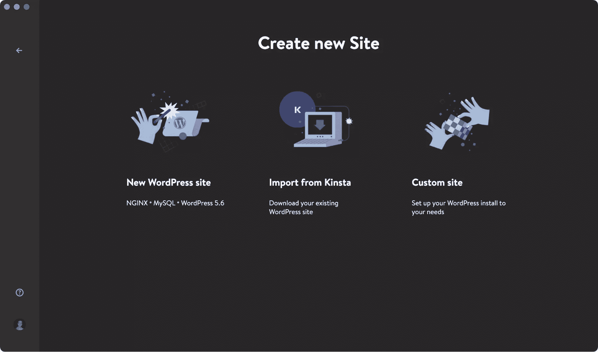Creating a new site with DevKinsa

### 新的 WordPress 站点

要开始，选择 [**新的 WordPress 站点**选项](https://kinsta.com/knowledgebase/devkinsta/creating-a-site/#new-wordpress-site/)。对于这种网站创建方法，你所要做的就是指定一个网站名称、WordPress 管理员用户名和 WordPress 管理员密码。填写完这三个字段后，点击**创建站点**。

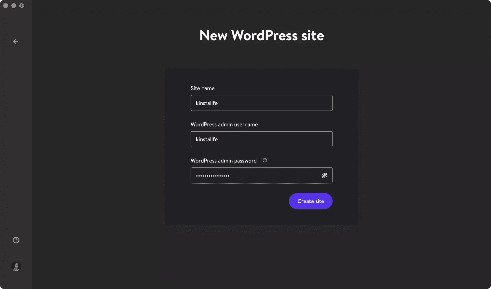Create a new WordPress site in DevKinsta

### 从 Kinsta 导入

第二种选择是导入已经托管在 Kinsta 上的站点环境。为此，单击 [**从 Kinsta** 导入 T3，并提供您的 MyKinsta 登录详细信息。](https://kinsta.com/knowledgebase/devkinsta/creating-a-site/#import-from-mykinsta)

登录后，选择您想要克隆到本地计算机的 Kinsta 环境。DevKinsta 在 Kinsta 上支持实时和临时环境，所以一定要选择正确的环境。

单击环境后，指定该站点是否为多站点安装，然后单击**导入站点**开始克隆您的站点。

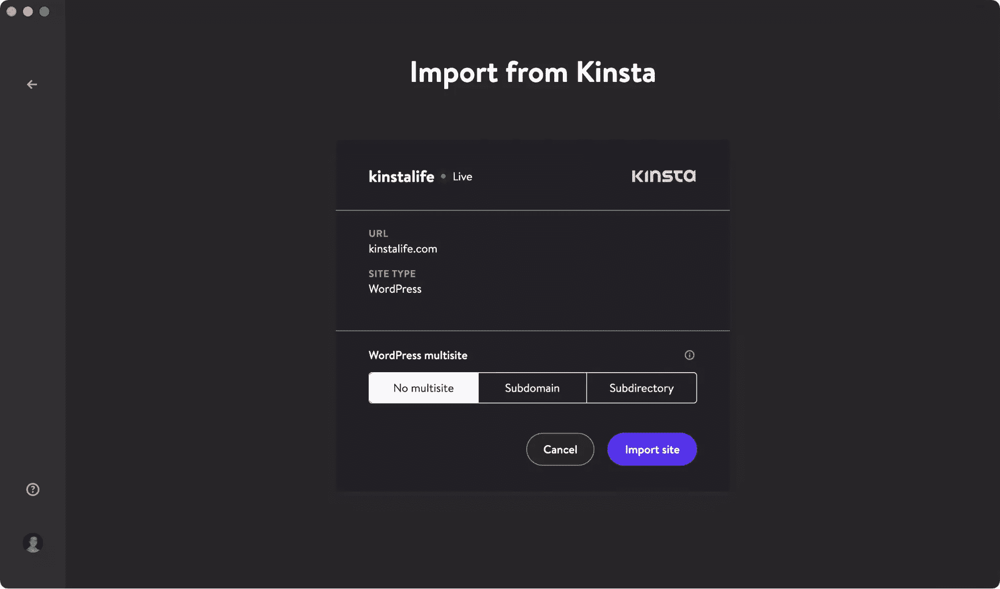Clone your live site with the Import from Kinsta feature

### 自定义网站

第三个也是最后一个选项，[](https://kinsta.com/knowledgebase/devkinsta/creating-a-site/#custom-site/)**，让你为你的本地 WordPress 安装配置特定的设置。**

 **以下是使用这种网站创建方法可以调整的设置:

*   站点名
*   PHP 版本(PHP 7.2、7.3、7.4 和 8.0)
*   数据库名称
*   启用 HTTPS
*   WordPress 网站标题
*   WordPress 管理邮件
*   WordPress 管理员用户名
*   WordPress 管理员密码
*   WordPress 多站点模式

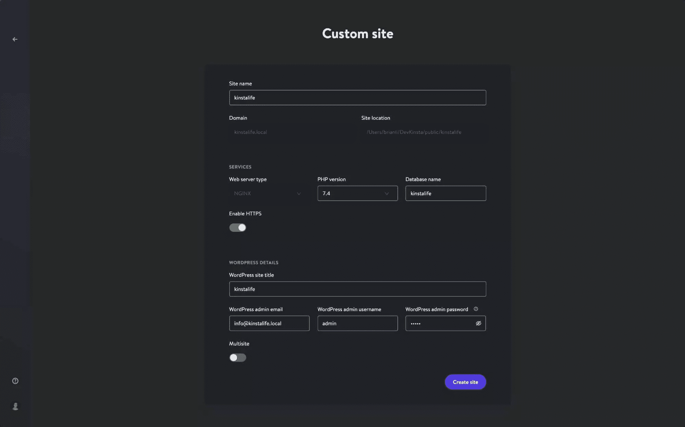Customize a local WordPress installation with DevKinsta

配置好所需的设置后，点击**创建站点**开始站点创建过程。

## 如何在 DevKinsta 中管理多个站点

对于同时从事多个项目的机构和开发者来说，DevKinsta 可以让你部署和管理多个本地 WordPress 站点！DevKinsta 管理的每个本地 WordPress 站点都运行在自己的容器化环境中。这意味着每个网站都有自己可定制的 PHP 版本、WordPress 版本、电子邮件收件箱等等。

要查看您的 DevKinsta 站点列表，请单击左侧边栏中的站点图标。

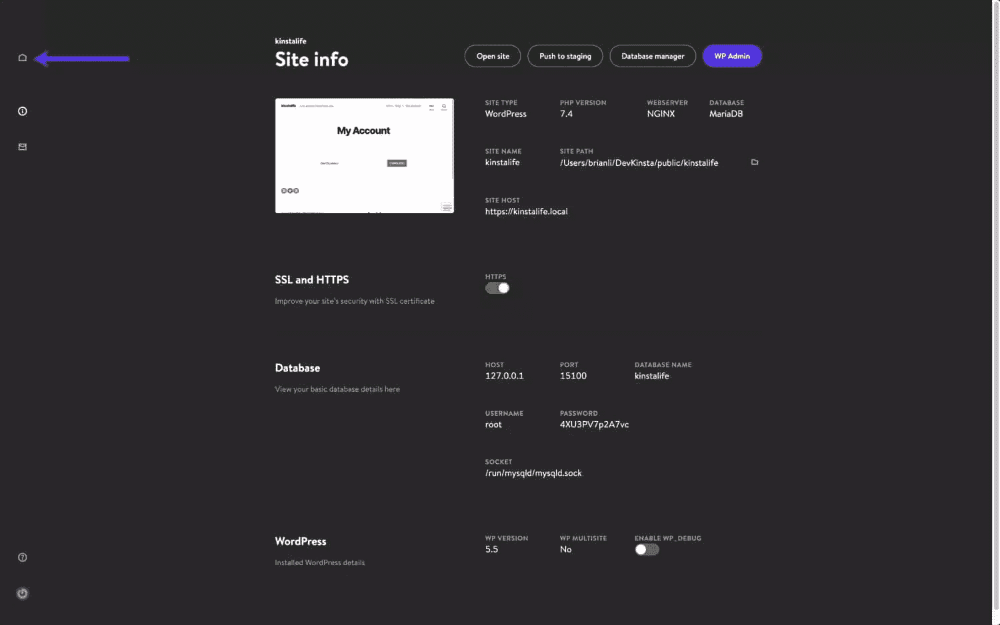Deploy multiple WordPress local environments with DevKinsta

在这个屏幕上，你可以看到所有本地 WordPress 站点的列表。要添加另一个站点，只需点击**添加站点**按钮。

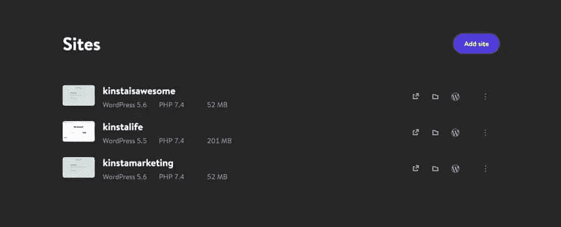Manage multiple WordPress sites with DevKinsta

## 如何将变更推送到 Kinsta 暂存环境中

对于在 Kinsta 上托管 WordPress 站点的用户来说，DevKinsta 使得在线推送变更到 Kinsta 暂存环境变得更加容易。要将本地站点推送至 Kinsta，只需点击“站点信息”页面上的**推送至暂存区**按钮。

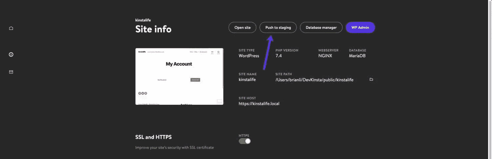Push your local WordPress site to a Kinsta staging environment

可能会提示您输入 MyKinsta 凭据。

然后，您需要选择推送的目标站点。请记住，此过程将覆盖当前暂存环境的内容(如果存在)。

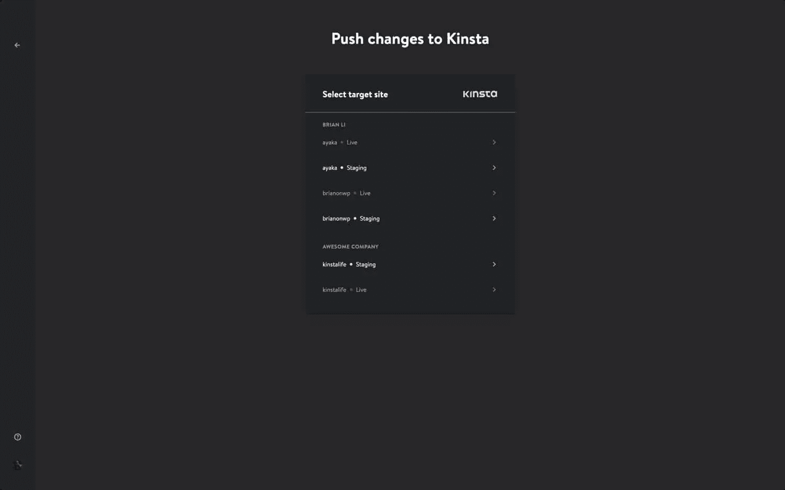Choose a staging environment to push changes to

最后，点击**推送至暂存**确认动作。

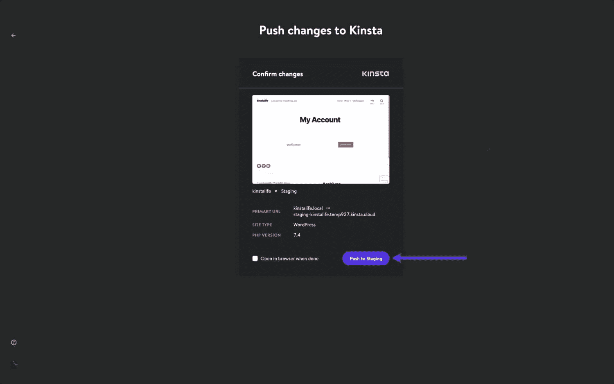Confirm the Push to Staging action

将您的本地 WordPress 站点推送到 Kinsta 之后，您就可以通过 staging environment URL 查看该站点了。如果有必要的话，你可以在 MyKinsta 推送 staging。

## 如何使用 DevKinsta 的数据库管理工具

DevKinsta 附带了一个名为 [Adminer](https://kinsta.com/knowledgebase/devkinsta/database-manager/) 的轻量级数据库管理工具。和我们用于 Kinsta 上托管的站点的 [phpMyAdmin](https://kinsta.com/knowledgebase/wordpress-phpmyadmin/) 一样，Adminer 为您提供了一个 web 界面来编辑数据库表、运行数据库查询、导入和导出备份等等。

要启动 Adminer，点击“站点信息”页面顶部的 [**数据库管理器**按钮](https://kinsta.com/knowledgebase/devkinsta/database-manager/#accessing-database-manager/)。Adminer 将在您的默认 web 浏览器中打开。

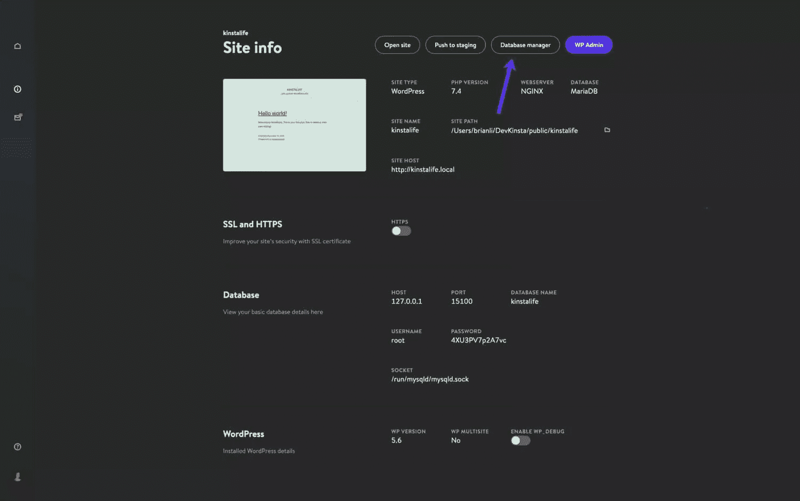Click Database Manager to access Adminer in DevKinsta

启动 Adminer 后，你会看到你的 WordPress 数据库的表格。下面的截图显示了我们的“kinstalife”测试站点的数据库。在“表格”栏下，你可以看到默认的 WordPress 表格，如`wp_comments`、`wp_posts`等。

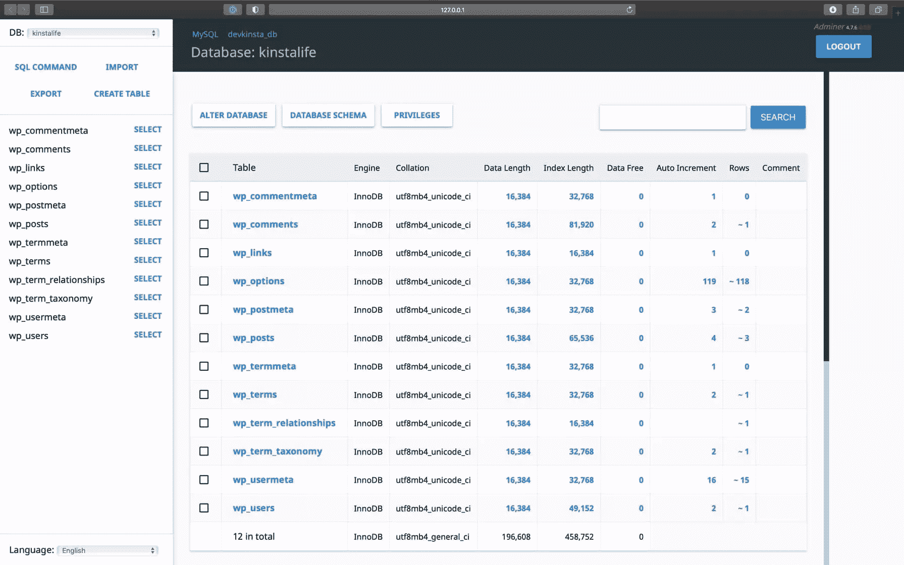WordPress database in Adminer

要编辑数据库条目，请单击所需的表格。例如，如果我们想编辑 WordPress 站点的主页和网址，我们可以点击`wp_options`表。

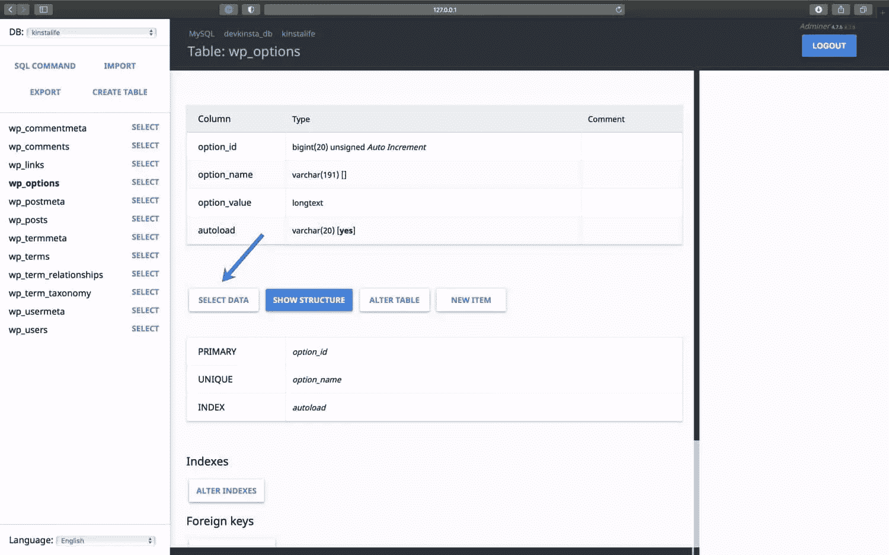Click Select Data to edit your WordPress database tables

在这个页面上，我们可以编辑`siteurl`的`option_value`来更新我们 WordPress 站点的 URL，同样的事情也可以在主页 URL 上进行。

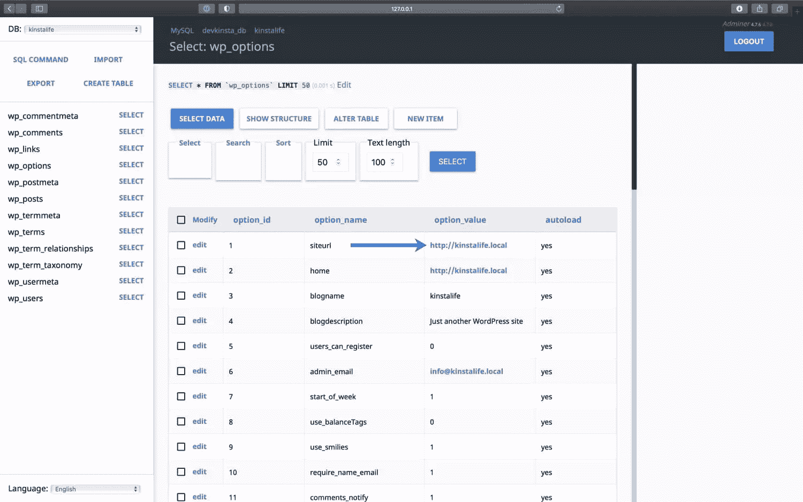Edit a WordPress database option_value with Adminer

Adminer 也支持数据库导入和导出。这对于处理数据库备份文件很有用，比如我们在[可下载备份](https://kinsta.com/feature-updates/downloadable-backups/)中包含的文件。

要导入数据库文件，点击 Adminer 左上角的**导入**。点击**选择文件**选择数据库备份，点击**执行**开始导入过程。Adminer 支持原始的`.sql`文件和压缩的`.sql.gz`文件。

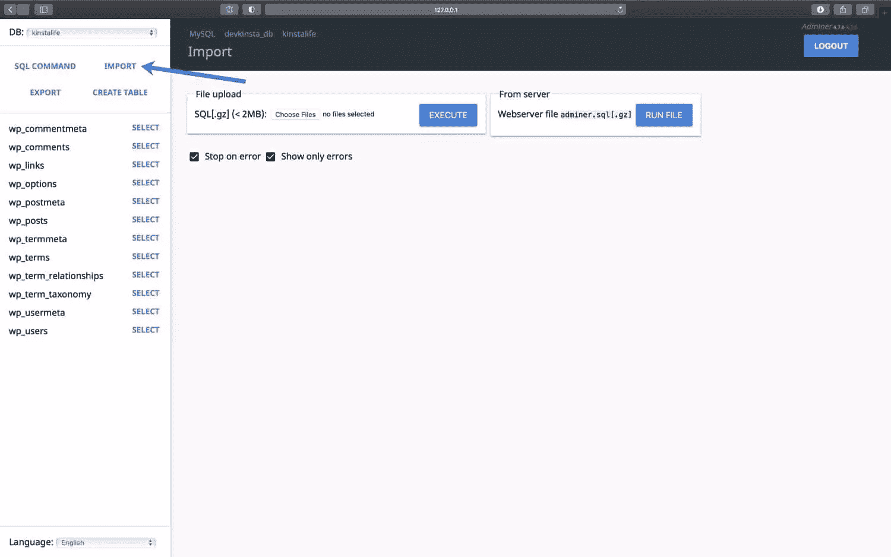Import a database backup with Adminer

要导出完整的数据库备份，点击 Adminer 左上角的**导出**。选择“gzip”作为输出格式，选择“SQL”作为数据库格式，其他设置保持不变。点击**导出**开始备份过程。

Adminer 会将你的 WordPress 数据库导出到一个压缩的`.sql.gz`文件中。

Export a database backup from Adminer

最后，Adminer 支持 SQL 命令执行，这意味着您可以在您的 WordPress 数据库上运行数据库查询。例如，如果您试图查找数据库中自动加载的数据量，您可以在 Adminer 中运行下面的 SQL 命令。

```
SELECT SUM(LENGTH(option_value)) as autoload_size FROM wp_options WHERE autoload='yes'; 
```

要运行数据库查询，点击 Adminer 左上角的 **SQL 命令**。指定一个数据库查询，点击**执行**运行命令。

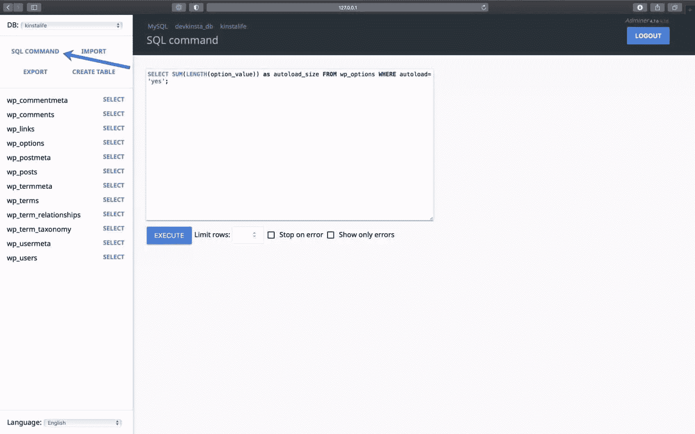Query your database with a SQL command in Adminer

有了 DevKinsta 的 Adminer 集成，你可以更好地控制你的 WordPress 数据库。

无论您需要编辑数据库表、导入或导出备份，还是运行复杂的 SQL 命令，DevKinsta 都能满足您的需求！

## 如何使用 DevKinsta 的电子邮件收件箱工具检查发出的电子邮件

DevKinsta 包括一个[内置的 SMTP 服务器和电子邮件捕获工具](https://kinsta.com/knowledgebase/devkinsta/email-inbox/)。这允许你的本地 WordPress 站点像一个活的生产站点一样发送邮件。然而，发送的电子邮件将被捕获并存储在 DevKinsta 的电子邮件收件箱中。

这让你两全其美。您可以使用 DevKinsta 来测试针对[营销自动化工作流程](https://kinsta.com/blog/email-marketing-statistics/#most-popular-email-marketing-automation/)、 [WooCommerce](https://kinsta.com/learn/woocommerce-guide/) 订单确认等的外发电子邮件功能，而无需向访客和客户的收件箱发送垃圾邮件。

要访问 DevKinsta 的电子邮件收件箱，请点击左侧边栏中的邮件图标。

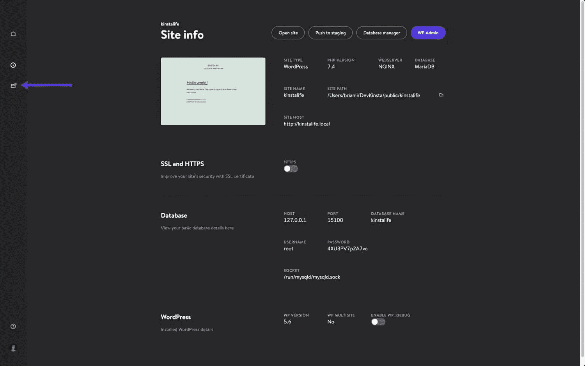DevKinsta includes a built-in SMTP server and email capture tool

在电子邮件收件箱中，您将看到已捕获的待发电子邮件列表。在下面的截图中，你可以看到一封来自我们的“kinstalife”测试网站的邮件。

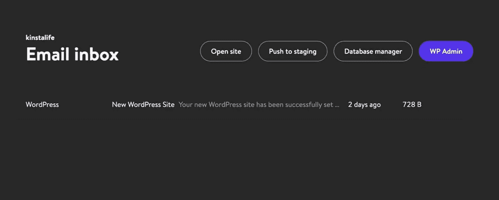An outgoing email in DevKinsta’s email inbox

要检查发出的电子邮件，只需点击它。对于每封电子邮件，使用 DevKinsta 检查“发件人地址”、“收件人地址”、正文内容、发送时间等等。

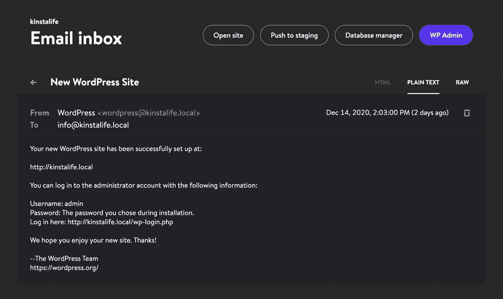DevKinsta email inbox display modes

您还可以选择以 HTML、纯文本或 Raw 模式显示电子邮件。HTML 模式对于测试 HTML 电子邮件模板很有用，而 Raw 模式允许您直接检查电子邮件标题，如`MIME-Version`和`X-Mailer`。

## 从哪里了解关于 DevKinsta 的更多信息

要了解更多关于 DevKinsta 的信息，请务必加入[官方社区论坛](https://community.devkinsta.com/)并阅读 [DevKinsta 文档](https://docs.devkinsta.com/)。

我们期待看到你创造的东西！

## 分享这篇文章**