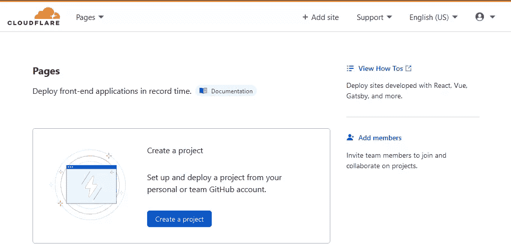
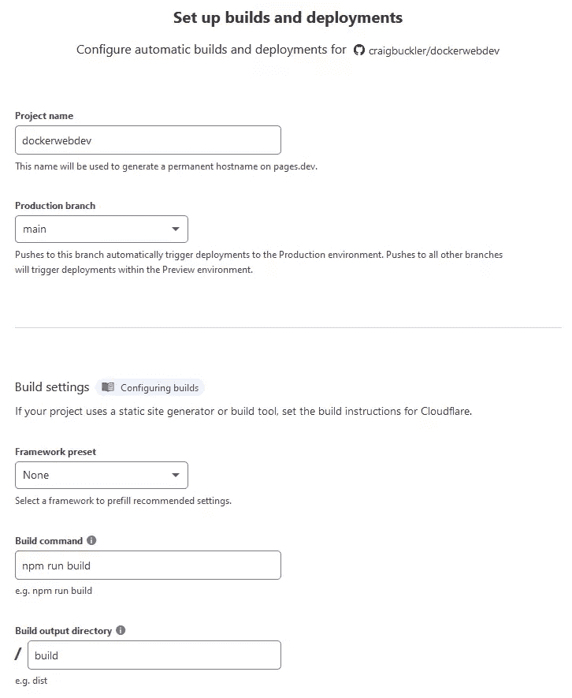
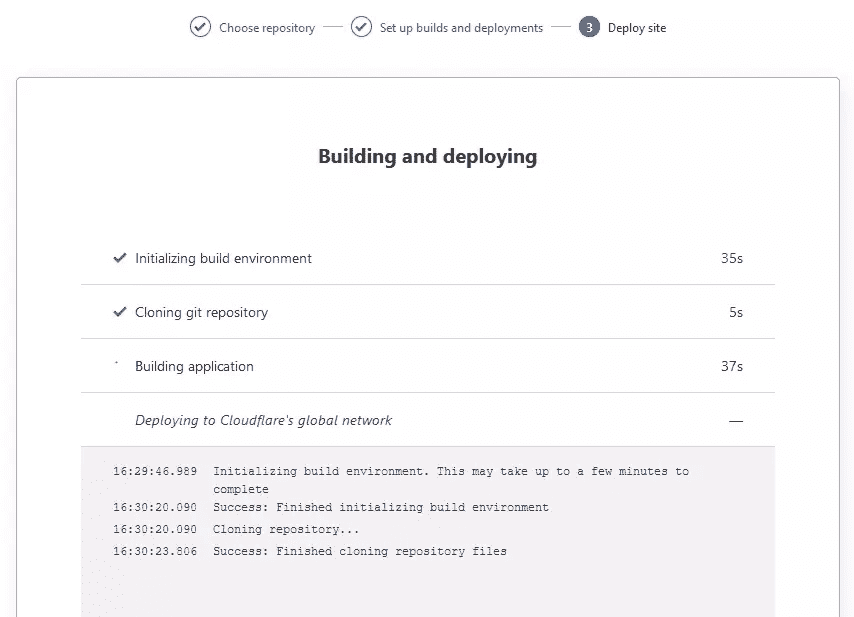
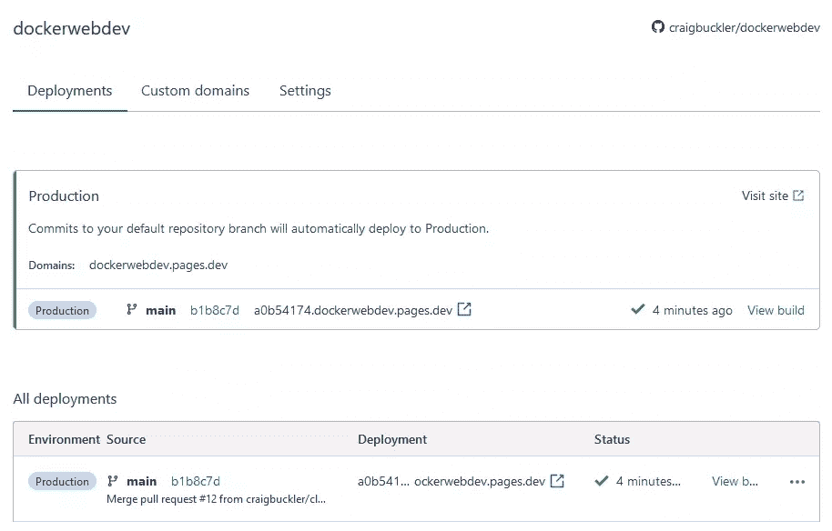
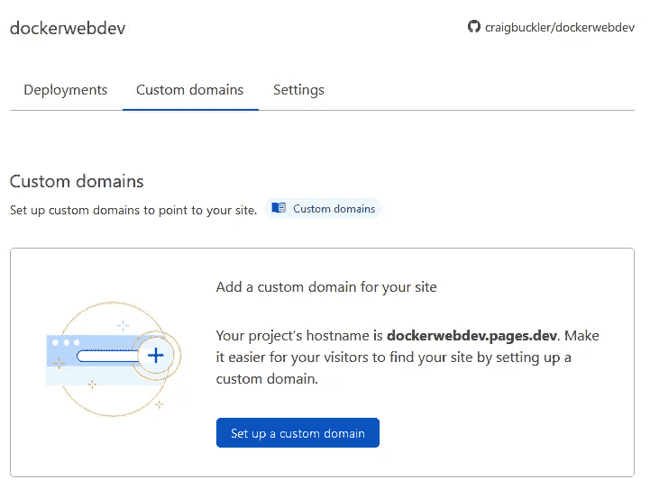
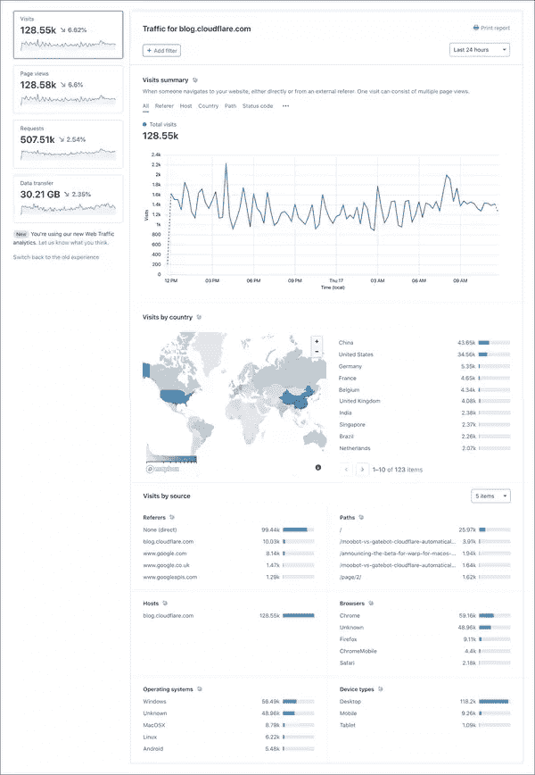

# 如何将 Jamstack 站点部署到 Cloudflare 页面

> 原文：<https://www.sitepoint.com/cloudflare-pages-jamstack-deployment/>

**这篇文章描述了如何将你的 [Jamstack](https://www.sitepoint.com/learn-jamstack/) 站点部署到 cloud flare Pages——这是一项简单易用的免费托管计划的新服务。**

网络世界可能正在使用 WordPress 的[，但是开发者正在向](https://w3techs.com/technologies/details/cm-wordpress) [Jamstack technologies](https://jamstack.org/) (也被称为*静态网站*)发展。Jamstack 这个名字(曾经写成 JAMStack)代表 JavaScript、API 和标记，是由 [Netlify](https://www.netlify.com/) 发明的。与 Ajax 一样，这个术语的范围也扩大了，但是 Jamstack 站点通常使用预先呈现的静态内容，客户端逻辑连接到一组松散耦合的后端 API。好处是引人注目的:

*   性能:在可能的情况下，Jamstack 站点在构建过程中只生成一次页面，而不是在视图中显示。它们速度很快，通常部署在距离用户更近的内容交付网络(cdn)中。

*   **可伸缩性** : Jamstack 站点是生成文件的集合，不需要服务器端处理或数据库连接。页面被有效地预先缓存并全局部署。

*   可移植性:一旦生成，就有可能在任何地方托管 Jamstack 站点。没有供应商锁定。

*   **开发**:开发者可以使用[任何他们喜欢的工具](https://jamstack.org/generators/)来生成一个网站。如果有必要，文章编辑可以[继续使用 WordPress](https://www.sitepoint.com/wordpress-headless-cms-eleventy/) 或任何其他 CMS 来写内容。

*   **部署** : Jamstack 站点可以通过提交 Git 分支自动部署到测试和生产站点。不需要复杂的持续集成或部署流程。

以下教程解释了如何从头开始创建 Jamstack 站点:

*   [十一门](https://www.sitepoint.com/getting-started-with-eleventy/)入门(参见 [Github 库](https://github.com/craigbuckler/11ty-starter))
*   [盖茨比入门:建立你的第一个静态网站](https://www.sitepoint.com/gatsby-guide/)
*   [如何用 Gatsby 和 MDX 建立开发者博客](https://www.sitepoint.com/gatsby-mdx-blog/)

## Jamstack 托管服务

你可以在任何地方托管一个网站，包括 GitHub Pages 和亚马逊 S3，但是 Netlify 和 Vercel 主导了 Jamstack 领域。他们提供了慷慨的计划和简单的基于 Git 的部署。

最新进入市场的是 [Cloudflare](https://www.cloudflare.com/) —一家以其全球 CDN、边缘安全和缓存服务而闻名的公司。新的 [Cloudflare Pages](https://pages.cloudflare.com/) 服务在其庞大的全球基础设施中提供 Jamstack 托管。[免费计划](https://pages.cloudflare.com/#pricing)现已面向所有人开放，包括:

*   无限制的站点、请求和带宽
*   SSL 和安全性
*   强大的内容缓存和过期
*   网络分析
*   GitHub 分支机构的生产和测试部署
*   一次一个构建，每月多达 500 个构建，以及
*   包含入门教程、部署示例和迁移指南的完整文档

构建平台支持的语言包括 Node.js、Python、PHP、Ruby、Go、Java、Elixir 和 Erlang。大多数 site builder 软件应该可以工作，但是以下工具已经验证了兼容性:

*   角度(角度 CLI)
*   早午餐
*   Docusaurus
*   电梯，电梯
*   Ember.js
*   盖茨比（姓）
*   GitBook
*   网格体
*   雨果
*   吉基尔博士
*   Mkdocs
*   Next.js(静态 HTML 导出)
*   Nuxt.js
*   鹈鹕
*   做出反应(`create-react-app`)
*   静电反应
*   石板
*   苗条的
*   海
*   某视频剪辑软件
*   VuePress

## 您的第一次 Cloudflare Pages 部署

您可以部署任何 Jamstack 站点，假设它:

1.  可以在 Github 存储库中获得，并且
2.  使用单个构建命令在特定目录中创建所有静态 HTML、CSS、JavaScript 和媒体文件。

在 Node.js 项目中，构建命令通常是`npm run build`，它在`package.json`中运行相关的`npm`脚本。您可以克隆[示例项目](https://github.com/craigbuckler/11ty-starter)，它使用构建命令`npm run production`将文件输出到`build`目录。

以下可选更新可能比较实用:

*   如果你的站点是一个页面集合，而不是一个页面应用程序(SPA)，你应该确保一个“没有找到”的页面呈现到一个名为`404.html`的根文件中。

*   您可以呈现一个包含一个或多个重定向行的`_redirects`文件，格式如下:

    `<old-URL> <new-URL> <301|302 HTTP status code>`

    比如`/blog /tutorials 301`。

    对通配符等更高级选项的支持即将推出。

*   所需的语言版本。例如，如果您需要 Node.js 版本 14.8 或更高版本，那么在您的项目根目录中创建一个包含`v14.8`的`.nvmrc`文件。(也可以在 Cloudflare 的构建配置中将其指定为一个`NODE_VERSION`环境变量。)

要开始配置，请打开[pages.cloudflare.com](https://pages.cloudflare.com/)，使用您的 Cloudflare ID 和密码注册或登录。然后点击**创建一个项目**。

你需要连接到一个 GitHub 帐户来设置你的第一个站点，你可以选择共享所有或者一组特定的存储库。点击您的 Jamstack 项目，然后点击 **Begin setup** 进入配置屏幕。

输入以下信息:

1.  **项目名称**。这将成为`pages.dev`的子域，因此它允许小写字母和数字字符。默认名称为存储库名称。

2.  **生产分公司**。这通常是`main`或`master`。

3.  **建造命令**。选择一个框架预置将使用已知的缺省值，但是您将为示例 Eleventy 项目输入`npm run production`。

4.  **输出目录**。选择一个框架预置将使用已知的缺省值，但是您将为示例 Eleventy 项目输入`build`。

5.  **路径**。这是构建命令运行的地方*(如果不是来自项目根)*。

6.  **环境变量**。输入构建所需的任何内容。

点击**保存并部署**。构建屏幕将显示当前状态:

较小的项目将需要大约两分钟来安装依赖项、运行构建流程以及将站点部署到 Cloudflare 的 CDN。完成后，单击**继续投影**以查看 Cloudflare 页面摘要屏幕。

您的站点现在可以在域`<project-name>.pages.dev`以及分支的自定义子域(如`1234567.<project-name>.pages.dev`)中使用。点击**访问网站**在新标签页打开。

要配置自定义域，点击**自定义域**选项卡，然后点击**设置自定义域**。

然后输入您想要使用的域名。

如果域已经在使用 Cloudflare 名称服务器，该页面将要求您批准 DNS 配置更改。对于其他注册商，将出现说明，显示您需要进行的 DNS 更改。在大多数情况下，您需要添加一个新的`CNAME`记录，并可能删除一个旧的`A`记录。

然后，您的网站将在自定义域上运行。注意`<project-name>.pages.dev`还是可以的，打开分享网址的时候要小心。

## 自动化部署

Cloudflare Pages 会为每次提交到 GitHub 存储库的操作自动构建和部署一个新站点。

*   分支提交在特定的子域上可用，例如`abcdef0.<project-name>.pages.dev`，因此其他人可以评估潜在的更新。

*   提交或合并到生产分支(`main`或`master`)还会创建一个特定的子域，该子域在`<project-name>.pages.dev`和您的自定义域中可用。

项目的仪表板显示了所有的部署，包括到站点的链接、**构建**日志和一个**删除**选项。

## 进一步设置

项目的**设置**选项卡提供了更多选项:

*   编辑配置、暂停部署或删除项目
*   邀请其他协作者
*   定义访问策略，以便预览(分支)部署提示输入访问 PIN
*   启用 Cloudflare Web Analytics

当您下一次部署生产分支时，启用分析会在页面末尾添加一个小脚本。然后, **Web Analytics** 链接变为活动状态。

它不像谷歌分析那样全面，但数据在一小时内可用，并且它提供了一个显示最重要指标的快速界面。大多数人会发现它相当容易使用。

## Jamstack Joy

Cloudflare Pages 是新版本，未来几个月将会推出更多更新:

*   GitLab 和 Bitbucket 存储库支持
*   进一步的`_redirects` URL 转发选项
*   触发部署的 webhooks
*   A/B 测试—更新显示为流量的百分比，因此您可以在提交更改之前测试真实的用户活动
*   具有 Cloudflare Workers 和存储 API 的全栈应用程序。

Jamstack 开发人员激动人心的选择越来越多。

## 分享这篇文章