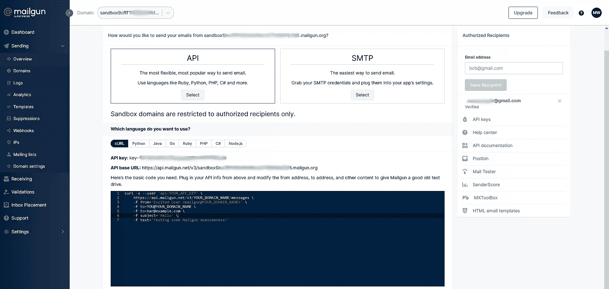
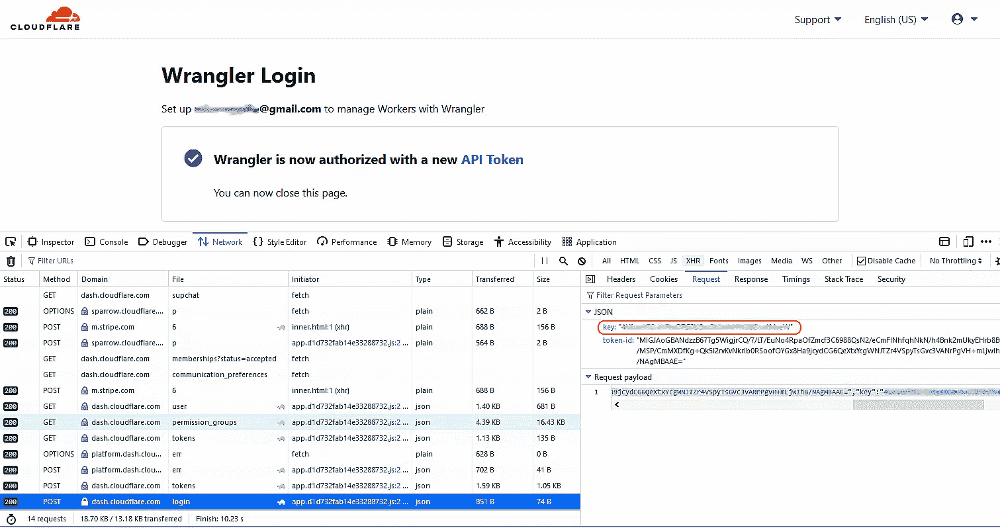
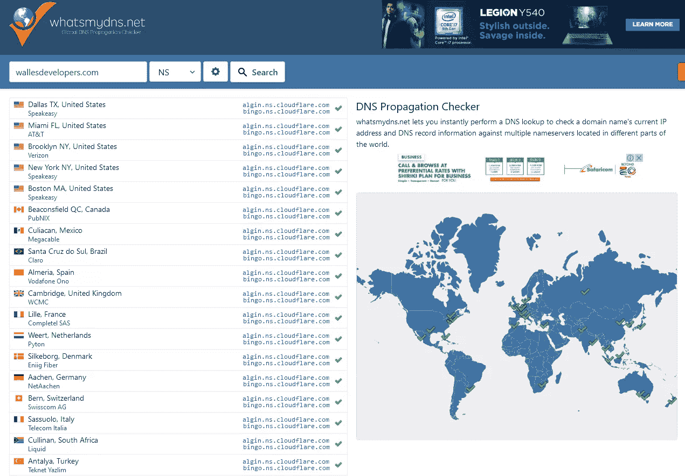
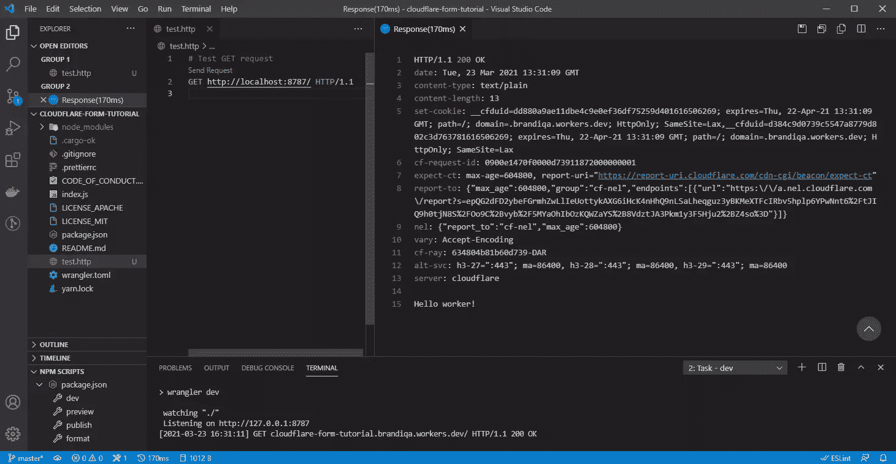
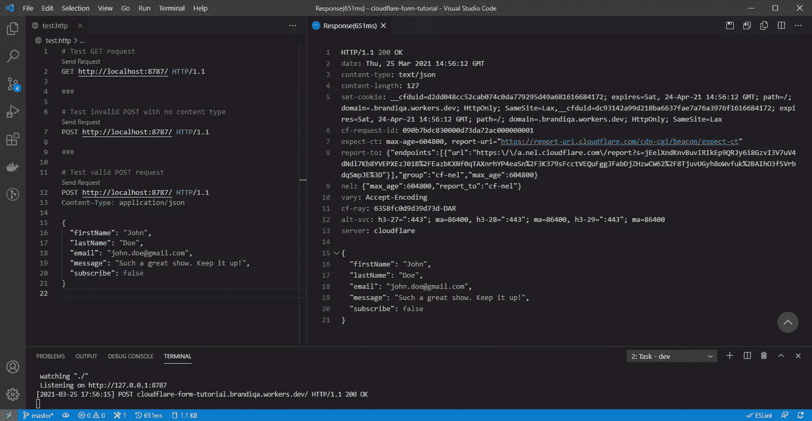
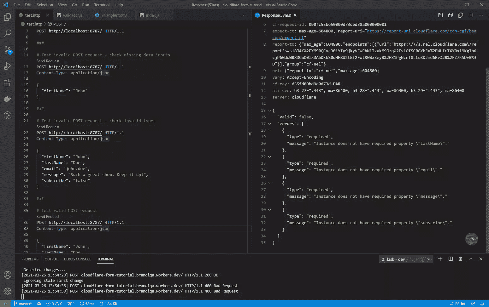
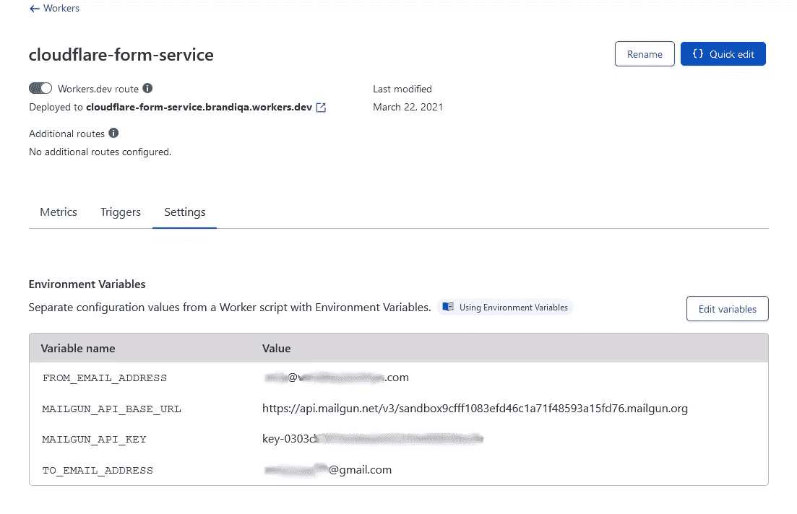
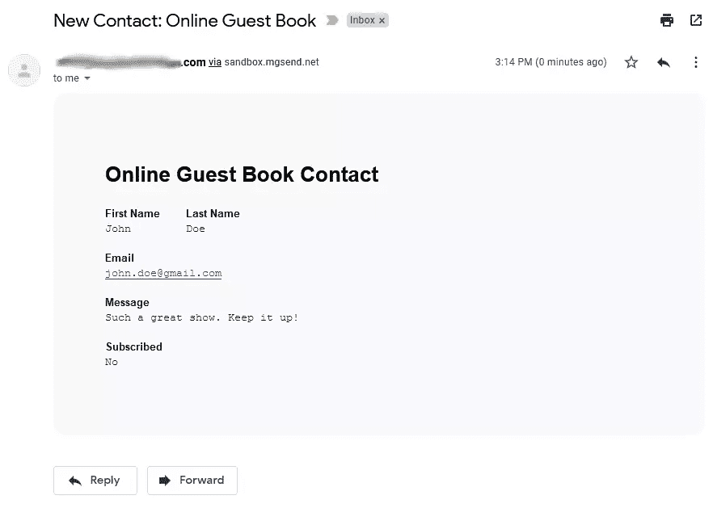
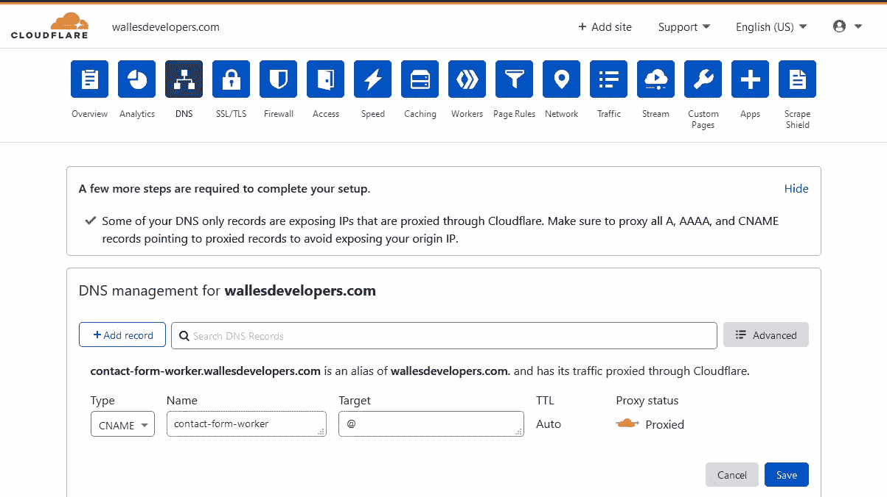
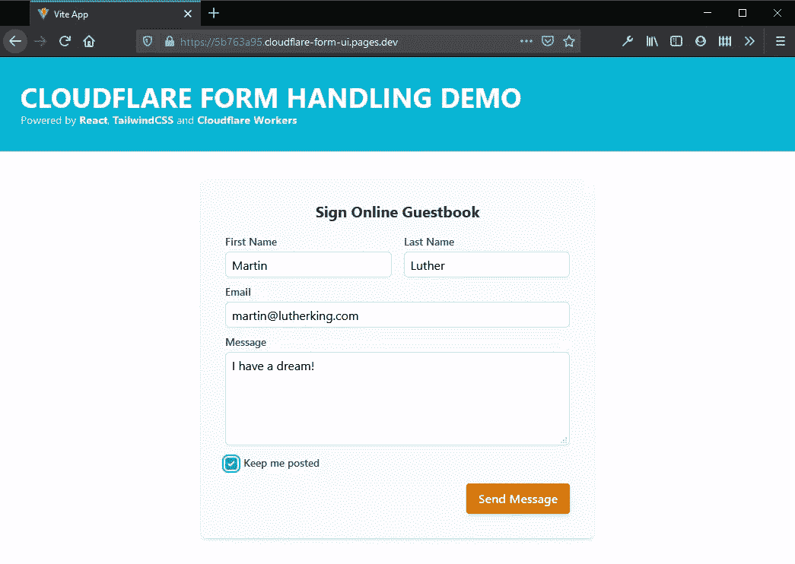

# 使用 Cloudflare Workers 处理 Jamstack 站点的表单

> 原文：<https://www.sitepoint.com/jamstack-form-handling-cloudflare-workers/>

在本教程中，你将学习如何使用 [Cloudlflare Workers](https://workers.cloudflare.com/) 为你的 Jamstack 网站或单页应用程序(SPA)构建一个表单处理服务。

使用 [Jamstack](https://www.sitepoint.com/learn-jamstack/) 技术，HTML 代码在构建时呈现，然后部署到边缘服务器。这使得最终用户的加载速度非常快。此外，企业通过支付低得多的托管费用而受益。

Jamstack 技术的一个问题是如何处理只能用服务器端技术实现的站点功能。例如，如果您可以使用 PHP 之类的服务器端技术，那么表单处理就相对容易，您可以使用`mail(<to>, <from>, <message>)`来收集和发送邮件数据。

当然，Jamstack 网站也没有被冷落。您可以使用[无服务器计算](https://www.sitepoint.com/serverless-functions/)在 Jamstack 站点上运行后端应用程序。但是你需要在你的后端开发中实现一个 [**微服务架构**](https://microservices.io/) 。无服务器计算要求您将逻辑构建成松散耦合、可独立部署的服务。

无服务器计算比租用运行后端应用程序所需的私有服务器更具成本效益。无服务器计算的一个额外好处是，您可以开始使用更多的服务来创建更复杂的工作流(例如使用 Airtable 这样的服务来存储表单数据)。

在本教程中，您将学习如何为 React 前端 SPA 构建和部署表单处理服务。技术上，任何前端框架都可以。我们将使用 Cloudflare Workers 来开发我们的无服务器功能。在我们开始编写代码之前，让我们先了解一下为什么要使用这个技术堆栈。(如果您想直接进入动手部分，请跳到[项目部分](#abouttheproject)。)

### 关于第三方表单处理服务

已经有很多 API 表单处理服务提供了我们需要的特性。其中包括:

*   [表单狂欢](https://formspree.io/)
*   [获取表单](https://getform.io/)
*   [格式数据](https://www.form-data.com/)
*   [网络生活形式](https://www.netlify.com/products/forms/)

它们提供的功能包括:

*   电子邮件通知
*   垃圾邮件拦截
*   通过 [Zapier](https://zapier.com/) 与其他服务整合
*   仪表板数据视图
*   文件上传和存储
*   CSV 导出

这有很大的价值，让您不必自己构建这样的服务。此外，将该服务与现有的 web 应用程序集成只需要大约五分钟或更少的时间。大多数平台都提供免费计划，每月给你 50 到 100 次免费提交，文件存储空间约为 100MB。

付费计划每月 9 美元起，可提交 1000 份文件和 1GB 的文件上传存储空间。如果你使用这项服务来捕捉线索，价格是相当合理的。但是，如果您将它用于不同的目的，例如收集大量的现场数据，它可能会很快变得昂贵。

这就是构建自己的表单处理服务的优势所在。有几个好处，包括:

*   每次提交表单的成本更低
*   自定义安全策略的实施
*   与其他服务的无限集成
*   减少延迟，因为您可以控制托管服务的方式和位置
*   能够添加表单处理提供商目前未提供的新功能

关于降低每次提交的成本，交易电子邮件服务提供商，如[](https://sendgrid.com/pricing/)**和 [**Mailgun**](https://www.mailgun.com/pricing/) 目前提供每月免费发送 3000 至 5000 封电子邮件的服务。前者的优惠是永久免费，后者的优惠只持续三个月。**

 **当然，对于任何人的收件箱来说，这已经是太多的邮件了。您可能希望将表单数据直接发送到数据库或处理这些数据的应用程序服务中。如果是这样的话，你可能会为每 100 万份作品支付不到 10 美元的费用。

我[估算的这个价格](https://fauna.com/blog/comparison-faas-providers)是基于主要无服务器计算和无服务器数据库产品的综合平均价格。如果你需要文件存储，你可以用**每月 5 美元**获得 **250 千兆字节**的 Linode 对象存储。当你花时间自己构建服务时，你实际上获得了更多的价值。

我希望这些是足够的理由。如果没有，那么学习构建只是为了乐趣。你可以把学到的知识应用到其他领域。在下一节中，我们将了解为什么选择使用 Cloudflare Workers 构建我们自己的服务。

### 关于 Cloudflare 工人

第一个引入的无服务器计算平台是 2008 年推出的[谷歌应用引擎](https://cloud.google.com/appengine/docs)。然而，第一个商业上成功的无服务器产品是亚马逊在 2014 年推出的 [AWS Lambda](https://aws.amazon.com/lambda/) 。后来，在 2016 年，谷歌推出了第二款无服务器产品，名为[谷歌云功能](https://cloud.google.com/functions)。 [IBM 云功能](https://cloud.ibm.com/functions/)和 [Azure 功能](https://azure.microsoft.com/en-us/services/functions/)紧随其后。

虽然所有这些服务都提供了以低得多的成本运行后端代码的好处，但大多数服务都存在一个被称为“冷启动”的问题。这是托管您的函数的空闲容器花费从 **1 到 10 多秒**来响应请求的地方。有许多解决方法可以改善这种情况，但不能完全解决问题。

**Cloudflare Workers** 是无服务器计算市场的最新成员。该公司已经解决了冷启动问题，空闲的无服务器功能经历 **0 毫秒启动时间**来响应请求。他们通过利用 V8 运行时来执行无服务器函数，而不是在 Node.js 环境中运行它们，从而实现了这一点。[本指南](https://developers.cloudflare.com/workers/learning/how-workers-works)详细解释了它的工作原理。

另外，Cloudflare 是一个**边缘计算平台**。这基本上意味着代码在离最终用户最近的服务器上执行。这大大降低了网络延迟，并使您的应用程序即时响应。

希望我现在已经说服您，Cloudlflare Workers 是一条可行之路。所以让我们开始建造吧。

## 关于项目

已完成项目的源代码包含在以下链接中:

*   [Cloudflare 表单 UI](https://github.com/sitepoint-editors/cloudflare-form-ui) : React 单页面应用
*   [Cloudflare 表单服务](https://github.com/sitepoint-editors/cloudflare-form-service) : Cloudflare Workers 应用

在本教程中，我们将一步一步地构建 Workers 应用程序。然后，我们将下载并配置完成的 SPA(上面的链接)以连接到我们完成的 Workers 项目。

我们不会构建 UI。我们将部署该应用程序，并使用我们将要构建的 Workers 应用程序对其进行测试。下一节描述了本教程需要满足的所有先决条件。

### 先决条件

本教程面向中高级 Node.js 开发人员。我假设您熟悉 ES6+符号和 REST APIs。在您的开发环境中，您需要以下设置:

*   [Node.js](https://nodejs.org/en/download/)
*   [Visual Studio 代码](https://code.visualstudio.com/)
*   VS 代码 [REST 客户端](https://marketplace.visualstudio.com/items?itemName=humao.rest-client)扩展

与使用外部应用程序相比，REST 客户端扩展是测试 REST 接口的更方便的工具。

## 帐户设置

在本节中，我们将设置构建电子邮件处理工作者所需的所有服务帐户。记下我们将在开发过程中使用的所有 API 标记和其他 id。

### 1.自定义域

为了遵循本教程，强烈建议您访问自定义域和使用该域的电子邮件地址。但是，您可以使用沙盒域和注册时 Cloudflare 提供的免费子域来让代码工作。请注意，在 Mailgun 上设置自定义域名时，需要信用卡信息。

拥有自定义域将允许您:

*   在自定义域上部署您的 Cloudflare 项目
*   实时访问您部署的员工日志
*   发送不会出现在垃圾邮件箱中的真实电子邮件

如果你没有访问自定义域名的权限，我强烈建议你从 [FastComet](https://www.fastcomet.com/domains/registration) 购买一个新的域名。我推荐他们的原因是因为他们会给你一个**免费建兴电子邮件包**，你可以用它来设置你的自定义域名电子邮件地址。大多数提供商会向你收取额外的电子邮件托管费。

在下一节中，我们将设置一个 Mailgun 帐户。

### 2.电子枪设置

Mailgun 是一种电子邮件 API 服务，允许开发人员通过 API 将电子邮件功能集成到他们的应用程序中。我们将使用他们的 REST API 接口从我们的 Workers 应用程序向接收者发送电子邮件。基本上这意味着我们只需要使用`Fetch`或`Axios`来发送电子邮件。使用以下指南设置您的 Mailgun 帐户:

1.  前往[注册](https://signup.mailgun.com/new/signup)页面，使用[免费计划](https://www.mailgun.com/pricing/)创建一个新账户。
2.  使用发送到您手机的电子邮件地址和短信代码验证您的帐户。
3.  在 Mailgun 的仪表板上，进入**发送** > **域**，你会发现一个沙盒域已经为你创建。这是一个免费的域名，供你测试电子邮件的发送。
4.  有了沙盒域，你只允许向一个[授权的收件人](https://help.mailgun.com/hc/en-us/articles/217531258-Authorized-Recipients)发送电子邮件。在 current dashboard 的右边栏，您会发现一个表单，您可以在其中提供收件人的电子邮件地址。现在加一个。这将是接收从我们将要构建的 Workers 应用程序发送的电子邮件的电子邮件地址。
5.  一封电子邮件将被发送到授权收件人的收件箱。单击确认完成步骤 4。
6.  在沙盒的**概览**页面，点击 **API** > **选择**按钮。
7.  接下来，选择**卷曲**选项卡。记下你的`API Key`和`API base URL`。
8.  使用为沙盒域提供的 cURL 命令发送测试电子邮件。确保用您的 API 令牌和您的授权电子邮件收件人替换相关字段。



这里有一个简单的例子，告诉你如何发送你的邮件:

```
curl -s --user 'api:key-0303d350c68aa534560ed0838bca66e' \
  https://api.mailgun.net/v3/sandbox9cfff108345efd4a15fd76.mailgun.org/messages \
  -F from='John Doe <john.doe@gmail.com>' \
  -F to=jane.doe@gmail.com \
  -F subject='Hello' \
  -F text='Message sent using Mailgun service' 
```

如果成功，您应该会收到如下所示的输出:

```
{
  "id": "<20210406124818.1.7CAD4673034EEB0E@sandbox9cfff108345efd4a15fd76.mailgun.org>",
  "message": "Queued. Thank you."
} 
```

您还应该在授权收件人的收件箱或垃圾邮件箱中收到一封电子邮件。如果发生这种情况，您已经成功地设置了您的 Mailgun 帐户。

如果您想使用一个**自定义域**作为您的发送域，请注意需要信用卡信息。你可以按照这里[的指示](https://www.youtube.com/watch?v=BmEj3EBo0vg)来学习如何设置那个。使用自定义域可以解除发送限制，还可以验证您的电子邮件来源，以便它们总是出现在用户的收件箱中，而不是垃圾邮件箱中。

学完本节后，您应该可以访问以下内容:

*   **一个 API 键**:比如`api:key-0303d350c68aa534560ed0838bca66e`
*   **一个 API 基础 URL** :例如`https://api.mailgun.net/v3/sandbox9cfff108345efd4a15fd76.mailgun.org`
*   **发件人电子邮件地址**:使用任何 Gmail 地址或你在 Mailgun 注册的自定义域名地址
*   **收件人电子邮件地址**:授权收件人

请注意，API 密钥也可以在**设置** > **API 密钥** > **私有 API 密钥**下找到。

### 3.Cloudflare 工作进程设置

要开始，只需[注册](https://dash.cloudflare.com/sign-up/workers)一个 Cloudflare Workers 帐户。遵循提供的说明:

1.  输入电子邮件地址和密码
2.  为您的帐户选择一个子域
3.  选择计划:选择免费
4.  验证您的电子邮件地址

接下来，安装并配置 [Wrangler CLI](https://developers.cloudflare.com/workers/cli-wrangler/install-update) ，您将使用它来开发工人项目:

```
# Install wrangler CLI globally
npm install -g @cloudflare/wrangler

# Confirm version
wrangler --version

# Login to your Workers account
wrangler login

# Confirm login status
wrangler whoami 
```

如果登录命令对你来说失败了，这里有一些解决方法，已经在这个 [GitHub 问题](https://github.com/cloudflare/wrangler/issues/1703)上记录了。这些是对我的机器有效的步骤:

1.  在终端中再次执行`wrangler login`。

2.  一旦授权页面加载，按 F12 打开检查器，然后切换到网络标签。

3.  点击`Authorize Wrangler`按钮，等待显示“牧马人现已获得授权”。

4.  在检查器控制台的“网络”选项卡下，找到最后一个 POST 请求。单击它将其高亮显示。

5.  应该会出现一个请求选项卡。点击它进入。应该会有一些 JSON 数据。属性“key”是 API 令牌。复制它。

    

6.  回到终端，使用`ctrl` + `c`取消上一个命令。执行命令`wrangler config`。您将被要求输入您的 API 令牌。粘贴刚刚复制的密钥，然后按`enter`。它应该返回一个“成功配置”的消息。

7.  通过执行`wrangler whoami`确认认证成功。

在下一小节中，我们将了解如何向您的 Cloudflare 帐户添加自定义域。如果您没有，只需跳到“[项目开发](#projectdevelopment)”部分，没有项目开发我们也可以继续。

#### Cloudflare 上的自定义域设置

如果您有一个自定义域，您将能够访问 Workers 应用程序的实时日志。要进行设置，只需按照以下说明操作:

1.  将您的网站(自定义域)添加到 Cloudflare: [此处的说明](https://support.cloudflare.com/hc/en-us/articles/201720164-Creating-a-Cloudflare-account-and-adding-a-website)

2.  将您的域名服务器更改为 Cloudflare: [此处有说明](https://support.cloudflare.com/hc/en-us/articles/205195708)。

    在 Cloudflare 中添加您的自定义域还将使您能够将 Workers 应用程序发布到自定义域。我们将在后面的部分中看到如何做到这一点。请注意，更改域服务器会在一分钟内生效，尽管您会被告知需要 24 小时。您可以通过使用[全局 DNS 检查器](https://www.whatsmydns.net/)来确认状态。

    

3.  下载 Cloudflared 二进制文件:[点击这里下载链接](https://developers.cloudflare.com/cloudflare-one/connections/connect-apps/install-and-setup/installation)。提取二进制文件并将其放入您的`$PATH`环境变量中。

4.  验证 Cloudflared 命令:[这里的](https://developers.cloudflare.com/cloudflare-one/connections/connect-apps/install-and-setup/setup)说明了如何使用`cloudflared tunnel login`命令。

一旦您完成了上面的设置，您就可以运行命令`wrangler tail`来实时传输您发布的 Workers 应用程序日志。

## 项目开发

在这一节中，我们将进行实际的编码。您应该拥有以下令牌和 id:

*   MAILGUN API 密钥
*   MAILGUN API 基本 URL
*   来自电子邮件地址
*   收件人电子邮件地址
*   Cloudflare 帐户 ID
*   Cloudflare zone ID(在 Cloudflare 中的自定义域控制面板下提供)

### 1.生成项目

在这一步中，我们将生成我们的 Workers 项目。只需在终端中执行以下命令:

```
# Scaffold your Workers project
wrangler generate cloudflare-form-service

# Install package dependencies
cd cloudflare-form-service
npm install

# Open in VS Code
code . 
```

接下来，更新`wrangler.toml`并提供您的`account_id`:

```
name = "cloudflare-form-service"
type = "javascript"
account_id = "<place your account id here></place>"
workers_dev = true
route = ""
zone_id = "" 
```

保存更改后，打开`package.json`，覆盖`scripts`部分如下:

```
{
  "scripts": {
    "dev": "wrangler dev",
    "preview": "wrangler preview",
    "format": "prettier --write \"**/*.{js,css,json,md}\""
  },
} 
```

在这里设置这些命令很方便，这样就可以很容易地在 VS 代码中启动它们。您可以启动`dev`命令，或者在您的终端中简单地执行`npm run dev`。这应该会启动开发服务器，这需要几秒钟的时间。

创建文件`test.http`并插入以下命令:

```
# Test GET request
GET http://localhost:8787/ HTTP/1.1

### 
```

保存后，应该有一个可点击的“发送请求”链接出现在`test.http`文件中，就在 GET 命令的上方。这个特性是由 [REST 客户端](https://marketplace.visualstudio.com/items?itemName=humao.rest-client)扩展支持的。单击它运行请求。应该会打开一个显示响应的新选项卡。记下选项卡标题上显示的往返时间。



下一步，我们将开始编写处理 POST 请求的代码。

### 2.处理发布请求

让我们看看我们目前的工人守则。打开`index.js`:

```
addEventListener('fetch', event => {
  event.respondWith(handleRequest(event.request))
})
/**
 * Respond with hello worker text
 * @param {Request} request
 */
async function handleRequest(request) {
  return new Response('Hello worker!', {
    headers: { 'content-type': 'text/plain' },
  })
} 
```

目前，我们的 Workers 应用程序正在监听任何[请求](https://developers.cloudflare.com/workers/runtime-apis/request)类型，并将其传递给[响应](https://developers.cloudflare.com/workers/runtime-apis/response)处理程序，后者返回文本消息“Hello worker！”

我们将进行以下更改:

1.  为 POST 请求定义特定的响应处理程序
2.  定义一个将表单数据转换成 JavaScript 对象的函数
3.  通过返回 404 消息来阻止所有其他请求类型

用以下更改覆盖当前的`index.js`:

```
addEventListener('fetch', event => {
  event.respondWith(handleRequest(event.request))
})

async function handleRequest(request) {
  if (request.method === 'POST') {
    return handlePostRequest(request)
  } else {
    return new Response('Object Not Found', {
      statusText: 'Object Not Found',
      status: 404,
    })
  }
}

/**
 * Return body data in JSON format
 * @param {Request} request
 */
async function readRequestBody(request) {
  const { headers } = request
  const contentType = headers.get('content-type')
  if (!contentType) {
    throw 'Content type has not been set!'
  }
  if (contentType.includes('application/json')) {
    const body = await request.json()
    return body
  } else if (contentType.includes('form')) {
    const formData = await request.formData()
    let body = {}
    for (let entry of formData.entries()) {
      body[entry[0]] = entry[1]
    }
    return JSON.stringify(body)
  } else {
    throw 'Content type not recognized!'
  }
}

/**
 * Handle JSON POST data
 * @param {Request} request
 */
async function handlePostRequest(request) {
  let json

  // Read form data
  try {
    json = await readRequestBody(request)
  } catch (error) {
    return new Response(error, {
      headers: { 'content-type': 'text/plain' },
      statusText: error,
      status: 500,
    })
  }

  // Send response
  return new Response(JSON.stringify(json), {
    headers: { 'content-type': 'text/json' },
    status: 400,
  })
} 
```

接下来，在`test.http`中追加以下 HTTP 命令:

```
# Test invalid POST with no content type
POST http://localhost:8787/ HTTP/1.1

###

# Test valid POST request
POST http://localhost:8787/ HTTP/1.1
Content-Type: application/json {
  "firstName": "John",
  "lastName": "Doe",
  "email": "john.doe@gmail.com",
  "message": "Such a great show. Keep it up!",
  "subscribe": false
}

### 
```

确保使用`###`来分隔每个 HTTP 命令。使用`wrangler dev`或`npm run dev`命令启动开发服务器。运行每个 URL。您应该会看到以下结果:

1.  GET 请求:返回 404 错误消息
2.  没有内容类型的 POST 请求:返回关于内容类型的 400 错误消息
3.  有效的 POST 请求:简单地返回我们提交的 POST JSON 数据



目前，我们没有对 POST 请求附带的 JSON 数据执行任何验证。让我们在下一步中解决这个问题。

### 3.模式验证

为了验证 JSON 格式的数据，我们将使用 [JSON 模式](https://json-schema.org/)，这是一个用于定义数据结构的开放标准。使用验证工具对数据运行模式定义，以检查结构是否兼容。如果不是，则返回验证错误列表。你可以在这里了解更多关于 JSON 模式[的基础知识。](https://json-schema.org/learn/getting-started-step-by-step)

我们将从安装 [`@cfworker/json-schema`](https://www.npmjs.com/package/@cfworker/json-schema) 开始，这是一个可以在 Workers 环境中运行的 JSON 模式验证器。如前所述，无服务器执行环境通常缺少一些支持完整 Node.js 环境所需的 API。因此，Cloudflare Workers 的团队构建了一个可以在他们的平台上运行的平台。它基于 Node.js 的 JSON 验证器 [`ajv`](https://www.npmjs.com/package/ajv)

执行以下命令来安装该软件包:

```
npm install @cfworker/json-schema 
```

由于我们需要使用`import`语句，我们需要将我们的 Workers 构建类型从“JavaScript”更改为“webpack”。这是在`wrangler.toml`中完成的:

```
...
type = "webpack"
... 
```

接下来，让我们创建一个名为`validator.js`的脚本，它将包含我们的模式定义和验证逻辑。插入以下代码:

```
import { Validator } from '@cfworker/json-schema'

const validator = new Validator(
  {
    type: 'object',
    required: ['firstName', 'lastName', 'email', 'message', 'subscribe'],
    properties: {
      firstName: { type: 'string' },
      lastName: { type: 'string' },
      email: { type: 'string', format: 'email' },
      message: { type: 'string' },
      subscribe: { type: 'boolean' },
    },
  },
  '2019-09', // draft version
  false, // stop processing after the first error
)

function validate(input) {
  const { valid, errors } = validator.validate(input)

  // reformat errors object for display
  const errs = errors.map(error => ({
    type: error.keyword,
    message: error.error,
  }))

  return {
    valid, // boolean for validation status
    errors: errs, // list of validation errors
  }
}

export default validate 
```

接下来，我们将在我们的`handlePostRequest`函数中导入并使用`validate`函数。打开`index.js`并相应更新:

```
import validate from './validator'

async function handlePostRequest(request) {
  let json

  // Read form data
  try {
    json = await readRequestBody(request)
  } catch (error) {
    return new Response(error, {
      headers: {
        'content-type': 'text/plain',
      },
      statusText: error,
      status: 500,
    })
  }

  // Validate json inputs
  const results = validate(json)
  // Return 400 Error Response for invalid post request
  if (!results.valid) {
    return new Response(JSON.stringify(results), {
      headers: {
        'content-type': 'text/json',
      },
      status: 400,
    })
  }

  // Send response
  return new Response(JSON.stringify(json), {
    headers: {
      'content-type': 'text/json',
    },
    status: 200,
  })
} 
```

为了测试这个新功能，我们将添加几个 HTTP 命令。只需将其添加到`test.http`文件中:

```
# Test invalid POST request - check missing data inputs
POST http://localhost:8787/ HTTP/1.1
Content-Type: application/json {
  "firstName": "John"
}

###

# Test invalid POST request - check invalid types POST http://localhost:8787/ HTTP/1.1
Content-Type: application/json {
  "firstName": "John",
  "lastName": "Doe",
  "email": "john.doe",
  "message": "Such a great show. Keep it up!",
  "subscribe": "false"
}

### 
```

最后，确保`wrangler dev`服务器正在运行，然后执行所有的 HTTP 命令。以下是预期失败验证响应的示例:



对于有效的 POST 请求，应该像以前一样执行——也就是说，在其响应中返回请求 JSON 数据。在下一节中，我们将集成电子邮件服务 Mailgun。

### 电子邮件集成

构建一个可以发送电子邮件的 Workers 应用程序非常容易。我们不需要为此安装任何新的包。我们将简单地使用 Mailgun 的 REST API 服务。首先，创建文件`email-service.js`并插入以下代码:

```
import htmlTemplate from './email-html-template.js'
import textTemplate from './email-text-template.js'

// Convert Javascript data object to a format that can be sent using HTTP
function urlEncodeObject(obj) {
  return Object.keys(obj)
    .map(k => encodeURIComponent(k) + '=' + encodeURIComponent(obj[k]))
    .join('&')
}

function sendMail(json) {
  const data = {
    to: TO_EMAIL_ADDRESS,
    from: FROM_EMAIL_ADDRESS,
    subject: 'New Contact: Online Guest Book',
    text: textTemplate(json),
    html: htmlTemplate(json),
  }

  const dataUrlEncoded = urlEncodeObject(data)
  const opts = {
    method: 'POST',
    headers: {
      Authorization: 'Basic ' + btoa('api:' + MAILGUN_API_KEY),
      'Content-Type': 'application/x-www-form-urlencoded',
      'Content-Length': dataUrlEncoded.length.toString(),
    },
    body: dataUrlEncoded,
  }

  return fetch(`${MAILGUN_API_BASE_URL}/messages`, opts)
}

export default sendMail 
```

`sendMail`函数首先收集构建电子邮件所需的所有信息。使用 [URL 编码](https://www.w3schools.com/tags/ref_urlencode.ASP)，信息被编码成可以通过互联网发送的 URL 格式。如果您查看收集到的信息，您可能已经注意到我们正在访问一些没有声明的常量变量。这些是在我们运行脚本时由 Cloudflare 注入的环境变量。有两种方式来声明它们:

1.  使用`wrangler secret put <name>`命令。运行它会将环境变量直接上传到 Workers 应用程序的设置中。它还会自动加密该值。
2.  第二个选项是首先使用`wrangler publish`命令发布您的应用程序。接下来，在[dash.cloudflare.com](https://dash.cloudflare.com)上，导航到**仪表盘** > **工人** > **点击“cloud flare-form-service”**>**设置** > **环境变量**。您可以在这里输入运行`email-service`脚本所需的所有变量。如果您想稍后编辑这些值，您可以将它们保持不变，或者单击**加密**按钮来保护令牌。



在上面的例子中，我没有加密我的文件，以便以后可以更改。但是，强烈建议您使用 wrangler CLI 来设置环境变量。请注意，一旦我们开始定义我们的试运行和生产环境，这将在以后重置。

接下来，我们需要创建 HTML 和文本模板。这些是格式化我们的电子邮件所需要的，以使数据可以显示。

创建文件`email-text-template.js`并插入以下代码:

```
const template = data => {
  return ` Online Guest Book Contact
    --------------------------
    First Name : ${data.firstName} Last Name  : ${data.lastName} Email      : ${data.email} Message    : ${data.message} Subscribed : ${data.subscribed ? 'Yes' : 'No'}  `
}

export default template 
```

创建文件`email-html-template.js`并插入以下代码:

```
const template = data => {
  return ` <!DOCTYPE html>
  <html lang="en">
    <head>
      <meta charset="UTF-8" />
      <meta http-equiv="X-UA-Compatible" content="IE=edge" />
      <meta name="viewport" content="width=device-width, initial-scale=1.0" />
      <title>Email Template</title>
      <link
        rel="stylesheet"
        href="https://unpkg.com/modern-css-reset/dist/reset.min.css"
      />
      <style>
        body {
          background: #eee;
          color: #111827;
          display: flex;
          align-items: center;
          justify-content: center;
          min-height: 100vh;
          font-family: sans-serif;
        }
        div.container {
          background: #f9fafb;
          border-radius: 1rem;
          padding: 4rem;
        }
        .inline {
          display: flex;
          margin-top: 1.2rem;
        }
        .field {
          margin-bottom: 1rem;
        }
        .label {
          color: #374151;
          font-weight: bold;
        }
        .value {
          color: #374151;
          font-family: 'Courier New', Courier, monospace;
        }
      </style>
    </head>
    <body>
      <div class="container">
        <h1>Online Guest Book Contact</h1>
        <div class="inline">
          <div class="field">
            <div class="label">First Name</div>
            <div class="value">${data.firstName}</div>
          </div>
          <div class="field" style="margin-left:2rem">
            <div class="label">Last Name</div>
            <div class="value">${data.lastName}</div>
          </div>
        </div>
        <div class="field">
          <div class="label">Email</div>
          <div class="value">${data.email}</div>
        </div>
        <div class="field">
          <div class="label">Message</div>
          <div class="value">${data.message}</div>
        </div>
        <div class="field">
          <div class="label">Subscribed</div>
          <div class="value">${data.subscribed ? 'Yes' : 'No'}</div>
        </div>
      </div>
    </body>
  </html> `
}

export default template 
```

最后，更新`index.js`如下:

```
...
import sendMail from './email-service'

async function handlePostRequest(request){
  ...
  // Send response
   try {
    const result = await sendMail(json)
    if (result.status == 200) {
      return new Response(
        JSON.stringify({ message: 'Message succesfully sent' }),
        {
          headers: { 'content-type': 'text/json' },
        },
      )
    } else {
      return new Response(
        JSON.stringify({ message: 'Message submission failed!', result }),
        {
          headers: { 'content-type': 'text/json' },
          status: 400,
        },
      )
    }
  } catch (error) {
    return new Response(error, {
      headers: { 'content-type': 'text/plain' },
      statusText: 'An error occurred',
      status: 500,
    })
  }
} 
```

如果你不确定在哪里放置这个新代码块，这里有一个完整的`index.js`文件的[链接](https://github.com/sitepoint-editors/cloudflare-form-service/blob/master/index.js)。新的代码块只是将数据从`request.json`传递给`sendMail`函数，然后等待响应。如果成功，则发送成功消息。否则，会发回一条错误消息。`catch`块用于发送我们可能没有预料到的任何其他错误消息。

启动`wrangler dev`服务器，重新执行`test.http`中的所有 HTTP 命令。除了“测试有效 POST 请求”测试之外，一切都应该像以前一样工作。执行时，您应该得到以下 JSON 响应:

```
{
  "message": "Message succesfully sent"
} 
```

您应该会立即收到一封电子邮件。检查您的收件箱，看看有没有类似这样的内容:



如果你的发送域使用的是沙箱，邮件很可能会直接进入你的垃圾邮件文件夹。去那里，找到它，并确认你已经收到你的电子邮件。在下一节中，我们将看看如何将 CORS 头添加到 API 响应中。

### 将 CORS 添加到响应标题

CORS(跨源资源共享)是在浏览器中实现的 API 安全特性，它确保 web 应用程序具有从服务器访问信息的正确权限。到目前为止，我们只使用非浏览器工具来执行 Worker API 请求，没有任何问题。此外，在一个服务器和另一个服务器之间执行 API 请求不会带来任何与 CORS 相关的问题。然而，一旦我们部署了 React 应用程序，并尝试使用*浏览器*请求查询我们的工人 API，我们就会遇到 CORS 错误。

为了解决这个问题，我们需要在 Workers 应用程序中打开`index.js`,并在导入语句后添加以下内容:

```
const corsHeaders = {
  'Access-Control-Allow-Origin': '*',
  'Access-Control-Allow-Headers': 'Content-Type',
  'Access-Control-Allow-Methods': 'POST',
  'Access-Control-Max-Age': '86400',
} 
```

接下来，我们需要处理 **CORS 预检**请求，这是浏览器用来检查 **CORS 协议**以及我们的服务器支持的特定方法和头的机制。这种类型的请求是使用`OPTIONS`方法完成的。按如下方式更新`handleRequest`功能:

```
async function handleRequest(request) {
  if (request.method === 'POST') {
    return handlePostRequest(request)
  } else if (request.method === 'OPTIONS') {
    return new Response('OK', { headers: corsHeaders })
  } else {
    return new Response('Object Not Found', {
      statusText: 'Object Not Found',
      status: 404,
    })
  }
} 
```

最后，对于代码中返回的*每个响应*，*追加*或*添加*CORS 头，`...corsHeaders`，如下:

```
return new Response('OK', { headers: corsHeaders }) // <-- Add like this or...
...
return new Response(
  JSON.stringify({ message: 'Message succesfully sent' }),
  {
    headers: { 'content-type': 'text/json', ...corsHeaders }, // <-- Append like this
  },
) 
```

确保每个返回的响应都有`corsHeaders`。否则，在测试表单用户界面时，您会遇到 CORS 错误。参见完整的 [`index.js`](https://github.com/sitepoint-editors/cloudflare-form-service/blob/master/index.js) 进行澄清。一旦完成，您的工人应用程序将 CORS 就绪，应该与任何网络浏览器没有任何问题。

在下一节中，我们将看看如何部署我们的 Workers 应用程序。

## 项目部署

在这一节中，我们将研究如何部署我们的 Workers 应用程序。我们将首先使用工人的免费子域，然后使用自定义域。我们还将设置试运行和生产环境。

### 部署表单处理工人服务

将 Workers 应用程序部署到 Cloudflare 服务器非常简单。您只需执行以下命令:

```
wrangler publish 
```

接下来，在`test.http`中追加以下 HTTP 命令:

```
###

#-----------------------#
#                       |
# PUBLISHED HTTP TESTS  |
#                       |
#-----------------------#

# Test GET request
GET cloudflare-form-service.<subdomain>.workers.dev/ HTTP/1.1

###

# Test invalid POST request - check missing data inputs
POST cloudflare-form-service.<subdomain>.workers.dev/ HTTP/1.1
Content-Type: application/json {
  "firstName": "John"
}

###

# Test valid POST request on published URL
POST cloudflare-form-service.<subdomain>.workers.dev/ HTTP/1.1
Content-Type: application/json

{
  "firstName": "John",
  "lastName": "Doe",
  "email": "john.doe@gmail.com",
  "message": "Such a great show. Keep it up!",
  "subscribe": false
} 
```

确保将术语`<subdomain>`替换为您注册 Cloudlflare Workers 帐户时使用的子域名。保存后，运行每个新请求，以确保收到预期的响应。如果你有一个良好的互联网连接，每个发布的请求应该在一秒钟内完成。然而,“有效的 post 请求”测试需要的时间应该比秒稍长，因为在`handlePostRequest`函数中发生的 email API 请求会引起一点延迟。

***重要提示**:如果您没有自定义域，只需跳到“[部署表单用户界面](#deployformuserinterface)”部分，然后从那里开始。*

目前，我们的 Workers 应用程序正在 Cloudflare 的`workers.dev`域上运行。如果你想在你的自定义域上发布这个，我们需要先设置几个[环境](https://developers.cloudflare.com/workers/platform/environments)。实际上，没有必要这样做，但是将测试和生产环境分开是很好的做法。

使用**工作环境**，您的应用程序将使用相同的代码和不同的环境变量被部署到多个地方。我们将要设置的环境将被称为`staging`和`production`。每个都有自己唯一的 URL，可以通过以下方式访问:

*   **制作** : `https://cloudflare-form-service.<subdomain>.workers.dev`
*   **分期** : `https://cloudflare-form-service-staging.<subdomain>.workers.dev`

按如下方式更新您的`wrangler.toml`:

```
name = "cloudflare-form-service-dev"
type = "webpack"
account_id = "<ACCOUNT_ID>"

[env.staging]
name = "cloudflare-form-service-staging"
workers_dev = true

[env.production]
name = "cloudflare-form-service"
workers_dev = false
route = "https://contact-form-worker.example.com/"
zone_id = "<ZONE_ID>" 
```

用您的令牌替换所有 id，用您的自定义域替换`example.com`。您可能会注意到，我们在`route`中指定了一个实际上并不存在的子域。我们现在就安排。只需进入您的主 Cloudflare 仪表板，然后单击您添加的**域**。点击 **DNS** 选项卡，新建一条记录，如下图:

*   **类型** : CNAME
*   **姓名**:联系人-表单-工作者
*   **目标** : @

参见下面的示例。



单击**保存**按钮后，您需要使用以下命令发布您的生产环境:

```
wrangler publish -e production 
```

使用在`wrangler.toml`中定义的`route`，我们的生产环境 URL——`cloudflare-form-service.<subdomain>.workers.dev`——将被映射到`contact-form-worker.example.com`。由于我们刚刚将我们的应用程序发布到一个新的环境中，您必须使用以下命令再次重新上传您的**环境应用程序密钥**:

```
wrangler secret put TO_EMAIL_ADDRESS --env production
wrangler secret put FROM_EMAIL_ADDRESS --env production
wrangler secret put MAILGUN_API_KEY --env production
wrangler secret put MAILGUN_API_BASE_URL --env production 
```

最后，添加以下 HTTP 命令，在您的自定义域中测试您的应用程序:

```
###

# Test GET request
GET contact-form-worker.example.com/ HTTP/1.1

###

# Test invalid POST request - check missing data inputs
POST contact-form-worker.example.com/ HTTP/1.1
Content-Type: application/json {
  "firstName": "John"
}

###

# Test valid POST request on published URL
POST contact-form-worker.example.com/ HTTP/1.1
Content-Type: application/json

{
  "firstName": "John",
  "lastName": "Doe",
  "email": "john.doe@gmail.com",
  "message": "Such a great show. Keep it up!",
  "subscribe": false
} 
```

用您实际的自定义域替换所有的`example.com`。运行所有新的测试，并确保它们都返回预期的响应。在下一节中，我们将为您提供可以用来测试生产工人应用程序的前端代码。

### 部署表单用户界面

如果不使用实际的应用程序进行测试，我们就无法完成 Workers 表单处理服务器。我已经构建了一个 [Cloudflare 表单 UI](https://github.com/sitepoint-editors/cloudflare-form-ui) ，您可以用它来测试您的工人服务。为了在本地运行它，您需要首先安装依赖项，然后创建一个`.env`文件并放置您的 Workers 应用程序的 URL:

```
VITE_FORM_ENDPOINT_URL=<place your workers application URL here> 
```

接下来，使用`npm run dev`命令在本地运行您的应用程序。或者，您可以将其部署到一个平台，例如:

*   [Cloudflare Pages](https://pages.cloudflare.com/)
*   [Netlify](https://www.netlify.com/)
*   韦尔塞尔

构建设置包括:

*   **构建命令** : `npm run build`
*   **建立文件夹** : `dist`

确保您也上传了所需的环境变量`VITE_FORM_ENDPOINT_URL`。下面是部署在 Cloudflare 页面上的表单用户界面的屏幕截图。



如果遇到失败消息，请确保:

*   您的所有员工回复都有 CORS 标题
*   您已经在您的 Workers 应用程序项目上执行了`wrangler publish`
*   已经设置了环境变量

## 摘要

我希望您已经学会了如何使用无服务器功能构建和部署自己的带有电子邮件通知的表单处理服务。在这方面花费的时间可以帮助您节省大量的表单处理需求。还有许多我们没有研究的无服务器功能，例如:

*   [工人 KV 存储](https://www.cloudflare.com/products/workers-kv/)
*   [Cron 触发器](https://blog.cloudflare.com/introducing-cron-triggers-for-cloudflare-workers/)
*   [工人解放](https://blog.cloudflare.com/introducing-workers-unbound/)

后两种服务允许无服务器功能的执行时间超过十毫秒。实际上没有时间限制，只要你不超过会干扰其他服务的限制。虽然 Cloudflare Workers 可能不是托管传统后端代码的理想平台，但它们确实为构建后端解决方案提供了许多机会，这些解决方案在单一平台上不容易或不可能实现。

## 分享这篇文章**