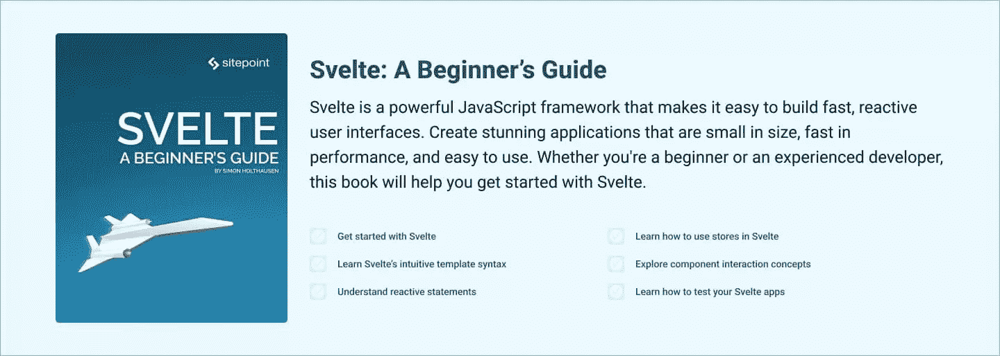
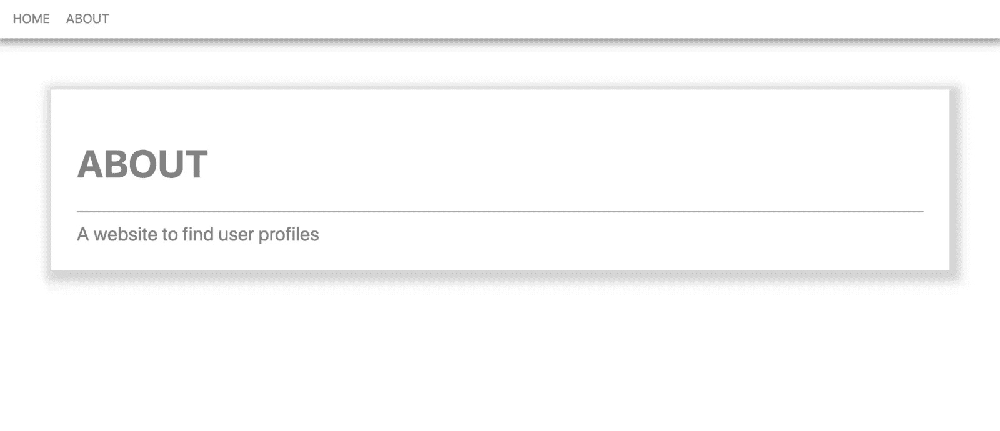
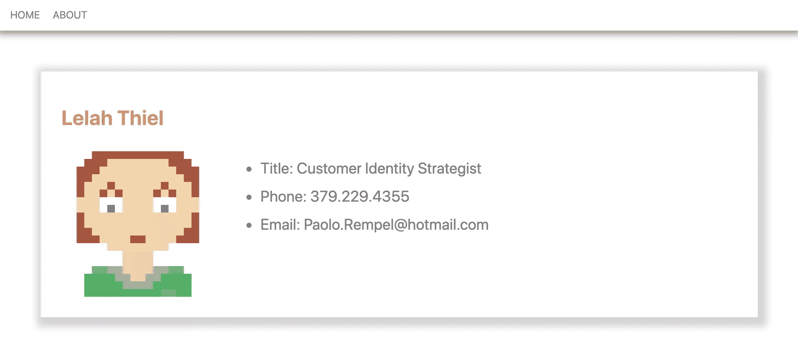
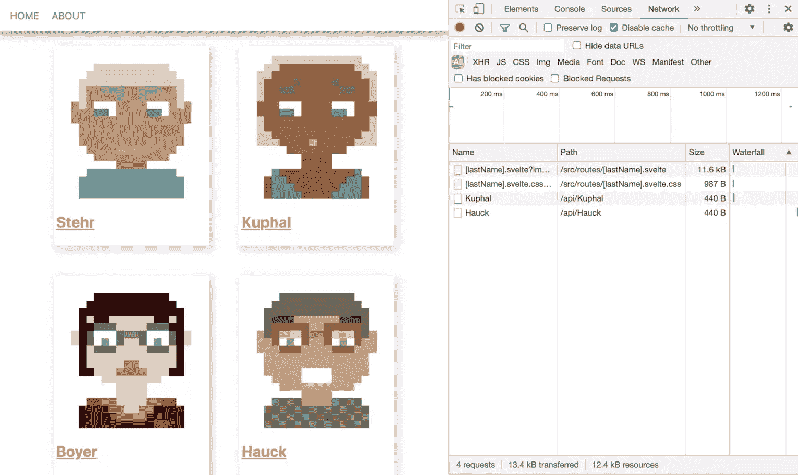

# 苗条套装初学者指南

> 原文：<https://www.sitepoint.com/a-beginners-guide-to-sveltekit/>

SvelteKit 是一个官方支持的框架，围绕 Svelte 构建。它为一个苗条的应用程序增加了关键功能，如路由、布局和服务器端渲染，并使前端开发变得异常简单。

在本教程中，我们将对初学者友好地看看 Svelte 和 SvelteKit，并构建一个简单的 web 应用程序，显示假想用户的个人资料页面。一路上，我们将看看 SvelteKit 提供的所有主要功能。

让我们先来看看 Svelte 带来了什么。

## 和苗条的人一起工作的好处

苗条越来越受欢迎，这是有充分理由的。使用 Svelte 开发应用程序是基于编写可重用和自包含的组件——类似于 React 等其他流行的 JavaScript 框架。

最大的不同在于它的*构建时*编译——而不是代码的*运行时*解释。换句话说，Svelte 已经在*构建*过程中编译了您的代码，最终的包只包含您的应用程序实际需要的 JavaScript。这使得快速的 web 应用程序具有较小的包大小。

其他框架只解析和打包您编写的代码，本质上是将组件树原样发送给客户端。为了让浏览器能够解释它并更新 UI，需要交付更多的代码，并在客户端*完成额外的工作。(你可以在这里阅读React 如何在引擎盖下处理这个过程。)*

除此之外，Svelte 是初学者的理想框架。每个知道如何编写 HTML 以及如何在基本的 JavaScript 和 CSS 中包含`<style>`和`<script>`标签的人都已经可以开始编写苗条的组件了。

[](https://www.sitepoint.com/premium/books/svelte-a-beginner-s-guide/)

## 那么，我为什么需要苗条套装呢？

虽然 Svelte 可以给你一个非常好的开发体验，但是你仍然需要决定如何将你的应用程序交付给用户。经典的方法是使用你最喜欢的模块捆绑器，如 [webpack](https://webpack.js.org/) 或 [Rollup](https://rollupjs.org/guide/en/) ，将你的代码捆绑成一个大而胖的 JavaScript 文件。然后，您可以从一个非常基本的 HTML 文档中调用它，就像这样:

```
<!DOCTYPE html>
<html>
  <head>
    <meta charset="UTF-8" />
    ...
  </head>

  <body>
    <!-- the entry point of your application -->
    <div id="app" />
    <!-- load the JavaScript that takes care of the rest -->
    <script src="dist/bundle.js"></script>
  </body>
</html> 
```

虽然这是绝对合法的，但用户的体验可能并不理想。有许多需要改进的地方，这就是 SvelteKit 发挥作用的地方。

首先，SvelteKit 已经提供了第一个页面视图所需的所有 HTML 元素，而不是向客户端提供一个几乎为空的 HTML 文件。好处是更快的页面加载和 SEO 提升。SvelteKit 有两种方法可以做到这一点:**预渲染**和**服务器端渲染**。我将在下面更详细地解释这两者。不变的是，一旦加载了 JavaScript，它就会接管并启用一个*单页面应用*的典型特性，比如*客户端路由*。

SvelteKit 和传统的单一 JavaScript 包的第二个明显区别是**代码分割**。SvelteKit 不是在一个 Javascript 文件中提供整个应用程序，而是将代码分成单独的小块。每个块代表应用程序的一个路径。例如，`/home`和`/about`路线需要获取的所有内容将在用户真正需要时加载——或者如果您使用 SvelteKit 的*预取*功能(就像我们下面要做的),加载时间会更早一些。

SvelteKit 的另一个突出优点是，您可以决定您的应用程序将在哪个部署环境中运行。现在，前端开发人员有各种不同的平台可以运行应用程序。有简单静态文件的托管提供者，更高级的无服务器选项如 [Netlify](https://www.netlify.com/) ，或者可以执行*节点服务器*的服务器环境，等等。通过名为[适配器](https://kit.svelte.dev/docs#adapters)的小插件，你可以告诉 SvelteKit 为特定平台优化你的输出。这大大方便了 app 部署。

然而，SvelteKit 最大的优势是它的易用性。当然，您可以从零开始手动设置您的*构建*过程，使用所有这些特性，但是这可能是乏味和令人沮丧的。SvelteKit 让你尽可能的轻松，体验的最好方式就是实际使用它。

这就是为什么我们将创建一个简单的 web 应用程序来显示虚构用户的个人资料页面。在这个过程中，我们将更详细地研究我上面提到的所有特性。

## 先决条件

不需要以前的知识，尽管一些苗条的经验可能会有所帮助。文章“[认识 Svelte 3，一个强大的，甚至是激进的 JavaScript 框架](https://www.sitepoint.com/svelte-javascript-framework-introduction/)”提供了一个很好的介绍。

要使用 SvelteKit，您的系统上需要一个 Node 的工作版本。您可以使用节点版本管理器(nvm)安装它。(你可以在这里找到一些设置说明[。)](https://www.sitepoint.com/quick-tip-multiple-versions-node-nvm/)

请注意，SvelteKit(在撰写本文时)仍处于测试阶段，一些功能可能会发生变化。你可以在 [GitHub](https://github.com/sitepoint-editors/svelteKit-example-app) 上找到本教程的所有代码。

## 入门指南

首先，我们启动了一个新的减肥项目。在您的终端中执行以下命令:

```
npm init svelte@next svelteKit-example-app 
```

将会询问您几个问题，以便您可以定制您的项目。出于我们的目的，请回答以下问题:

*   哪个苗条的 app 模板？-> SvelteKit 演示应用程序
*   使用类型脚本组件->否
*   为代码林挺添加 ESLint？->没有
*   为代码格式添加更漂亮的？->没有

这将加载一个 SvelteKit 开发环境，包括一个功能示例应用程序。

在您的项目路径中，现在有一些配置文件:您的`package.json`、`static`文件夹和`src`文件夹。我们将主要在`src`文件夹中工作。它具有以下结构。

```
src
├── app.css
├── app.html
├── global.d.ts
├── hooks.js
├── lib
│   ├── Counter
│   │   └── index.svelte
│   ├── form.js
│   └── Header
│       ├── index.svelte
│       └── svelte-logo.svg
└── routes
    ├── __layout.svelte
    ├── about.svelte
    ├── index.svelte
    └── todos
        ├── _api.js
        ├── index.json.js
        ├── index.svelte
        └── [uid].json.js 
```

`/src/app.html`文件是您的**应用程序外壳**，一个最小的 HTML 页面，您的渲染 HTML 将被插入其中，您的包文件将从该页面链接。通常你不用碰这个文件。如果你愿意，你可以插入一些应用程序范围的 *meta* 标签，但这不是必须的——你马上就会看到。

文件夹是应用程序的核心。此文件夹中的文件定义了您的应用程序的路径。有两种路线:`pages`和`endpoints`。`pages`是细长的组件，由`.svelte`扩展表示。例如，名为`/src/routes/test.svelte`的组件将在路由`/test`下提供服务。`endpoints`是普通的 JavaScript(或 TypeScript)文件，使您能够生成 HTTP 端点来获取数据。

苗条的组件可以有子组件。例如，路由组件`/src/routes/test.svelte`可能导入一个名为`Button.svelte`的组件。存储所有子组件的地方是`/src/lib`文件夹。

让我们看看所有这些是如何工作的。切换到新创建的目录，然后安装依赖项并在开发模式下启动应用程序:

```
cd svelteKit-example-app
npm install
npm run dev -- --open 
```

这将在新的浏览器选项卡中打开先前存在的示例应用程序。点击通过应用程序，并确保自己的工作。

### 一些准备

尽管演示应用程序很完美，但它包含了一堆我们不需要的文件。让我们摆脱那些。

删除`lib`文件夹的内容:

```
rm src/lib/* 
```

删除`routes/todos`文件夹:

```
rm -rf src/routes/todos 
```

我们可以不需要演示应用程序的样式。在项目的根目录中，打开`app.css`并用以下内容替换内容:

```
:root {  font-family: -apple-system, BlinkMacSystemFont, 'Segoe UI', Roboto, Oxygen, Ubuntu, Cantarell, 'Open Sans', 'Helvetica Neue', sans-serif;}
body {  margin: 0;} 
```

最后，打开`src/index.svelte`并用以下内容替换内容:

```
<main>
  <h1>HOME</h1>
</main> 
```

完成后，让我们开始构建我们的演示。

## 布局和客户端路由

正如我上面所写的，routes 文件夹中的每一个纤细的组件都定义了一条路线。然而，有一个例外:*布局*组件，名为 `__layout.svelte`。该组件包含应用于应用程序每个页面的代码。

让我们打开现有的`/src/routes/__layout.svelte`文件。它现在所做的只是导入一些应用程序范围的 CSS 代码。`<slot>`元素包装了应用程序的其余部分。让我们将内容替换为以下内容:

```
<script> import "../app.css"; </script>

<svelte:head>
  <meta name="robots" content="noindex" />
</svelte:head>

<nav>
  <a href=".">HOME</a>
  <a href="/about">ABOUT</a>
</nav>

<slot />

<style> nav {
    padding: 1rem;
    box-shadow: -1px 1px 11px 4px #898989;
  }
  a {
    text-decoration: none;
    color: gray;
    margin-right: 1rem;
  } </style> 
```

注意:如果你想让苗条的文件语法高亮，你可以安装一些扩展。[这个](https://marketplace.visualstudio.com/items?itemName=svelte.svelte-vscode)对 VS 代码有好处。

在这个例子中，我们使用了`<svelte:head>`元素来定义将被插入到文档的`<head>`中的元标签。因为我们在*布局*组件中做了这个，它将被应用到整个应用程序。*机器人*标签只是一个例子。

此外，我们创建了一个导航栏。这是*布局*组件的典型用例，因为它通常会显示在应用程序的每个页面上。

导航栏有两个链接:一个链接到应用程序的根目录——它已经有了由`/src/routes/index.svelte`组件提供的内容——另一个链接到关于页面的*。关于*的*页面也是由演示应用创建的。打开它并用以下内容替换其内容:*

```
<main>
  <h1>ABOUT</h1>
  <hr />
  <div>A website to find user profiles</div>
</main>

<style> main {
    font-size: 1.5rem;
    margin: 4rem;
    padding: 2rem;
    color: gray;
    justify-content: center;
    box-shadow: 4px 5px 11px 10px lightgray;
  } </style> 
```

这个页面非常简单。我们包含了一些 HTML 并应用了一些样式。

让我们返回浏览器，导航到新页面。我们的修改应该已经可以看到了，您应该会看到类似这样的内容:



让我们在*登陆*页面和*关于*页面之间导航。您可能会意识到更改页面并不会刷新整个应用程序。导航感觉流畅，即时。这是因为 SvelteKit 开箱即用地应用了客户端路由**。虽然我们在 navbar 中使用了普通的`<a>`标签，但 SvelteKit 将这些标签识别为内部链接，并使用其内置的客户端路由器拦截它们。**

## 静态页面和预呈现

正如我上面描述的，SvelteKit 使用了**适配器**的概念来为不同的环境构建应用程序。适配器被导入到`svelte.config.cjs`文件中。

当您打开这个配置文件时，您可以看到我们的应用程序当前使用的是*节点*适配器。这将优化节点环境的构建输出，默认情况下，我们应用程序的每个页面都将根据请求由*节点*服务器呈现。然而，考虑到我们应用程序的当前状态，这似乎有点太多了。此外，您可能不希望为您的应用程序运行服务器。

由于我们的应用程序目前不依赖于任何动态数据，它可能完全由静态文件组成。你可以安装一个`adapter-static`，它可以把 SvelteKit 变成一个**静态站点生成器**。在构建过程中，它会将整个应用程序呈现为一组静态文件。然而，这将阻止我们创建依赖于服务器端呈现的额外页面。

由于我们不想把所有的页面都变成静态文件，我们将使用另一个 SvelteKit 特性，它使我们能够预先呈现应用程序的单个文件。在我们的例子中，我们希望预先呈现关于页面的*,因为它由静态内容组成，在每个请求上呈现页面是不必要的。我们可以通过在我们的`/src/routes/about.svelte`页面顶部添加以下代码片段来实现这一点:*

```
<script context="module"> export const prerender = true; </script> 
```

我们可以通过运行`npm run build`进行测试。这将在`/build`文件夹中生成一个功能正常的*节点服务器*。如您所见，有一个 HTML 文件`/build/prerendered/about/index.html`，其中包含为关于页面的*预先呈现的 HTML。我们的登录页面没有 HTML 文件，因为它将根据请求由*节点*服务器呈现。*

可以用`node build/index.js`运行生成的*节点*服务器。

## 端点

现在是时候用一些动态内容填充我们的页面了。我们将调整登录页面，使其显示用户头像列表。为此，我们需要从 API 端点获取用户信息列表。大多数开发团队都有独立的后端。那应该是去的地方。然而，SvelteKit 使用**端点**页面使你的应用程序*满栈*变得容易。由于我们没有后端，我们将创建这样一个页面。

我们将生成一些模拟用户数据，而不是使用真实的数据库。为此，我们将使用库 [faker](https://github.com/Marak/Faker.js) 。用`npm install -D faker`来装吧。

现在，在新的`/api`文件夹中创建一个文件`/src/routes/api/index.js`。由于文件没有`.svelte`扩展名，它将被视为一个*端点*。语法`/api/index.js`与`api.js`相同。端点将在`/api`下变为可用。插入以下代码:

```
import faker from "faker";

const generateUsers = () =>
  [...Array(50)].map(() => {
    const lastName = faker.name.lastName();
    return {
      avatar: `https://avatars.dicebear.com/api/human/${lastName}.svg`,
      lastName,
    };
  });

export async function get() {
  return {
    body: generateUsers(),
  };
} 
```

该文件导出一个函数`get`。您可能已经猜到了，它对应于 HTTP 方法`GET`。它所做的只是返回一个属性为`body`的对象，该对象包含一个用`generateUsers`创建的用户数据数组。

函数`generateUsers`返回 50 个对象的数组，这些对象具有属性`lastName`和`avatar`。`lastName`使用`faker`生成。`avatar`存储一个指向免费的 [DiceBear Avatar](https://avatars.dicebear.com/) API 的 URL。它使用种子值生成随机头像，在我们的例子中是`lastName`。

如果我们有一个真实的数据库，我们可以用类似于`findUsers`的东西替换`generateUsers`，并在这个函数中访问数据库。

这就是它所需要的。回到浏览器(确保你的应用仍然在开发模式下运行`npm run dev`)并导航到[http://localhost:3000/API](http://localhost:3000/api)。这将加载原始数据。请注意，只有当您没有单独的后端 API 来获取数据时，才需要像我们这样创建端点。

## 用`load`函数提取数据

接下来，我们将使用新的端点在登录页面上显示用户数据。打开现有的`/src/routes/index.svelte`页面，将其内容替换为以下内容:

```
<script context="module"> export async function load({ fetch }) {
    const res = await fetch('/api');

  if (res.ok) return { props: { users: await res.json() } };
  return {
    status: res.status,
    error: new Error()
   };
  } </script>

<script> export let users; </script>

<main>
  {#each users as { avatar, lastName }}
  <a href={`/${lastName}`} class="box">
    
    <h2>{lastName}</h2>
  </a>
  {/each}
</main>

<style> main {
  display: flex;
  flex-wrap: wrap;
  justify-content: center;
  }
  .box {
  padding: 0.25rem;
  margin: 1.5rem;
  color: salmon;
  box-shadow: 4px 5px 11px 2px lightgray;
  }
  .box:hover {
  box-shadow: 4px 5px 11px 10px lightgray;
  }
  img {
  width: 15rem;
  object-fit: contain;
  } </style> 
```

为页面上的动态内容获取数据的关键挑战是用户有两种方式可以导航到它。第一种方式是从外部来源或在页面刷新后。这将导致应用程序从零开始加载，页面由服务器提供服务。第二种方式来自内部导航，在这种情况下，页面将由客户端的 JavaScript 包提供服务。在前者中，数据由服务器获取，而在后者中，数据由客户端获取。

SvelteKit 为此提供了一个非常优雅的解决方案——`load`函数。`load`函数既可以在客户端运行，也可以在服务器端运行，并且在这两种情况下都会在组件呈现之前执行。这就是为什么我们必须把它放在一个有`context="module"`的`<script>`元素中。

`load`接收一个属性为`fetch`的对象，我们可以用它来获取数据。它的行为与本机`fetch` API 完全相同。在这个例子中，我们使用新的端点`/api`来获取用户对象的数组。为了将这些数据传递给我们的组件，我们返回一个带有`props`属性的对象，它存储了我们的用户数组。

如果您有一个单独的后端 API，您将从后端的`load`函数中获取数据，而不是从我们的`/api`端点获取数据。

如果`load`在服务器上运行，客户端将意识到数据已经被获取，并且不会发出额外的请求。

因为我们返回了一个`props`对象，所以我们的组件可以以正常的简单方式访问这些道具——在一个`<script>`标签内有`export let`。这就是我们接触用户的方式。

接下来，我们使用 Svelte 中的`each`语法来可视化我们所有的 50 个用户。在`each`块中，我们可以访问用户的`avatar`和`lastName`属性。我们使用`avatar`作为``标签的`src`属性的值。

现在，您的登录页面应该如下所示:


## 动态参数

我们登录页面上的每个用户框都是与 route `/[lastName]`的内部链接。这就是*动态参数*发挥作用的地方。在 route `/[lastName]`下，我们将显示各个用户的附加信息。要做到这一点，我们首先必须用一个额外的端点来扩展我们的 API，以获取单个用户数据。

用以下内容创建一个新文件`/src/routes/api/[lastName].js`:

```
import faker from "faker";

export async function get({ params }) {
  const { lastName } = params;
  return {
    body: {
      lastName,
      firstName: faker.name.firstName(),
      avatar: `https://avatars.dicebear.com/api/human/${lastName}.svg`,
      title: faker.name.title(),
      phone: faker.phone.phoneNumber(),
      email: faker.internet.email(),
    },
  };
} 
```

注意文件名中的动态参数`[lastName]`。我们可以从`get`函数的`params`属性中访问这个参数。我们用它来返回`body`对象中`lastName`和`avatar`的正确值。接下来，我们用`faker`为这个用户生成一些额外的模拟数据，我们也在`body`对象中返回这些数据。

我们可以用一个任意的`lastName`值来测试这个*端点*。打开浏览器，导航到[http://localhost:3000/API/Spiderman](http://localhost:3000/api/Spiderman)。这将为任意用户加载值为`lastName`的原始数据。

接下来，我们创建一个新页面— `/src/routes/[lastName].svelte` —包含以下内容:

```
<script context="module"> export async function load({ fetch, page }) {
    const { lastName } = page.params;
    const res = await fetch(`/api/${lastName}`);

    if (res.ok) return { props: { user: await res.json() } };
    return {
      status: res.status,
      error: new Error(),
    };
  } </script>

<script> export let user; </script>

<main>
  <h1>{user.firstName} {user.lastName}</h1>
  <div class="box">
    
    <ul>
      <li>Title: {user.title}</li>
      <li>Phone: {user.phone}</li>
      <li>Email: {user.email}</li>
    </ul>
  </div>
</main>

<style> main {
    margin: 4rem;
    padding: 2rem;
    color: gray;
    justify-content: center;
    box-shadow: 4px 5px 11px 10px lightgray;
  }
  h1 {
    color: salmon;
  }
  .box {
    display: flex;
    font-size: 1.5rem;
  }
  img {
    width: 15rem;
    object-fit: contain;
    margin-right: 2rem;
  }
  li {
    margin-bottom: 1rem;
  } </style> 
```

再次注意文件名中的*动态参数* `[lastName]`。我们可以使用`load`函数接收的`page`属性来访问它。

同样，我们使用`fetch`来访问我们的新端点`/api/[lastName]`，并将用户数据作为属性`user`传递给瘦组件。我们用`export let user`访问这个属性，并用一些基本的简单语法可视化数据。

现在，您应该能够导航回登录页面，并单击任何用户框。这将打开相应的用户页面。您应该会看到类似这样的内容:



## 预取

我还想展示最后一个特性，我对此非常兴奋。SvelteKit 提供了为单个页面预取数据的可能性。

让我们回到我们的`/src/routes/index.svelte`页面，将属性`sveltekit:prefetch`添加到`<a>`标签中。像这样:

```
<a sveltekit:prefetch href={`/${lastName}`} class="box"> 
```

这告诉 SvelteKit 在悬停`<a>`元素时执行相应页面的`load`功能。

在浏览器中打开“网络”选项卡，尝试一下(见下文)。每当您将鼠标悬停在一个用户框上时，就会向`/api/[lastName]`发出一个请求，并获取相应用户页面的数据。这节省了额外的毫秒数，并确保了更好的用户体验。



顺便说一下，这也是了解 SvelteKit 如何开箱即用地应用**代码拆分**的好方法。重新加载页面并清除网络日志。请注意，当你第一次将鼠标悬停在一个头像上时，会加载一个 JavaScript 和一个 CSS 文件。这是对应于我们的`/src/routes/[lastName].svelte`页面的代码块。它在每个*页面会话*中只被加载一次。如果您将鼠标悬停在另一个头像上，只会加载相应的数据，而不会再次加载 JavaScript 和 CSS。

您不必一定要将预取属性应用于`<a>`标签。如果您愿意，您可以使用 SvelteKit 的 [*$app/navigation*](https://kit.svelte.dev/docs#modules-app-navigation) 模块的`prefetch`功能以编程方式进行预取。

## 结论

使用 SvelteKit 感觉非常直观。总之，我只花了大约一个小时就学会了所有的主要功能，结果绝对令人惊讶。你会得到超快的、经过 SEO 优化的 web 应用程序，为你提供现代构建工具可能提供的最佳用户体验。

默认情况下，SvelteKit 在服务器上呈现您的页面。在客户端，它通过一个高度优化的 JavaScript 包逐渐得到增强，以支持*客户端路由*。通过几行代码，您可以预呈现单个页面或预取数据，以实现即时页面加载和导航。像代码分割这样的特性确保了 Svelte 的小编译输出的优势不会被大的应用范围的捆绑包削弱。

最后但并非最不重要的是，SvelteKit 在所有特性方面给你完全的自由。如果您愿意，总有办法排除某个特性。

SvelteKit 和 Svelte 本身对我来说是一个真正的游戏改变者。我相信对许多其他人来说也是如此。

## 分享这篇文章