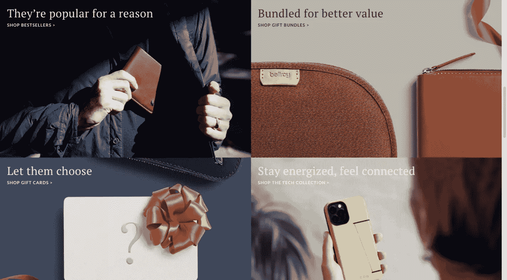
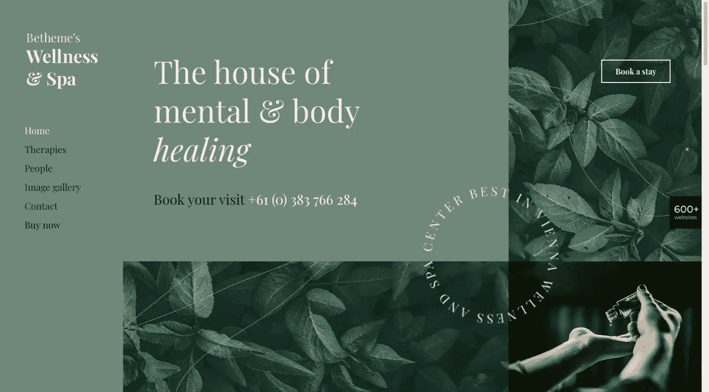
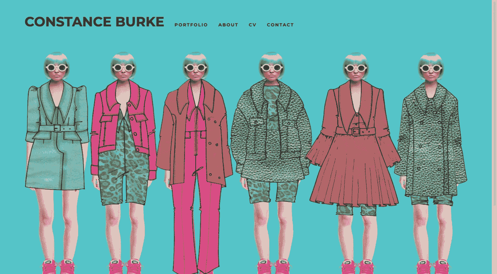
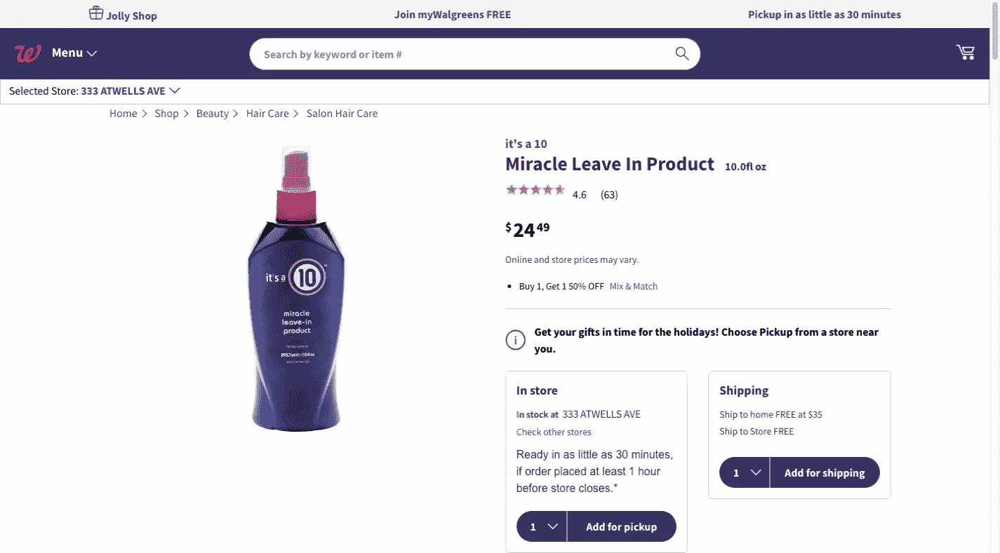
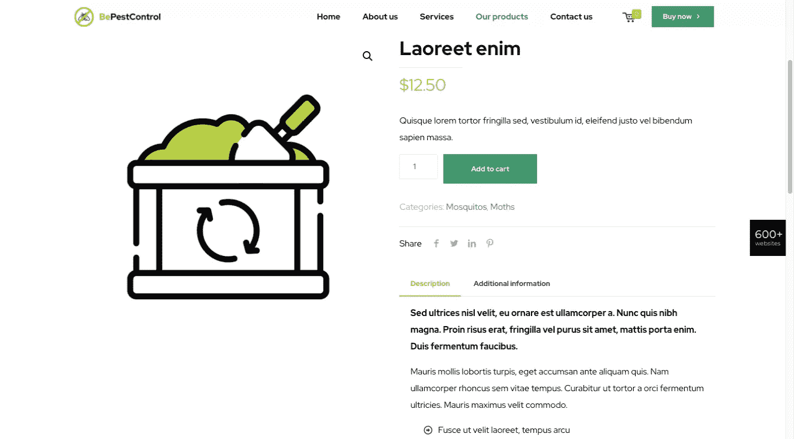
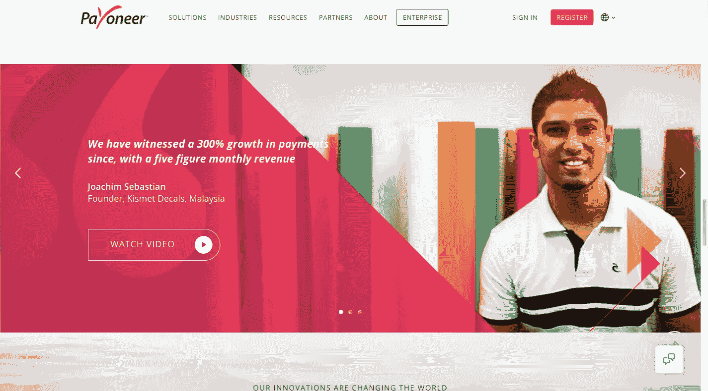
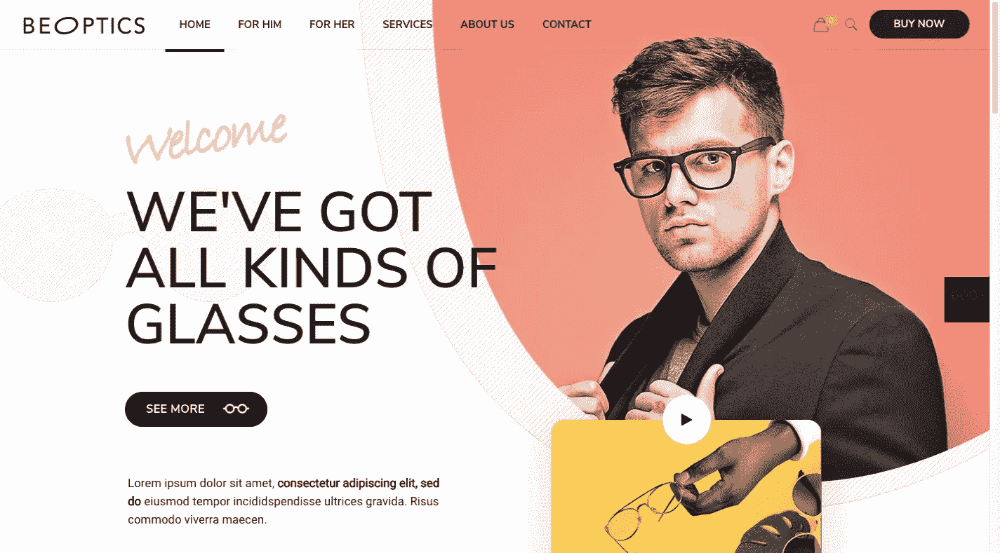
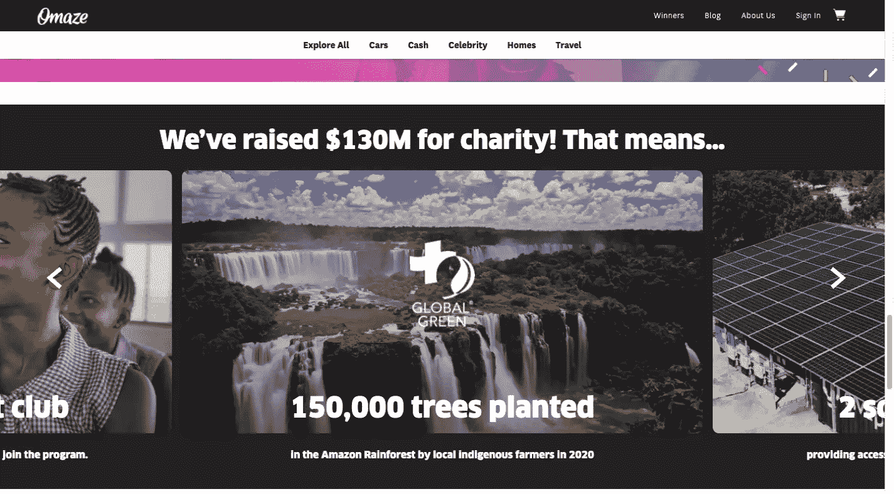
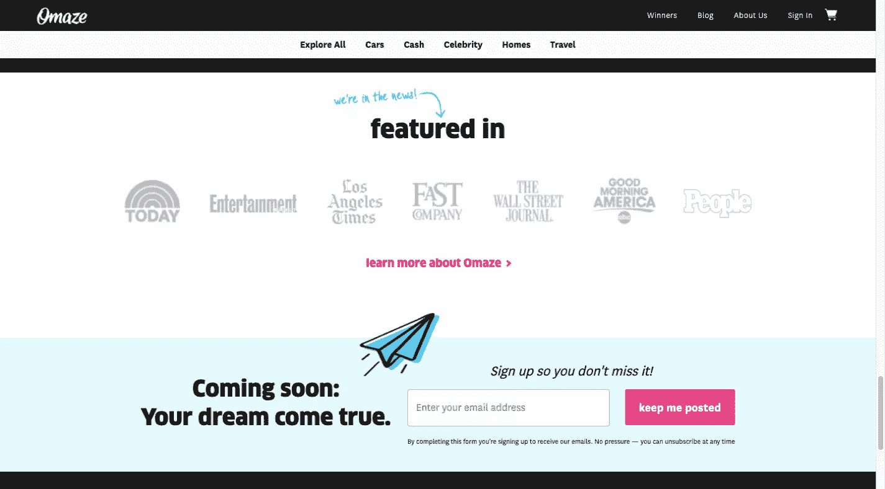
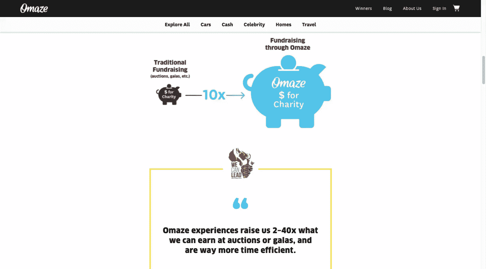

# 2021 年的 5 个网页设计趋势

> 原文：<https://www.sitepoint.com/web-design-trends/>

*这篇赞助文章由我们的内容合作伙伴 [BAW 媒体](https://bawmedia.com)创作。感谢您对使 SitePoint 成为可能的合作伙伴的支持。*

对几乎所有人来说，2020 年是个糟糕的一年。许多企业被迫采取创新措施以求生存。消费者也不得不做出调整，甚至网络也不得不做出一些改变。

一些“过去的”设计趋势也必须为新的趋势让路。

那么，我们可以期待在 2021 年看到什么样的新设计趋势呢？

我们将向您展示一些整合了这些新趋势的网站示例，以及一组精选的 [BeTheme 预建网站](https://themes.muffingroup.com/?utm_source=sitepoint.com&utm_medium=content&utm_campaign=jan21)，这些网站也很好地利用了这些趋势。

无论你是为新客户创建网站，还是改造现有网站以适应最新趋势，以下五种设计方法应该会给你一些有价值的见解。

## 1.使用舒缓、放心的调色板

最近的设计趋势偏爱强烈、大胆的颜色。各种梯度方案也是既受欢迎又有效的。为什么？因为这些与众不同的趋势很容易吸引游客的注意力。

2020 年给了我们太多的担忧、压力和戏剧性。我们热切地期待回到一个让我们再次对周围环境感到更加舒适的时代。

就此而言，我们不希望人们对我们大喊大叫，也不希望网站对我们大喊大叫。因此，改变到更平静，更柔和的调色板。

Bellroy 网站为这种低调的外观提供了一个很好的例子，平静的配色方案正好符合其有用的日常产品系列。

请注意，当一个色彩明亮的产品放在自然的调色板上时，它仍然会很突出，但不会出现在你的脸上。

[BeSpa](https://themes.muffingroup.com/be/spa6/?utm_source=sitepoint.com&utm_medium=content&utm_campaign=jan21)预建网站，以其舒缓的配色方案，是传递平静和鼓舞人心的信息的另一个例子。

平静舒适不需要无聊。远非如此。像这样的图片鼓励游客活在当下，以及随之而来的安全感。

## 2.努力创造性地融合物理体验和数字图像

2020 年，许多人有生以来第一次发现自己被困在家里，除了看屏幕几乎无事可做——这在某些情况下涉及远程工作，在其他情况下则是玩数字游戏。

一些网页设计者通过将真实世界的图像与插图和/或特殊效果混合在一起，发现了这一点。

一个恰当的例子可以在设计师康斯坦斯·伯克的网站上看到。

她的作品集没有展示手绘的时尚草图，也没有展示穿着真实产品的真实模特，而是创造性地将两者融合在一起。

BeSki 预制场地也融合了数字和物理，但方式完全不同。

<video class="wp-video-shortcode" id="video-181019-1" width="900" height="492" preload="metadata" controls=""><source type="video/mp4" src="https://uploads.sitepoint.com/wp-content/uploads/2021/02/1612661749beski.mp4?_=1">[https://uploads.sitepoint.com/wp-content/uploads/2021/02/1612661749beski.mp4](https://uploads.sitepoint.com/wp-content/uploads/2021/02/1612661749beski.mp4)</video>

主页以滑雪者的物理图像开始。请注意英雄部分的雪是如何与下一部分融合在一起的，下一部分是由数字图像组成的。然后，该部分融合到另一个真实的图像中，再融合到数字设计中。

## 3.创造更加高效和有效的购物体验

2020 年，更多的人会在网上购物——通常是出于必要。这创造了一个鼓励网站设计者为访问者提供更有效的转化途径的环境。

由于这些访问者中的许多人都刚刚熟悉网上购物，所以他们的体验尽可能轻松非常重要——他们可以像在实体店一样快速地进出。

这可以通过更简洁的产品描述、改进的产品搜索功能、添加到购物车的快捷方式等等来实现。

沃尔格林的产品页面设计为 2021 年的电子商务网站设计树立了典范。

产品的适用细节以及提货和运输选项、客户评级、折扣或特别优惠都清楚地呈现在页面上方。客户可以滚动查看其他相关信息，也可以采取下一步行动。

[BePestControl 的](https://themes.muffingroup.com/be/pestcontrol/?utm_source=sitepoint.com&utm_medium=content&utm_campaign=jan21)预制场地也采取了类似的方法。

相关信息保持简洁明了。客户可以将商品添加到购物车中，也可以阅读按钮下方的附加信息。

精心设计的导航工具和产品描述选项相结合，使购物体验令人满意。

## 4.更加强调用户控制的视频内容

曾几何时，视频是网站上的“东西”。虽然不再新鲜，视频仍然是提供非常有用的内容的有效方法，但它的受欢迎程度受到了打击。

原因？太多网站缺乏用户控制。视频是好的，但是只有当访问者觉得有必要看的时候。

部分由于 2020 年的 Zoom connecting friends，更多的人已经习惯了视频可以提供的东西。如果让他们选择看什么，不看什么，你可以期待视频在 2021 年卷土重来——没有自动播放或嵌入式版本。

看看 [Payoneer](https://www.payoneer.com/) 如何在他们的设计中加入了一个*观看视频*按钮。

不算大，也不算大胆，但你不会错过白色按钮在较暗背景的衬托下显得很突出的样子。如你所料，访问者会喜欢选择观看或不观看推荐。

[BeOptics](https://themes.muffingroup.com/be/optics/?utm_source=sitepoint.com&utm_medium=content&utm_campaign=jan21) 预建网站采取了类似的方法。

在这种情况下， *Play* 按钮充当了访问其他网站或产品信息的网关。悬停时按钮变换的方式让访问者意识到他们有机会通过观看视频了解更多信息。

## 5.花更多时间展示信任建立者

信任建设者是不可或缺的网站元素。实体店购物者可能需要几分钟来评估一家企业，并决定是否要光顾它。网上购物者会在更短的时间内做同样的事情。

网页设计者可以从多种建立信任的方法中进行选择。例如:

*   使用图表、统计标注、计数器或其他数据可视化方法
*   使用标志帮助巩固品牌
*   提供客户证明、客户评论或用户评级
*   个案研究
*   文件夹
*   安全标志——如商业改善局(BBB)或 TRUSTe
*   安全结账和支付—如 PayPal 结账
*   社区服务或社会公益的证明

考虑以上哪一个最能说服访问者成为有价值的顾客。或者，选择以上所有选项(尽管可能不适合单页网站)。

Omaze 采取的方法是，当访问者捐款时，他们就有机会赢得奖品。这个网站更进了一步，突出了它的捐赠者帮助它完成的好事。

它还为突出介绍 Omaze 的著名出版物留出了空间。这有助于增加本组织的合法性。

它还使用数据可视化和证明来提供建立信任透明度的元素，以了解捐款是如何处理和使用的。

无论你为哪个组织或企业设计网站，总会有空间给一个或多个令人印象深刻的信任建立者。

[BePortfolio](https://themes.muffingroup.com/be/portfolio2/?utm_source=sitepoint.com&utm_medium=content&utm_campaign=jan21) 展示了这如何应用于投资组合网站。

<video class="wp-video-shortcode" id="video-181019-2" width="908" height="492" preload="metadata" controls=""><source type="video/mp4" src="https://uploads.sitepoint.com/wp-content/uploads/2021/02/1612662974beportfolio.mp4?_=2">[https://uploads.sitepoint.com/wp-content/uploads/2021/02/1612662974beportfolio.mp4](https://uploads.sitepoint.com/wp-content/uploads/2021/02/1612662974beportfolio.mp4)</video>

主页为前面提到的几个信任建立者提供了很多空间:

*   满意客户的数量
*   客户评价
*   个案研究
*   作品集的样本
*   令人印象深刻的客户标识展示

这只是给人们足够的理由去信任你的品牌。

## 你接受了这些新的网页设计趋势了吗？

辞旧迎新？不完全是。一些趋势可能永远不会过时——比如极简主义和醒目的标题印刷。但是 2020 年改变了我们看待一些事物的方式，因此，一些设计趋势需要被抛弃，代之以其他趋势，以适应新常态。

无论你是想更新和升级现有的网站，还是在你的新网站设计中实现这些新趋势， [BeTheme 的 600 多个预建网站](https://themes.muffingroup.com/be/splash/?utm_source=sitepoint.com&utm_medium=content&utm_campaign=jan21)将引导你走向正确的方向。

## 分享这篇文章