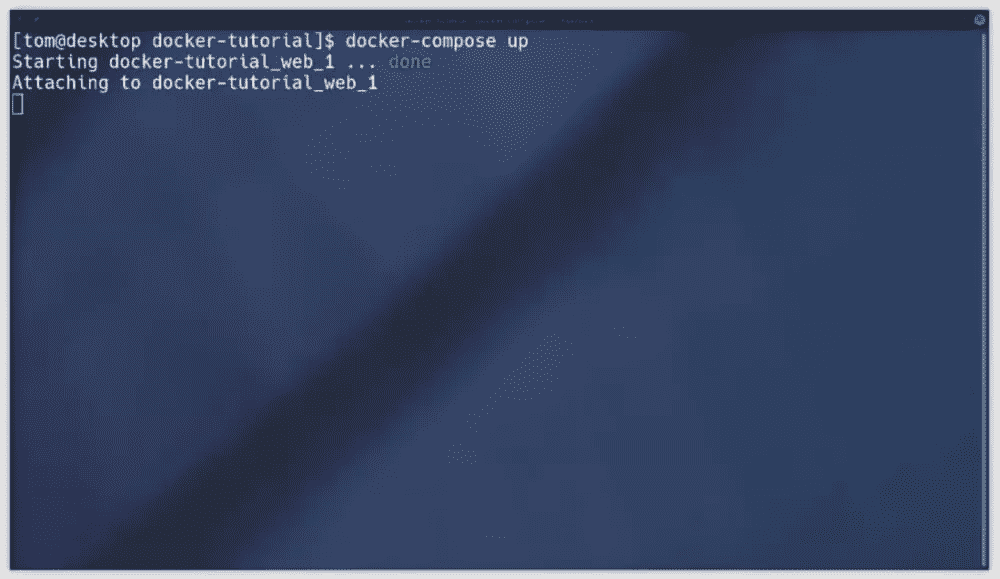
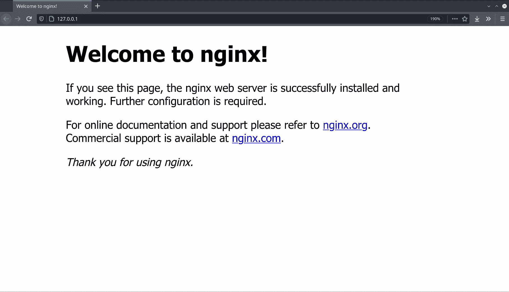
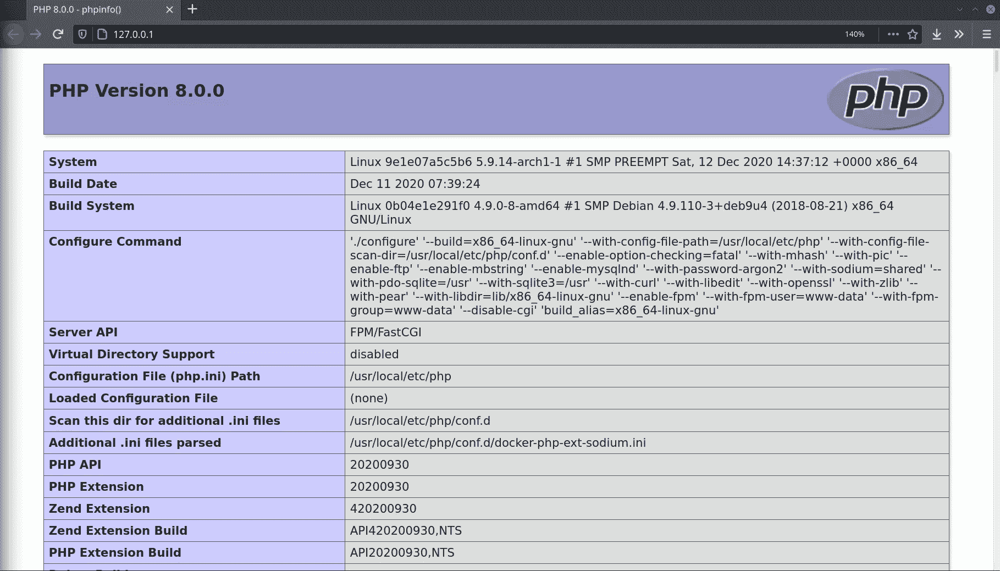

# 用 Docker 建立现代 PHP 开发环境

> 原文：<https://www.sitepoint.com/docker-php-development-environment/>

在本教程中，我将展示如何最好地开始设置一个 PHP 开发环境，带你了解如何设置 Docker。设置 PHP 开发环境的方法有很多，但使用 Docker 是当前的最佳实践。

我将从这些年来人们如何建立他们的 PHP 开发环境的简史开始，引出我们现在的位置。但是如果你想跳过所有这些，只让你的服务器运行，[你可以直接跳到配置步骤](#tldr)。

[](https://www.sitepoint.com/premium/books/php-mysql-novice-to-ninja-7th-edition/)

## 一点背景

web 开发的一个问题是事物变化很快。CSS 最佳实践会随着新属性的加入而改变。(没有 [CSS 网格](https://www.sitepoint.com/introducing-the-css-grid-layout/)，我们是如何应对的？)PHP 现在已经到了第 8 版，甚至我们用来执行 PHP 脚本的工具也在随着时间的推移而不断完善。结果，很多教程很快就过时了。

直到几年前，我让我教的每一个人去看布鲁诺·什科沃茨的精彩文章[重新介绍流浪者:开始使用 PHP 的正确方法](https://www.sitepoint.com/re-introducing-vagrant-right-way-start-php/)。在当时，这是对建立本地开发环境的(当时)最佳方法的一个极好的介绍。

那篇文章只是从 2015 年开始的，但是在不断变化的 web 开发时间表中，五六年是一个 eon。自那以后,“正确的道路”已经向前迈进了相当大的一步。

我将快速回顾一下这些年来情况是如何变化的。

### 1.手动安装 PHP、MySQL 和 Apache

如果你像我一样，在 90 年代就已经足够老了，你会记得那段经历是多么令人沮丧。那时候，如果你是少数不仅仅在实时 web 服务器上开发的人(是的，我们真的这么做了，是的，这是一个可怕的想法)，你会在你的开发机器上手动安装 Apache、PHP 和 MySQL。

建立开发环境需要大量的专业知识。你需要知道如何配置 web 服务器，如何配置 PHP，并且你必须经历手动安装和配置你使用的所有软件的过程。对于开发新手来说，这本身就是一项耗时且令人生畏的任务。

### 2.预配置的软件包，如 XAMPP

到 2000 年代早期到中期，人们已经开始将所有需要的软件放在一个软件包中，该软件包可以安装和配置你需要的所有软件。这些软件包就像 XAMPP 和 WAMP，只要点击一下按钮，它们就能给你一个可用的开发环境。

如果你逛逛各种 PHP facebook 群组，你会发现很大一部分新开发人员仍然遵循这个时代的教程，而大量现有开发人员从未继续前进，所以 XAMPP 仍然被广泛使用。如果这描述了你，是时候继续前进了。

使用 XAMPP 使得在你的机器上建立并运行一个 web 开发环境变得非常容易。Bruno 的文章概述了这种方法的问题，但是当你想把你的网站放到网上时，主要的问题就来了。PHP、MySQL 和 Apache(或 NGINX)的版本可能与您作为 XAMPP 软件包的一部分安装的版本不同。此外，Windows 和 Linux 之间还有一些微小但令人沮丧的差异。如果你在一台 Windows 机器上开发你的网站，并把它上传到一台 Linux 服务器上，一旦上传，你的一些代码可能根本不能工作。

### 3.虚拟机和流浪者

在 2000 年代末和 2010 年代初，开发人员的趋势是转向虚拟机。这个想法是，你可以运行一个真正的网络服务器的操作系统的副本，并安装上所有的程序——与你最终要部署你的网站的实际网络服务器完全相同的配置和设置。这样，当你使网站运行时，它就不可能不工作。

虽然许多程序员看到了这种环境的好处，但设置这种环境所需的难度和时间意味着很少有人看到。那是在 vagger(以及像 Puphpet 这样的相关工具)出现并解决了所有这些问题之前。

请看一下我之前链接的文章，这篇文章很好地描述了虚拟机和以这种方式建立开发环境的好处。

### 4.码头工人

所有这些背景把我们带到了今天，也是这篇文章的原因。如果流浪汉这么伟大，为什么要用别的东西来代替？

使用 vagger 建立虚拟环境的主要好处是:

1.  您的开发 PC 并不局限于特定的环境。您可以托管多个网站:一个使用 Apache，一个使用 NGINX，一个使用 PHP 7，一个使用 PHP 8。

2.  当网站上线时，网站被上传到与开发时完全相同的环境中。

很容易理解为什么开发者想要这样。采用 Docker 的下一个步骤保留了这些优点，同时避免了一些流浪/虚拟机环境的缺点。

#### 流浪有什么不好？

尽管有这些好处，基于流浪者的开发环境引入了它自己的一系列限制和问题。

1.  系统资源。流浪者需要运行一个完全不同的操作系统。您需要下载并安装运行在您的 web 服务器上的操作系统，以及它已经安装的所有软件包。这将占用大量的磁盘空间和内存。虚拟机通常至少需要 512 MB 内存。这对今天的电脑来说并不算多，但它很快就会增加。如果您想在 PHP 7 和 PHP 8 上分别托管一个网站，您需要在您的计算机上安装和配置两个不同的虚拟机实例。

2.  您必须确保虚拟机和服务器同步。每当您更新服务器或更改服务器的配置时，您必须记住用相同的更改来更新您的本地开发环境。

3.  它将您紧紧锁定在服务器操作系统和配置中。将网站从一台服务器转移到另一台服务器是一项艰巨的任务。一个网站不仅仅是由 PHP 脚本、图片和 CSS 组成的。特定的服务器配置(如安装的 PHP 扩展和`nginx.conf` / `httpd.conf`)也是网站正常运行所必需的。

4.  可供选择的软件包非常有限。根据您的 web 服务器运行的 Linux 发行版，您可能无法选择运行哪个版本的 PHP。除非你从第三方仓库安装软件包，否则你将无法使用最新最好的 PHP 版本。在撰写本文时，PHP 8 最近已经推出。如果你使用的是 CentOS 8/RHEL 8，你会一直使用 PHP 7.3，直到你得到一个新版本的操作系统。如果你用的是 Debian，最新的版本是 7.3。其他发行版将提供不同的版本。

5.  服务器配置是全局的。PHP 有一个名为`php.ini`的设置文件。更改此项会将更新的配置应用到服务器上托管的每个网站。NGINX 的`nginx.conf`或 Apache 的`httpd.conf`也是如此。MySQL 数据库实例拥有服务器上托管的所有站点的数据库。进行任何大规模的数据库配置更改都会影响深远。更新一个 MySQL 设置会影响到所有使用该 MySQL 服务器的网站！

6.  软件包版本在真实服务器上是全局的。虽然在同一个 web 服务器上运行多个 PHP 版本*是可能的*，但是这很难配置，并且根据您的脚本正在做的事情，可能会有奇怪的副作用(例如，当您有一个想要在 systemd unit/cronjob 中运行的脚本，却忘记了应该使用`/bin/php72`而不是`/bin/php`)。

尽管第 5 点和第 6 点可以在开发机器上通过运行不同的流浪者虚拟机来克服，但是你需要一个真实的 web 服务器来镜像你正在运行的每一个配置，这样当你上传它们的时候网站就可以工作了。

### 介绍 Docker

Docker 解决了上面列出的所有问题。但是 Docker 是什么以及它是如何工作的呢？

让我们从维基百科的介绍开始:

> Docker 是一组平台即服务(PaaS)产品，使用操作系统级虚拟化来交付称为容器的软件包中的软件。容器是相互隔离的，捆绑了它们自己的软件、库和配置文件；他们可以通过明确定义的渠道相互交流。

在变得过于技术化之前，对我们作为 web 开发人员的实际好处是 Docker 允许我们打包网站需要的所有东西，所有的 PHP 代码以及 PHP 可执行文件、MySQL 服务器和 NGINX 服务器，以及这些程序使用的配置文件。

网站的所有代码，以及运行这些代码所需的程序的确切版本，都打包在一起，有效地作为一个单一的应用程序。整个应用程序可以在任何操作系统上运行。当有人运行打包好的应用程序时，PHP、MySQL、NGINX 以及你写的所有 PHP 文件都是嵌入在应用程序本身的。更好的是，确切的 MySQL、NGINX 和 PHP 版本是软件包的一部分。当您运行该应用程序时，会下载并安装该应用程序所开发的这些工具的确切版本。

“这不正是虚拟机已经在做的吗？”我听到你问了。是的，但是在流浪者和 Docker 处理软件安装的方式上有很大的不同。

有了游民，运行一个虚拟机，从真正的 web 服务器上克隆出一个特定 PHP 版本、MySQL 版本和(通常)服务器配置的完整操作系统。当服务器更新时，虚拟机也必须更新。

然而，当使用 Docker 时，PHP/MySQL/NGINX 版本是作为一个名为*映像*的包提供的，服务器可以运行任意多的不同映像。

这里的好处是 web 服务器和您的开发机器都运行完全相同的映像。你只需把你的图片上传到网络服务器，运行整个应用程序，你的网站就建立起来了，根本不需要任何网络服务器的配置。

此外，每个映像都完全独立于服务器上的其他映像。每个图像(在这个简化的例子中，每个网站一个)是彼此独立的。每个网站都有自己的 NGINX 配置，自己的`php.ini`和自己安装的 PHP 和 MySQL。每个网站可以运行完全不同的 PHP 版本。你甚至可以在同一台机器上同时运行 Apache 上的一个网站和 NGINX 上的一个网站。即使你运行两个不同的 NGINX 网站，你也会有两个不同的 NGINX 进程，它们有自己的配置，同时运行。

这样做的内存开销很小，但是它所赋予的灵活性使得这是一个非常值得的权衡:

1.  整个网站，所需的 PHP/MySQL 版本，所有的配置和所有的代码都可以轻松地移动。将网站移动到新的服务器只需要复制一个文件夹。您不需要对新服务器上的 PHP 或 NGINX 配置进行任何更改。你甚至不需要在服务器上安装 PHP 或者 NGINX。当你启动应用程序时，它们会被 Docker 自动安装。

2.  您可以在您的开发机器上运行*完全相同的图像*。使用 vagger，您可以有效地在同一台机器上运行服务器配置/安装包的*副本*。使用 Docker，在您的 PC 上运行的开发映像与在服务器上运行的完全相同。

3.  `php.ini`调整，`nginx.conf`配置更改或更新 PHP 到最新版本的处理方式与上传更新的 PHP 代码到服务器的方式相同。你更新了*应用程序*，不管是修改了一些 PHP 代码还是更新了`php.ini`。

4.  每个图像都被包含在一个叫做“容器”的东西中。在一个映像中运行的 PHP 脚本不能访问在另一个映像中运行的文件。想`open_basedir`但是严格多了。容器就像一个非常轻量级的虚拟机。它的行为就像它自己的操作系统，在容器中运行的代码甚至不知道它是在容器中运行的，也看不到容器外的任何东西。如果您的一个 PHP 脚本不安全，并给了某人有效的 shell 访问权限，那么他们只能访问服务器上的文件，而您已经给了容器访问权限。

5.  与虚拟机不同，如果两个不同的网站在完全不同的容器中，但使用相同的 NGINX 或 PHP 版本，磁盘空间和 RAM 在两个容器之间共享。

6.  因为每个图像都是独立的，所以很容易将网站移动到不同的服务器上。该应用程序不依赖于服务器上安装的 PHP 版本，也不关心服务器上安装了什么包。如果你想将一个 Dockerized 应用程序移动到不同的服务器上，只需复制所有网站文件并启动该应用程序即可。

7.  您可以在服务器上运行任意数量的 Docker 映像，每个映像都有自己的 PHP 版本、web 服务器软件、数据库和相关文件。

## 设置事物

这是一个不切实际的理论。现在让我们开始使用 Docker 创建一个服务器。

### 先决条件

在我们开始之前，您需要下载并安装 Docker。去 Docker 网站，然后[下载并为你的操作系统](https://docs.docker.com/get-docker/)安装它。

如果你在 Linux 上，你应该通过发行版的包管理器安装`docker`和`docker-compose`包。根据您的发行版，您可能需要:

1.  将您的用户添加到`docker`组[，如 Docker 手册中所述，此处](https://docs.docker.com/engine/install/linux-postinstall/)。

2.  启动`docker`服务`systemctl start docker.service`，用`systemctl enable docker`使能。

如果您使用的是 Windows 或 macOS，安装程序会为您完成这项工作。

其次，因为我们将在 Docker 中运行一个 web 服务器，如果你已经有一个 web 服务器(Apache、NGINX、XAMPP、IIS 等),我们将转发一些端口。)或 MySQL，请先停止它们，然后再继续。

### 入门指南

一个网络服务器通常由多个不同的程序组成——比如 NGINX、PHP 和 MySQL。用 Docker 的术语来说，你希望安装的每个程序都是一个**服务**。

有几种方法可以在 Docker 中创建这些服务。我将涵盖最用户友好的。Docker 支持使用 YAML(另一种标记语言)创建配置文件。

尽管您可以在命令行中键入所有选项，但出于几个原因，我建议您使用 YAML 配置文件:

1.  读起来/理解起来容易多了。

2.  每次运行服务器时，您不必重复输入几个长命令。

3.  您可以使用 Git 跟踪对文件的更改。

## `docker-compose.yml` for NGINX

Docker 提供了一个名为`docker-compose`的工具，它获取一个名为`docker-compose.yml`的配置文件，并启动其中列出的服务。让我们从添加一个 web 服务器 NGINX 开始。

首先，在你的电脑上创建一个文件夹来存储你的网站。你需要定期回到这个文件夹，以便记住它在哪里。用以下内容创建`docker-compose.yml`:

```
version: '3'
services:
    web:
        image: nginx:latest
        ports:
            - "80:80" 
```

让我们一行一行地看一下配置:

```
version: '3' 
```

这告诉`docker-compose`使用哪个版本的 YAML 规范。`3`是最新的，不同版本的规格、关键字、结构略有不同。

下一行是`services:`，后面是您想要运行的所有服务的列表。

在我们到目前为止的例子中，只有一个名为`web`的服务(您可以随意称呼它)使用官方的 NGINX 映像`nginx:latest`。注意缩进使用空格(不是制表符！)要紧。YAML 依靠嵌套层次来确定文件的结构。

如果您想指定一个不同的 NGINX 版本，您可以这样指定:

```
version: '3'
services:
    web:
        image: nginx:1.18.0
        ports:
            - "80:80" 
```

我推荐使用`latest`，除非你有充分的理由使用更早的版本。

`ports`模块设置端口转发。它将本地机器上的`80`转发到图像上的`80`。主机上任何对`http://127.0.0.1`的请求都会被转发到运行在容器中的 NGINX 服务器。

## 运行服务

要启动服务器，您需要在操作系统中打开一个终端，将它指向包含您的`docker-compose.yml`文件的文件夹。在 Windows 10 上，最简单的方法是使用文件浏览器(以前称为 Windows Explorer，不要与 Internet Explorer 混淆)。导航到包含您的`docker-compose.yml`的文件夹，然后点击*文件*，然后*打开 Windows Powershell* 。在 Linux 上，大多数文件管理器都有一个*打开终端*或者类似的按钮。在 macOS 上，你需要先[启用这个选项](https://www.howtogeek.com/210147/how-to-open-terminal-in-the-current-os-x-finder-location/)。

在正确的位置打开终端后，输入`docker-compose up`。您应该会看到类似下图的输出。



如果您得到任何错误消息，请检查 Docker 是否安装并正确运行。如果您看到类似上面的输出，您可以通过在浏览器中访问 [http://127.0.0.1](http://127.0.0.1) 来连接到服务器。如果工作正常，你会看到 NGINX 的测试页面，如下图所示。



### 为什么不是阿帕奇？

在我们继续之前，您可能想知道为什么我在这里不使用 Apache。如果你一直在使用 XAMPP 或类似的软件包，你正在使用的 web 服务器是 Apache。web 服务器是服务器的一部分，它侦听来自 web 浏览器的请求并向其发送文件。

Apache 很好，也很有效，但是它已经存在很久了。当 Apache 创建时，Web 是一个非常不同的地方。Apache 很大，有许多不同的特性来来去去，但是 Apache 仍然支持这些特性。自从 Apache 创建以来，web 已经发生了很大的变化，尽管它是一个有能力的服务器，并且会工作得很好，但是现在大多数网站都倾向于使用 NGINX。它更容易配置，更轻便，更适合许多现代网站使用的任务类型(如视频流)，因此它的市场份额正在迅速增长，而 Apache 的市场份额则在下降。

我的一般建议是:如果你已经有了一个运行 Apache 的网站，没有理由去经历改变它的麻烦，但如果你要从头开始一个新项目，请使用 NGINX。

### 将文件放在服务器上

现在服务器已经通过 Docker 安装并运行了，我们可以让我们的文件在服务器上可见了。如果你习惯使用 Apache，你会把它们放在电脑上某个地方的`httpdocs`、`htdocs`或`public`文件夹中。

由于服务器运行在一个*容器*中，它不能访问你电脑上的任何文件。然而，Docker 允许你指定一个*卷*——你的计算机上与容器共享的文件或文件夹。你需要两个*卷*:配置文件`nginx.conf`(我们还没有创建)，以及一个存储你网站文件的文件夹。修改您的`docker-compose.yml`以包含两个`volumes`:

```
version: '3'
services:
    web:
        image: nginx:latest
        ports:
            - "80:80"
        volumes:
            - ./nginx.conf:/etc/nginx/conf.d/nginx.conf
            - ./app:/app 
```

这使得来自同一个文件夹的文件`nginx.conf`和`app`目录与您的`docker-compose.yml`在容器中可用。您对*卷*中的文件所做的任何更改都会立即在容器中更改，并且这些文件会在它们之间共享。

来自主机的`nginx.conf`文件放在容器内的`/etc/nginx/conf.d/nginx.conf`处。这是 NGINX 从中读取配置文件的文件夹。`app`文件夹创建在`/app`容器的根目录下，你可以在这里放置所有网站的 PHP 脚本、图片和 JavaScript 文件。

在重新启动服务器之前，在与您的`docker-compose.yml`相同的目录中创建文件`nginx.conf`，其内容如下:

```
server {
    listen 80 default_server;
    root /app/public;
} 
```

这告诉 NGINX 这是默认服务器应该使用的配置，并且应该提供来自目录`/app/public`的文件。我们可以只提供来自`/app`目录的文件，但是将大多数 PHP 文件放在公共可访问的目录之外是一个好习惯。由于 PHP 脚本需要使用`../`来加载文件，我们将把我们的公共目录放在下一层。

为了测试它的工作，在`app/public/index.html`创建一个“Hello，World”页面，并在运行过程中创建目录。内容可以是这样的:

```
<h1>Hello, World!</h1> 
```

通过返回到您的终端并按下`ctrl-c`来停止服务器，然后再次运行命令`docker-compose up`来重启服务器。(你可以按向上箭头，然后按`Enter`，而不是重新输入。)

在你的浏览器中重新加载 [http://127.0.0.1](http://127.0.0.1) ，你会看到你的*你好，世界！*测试页面。您现在有了一个工作的 web 服务器，您的文件从您的`app/public`目录在 [http://127.0.0.1](http://127.0.0.1) 上提供。

### 服务器端编程语言（Professional Hypertext Preprocessor 的缩写）

如果您想运行 PHP 脚本，您需要在您的`docker-compose.yml`中添加另一个 PHP 服务，并将其链接到`nginx`:

```
version: '3'
services:
    web:
        image: nginx:latest
        ports:
            - "80:80"
        volumes:
            - ./nginx.conf:/etc/nginx/conf.d/nginx.conf
            - ./app:/app
    php:
        image: php:fpm
        volumes:
            - ./app:/app 
```

有一个新的服务`php`，它使用的是图片`php:fpm-latest`。对于 NGINX，你需要使用一个`fpm` (FastCGI 进程管理器)包，但是你可以选择任何你喜欢的 PHP 版本——比如`php:7.4-fpm`、`php:7.3-fpm`、`php:8.0-fpm`。如果不指定版本，只使用`php:fpm`，它将使用最新的版本——在编写本文时是`8.0`。

因为 PHP 需要从`/app`目录中访问您的`.php`文件，所以您需要以与 NGINX 映像相同的方式在 PHP 映像中挂载这个卷。PHP 不需要访问`nginx.conf`配置文件，所以没有必要让它访问它。

现在可以在主机上以及在`nginx`和`php`容器中访问`app`文件夹。

在用`docker-compose up`重启服务器之前，我们需要配置 NGINX 通过 PHP 服务运行`.php`文件。打开你的`nginx.conf`，把它改成如下:

```
server {
    listen 80 default_server;
    root /app/public;

    index index.php index.html index.htm;

    location ~ \.php$ {
        fastcgi_pass php:9000;
        fastcgi_param SCRIPT_FILENAME $document_root$fastcgi_script_name;
        include fastcgi_params;     
    }
} 
```

`index`行告诉服务器寻找`index.php`而不是`index.html`作为默认页面。`location`块指示 NGINX 通过 PHP 服务(`fastcgi_pass php:9000`，其中`php`是在`docker-compose.yml`中配置的服务的名称)运行任何带有`.php`扩展名的文件。

在`app/public/index.php`创建一个`phpinfo`文件:

```
<?php
phpinfo(); 
```

在终端中按下`ctrl-c`重启服务器，并重新运行`docker-compose up`命令。如果一切设置正确，当您访问 [http://127.0.0.1](http://127.0.0.1) 时，您应该会看到`phpinfo()`的输出:



假设你的网站使用 MySQL，如果你浏览`phpinfo()`页面，你会注意到没有安装 PHP MySQL 驱动程序。我们想在 PHP 中安装 PDO 包。

这稍微复杂一些，因为我们需要在映像中安装软件包。幸运的是，官方的 PHP 镜像包含了一个脚本。

我们将使用官方的`php:fpm`图像作为基础，并在其中安装 PDO MySQL 驱动程序。这需要建立我们自己的形象，但这并不像听起来那么难。

首先，修改您的`docker-compose.yml`,指示它为 PHP 构建一个映像，而不是使用现有的`php:fpm`映像:

```
version: '3'
services:
    web:
        image: nginx:latest
        ports:
            - "80:80"
        volumes:
            - ./nginx.conf:/etc/nginx/conf.d/nginx.conf
            - ./app:/app
    php:
        build:
            context: .
            dockerfile: PHP.Dockerfile
        volumes:
            - ./app:/app 
```

现在在`php`下面有一个`build`行，而不是一个`image`条目。`context`指令是配置文件所在的文件夹，在我们的例子中是`.`，当前目录(与我们的`docker-compose.yml`相同的文件夹)，而`dockerfile`是我们将用来构建我们的映像的文件名。

在与您的`docker-compose.yml`相同的文件夹中创建`PHP.Dockerfile`，并添加以下内容:

```
FROM php:fpm

RUN docker-php-ext-install pdo pdo_mysql 
```

这将为 PHP 安装`pdo_mysql`扩展。`FROM`指令告诉 Docker 应该使用`php:fpm`作为基础映像，而`RUN`指令用于在映像内部运行命令。您可以在这里运行任何 Linux 命令。在这种情况下，我们运行的是`docker-php-ext-install`脚本，它作为官方 PHP 包的一部分提供，允许我们安装 PHP 扩展。

如果你想使用 MySQLi 库([虽然你可能应该使用 PDO](https://www.sitepoint.com/re-introducing-pdo-the-right-way-to-access-databases-in-php/) )，你可以安装它，而不是 PDO:

```
FROM php:fpm

RUN docker-php-ext-install mysqli 
```

用`docker-compose up`命令重启你的服务器。这一次，当它构建图像时，您将看到更多的输出。它只会在你第一次运行`docker-compose up`时这样做。然而，如果您将来对`PHP.Dockerfile`进行任何更改，您将需要通过运行命令`docker-compose build`手动重建它。

您可以通过查看 [http://127.0.0.1](http://127.0.0.1) 上的`phpinfo()`输出来验证已经安装了`pdo_mysql`扩展。

当我们安装扩展时，让我们在开发服务器上添加`xdebug`扩展来显示更好的错误消息:

```
FROM php:fpm

RUN docker-php-ext-install pdo pdo_mysql

RUN pecl install xdebug && docker-php-ext-enable xdebug 
```

`xdebug`通过`pecl`安装，作为官方 PHP 镜像的一部分提供。用`docker-compose build`重建镜像，然后用`docker-compose up`重启服务器。`phpinfo()`的输出应显示`pdo_mysql`和`xdebug`均已安装。

## 关系型数据库

我们现在准备安装 MySQL。同样，我们将在`docker-compose.yml`中将其作为服务添加。然而，我们将使用 MariaDB，而不是安装官方的 MySQL 映像，Maria db 是一个附带的替代品，具有[潜在的更好的未来许可条款](https://www.sitepoint.com/mysql-band-back-together/)，因为 MySQL 现在归 Oracle 所有。如果你以前使用过 MySQL，MariaDB 也会同样工作:

```
version: '3'
services:
    web:
        image: nginx:latest
        ports:
            - "80:80"
        volumes:
            - ./nginx.conf:/etc/nginx/conf.d/nginx.conf
            - ./app:/app
    php:
        build:
            context: .
            dockerfile: PHP.Dockerfile
        volumes:
            - ./app:/app
    mysql:
        image: mariadb:latest
        environment:
            MYSQL_ROOT_PASSWORD: 'secret'
            MYSQL_USER: 'tutorial'
            MYSQL_PASSWORD: 'secret'
            MYSQL_DATABASE: 'tutorial'
        volumes:
            - mysqldata:/var/lib/mysql
        ports:
            - 3306:3306
volumes:
    mysqldata: {} 
```

我们使用的图像是`mariadb:latest`。与 NGINX 和 PHP 一样，如果您愿意，可以在这里指定特定版本的 MariaDB。

这次有一个`environment`块，用于在创建容器时将一些变量传递给容器。这些选项用于通过以下选项配置数据库。为以下变量设置您自己的值:

*   `MYSQL_ROOT_PASSWORD`:数据库的 root 密码。您可以使用这个作为`root`登录并管理数据库。

*   `MYSQL_USER`和`MYSQL_PASSWORD`:一个 MySQL 用户的名字和密码，被创建为具有有限的权限。您将希望在您的 PHP 脚本中使用它。

*   `MYSQL_DATABASE`:自动创建的模式名称，上面定义的用户可以访问。

上面的例子创建了一个名为`tutorial`的数据库，可以使用用户`tutorial`和密码`secret`访问该数据库。

你还会注意到在底部有一个`volumes`条目。这将创建一种特殊类型的卷，它不会映射到本地文件系统。这将是 MySQL 数据存储的地方——所有的表、记录等等。

我们不想在本地文件系统中使用文件夹的原因是，当应用程序上传到真实的 web 服务器时，您不想用您的测试数据库覆盖真实的数据库。你所有的测试/开发环境记录都将存储在这里。当你上传你的网站时，这允许你在实时服务器和开发服务器上有不同的数据库。

最后，`ports`块暴露了端口 3306，这样我们就可以用一个客户端连接到它，比如用于管理数据库的 [MySQL Workbench](https://www.mysql.com/products/workbench/) 。如果您习惯使用 PHPMyAdmin，我强烈推荐您使用它，尽管您可以将 PHPMyAdmin 放在`app/public`文件夹中，如果您愿意，可以从那里运行它。

重新启动服务器。第一次下载和配置 MariaDB 需要一两分钟。然后，在一个 PHP 脚本中，尝试用 PDO 和您选择的用户名、密码和数据库名连接到 MySQL:

```
<?php
$pdo = new PDO('mysql:dbname=tutorial;host=mysql', 'tutorial', 'secret', [PDO::ATTR_ERRMODE => PDO::ERRMODE_EXCEPTION]);

$query = $pdo->query('SHOW VARIABLES like "version"');

$row = $query->fetch();

echo 'MySQL version:' . $row['Value']; 
```

在服务器上运行该脚本。如果您看到 MySQL 版本并且没有错误消息，则您已连接到 MySQL 服务器，并且设置正确。

## 搞定了。

正如你刚刚发现的，如果你自己做的话，Docker 需要一点设置。如果您使用现有的`docker-compose.yml`和配置文件，它可能只是几个命令。

当你使你的网站上线时，你只需上传整个项目，包括`docker-compose.yml`、`nginx.conf`和`PHP.Dockerfile`，在服务器上运行`docker-compose up -d`(`-d`标志在后台作为服务运行它)，它将运行你在开发机器上看到的完全相同的网站！你不需要在 web 服务器上手动设置和安装 PHP、MariaDB 和 NGINX。

一旦你掌握了窍门，你就再也不会回头了。Docker 使得开发一个网站的过程简单了很多，因为一切都是自包含的。

## TL；博士！把文件给我！

如果您只想使用此处显示的配置来引导服务器，请按照下列步骤操作:

1.  安装 Docker。
2.  在您想要存储网站的文件夹中打开一个终端(在 windows 上使用*文件* > *打开 Powershell* 在当前打开的文件夹中打开 Powershell)。
3.  运行命令`docker run -v ${PWD}:/git alpine/git clone git@github.com:sitepoint-editors/sitepoint-docker-tutorial.git .`(最后一个点很重要！).
4.  运行`docker-compose up`。
5.  导航到 [http://127.0.0.1](http://127.0.0.1) 。
6.  在`app/public`中创建你的 PHP 脚本和文件。

## 分享这篇文章