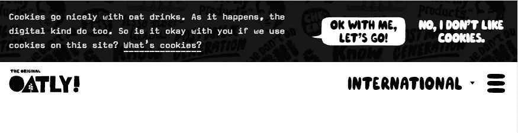
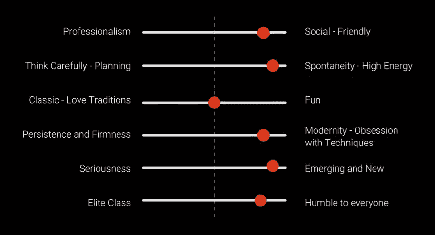
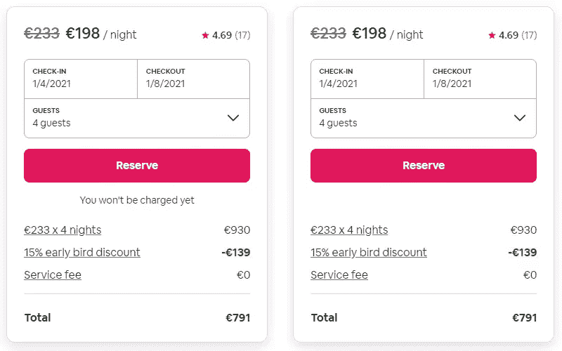
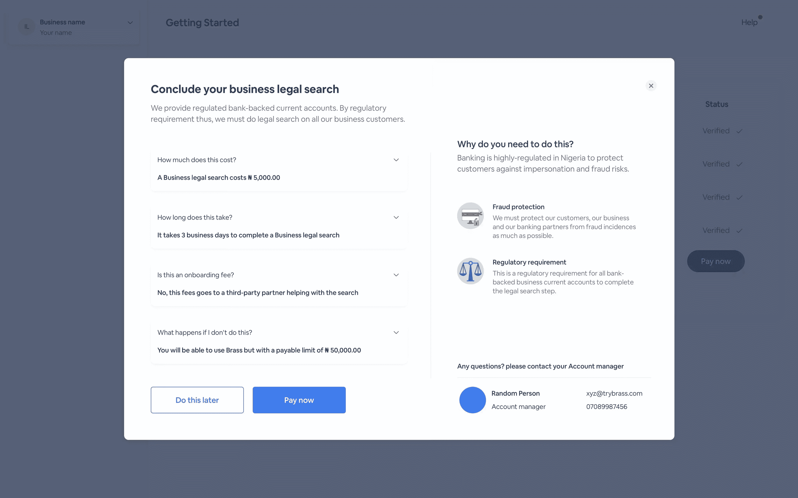
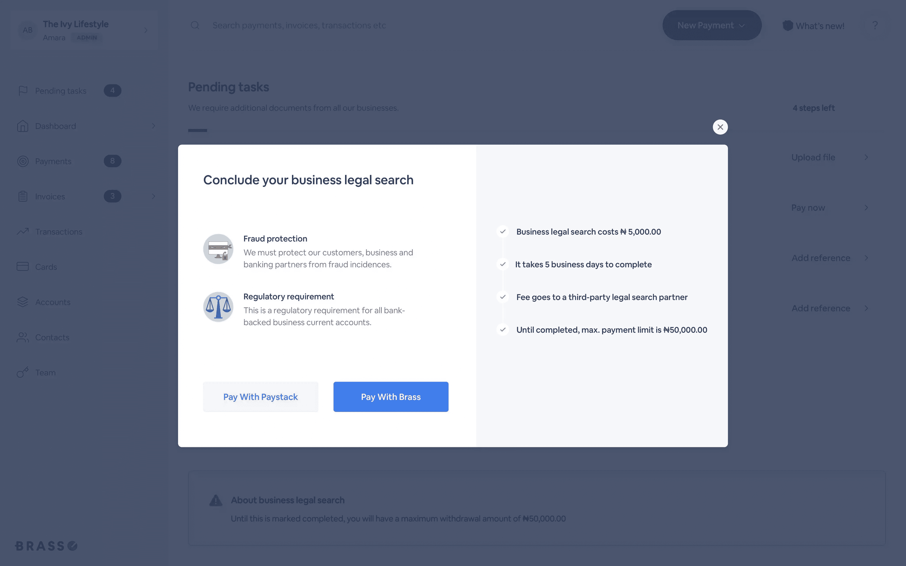
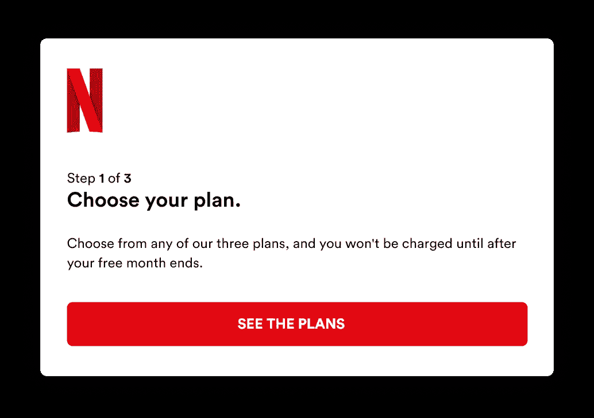
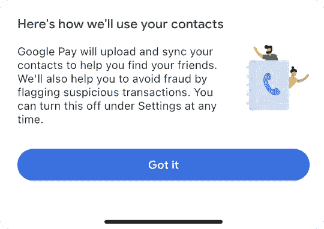
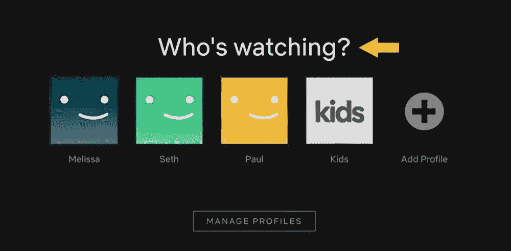

# 书写清晰、人性化缩微副本的 7 个技巧

> 原文：<https://www.sitepoint.com/writing-clear-human-friendly-microcopy/>

词语很重要——不仅仅是在书中。它们帮助你在物理环境或数字产品中导航。本文探讨了数字环境中使用的单词和文本。

用户体验(UX)写作已经成为产品开发的重要部分。一些 UX 作家提倡内容第一的方法。你的缩微拷贝决定了你的设计，而不是设计优先的方法。

UX 写作的重点是创造清晰，人性化，令人愉快的缩微副本。对于许多科技创业公司来说，UX 写作与他们的设计过程紧密相连。糟糕的缩微拷贝会对产品的销售产生重大影响。

一个单独的、选择不当的单词会引起用户的恐惧或困惑。换句话说，一个词可以导致成功的产品注册或又一次放弃购物车。

这篇文章探讨了七个奇怪的技巧来提高你的 UX 写作。但在我们开始之前，让我们简单地定义一下 UX 文字和缩微复制之间的关系。

## UX 写作和缩微复制是如何联系在一起的？

有不同类型的写作。例如，广告文案专注于创造内容来推销产品。然而，UX 写作关注的是嵌入产品的内容。

给你一个 UX 写作的例子，想想按钮上的文字，网页表单的标签，或者使用产品时的任何小的文字指导或线索。在这里，内容(或文本)的主要目标是引导用户，消除困惑，并提供清晰的方向。

那么，现在 UX 作品和缩微复制之间有什么联系呢？缩微拷贝是指用户界面的拷贝。如上所述，它包括按钮、输入标签和应用程序说明等。

UX 写作已经成为产品开发的一个越来越重要的方面。优秀的 microcopy 可以增加销售，提高用户满意度，降低吸引用户的障碍。

现在让我们来看看七个 UX 写作技巧…

## 提示 1:品牌个性让你的 UX 作品闪闪发光

每个人都可以在纸上写字。但是这些话能吸引正确的人吗？理解单词对不同的人有不同的意思是很重要的。例如，文字笑话可以让你的品牌脱颖而出，但也会让用户感到困惑。

识别你的品牌个性很重要。品牌声音是你品牌个性的口头翻译。它决定了你的品牌听起来如何，并使其易于识别。

还记得我们说过你的缩微拷贝应该听起来像人类吗？让我们比较两个使用错误密码登录失败的 microcopy 示例。

**例 1:**

> 密码错误。请重试或单击“忘记密码”重置密码。

**例 2:**

> 哎呀！看起来你可能忘记了你的密码。单击此处重置它。

现在想象你亲自见到这个界面。哪个消息听起来更人性化？第二个例子听起来确实更人性化。

让我们看看时尚燕麦牛奶品牌 Oatly 如何处理他们的饼干同意弹出窗口。

他们的饼干同意弹出代表他们的品牌个性。Oatly 关心用户的隐私，关心气候。他们品牌的声音是俏皮友好的。即使是经常被忽视的网络元素，如 cookie 同意弹出窗口，也能传达你的品牌声音。

如果你很难定义你的品牌个性，看看下面的品牌个性偏见的例子，帮助你定义正确的基调。

来源: [Ahmed Magdi 谈 behance.net](https://www.behance.net/gallery/101888299/Freshalian-Pasta-UX-Writing-Case-Study)–UX 写作案例研究

## 技巧 2:设计减少恐惧或困惑

互联网可能是一个令人恐惧和困惑的地方。好的缩微拷贝可以带走一些负面情绪。在引言中，我们讨论了一个选择不当的单词是如何引起恐惧或困惑的。

这里有一些非常简单的例子，仍然可以激发用户的情绪:

*   一家公司通过他们的网络表单询问你的电话号码。这是不是意味着他们会用烦人的电话来烦你？
*   一项在线服务要求你支付月费。支付连接的安全性如何？
*   你注册了在线流媒体服务。你可以在任何时候选择退出，或者有一个通知期吗？

在 Airbnb 的网站上，即使是一个基本的“位置”字段，如果没有支持缩微文本，也会让读者感到困惑。

*   你想知道我现在的位置吗？
*   你想知道我的首选目的地吗？

在这里,“Reserve”按钮下的 microcopy 消息解释了当您单击此按钮时会发生什么。如果没有这条消息，许多用户可能会对接下来会发生什么感到某种程度的恐惧或困惑。

例如，我喜欢在预订之前再看一遍我的 Airbnb 订单。没有 microcopy 消息，我不确定我是否承诺预订，或者我是否有机会再次查看订单。

> 恐惧通常是无法完成一项行动的驱动力。

你可能会惊讶，即使是像按钮这样最小的 web 元素也会引起恐惧或困惑。考虑到这一点，设计一个界面。试着读懂用户的想法，先发制人地回答他们的问题。恐惧往往是用户不完成一个动作的原因。消除恐惧和困惑有助于用户在浏览界面时更加自信。

## 技巧 3:少即是多

建筑师路德维希·密斯·凡·德罗推广了“少即是多”的原则。这个原则在 UX 作家中变得非常流行。只使用对你的网站的内容和功能有必要的词。省略那些对你网站的内容或功能没有贡献的词。

Brass Business Banking 的产品设计师 Twitter 用户@tolusaba 给出了一个有趣的例子。我们来对比一下产品审核前后的结账页面。

之前，我们发现大量的文本分散了用户对核心任务的注意力——点击“立即支付”按钮。最重要的是，该设计实现了一种问答格式，这种格式在结帐页面上没有任何功能——尽管这种类型的内容可能很适合 FAQ 页面。

产品审核后，他们按时间顺序将最重要的信息分组。

两个页面提供相同的信息，但是重新设计的页面使用更少的单词呈现相同的信息。

这里的关键要点是尽可能保持你的文字简洁，但要注意提供足够的信息，不要引起恐惧或混乱。更多的信息需要用户更多的精神处理时间。

当你向用户展示一个新页面时，我们希望尽可能缩短理解该页面所需的时间。添加过多的信息会分散用户的注意力，降低他们做决定或进一步互动的能力。

## 提示 4:每个品牌都应该增加其品牌声音的透明度

在技巧 2 中，我们向您展示了创建消除恐惧或困惑的设计的重要性。现在，让我们讨论一下为什么透明度是任何品牌声音的关键因素。

如前所述，太小的缩微拷贝可能会给用户带来困惑。让我们看看网飞的入职示例。当前页面如下图所示。

想象一下，如果没有 microcopy 消息告诉用户在他们的免费月结束后会发生什么。首先，这条信息消除了混淆。但这也有助于提高品牌的透明度。你不想欺骗你的用户，因为他们忘记取消他们的计划或不知道一个月的通知期而意外地多付一个月的费用。

对于需要特定用户权限的应用程序也是如此。谷歌会告诉你他们为什么想要你的联系人信息。

## 技巧 5:避免模糊和不友好的错误信息

不友好或模糊的错误信息。我们到处都能看到他们！

*   有些不对劲
*   表单提交失败！
*   无效字段
*   有些事情出了差错
*   你有 3 个错误

以上所有的例子都以一种相当不友好的方式告诉我有些事情不对劲，而且它们没有告诉我我能做些什么来解决这个问题。每个人都会犯错，所以当用户犯错时，善待他们。向他们提供建议，告诉他们如何解决问题，或者将他们发送到帮助页面以更好地理解问题。

含糊不清的错误信息会导致重大损失。你不想一遍又一遍地提交表格，却不知道自己做错了什么。最重要的是，上面例子中使用的词语不友好，不包含品牌声音。

## 技巧 6:比起命令，更喜欢提问

考虑以下两个吸引用户的选项。

**选项 1:**

> 挑选一本书

**选项二:**

> 接下来你想读什么？

问题“你接下来想读什么？”提供了一种更人性化的方式，可以很好地在亚马逊的 Kindle 上运行。

这是另一个例子——网飞面临的例子。如何提示用户登录他们自己的用户帐户？

**选项 1:**

> 选择一个配置文件

**选项二:**

> 谁在看？

如果你是网飞用户，你会知道，他们选择了第二个选项。它更人性化，这是 UX 作家的目标。问一个问题比告诉用户怎么做要有效得多。

## 秘诀 7:把消极的行动变成积极的行动！

让我们比较两种传达航班取消的选择。

**选项 1:**

> 你的航班被取消了。

**选项二:**

> 抱歉，由于天气不好，我们不得不取消你的航班。您可以预订新的航班，无需任何额外费用，即使该航班更贵。

第二个选项增加了一个将负面事件转化为正面体验的解决方案。用户可以直接预订新的航班，无需任何额外费用。最重要的是，从道歉开始，我们让用户不那么恼火。

作为一名飞行操作员，航班被取消是常有的事。不要冷落你的乘客。尝试帮助他们，为他们提供即时解决方案。这位乘客的首要任务是找到另一架回家的飞机。

负面体验是用户体验的一部分。这里关键的一点是，如果发生了，你应该尽可能让它们变得积极。如果你不能提供解决方案，试着向用户解释发生了什么。这种解释会给用户留下比告诉他们坏消息的冷冰冰的消息稍微好一点的体验。

## 糟糕的 UX 作品会破坏你的产品

我并不夸张地说，糟糕的 UX 作品会毁掉你的产品。许多创业公司低估了 UX 写作的力量。糟糕的 UX 写作通常是高弃车率或产品注册失败的原因。因此，深思熟虑、写得好的微型副本可以为公司节省很多钱。

除此之外，UX 的写作也应该关注网页的可访问性。注重内容结构；考虑可读性，使用简单的语言；并提供视觉线索。Mailchimp 有一个很棒的风格指南，是关于[为可访问性](https://styleguide.mailchimp.com/writing-for-accessibility/)而写作的。为网络访问 UX 写作提供解决方案的产品包括:

*   aCe :提供一个免费的网页可访问性测试工具来检查合规性
*   [PayPal 的 AAT](https://github.com/paypal/AATT) :帮助你对内容进行自动化的可访问性测试(备选:[谷歌灯塔](https://developers.google.com/web/tools/lighthouse)
*   [海明威应用](http://www.hemingwayapp.com/):帮助你计算可读性分数

你想尝试一个简单的微型审计吗？开始定义你的品牌个性和品牌声音。完成这些后，就该审核 web 表单并寻找潜在的困惑或恐惧来源了。当浏览你的界面时，试着去理解用户的想法。

我知道这不容易，因为你可能对界面太熟悉了。因此，在与新界面交互时，用户研究是了解更多人类思维的好方法。

你有问题吗？在推特上给我打电话。

## 分享这篇文章