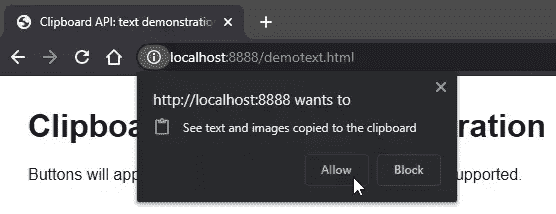

# 使用剪贴板 API 在 JavaScript 中剪切、复制和粘贴

> 原文：<https://www.sitepoint.com/clipboard-api/>

**使用浏览器 JavaScript 访问操作系统剪贴板在几年前就已经可以使用 [`document.execCommand()`](https://www.sitepoint.com/javascript-copy-to-clipboard/) 了。**

不幸的是，有一些问题:

*   剪贴板访问是同步的，这涉及到性能和安全问题
*   支持是不完整的，尤其是在 macOS 和 iOS 的旧版本 Safari 上
*   权限访问因浏览器而异，并且
*   API 永远不会被认为*优雅*

它最终被新的[异步剪贴板 API](https://developer.mozilla.org/Web/API/Clipboard_API) 所取代。它是新的，没有浏览器支持所有功能，但它更容易使用，更健壮。

## 为什么一个应用程序需要访问剪贴板？

作为一名开发者，你应该知道剪贴板是如何工作的，并且经常使用下面的[键盘](https://www.sitepoint.com/best-mechanical-keyboards/)快捷键:

*   `Ctrl` | `Cmd` + `C`进行复制
*   `Ctrl` | `Cmd` + `X`斩
*   `Ctrl` | `Cmd` + `V`粘贴

那些计算经验较少的人不一定具备这方面的知识。他们也可能使用没有键盘快捷键的触摸屏设备。提供易于使用的剪切和粘贴图标会很有用。

此外，您可能希望在剪贴板操作完成时修改内容，如添加或删除格式。

## 剪贴板访问是危险的！

以编程方式访问剪贴板会引发几个安全问题:

*   用户经常复制密码或私人信息，因此任何页面都不能随意读取剪贴板数据。
*   向剪贴板添加数据时，应限制页面。恶意页面可以用危险的命令甚至是可执行文件替换复制的文本。

为了避免潜在的问题，剪贴板 API 只能用于通过 HTTPS 提供的页面(`localhost`也是允许的)。当在 iframe 中运行时，父页面还必须授予`clipboard-read`和/或`clipboard-write`权限:

```
<iframe
  src="childpage.html"
  allow="clipboard-read; clipboard-write"
></iframe> 
```

该 API 仅可用于活动的浏览器选项卡(非后台选项卡)，并且只能由用户交互(如单击)触发。必要时，将提示用户获得读取剪贴板数据的权限:



当页面首次请求剪贴板访问时，会显示此警报。这不会引起任何问题，因为 API 是异步的，并且返回一个承诺。也可以使用[权限 API](https://developer.mozilla.org/Web/API/Permissions_API) 来检查和请求状态。

## 剪贴板 API 功能检测

当`navigator.clipboard`返回真值结果时，剪贴板 API 可用。例如:

```
if (navigator.clipboard) {

  console.log('Clipboard API available');

} 
```

然而，这并不能保证浏览器支持所有的功能，所以有必要做进一步的检查。比如在编写的时候，Chrome 支持 API 的 [readText()](https://developer.mozilla.org/Web/API/Clipboard/readText) 方法，而 Firefox 不支持。

## 复制并粘贴文本

在大多数应用程序中，复制和粘贴文本将是一个有用的选项。该 API 非常简单:

```
// copy text TO the clipboard
await navigator.clipboard.writeText('This text is now in the clipboard');

// get text FROM the clipboard
let text = await navigator.clipboard.readText(); 
```

您将需要更多的代码来检测支持和处理错误…

**[查看剪贴板 API 文本演示](https://rawcdn.githack.com/sitepoint-editors/clipboardapi/a8dfad6a1355bbb79381e61a2ae68394af144cc2/demotext.html)**

代码可以从 GitHub 下载[。JavaScript 请参考](https://github.com/sitepoint-editors/clipboardapi) [clipboardtext.js](https://github.com/sitepoint-editors/clipboardapi/blob/main/js/clipboardtext.js) 。

当一个`data-copy`属性被添加到任何 HTML 元素(比如一个按钮)时，这个例子实现了文本复制。您可以将该值设置为以下值之一:

1.  一个硬编码的字符串—比如`data-copy="copy this to the clipboard"`。
2.  一个 CSS 选择器——比如`data-copy="#mysection"`。然后复制第一个匹配元素的文本内容。

或者，您可以在`data-done`属性中设置自定义成功消息:

```
<button data-copy="#mysection" data-done="section copied">
  copy text from #mysection
</button> 
```

该按钮仅在支持`navigator.clipboard.writeText()`时显示。单击时，JavaScript 事件处理程序定位文本，将其复制到剪贴板，并显示动画成功消息。

文本粘贴按钮非常类似，只是它定义了一个必须指向 DOM 节点的`data-paste`属性:

```
<textarea id="pastehere"></textarea>
<button data-paste="#pastehere">paste</button> 
```

## 复制和粘贴数据

剪贴板 API 的 [`readText()`](https://developer.mozilla.org/Web/API/Clipboard/readText) 和 [`writeText()`](https://developer.mozilla.org/Web/API/Clipboard/writeText) 是更通用的`read()`和 [`write()`](https://developer.mozilla.org/Web/API/Clipboard/write) 方法的便利选项。这些浏览器支持较少，但能够复制和粘贴任何类型的数据，如二进制图像。

复制需要 blob 数据，通常由 [`fetch()`](https://developer.mozilla.org/Web/API/Fetch_API) 或 [`canvas.toBlob()`](https://developer.mozilla.org/Web/API/HTMLCanvasElement/toBlob) 方法返回。这被传递给一个 [`ClipboardItem`](https://developer.mozilla.org/Web/API/ClipboardItem) 构造函数，因此它可以被写入剪贴板:

```
const
  image = await fetch('myimage.png'),
  blob = await image.blob();

await navigator.clipboard.write([
  new ClipboardItem({ [blob.type]: blob })
]); 
```

粘贴更加复杂，因为多个`ClipboardItem`对象可以以不同的内容类型返回。因此，有必要遍历每种类型，直到找到有用的格式。例如:

```
const clipboardItems = await navigator.clipboard.read();

for (const clipboardItem of clipboardItems) {

  for (const type of clipboardItem.types) {

    if (type === 'image/png') {

      // return PNG blob
      return await clipboardItem.getType(type);

    }

  }

} 
```

**[查看剪贴板 API 图像演示](https://rawcdn.githack.com/sitepoint-editors/clipboardapi/a8dfad6a1355bbb79381e61a2ae68394af144cc2/demoblob.html)** (基于 Chromium 的浏览器支持)。

代码可以从 GitHub 下载[。JavaScript 请参考](https://github.com/sitepoint-editors/clipboardapi) [clipboardblob.js](https://github.com/sitepoint-editors/clipboardapi/blob/main/js/clipboardblob.js) 。

这与文本演示的工作方式类似，复制和粘贴按钮必须使用`data-copyblob`和`data-pasteblob`属性中的 CSS 选择器指向 DOM 元素。例如:

```
<!-- copy image -->


<button data-copyblob="#myimage" data-done="image copied">
  copy image
</button>

<!-- paste into DOM -->
<div id="imagelist"></div>

<button data-pasteblob="#imagelist">
  paste image
</button> 
```

尝试从图形应用程序复制图像数据，然后使用粘贴按钮。

## 剪切、拷贝和粘贴事件

每当用户在浏览器中启动剪贴板操作时，就会触发`cut`、`copy`和`paste`事件——通常是通过右击菜单或上面提到的键盘快捷键。大多数浏览器都支持这一点，处理函数可以拦截事件，使用作为参数传递的 [`clipboardData`对象](https://wiki.developer.mozilla.org/en-US/API/ClipboardEvent/clipboardData)进行更改。

以下函数强制所有剪切或复制的文本都是大写的。注意`e.preventDefault()`停止默认的剪切/复制动作，该动作会覆盖它:

```
body.addEventListener('cut', cutCopyHandler);
body.addEventListener('copy', cutCopyHandler);

// cut or copy event handler
function cutCopyHandler(e) {

  const selection = document.getSelection();

  // send uppercase text to clipboard
  e.clipboardData.setData(
    'text/plain',
    selection.toString().toUpperCase()
  );

  if (e.type === 'cut') selection.deleteFromDocument();

  // stop default cut/copy
  e.preventDefault();

} 
```

以下代码将粘贴处理程序附加到特定的`<textarea>`字段。该函数清除现有内容，并在文本`"pasted:"`前添加前缀:

```
document.getElementById('field1').addEventListener('paste', pasteEvent);

// paste event handler
function pasteEvent(e) {

  // add 'pasted:' to pasted text
  const paste = 'pasted:\n' +
    (e.clipboardData || window.clipboardData).getData('text');

  e.target.value = paste;

  // stop default paste
  e.preventDefault();
} 
```

**[查看剪贴板 API 事件演示](https://rawcdn.githack.com/sitepoint-editors/clipboardapi/a8dfad6a1355bbb79381e61a2ae68394af144cc2/demoevent.html)**

代码可以从 GitHub 下载[。请参考 demoevent.html](https://github.com/sitepoint-editors/clipboardapi)的[获取 JavaScript 代码。](https://github.com/sitepoint-editors/clipboardapi/blob/main/demoevent.html)

## 可以使用了吗？

剪贴板 API 是新的，但是有合理的浏览器支持，感觉比旧的`document.execCommand()`选项更健壮。

它最好是作为一个渐进的增强功能添加的，这样剪切、复制和粘贴功能只有在工具可用时才在您的应用程序中实现。如果你想领先一步，请使用这里提供的代码。

## 分享这篇文章