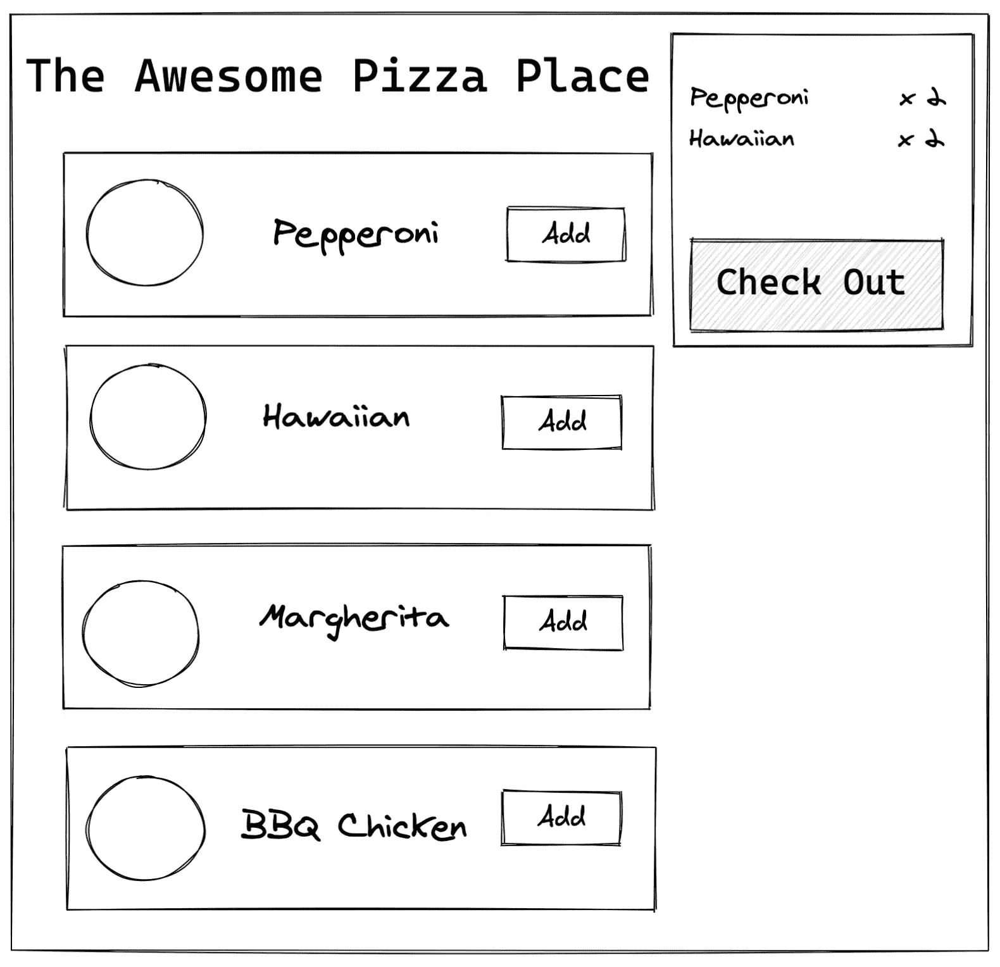
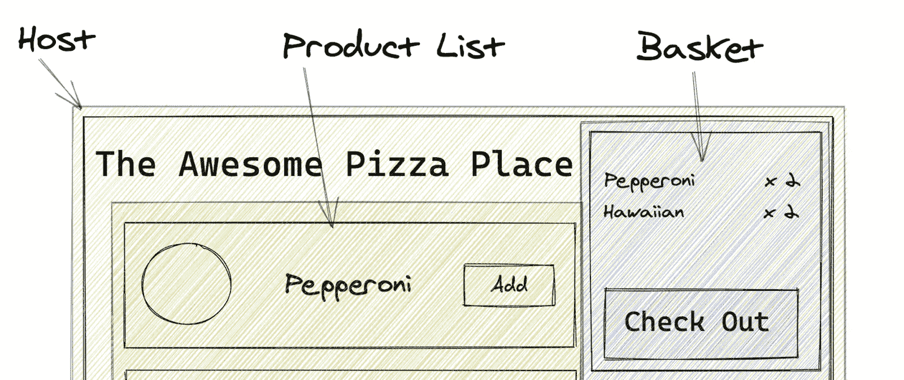

# 微前端架构初学者指南

> 原文：<https://www.sitepoint.com/a-beginners-guide-to-the-micro-front-end-architecture/>

为你的猫或狗创建一个网页的日子已经一去不复返了。现代 web 开发提供了丰富的用户体验，涵盖了用户流和交互的策略。构建、维护、部署和交付这些体验需要大规模的开发团队和复杂的部署系统。

## 网络应用的现状

现代 web 应用程序最常用的模式是单页应用程序(SPA)。SPA 的核心原则是构建一个交付给用户的 web 应用程序。SPA 的工作原理是基于用户交互或数据更改重写页面内容。SPA 通常包含一个路由器来处理页面导航和深度链接，并且可以由多个组件组成，例如购物篮或产品列表。

典型的 SPA 申请流程遵循标准步骤:

*   用户访问 web 应用程序
*   浏览器请求 JavaScript 和 CSS
*   JavaScript 应用程序启动并将初始内容添加到浏览器文档中
*   用户与应用程序进行交互——比如单击导航链接或将产品添加到购物篮中
*   应用程序重写部分浏览器文档以反映这些更改

在大多数情况下，JavaScript 框架用于实现上述功能。像 React、Vue 或 Angular 这样的框架都有帮助构建 SPA 的模式和最佳实践。例如，React 是一个非常直观的框架，它使用 JSX 根据用户和数据的变化来呈现内容。下面我们来看一个基本的例子:

```
//App.js
import React from "react";
import "./styles.css";

const App = () => {
 return (
   <div className="App">  <h1>Hello I'm a SPA 👋</h1>  </div>
 );
}

export default App; 
```

这是我们的基本应用。它呈现了一个简单的视图:

```
import React from "react";
import ReactDOM from "react-dom";

import App from "./App";

const rootElement = document.getElementById("root");
ReactDOM.render(
 <React.StrictMode>  <App />  </React.StrictMode>,
 rootElement
); 
```

接下来，我们通过将 React 应用程序呈现到浏览器 DOM 中来启动应用程序。这只是水疗的基础。从这里，我们可以添加更多的功能，如路由和共享组件。

温泉是现代发展的主要部分，但它们并不完美。水疗有很多缺点。

其中之一是搜索引擎优化的损失，因为应用程序直到用户在浏览器中查看时才呈现。谷歌的网络爬虫会试图呈现页面，但不会完全呈现应用程序，你会丢失许多你需要爬上搜索排名的关键词。

框架的复杂性是另一个缺点。如前所述，有许多框架可以提供水疗体验，并允许您建立一个可靠的水疗中心，但每个框架针对不同的需求，知道采用哪一个可能很难。

浏览器性能也是一个问题。因为 SPA 完成了用户交互的所有呈现和处理，所以它会根据用户的配置产生连锁反应。不是所有的用户都会在高速连接的现代浏览器中运行你的应用程序。为了获得流畅的用户体验，需要尽可能减小包的大小并减少客户端的处理。

以上都引出了终极问题，就是**规模**。试图构建一个能够满足用户所有需求的复杂应用程序需要多个开发人员。在 SPA 上工作可能会导致许多人处理相同的代码，试图进行更改并导致冲突。

那么所有这些问题的解决方案是什么呢？**微前端！**

## 什么是微前端？

微前端是一种架构模式，用于构建可伸缩的 web 应用程序，它随着开发团队的成长而成长，并允许您扩展用户交互。我们可以把它与我们现有的水疗中心联系起来，说它是我们水疗中心的切片版本。对用户来说，这个版本看起来和感觉上仍然像一个 SPA，但在它的引擎盖下，它根据用户的流量动态加载应用程序的各个部分。

为了更好地解释这一点，让我们以一个比萨饼店应用程序为例。核心功能包括选择一个比萨饼，并能够将其添加到您的篮子和检查。下面是我们的应用程序的 SPA 版本的模拟。



让我们通过考虑应用程序中可以分割的不同部分，把它变成一个微前端。我们可以像分解创建应用程序所需的组件一样来考虑这个问题。



所有微前端都从一个主机容器开始。这是将所有部分结合在一起的主应用程序。这将是在用户访问应用程序时发送给用户的主要 JavaScript 文件。然后我们转移到实际的微观前端——产品列表和购物篮前端。这些可以在本地与主机分离，并作为微前端交付。

让我们深入探讨一下与主宿主分离的*更多。当我们想到传统的 SPA 时，在大多数情况下，您构建一个 JavaScript 文件并将其发送给用户。使用微前端，我们只将主机代码发送给用户，根据用户流，我们进行网络调用来获取应用程序其余部分的额外代码。代码可以存储在启动主机的不同服务器上，并且可以随时更新。这导致了更高效的开发团队。*

## 如何搭建一个微前端？

构建微前端有多种方式。对于这个例子，我们将使用 webpack。Webpack 5 将[模块联合](https://webpack.js.org/concepts/module-federation/)作为核心特性发布。这允许您将远程 webpack 构建导入到您的应用程序中，从而为微前端带来一个易于构建和维护的模式。

完整的 webpack 微前端应用程序可以在[这里](https://github.com/sitepoint-editors/webpack-federation-example)找到。

### 家用集装箱

首先，我们需要创建一个容器，作为应用程序的主目录。这可以是应用程序的一个非常基本的框架，也可以是一个容器，在用户与产品交互之前，包含一个菜单组件和一些基本的 UI。使用 webpack，我们可以导入`ModuleFederation`插件并配置容器和任何微前端:

```
// packages/home/webpack.config.js

const ModuleFederationPlugin = require("webpack/lib/container/ModuleFederationPlugin");

module.exports = {
  ...

  plugins: [
    new ModuleFederationPlugin({
      name: "home",
      library: { type: "var", name: "home" },
      filename: "remoteEntry.js",
      remotes: {
        "mf-products": "products",
        "mf-basket": "basket",
      },
      exposes: {},
      shared: require("./package.json").dependencies,
    }),
    new HtmlWebPackPlugin({
      template: "./src/index.html",
    }),
  ],
}; 
```

*注:点击可以在 GitHub [上查看`webpack.config.js`文件。](https://github.com/sitepoint-editors/webpack-federation-example/blob/master/packages/home/webpack.config.js)*

这里，我们将模块命名为“home”，因为这是保存所有前端的容器。然后我们提供库细节，因为容器也可以是微前端，所以我们声明关于它的细节——比如它的类型，在这个例子中是一个`var`。类型定义了网络包模块的类型。`var`声明该模块是 ES2015 编译模块。

然后，我们将产品和购物篮模块设置为遥控器。这些将在以后导入和使用组件时使用。将模块导入应用程序时，将使用我们为模块指定的名称(“mf-products”和“mf-basket”)。

在我们配置好模块之后，我们可以将脚本标签添加到 home 的主`index.html`文件中，它将指向托管的模块。在我们的例子中，这些都是在本地主机上运行的，但是在生产环境中，这些可能是在一个 web 服务器或者一个亚马逊 S3 桶上。

```
<!-- packages/home/src/index.html -->

<script src="http://localhost:8081/remoteEntry.js"></script> //product list
<script src="http://localhost:8082/remoteEntry.js"></script> //basket 
```

*注:点击可以在 GitHub [上查看`index.html`文件。](https://github.com/sitepoint-editors/webpack-federation-example/blob/master/packages/home/src/index.html)*

主容器的最后一部分是导入和使用模块。对于我们的例子，模块是 React 组件，所以我们可以使用 [React.lazy](https://reactjs.org/docs/code-splitting.html#reactlazy) 导入它们，并像使用任何 React 组件一样使用它们。

通过使用`React.lazy`,我们可以导入组件，但是底层代码只有在组件被渲染时才会被获取。这意味着我们可以导入组件，即使用户没有使用它们，并在事后有条件地呈现它们。让我们来看看如何使用这些组件:

```
// packages/home/src/src/App.jsx

const Products = React.lazy(() => import("mf-nav/Products"));
const Basket = React.lazy(() => import("mf-basket/Basket")); 
```

*注:点击可以在 GitHub [上查看`App.jsx`文件。](https://github.com/sitepoint-editors/webpack-federation-example/blob/master/packages/home/src/App.jsx#L4)*

这里与标准组件使用的关键区别是 [React.lazy](https://reactjs.org/docs/code-splitting.html#reactlazy) 。这是一个内置的 React 函数，处理代码的异步加载。因为我们已经使用了`React.lazy`来获取代码，所以我们需要将组件包装在一个[暂挂组件](https://reactjs.org/docs/react-api.html#reactsuspense)中。这做了两件事:它触发组件代码的获取，并呈现一个加载组件。除了暂记组件和后备组件，我们可以像使用任何其他 React 组件一样使用我们的微前端模块。

### 产品和购物篮

在我们配置了主容器之后，我们需要设置产品和购物篮模块。这些容器遵循与主容器相似的模式。首先，我们需要导入 webpack `ModuleFederation`插件，就像我们在 home 容器的 webpack 配置中所做的那样。然后，我们配置模块设置:

```
// packages/basket/webpack.config.js

const ModuleFederationPlugin = require("webpack/lib/container/ModuleFederationPlugin");

module.exports = {
  ...

  plugins: [
      new ModuleFederationPlugin({
        name: 'basket',
        library: {
          type: 'var', name: 'basket'
        },
        filename: 'remoteEntry.js',
        exposes: {
          './Basket': './src/Basket'
        },
        shared: require('./package.json').dependencies
      })
  ],
}; 
```

*注:点击可以在 GitHub [上查看`webpack.config.js`文件。](https://github.com/sitepoint-editors/webpack-federation-example/blob/master/packages/basket/webpack.config.js)*

我们为模块提供一个名称，即产品或购物篮和库的详细信息，然后是一个`fileName`——在本例中是远程条目。这是 webpack 的一个标准，但也可以是您想要的任何东西——比如产品代码名或模块名。这将是 webpack 生成的文件，并且将由主容器托管以供引用。使用文件名 remoteEntry，模块的完整 URL 将是`http://myserver.com/remoteEntry.js`。然后我们定义暴露选项。这定义了模块输出的内容。在我们的例子中，它只是购物篮或产品文件，这是我们的组件。然而，这可以是多个组件或不同的资源。

最后，回到主容器，这是您使用这些组件的方式:

```
// packages/home/src/src/App.jsx

<div className="app-content">  <section>  <React.Suspense fallback={<div>....loading product list</div>}>  <ProductList
        onBuyItem={onBuyItem}
      />  </React.Suspense>  </section>  <section>  {
      selected.length > 0 &&
      <React.Suspense fallback={<div>....loading basket</div>}>  <Basket
          items={selected}
          onClear={() => setSelected([])}
        />  </React.Suspense>
    }  </section>  </div> 
```

*注:点击可以在 GitHub [上查看`Product and Basket usage`文件。](https://github.com/sitepoint-editors/webpack-federation-example/blob/master/packages/home/src/App.jsx#L23)*

### 属国

我们还没有谈到依赖性。如果您从上面的代码示例中注意到，每个 webpack 模块配置都有一个共享的配置选项。这告诉 webpack 应该跨微前端共享哪些节点模块。这对于减少最终应用程序的重复非常有用。例如，如果 basket 和 home 容器都使用样式化的组件，我们不希望加载两个版本的样式化组件。

您可以通过两种方式配置共享选项。第一种方式是作为您知道想要共享的已知共享节点模块的列表。另一个选择是从它自己的包 JSON 文件中获取模块依赖列表。这将共享所有的依赖项，并且在运行时 webpack 将确定它需要哪一个。例如，当购物篮被导入时，webpack 将能够检查它需要什么，以及它的依赖项是否已经被共享。如果 basket 使用 Lodash，而 home 不使用，它将从 baskets 模块获取 Lodash 依赖项。如果家中已经有 Lodash，则不会加载。

## 不足之处

这一切听起来很棒——好得令人难以置信。在某些情况下，这是完美的解决方案。在其他情况下，它会导致超出其价值的开销。尽管微前端模式可以让团队更好地合作，并快速推进应用程序的各个部分，而不会被繁琐的部署管道、混乱的 Git 合并和代码审查所拖累，但也有一些缺点:

*   **重复的依赖逻辑**。正如依赖关系部分提到的，webpack 可以为我们处理共享节点模块。但是当一个团队使用 Lodash 作为其功能逻辑，而另一个团队使用 Ramda 时会发生什么呢？我们现在发布了两个函数式编程库来实现同样的结果。
*   设计、部署和测试的复杂性。现在我们的应用程序可以动态加载内容，因此更难全面了解整个应用程序。确保跟踪所有微前端本身就是一项任务。部署可能会变得更加危险，因为您不能 100%确定在运行时将什么加载到应用程序中。这导致了更难的测试。每个前端都可以单独测试，但是需要进行完整的真实用户测试，以确保应用程序为最终用户工作。
*   **标准。**现在应用程序被分成了更小的部分，很难让所有的开发人员都按照相同的标准工作。一些团队可能比其他团队进步更多，或者提高或者降低代码质量。让所有人都保持一致对于提供高质量的用户体验非常重要。
*   **成熟度:**微前端并不是一个新概念，在使用 iframes 和自定义框架之前就已经实现了。然而，webpack 直到最近才在 webpack 5 中引入这个概念。对于 webpack 捆绑的世界来说，这还是一个新事物，需要做大量的工作来构建标准并发现这种模式的缺陷。要使这成为一个强大的、生产就绪的模式，让使用 webpack 的团队能够轻松使用，还有很多工作要做。

## 结论

因此，我们已经了解了如何使用 webpack 模块联合来构建 React 应用程序，以及如何在微前端之间共享依赖关系。与部署和发布过程缓慢的传统 SPA 应用程序相比，这种构建应用程序的模式非常适合团队将应用程序分解成更小的部分，以实现更快的增长和进步。显然，这并不是适用于所有用例的灵丹妙药，但是在构建下一个应用程序时，这是需要考虑的事情。由于一切都还很新，我建议您尽早采用微前端，以便进入底层，因为从微前端模式转移到标准 SPA 比反过来更容易。

## 分享这篇文章