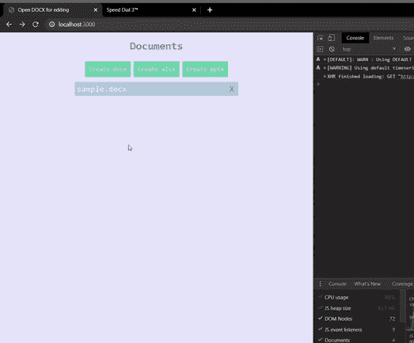

# 使用 OnlyOffice 向您的 Web 应用程序添加 Office 功能

> 原文：<https://www.sitepoint.com/add-office-functionality-to-your-web-app-with-onlyoffice/>

*本文是与 [OnlyOffice](https://www.OnlyOffice.com/) 合作创作的。感谢您对使 SitePoint 成为可能的合作伙伴的支持。*

每当我们发现自己试图在应用程序中添加任何复杂的功能时，问题就出现了，“我应该开发自己的吗？”除非您的目标是构建该功能，否则答案几乎总是直截了当的“不”。

您需要的是帮助您尽快获得 MVP 的东西，而实现这一点的最佳方式是使用一个完整的开箱即用的解决方案，它可以帮助您节省时间，这反过来又转化为开发成本的节省。

我会假设你还在这里，因为以上与你产生了共鸣。现在我们已经同步了，我想在这篇文章中向你展示的是在你的网络应用中集成 OnlyOffice 是多么容易。

## 什么是 OnlyOffice？

从[他们的网站](https://www.onlyoffice.com/):

> OnlyOffice 提供了可用的功能最丰富的 Office 套件，与 Microsoft Office 和 OpenDocument 文件格式高度兼容。直接从您的 web 应用程序查看、编辑和协作处理文档、电子表格和演示文稿。

办公套件有几个版本。在本文中，我们将使用[开发者版](https://www.onlyoffice.com/developer-edition.aspx)，因为我们希望将编辑器集成到应用程序中，该应用程序稍后将作为云服务或内部安装交付给许多用户。

如果您希望在现有的同步和共享解决方案中仅使用 Office，则应查看企业版。这里的是一个集成列表[。](https://www.onlyoffice.com/en/office-suite.aspx)

### 开发者版

开发者版不仅让你有足够的自由在你的应用程序中集成编辑器，而且它还提供了一个“白色标签”选项，让你完全自定义编辑器，以便在你自己的品牌下使用它们。

## 文档服务器集成

要与您的 web 应用程序集成，您首先需要下载 [OnlyOffice Docs(打包为文档服务器)](https://www.onlyoffice.com/download-commercial.aspx#developer)并在您的本地服务器上设置它。

安装完成后，您可以开始实现在服务器上处理文档的请求。OnlyOffice 为[提供了一些非常好的](https://api.OnlyOffice.com/editors/example/csharp)[例子](https://api.OnlyOffice.com/editors/demopreview)。NET 、 [Java](https://api.OnlyOffice.com/editors/example/java) 、 [Node.js](https://api.OnlyOffice.com/editors/example/nodejs) 、 [PHP](https://api.OnlyOffice.com/editors/example/php) 、 [Python](https://api.OnlyOffice.com/editors/example/python) 和 [Ruby](https://api.OnlyOffice.com/editors/example/ruby) 。

您可以下载文档服务器和您喜欢的示例，并直接在您的机器上试用。

我将演示如何开始集成到您的应用程序中。为此，我们将使用一个非常简单的 Node.js 和 Express 示例。我不会深入讨论实现的细节，我将列出最基本的要点，让您来填补空白，构建一个健壮的、可伸缩的系统。

我有一个如下结构的应用程序:

```
- node_modules
- public
    - backups
    - css
        - main.css
    - documents
        - sample.docx
    - javascript
        - main.js
    - samples
        - new.docx
        - new.xlsx
        - new.pptx
- app.js
- index.html
- package.json 
```

我们将使用`public/documents`文件夹来存储文档。`app.js`文件是我们的 Express 应用程序代码所在的地方，而`index.html`是我们展示文档的地方。出于测试目的，我在 documents 文件夹中放了一个`sample.docx`文件。

`public/samples/`中的树文件是空白文件，我们将在“创建”新文件时复制这些文件。

正如您将在后面看到的,`backups`文件夹不仅可以帮助我们保存以前版本的备份，还可以帮助我们在修改文档后为它们生成唯一的标识符。

`public/css/main.css`和`public/javascript/main.js`文件将被`index.html`使用。我们以后会调查的。

我们来看看`app.js`文件:

```
const express = require('express');
const bodyParser = require("body-parser");
const path = require('path');
const fs = require('fs');
const syncRequest = require('sync-request');

const app = express();

app.use(bodyParser.json());
app.use(bodyParser.urlencoded({ extended: false }));

app.use(express.static("public"));

app.get("/", (req, res) => {
  res.sendFile(path.join(__dirname, "/index.html"));
});

const port = process.env.PORT || 3000;
app.listen(port, () => console.log(`App listening on http://localhost:${port}`)); 
```

我们正在做的是将文件作为`localhost:3000/documents/filename`提供。

我还提前添加了`syncRequest`、`fs`和`bodyParser`。这些现在并不相关，但是我们以后会用到它们。

### 获取文档

为了显示可用的文档，我们需要获得所有文件名的列表，并将它们发送给客户端。我们将为此创建`/documents`路线:

```
app.get("/documents", (req, res) => {
  const docsPath = path.join(__dirname, "public/documents");
  const docsPaths = fs.readdirSync(docsPath);

  const fileNames = [];

  docsPaths.forEach(filePath => {
    const fileName = path.basename(filePath);
    fileNames.push(fileName);
  });

  res.send(fileNames);
}); 
```

### 创建文档

开始时，我们只有一个样本文档，但这一点也不好玩。让我们添加一个`/create`路径来帮助我们添加一些文件。我们将简单地使用一个`fileName`并将相应的模板复制到`public/documents`文件夹中，并使用它的新名称:

```
app.post("/create", async (req, res) => {
  const ext = path.extname(req.query.fileName);
  const fileName = req.query.fileName;

  const samplePath = path.join(__dirname, "public/samples", "new" + ext);
  const newFilePath = path.join(__dirname, "public/documents", fileName);

  // Copy the sample file to the documents folder with its new name.
  try {
    fs.copyFileSync(samplePath, newFilePath);
    res.sendStatus(200);
  } catch (e) {
    res.sendStatus(400);
  }
}); 
```

### 删除文档

我们还需要一种删除文档的方法。让我们创建一条`/delete`路线:

```
app.delete("/delete", (req, res) => {
  const fileName = req.query.fileName;
  const filePath = path.join(__dirname, "public/documents", fileName);

  try {
    fs.unlinkSync(filePath);
    res.sendStatus(200);
  } catch (e) {
    res.sendStatus(400);
  }
}); 
```

这个超级简单。我们将删除该文件，并发送一个`200`状态代码，让用户知道一切正常。否则，他们会得到一个`400`状态码。

### 保存文档

到目前为止，我们可以打开文档进行编辑，但是无法保存我们的更改。让我们现在做那件事。我们将添加一个`/track`路径来保存我们的文件:

```
app.post("/track", async (req, res) => {
  const fileName = req.query.fileName;

  const backupFile = filePath => {
    const time = new Date().getTime();
    const ext = path.extname(filePath);
    const backupFolder = path.join(__dirname, "public/backups", fileName + "-history");

    // Create the backups folder if it doesn't exist
    !fs.existsSync(backupFolder) && fs.mkdirSync(backupFolder);

    // Remove previous backup if any
    const previousBackup = fs.readdirSync(backupFolder)[0];
    previousBackup && fs.unlinkSync(path.join(backupFolder, previousBackup));

    const backupPath = path.join(backupFolder, time + ext);

    fs.copyFileSync(filePath, backupPath);
  }

  const updateFile = async (response, body, path) => {
    if (body.status == 2) {
      backupFile(path);
      const file = syncRequest("GET", body.url);
      fs.writeFileSync(path, file.getBody());
    }

    response.write("{\"error\":0}");
    response.end();
  }

  const readbody = (request, response, path) => {
    const content = "";
    request.on("data", function (data) {
      content += data;
    });
    request.on("end", function () {
      const body = JSON.parse(content);
      updateFile(response, body, path);
    });
  }

  if (req.body.hasOwnProperty("status")) {
    const filePath = path.join(__dirname, "public/documents", fileName);
    updateFile(res, req.body, filePath);
  } else {
    readbody(req, res, filePath);
  }
}); 
```

这是一个棘手的问题，因为当编辑器保存文件时，文档服务器将使用它。如你所见，我们正在返回`"{\"error\":0}"`，它告诉服务器一切正常。

当编辑器关闭时，文件的当前版本将被备份到`public/backups/fileName-history/`中，以毫秒为单位的当前时间作为文件名。正如您将看到的，我们稍后将在前端使用该文件的名称。

在本例中，每次保存新备份时，我们都会替换以前的备份。您将如何着手保留更多备份？

### 获取备份

我们需要一种方法来获取特定文件的备份，因此我们添加了一个`/backups`路由来处理这个问题:

```
app.get("/backups", (req, res) => {
  const fileName = req.query.fileName;
  const backupsPath = path.join(__dirname, "public/backups", fileName + "-history");

  if (!fs.existsSync(backupsPath)) {
    return res.send([]);
  }

  const backupsPaths = fs.readdirSync(backupsPath);

  const fileNames = [];

  backupsPaths.forEach(filePath => {
    const fileName = path.basename(filePath);
    fileNames.push(fileName);
  });

  res.send(fileNames);
}); 
```

在这里，我们确保该文件的备份文件夹存在，并返回该文件夹中所有备份文件的数组。是的，这将有助于您为单个文件保留更多备份。我不能一直为你做所有的工作！

## 在浏览器中打开文档

我们将了解如何仅使用 Office Docs 直接在浏览器中打开文档进行编辑。



首先，我们将创建一个简单的 HTML 文件:

```
<!DOCTYPE html>
<html>

<head>
  <title>OnlyOffice Example</title>

  <meta name="viewport" content="width=device-width, initial-scale=1.0, maximum-scale=1.0, user-scalable=0"/>
  <link rel="stylesheet" href="/public/css/main.css">
</head>

<body>
  <div id="placeholder"></div>
  <div id="documents">
    <h1>Documents</h1>
    <div id="document-controls">
      <div onclick="createDocument('.docx')">Create docx</div>
      <div onclick="createDocument('.xlsx')">Create xlsx</div>
      <div onclick="createDocument('.pptx')">Create pptx</div>
    </div>
  </div>
  <script type="text/javascript" src="http://localhost:8080/web-apps/apps/api/documents/api.js"></script>
  <script type="text/javascript" src="/public/javascript/main.js"></script>
</body>

</html> 
```

如您所见，这个文件没有多少内容。我们有一个将附加编辑器的`placeholder` div。然后是`documents` div，它包含创建文档的控件和文件名列表的容器。

在那下面，我们有用于文档服务器的 JavaScript API 脚本。请记住，您可能需要将主机替换为文档服务器的位置。如果你用我给你的`Docker`命令安装了它，你应该可以使用了。

最后但同样重要的是，有一个`script`标签，在这里我们导入前端 JavaScript，还有一个`main.js`文件，在这里我们可以全局访问`DocsAPI`对象。

### 半铸钢ˌ钢性铸铁(Cast Semi-Steel)

在我们开始编码之前，让我们用一些 CSS 来包装布局，使我们的应用程序更有用，不那么难看。将以下内容添加到`main.css`:

```
html,
body {
  font-family: monospace;
  height: 100%;
  margin: 0;
  background-color: lavender;
  color: aliceblue;
}

h1 {
  color: lightslategray;
  display: inline-block;
}

#placeholder {
  height: 100%;
}

#documents {
  text-align: center;
}

#document-controls {
  text-align: center;
  margin: 5px;
}

#document-controls>div {
  display: inline-block;
  font-size: 15px;
  cursor: pointer;
  padding: 10px;
  background: mediumaquamarine;
}

#documents-list {
  padding: 5px;
  max-width: 400px;
  margin: auto;
}

.document {
  cursor: pointer;
  font-size: 20px;
  text-align: left;
  padding: 5px;
  margin: 2px;
  background-color: lightsteelblue;
}

.delete-doc {
  color: lightslategray;
  float: right;
  margin: 0 5px 0 5px;
} 
```

### 显示可用文档

这样一来，我们就可以开始编写前端代码了。我们将从列出`documents`文件夹中的文件开始。转到`main.js`并添加以下代码:

```
const params = new URLSearchParams(window.location.search);
const fileName = params.get("fileName");

if (fileName) {
  editDocument(fileName);
} else {
  listDocuments();
}

function listDocuments() {
  // Hide the editor placeholder
  document.getElementById("placeholder").style.display = "none";
  // Remove old list
  const oldList = document.getElementById("documents-list");
  oldList && oldList.remove();
  // Create new container
  const documentsHtml = document.getElementById("documents");
  const docsListHtml = document.createElement("div");
  docsListHtml.id = "documents-list";

  documentsHtml.appendChild(docsListHtml);

  const req = new XMLHttpRequest();

  req.addEventListener("load", function (evt) {
    const docs = JSON.parse(this.response);

    docs.forEach(doc => {
      addDocumentHtml(doc);
    });
  });

  req.open("GET", "/documents");
  req.send();
}

function addDocumentHtml(fileName) {
  const docsListHtml = document.getElementById("documents-list");

  const docElement = document.createElement("div");
  docElement.id = fileName;
  docElement.textContent = fileName;
  docElement.setAttribute("class", "document");

  docElement.onclick = () => {
    openDocument(fileName);
  }

  const deleteElement = document.createElement("span");
  deleteElement.textContent = "X";
  deleteElement.setAttribute("class", "delete-doc");

  deleteElement.onclick = evt => {
    evt.stopPropagation();
    evt.preventDefault();
    deleteDocument(fileName);
  }

  docElement.appendChild(deleteElement);
  docsListHtml.appendChild(docElement);
}

function openDocument(fileName) {
  const url = "/?fileName=" + fileName;
  open(url, "_blank");
} 
```

在顶部，我们正在获取查询参数，以确定我们是否正在打开一个文件。如果是，我们将调用`editDocument`函数。别担心，我们稍后会创建一个。

如果我们没有打开一个文件，我们希望显示一个可用文件的列表和创建更多文件的控件。在`listDocuments`中，我们首先确保我们隐藏了`placeholder`并清理了列表以确保我们重新创建了它。然后我们调用之前创建的`/documents`路径来获取所有文件，遍历它们，并创建相应的元素。我们将用文件名作为 ID 来标识每个元素。这样我们以后可以很容易地检索它们。

注意，我们正在调用`addDocumentHtml`函数，稍后我们将重用它来添加新文件。

对于这些文档中的每一个，我们也称之为`openDocument`，我们在底部定义了它，在十字符号上我们称之为`deleteDocument`，我们将在下面定义它。

### 删除文档

要删除我们的文档，我们会提示用户他们是否确定，然后我们继续调用`/delete`路径并对该文件进行核处理。我们没有浪费对 API 的另一次调用，而是检查返回的状态是否为`200`以直接删除 DOM 元素:

```
function deleteDocument(fileName) {
  const canContinue = confirm("Are you sure you want to delete " + fileName + "?");

  if (!canContinue) {
    return;
  }

  const req = new XMLHttpRequest();

  req.addEventListener("load", function (evt) {
    if (this.status === 200) {
      return removeDocumentHtml(fileName);
    }

    alert("Could not delete " + fileName);
  });

  req.open("DELETE", "/delete?fileName=" + fileName);
  req.send();
}

function removeDocumentHtml(fileName) {
  const el = document.getElementById(fileName);
  el && el.remove();
} 
```

### 创建文档

还记得我们在文档创建控件的`onclick`中调用的函数吗？给你:

```
function createDocument(extension) {
  const name = prompt("What's the name of your new document?");
  const fileName = name + "." + extension;

  const req = new XMLHttpRequest();

  req.addEventListener("load", function (evt) {
    if (this.status === 200) {
      addDocumentHtml(fileName);
      return;
    }

    alert("Could not create " + fileName);
  });

  req.open("POST", "/create?fileName=" + fileName);
  req.send();
} 
```

很简单。我们提示名称，调用`/create`路由并将其作为`fileName`参数，如果状态返回为`200`，我们调用`addDocumentHtml`直接添加 DOM 元素。

### 仅在 Office 文档中打开文档

现在我们需要定义`editDocument`函数。将以下代码添加到`main.js`:

```
async function editDocument(fileName) {
  document.getElementById("documents").style.display = "none";

  const extension = fileName.substring(fileName.lastIndexOf(".") + 1);
  const documentType = getDocumentType(extension);
  const documentKey = await generateKey(fileName);

  console.log(documentKey);

  new DocsAPI.DocEditor("placeholder", {
    document: {
      fileType: extension,
      key: documentKey,
      title: fileName,
      url: "http://192.168.0.7:3000/documents/" + fileName,
    },
    documentType,
    editorConfig: {
      callbackUrl: "http://192.168.0.7:3000/track?fileName=" + fileName,
    },
    height: "100%",
    width: "100%",
  });
}

function generateKey(fileName) {
  return new Promise(resolve => {
    const req = new XMLHttpRequest();

    req.addEventListener("load", function (evt) {
      const backups = JSON.parse(this.response);
      const backupName = backups[0];
      const key = backupName ? backupName.substring(0, backupName.indexOf(".")) : new Date().getTime();
      resolve(String(key));
    });

    req.open("GET", "/backups?fileName=" + fileName);
    req.send();
  });
}

function getDocumentType(extension) {
  const documentTypes = {
    text: ["doc", "docx", "docm", "dot", "dotx", "dotm", "odt", "fodt", "ott", "rtf", "txt", "html", "htm", "mht", "pdf", "djvu", "fb2", "epub", "xps"],
    spreadsheet: ["xls", "xlsx", "xlsm", "xlt", "xltx", "xltm", "ods", "fods", "ots", "csv"],
    presentation: ["pps", "ppsx", "ppsm", "ppt", "pptx", "pptm", "pot", "potx", "potm", "odp", "fodp", "otp"],
  }

  if (documentTypes.text.indexOf(extension) >= 0) {
    return "text";
  }
  if (documentTypes.spreadsheet.indexOf(extension) >= 0) {
    return "spreadsheet";
  }
  if (documentTypes.presentation.indexOf(extension) >= 0) {
    return "presentation";
  }
} 
```

所以，我们增加了三个函数。我们先来关注后两个。(我们一会儿会谈到`editDocument`。)

`generateKey`也将通过生成密钥来帮助我们。这是服务用于文档识别的唯一文档标识符。它的最大长度为 20 个字符，不包含特殊字符。诀窍在于:每次保存文档时都必须重新生成它。你知道这是怎么回事吗？没错。我们将利用我们的备份文件名来生成我们的密钥。

如您所见，为了生成密钥，我们检索我们唯一的备份(如果有的话),并使用它的名称，或者简单地以毫秒为单位获取当前时间(如果没有的话)。

如果您要支持更多备份，该功能需要做哪些改变？*【逃跑】*

`getDocumentType`将返回`text`、`spreadsheet`或`presentation`。只有 Office 需要这个来知道打开哪个编辑器。

这就是我们在这里的目的。这是你一直期待的。在这里，我们实例化了传递我们的`placeholder` div 的 ID 的`DocEditor`对象和一个具有大量配置的对象。

### DocEditor 配置

到目前为止，我向您展示的是实例化`DocEditor`所需的最少选项。你应该看看文档中的[高级参数](https://api.onlyoffice.com/editors/advanced)部分，看看你如何从所有不同的选项中获利。同时，让我带你了解一下基本原理。

在顶部，我们有一个[文档](https://api.onlyoffice.com/editors/config/document)字段，它接受一个包含关于我们想要打开的文档的信息的对象。

然后我们有了`documentType`，正如我们前面看到的，它可以是`text`、`spreadsheet`或`presentation`。

在它的正下方是 [editorConfig](https://api.onlyoffice.com/editors/config/editor) 对象，它可以让你设置诸如`spellcheck`、`unit`和`zoom`等东西。在这种情况下，我们只是使用了`callbackUrl`，它是文档服务器将用来保存文件的`/track`路径的 URL。

### 结论

我们已经到了最后，希望你已经学会了如何设置和集成 OnlyOffice 文档和你的 web 应用。我们遗漏了很多东西，比如[权限](https://api.onlyoffice.com/editors/config/document/permissions)、[共享](https://api.onlyoffice.com/editors/config/document/info#sharingSettings)、[定制](https://api.onlyoffice.com/editors/config/editor/customization)以及很多其他你只能用 Office 做的事情。

我希望你已经获得了足够的信息来不断改进你的产品，或者甚至是从头开始一个新项目的灵感。没有比现在更好的时机了。

好吧，下一集见。与此同时，继续编码，记得在编码的时候要开心！

## 分享这篇文章