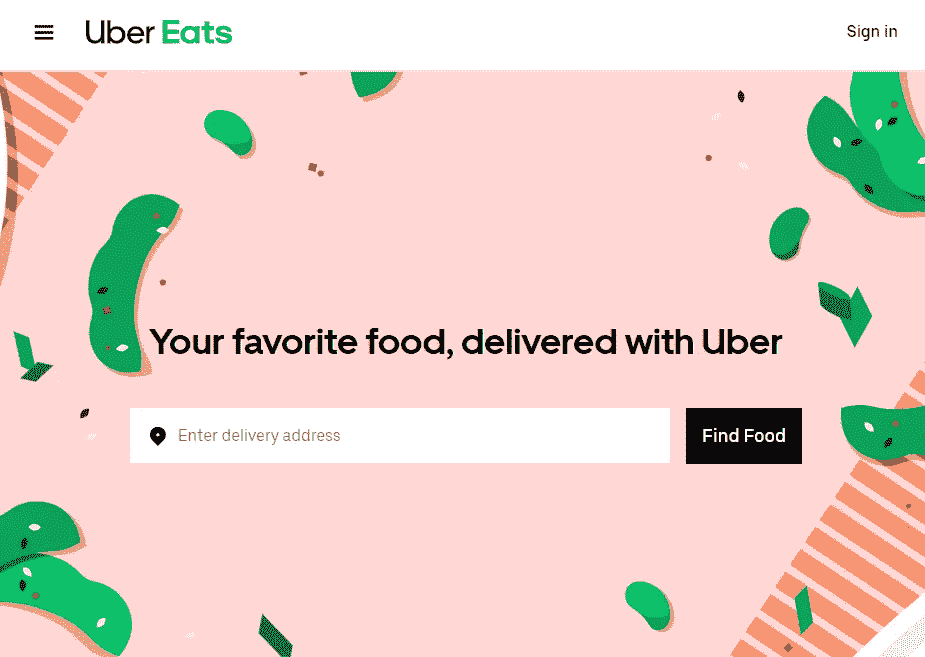
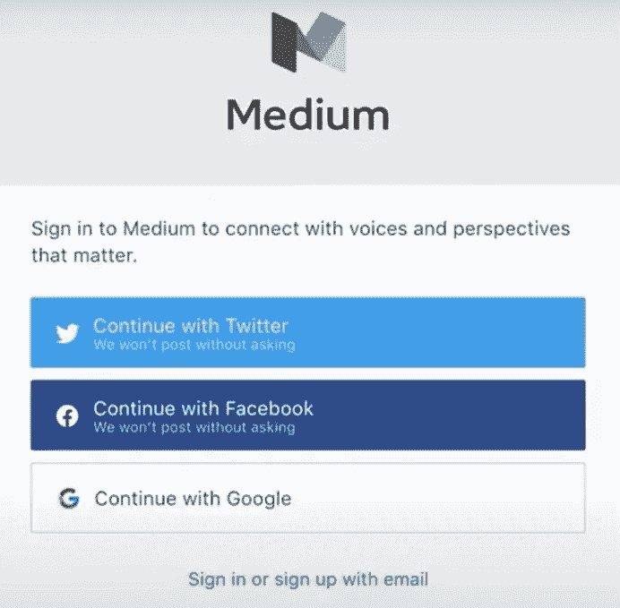
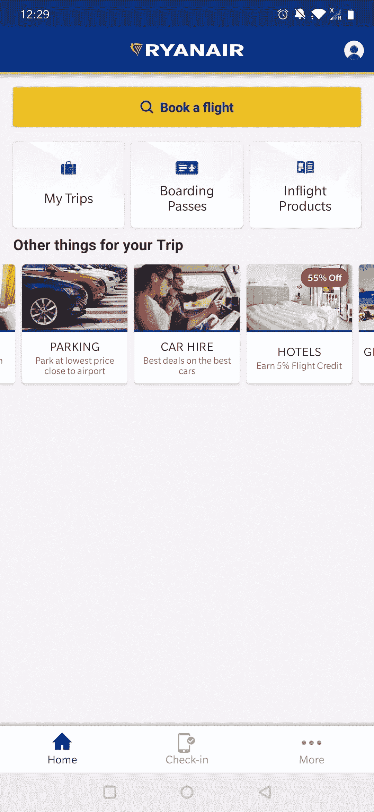
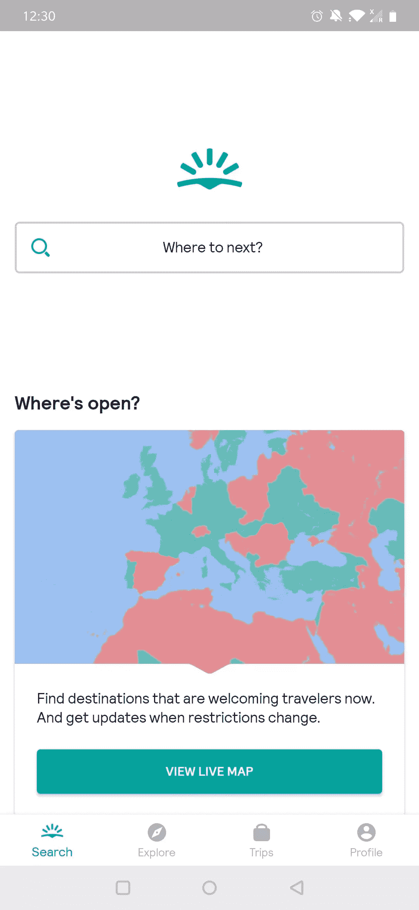
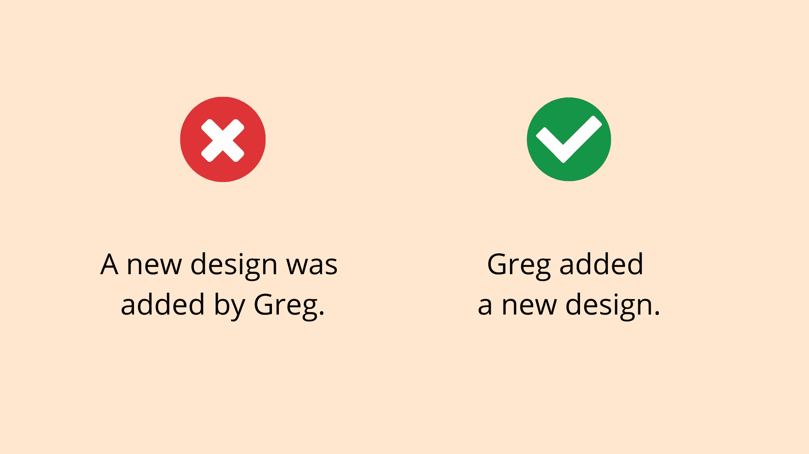
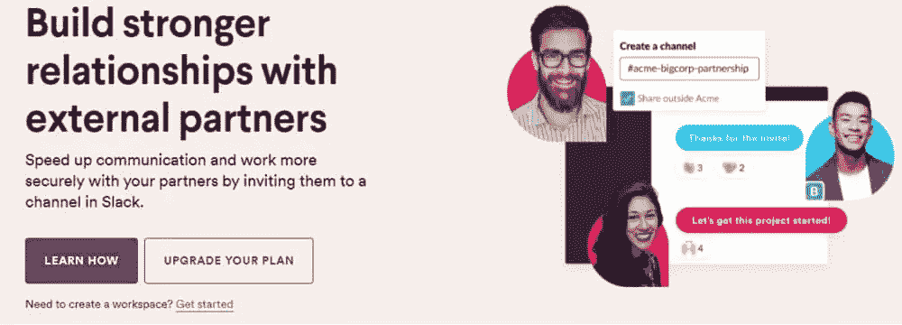

# 写出更好的缩微副本的 5 个技巧

> 原文：<https://www.sitepoint.com/writing-better-microcopy/>

当你第一次看到一个应用程序时，microcopy 可以提供许多关于该应用程序用途的线索，该应用程序如何帮助我们，以及我们如何与该应用程序进行交互。尽管如此，许多组织开发了很棒的应用程序，但没有写出有效的缩微副本。

“缩微拷贝”指的是引导你的用户达到他们的目标、指导他们并减轻他们的顾虑的小块文本。缩微拷贝包括我们传达给用户的所有信息位。

例如，搜索栏包含提示如何使用搜索栏或可以查找哪些信息的文本。它减轻了用户对使用搜索栏可以找到什么信息的担忧。

因此，帮助用户快速理解单个元素和整个应用程序的目的是用户体验(UX)的关键部分。有效的缩微复制加速了用户的学习过程。

想象一下第一次使用 Uber Eats。当你访问他们的网站时，我们可能不知道网站的目的。然而，microcopy 让网站的目的立刻清晰起来。我们可以用 Uber Eats 把食物送到家门口。

网站首先显示一个简短的口号，这也是 microcopy 的一部分。"你最喜欢的食物，优步送来的。"食物这个关键词马上就弹出来了。为了强化这个口号，他们把“食物”和形容词“最喜欢的”搭配起来。

更重要的是，我们发现在标语的正下方有一个搜索栏。这个搜索栏要求我们输入送货地址。接下来，有一个清晰的按钮鼓励我们寻找食物。换句话说，它们指导我们如何按照文本线索使用应用程序。

令人惊讶的是，仅仅 11 个词就能立刻阐明申请的意义和目的。重复一遍，Uber Eats 就是找到你喜欢的食物，然后直接送到你家门口。谁不喜欢一个美味的披萨而不用离开你舒适的家呢？

让我们来看看编写 microcopy 的五个技巧，它们将加速用户的学习过程。

## 1.考虑缩微复制元素的顺序

创建缩微副本时，元素的顺序很重要。用户最有可能从上到下从左到右阅读元素。因此，结构信息按照重要性从上到下从左到右排列。避免将用户需要的信息放在特定元素下面，而需要它来完成最后一个元素。

让我们看一个例子来阐明这个顺序。Mailchimp 的注册表单改变了元素的顺序。他们在密码输入字段下添加了密码要求。

当用户第一次看到密码字段时，可能会填写他们的默认密码。当我们自上而下阅读表格时，这种反应是正常的。接下来，用户注意到他们的密码不符合密码要求。在这种情况下，他们必须创建一个新密码。这听起来像是 UX 的一个小问题，但它们可以累积起来。

我们不想完全贬低 Mailchimp 的密码字段，因为他们在列出密码要求方面做得很好。您可能会认为将需求放在密码标签和密码字段之间会占用太多空间，使得很难看到标签和字段之间的链接。

简而言之，在设计输入元素时，遵循从上到下、从左到右的顺序:

*   标签
*   指令或提示
*   输入栏

## 2.透明，添加元信息

如今，用户更加关注他们的数据以及谁可以访问这些数据。因此，当你想存储用户的数据，为他们注册一个时事通讯，或者引导他们到一个产品页面，告诉用户会发生什么。我们将这种类型的信息称为“元信息”。

这是一个(旧的)Medium 注册表单的很好的例子，它告诉我们 Medium 如何使用我们的数据。

下面，我们看到了一个新报纸付费通讯的例子。他们通过提供元信息在创造透明度方面做得很好。他们每天提供一次新闻，使用简洁的格式。

此外，他们在注册按钮上添加了一些 microcopy 来声明费用和取消政策。声明这种类型的元信息是很重要的，因为你不想让你的用户对点击注册按钮后可以免费阅读时事通讯的印象感到失望。

透明能让你建立信任，但也能告诉你品牌的价值。当用户认为一个品牌诚实透明时，这是一个额外的收获。

## 3.使用一致的语气

语气指的是你说话和接近用户的方式。你的文本语调有不同的可能性。你的文字可能令人兴奋，直接，友好，或抱歉。它代表了你作为一个公司的态度。

在你的电子文本信息中保持相同的基调是至关重要的。这种形式的一致性有助于用户更快地学习你的界面，了解你公司的价值观。

我们来对比一下两个机票预订 app，瑞安航空和 Skyscanner。瑞安航空为寻找廉价航班的年轻人和老年人提供广泛的服务。Skyscanner 专注于同样便宜或最后一分钟的航班，针对的是希望在预算范围内探索世界的年轻观众。

虽然提供廉价航班的目标可能是相同的，但他们的受众不同。两家公司都用不同的语气表达了这种差异。让我们比较一下行动号召在移动应用程序中搜索航班的情况。

首先，瑞安航空选择直接或正式的语气，在按钮上贴上动作标签。

相反，Skyscanner 选择了一种更非正式或更有趣的语气，询问你下一步想去哪里。请注意，他们甚至没有提到关键词“飞行”或“预订”。它显示了两家公司在信息传递方面的明显差异。

## 4.使用主动语态而不是被动语态

编写更有效的缩微副本的一个最受欢迎的技巧是使用主动语态而不是被动语态。

最重要的是，使用主动语态会给你的信息增添更多的力量，而且比被动语态更容易被用户理解。通过使用主动语态，你把主题放在第一位，告诉用户发生了什么。

通常，使用被动语态的句子颠倒了这个顺序。看看下面的例子。

主动陈述“Greg 添加了新的设计”比被动陈述“Greg 添加了新的设计”要清晰直接得多。

## 5.使用[Slogan-]信息-行动格式

文案通常使用“信息-行动”格式来号召行动(CTA)。不要添加“开始试用”的按钮，而是添加额外的信息来解释为什么他们应该注册您的试用。

<small>松弛主页</small>

这种 CTA 的变体是“口号-信息-行动”格式。我们经常在产品页面或登录页面上发现这种格式，以提供一些额外的上下文。一个口号可以让你阐明你的品牌的价值观，并表达它的语气。

Slack 团队的口号解释了使用他们的消息工具可以实现什么，而信息部分则侧重于好处。最后，他们要求你完成一个动作:

1.  了解如何使用 Slack 的功能
2.  升级您的计划(因为我在截图时登录了 Slack)

## 保持简单！

给每一个 microcopy 作者的提示:保持简单！每个设计师都知道，少即是多。将此规则应用于您的缩微复制策略。过度沟通会让用户感到困惑。

我们已经讲述了如何使用元信息建立透明度，如何通过关注 web 元素的顺序来创建更好的缩微副本，以及一致的声音如何代表您的品牌价值。

如果你想了解更多关于 UX 写作的知识，我推荐你阅读以下博文:

*   乔治娜·莱德劳的《UX:建立一个更人性化的网络》
*   “如何创建令人难忘的界面文案”，作者 Jerry Cao。

## 分享这篇文章