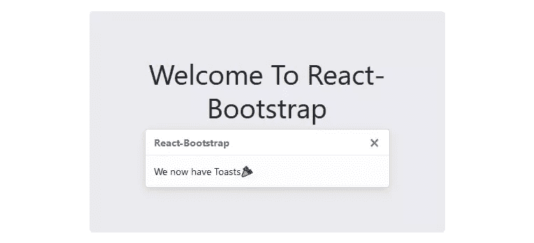

# 20 个必不可少的反应工具

> 原文：<https://www.sitepoint.com/essential-react-tools/>

React 生态系统已经发展成为一个不断增长的开发工具和库列表。过多的工具是 React 受欢迎程度的真实证明。对于开发人员来说，在这个变化速度惊人的迷宫中穿行可能是一项令人眼花缭乱的工作。为了帮助你导航，下面列出了 2020 年必不可少的 React 工具、技术和技能。

## 钩住

*   网址:[reactjs.org/docs/hooks-intro.html](https://reactjs.org/docs/hooks-intro.html)
*   知识库:[github.com/facebook/react](https://github.com/facebook/react/tree/v16.8.0)
*   GitHub stars: 157，000+
*   开发商:脸书
*   当前版本:16.14.0
*   贡献者:1，500 人以上

虽然不是严格意义上的工具，但任何在 2020 年使用 React*的开发者都需要*熟悉钩子。这些是 React 16.8 版的新增功能，可解锁功能组件中的有用特性。例如，`useState`钩子允许一个函数组件拥有自己的状态，而`useEffect`允许你在初始渲染之后执行副作用——例如，操纵 DOM 或数据获取。钩子可以用来复制功能组件中的生命周期方法，并允许您在组件之间共享代码。

以下是可用的基本挂钩:

*   [useState](https://reactjs.org/docs/hooks-state.html) :用于无生命周期方法的功能组件中的状态突变
*   [useEffect](https://reactjs.org/docs/hooks-effect.html) :用于执行渲染后的函数，对触发 Ajax 请求很有用
*   [useContext](https://reactjs.org/docs/hooks-reference.html#usecontext) :用于访问组件上下文数据，甚至在组件属性之外

优点:

*   降低状态管理的复杂性
*   支持功能组件
*   鼓励关注点分离

缺点:

*   语境数据转换会增加认知负荷

如果你想了解更多关于钩子的信息，那么看看我们的教程，“反应钩子:如何开始&构建你自己的”。

## 功能组件

*   网址:[reactjs.org/docs/components-and-props.html](https://reactjs.org/docs/components-and-props.html#function-and-class-components)
*   知识库:[github.com/facebook/react](https://github.com/facebook/react/tree/v16.12.0)
*   GitHub stars: 157，000+
*   开发商:脸书
*   当前版本:16.14.0
*   贡献者:1，500 人以上

随着钩子的出现，函数组件——一种不使用类来创建 JSX 标记的声明性方法——变得比以往任何时候都更受欢迎。他们接受功能范式，因为他们不在生命周期方法中管理状态。这强调了没有太多逻辑的 UI 标记。因为组件依赖于道具，所以测试变得更容易。道具与渲染输出有*一对一*的关系。

这是 React 中功能组件的样子:

```
function Welcome(props) {
  return <h1>Hello, {props.name}</h1>;
} 
```

优点:

*   关注用户界面
*   可测试组件
*   考虑组件时认知负荷减少

缺点:

*   没有生命周期方法

## 创建 React 应用

*   网址: [create-react-app.dev](https://create-react-app.dev/)
*   知识库:[github.com/facebook/create-react-app](https://github.com/facebook/create-react-app)
*   GitHub stars:82000+
*   开发商:脸书
*   当前版本:3.4.1
*   投稿人:800+人

Create React App 是启动新 React 项目的必备工具。它通过单个 npm 包管理所有 React 依赖项。不用再和 Babel、webpack 以及其他人打交道了。只需一个命令就可以建立一个本地开发环境，并支持 React、JSX 和 ES6。但这还不是全部。Create React App 还提供热模块重新加载(开发时，您的更改会立即反映在浏览器中)、自动代码林挺、测试运行器和构建脚本，以捆绑 JS、CSS 和图像用于生产。

开始很容易:

```
npx create-react-app my-killer-app 
```

而且后期升级更容易。使用`package.json`中的`react-scripts`升级整个依赖工具链:

```
npm i react-scripts@latest 
```

优点:

*   易于上手
*   易于升级
*   单一元依赖

缺点:

*   没有服务器端渲染，但允许集成

如果您想了解更多关于使用 Create React App 的信息，请参考我们的教程“[Create React App–快速准备 React 项目](https://www.sitepoint.com/create-react-app/)”。

## 代理服务系统

*   网址:[create-react-app . dev/docs/proxy-API-requests-in-development](https://create-react-app.dev/docs/proxying-api-requests-in-development)
*   知识库:[github.com/facebook/create-react-app](https://github.com/facebook/create-react-app)
*   GitHub stars:82000+
*   开发商:脸书
*   当前版本:3.4.1
*   投稿人:800+人

从版本`react-scripts@0.2.3`或更高版本开始，可以代理 API 请求。这允许后端 API 和本地 Create React App 项目共存。从客户端向`/my-killer-api/get-data`发出请求，通过代理服务器路由该请求。这种无缝集成在本地开发和后期构建中都有效。如果本地开发运行在端口`localhost:3000`上，那么 API 请求通过代理服务器。一旦您部署了静态资产，它就会通过托管这些资产的任何后端。

在`package.json`中设置代理服务器:

```
"proxy": "http://localhost/my-killer-api-base-url" 
```

如果后端 API 以相对路径托管，请设置主页:

```
"homepage": "/relative-path" 
```

优点:

*   与后端 API 无缝集成
*   消除 CORS 问题
*   易于设置

欺骗

*   可能需要具有多个 API 的服务器端代理层

## 属性类型

*   网址:[npmjs.com/package/prop-types](https://www.npmjs.com/package/prop-types)
*   知识库:[github.com/facebook/prop-types](https://github.com/facebook/prop-types)
*   GitHub stars:3600 以上
*   开发商:脸书
*   当前版本:15.7.2
*   贡献者:45 岁以上

PropTypes 声明用于 React 组件的类型，并记录其意图。如果类型不匹配，这将在本地 dev 中显示一个警告。它支持所有的 JavaScript 原语，比如`Boolean`、`Number`和`String`。它可以通过`isRequired`记录需要哪些道具。

例如:

```
import PropTypes;

MyComponent.propTypes = {
  boolProperty: PropTypes.bool,
  numberProperty: PropTypes.number,
  requiredProperty: PropTypes.string.isRequired
}; 
```

优点:

*   记录组件的意图
*   在本地开发中显示警告
*   支持所有 JavaScript 原语

缺点:

*   没有编译类型检查

## 以打字打的文件

*   网址:[typescriptlang.org](https://www.typescriptlang.org)
*   知识库:[github.com/Microsoft/TypeScript](https://github.com/Microsoft/TypeScript)
*   GitHub stars:65000+
*   开发者:微软
*   当前版本:4.0.3
*   贡献者:530+

通过编译类型检查来扩展 React 项目的 JavaScript。这支持所有带有类型声明的 React 库和工具。它是 JavaScript 的超集，所以可以不使用类型检查器。这既记录了意图，又在不匹配时使构建失败。在 Create React App 项目中，通过在创建应用程序时传入`--template typescript`来打开它。从版本`react-script@2.1.0`开始提供 TypeScript 支持。

要声明一个属性类型:

```
interface MyComponentProps {
  boolProp?: boolean; // optional
  numberProp?: number; // optional
  requiredProp: string;
} 
```

优点:

*   编译类型检查
*   支持所有 React 工具和库，包括创建 React 应用程序
*   提升 JavaScript 技能的好方法

缺点:

*   有一个学习曲线，但选择退出是可能的

如果您想了解更多关于使用 React 的 TypeScript，请查看“ [React with TypeScript:最佳实践](https://www.sitepoint.com/react-with-typescript-best-practices/)”。

## Redux

*   网址:[redux.js.org/](https://redux.js.org/)
*   知识库:[github.com/reduxjs/redux](https://github.com/reduxjs/redux)
*   GitHub stars:54000+
*   开发者:丹·阿布拉莫夫和安德鲁·克拉克
*   当前版本:4.0.5
*   投稿人:800+人

JavaScript 应用程序的可预测状态管理容器。这个工具附带了一个管理状态数据的存储。状态突变只能通过调度消息来实现。message 对象包含一种类型，它向 reducer 发出信号，通知它触发哪个变异。建议将应用程序中的所有内容保存在一个商店中。Redux 支持单个存储中的多个 reducers。减速器在输入参数和输出状态之间有一对一的关系。这使得减速器成为纯函数。

一个典型的变异状态的缩减器可能看起来像这样:

```
const simpleReducer = (state = {}, action) => {
  switch (action.type) {
    case 'SIMPLE_UPDATE_DATA':
      return {...state, data: action.payload};

    default:
      return state;
  }
}; 
```

优点:

*   可预测的状态管理
*   单个商店中的多个减速器
*   减速器是纯函数

缺点:

*   从头开始设置可能有点痛苦

## 反应还原

*   网址:[react-redux.js.org](https://react-redux.js.org/)
*   知识库:[github.com/reduxjs/redux](https://github.com/reduxjs/react-redux)
*   GitHub stars:18500+
*   开发者:Redux 团队
*   当前版本:7.2.1
*   贡献者:220 人以上

如果你想在 React 应用中使用 Redux，你很快就会发现 Redux 的 React 官方绑定。这有两个主要模块:`Provider`和`connect`。`Provider`是一个带有`store`道具的反应组件。这个道具就是单店如何与 JSX 加价挂钩的。`connect`函数接受两个参数:`mapStateToProps`和`mapDispatchToProps`。这就是 Redux 的状态管理与组件属性的联系。当状态发生变化或调度 fire 时，绑定负责在 React 中设置状态。

连接可能是这样的:

```
import { bindActionCreators } from 'redux';
import { connect } from 'react-redux';

const mapStateToProps = (state) => state.simple;
const mapDispatchToProps = (dispatch) =>
  bindActionCreators({() => ({type: 'SIMPLE_UPDATE_DATA'})}, dispatch);

connect(mapStateToProps, mapDispatchToProps)(SimpleComponent); 
```

优点:

*   Redux 的官方 React 绑定
*   与 JSX 标记绑定
*   将组件连接到单个存储

缺点:

*   学习曲线有些陡峭

还应该注意的是，随着 hooks 和 React 的上下文 API 的引入，在一些 React 应用程序中取代 Redux 是可能的。你可以在“[如何用 React 钩子替换 Redux 和上下文 API](https://www.sitepoint.com/replace-redux-react-hooks-context-api/) ”中了解更多。

## 反应路由器

*   网址:[reactrouter.com](https://reactrouter.com/)
*   知识库:[github.com/ReactTraining/react-router](https://github.com/ReactTraining/react-router)
*   GitHub stars:42000+
*   开发人员:反应培训
*   当前版本:5.2.0
*   贡献者:640+

React 路由器是 React 事实上的标准路由库。当您需要在具有多个视图的 React 应用程序中导航时，您将需要一个路由器来管理 URL。React Router 负责这一点，使您的应用程序 UI 和 URL 保持同步。

这个库包含三个包: [react-router](https://www.npmjs.com/package/react-router) 、 [react-router-dom](https://www.npmjs.com/package/react-router-dom) 和 [react-router-native](https://www.npmjs.com/package/react-router-native) 。路由器的核心包是`react-router`，而另外两个是特定于环境的。如果你正在建立一个网站，你应该使用`react-router-dom`，如果你正在建立一个 React 本地应用，你应该使用`react-router-native`。

React 路由器的最新版本已经引入了[钩子](https://reactrouter.com/native/api/Hooks)，它可以让你访问路由器的状态并从你的组件内部执行导航，以及[一个更新的路由渲染](https://reactrouter.com/native/api/Route/route-render-methods)模式:

```
<Route path="/">  <Home />  </Route> 
```

如果你想了解更多关于 React 路由器的功能，请参见“ [React 路由器 v5:完整指南](https://www.sitepoint.com/react-router-complete-guide/)”。

优点:

*   组件之间的路由速度很快
*   动画和过渡可以很容易地实现
*   将组件连接到单个存储

缺点:

*   如果没有额外的配置，则为用户可能不会访问的视图下载数据
*   客户端路由(JavaScript 被转换成 HTML)对 SEO 有影响

## 埃斯林特

*   网址:[eslint.org](https://eslint.org/)
*   储存库:github . com/ESL int/ESL int
*   GitHub stars:17000+
*   开发者:尼古拉斯·c·扎卡斯和 ESLint 团队
*   当前版本:7.11.0
*   贡献者:820+

ESLint 是一个林挺工具，可用于保持代码风格的一致性，加强代码质量，并提前发现潜在的错误和不良模式。它为[提供了一个带有 React 特有的林挺规则](https://www.npmjs.com/package/eslint-plugin-react)的插件，通常与 [Airbnb 的 React 风格指南](https://www.npmjs.com/package/eslint-config-airbnb)结合使用。

虽然 ESLint 可以通过命令行运行，但是花一些时间将它集成到您选择的编辑器中是有好处的。它发现的许多问题都可以自动修复，再加上像[appearlier](https://prettier.io/)这样的工具，ESLint 可以极大地帮助提高代码的质量，以及您的整体开发体验。

任何使用 Create React 应用程序的人都会注意到，它已经启用了 ESLint，并提供了旨在查找常见错误的最小规则集。

优点:

*   灵活:任何规则都可以切换，许多规则都有额外的设置可以调整
*   可扩展:许多插件可用
*   支持 JSX 和打字稿

缺点:

*   编辑器集成可能会带来麻烦
*   可能会给项目带来几个新的依赖项

如果你想了解更多关于 ESLint 的知识，请参考我们的教程“ESLint 的启动和运行——可插入的 JavaScript Linter ”。

## 洛达什

*   网址:[lodash.com](https://lodash.com)
*   知识库:[github.com/lodash/lodash](https://github.com/lodash/lodash)
*   GitHub stars:46500+
*   开发者:约翰-大卫·道尔顿和洛达什团队
*   当前版本:4.17.20
*   贡献者:300 人以上

Lodash 是一个现代 JavaScript 实用程序库，对 React 组件很有用。例如，React form 输入事件像`onChange`每击一次键就触发一次。如果组件从后端 API 获取数据，它会在每次击键时触发一次请求。当很多人使用 UI 时，这会导致后端 API 的垃圾，并引发问题。Lodash 带有去抖事件，它通过多次击键触发一个 API 请求。

要设置`onChange`去抖事件:

```
onChange={(e) => debounce(updateDataValue(e.target.value), 250)} 
```

优点:

*   模块依赖性
*   很好地处理代码分割
*   使用方便

缺点:

*   知道什么时候去反跳事件并不容易

## 阿克斯

*   网址:[npmjs.com/package/axios](https://www.npmjs.com/package/axios)
*   知识库:[github.com/axios/axios](https://github.com/axios/axios)
*   GitHub stars:77500+
*   开发者:axios 团队
*   当前版本:0.20.0
*   贡献者:250 人以上

发出获取或保存数据的 HTTP 请求是客户端 JavaScript 应用程序需要完成的最常见的任务之一。毫无疑问，没有比 axios 更适合这项任务的库了，axios 是一个基于 Promise 的 HTTP 客户端，具有易于使用的 API。该工具支持从浏览器发出 Ajax 请求的`async` … `await`语法。通过`catch`支持出错时的错误处理。该工具的 API 支持 HTTP 请求，如 GET、DELETE、POST、PUT 和 PATCH。这也适用于 Promise API 调用，如`Promise.all()`并行发送 HTTP 请求。

类似于 jQuery 的`$.ajax`函数，您可以通过向 axios 传递一个 options 对象来发出任何类型的 HTTP 请求:

```
axios({
  method: 'post',
  url: '/login',
  data: {
    user: 'camilo',
    lastName: 'reyes'
  }
}); 
```

优点:

*   基于承诺
*   支持异步/等待
*   支持错误处理

缺点:

*   没有比这更棒的了

如果您想了解更多关于在项目中使用 axios 的信息，请参见“[Axios 简介，这是一个流行的、基于 Promise 的 HTTP 客户端](https://www.sitepoint.com/axios-beginner-guide/)”。

## 玩笑

*   网址:[jet js . io](https://jestjs.io)
*   知识库:[github.com/facebook/jest](https://github.com/facebook/jest)
*   GitHub stars:32500+
*   开发商:脸书
*   当前版本:26.5.3
*   贡献者:1，000+人

Jest 是一个测试框架，专注于 JavaScript 项目的简单性。好消息是它内置了 Create React 应用程序。它适用于使用 Babel、TypeScript 和 Node 的项目。大多数 React 项目都没有配置。测试可以在监视模式下运行，监视模式跟踪代码更改并重新运行测试。API 包含`it`和`expect`来快速入门。

确保测试执行的健全性检查是:

```
it('says true is true', () => {
  expect(true).toBe(true);
}); 
```

优点:

*   使用 Create React 应用程序轻松设置
*   流畅的 API
*   在监视模式下运行

缺点:

*   过于简单，无法渲染 React 组件

如果您想了解如何在 React 项目中使用 Jest，请参见“[如何使用 Jest](https://www.sitepoint.com/test-react-components-jest/) 测试 React 组件”。

## 酶

*   网址:[enzymejs.github.io/enzyme/](https://enzymejs.github.io/enzyme/)
*   知识库:[github.com/enzymejs/enzyme](https://github.com/enzymejs/enzyme)
*   GitHub stars:19000+
*   开发商:Airbnb
*   当前版本:3.11.0
*   贡献者:350 人以上

Enzyme 是 React 的一个 JavaScript 测试工具，它使组件测试变得更加容易。该 API 旨在像 jQuery 一样直观地进行组件遍历。要得到酶，需要两个包:`enzyme`，和一个单独的适配器。适配器必须与 React 的版本兼容。例如，`enzyme-adapter-react-16`代表反应`^16.4.0`，`enzyme-adapter-react-16.3`代表`~16.3.0`，以此类推。适配器需要一个配置文件`setupTest.js`来与 Jest 集成。

使用 React 16 时，安装酶时应:

```
npm i --save-dev enzyme enzyme-adapter-react-16 
```

优点:

*   支持反应组件
*   支持 Jest 测试框架
*   直观的 API

缺点:

*   开玩笑地设置一个适配器有点痛苦

## 浅层渲染器

*   网址:[enzymejs.github.io/enzyme/docs/api/shallow.html](https://enzymejs.github.io/enzyme/docs/api/shallow.html)
*   知识库:[github.com/airbnb/enzyme](https://github.com/airbnb/enzyme)
*   GitHub stars:19000+
*   开发商:Airbnb
*   当前版本:3.11.0
*   贡献者:350 人以上

这是一种浅层渲染，对于将测试限制在一个深度级别非常有用。它呈现父组件，而不影响树层次结构中的子组件。这隔离了测试，使断言更加健壮。浅层渲染支持大量用于遍历组件的酶 API。在渲染过程中，`shallow` API 确实调用了像`componentDidMount`和`componentDidUpdate`这样的生命周期方法。有了钩子，浅层渲染器不调用`useEffect`。一个技巧是做`console.log(component.debug())`来检查浅层渲染器看到了什么。

使用浅层渲染器测试 React 组件:

```
const component = shallow(<ParentComponent data={"Dave"} />);
expect(component.find('p').at(0).text()).toBe('Dave'); 
```

优点:

*   隔离测试
*   全功能 API
*   允许快速调试

缺点:

*   必须在 Enzyme 的 API 的选项海洋中导航，才能找到这颗未经雕琢的钻石

## 小说

*   网址:[storybook.js.org](https://storybook.js.org)
*   知识库:[github.com/storybookjs/storybook](https://github.com/storybookjs/storybook)
*   GitHub stars:54000+
*   开发者:故事书
*   当前版本:6.0.26
*   贡献者:1100+

这是一个开源工具，用于隔离地手动测试 React 组件。Storybook 提供了一个沙箱来构建组件，以进入难以到达的边缘情况。它允许模仿，因此可以呈现难以重现的关键状态的组件。使用`react-scripts`时，使用 Create React App 自动设置。Storybook 中的每个故事都可以针对具有多个状态的单个组件。故事文件有一个类似于`component.stories.js`的约定，所以人们可以快速找到它们。

要开始使用故事书:

```
npx -p @storybook/cli sb init 
```

优点:

*   涵盖难以触及的边缘案例
*   在沙盒中呈现组件
*   与 Create React 应用程序集成

缺点:

*   难以自动化测试

你可以在我们的指南“反应故事书:轻松开发漂亮的用户界面”中找到更多关于故事书的信息。

## 反应引导

*   网址:[react-bootstrap . github . io](https://react-bootstrap.github.io)
*   知识库:[github.com/react-bootstrap/react-bootstrap](https://github.com/react-bootstrap/react-bootstrap)
*   GitHub stars:18400+
*   开发者:反应-引导
*   当前版本:1.3.0
*   贡献者:300 人以上

这是为 React 重建的最流行的前端框架。每个引导组件都是作为 React 组件从头开始构建的。这取代了引导 JavaScript 和像 jQuery 这样的依赖项。最新版本支持 Bootstrap 4.5。React Bootstrap 可以处理版本 4 中已经存在的数千个引导主题。每个组件都考虑了可访问性，并且在默认情况下是可访问的。它支持开箱即用的 Create React App，也支持自定义主题。

在 React 项目中启动 React 引导程序:

```
npm install react-bootstrap bootstrap 
```

结果可能是这样的:



优点:

*   使用 React 组件从头开始重建
*   牢记可访问性
*   支持创建反应应用程序

缺点:

*   在创建 React 应用程序时，自定义主题可能很棘手

## 材料-用户界面

*   网址:[material-ui.com](https://material-ui.com)
*   知识库:[github.com/mui-org/material-ui](https://github.com/mui-org/material-ui)
*   GitHub stars:54500+
*   开发人员:材料-用户界面
*   当前版本:4.9.3
*   贡献者:1，500 人以上

Material-UI 提供了流行的 React 组件，用于更快更容易的 web 开发。它允许建立自己的设计系统或从材料设计开始。有模板和主题可用，包括高级和免费的。高级主题的价格取决于功能。Material-UI 通过一个 npm 包来实现快速安装。

开始使用 Material-UI:

```
npm install @material-ui/core 
```

结果可能是这样的:


[Source](https://themes-backend.material-ui.com/wp-content/uploads/2019/05/creative-tim-dashboard.jpg)

优点:

*   不费吹灰之力构建一个强大的 UI
*   提供许多组件
*   提供许多模板

缺点:

*   一些高级模板确实很贵，但可能物有所值

## React 开发工具

*   网址:[reactjs.org/blog/2019/08/15/new-react-devtools.html](https://reactjs.org/blog/2019/08/15/new-react-devtools.html)
*   知识库:[github.com/facebook/react](https://github.com/facebook/react/tree/v16.12.0)
*   GitHub stars: 157，000+
*   开发商:脸书
*   当前版本:16.14.0
*   贡献者:1，500 人以上

任何 React 开发人员工具箱中最重要的工具之一应该是 React 开发人员工具——Chrome 和 Firefox 的浏览器扩展。这允许您轻松地检查 React 树，包括组件层次结构、属性、状态等等。

安装完成后，开发工具会在你的浏览器控制台中给你两个新标签— *组件*和*分析器*。单击前者将显示当前树中的所有组件，并允许您按名称过滤它们，而后者允许您记录关于 React 应用程序的性能信息。

这是调试由多个组件组成的 React 应用程序的必备工具。

赞成的意见

*   帮助您了解 React 应用程序中发生了什么
*   使调试变得不那么痛苦
*   查看哪些站点在生产中使用 React

骗局

*   轻微的学习曲线

## 厉害的反应

*   知识库:[github.com/enaqx/awesome-react](https://github.com/enaqx/awesome-react)
*   GitHub stars:39500+
*   开发商:不适用
*   当前版本:不适用
*   贡献者:550+

让我们用另一个清单来完成这个清单吧！这一次[awesome-react](https://github.com/enaqx/awesome-react)——一个 GitHub repo，包含一系列与 React 生态系统相关的令人敬畏的东西。

repo 有一个[工具部分](https://github.com/enaqx/awesome-react#react-tools)，其中包含了本文中列出的许多工具(除此之外还有更多)，以及关于*教程*、*演示*、*视频*、*会议演讲*、*互动*、 *GraphQL* 等等的部分。无论您在 React 世界中寻找什么，这都是一个很好的起点。

赞成的意见

*   给每个人的东西
*   涵盖各种资源
*   积极地跟上时代

骗局

*   选择太多

## 结论

如图所示，React 的生态系统在过去几年中出现了爆炸式增长。它是希望在一致的套件中重用 React 组件的企业的首选工具。每个工具都是独立的，很少相互依赖。对于 2020 年，我的建议是至少尝试一下这些工具。

## 分享这篇文章