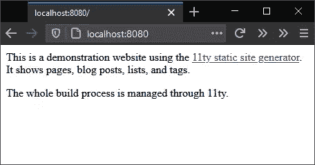
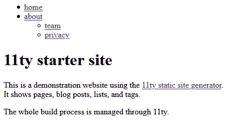
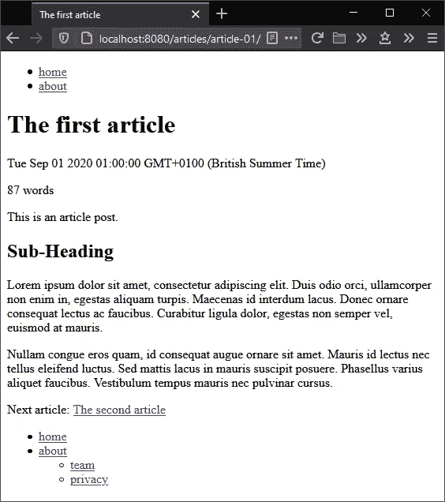
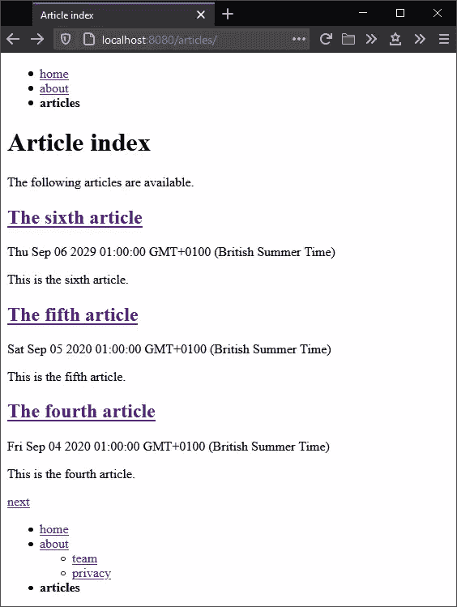
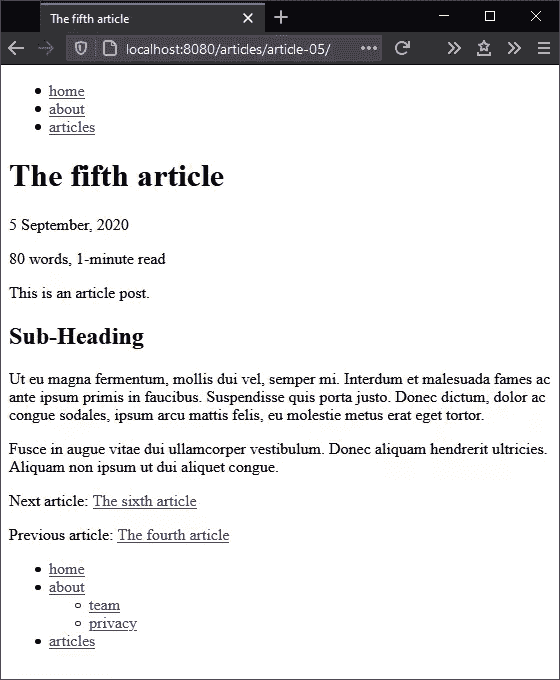
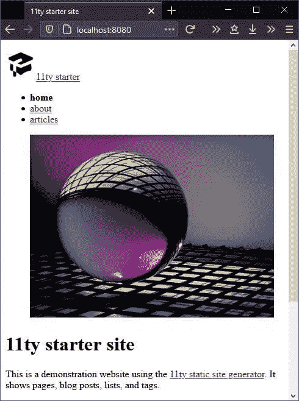
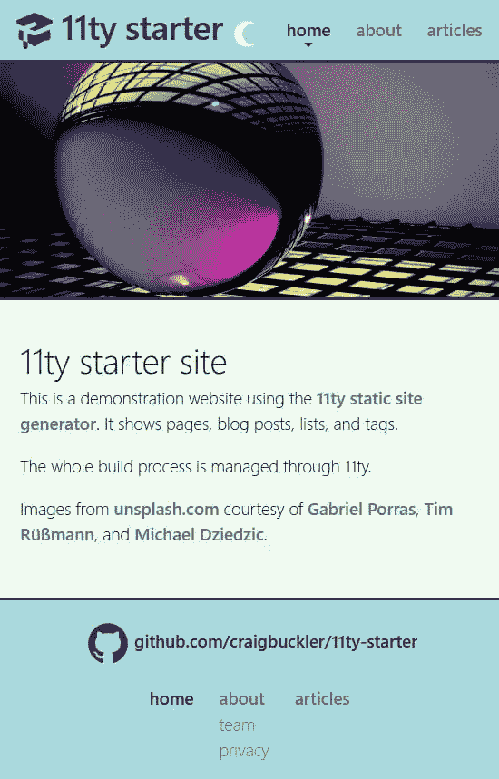

# 十一指南:一个框架无关的静态站点生成器

> 原文：<https://www.sitepoint.com/getting-started-with-eleventy/>

**第十一[(或 11ty)](https://www.11ty.dev/) 为 Node.js [静止站点生成器](https://www.sitepoint.com/static-site-generators/) (SSG)。SSG 在构建时完成大部分渲染工作，创建一组静态 HTML、CSS 和 JavaScript 文件。生成的页面不需要有服务器端的依赖项，比如运行时或数据库。**

这带来了几个主要好处:

*   托管很简单:你提供 HTML 文件
*   系统是安全的:没有东西可以入侵
*   性能可以很棒。

Eleventy 变得越来越受欢迎，并吸引了 web 开发领域知名人士的关注。它是内容网站和博客的理想选择，但也适用于在线商店和报告系统。

在大多数情况下，您将使用 Eleventy 从 Markdown 文档生成 HTML 页面，这些文档将内容插入到由引擎驱动的模板中，如[双截棍](https://mozilla.github.io/nunjucks/)。然而，本教程还演示了如何使用 Eleventy 作为所有资产的完整构建系统。你不一定需要一个独立的系统，比如 npm 脚本、webpack 或 Gulp.js，但是你仍然可以享受自动构建和实时重载。

## 需要 JavaScript 框架吗？

一些 SSG 采用客户端 JavaScript 框架，如 React 或 Vue.js。你可以使用 Eleventy 的框架，但这不是强制性的。

在我看来，*JavaScript 框架可能是不必要的，除非你正在创建一个复杂的应用*。如果你正在创建一个应用程序，SSG 并不是合适的工具！[盖茨比](https://www.gatsbyjs.com/)粉丝可能不同意，所以请[在推特上挑战/嘲讽我](https://twitter.com/craigbuckler)！

## 给我看看代码

Eleventy 声称很简单，但在超越基础时可能会令人望而生畏。本教程演示了如何建立一个包含页面和博客/文章帖子的简单网站——这是一个经常由 WordPress 处理的任务。

完整的代码可以在 https://github.com/craigbuckler/11ty-starter 获得。通过在终端中输入以下命令，您可以在 Windows、macOS 或 Linux 上下载、安装和启动它:

```
git clone https://github.com/craigbuckler/11ty-starter
cd 11ty-starter
npm i
npx eleventy --serve 
```

然后在浏览器中导航到位于 [http://localhost:8080](http://localhost:8080) 的主页。

下面的步骤描述了如何从头开始构建网站。

## 安装十一件

像任何 Node.js 项目一样，首先创建一个目录并初始化一个`package.json`文件:

```
mkdir mysite
cd mysite
npm init 
```

然后将 Eleventy 作为开发依赖项安装:

```
npm i @11ty/eleventy --save-dev 
```

注意:这个项目安装模块作为开发依赖，因为它们只需要在开发机器上运行。一些具有自动构建过程的主机可能要求您使用标准的运行时依赖项。

## 呈现您的第一页

创建一个将存放所有源文件的`src`目录，然后在其中创建一个`index.md`文件。添加主页内容，例如:

```
‐‐‐
title: 11ty starter site
‐‐‐

This is a demonstration website using the [11ty static site generator](https://www.11ty.dev/). It shows pages, blog posts, lists, and tags.

The whole build process is managed through 11ty. 
```

在`‐‐‐`破折号标记之间的内容被称为*前体*。它定义了关于页面的名称-值元数据，可以用来设置 Eleventy 和 templates 的参数。这里只设置了一个`title`,但是您将很快添加描述、日期、标签和其他数据。

必须在项目的根文件夹中创建一个名为`.eleventy.js`的第十一项配置文件。这个简单的示例代码返回一个对象，该对象指定以下内容:

1.  源文件的源`src`目录
2.  将创建网站文件的`build`目录

```
// 11ty configuration
module.exports = config => {

  // 11ty defaults
  return {

    dir: {
      input: 'src',
      output: 'build'
    }

  };
}; 
```

要构建站点并启动由 [Browsersync](https://www.browsersync.io/) 驱动的实时重载服务器，请输入以下内容:

```
npx eleventy --serve 
```

Eleventy 呈现它在`src`目录中找到的所有内容，并将结果内容输出到`build`:

```
$ npx eleventy --serve
Writing build/index.html from ./src/index.md.
Wrote 1 file in 0.12 seconds (v0.11.0)
Watching...
[Browsersync] Access URLs:
 ---------------------------------------
       Local: http://localhost:8080
    External: http://172.27.204.106:8080
 ---------------------------------------
          UI: http://localhost:3001
 UI External: http://localhost:3001
 ---------------------------------------
[Browsersync] Serving files from: build 
```

在这种情况下，可以通过在浏览器中加载 URL[http://localhost:8080](http://localhost:8080)来访问一个单独的`build/index.html`文件。



在`build/index.html`创建的 HTML 文件包含从`src/index.md`的降价文件呈现的内容:

```
<p>This is a demonstration website using the <a href="https://www.11ty.dev/">11ty static site generator</a>. It shows pages, blog posts, lists, and tags.</p>
<p>The whole build process is managed through 11ty.</p> 
```

十一号服务器可以用`Ctrl` | `Cmd` + `C`停止。

注意:在网站开发过程中很少需要停止 Eleventy，因为新文件会自动呈现。但是，下面几节添加了更多的配置选项，因此需要重新启动。

## 创建模板

Eleventy 几乎可以使用任何 JavaScript 模板引擎。[双截棍](https://mozilla.github.io/nunjucks/)是一个很好的选择，因为它很全面，并在 11ty.dev 的[文档中使用。](https://www.11ty.dev/docs/)

将`src/index.md`中的前面事项改为:

```
‐‐‐
title: 11ty starter site
description: This is a demonstration website generated using the 11ty static site generator.
layout: page.njk
‐‐‐ 
```

这指示 Eleventy 使用`page.njk`双截棍模板进行布局。默认情况下，Eleventy 在源目录(`src/`)的`_includes`子目录中查找模板。位于其中的任何文件本身都不会呈现，而是在构建过程中使用。

在`src/_includes/page.njk`创建这个新模板:

```


<main>


  <h1>{{ title }}</h1>

  {{ content | safe }}


</main>

 
```

该模板将页面首页中定义的`title`放在一个`<h1>`标题中，并用 Markdown 生成的 HTML 替换`{{ content }}`。(它使用 [`safe`双截棍滤镜](https://mozilla.github.io/nunjucks/templating.html#safe)输出 HTML，不转义引号和尖括号。)

两个``定义引用模板中包含的文件。在`src/_includes/partials/htmlhead.njk`创建一个 HTML 头文件，它也使用页面的`title`和`description`:

```
<!DOCTYPE html>
<html lang="en">
<head>
  <meta charset="UTF-8" />
  <meta name="viewport" content="width=device-width, initial-scale=1.0" />
  <title>{{ title }}</title>
  <meta name="description" content="{{ description }}">
</head>
<body> 
```

然后在`src/_includes/partials/htmlfoot.njk`创建 HTML 页脚:

```
</body>
</html> 
```

用`npx eleventy --serve`停止并重新启动电梯。

呈现的`build\index.html`文件现在包含一个完整的 HTML 页面:

```
<!DOCTYPE html>
<html lang="en">
<head>
  <meta charset="UTF-8" />
  <meta name="viewport" content="width=device-width, initial-scale=1.0" />
  <title>11ty starter site</title>
  <meta name="description" content="This is a demonstration website generated using the 11ty static site generator.">
</head>
<body>

  <h1>11ty starter site</h1>

  <p>This is a demonstration website using the <a href="https://www.11ty.dev/">11ty static site generator</a>. It shows pages, blog posts, lists, and tags.</p>
  <p>The whole build process is managed through 11ty.</p>

</body>
</html> 
```

*注意:当您在浏览器中查看源代码时，您还会看到 [BrowserSync](https://www.browsersync.io/) 在`<body>`元素后添加了一个`<script>`。这用于触发实时重新加载，不会出现在最终的构建中(参见下面的“构建生产站点”一节)。*

## 创建更多页面

您现在可以创建更多的内容，例如必须的“关于我们”部分。

`src/about/index.md`:

```
‐‐‐
title: About us
description: What we do.
‐‐‐

Some information about us. 
```

`src/about/team.md`:

```
‐‐‐
title: Our team
description: Information about us.
‐‐‐

Who are we and what we do. 
```

`src/about/privacy.md`:

```
‐‐‐
title: Privacy policy
description: We keep your details private.
‐‐‐

Our privacy policy. 
```

这些文件都没有引用模板。Eleventy 允许您通过创建一个`<directory-name>.json file`来为目录中的所有文件定义默认值。在本例中，它被命名为`src/about/about.json`。它设置 JSON 值，当它们没有在页面的前端显式定义时使用:

```
{
  "layout": "page.njk"
} 
```

重新运行`npx eleventy --serve`并检查`build`文件夹，看看网站是如何开始成形的:

*   `index.html`:首页
*   `about/index.html`:关于我们页面
*   `about/team/index.html`:团队页面
*   `about/privacy/index.html`:隐私政策页面

因此，您可以在浏览器中使用类似 slug 的 URL。例如，[http://localhost:8080/about/team/](http://localhost:8080/about/team/)显示团队页面`index.html`文件。

遗憾的是，无法在页面间导航！*你需要一份菜单……*

## 创建导航菜单

Eleventy 提供了一个标准的[导航插件](https://www.11ty.dev/docs/plugins/navigation/)，通过输入以下内容进行安装:

```
npm i @11ty/eleventy-navigation --save-dev 
```

插件必须在最后的`return`语句之前在`.eleventy.js`配置文件中被引用:

```
// 11ty configuration
module.exports = config => {

  /* --- PLUGINS --- */

  // navigation
  config.addPlugin( require('@11ty/eleventy-navigation') );

  // 11ty defaults
  return {

    dir: {
      input: 'src',
      output: 'build'
    }

  };
}; 
```

必须在你想要的菜单的每一页中定义首页部分。该部分设置了以下内容:

1.  页面菜单的一个`key`。这可能与`title`相同，但通常更短。
2.  可选的`parent`，它引用父页面的`key`。
3.  可选的`order`号；较低的值首先出现在菜单中。

`src/index.md`中的首页封面内容可以相应更新:

```
‐‐‐
title: 11ty starter site
description: This is a demonstration website generated using the 11ty static site generator.
layout: page.njk
eleventyNavigation:
  key: home
  order: 100
‐‐‐ 
```

`src/about/index.md`的关于页面:

```
‐‐‐
title: About us
description: What we do.
eleventyNavigation:
  key: about
  order: 200
‐‐‐ 
```

团队页面在`src/about/team.md`:

```
‐‐‐
title: Our team
description: Information about us.
eleventyNavigation:
  key: team
  parent: about
  order: 210
‐‐‐ 
```

位于`src/about/privacy.md`的隐私政策页面:

```
‐‐‐
title: Privacy policy
description: We keep your details private.
eleventyNavigation:
  key: privacy
  parent: about
  order: 220
‐‐‐ 
```

*注意:使用 10 的倍数或更大的`order`值允许以后在其他页面之间插入页面，而无需任何手动重新编号。*

导航菜单现在可以添加到页面模板的`src/_includes/page.njk`:

```


<header>
  <nav>
    {{ collections.all | eleventyNavigation | eleventyNavigationToHtml | safe }}
  </nav>
</header>

<main>
... 
```

这是一些神奇的 11 个插件代码，它检查所有的页面并用一个`eleventyNavigation()`函数过滤它们以创建一个层次列表。使用一个`eleventyNavigationToHtml()`函数将该列表呈现为 HTML。

重启`npx eleventy --serve`加载任意页面查看菜单。



您现在可以导航到`eleventyNavigation` front matter 中定义的任何页面。

## 改善导航

导航插件返回一个基本的 HTML 列表:

```
<ul>
  <li><a href="/">home</a></li>
  <li>
    <a href="/about/">about</a>
    <ul>
      <li><a href="/about/team/">team</a></li>
      <li><a href="/about/privacy/">privacy</a></li>
    </ul>
  </li>
</ul> 
```

这对于大多数网站来说已经足够了，但是你可以改进它。例如:

*   提供一个选项来显示特定级别的菜单，例如仅在页眉中显示顶级菜单，在页脚中显示所有页面
*   突出显示活动页面，同时使其不可点击
*   为活动和打开的菜单项设置样式类。

实现这一点的一个方法是创建一个可重用的*简码*，这对于任何使用过 WordPress 的人来说都是熟悉的。shortcode 和任何可选参数运行一个函数，该函数返回放置在模板中的 HTML 字符串。

停止您的 Eleventy 服务器并更新`src/_includes/page.njk`模板，在`<header>`和`<footer>`部分使用``短代码:

```


<header>
  <nav>
    
  </nav>
</header>

<main>


  <h1>{{ title }}</h1>

  {{ content | safe }}


</main>

<footer>
  <nav>
    
  </nav>
</footer>

 
```

向`navlist`短代码传递三个参数:

1.  通过`eleventyNavigation()`函数过滤的每个页面，该函数返回页面对象的分层列表。每个页面都定义了一个子页的`children`数组。
2.  当前的`page`。
3.  一个可选的`level`。值`1`只返回顶层的 HTML。`2`返回顶层和所有直接子页面。

在`return`语句之前，必须使用`.eleventy.js`中的`.addShortcode()`函数注册`navlist`短代码。它传递了一个短代码名称和要调用的函数:

```
 /* --- SHORTCODES --- */

  // page navigation
  config.addShortcode('navlist', require('./lib/shortcodes/navlist.js')); 
```

您现在可以在`lib/shortcodes/navlist.js`中导出一个函数。下面的代码递归地检查所有页面，以生成适当的 HTML(如果很难理解，不用担心)。

*注意:shortcode 文件是在`src`文件夹之外创建的，因为它不是站点的一部分，但是你也可以在`src/_includes`中定义它。*

```
// generates a page navigation list
const
  listType      = 'ul',
  elementActive = 'strong',
  classActive   = 'active',
  classOpen     = 'open';

// pass in collections.all | eleventyNavigation, (current) page, and maximum depth level
module.exports = (pageNav, page, maxLevel = 999) => {

  function navRecurse(entry, level = 1) {

    let childPages = '';

    if (level < maxLevel) {
      for (let child of entry.children) {
        childPages += navRecurse(child, level++);
      }
    }

    let
      active = (entry.url === page.url),
      classList = [];

    if ((active && childPages) || childPages.includes(`<${ elementActive }>`)) classList.push(classOpen);
    if (active) classList.push(classActive);

    return (
      '<li' +
      (classList.length ? ` class="${ classList.join(' ') }"` : '') +
      '>' +
      (active ? `<${ elementActive }>` : `<a href="${ entry.url }">`) +
      entry.title +
      (active ? `</${ elementActive }>` : '</a>') +
      (childPages ? `<${ listType }>${ childPages }</${ listType }>` : '') +
      '</li>'
    );

  }

  let nav = '';
  for (let entry of pageNav) {
    nav += navRecurse(entry);
  }

  return `<${ listType }>${ nav }</${ listType }>`;

}; 
```

重新运行`npx eleventy --serve`并导航至**关于**页面。标题`<nav>` HTML 现在包含以下内容:

```
<ul>
  <li><a href="/">home</a></li>
  <li class="active"><strong>about</strong></li>
</ul> 
```

页脚`<nav>` HTML 包含以下内容:

```
<ul>
  <li><a href="/">home</a></li>
  <li class="open active">
    <strong>about</strong>
    <ul>
      <li><a href="/about/team/">team</a></li>
      <li><a href="/about/privacy/">privacy</a></li>
    </ul>
  </li>
</ul> 
```

## 添加文章/博客文章

文章或博客文章不同于标准页面。它们通常都标有日期，并按时间倒序显示在索引页上。

创建一个新的`src/articles`目录并添加一些降价文件。在这个例子中，已经创建了六个名为`artice-01.md`到`article-06.md`的文件，尽管您通常会使用更好的名称来创建更易读的 SEO 友好的 URL。

`article/article-01.md`的示例内容:

```
‐‐‐
title: The first article
description: This is the first article.
date: 2020-09-01
tags:
  - HTML
  - CSS
‐‐‐

This is an article post.

## Subheading

Lorem ipsum dolor sit amet, consectetur adipiscing elit. 
```

每篇文章都被分配了一个日期和一个或多个标签(这里使用了`HTML`和`CSS`)。Eleventy 自动为每个标签创建一个 [*集合*](https://www.11ty.dev/docs/collections/) 。例如，`HTML`集合是所有贴有`HTML`标签的文章的数组。您可以使用该集合以有趣的方式索引或显示这些页面。

最近的`article-06.md`文件有一个`draft`值集和一个遥远未来的日期:

```
‐‐‐
title: The sixth article
description: This is the sixth article.
draft: true
date: 2029-09-06
tags:
  - HTML
  - CSS
  - JavaScript
‐‐‐ 
```

这表明在日期过去并且`draft`被移除之前，帖子不应该被发布(在实时站点上)。Eleventy 没有实现这个功能，所以您必须创建自己的自定义集合，其中省略了草稿文章。

在`.eleventy.js`的顶部添加几行来检测开发模式并返回当前日期时间:

```
// 11ty configuration
const
  dev  = global.dev  = (process.env.ELEVENTY_ENV === 'development'),
  now = new Date();

module.exports = config => {
...
} 
```

然后通过在`return`语句之前调用`.addCollection()`来定义一个名为`post`的集合。下面的代码提取了`src/articles`目录中的所有`md`文件，但删除了所有设置了`draft`或未来发布日期的文件(除非您使用的是开发模式):

```
 // post collection (in src/articles)
  config.addCollection('post', collection =>

    collection
      .getFilteredByGlob('./src/articles/*.md')
      .filter(p => dev || (!p.data.draft && p.date <= now))

  ); 
```

为帖子创建新的`src/_includes/post.njk`模板。这是基于`page.njk`模板的，但是`content`块也显示了从这个`post`集合中提取的文章日期、字数和下一个/上一个链接:

```




  <h1>{{ title }}</h1>

  <p class="time"><time datetime="{{ date }}">{{ date }}</time></p>

  <p class="words">{{ content | wordcount }} words</p>

  {{ content | safe }}

  
  <p>Next article: <a href="{{ nextPost.url }}">{{ nextPost.data.title }}</a></p>

  
  <p>Previous article: <a href="{{ previousPost.url }}">{{ previousPost.data.title }}</a></p>

 
```

最后，定义一个`src/articles/article.json`文件，将`post.njk`设置为默认模板:

```
{
  "layout": "post.njk"
} 
```

运行`npx eleventy --serve`，导航到[http://localhost:8080/articles/article-01/](http://localhost:8080/articles/article-01/):



## 创建文章/博客索引页面

虽然您可以从一篇文章导航到另一篇文章，但在[http://localhost:8080/articles/](http://localhost:8080/articles/)创建一个索引页面来按时间倒序显示所有文章(最新的放在最前面)会很有用。

Eleventy 提供了一个 [*分页*工具](https://www.11ty.dev/docs/pagination/)，它可以通过迭代一组数据来创建任意数量的页面——比如上面创建的`posts`集合。

在`src/articles/index.md`创建一个新文件，内容如下:

```
‐‐‐
title: Article index
description: A list of articles published on this site.
layout: page.njk
eleventyNavigation:
  key: articles
  order: 900
pagination:
  data: collections.post
  alias: pagelist
  reverse: true
  size: 3
‐‐‐

The following articles are available. 
```

前部物质配置执行以下操作:

1.  它设置标准的`page.njk`模板。
2.  它将页面添加为一个`articles`菜单项。
3.  它从`collections.post`中创建一个名为`pagelist`的列表，反转它(最新的帖子优先)，并且每页最多允许三个条目。有了六篇文章，Eleventy 将生成两个页面，每个页面上有三篇文章。

现在修改`src/_includes/page.njk`中的`content`块，以包含一个新的`pagelist.njk`部分:

```


  <h1>{{ title }}</h1>

  {{ content | safe }}

  

 
```

用代码在`src/_includes/partials/pagelist.njk`创建部分内容，循环遍历`pagelist`分页对象，并输出每篇文章链接、标题、日期和描述:

```

<aside class="pagelist">

  
  <article>

    <h2><a href="{{ post.url }}">{{ post.data.title }}</a></h2>

    <p class="time"><time datetime="{{ post.data.date }}">{{ post.data.date }}</time></p>

    <p>{{ post.data.description }}</p>

  </article>
  

</aside>
 
```

在这段代码下面，您可以添加**下一个**和**上一个**链接来浏览分页索引:

```

<nav class="pagenav">

  
    <p><a href="{{ pagination.href.previous }}">previous</a></p>
  

  
    <p><a href="{{ pagination.href.next }}">next</a></p>
  

</nav>
 
```

在重新开始构建过程之前，将`ELEVENTY_ENV`环境变量设置为`development`,以确保构建中包含草稿和将来的帖子。在 Linux/macOS 上，输入:

```
ELEVENTY_ENV=development 
```

或者在 Windows `cmd`提示符下:

```
set ELEVENTY_ENV=development 
```

或 Windows Powershell:

```
$env:ELEVENTY_ENV="development" 
```

重新运行`npx eleventy --serve`并刷新浏览器。一个新的**文章**链接将出现在菜单中，该链接显示在[http://localhost:8080/articles/](http://localhost:8080/articles/)的三篇最新文章:



下一个的**链接指向[http://localhost:8080/articles/1/](http://localhost:8080/articles/1/)的另一页文章。**

## 创建自定义过滤器

上面的截图显示日期是不友好的 JavaScript 字符串。Eleventy 提供了[过滤器](https://www.11ty.dev/docs/filters/)，可以修改数据并返回一个字符串。当 Markdown 生成的内容通过一个`safe`过滤器输出未编码的 HTML: `{{ content | safe }}`时，您已经看到了这种用法。

用下面的代码创建一个新的`lib/filters/dateformat.js`文件。它导出两个函数:

1.  `ymd()`将日期转换为 HTML `datetime`属性的机器可读`YYYY-MM-DD`格式，以及
2.  `friendly()`将日期转换为人类可读的格式，例如`1 January, 2020`。

```
// date formatting functions
const toMonth = new Intl.DateTimeFormat('en', { month: 'long' });

// format a date to YYYY-MM-DD
module.exports.ymd = date => (

  date instanceof Date ?
    `${ date.getUTCFullYear() }-${ String(date.getUTCMonth() + 1).padStart(2, '0') }-${ String(date.getUTCDate()).padStart(2, '0') }` : ''

);

// format a date to DD MMMM, YYYY
module.exports.friendly = date => (

  date instanceof Date ?
    date.getUTCDate() + ' ' + toMonth.format(date) + ', ' + date.getUTCFullYear() : ''

); 
```

您还可以创建一个过滤器，显示帖子中的字数(四舍五入到最接近的 10 位，用逗号分隔符格式化)以及估计的阅读时间。用以下代码创建`lib/filters/readtime.js`:

```
// format number of words and reading time
const
  roundTo     = 10,
  readPerMin  = 200,
  numFormat   = new Intl.NumberFormat('en');

module.exports = count => {

  const
    words     = Math.ceil(count / roundTo) * roundTo,
    mins      = Math.ceil(count / readPerMin);

  return `${ numFormat.format(words) } words, ${ numFormat.format(mins) }-minute read`;

}; 
```

在`return`语句之前的任何地方注册`.eleventy.js`中的过滤器:

```
 /* --- FILTERS --- */

  // format dates
  const dateformat = require('./lib/filters/dateformat');
  config.addFilter('datefriendly', dateformat.friendly);
  config.addFilter('dateymd', dateformat.ymd);

  // format word count and reading time
  config.addFilter('readtime', require('./lib/filters/readtime')); 
```

然后更新`src/_includes/post.njk`以使用`dateymd`、`datefriendly`和`readtime`过滤器:

```
 <p class="time"><time datetime="{{ date | dateymd }}">{{ date | datefriendly }}</time></p>

  <p class="words">{{ content | wordcount | readtime }}</p> 
```

然后在`src/_includes/partials/pagelist.njk`更改文章索引部分以使用`dateymd`和`datefriendly`过滤器:

```
<p class="time"><time datetime="{{ post.data.date | dateymd }}">{{ post.data.date | datefriendly }}</time></p> 
```

用`npx eleventy --serve`重启构建并刷新浏览器。加载任何文章以查看友好日期、格式化字数和阅读时间估计:



产生的 HTML:

```
<p class="time"><time datetime="2020-09-05">5 September, 2020</time></p>

<p class="words">80 words, 1-minute read</p> 
```

## 用 JavaScript 模板处理图像

Eleventy 可以使用`.eleventy.js`中的`.addPassthroughCopy()`功能从任何文件夹中复制文件。例如，要将`simg/`中的所有文件复制到`buiimg/`，您应该添加:

```
config.addPassthroughCopy('src/images'); 
```

如果您的映像已经过优化，这可能就足够了，但是自动构建时优化保证了文件的减少。在这一点上，开发人员通常会求助于另一个系统，如`npm`脚本、webpack 或 Gulp.js，但这可能不是必需的。

[JavaScript 是 Eleventy](https://www.11ty.dev/docs/languages/javascript/) 中的一流模板选项。任何以`.11ty.js`结尾的文件都将在构建过程中被处理。该文件必须导出一个 JavaScript `class`,包含:

1.  一个`data()`方法，它以 JavaScript 对象的形式返回前台设置
2.  一个`render()`方法——通常返回一个字符串，但它也可以运行同步或异步流程并返回`true`。

为了缩小图像尺寸，安装 [imagemin](https://www.npmjs.com/package/imagemin) 和 [JPEG](https://www.npmjs.com/package/imagemin-mozjpeg) 、 [PNG](https://www.npmjs.com/package/imagemin-pngquant) 和 [SVG](https://www.npmjs.com/package/imagemin-svgo) 文件的插件:

```
npm i imagemin imagemin-mozjpeg imagemin-pngquant imagemin-svgo --save-dev 
```

在`src`中创建一个`images`目录，添加一些图片，然后用下面的代码创建一个新的`simg/images.11ty.js`文件:

```
// image minification
const
  dest = './build/images',

  fsp = require('fs').promises,
  imagemin = require('imagemin'),
  plugins = [
    require('imagemin-mozjpeg')(),
    require('imagemin-pngquant')({ strip: true }),
    require('imagemin-svgo')()
  ];

module.exports = class {

  data() {

    return {
      permalink: false,
      eleventyExcludeFromCollections: true
    };

  }

  // process all files
  async render() {

    // destination already exists?
    try {
      let dir = await fsp.stat(dest);
      if (dir.isDirectory()) return true;
    }
    catch(e){}

    // process images
    console.log('optimizing images');

    await imagemin(['simg/*', '!simg/*.js'], {
      destination: dest,
      plugins
    });

    return true;

  }
}; 
```

重新运行`npx eleventy --serve`，图像的优化版本将被复制到`buiimg/`文件夹中。

*注意:如果找到一个`build/images`目录，上面的代码结束。这是一个简单的解决方案，可以在每次构建时放弃重新处理相同的图像，并确保 Eleventy 保持快速。如果您添加更多图像，请先删除`build/images`文件夹以确保它们都已生成。有更好的选择，但是它们需要更多的代码！*

现在可以在 Markdown 或模板文件中添加图像。例如，`src/_includes/page.njk`中定义的`<header>`可以有 logo 和英雄形象:

```
<header>

  <p class="logo"><a href="/">11ty starter</a></p>

  <nav>
    
  </nav>

  <figure></figure>

</header> 
```

如有必要，可在前端设置一个`hero`值，例如在`src/articles/articles.json`中:

```
{
  "layout": "post.njk",
  "hero": "phone.jpg"
} 
```



## 用转换处理 CSS

你可以用类似的方式处理 CSS 或者使用任何其他的构建系统。然而，[十一项变换](https://www.11ty.dev/docs/config/#transforms)在这种情况下是一个很好的选择。转换是传递当前呈现的字符串内容和文件路径的函数。然后，他们返回该内容的修改版本。

我考虑过使用 [Sass](https://sass-lang.com/) 进行 CSS 预处理，但是[postscs](https://postcss.org/)加上几个插件可以实现一个轻量级的替代方案，仍然支持部分、变量、混合和嵌套。在项目中安装 PostCSS 模块:

```
npm i postcss postcss-advanced-variables postcss-nested postcss-scss cssnano --save-dev 
```

然后用下面的代码创建一个`lib/transforms/postcss.js`文件。当构建在`development`模式下运行时，它在处理、缩小和添加源地图之前验证是否传递了一个`.css`文件:

```
// PostCSS CSS processing

/* global dev */

const
  postcss = require('postcss'),
  postcssPlugins = [
    require('postcss-advanced-variables'),
    require('postcss-nested'),
    require('cssnano')
  ],
  postcssOptions = {
    from: 'src/scss/entry.scss',
    syntax: require('postcss-scss'),
    map: dev ? { inline: true } : false
  };

module.exports = async (content, outputPath) => {

  if (!String(outputPath).endsWith('.css')) return content;

  return (
    await postcss(postcssPlugins).process(content, postcssOptions)
  ).css;

}; 
```

必须在`return`语句之前使用`.eleventy.js`中的`.addTransform()`函数注册转换。每当`src/scss/`目录中的文件发生变化时，`.addWatchTarget()`调用将触发完整的站点重建:

```
 // CSS processing
  config.addTransform('postcss', require('./lib/transforms/postcss'));
  config.addWatchTarget('./src/scss/'); 
```

创建一个`src/scss/main.scss`文件，包含你需要的任何 SCSS 或 CSS 代码。[示例代码](https://github.com/craigbuckler/11ty-starter/blob/master/src/scss/main.scss)进一步导入 SCSS 文件:

```
// settings
@import '01-settings/_variables';
@import '01-settings/_mixins';

// reset
@import '02-generic/_reset';

// elements
@import '03-elements/_primary';

// etc... 
```

Eleventy 不会直接处理 CSS 或 s CSS 文件，所以您必须用下面的代码在`src/scss/main.njk`创建一个新的模板文件:

```
‐‐‐
permalink: /css/main.css
eleventyExcludeFromCollections: true
‐‐‐
@import 'main.scss'; 
```

这将导入您的`main.scss`文件，并在 transform 函数对其进行相应处理之前将其呈现给`build/css/main.css`。如果你需要一个以上的 CSS 文件，可以创建类似的 SCSS/CSS 和`.njk`文件。

重新运行`npx eleventy --serve`并检查构建到`build/css/main.css`的 CSS 文件的内容。源映射确保在浏览器的开发人员工具中检查样式时，CSS 声明的原始源文件位置可用。

## 用转换缩小 HTML

一个类似的转换可以用来用 [html-minifier](https://www.npmjs.com/package/html-minifier) 缩小 HTML。像这样安装它:

```
npm i html-minifier --save-dev 
```

用下面的代码创建一个新的`lib/transforms/htmlminify.js`文件。它验证一个`.html`文件正在被处理，并返回一个缩小的版本:

```
// minify HTML
const htmlmin = require('html-minifier');

module.exports = (content, outputPath = '.html') => {

  if (!String(outputPath).endsWith('.html')) return content;

  return htmlmin.minify(content, {
    useShortDoctype: true,
    removeComments: true,
    collapseWhitespace: true
  });

}; 
```

如前所述，在`return`语句之前的某个地方注册`.eleventy.js`中的转换:

```
 // minify HTML
  config.addTransform('htmlminify', require('./lib/transforms/htmlminify')); 
```

*注意:你可以考虑在开发过程中不缩小甚至[美化](https://github.com/beautify-web/js-beautify) HTML。也就是说，HTML 空白会影响浏览器的呈现，所以通常最好以与生产相同的方式构建代码。源代码查看将变得更加困难，但是浏览器开发人员工具会显示结果 DOM。*

## 用变换内联资产

通常有必要在 HTML 中嵌入其他资源。SVG 是主要的候选对象，因为图像成为 DOM 的一部分，可以用 CSS 来操作。通过在`<style>`元素中内联 CSS，在`<script>`元素中内联 JavaScript，或者在``元素中内联 base64 编码的图像，也可以减少 HTTP 请求。

[inline-source](https://www.npmjs.com/package/inline-source) 模块可以为您处理所有情况。用这个安装它:

```
npm i inline-source --save-dev 
```

现在用下面的代码添加一个新的`lib/transforms/inline.js`文件来检查和处理 HTML 内容:

```
// inline data
const { inlineSource } = require('inline-source');

module.exports = async (content, outputPath) => {

  if (!String(outputPath).endsWith('.html')) return content;

  return await inlineSource(content, {
    compress: true,
    rootpath: './build/'
  });

}; 
```

在`return`语句前的`.eleventy.js`中注册转换:

```
 // inline assets
  config.addTransform('inline', require('./lib/transforms/inline')); 
```

现在将`inline`属性添加到任何``、`<link>`或`<script>`标签中。例如:

```
 
```

在构建期间，转换将用导入的`<svg>`代码替换``标签。

## 用 JavaScript 模板处理 JavaScript

客户端 JavaScript 可以用转换来处理，但是名为`<something>.11ty.js`的 JavaScript 模板也是一个选项，因为它们是由 Eleventy 自动处理的(参见上面的“用 JavaScript 模板处理图像”一节)。

[示例代码](https://github.com/craigbuckler/11ty-starter/tree/master/src/js)提供了 ES6 脚本来实现简单的暗/亮主题切换。 [Rollup.js](https://rollupjs.org/) 用于将`main.js`引用的所有模块捆绑成一个文件，并执行*树摇动*来移除任何未使用的函数。然后，这个 [terser 插件](https://www.npmjs.com/package/rollup-plugin-terser)会缩小结果代码。

使用以下内容安装 Rollup.js 模块:

```
npm i rollup rollup-plugin-terser --save-dev 
```

然后在`src`中创建一个`js`目录，并添加您的 ES6 脚本。必须定义一个单独的`src/js/main.js`输入脚本，它会导入其他脚本。例如:

```
import * as theme from './lib/theme.js'; 
```

使用以下代码创建一个新的`src/js/javascript.11ty.js`文件，将`src/js/main.js`处理成一个包，并在开发模式下构建时添加一个源映射:

```
// JavaScript processing

/* global dev */

const
  jsMain = 'js/main.js',

  rollup = require('rollup'),
  terser = require('rollup-plugin-terser').terser,

  inputOpts = {
    input: './src/' + jsMain
  },

  outputOpts = {
    format: 'es',
    sourcemap: dev,
    plugins: [
      terser({
        mangle: {
          toplevel: true
        },
        compress: {
          drop_console: !dev,
          drop_debugger: !dev
        },
        output: {
          quote_style: 1
        }
      })
    ]
  }
  ;

module.exports = class {

  data() {

    return {
      permalink: jsMain,
      eleventyExcludeFromCollections: true
    };

  }

  // PostCSS processing
  async render() {

    const
      bundle = await rollup.rollup(inputOpts),
      { output } = await bundle.generate(outputOpts),
      out = output.length && output[0];

    let code = '';
    if (out) {

      // JS code
      code = out.code;

      // inline source map
      if (out.map) {
        let b64 = new Buffer.from(out.map.toString());
        code += '//# sourceMappingURL=data:application/json;base64,' + b64.toString('base64');
      }

    }

    return code;

  }
}; 
```

对 JavaScript 文件的任何更改都可以通过在`return`前的`.eleventy.js`中添加下面一行来触发重建:

```
 config.addWatchTarget('./src/js/'); 
```

生成的脚本可以包含在您的页面中—例如，在`src/_includes/partials/htmlfoot.njk`中:

```
<script type="module" src="/js/main.js"></script>

</body>
</html> 
```

*注意:示例代码构建 ES6 模块，而不是转换到 ES5。脚本更小，但浏览器兼容性会更有限。也就是说，这是一个渐进的改进，网站不需要 JavaScript 也能工作。*

重启`npx eleventy --serve`，你的精简脚本将会加载并运行。最终的网站现在可以看到它获奖的荣耀:



## 建立一个生产站点

一旦你对你的站点满意了，你就可以在没有源地图和其他开发选项的情况下在生产模式下构建它。

删除`build`文件夹，在 Linux/macOS 上设置`ELEVENTY_ENV`为`production`:

```
ELEVENTY_ENV=production 
```

或者 Windows `cmd`提示:

```
set ELEVENTY_ENV=production 
```

或 Windows Powershell:

```
$env:ELEVENTY_ENV="production" 
```

然后运行`npx eleventy`来构建完整的站点。

`/build`目录中的结果文件可以上传到任何主机。一些静态站点专家服务可以在新代码被推送到 GitHub 或类似的存储库时自动构建和发布您的站点。

## 您对 Eleventy 的后续步骤

这个[示例项目](https://github.com/craigbuckler/11ty-starter)展示了 Eleventy 的基础知识，以及构建不同类型内容的一些选项。然而，Eleventy 是灵活的，您可以自由地使用您喜欢的任何技术。T2 有几十个启动项目，每个项目采取的方法都略有不同。

对网站其他功能的建议:

*   为列出相关文章的每个标签创建一个索引页面。记住，Eleventy 会自动为每个标签创建单独的集合。
*   生成一个列出所有帖子的 RSS `feed.xml`文件。
*   创建一个 [`sitemap.xml`](https://www.sitemaps.org/) 文件列出所有页面。
*   构建一个 404 错误页面并生成适当的代码来处理它(比如 Apache 的一个`.htaccess`文件)。
*   生成其他根文件，如`favicon.ico`或服务人员。
*   使用 Eleventy 的分页特性从数据生成页面[。](https://www.11ty.dev/docs/pages-from-data/)
*   并为将 WordPress 内容导入静态页面获得加分。

## 十一对你来说是吗？

静态站点生成器是任何主要提供不经常改变的内容的网站的理想解决方案。页面可以在 Git 存储库中进行版本控制，开发更容易控制，测试更简单，性能非常好，安全性问题也消失了。*(服务器日志中所有失败的`wp-login.php`尝试都让我开怀大笑！)*

有[许多 SSG 可以从](https://www.staticgen.com/)中选择，但是如果你:

*   不熟悉 SSGs 或对您当前的选择不满意
*   喜欢 Node.js 并希望在开发过程中使用 JavaScript
*   想跳上最新酷的东西！

祝你好运！

使用我们的 [Jamstack Foundations](https://www.sitepoint.com/learn-jamstack/#foundations) 集合来了解 Jamstack，在这里，我们整理了 Jamstack 和 Jamstack 工具(如 Eleventy)上的指南和操作内容，以最好地帮助您学习。

## 分享这篇文章