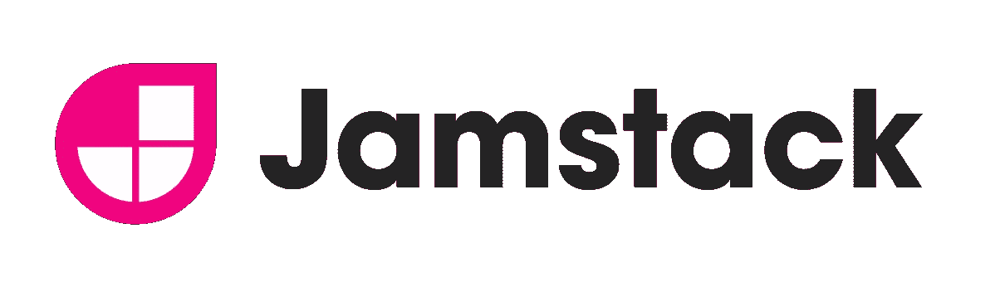

# Jamstack 简介:构建安全、高性能的站点

> 原文：<https://www.sitepoint.com/learn-jamstack/>

web 开发时常会出现戏剧性的好转。在本文中，我们将介绍 Jamstack，解释它是什么以及为什么它很棒。

在过去，动态站点随着灯堆爆炸。然后，MEAN stack 为下一代网络应用提供了基础。随着 API 和可重用组件的兴起，静态站点再次流行起来。这算是一种“返璞归真”——但也不尽然。

## 什么是 Jamstack？

<small>提供:Netlify</small>

Jamstack 是 T2 对现代网络的重新定义，旨在提供更快、更安全的网站。这些站点可伸缩性更好，并且使用合适的工具集，开发和维护起来更容易(也更有趣)。

我们来分解一下这个术语:

*   **J 代表 JavaScript** 。自从网景公司在 1995 年推出 JS 以来，它已经在 T2 走过了漫长的道路。有了反应式和渐进式库，你可以设计出行为非常像移动应用的 web 应用。
*   **A 代表 API**。您不需要自己编写每一个功能，但是可以依靠第三方处理大量的任务。
*   **M 代表标记**。您可以重用已经开发的组件，或者创建更容易维护的新组件。

### 那不就是巴兹吗？

在某种程度上，是的。术语 [Jamstack](https://www.netlify.com/jamstack/) ，最初被程式化为 Jamstack，是由 [Netlify](https://www.netlify.com/) 公司创造的，作为一种推广他们“自动化现代 web 项目的一体化平台”的方式[jam stack 背后的原则](https://jamstack.org/best-practices/)其实并不新鲜，因为 web 组件和 API 已经存在了很长时间。

但是，以非常相似的方式，术语 [Ajax](https://en.wikipedia.org/wiki/Ajax_(programming)) (异步 JavaScript 和 XML)是由另一家公司在过去创造的——[Adaptive Path](https://adaptivepath.com/)——尽管使 Ajax 成为可能的 [XMLHttpRequest](https://en.wikipedia.org/wiki/XMLHttpRequest) (XHR) API 也存在了一段时间，**Ajax 和 JAMstack 都是合法使用的概念的更新**，很快被社区采用。炒作是当之无愧的:这种工作方式对世界各地的许多开发人员来说是一种启示。

### 静态网站？

“静态网站”是“动态网站”的对立面，对吗？那么，如何用普通的 HTML 文件提供丰富的动态交互呢？嗯，JavaScript。

自从第一次浏览器大战以来，JavaScript 已经有了很大的发展，随着 T2 node . js T3 的出现，以及 T4 React T5、T6 Angular T7 和 T8 vue . js T9 等库的出现，JavaScript 已经巩固了自己作为通用编程语言的地位。设计高级用户界面(UI)的可能性是无限的。

当然，JavaScript 不是灵丹妙药。你很可能不会用它做数据分析或人工智能。但是对于 web 开发，几乎没有什么是你不能用 JavaScript 方法使用的 API 做不到的，因为很可能有人已经为它创建了一个微服务。

此外，如果您可以"["将所有带有标记的流程封装到一个可重用的组件中——无论何时您需要特定的功能，您都可以直接插入——您每次都可以节省大量的工作时间。](https://en.wikipedia.org/wiki/Encapsulation_(computer_programming))

这就是 J A M 栈:JavaScript、API、标记。

[https://www.youtube.com/embed/1ZfMpG6ML-w](https://www.youtube.com/embed/1ZfMpG6ML-w)

## 解耦、无头、微服务、无服务器……不好意思，什么？

所有这些都是 web 开发中的热门话题，它们都密切相关，但又不完全相同。你会经常听到这些术语，所以让我们从一开始就澄清一些术语。

### 耦合与去耦和无头

**耦合**是指网站的内容被创建、管理并存储在网站的后端，也就是数据库所在的地方(比如 WordPress admin)。然后从后端提取这些内容，并通过前端界面(比如 WordPress 模板)在浏览器中显示出来。在某种程度上，*“耦合”应用是传统的“全栈”，后端和前端*是同一个应用的不同方面。

相比之下，**解耦**是指后端和前端分开管理——这意味着*数据库和管理工具将在一台服务器上，而前端在其他地方*。自然，需要有一个媒介将两者连接起来，通常是一个 API。更重要的是，由于后端现在已经有效地与前端分离，实际上可能会有几个前端位于不同的位置！(想想不同的店面使用相同的引擎，比如 Shopify。)

简单来说，**无头**软件*根本就没有前端或者表示层*。例如，[的无头 CMS](https://en.wikipedia.org/wiki/Headless_content_management_system) 可以生成静态内容，并将其推送到任何地方:一个移动应用程序、一个物联网设备、一个静态网站。不可否认，这也是一种“解耦”的情况，但是这里你甚至不需要 API。想想一个 WordPress 引擎，它将自己的文章导出为静态 HTML 文件:这是无头的。事实上，你现在[在一个完全以这种方式](https://www.sitepoint.com/our-gatsby-redesign/)生成的页面上。

### 整体(紧密耦合)与微服务(松散耦合)

简单地说，**单片**可以被定义为*软件，它被构建成一个整体*。示例可能包括移动应用程序、可以安装在电脑上的大多数应用程序以及 WordPress 等 web 应用程序。这些应用程序仍然可以有内部“模块”或“组件”，但我们说这些是紧密耦合的*因为它们是应用程序不可或缺的一部分，没有它们应用程序就无法工作。*

另一方面，**松散耦合的**软件组件工作起来更像是*插件，可以被移除或替换*，也许功能会改变，但应用程序的核心仍将工作。这一原则允许通过第三方 API“外包”功能，通常称为“微服务”，因为它们提供次要功能(图像大小调整、登录、存储)，这些功能本身不是应用程序不可或缺的一部分。

### 无服务器与传统计算

不可否认，“无服务器”有点用词不当。无论你从事哪种计算事业，都会涉及到服务器。但是您访问和管理服务器的方式可能完全不同。

在**传统模式**中，你可能有一个实际的物理服务器(有时被称为[裸机](https://en.wikipedia.org/wiki/Bare-metal_server))，或者一个[虚拟专用服务器](https://en.wikipedia.org/wiki/Virtual_private_server)，在物理服务器上为你和其他用户分配资源。资源是有限的，无论你是否 100%使用它们，你都是在为它们付费。

在**无服务器模式**中，有一个*巨大的*资源池，由许多相互连接的服务器提供。您可以在需要时拉取您需要的东西，并按需扩展(向上和向下)。您无法真正确定任何物理服务器是您的—您所知道的是，无论资源来自哪里，它们都在那里。

| 传统模式 | 无服务器模型 |
| --- | --- |
| 资源有限的物理服务器 | 无限资源的汇集 |
| 容易出现故障(即硬盘故障) | 更可靠的架构* |
| 有限的可扩展性 | 无限的可扩展性 |
| 支付所有费用，包括闲置服务 | 按需付费(按需付费) |
| 直接使用 | 需要学习实现 |

**Notice that hard disks, CPUs and memory chip failures will still happen. But since resources are assigned transparently, you won’t even notice when hardware breaks and gets replaced.*

## Jamstack 的实际例子

这是很难理解的，尤其是如果你对这些想法还不熟悉的话。因此，让我们在理论上休息一下，看看 Jamstack 的一些实际应用。

### 案例研究 1:将 WordPress 变成一个静态网站，速度提高 10 倍

如果静态是必经之路，那么还有什么比把动态的 WordPress (WP)博客变成静态的更好呢？通过这样做，我们将通过*至少*一个因素来降低[页面加载速度和延迟](https://www.sitepoint.com/web/performance-web/)，高度增强安全性，同时改进我们的 SEO。

#### 简而言之，这个过程

1.  使用静态站点生成器(SSG)来创建静态格式(文本，Markdown，HTML)的文章和页面。
2.  将静态内容与 GitHub、GitLab 或 Bitbucket 上的存储库同步。
3.  自动化部署管道，以便每次存储库中有变化时，变化立即进入全局 CDN。
4.  通过自动部署，轻松享受安全快速网站的免费托管。😎

#### 但是关于……

当然，这产生了许多问题:

*   管理员呢？
*   类别和 RSS 提要呢？
*   我现在如何管理内容？
*   评论区和时事通讯怎么样？

在这一点上，你可以和 WP Admin 说再见了，因为从现在开始你将使用 SSG 生成内容。事实上，像 [Jekyll](https://jekyllrb.com/) 这样的 SSG 是专门为构建博客而设计的，像 [Gatsby.js](https://www.gatsbyjs.org/) 这样的 SSG 已经配备了所有电池。

管理内容(比如修改现有的帖子)是无头 CMS 的救星。对于评论和时事通讯，你不是已经在使用外部 API 了吗，比如 Disqus 和 Mailchimp？

#### 你实际上是怎么做的？

我们不能在这里涵盖 SSG 和 headless 的来龙去脉，但是请继续关注本系列的下一期文章。我们将展示一个逐步迁移 WordPress 站点的指南。

### 案例研究 2:通过自动化管道免费托管静态站点

“免费”是你在 Jamstack 社区经常听到的一个词——谢天谢地，它不是免费的，因为在*你仍然需要告诉我们你的信用卡号码*免费。

#### 简而言之，这个过程

在这种情况下，我们将静态站点(例如，我们在案例研究 1 中迁移的博客)放到网上:

1.  设置 GitHub、GitLab 或 Bitbucket 存储库。
2.  部署到 [Netlify](https://www.netlify.com/) 、 [GitLab 页面](https://pages.github.com/)或 [GitHub 页面](https://about.gitlab.com/stages-devops-lifecycle/pages/)。

在这一点上，存储库的每一个变化都会自动触发一个新的部署(通过 [webhooks](https://en.wikipedia.org/wiki/Webhook) )，如果出现问题，可以非常优雅地回滚。

#### 为什么公司免费做这个？

将 HTML 文件放到已经部署的 CDN 上的开销是最小的。记住，这里没有实际的计算，没有 PHP 渲染。除非你托管了一个非常受欢迎的网站，占用了很多带宽，否则公司不介意提供一些托管服务。这样做对他们来说是很好的宣传。

通过赠送大量赠品，公司也锁定了你。当你需要高级服务的时候(如果你的业务增长，你会的)，你已经和他们在一起了。这很公平——除此之外，在这种情况下，你已经需要为你的问题开发一个特别的解决方案，或者为一项服务付费。

#### 你实际上是怎么做的？

无论是 Netlify 还是 GitHub/GitLab，这两种情况都非常简单明了，只需要很少的努力。(不过，我们将在下一篇文章中详细介绍这个过程。)

## Jamstack 与全栈开发相比如何

让我们看看这种新颖的方法如何与[灯](https://en.wikipedia.org/wiki/LAMP_(software_bundle))或[灯组](https://en.wikipedia.org/wiki/MEAN_(solution_stack))相比较:

| 灯/平均堆栈 | Jamstack |
| --- | --- |
| 运行网站的 Web 服务器 | cdn 的全球部署 |
| FTP/SSH 上传，服务器重启 | 自动化管道 |
| 运行时呈现的页面 | 为提高速度而预先渲染的页面 |
| 单一应用程序(如 WordPress) | API 和微服务(前端/后端分离) |
| 全栈(前端和后端语言) | 单一堆栈(“JavaScript 无处不在”) |

## 你还能用 Jamstack 做什么？

希望在这一点上，你明白制作你的网站的好处。但是，也许您仍然怀疑如何在没有后端处理的情况下完成最基本的事情，比如用户登录和在没有关系数据库(RDBMS)的情况下管理或存储动态内容。

下面是一些使用 Jamstack 可以做的事情的例子:

*   用静态站点实现无服务器数据库
*   身份即服务(IDaaS):无状态身份验证
*   无头内容管理系统
*   在静态站点中使用无服务器功能
*   多用途表格的管理
*   处理多平台通知
*   无头购物车
*   反应式搜索

## 结论

事物发展是不可避免的，尤其是在 It 领域。之前是灯堆，后来是平均堆。现在是 Jamstack，5 到 10 年后将会是另一个样子。最好拥抱这些变化，让它们成为我们的！

学习新的做事方式听起来可能很麻烦，但它也能重新激发你对发展的兴趣。您可能会发现，维护服务器和担心安全问题的时间减少了。您可能会发现开发花费的精力更少了，而且您的客户也更开心了。结果你甚至会变得更有竞争力(并且能够要求加薪)。😀

## Jamstack 基础

请关注更多关于这个主题的文章。虽然我们已经讨论 Jamstack 很多年了，但它已经成为一门独立的学科和实践。我们将为您提供成为 Jamstack 专业人士所需的教程，并在本页更新我们的索引。你也可以通过我们的 [RSS 源](https://www.sitepoint.com/feed)或[社交](https://twitter.com/sitepointdotcom) [媒体](https://www.facebook.com/sitepoint)了解最新消息。

### Jamstack 基础

*   [jam stack 简介:构建安全、高性能的网站](https://www.sitepoint.com/learn-jamstack/)
*   [Jamstack 工具，API&服务:综合比较](https://www.sitepoint.com/jamstack-tools-services-apis)
*   [如何通过自动化管道免费托管静态网站](https://www.sitepoint.com/how-to-host-static-sites-for-free-with-an-automated-pipeline)
*   [如何从 WordPress 迁移到静态站点生成器](https://www.sitepoint.com/migrate-wordpress-static-site-generator/)

### Jamstack 工具

*   [盖茨比入门:建立你的第一个静态网站](https://www.sitepoint.com/gatsby-guide)
*   [十一月入门](https://www.sitepoint.com/getting-started-with-eleventy/)

还有更多的工作要做。

## 分享这篇文章