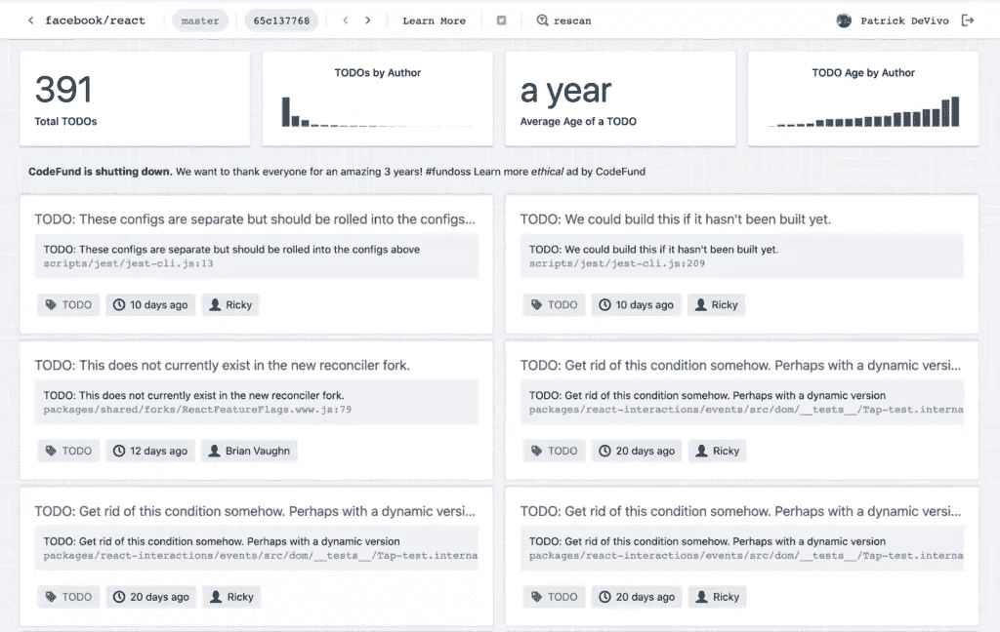
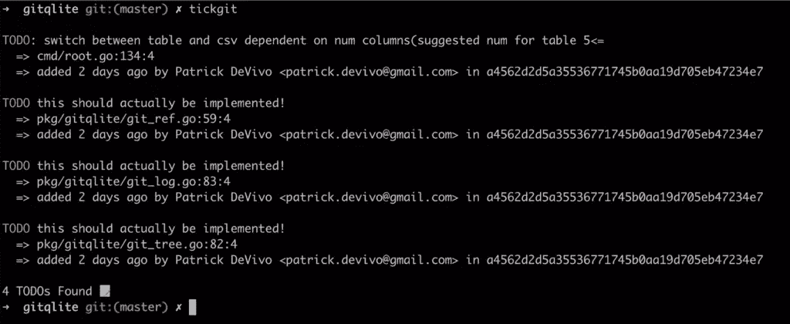
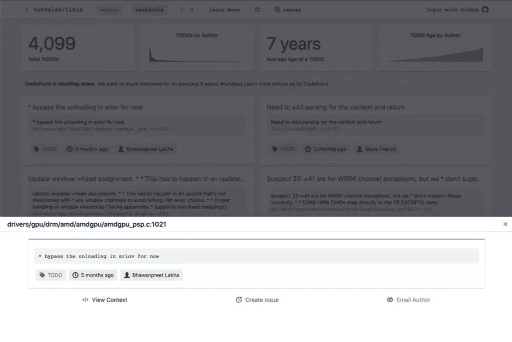

# 永远不要忘记你的回购项目经理 tickgit 的 TODO 注释

> 原文：<https://www.sitepoint.com/never-forget-a-todo-comment-with-tickgit-your-repos-project-manager/>

tickgit 是一个命令行工具和 web 应用程序，通过使用 TODO 注释和其他纯文本标记，帮助开发人员在其代码中进行项目管理。这是一种管理积压工作的低开销方式，无需切换上下文。

tickgit 扫描源代码中的 TODO 标记(以及 HACK、FIXME、XXX 等。)并将这些代码注释以标签的形式呈现，并从 Git 历史记录中获得更全面的上下文(谁添加了它，什么时候，在哪里等等)。).

我是一名独立开发人员，正在开发 tickgit 和 tickgit.com，帮助软件工程师提高他们代码的生产率。我希望你觉得这个项目有趣和有用！



* * *


这篇文章是**路线图**的一部分，我们从开发者的角度来看产品的创造和推广。我们将分享产品领导者的顶级经验，并给技术创始人一个空间来与您分享他们的早期产品。如果你有兴趣成为特色，[让我们知道](https://sitepoint.typeform.com/to/dDQrtqzy)。

* * *

## 为什么？

项目管理是软件开发的一个重要部分，即使对于单独开发一个附带项目的人来说也是如此。大量现有的票务和任务管理系统帮助团队和个人真正彻底地跟踪未完成的工作。不过，有时候，在代码库中使用 TODO 注释和其他标记*最终会成为一种更有效的方式来记录需要完成的工作。*

## 为什么// TODO 注释？

TODO 注释(或 FIXME、HACK、OPTIMIZE、XXX 等。)是开发人员表示某个代码区域值得处理和返回的一种常见方式。Linux 代码库有 4k+的这类评论， [Kubernetes](https://www.tickgit.com/browse?repo=github.com/kubernetes/kubernetes) 有 2k+。

如果[这种](https://github.com/facebook/react/blob/65c137768abf696ee1c79a026d6df3a166dd8553/packages/react-interactions/events/src/dom/__tests__/Tap-test.internal.js#L331)东西很常见，那么你肯定以前见过或用过它们:

```
 // TODO: Get rid of this condition somehow. Perhaps with a dynamic version
    // of the @gate pragma. 
```

### TODOs 很容易

待办事项很容易添加和删除。你不需要离开你的编辑。它们是明文。您可以包含附加信息的链接。它们很灵活。你甚至可以使用表情符号😀✏️.您不会受到外部售票系统的现场要求的限制。在描述为什么要注释某个代码区域时，你可以尽可能地全面或简洁。

### 没有上下文切换

待办事项就在它们所描述的代码旁边，这意味着你不会丢失代码库的上下文:周围的类、函数、变量等等。使用外部票证系统需要您在试图理解票证和相关代码时转换焦点，或者进行大量的上下文复制来帮助澄清您的任务。

当你写代码时，待办事项允许你保持你的流程，并且通常比在外部系统中来回切换更少的精神负担。当然，如果需要的话，待办事项可以链接到一个现有的标签来获得更多的信息。

### 用你的代码跟踪

因为 TODO 注释是代码的一部分，所以它们存储在版本控制中。它们可以在您的 PRs 中接受代码审查。它们有历史，可以归因于作者、版本和提交。这可以使项目管理意识到关于燃尽、团队责任、技术债务、开发效率等的报告。

## 命令行工具

tickgit 命令行工具是一个开源项目，它扫描 git 代码库，寻找 TODO 注释。它运行一个 Git 责备并输出引用文件路径和行号的结果。

它可以用于查询开放的 TODO 注释，并支持 CSV 输出供其他工具(电子表格、文本处理器等)使用。).

下面是一个输出示例:



CLI 目前非常简单，但计划进行改进以支持更多使用情形，包括:

*   自定义要匹配的短语(不匹配 XXX，但匹配注释中的`@TODO`)
*   查询和过滤(显示本周添加的所有待办事项，只显示我的，等等。)
*   按作者的聚集查询计数、按作者的平均年龄等。
*   如果满足某些标准(在某些分支中没有待办事项，每个作者最多 5 个待办事项，等等)，CI 模式将失败并出现错误。)
*   提取链接和定制的注释解析(提取受托人、截止日期等。)

## tickgit.com

tickgit web 应用程序是一个 SaaS，目前与 GitHub 集成在一起。它可以免费(不需要注册)用于公共存储库。您可以查看开放的待办事项评论，以及一些汇总统计数据，包括按作者统计的图表和按作者统计的平均年龄。

每个 TODO 注释都显示为一张卡片，显示与 CLI 类似的信息。点击会将你带到 GitHub UI 中 TODO 注释的文件和行。



私人存储库每月收费 3 美元(针对个人)。免费版(公共回购)的所有功能都在私人回购的付费版中。

正在进行的一些改进包括:

*   订阅存储库的待办事项注释，作为每周电子邮件摘要
*   改进的查询和过滤(查找我的待办事项、日期之前的待办事项等。)
*   支持更多的 Git 主机(GitLab、BitBucket、sourcehut 等。)
*   更好地与第三方工具集成，如 Trello、吉拉和 Slack

前往[tickgit.com](https://www.tickgit.com/),在你的一个公开回购上试驾一下。我希望你会惊讶地发现，你可以更有效地处理那些你自己都不知道的积压工作！

## 分享这篇文章